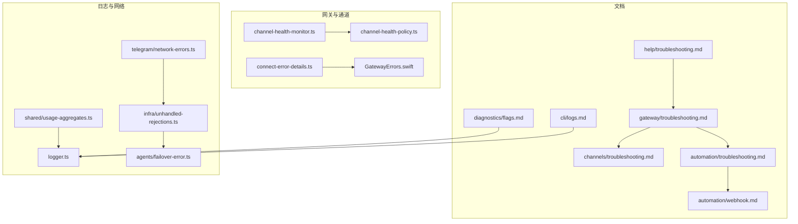
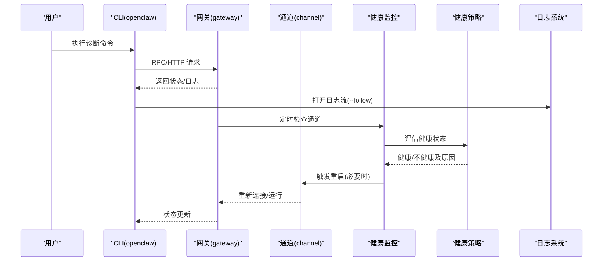
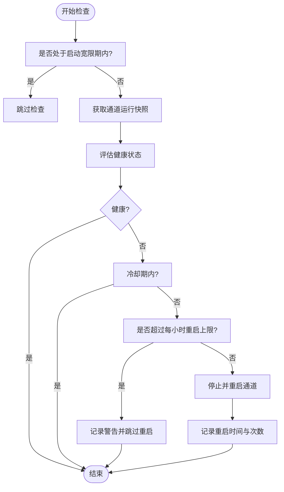
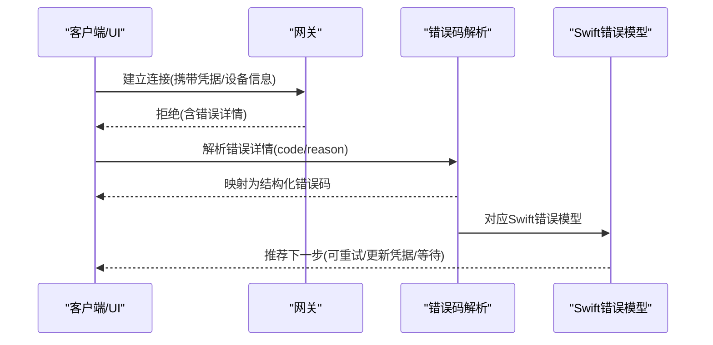
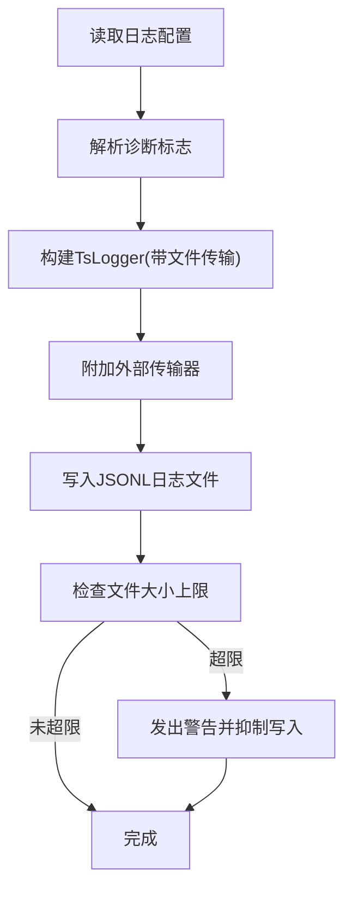
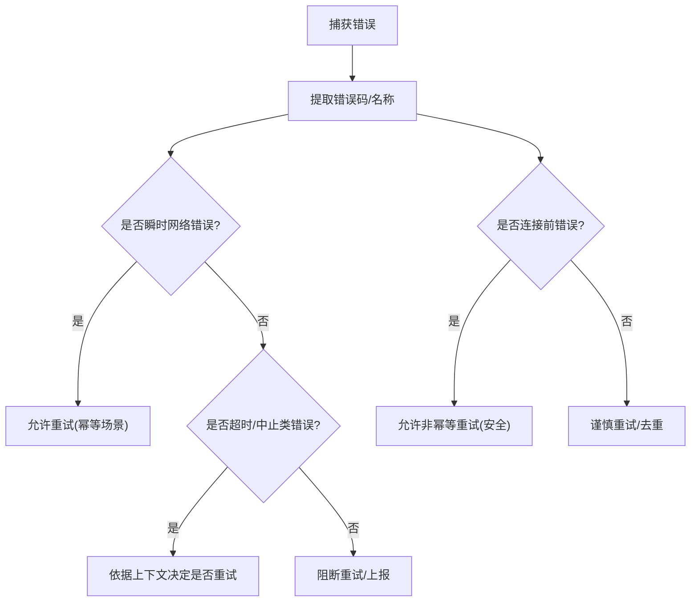
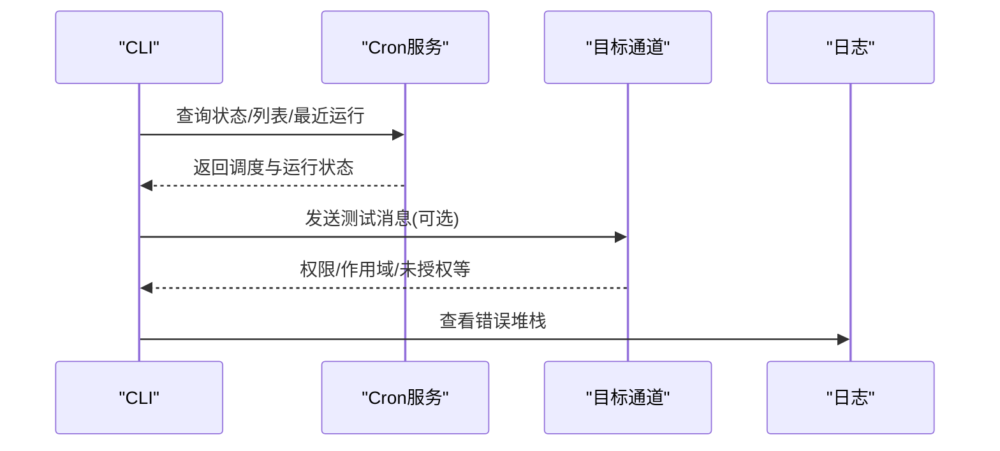
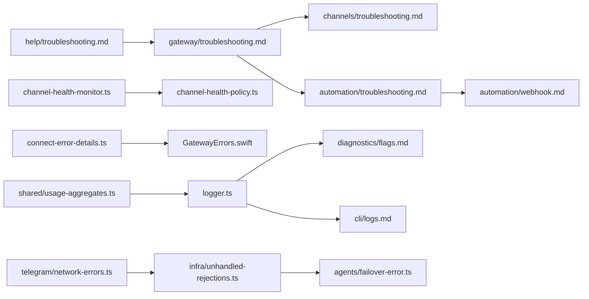

# 渠道故障排除

<cite>
**本文引用的文件**
- [docs/help/troubleshooting.md](file://docs/help/troubleshooting.md)
- [docs/gateway/troubleshooting.md](file://docs/gateway/troubleshooting.md)
- [docs/channels/troubleshooting.md](file://docs/channels/troubleshooting.md)
- [docs/automation/troubleshooting.md](file://docs/automation/troubleshooting.md)
- [docs/automation/webhook.md](file://docs/automation/webhook.md)
- [docs/diagnostics/flags.md](file://docs/diagnostics/flags.md)
- [docs/cli/logs.md](file://docs/cli/logs.md)
- [src/gateway/channel-health-monitor.ts](file://src/gateway/channel-health-monitor.ts)
- [src/gateway/channel-health-policy.ts](file://src/gateway/channel-health-policy.ts)
- [src/gateway/protocol/connect-error-details.ts](file://src/gateway/protocol/connect-error-details.ts)
- [apps/shared/OpenClawKit/Sources/OpenClawKit/GatewayErrors.swift](file://apps/shared/OpenClawKit/Sources/OpenClawKit/GatewayErrors.swift)
- [src/logging/logger.ts](file://src/logging/logger.ts)
- [src/infra/unhandled-rejections.ts](file://src/infra/unhandled-rejections.ts)
- [src/agents/failover-error.ts](file://src/agents/failover-error.ts)
- [src/telegram/network-errors.ts](file://src/telegram/network-errors.ts)
- [src/shared/usage-aggregates.ts](file://src/shared/usage-aggregates.ts)
</cite>

## 目录
1. [简介](#简介)
2. [项目结构](#项目结构)
3. [核心组件](#核心组件)
4. [架构总览](#架构总览)
5. [详细组件分析](#详细组件分析)
6. [依赖关系分析](#依赖关系分析)
7. [性能考量](#性能考量)
8. [故障排除指南](#故障排除指南)
9. [结论](#结论)
10. [附录](#附录)

## 简介
本指南面向渠道集成的运维与开发人员，提供系统化的故障排除方法与实践。内容覆盖日志分析、状态检查、网络诊断、常见问题（连接失败、消息丢失、认证错误）的定位与修复，渠道特定错误码与异常解读，以及性能问题的诊断与优化（延迟、吞吐量、资源使用）。同时给出自动化监控与告警配置建议，帮助在生产环境中实现稳定可靠的渠道运行。

## 项目结构
围绕“渠道故障排除”的关键文档与代码主要分布在以下区域：
- 故障排除与诊断文档：help、gateway、channels、automation、diagnostics、cli/logs
- 渠道健康监控与策略：channel-health-monitor、channel-health-policy
- 连接错误细节解析：connect-error-details、GatewayErrors.swift
- 日志系统：logger
- 网络与超时错误分类：unhandled-rejections、failover-error、telegram/network-errors
- 性能聚合：usage-aggregates

**图表来源**
- [docs/help/troubleshooting.md](file://docs/help/troubleshooting.md)
- [docs/gateway/troubleshooting.md](file://docs/gateway/troubleshooting.md)
- [docs/channels/troubleshooting.md](file://docs/channels/troubleshooting.md)
- [docs/automation/troubleshooting.md](file://docs/automation/troubleshooting.md)
- [docs/automation/webhook.md](file://docs/automation/webhook.md)
- [docs/diagnostics/flags.md](file://docs/diagnostics/flags.md)
- [docs/cli/logs.md](file://docs/cli/logs.md)
- [src/gateway/channel-health-monitor.ts](file://src/gateway/channel-health-monitor.ts)
- [src/gateway/channel-health-policy.ts](file://src/gateway/channel-health-policy.ts)
- [src/gateway/protocol/connect-error-details.ts](file://src/gateway/protocol/connect-error-details.ts)
- [apps/shared/OpenClawKit/Sources/OpenClawKit/GatewayErrors.swift](file://apps/shared/OpenClawKit/Sources/OpenClawKit/GatewayErrors.swift)
- [src/logging/logger.ts](file://src/logging/logger.ts)
- [src/infra/unhandled-rejections.ts](file://src/infra/unhandled-rejections.ts)
- [src/agents/failover-error.ts](file://src/agents/failover-error.ts)
- [src/telegram/network-errors.ts](file://src/telegram/network-errors.ts)
- [src/shared/usage-aggregates.ts](file://src/shared/usage-aggregates.ts)

**章节来源**
- [docs/help/troubleshooting.md:1-299](file://docs/help/troubleshooting.md#L1-L299)
- [docs/gateway/troubleshooting.md:1-380](file://docs/gateway/troubleshooting.md#L1-L380)
- [docs/channels/troubleshooting.md:1-118](file://docs/channels/troubleshooting.md#L1-L118)
- [docs/automation/troubleshooting.md:1-123](file://docs/automation/troubleshooting.md#L1-L123)
- [docs/automation/webhook.md:1-216](file://docs/automation/webhook.md#L1-L216)
- [docs/diagnostics/flags.md:1-92](file://docs/diagnostics/flags.md#L1-L92)
- [docs/cli/logs.md:1-29](file://docs/cli/logs.md#L1-L29)

## 核心组件
- 健康监控与重启机制：周期性评估通道健康状态，对“半死连接”等异常进行自动重启，避免静默失败。
- 错误码与恢复建议：统一解析连接阶段的认证/设备错误码，提供可执行的下一步操作。
- 日志系统：滚动文件日志、JSONL 输出、敏感信息脱敏、外部传输器支持。
- 网络与超时分类：区分瞬时网络错误与幂等/非幂等重试场景，避免重复投递。
- 自动化调度与交付：心跳与定时任务的运行状态、交付目标与权限校验。
- 性能聚合：延迟统计（均值、最小、最大、P95）与按日聚合，便于趋势分析。

**章节来源**
- [src/gateway/channel-health-monitor.ts:76-201](file://src/gateway/channel-health-monitor.ts#L76-L201)
- [src/gateway/channel-health-policy.ts:57-149](file://src/gateway/channel-health-policy.ts#L57-L149)
- [src/gateway/protocol/connect-error-details.ts:51-113](file://src/gateway/protocol/connect-error-details.ts#L51-L113)
- [apps/shared/OpenClawKit/Sources/OpenClawKit/GatewayErrors.swift:31-115](file://apps/shared/OpenClawKit/Sources/OpenClawKit/GatewayErrors.swift#L31-L115)
- [src/logging/logger.ts:15-348](file://src/logging/logger.ts#L15-L348)
- [src/infra/unhandled-rejections.ts:138-172](file://src/infra/unhandled-rejections.ts#L138-L172)
- [src/agents/failover-error.ts:151-209](file://src/agents/failover-error.ts#L151-L209)
- [src/telegram/network-errors.ts:1-51](file://src/telegram/network-errors.ts#L1-L51)
- [src/shared/usage-aggregates.ts:32-66](file://src/shared/usage-aggregates.ts#L32-L66)

## 架构总览
下图展示从用户命令到日志输出、健康监控与错误解析的整体流程，以及渠道健康策略如何触发重启。

**图表来源**
- [docs/help/troubleshooting.md:13-25](file://docs/help/troubleshooting.md#L13-L25)
- [docs/cli/logs.md:19-26](file://docs/cli/logs.md#L19-L26)
- [src/gateway/channel-health-monitor.ts:99-176](file://src/gateway/channel-health-monitor.ts#L99-L176)
- [src/gateway/channel-health-policy.ts:57-132](file://src/gateway/channel-health-policy.ts#L57-L132)
- [src/logging/logger.ts:126-184](file://src/logging/logger.ts#L126-L184)

## 详细组件分析

### 组件A：通道健康监控与自动重启
- 目标：检测“半死连接”（连接仍显示已连但无事件）、启动宽限期、冷却期与每小时重启上限，防止反复重启风暴。
- 关键点：
  - 启动宽限期：避免早期异常导致误判。
  - 事件静默阈值：超过阈值判定“陈旧连接”，触发重启。
  - 冷却周期与每小时重启上限：限制重启频率。
  - 重启原因映射：根据评估结果选择“陈旧连接/断开/卡住/放弃”。

**图表来源**
- [src/gateway/channel-health-monitor.ts:99-176](file://src/gateway/channel-health-monitor.ts#L99-L176)
- [src/gateway/channel-health-policy.ts:57-149](file://src/gateway/channel-health-policy.ts#L57-L149)

**章节来源**
- [src/gateway/channel-health-monitor.ts:76-201](file://src/gateway/channel-health-monitor.ts#L76-L201)
- [src/gateway/channel-health-policy.ts:18-149](file://src/gateway/channel-health-policy.ts#L18-L149)

### 组件B：连接错误码与恢复建议
- 目标：将底层认证/设备错误映射为结构化错误码，提供“可信任重试”“更新凭据”“等待后重试”等下一步建议。
- 关键点：
  - 认证错误码：令牌缺失/不匹配、密码缺失/不匹配、速率限制、设备令牌不匹配等。
  - 设备认证错误码：设备ID不匹配、签名过期/无效、nonce 缺失/不匹配等。
  - Swift 端错误模型：GatewayConnectAuthError 提供 detailCode、recommendedNextStep、isNonRecoverable 等字段。

**图表来源**
- [src/gateway/protocol/connect-error-details.ts:51-113](file://src/gateway/protocol/connect-error-details.ts#L51-L113)
- [apps/shared/OpenClawKit/Sources/OpenClawKit/GatewayErrors.swift:31-115](file://apps/shared/OpenClawKit/Sources/OpenClawKit/GatewayErrors.swift#L31-L115)

**章节来源**
- [src/gateway/protocol/connect-error-details.ts:51-113](file://src/gateway/protocol/connect-error-details.ts#L51-L113)
- [apps/shared/OpenClawKit/Sources/OpenClawKit/GatewayErrors.swift:31-115](file://apps/shared/OpenClawKit/Sources/OpenClawKit/GatewayErrors.swift#L31-L115)

### 组件C：日志系统与诊断标志
- 目标：提供可选的子系统诊断标志，仅输出目标模块日志，避免全局高噪声；支持 JSONL 文件滚动与敏感信息脱敏。
- 关键点：
  - 通过配置或环境变量启用诊断标志，支持通配符。
  - 默认滚动日志文件路径与大小限制，定期清理过期日志。
  - 支持注册外部传输器，将日志转发至外部系统。

**图表来源**
- [src/logging/logger.ts:73-184](file://src/logging/logger.ts#L73-L184)
- [docs/diagnostics/flags.md:13-92](file://docs/diagnostics/flags.md#L13-L92)

**章节来源**
- [src/logging/logger.ts:15-348](file://src/logging/logger.ts#L15-L348)
- [docs/diagnostics/flags.md:1-92](file://docs/diagnostics/flags.md#L1-L92)

### 组件D：网络与超时错误分类
- 目标：区分瞬时网络错误与可能引发重复投递的错误，指导幂等/非幂等重试策略。
- 关键点：
  - 瞬时网络错误集合：DNS 失败、网络不可达、连接超时/中止、底层网络错误等。
  - 非幂等发送的安全重试：仅在“连接前”失败才允许重试，避免重复消息。
  - 超时错误识别：名称与消息模式匹配，辅助故障转移决策。

**图表来源**
- [src/infra/unhandled-rejections.ts:147-172](file://src/infra/unhandled-rejections.ts#L147-L172)
- [src/agents/failover-error.ts:151-209](file://src/agents/failover-error.ts#L151-L209)
- [src/telegram/network-errors.ts:8-51](file://src/telegram/network-errors.ts#L8-L51)

**章节来源**
- [src/infra/unhandled-rejections.ts:138-172](file://src/infra/unhandled-rejections.ts#L138-L172)
- [src/agents/failover-error.ts:151-209](file://src/agents/failover-error.ts#L151-L209)
- [src/telegram/network-errors.ts:1-51](file://src/telegram/network-errors.ts#L1-L51)

### 组件E：自动化调度与交付
- 目标：定位定时任务与心跳未触发或未送达的问题，检查调度器状态、交付目标与权限。
- 关键点：
  - cron 状态、作业列表、最近运行历史。
  - 心跳活跃时段、并发请求占用、可见性设置。
  - 交付失败常见原因：未授权、缺少作用域、不在频道内、401/403。

**图表来源**
- [docs/automation/troubleshooting.md:24-123](file://docs/automation/troubleshooting.md#L24-L123)

**章节来源**
- [docs/automation/troubleshooting.md:1-123](file://docs/automation/troubleshooting.md#L1-L123)

## 依赖关系分析
- 文档层：help/troubleshooting 作为入口，引导到 gateway/troubleshooting、channels/troubleshooting、automation/troubleshooting；diagnostics/flags 与 cli/logs 为日志与诊断工具链。
- 代码层：channel-health-monitor 依赖 channel-health-policy；connect-error-details 与 Swift 错误模型协同；logger 为所有组件提供统一日志；unhandled-rejections 与 failover-error 协助网络错误分类；telegram/network-errors 为特定渠道网络错误提供分类基础；usage-aggregates 用于延迟统计与趋势分析。

**图表来源**
- [docs/help/troubleshooting.md](file://docs/help/troubleshooting.md)
- [docs/gateway/troubleshooting.md](file://docs/gateway/troubleshooting.md)
- [docs/channels/troubleshooting.md](file://docs/channels/troubleshooting.md)
- [docs/automation/troubleshooting.md](file://docs/automation/troubleshooting.md)
- [docs/automation/webhook.md](file://docs/automation/webhook.md)
- [docs/diagnostics/flags.md](file://docs/diagnostics/flags.md)
- [docs/cli/logs.md](file://docs/cli/logs.md)
- [src/gateway/channel-health-monitor.ts](file://src/gateway/channel-health-monitor.ts)
- [src/gateway/channel-health-policy.ts](file://src/gateway/channel-health-policy.ts)
- [src/gateway/protocol/connect-error-details.ts](file://src/gateway/protocol/connect-error-details.ts)
- [apps/shared/OpenClawKit/Sources/OpenClawKit/GatewayErrors.swift](file://apps/shared/OpenClawKit/Sources/OpenClawKit/GatewayErrors.swift)
- [src/logging/logger.ts](file://src/logging/logger.ts)
- [src/infra/unhandled-rejections.ts](file://src/infra/unhandled-rejections.ts)
- [src/agents/failover-error.ts](file://src/agents/failover-error.ts)
- [src/telegram/network-errors.ts](file://src/telegram/network-errors.ts)
- [src/shared/usage-aggregates.ts](file://src/shared/usage-aggregates.ts)

**章节来源**
- [docs/help/troubleshooting.md:68-88](file://docs/help/troubleshooting.md#L68-L88)
- [docs/gateway/troubleshooting.md:145-151](file://docs/gateway/troubleshooting.md#L145-L151)
- [src/gateway/channel-health-monitor.ts:76-201](file://src/gateway/channel-health-monitor.ts#L76-L201)
- [src/gateway/channel-health-policy.ts:57-149](file://src/gateway/channel-health-policy.ts#L57-L149)
- [src/gateway/protocol/connect-error-details.ts:51-113](file://src/gateway/protocol/connect-error-details.ts#L51-L113)
- [apps/shared/OpenClawKit/Sources/OpenClawKit/GatewayErrors.swift:31-115](file://apps/shared/OpenClawKit/Sources/OpenClawKit/GatewayErrors.swift#L31-L115)
- [src/logging/logger.ts:15-348](file://src/logging/logger.ts#L15-L348)
- [src/infra/unhandled-rejections.ts:138-172](file://src/infra/unhandled-rejections.ts#L138-L172)
- [src/agents/failover-error.ts:151-209](file://src/agents/failover-error.ts#L151-L209)
- [src/telegram/network-errors.ts:1-51](file://src/telegram/network-errors.ts#L1-L51)
- [src/shared/usage-aggregates.ts:32-66](file://src/shared/usage-aggregates.ts#L32-L66)

## 性能考量
- 延迟与吞吐量
  - 使用延迟聚合函数合并日度与总体延迟统计，关注均值、最小、最大与 P95，识别尾部延迟增长。
  - 结合通道健康策略中的事件静默阈值，定位“半死连接”导致的延迟放大。
- 资源使用
  - 利用日志滚动与大小限制，避免磁盘压力；结合诊断标志聚焦热点模块，减少无关噪音。
  - 在网络错误分类基础上，合理设置重试退避与幂等策略，降低不必要的重传与资源消耗。
- 可观测性
  - 通过 CLI logs 与远程 RPC 日志流，实时观察关键路径日志；配合诊断标志精准定位问题模块。

**章节来源**
- [src/shared/usage-aggregates.ts:32-66](file://src/shared/usage-aggregates.ts#L32-L66)
- [src/gateway/channel-health-policy.ts:54-55](file://src/gateway/channel-health-policy.ts#L54-L55)
- [src/logging/logger.ts:141-184](file://src/logging/logger.ts#L141-L184)
- [docs/cli/logs.md:19-26](file://docs/cli/logs.md#L19-L26)

## 故障排除指南

### 通用诊断步骤
- 快速三板斧：状态检查、网关探测、日志跟踪；随后进行通道探针与医生检查。
- 健康基线：运行时正常、RPC 探针成功、通道探针显示已连接/就绪。
- 逐步深入：先确认网关与通道整体健康，再聚焦到具体渠道或自动化模块。

**章节来源**
- [docs/help/troubleshooting.md:13-36](file://docs/help/troubleshooting.md#L13-L36)
- [docs/gateway/troubleshooting.md:14-31](file://docs/gateway/troubleshooting.md#L14-L31)

### 常见问题与修复

- 连接失败（认证/设备）
  - 现象：控制台/仪表盘无法连接、反复鉴权失败、设备身份/签名错误。
  - 诊断：查看连接错误详情码与建议；确认共享令牌/设备令牌一致性；核对设备配对状态。
  - 修复：更新令牌、重新配对设备、遵循“可信任重试”提示；必要时轮换设备令牌。

  **章节来源**
  - [docs/gateway/troubleshooting.md:120-130](file://docs/gateway/troubleshooting.md#L120-L130)
  - [src/gateway/protocol/connect-error-details.ts:51-113](file://src/gateway/protocol/connect-error-details.ts#L51-L113)
  - [apps/shared/OpenClawKit/Sources/OpenClawKit/GatewayErrors.swift:92-107](file://apps/shared/OpenClawKit/Sources/OpenClawKit/GatewayErrors.swift#L92-L107)

- 消息丢失/未送达
  - 现象：通道已连接但无回复、群组消息被忽略、DM 被阻止。
  - 诊断：检查配对状态、提及要求、群组/频道允许清单；核对权限与作用域。
  - 修复：批准发送者、调整 DM 策略、放宽提及要求、加入允许清单。

  **章节来源**
  - [docs/gateway/troubleshooting.md:61-90](file://docs/gateway/troubleshooting.md#L61-L90)
  - [docs/channels/troubleshooting.md:31-118](file://docs/channels/troubleshooting.md#L31-L118)

- 渠道特定问题
  - WhatsApp：升级后白名单阻断、随机断线重登；优先检查配对与凭证目录。
  - Telegram：发送失败伴随网络错误；重点排查 DNS/IPv6/代理到 api.telegram.org 的连通性。
  - Discord/Slack：Socket 模式已连但无响应；核对应用令牌/机器人令牌与所需作用域。
  - iMessage/BlueBubbles：无入站事件或 macOS 上仅能发送不能接收；检查 webhook/服务器可达性与 TCC 权限。
  - Signal/Matrix：守护进程可达但无响应、加密房间失败；核对接收模式与加密设置。

  **章节来源**
  - [docs/channels/troubleshooting.md:31-118](file://docs/channels/troubleshooting.md#L31-L118)

- 自动化调度与心跳
  - 现象：定时任务未触发、心跳被跳过、未产生外发消息。
  - 诊断：检查 cron 状态与下次唤醒时间、心跳活跃时段与并发占用；核对交付目标与权限。
  - 修复：启用调度器、修正时区与活跃时段、确保交付目标有效且有权限。

  **章节来源**
  - [docs/automation/troubleshooting.md:24-123](file://docs/automation/troubleshooting.md#L24-L123)

- 升级后突发异常
  - 现象：行为改变、URL/认证不一致、绑定与鉴权更严格。
  - 诊断：核对 gateway.mode、gateway.remote.url、gateway.auth.mode；检查绑定与鉴权配置。
  - 修复：切换到本地模式或修正远程 URL；补充缺失的鉴权参数；重新安装服务元数据。

  **章节来源**
  - [docs/gateway/troubleshooting.md:307-380](file://docs/gateway/troubleshooting.md#L307-L380)

### 日志分析与诊断标志
- 使用 openclaw logs --follow 实时追踪；必要时使用 --json 与 --local-time。
- 通过诊断标志仅输出目标子系统日志，例如 telegram.http 或 gateway.*，减少噪声。
- 在远程网关上同样可用 openclaw logs --follow 获取日志流。

**章节来源**
- [docs/cli/logs.md:19-26](file://docs/cli/logs.md#L19-L26)
- [docs/diagnostics/flags.md:13-92](file://docs/diagnostics/flags.md#L13-L92)

### 网络诊断与重试策略
- 区分瞬时网络错误与可能重复投递的错误，仅在“连接前”失败时允许非幂等重试。
- 对超时/中止类错误进行识别，结合退避策略与幂等设计，避免风暴式重试。
- 针对 Telegram 等长轮询/Webhook 模式，不适用“陈旧连接”检测，需采用其他健康信号。

**章节来源**
- [src/telegram/network-errors.ts:8-51](file://src/telegram/network-errors.ts#L8-L51)
- [src/agents/failover-error.ts:151-209](file://src/agents/failover-error.ts#L151-L209)
- [src/gateway/channel-health-policy.ts:109-130](file://src/gateway/channel-health-policy.ts#L109-L130)

### 自动化监控与告警配置
- Webhook 入口：启用 hooks.token、限定允许的 agentId 与 sessionKey 前缀，避免滥用。
- 告警与通知：利用 cron 运行历史与心跳状态，结合外部监控系统（如 Prometheus/Grafana）建立阈值告警。
- 安全：仅在受信网络暴露钩子端点，避免在公网直接开放；对重复认证失败进行速率限制。

**章节来源**
- [docs/automation/webhook.md:13-216](file://docs/automation/webhook.md#L13-L216)
- [docs/automation/troubleshooting.md:24-123](file://docs/automation/troubleshooting.md#L24-L123)

## 结论
通过“命令阶梯 + 文档导航 + 子系统诊断 + 健康监控 + 错误码解析 + 日志与网络分类”的组合，可以系统化地定位与修复渠道集成问题。建议在生产环境中：
- 开启诊断标志与远程日志流，缩短定位时间；
- 建立自动化巡检与告警，提前发现“半死连接”与异常重启；
- 严格区分幂等/非幂等重试策略，避免重复投递；
- 将心跳与定时任务纳入 SLI/SLO，持续优化延迟与吞吐。

## 附录

### 常用命令速查
- 基础诊断：status、gateway status、logs --follow、doctor、channels status --probe
- 控制台/网关：gateway probe、gateway status --json
- 自动化：cron status/list/runs、system heartbeat last
- 日志：openclaw logs --follow/--json/--limit/--local-time

**章节来源**
- [docs/help/troubleshooting.md:15-25](file://docs/help/troubleshooting.md#L15-L25)
- [docs/gateway/troubleshooting.md:14-31](file://docs/gateway/troubleshooting.md#L14-L31)
- [docs/cli/logs.md:19-26](file://docs/cli/logs.md#L19-L26)