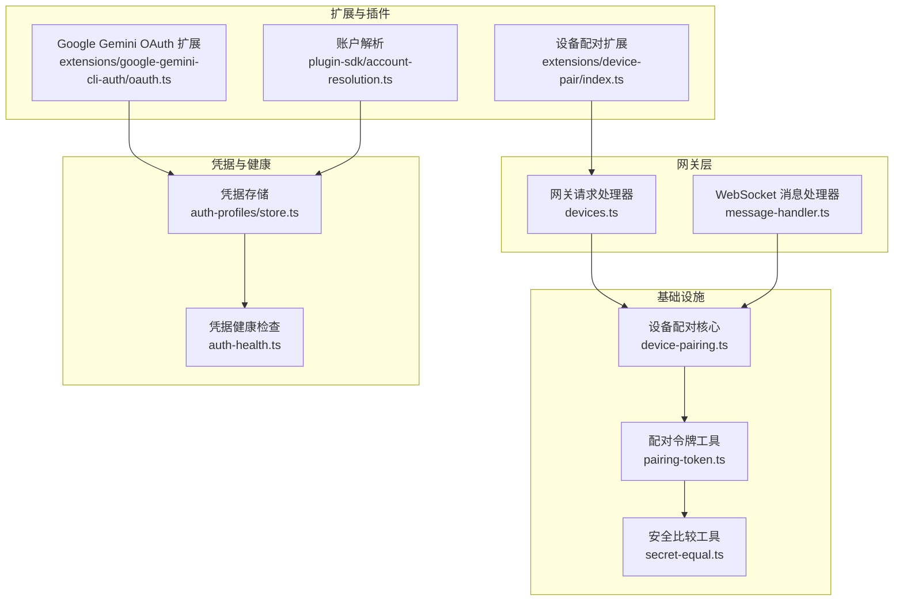
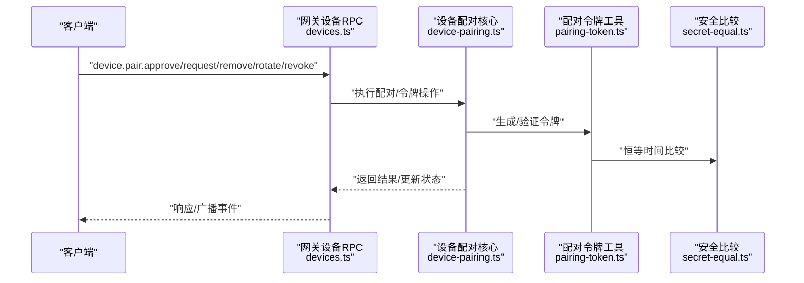
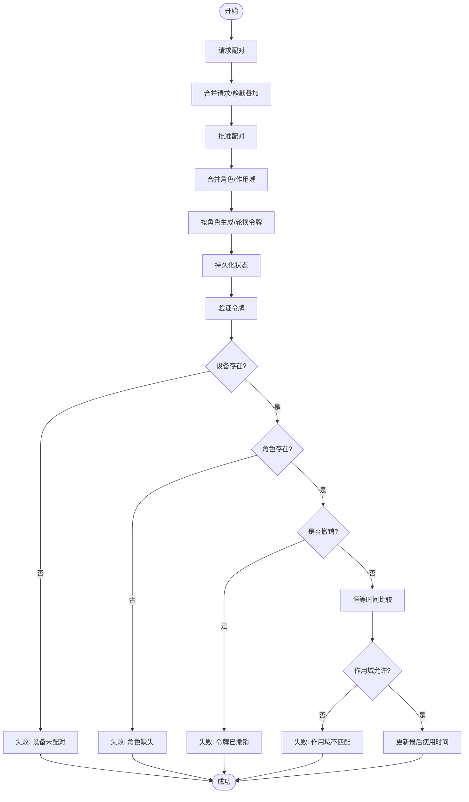
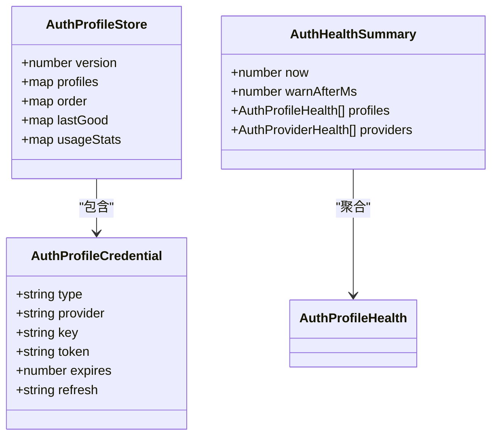
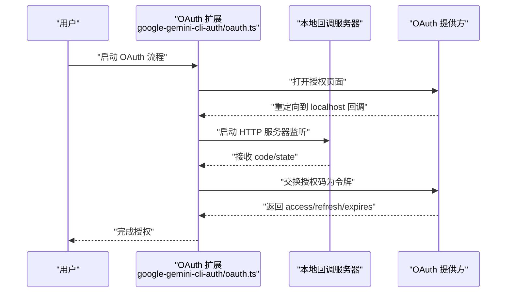
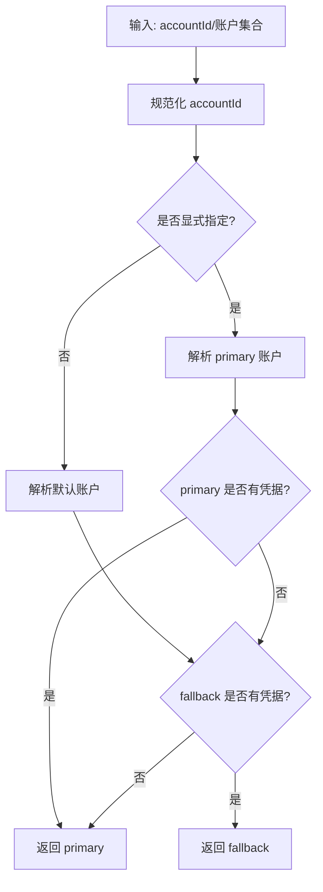
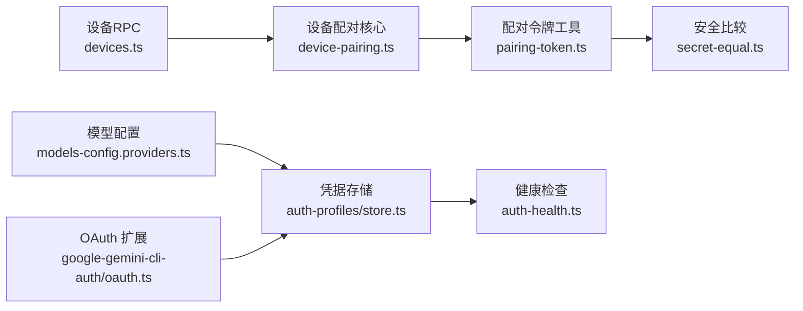

# 渠道认证配置

<cite>
**本文档引用的文件**
- [src/gateway/authentication.md](file://docs/gateway/authentication.md)
- [src/infra/device-pairing.ts](file://src/infra/device-pairing.ts)
- [src/gateway/server-methods/devices.ts](file://src/gateway/server-methods/devices.ts)
- [src/agents/auth-profiles/store.ts](file://src/agents/auth-profiles/store.ts)
- [src/agents/auth-health.ts](file://src/agents/auth-health.ts)
- [src/infra/pairing-token.ts](file://src/infra/pairing-token.ts)
- [src/security/secret-equal.ts](file://src/security/secret-equal.ts)
- [src/gateway/protocol/schema/devices.ts](file://src/gateway/protocol/schema/devices.ts)
- [src/gateway/server/ws-connection/message-handler.ts](file://src/gateway/server/ws-connection/message-handler.ts)
- [extensions/device-pair/index.ts](file://extensions/device-pair/index.ts)
- [extensions/google-gemini-cli-auth/oauth.ts](file://extensions/google-gemini-cli-auth/oauth.ts)
- [src/plugin-sdk/account-resolution.ts](file://src/plugin-sdk/account-resolution.ts)
- [src/channels/account-snapshot-fields.ts](file://src/channels/account-snapshot-fields.ts)
- [src/commands/models/list.status-command.ts](file://src/commands/models/list.status-command.ts)
- [src/agents/models-config.providers.ts](file://src/agents/models-config.providers.ts)
- [src/agents/model-auth.ts](file://src/agents/model-auth.ts)
- [src/config/types.auth.ts](file://src/config/types.auth.ts)
- [src/commands/onboard-auth.config-core.ts](file://src/commands/onboard-auth.config-core.ts)
- [src/commands/auth-choice.apply.api-providers.ts](file://src/commands/auth-choice.apply.api-providers.ts)
- [src/agents/sandbox/hash.ts](file://src/agents/sandbox/hash.ts)
- [src/infra/secure-random.test.ts](file://src/infra/secure-random.test.ts)
</cite>

## 目录
1. [简介](#简介)
2. [项目结构](#项目结构)
3. [核心组件](#核心组件)
4. [架构总览](#架构总览)
5. [详细组件分析](#详细组件分析)
6. [依赖关系分析](#依赖关系分析)
7. [性能考量](#性能考量)
8. [故障排除指南](#故障排除指南)
9. [结论](#结论)
10. [附录](#附录)

## 简介
本文件面向渠道认证配置，系统化阐述以下能力与机制：
- 认证方式：API 密钥、OAuth 流程、设备配对、令牌管理
- 存储机制：凭据存储、密钥轮换、过期处理、安全校验
- 多账户支持：账户切换、凭据隔离、上下文管理
- 故障排除：常见错误、重试策略、降级方案
- 安全最佳实践与合规性

## 项目结构
围绕认证的关键模块分布如下：
- 设备配对与令牌：设备配对状态机、令牌生成与校验、作用域与权限
- 凭据存储与健康检查：凭据存储结构、加载合并、健康度评估
- OAuth 流程与扩展：本地回调、授权码交换、刷新逻辑
- 多账户与上下文：账户解析、默认回退、账户快照
- 网关协议与接入：设备配对 RPC、握手阶段的配对要求

**图表来源**
- [src/gateway/server-methods/devices.ts:1-260](file://src/gateway/server-methods/devices.ts#L1-L260)
- [src/gateway/server/ws-connection/message-handler.ts:870-895](file://src/gateway/server/ws-connection/message-handler.ts#L870-L895)
- [src/infra/device-pairing.ts:1-654](file://src/infra/device-pairing.ts#L1-L654)
- [src/infra/pairing-token.ts:1-13](file://src/infra/pairing-token.ts#L1-L13)
- [src/security/secret-equal.ts:1-13](file://src/security/secret-equal.ts#L1-L13)
- [src/agents/auth-profiles/store.ts:1-510](file://src/agents/auth-profiles/store.ts#L1-L510)
- [src/agents/auth-health.ts:1-284](file://src/agents/auth-health.ts#L1-L284)
- [extensions/device-pair/index.ts:396-431](file://extensions/device-pair/index.ts#L396-L431)
- [extensions/google-gemini-cli-auth/oauth.ts:305-344](file://extensions/google-gemini-cli-auth/oauth.ts#L305-L344)
- [src/plugin-sdk/account-resolution.ts:1-41](file://src/plugin-sdk/account-resolution.ts#L1-L41)

**章节来源**
- [src/gateway/authentication.md:1-180](file://docs/gateway/authentication.md#L1-L180)
- [src/infra/device-pairing.ts:1-654](file://src/infra/device-pairing.ts#L1-L654)
- [src/agents/auth-profiles/store.ts:1-510](file://src/agents/auth-profiles/store.ts#L1-L510)
- [src/agents/auth-health.ts:1-284](file://src/agents/auth-health.ts#L1-L284)
- [src/infra/pairing-token.ts:1-13](file://src/infra/pairing-token.ts#L1-L13)
- [src/security/secret-equal.ts:1-13](file://src/security/secret-equal.ts#L1-L13)
- [src/gateway/server-methods/devices.ts:1-260](file://src/gateway/server-methods/devices.ts#L1-L260)
- [src/gateway/server/ws-connection/message-handler.ts:870-895](file://src/gateway/server/ws-connection/message-handler.ts#L870-L895)
- [extensions/device-pair/index.ts:396-431](file://extensions/device-pair/index.ts#L396-L431)
- [extensions/google-gemini-cli-auth/oauth.ts:305-344](file://extensions/google-gemini-cli-auth/oauth.ts#L305-L344)
- [src/plugin-sdk/account-resolution.ts:1-41](file://src/plugin-sdk/account-resolution.ts#L1-L41)

## 核心组件
- 设备配对与令牌
  - 状态文件：待批准请求、已配对设备、令牌条目
  - 令牌生成与安全比较：随机生成、恒等时间比较
  - 作用域与角色：作用域展开、角色授权校验
- 凭据存储与健康检查
  - 存储结构：版本、凭据、顺序、使用统计
  - 加载与合并：主/子代理继承、外部 CLI 同步、兼容旧格式
  - 健康度：过期/将过期/缺失/静态状态
- OAuth 流程与扩展
  - 本地回调服务器：端口监听、参数校验、错误处理
  - 授权码交换与刷新：访问令牌、刷新令牌、过期时间
- 多账户与上下文
  - 账户解析：显式 ID、默认回退、凭据可用性
  - 账户快照：凭据状态字段解析、可用性判定

**章节来源**
- [src/infra/device-pairing.ts:32-77](file://src/infra/device-pairing.ts#L32-L77)
- [src/infra/pairing-token.ts:1-13](file://src/infra/pairing-token.ts#L1-L13)
- [src/security/secret-equal.ts:1-13](file://src/security/secret-equal.ts#L1-L13)
- [src/agents/auth-profiles/store.ts:1-510](file://src/agents/auth-profiles/store.ts#L1-L510)
- [src/agents/auth-health.ts:1-284](file://src/agents/auth-health.ts#L1-L284)
- [extensions/google-gemini-cli-auth/oauth.ts:305-344](file://extensions/google-gemini-cli-auth/oauth.ts#L305-L344)
- [src/plugin-sdk/account-resolution.ts:1-41](file://src/plugin-sdk/account-resolution.ts#L1-L41)
- [src/channels/account-snapshot-fields.ts:42-78](file://src/channels/account-snapshot-fields.ts#L42-L78)

## 架构总览
下图展示从客户端发起到网关处理、再到设备配对与凭据存储的整体交互。

**图表来源**
- [src/gateway/server-methods/devices.ts:56-260](file://src/gateway/server-methods/devices.ts#L56-L260)
- [src/infra/device-pairing.ts:320-640](file://src/infra/device-pairing.ts#L320-L640)
- [src/infra/pairing-token.ts:1-13](file://src/infra/pairing-token.ts#L1-L13)
- [src/security/secret-equal.ts:1-13](file://src/security/secret-equal.ts#L1-L13)

## 详细组件分析

### 设备配对与令牌管理
- 状态模型
  - 待批准请求：包含设备标识、公钥、显示名、平台、角色、作用域、远端 IP、静默模式等
  - 已配对设备：包含设备标识、公钥、角色/作用域集合、令牌映射、时间戳
  - 令牌条目：令牌值、角色、作用域、创建/轮换/撤销/最后使用时间
- 关键流程
  - 请求配对：去重合并、静默模式叠加、超时清理
  - 批准配对：合并角色与作用域、按角色生成/轮换令牌
  - 验证令牌：设备存在性、角色存在性、未撤销、令牌恒等比较、作用域允许
  - 令牌轮换/撤销：基于批准作用域限制、原子更新持久化
- 协议与校验
  - 参数校验：TypeBox Schema 定义请求参数
  - 作用域展开：管理员/写入角色隐含读取权限
  - 握手阶段：未配对时可拒绝连接并提示需要配对

**图表来源**
- [src/infra/device-pairing.ts:272-508](file://src/infra/device-pairing.ts#L272-L508)
- [src/gateway/protocol/schema/devices.ts:1-36](file://src/gateway/protocol/schema/devices.ts#L1-L36)
- [src/gateway/server/ws-connection/message-handler.ts:870-895](file://src/gateway/server/ws-connection/message-handler.ts#L870-L895)

**章节来源**
- [src/infra/device-pairing.ts:1-654](file://src/infra/device-pairing.ts#L1-L654)
- [src/gateway/server-methods/devices.ts:1-260](file://src/gateway/server-methods/devices.ts#L1-L260)
- [src/gateway/protocol/schema/devices.ts:1-36](file://src/gateway/protocol/schema/devices.ts#L1-L36)
- [src/gateway/server/ws-connection/message-handler.ts:870-895](file://src/gateway/server/ws-connection/message-handler.ts#L870-L895)

### 凭据存储与健康检查（API 密钥、OAuth、Bearer Token）
- 存储结构与加载
  - 版本化存储：profiles、order、lastGood、usageStats
  - 兼容旧格式：从 legacy auth.json 迁移
  - 外部同步：从外部 CLI 工具同步凭据
  - 继承与合并：主代理与子代理凭据合并
- 健康度评估
  - API Key：静态凭据，视为“静态可用”
  - Token：带过期时间，按剩余时间判断状态
  - OAuth：若具备刷新令牌，首次调用自动续期，不因访问令牌过期而告警
- 配置与应用
  - 环境变量优先：提供者 API Key 解析与来源标注
  - 模型配置：从凭据存储解析 API Key，支持 SecretRef 引用

**图表来源**
- [src/agents/auth-profiles/store.ts:1-510](file://src/agents/auth-profiles/store.ts#L1-L510)
- [src/agents/auth-health.ts:1-284](file://src/agents/auth-health.ts#L1-L284)
- [src/agents/model-auth.ts:323-349](file://src/agents/model-auth.ts#L323-L349)
- [src/agents/models-config.providers.ts:301-328](file://src/agents/models-config.providers.ts#L301-L328)

**章节来源**
- [src/agents/auth-profiles/store.ts:1-510](file://src/agents/auth-profiles/store.ts#L1-L510)
- [src/agents/auth-health.ts:1-284](file://src/agents/auth-health.ts#L1-L284)
- [src/agents/model-auth.ts:312-349](file://src/agents/model-auth.ts#L312-L349)
- [src/agents/models-config.providers.ts:301-328](file://src/agents/models-config.providers.ts#L301-L328)
- [src/config/types.auth.ts:1-29](file://src/config/types.auth.ts#L1-L29)
- [src/commands/onboard-auth.config-core.ts:473-495](file://src/commands/onboard-auth.config-core.ts#L473-L495)

### OAuth 流程与扩展
- 本地回调与授权码交换
  - 监听 localhost 回调端口，校验路径、参数与错误
  - 提取 code/state，完成授权码交换，获取访问/刷新令牌与过期时间
- 扩展集成
  - 设备配对扩展：生成设置码、渲染二维码、自动通知
  - Google Gemini OAuth 扩展：封装本地回调与授权流程

**图表来源**
- [extensions/google-gemini-cli-auth/oauth.ts:305-344](file://extensions/google-gemini-cli-auth/oauth.ts#L305-L344)
- [extensions/device-pair/index.ts:406-431](file://extensions/device-pair/index.ts#L406-L431)

**章节来源**
- [extensions/google-gemini-cli-auth/oauth.ts:305-344](file://extensions/google-gemini-cli-auth/oauth.ts#L305-L344)
- [extensions/device-pair/index.ts:396-431](file://extensions/device-pair/index.ts#L396-L431)

### 多账户支持与上下文管理
- 账户解析与默认回退
  - 显式账户 ID 优先；若无凭据则回退到默认账户
  - 支持列表化账户、联合动作门控
- 账户快照与凭据状态
  - 解析账户快照中的凭据状态字段，判断“可用/配置但不可用/缺失”
- 模型状态与 OAuth 列表
  - 汇总 OAuth 与 Token 类型的配置数量，构建健康摘要

**图表来源**
- [src/plugin-sdk/account-resolution.ts:1-41](file://src/plugin-sdk/account-resolution.ts#L1-L41)
- [src/channels/account-snapshot-fields.ts:42-78](file://src/channels/account-snapshot-fields.ts#L42-L78)
- [src/commands/models/list.status-command.ts:259-278](file://src/commands/models/list.status-command.ts#L259-L278)

**章节来源**
- [src/plugin-sdk/account-resolution.ts:1-41](file://src/plugin-sdk/account-resolution.ts#L1-L41)
- [src/channels/account-snapshot-fields.ts:42-78](file://src/channels/account-snapshot-fields.ts#L42-L78)
- [src/commands/models/list.status-command.ts:259-278](file://src/commands/models/list.status-command.ts#L259-L278)

## 依赖关系分析
- 组件耦合
  - 网关设备 RPC 依赖设备配对核心；设备配对核心依赖配对令牌工具与安全比较
  - 凭据健康检查依赖凭据存储；模型配置依赖凭据存储与环境变量解析
  - 扩展通过网关接口或命令行与主流程集成
- 外部依赖
  - TypeBox Schema 用于参数校验
  - Node Crypto 用于随机数、哈希与恒等时间比较
  - 文件锁与 JSON 原子写入保证并发安全

**图表来源**
- [src/gateway/server-methods/devices.ts:1-260](file://src/gateway/server-methods/devices.ts#L1-L260)
- [src/infra/device-pairing.ts:1-654](file://src/infra/device-pairing.ts#L1-L654)
- [src/infra/pairing-token.ts:1-13](file://src/infra/pairing-token.ts#L1-L13)
- [src/security/secret-equal.ts:1-13](file://src/security/secret-equal.ts#L1-L13)
- [src/agents/auth-profiles/store.ts:1-510](file://src/agents/auth-profiles/store.ts#L1-L510)
- [src/agents/auth-health.ts:1-284](file://src/agents/auth-health.ts#L1-L284)
- [src/agents/models-config.providers.ts:301-328](file://src/agents/models-config.providers.ts#L301-L328)
- [extensions/google-gemini-cli-auth/oauth.ts:305-344](file://extensions/google-gemini-cli-auth/oauth.ts#L305-L344)

**章节来源**
- [src/gateway/server-methods/devices.ts:1-260](file://src/gateway/server-methods/devices.ts#L1-L260)
- [src/infra/device-pairing.ts:1-654](file://src/infra/device-pairing.ts#L1-L654)
- [src/infra/pairing-token.ts:1-13](file://src/infra/pairing-token.ts#L1-L13)
- [src/security/secret-equal.ts:1-13](file://src/security/secret-equal.ts#L1-L13)
- [src/agents/auth-profiles/store.ts:1-510](file://src/agents/auth-profiles/store.ts#L1-L510)
- [src/agents/auth-health.ts:1-284](file://src/agents/auth-health.ts#L1-L284)
- [src/agents/models-config.providers.ts:301-328](file://src/agents/models-config.providers.ts#L301-L328)
- [extensions/google-gemini-cli-auth/oauth.ts:305-344](file://extensions/google-gemini-cli-auth/oauth.ts#L305-L344)

## 性能考量
- 并发与锁
  - 设备配对与凭据存储均采用文件锁，避免竞态
  - JSON 原子写入减少损坏风险
- 锁定范围
  - 设备配对：请求/批准/轮换/撤销均在锁内执行
  - 凭据存储：读写均在锁内进行
- 时间敏感
  - 恒等时间比较避免侧信道泄露
  - 令牌轮换仅在必要时进行，降低频繁写入

[本节为通用指导，无需特定文件来源]

## 故障排除指南
- 常见错误
  - 设备未配对：握手阶段拒绝连接并提示需要配对
  - 角色缺失/令牌缺失/令牌已撤销/作用域不匹配：验证失败原因
  - 无凭据：检查凭据存储、环境变量、外部 CLI 同步
  - OAuth 过期/将过期：使用健康检查命令查看状态
- 重试策略
  - API Key：按优先级顺序重试，仅在限流错误时切换备用 Key
  - OAuth：具备刷新令牌时自动续期，首次调用失败后重试
- 降级方案
  - 使用默认账户回退
  - 从主代理继承凭据至子代理
  - 通过环境变量或 SecretRef 提供凭据

**章节来源**
- [src/gateway/server/ws-connection/message-handler.ts:870-895](file://src/gateway/server/ws-connection/message-handler.ts#L870-L895)
- [src/infra/device-pairing.ts:470-508](file://src/infra/device-pairing.ts#L470-L508)
- [src/agents/auth-health.ts:165-197](file://src/agents/auth-health.ts#L165-L197)
- [src/gateway/authentication.md:160-179](file://docs/gateway/authentication.md#L160-L179)
- [src/commands/models/list.status-command.ts:259-278](file://src/commands/models/list.status-command.ts#L259-L278)

## 结论
本认证体系以“设备配对 + 凭据存储 + OAuth/Key 管理”为核心，结合严格的并发控制与安全校验，提供了可扩展、可观测且易于运维的多账户认证方案。通过明确的作用域与令牌生命周期管理，以及完善的健康检查与故障恢复机制，能够满足长期运行场景下的稳定性与安全性需求。

[本节为总结，无需特定文件来源]

## 附录

### 安全最佳实践与合规性
- 令牌生成
  - 使用安全随机源生成配对令牌，长度符合安全要求
  - 恒等时间比较防止时序攻击
- 凭据存储
  - 优先使用 SecretRef 引用，避免明文写入
  - 仅在必要时持久化凭据，最小化暴露面
- 网络与协议
  - 本地回调仅监听 localhost，避免公网暴露
  - 严格参数校验与作用域展开，防止越权
- 合规性建议
  - 定期轮换令牌与密钥
  - 审计日志记录关键操作（批准/轮换/撤销）
  - 限制作用域与角色，遵循最小权限原则

**章节来源**
- [src/infra/secure-random.test.ts:1-20](file://src/infra/secure-random.test.ts#L1-L20)
- [src/infra/pairing-token.ts:1-13](file://src/infra/pairing-token.ts#L1-L13)
- [src/security/secret-equal.ts:1-13](file://src/security/secret-equal.ts#L1-L13)
- [src/gateway/protocol/schema/devices.ts:1-36](file://src/gateway/protocol/schema/devices.ts#L1-L36)
- [src/agents/auth-profiles/store.ts:484-509](file://src/agents/auth-profiles/store.ts#L484-L509)