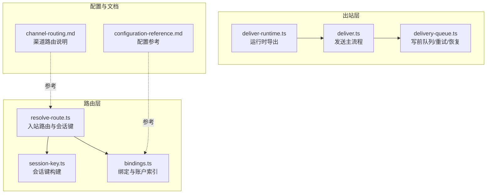
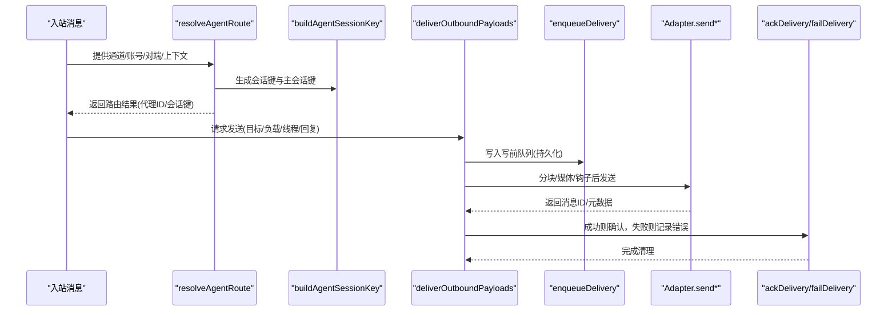
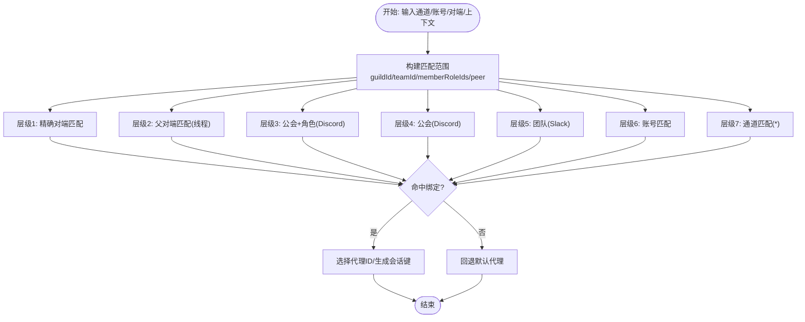
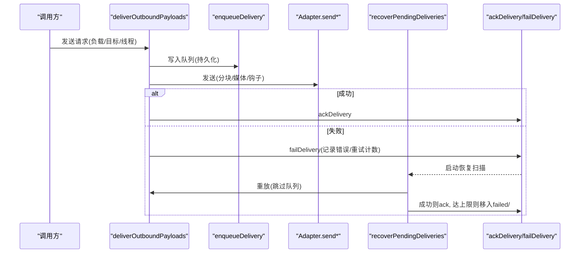
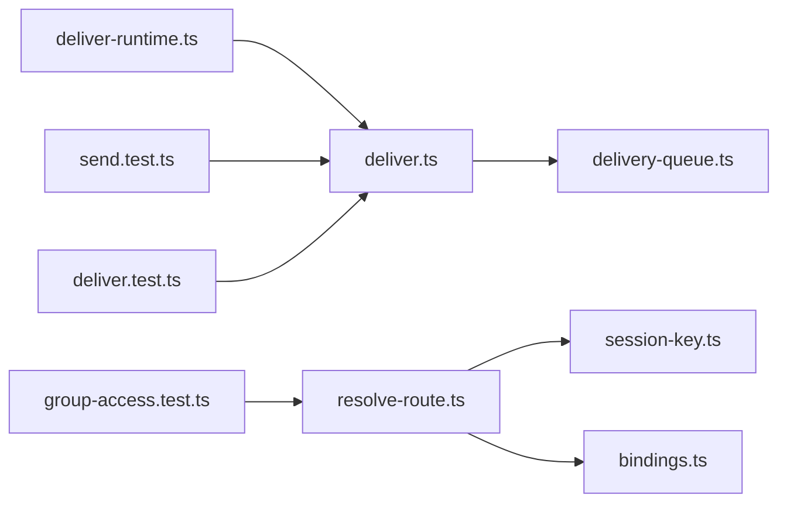

# 渠道路由机制

<cite>
**本文引用的文件**
- [src/routing/resolve-route.ts](file://src/routing/resolve-route.ts)
- [src/routing/bindings.ts](file://src/routing/bindings.ts)
- [src/routing/session-key.ts](file://src/routing/session-key.ts)
- [src/infra/outbound/deliver.ts](file://src/infra/outbound/deliver.ts)
- [src/infra/outbound/delivery-queue.ts](file://src/infra/outbound/delivery-queue.ts)
- [src/infra/outbound/deliver-runtime.ts](file://src/infra/outbound/deliver-runtime.ts)
- [docs/channels/channel-routing.md](file://docs/channels/channel-routing.md)
- [docs/gateway/configuration-reference.md](file://docs/gateway/configuration-reference.md)
- [src/gateway/server-methods/send.test.ts](file://src/gateway/server-methods/send.test.ts)
- [src/infra/outbound/deliver.test.ts](file://src/infra/outbound/deliver.test.ts)
- [src/plugin-sdk/group-access.test.ts](file://src/plugin-sdk/group-access.test.ts)
- [src/auto-reply/reply/dispatch-acp-delivery.test.ts](file://src/auto-reply/reply/dispatch-acp-delivery.test.ts)
</cite>

## 目录
1. [简介](#简介)
2. [项目结构](#项目结构)
3. [核心组件](#核心组件)
4. [架构总览](#架构总览)
5. [详细组件分析](#详细组件分析)
6. [依赖关系分析](#依赖关系分析)
7. [性能考量](#性能考量)
8. [故障排查指南](#故障排查指南)
9. [结论](#结论)
10. [附录](#附录)

## 简介
本文件系统化阐述 OpenClaw 的渠道路由机制，覆盖入站消息路由算法（会话匹配、目标解析与优先级排序）、出站消息发送策略（负载均衡、故障转移与重试）、多渠道协调（消息同步、状态一致性与冲突解决），以及路由配置指南（允许列表、阻止列表与自定义路由规则）。同时提供性能监控与故障诊断方法，帮助读者在生产环境中稳定、可观察地使用该机制。

## 项目结构
OpenClaw 的路由与出站发送能力主要分布在以下模块：
- 路由核心：负责入站消息到代理与会话的确定性映射
  - 入站路由与会话键构建：src/routing/resolve-route.ts、src/routing/session-key.ts
  - 绑定与账户索引：src/routing/bindings.ts
- 出站发送与队列：负责将回复内容按渠道适配并可靠投递
  - 发送主流程：src/infra/outbound/deliver.ts
  - 写前队列与重试恢复：src/infra/outbound/delivery-queue.ts
  - 运行时入口：src/infra/outbound/deliver-runtime.ts
- 文档与配置参考：docs/channels/channel-routing.md、docs/gateway/configuration-reference.md
- 测试用例：验证路由行为、出站发送与错误处理

图表来源
- [src/routing/resolve-route.ts:614-800](file://src/routing/resolve-route.ts#L614-L800)
- [src/routing/session-key.ts:118-174](file://src/routing/session-key.ts#L118-L174)
- [src/routing/bindings.ts:17-115](file://src/routing/bindings.ts#L17-L115)
- [src/infra/outbound/deliver.ts:470-528](file://src/infra/outbound/deliver.ts#L470-L528)
- [src/infra/outbound/delivery-queue.ts:109-136](file://src/infra/outbound/delivery-queue.ts#L109-L136)
- [src/infra/outbound/deliver-runtime.ts:1-1](file://src/infra/outbound/deliver-runtime.ts#L1-L1)
- [docs/channels/channel-routing.md:1-135](file://docs/channels/channel-routing.md#L1-L135)
- [docs/gateway/configuration-reference.md:1-800](file://docs/gateway/configuration-reference.md#L1-L800)

章节来源
- [src/routing/resolve-route.ts:614-800](file://src/routing/resolve-route.ts#L614-L800)
- [src/routing/session-key.ts:118-174](file://src/routing/session-key.ts#L118-L174)
- [src/routing/bindings.ts:17-115](file://src/routing/bindings.ts#L17-L115)
- [src/infra/outbound/deliver.ts:470-528](file://src/infra/outbound/deliver.ts#L470-L528)
- [src/infra/outbound/delivery-queue.ts:109-136](file://src/infra/outbound/delivery-queue.ts#L109-L136)
- [docs/channels/channel-routing.md:1-135](file://docs/channels/channel-routing.md#L1-L135)
- [docs/gateway/configuration-reference.md:1-800](file://docs/gateway/configuration-reference.md#L1-L800)

## 核心组件
- 入站路由与会话键
  - resolveAgentRoute：根据通道、账号、对端、公会/团队、角色等约束，按层级优先级匹配绑定，选择代理并生成会话键
  - buildAgentSessionKey/buildAgentPeerSessionKey：基于代理ID、通道、账号、对端类型与ID、身份链接与DM作用域，构建确定性会话键
  - listBindings/listBoundAccountIds：列出绑定并解析可用账户集合
- 出站发送与可靠性
  - deliverOutboundPayloads：标准化负载、调用插件适配器、分块/媒体发送、触发钩子、写入写前队列并异步确认或失败
  - delivery-queue：持久化队列、指数退避重试、最大重试次数、失败迁移、启动恢复扫描
  - 运行时导出：deliver-runtime.ts 将 deliverOutboundPayloads 暴露为运行时接口

章节来源
- [src/routing/resolve-route.ts:614-800](file://src/routing/resolve-route.ts#L614-L800)
- [src/routing/session-key.ts:118-174](file://src/routing/session-key.ts#L118-L174)
- [src/routing/bindings.ts:17-115](file://src/routing/bindings.ts#L17-L115)
- [src/infra/outbound/deliver.ts:470-528](file://src/infra/outbound/deliver.ts#L470-L528)
- [src/infra/outbound/delivery-queue.ts:109-136](file://src/infra/outbound/delivery-queue.ts#L109-L136)
- [src/infra/outbound/deliver-runtime.ts:1-1](file://src/infra/outbound/deliver-runtime.ts#L1-L1)

## 架构总览
下图展示从入站到出站的关键交互：入站消息经路由解析得到代理与会话键，随后通过插件适配器向各渠道发送，并以写前队列保证可靠性。

图表来源
- [src/routing/resolve-route.ts:614-692](file://src/routing/resolve-route.ts#L614-L692)
- [src/routing/session-key.ts:118-174](file://src/routing/session-key.ts#L118-L174)
- [src/infra/outbound/deliver.ts:470-528](file://src/infra/outbound/deliver.ts#L470-L528)
- [src/infra/outbound/delivery-queue.ts:109-136](file://src/infra/outbound/delivery-queue.ts#L109-L136)

## 详细组件分析

### 入站路由算法：会话匹配、目标解析与优先级排序
- 匹配层级（优先级从高到低）
  1) 精确对端匹配（peer.kind + peer.id）
  2) 父对端匹配（线程继承）
  3) 公会+角色匹配（Discord guildId + roles）
  4) 公会匹配（Discord guildId）
  5) 团队匹配（Slack teamId）
  6) 账号匹配（accountId）
  7) 通道匹配（accountId: "*"）
  8) 默认代理（agents.list[].default 或首项，回退至 main）
- 会话键与DM作用域
  - 直达消息在不同 dmScope 下折叠到主会话或独立会话
  - 支持身份链接（identityLinks）将不同对端ID映射到同一会话
  - 主会话键与会话键用于 lastRoute 更新策略与会话隔离
- 绑定索引与缓存
  - 基于通道与账号构建绑定索引，支持任意账号与特定账号合并
  - 多级缓存（绑定评估、路由结果、索引）提升性能

图表来源
- [src/routing/resolve-route.ts:723-781](file://src/routing/resolve-route.ts#L723-L781)
- [src/routing/resolve-route.ts:614-800](file://src/routing/resolve-route.ts#L614-L800)
- [src/routing/session-key.ts:118-174](file://src/routing/session-key.ts#L118-L174)

章节来源
- [src/routing/resolve-route.ts:614-800](file://src/routing/resolve-route.ts#L614-L800)
- [src/routing/session-key.ts:118-174](file://src/routing/session-key.ts#L118-L174)
- [src/routing/bindings.ts:17-115](file://src/routing/bindings.ts#L17-L115)
- [docs/channels/channel-routing.md:58-74](file://docs/channels/channel-routing.md#L58-L74)

### 出站发送策略：负载均衡、故障转移与重试机制
- 负载均衡与适配
  - 按渠道加载插件适配器，统一 sendText/sendMedia/sendPayload 接口
  - 文本分块与媒体分发，支持 Markdown 表格与 Signal 特殊样式
  - 插件钩子 message_sending 可修改内容或取消发送
- 故障转移与幂等
  - 写前队列：发送前持久化，成功后删除；崩溃后重启恢复
  - 指数退避：固定延迟序列（多次重试后达到上限）
  - 最大重试次数：超过阈值迁移到 failed/ 目录
  - 永久错误识别：对“用户不存在/频道不存在/被屏蔽”等模式进行判定
- 异步确认与部分失败
  - bestEffort 模式下捕获单条负载失败，仅标记队列失败而非抛出异常
  - 支持中断信号（AbortController）提前终止

图表来源
- [src/infra/outbound/deliver.ts:470-528](file://src/infra/outbound/deliver.ts#L470-L528)
- [src/infra/outbound/delivery-queue.ts:109-136](file://src/infra/outbound/delivery-queue.ts#L109-L136)
- [src/infra/outbound/delivery-queue.ts:323-421](file://src/infra/outbound/delivery-queue.ts#L323-L421)

章节来源
- [src/infra/outbound/deliver.ts:470-528](file://src/infra/outbound/deliver.ts#L470-L528)
- [src/infra/outbound/deliver.ts:531-800](file://src/infra/outbound/deliver.ts#L531-L800)
- [src/infra/outbound/delivery-queue.ts:109-136](file://src/infra/outbound/delivery-queue.ts#L109-L136)
- [src/infra/outbound/delivery-queue.ts:244-276](file://src/infra/outbound/delivery-queue.ts#L244-L276)
- [src/infra/outbound/delivery-queue.ts:323-421](file://src/infra/outbound/delivery-queue.ts#L323-L421)

### 多渠道协调：消息同步、状态一致性和冲突解决
- 消息同步
  - 会话键确保同通道/群组/话题下的历史与上下文一致
  - 线程/论坛主题在会话键中体现，避免跨线程混叠
- 状态一致性
  - 写前队列与两阶段完成标记（rename + 删除）防止重复发送
  - 恢复扫描在重启后按最早入队顺序重放，避免并发竞态
- 冲突解决
  - DM 作用域与身份链接控制直达消息折叠策略
  - 主会话 lastRoute 更新受 pinned owner 与策略影响，避免非所有者覆盖

章节来源
- [src/routing/session-key.ts:234-253](file://src/routing/session-key.ts#L234-L253)
- [docs/channels/channel-routing.md:24-56](file://docs/channels/channel-routing.md#L24-L56)
- [src/infra/outbound/delivery-queue.ts:147-164](file://src/infra/outbound/delivery-queue.ts#L147-L164)
- [src/infra/outbound/delivery-queue.ts:182-232](file://src/infra/outbound/delivery-queue.ts#L182-L232)

### 路由配置指南：允许列表、阻止列表与自定义路由规则
- 允许列表与阻止策略
  - DM 策略：pairing（配对）、allowlist（白名单）、open（开放）、disabled（忽略）
  - 群组策略：allowlist（默认）、open（绕过白名单但仍受提及门控）、disabled（全部阻止）
  - per-channel allowFrom/groupAllowFrom 控制来源与群组准入
- 自定义路由规则
  - bindings：按通道、账号、对端、公会/团队、角色等字段精确匹配
  - 多账户：channels.<channel>.accounts.<id> 下的 per-account 策略与默认账号
  - 会话键与 DM 作用域：session.dmScope 控制直达消息折叠行为
- 示例与参考
  - 渠道路由说明与示例：见 channel-routing.md
  - 配置字段与默认值：见 configuration-reference.md

章节来源
- [docs/gateway/configuration-reference.md:22-43](file://docs/gateway/configuration-reference.md#L22-L43)
- [docs/gateway/configuration-reference.md:92-151](file://docs/gateway/configuration-reference.md#L92-L151)
- [docs/gateway/configuration-reference.md:152-327](file://docs/gateway/configuration-reference.md#L152-L327)
- [docs/gateway/configuration-reference.md:365-431](file://docs/gateway/configuration-reference.md#L365-L431)
- [docs/channels/channel-routing.md:1-135](file://docs/channels/channel-routing.md#L1-L135)

## 依赖关系分析
- 路由层依赖
  - resolve-route.ts 依赖 session-key.ts 构建会话键，依赖 bindings.ts 解析绑定
  - bindings.ts 依赖配置中的 bindings 列表与账户规范化
- 出站层依赖
  - deliver.ts 依赖插件适配器（按通道动态加载），依赖 delivery-queue.ts 实现可靠性
  - deliver-runtime.ts 导出 deliverOutboundPayloads 供运行时使用
- 测试验证
  - send.test.ts 验证目标解析失败时的返回路径
  - deliver.test.ts 验证 bestEffort 部分失败、中断与队列确认逻辑
  - group-access.test.ts 验证路由访问策略（允许列表/禁用/未匹配）

图表来源
- [src/routing/resolve-route.ts:614-800](file://src/routing/resolve-route.ts#L614-L800)
- [src/routing/session-key.ts:118-174](file://src/routing/session-key.ts#L118-L174)
- [src/routing/bindings.ts:17-115](file://src/routing/bindings.ts#L17-L115)
- [src/infra/outbound/deliver.ts:470-528](file://src/infra/outbound/deliver.ts#L470-L528)
- [src/infra/outbound/delivery-queue.ts:109-136](file://src/infra/outbound/delivery-queue.ts#L109-L136)
- [src/infra/outbound/deliver-runtime.ts:1-1](file://src/infra/outbound/deliver-runtime.ts#L1-L1)
- [src/gateway/server-methods/send.test.ts:509-533](file://src/gateway/server-methods/send.test.ts#L509-L533)
- [src/infra/outbound/deliver.test.ts:803-839](file://src/infra/outbound/deliver.test.ts#L803-L839)
- [src/plugin-sdk/group-access.test.ts:45-151](file://src/plugin-sdk/group-access.test.ts#L45-L151)

章节来源
- [src/routing/resolve-route.ts:614-800](file://src/routing/resolve-route.ts#L614-L800)
- [src/infra/outbound/deliver.ts:470-528](file://src/infra/outbound/deliver.ts#L470-L528)
- [src/infra/outbound/delivery-queue.ts:109-136](file://src/infra/outbound/delivery-queue.ts#L109-L136)
- [src/gateway/server-methods/send.test.ts:509-533](file://src/gateway/server-methods/send.test.ts#L509-L533)
- [src/infra/outbound/deliver.test.ts:803-839](file://src/infra/outbound/deliver.test.ts#L803-L839)
- [src/plugin-sdk/group-access.test.ts:45-151](file://src/plugin-sdk/group-access.test.ts#L45-L151)

## 性能考量
- 路由性能
  - 绑定评估与索引缓存：按通道+账号维度缓存绑定与索引，避免重复计算
  - 路由结果缓存：按输入上下文构建缓存键，命中后直接返回
  - 会话键构建：通过规范化与身份链接减少重复键数量
- 发送性能
  - 文本分块与媒体分发：按渠道限制与模式（长度/换行）分块，减少超限失败
  - 插件适配器：按需加载，避免不必要的初始化开销
  - 队列批处理：写前队列减少磁盘抖动，两阶段完成标记降低重复发送风险
- 可观测性
  - 日志与钩子：message_sent/message_sending 钩子可用于审计与统计
  - 恢复扫描：启动时扫描并重放挂起任务，保障最终一致性

[本节为通用指导，不直接分析具体文件]

## 故障排查指南
- 入站路由问题
  - 目标解析失败：检查 resolveOutboundTarget 是否返回错误，确认目标格式与解析结果
  - 绑定未匹配：核对 bindings 中的通道/账号/对端/公会/团队/角色配置是否完整且与上下文一致
- 出站发送问题
  - 永久错误：如“用户不存在/频道不存在/被屏蔽”，这类错误会被识别为永久错误并移入 failed/
  - 部分失败（bestEffort）：单条负载失败不影响整体发送，但会记录失败并标记队列
  - 中断与超时：检查 AbortController 传入与适配器超时设置
- 队列与恢复
  - 队列堆积：检查 enqueueDelivery 是否成功，确认磁盘权限与空间
  - 恢复扫描：查看 recoverPendingDeliveries 输出，确认重试次数与剩余退避时间
- 访问控制
  - 白名单/禁用策略：核对 DM 策略与群组策略，确保 allowFrom/groupAllowFrom 配置正确

章节来源
- [src/gateway/server-methods/send.test.ts:509-533](file://src/gateway/server-methods/send.test.ts#L509-L533)
- [src/infra/outbound/deliver.test.ts:803-839](file://src/infra/outbound/deliver.test.ts#L803-L839)
- [src/infra/outbound/delivery-queue.ts:425-440](file://src/infra/outbound/delivery-queue.ts#L425-L440)
- [src/plugin-sdk/group-access.test.ts:45-151](file://src/plugin-sdk/group-access.test.ts#L45-L151)

## 结论
OpenClaw 的渠道路由机制通过严格的入站匹配与会话键设计，确保消息在多渠道、多账户场景下的确定性与一致性；结合写前队列与指数退避的出站可靠性策略，实现高可用与可观测的回复投递。配合灵活的允许/阻止策略与自定义路由规则，可在复杂业务场景中实现细粒度的访问控制与会话隔离。

[本节为总结性内容，不直接分析具体文件]

## 附录
- 关键术语
  - 通道（Channel）：如 whatsapp、telegram、discord、slack、signal、imessage、webchat
  - 账号（AccountId）：通道内实例标识，支持多账户
  - 代理（AgentId）：工作区与会话存储的隔离单元
  - 会话键（SessionKey）：用于存储上下文与控制并发的桶键
- 相关文档
  - 渠道路由说明：docs/channels/channel-routing.md
  - 配置参考：docs/gateway/configuration-reference.md

章节来源
- [docs/channels/channel-routing.md:1-135](file://docs/channels/channel-routing.md#L1-L135)
- [docs/gateway/configuration-reference.md:1-800](file://docs/gateway/configuration-reference.md#L1-L800)