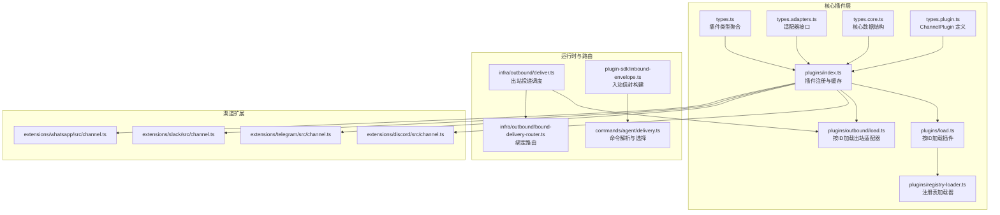
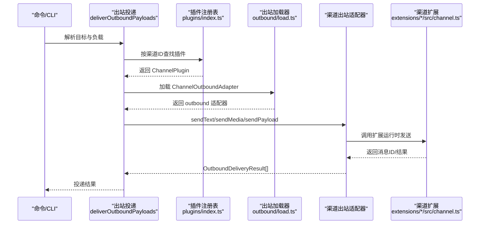
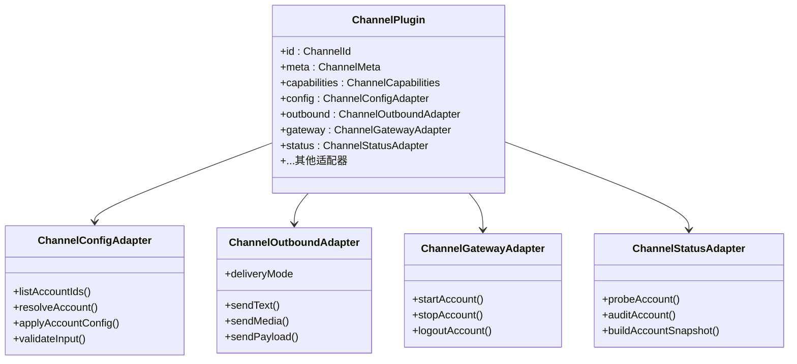
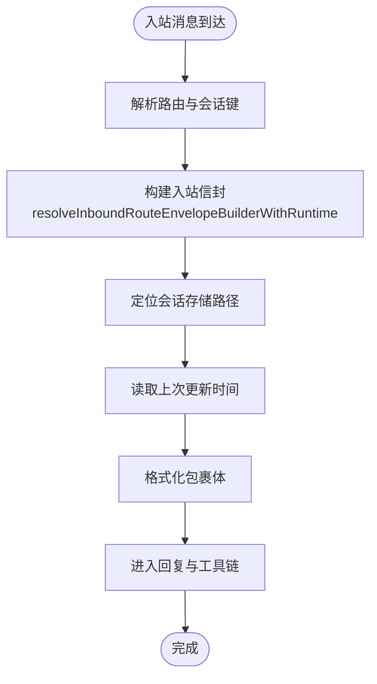
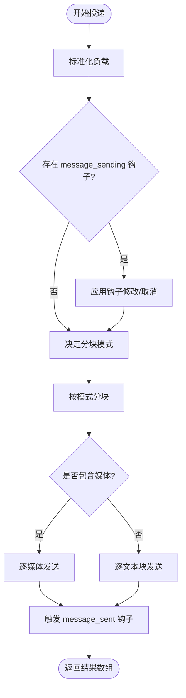
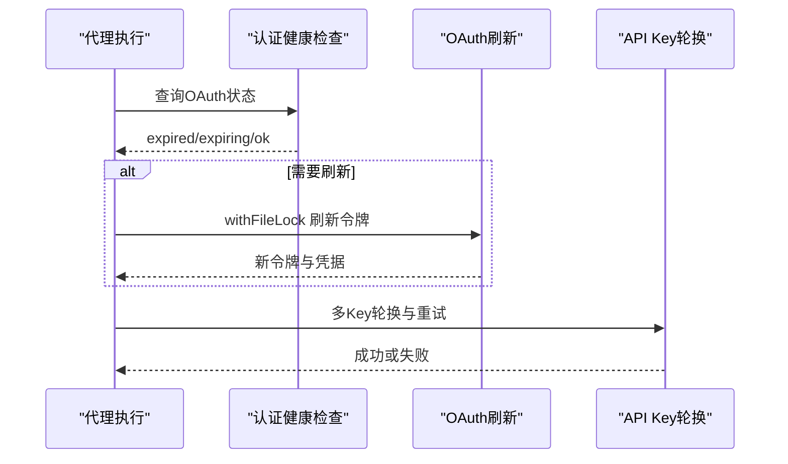
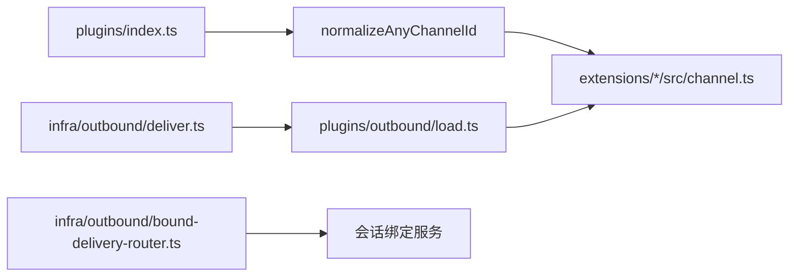

# 渠道集成

<cite>
**本文引用的文件**
- [src/channels/plugins/types.ts](file://src/channels/plugins/types.ts)
- [src/channels/plugins/types.adapters.ts](file://src/channels/plugins/types.adapters.ts)
- [src/channels/plugins/types.core.ts](file://src/channels/plugins/types.core.ts)
- [src/channels/plugins/types.plugin.ts](file://src/channels/plugins/types.plugin.ts)
- [src/channels/plugins/index.ts](file://src/channels/plugins/index.ts)
- [src/channels/plugins/load.ts](file://src/channels/plugins/load.ts)
- [src/channels/plugins/registry-loader.ts](file://src/channels/plugins/registry-loader.ts)
- [src/channels/plugins/outbound/load.ts](file://src/channels/plugins/outbound/load.ts)
- [src/channels/registry.ts](file://src/channels/registry.ts)
- [src/infra/outbound/deliver.ts](file://src/infra/outbound/deliver.ts)
- [src/commands/agent/delivery.ts](file://src/commands/agent/delivery.ts)
- [src/infra/outbound/bound-delivery-router.ts](file://src/infra/outbound/bound-delivery-router.ts)
- [src/plugin-sdk/inbound-envelope.ts](file://src/plugin-sdk/inbound-envelope.ts)
- [extensions/discord/src/channel.ts](file://extensions/discord/src/channel.ts)
- [extensions/telegram/src/channel.ts](file://extensions/telegram/src/channel.ts)
- [extensions/slack/src/channel.ts](file://extensions/slack/src/channel.ts)
- [extensions/whatsapp/src/channel.ts](file://extensions/whatsapp/src/channel.ts)
- [apps/macos/Sources/OpenClaw/ChannelsStore+Lifecycle.swift](file://apps/macos/Sources/OpenClaw/ChannelsStore+Lifecycle.swift)
- [src/agents/auth-health.ts](file://src/agents/auth-health.ts)
- [src/agents/auth-profiles/oauth.ts](file://src/agents/auth-profiles/oauth.ts)
- [src/agents/api-key-rotation.ts](file://src/agents/api-key-rotation.ts)
- [docs/channels/index.md](file://docs/channels/index.md)
- [docs/tools/plugin.md](file://docs/tools/plugin.md)
</cite>

## 目录
1. [简介](#简介)
2. [项目结构](#项目结构)
3. [核心组件](#核心组件)
4. [架构总览](#架构总览)
5. [详细组件分析](#详细组件分析)
6. [依赖关系分析](#依赖关系分析)
7. [性能考量](#性能考量)
8. [故障排除指南](#故障排除指南)
9. [结论](#结论)
10. [附录](#附录)

## 简介
本文件面向 OpenClaw 的渠道集成系统，系统性阐述其插件化渠道架构设计与实现，覆盖渠道插件接口、生命周期管理、动态加载机制、入站消息路由、出站消息发送、多渠道协调策略、认证与令牌轮换、以及自定义渠道插件开发指南。文档同时给出针对主流即时通讯渠道（如 WhatsApp、Telegram、Discord、Slack）的集成要点与配置要求，并提供故障排除与性能优化建议。

## 项目结构
OpenClaw 的渠道系统采用“插件化 + 动态注册”的架构：核心通道能力在统一的插件类型体系中抽象，各渠道以扩展形式实现自身适配器与运行时，通过插件注册表在运行时动态加载并参与调度。

- 核心插件类型与适配器定义位于 src/channels/plugins 下，统一约束渠道插件的配置、安全、消息、状态、网关等能力边界。
- 运行时插件注册与缓存逻辑位于 src/channels/plugins/index.ts，提供按 ID 查找与排序能力。
- 出站投递通过 src/infra/outbound/deliver.ts 委派给各渠道的 ChannelOutboundAdapter。
- 入站消息经由插件 SDK 的入站信封构建器进行会话与路由封装，再进入回复与工具链处理。
- 各渠道扩展（如 Discord、Telegram、Slack、WhatsApp）在各自 extensions/*/src/channel.ts 中实现插件对象与运行时。

图表来源
- [src/channels/plugins/types.ts:1-66](file://src/channels/plugins/types.ts#L1-L66)
- [src/channels/plugins/types.adapters.ts:1-384](file://src/channels/plugins/types.adapters.ts#L1-L384)
- [src/channels/plugins/types.core.ts:1-403](file://src/channels/plugins/types.core.ts#L1-L403)
- [src/channels/plugins/types.plugin.ts:1-86](file://src/channels/plugins/types.plugin.ts#L1-L86)
- [src/channels/plugins/index.ts:1-118](file://src/channels/plugins/index.ts#L1-L118)
- [src/channels/plugins/load.ts:1-8](file://src/channels/plugins/load.ts#L1-L8)
- [src/channels/plugins/registry-loader.ts:1-35](file://src/channels/plugins/registry-loader.ts#L1-L35)
- [src/channels/plugins/outbound/load.ts:1-17](file://src/channels/plugins/outbound/load.ts#L1-L17)
- [src/infra/outbound/deliver.ts:1-829](file://src/infra/outbound/deliver.ts#L1-L829)
- [src/infra/outbound/bound-delivery-router.ts:49-91](file://src/infra/outbound/bound-delivery-router.ts#L49-L91)
- [src/plugin-sdk/inbound-envelope.ts:1-142](file://src/plugin-sdk/inbound-envelope.ts#L1-L142)
- [src/commands/agent/delivery.ts:96-117](file://src/commands/agent/delivery.ts#L96-L117)
- [extensions/discord/src/channel.ts:1-463](file://extensions/discord/src/channel.ts#L1-L463)
- [extensions/telegram/src/channel.ts:1-587](file://extensions/telegram/src/channel.ts#L1-L587)
- [extensions/slack/src/channel.ts:1-475](file://extensions/slack/src/channel.ts#L1-L475)
- [extensions/whatsapp/src/channel.ts:1-229](file://extensions/whatsapp/src/channel.ts#L1-L229)

章节来源
- [src/channels/plugins/types.ts:1-66](file://src/channels/plugins/types.ts#L1-L66)
- [src/channels/plugins/index.ts:1-118](file://src/channels/plugins/index.ts#L1-L118)
- [src/channels/registry.ts:1-201](file://src/channels/registry.ts#L1-L201)
- [docs/channels/index.md:1-48](file://docs/channels/index.md#L1-L48)

## 核心组件
- 插件类型与适配器
  - ChannelPlugin：统一的渠道插件契约，包含元信息、能力、配置、安全、消息、目录、网关、心跳、动作、代理提示等适配器集合。
  - 适配器族：配置、安全、消息、目录、网关、心跳、消息动作、线程、流式传输、提及处理、命令控制等。
- 插件注册与缓存
  - 通过 getActivePluginRegistry 获取当前注册表，按渠道 ID 与别名进行规范化匹配；对已加载插件进行内存缓存，避免重复解析。
- 出站投递
  - deliverOutboundPayloads 将回复负载标准化后，按渠道 ID 加载 ChannelOutboundAdapter 并执行分块、媒体处理、钩子拦截与发送。
- 入站路由
  - 入站信封构建器根据配置与会话状态生成统一的入站包裹，供后续回复与工具调用使用。
- 绑定路由
  - 基于会话绑定的服务，将出站目标解析到唯一或回退的渠道账户，确保多账户场景下的确定性投递。

章节来源
- [src/channels/plugins/types.adapters.ts:1-384](file://src/channels/plugins/types.adapters.ts#L1-L384)
- [src/channels/plugins/types.core.ts:1-403](file://src/channels/plugins/types.core.ts#L1-L403)
- [src/channels/plugins/types.plugin.ts:1-86](file://src/channels/plugins/types.plugin.ts#L1-L86)
- [src/channels/plugins/index.ts:1-118](file://src/channels/plugins/index.ts#L1-L118)
- [src/infra/outbound/deliver.ts:1-829](file://src/infra/outbound/deliver.ts#L1-L829)
- [src/plugin-sdk/inbound-envelope.ts:1-142](file://src/plugin-sdk/inbound-envelope.ts#L1-L142)
- [src/infra/outbound/bound-delivery-router.ts:49-91](file://src/infra/outbound/bound-delivery-router.ts#L49-L91)

## 架构总览
下图展示从命令解析到渠道插件出站适配器的端到端流程，以及入站消息如何被路由与封装：

图表来源
- [src/commands/agent/delivery.ts:96-117](file://src/commands/agent/delivery.ts#L96-L117)
- [src/infra/outbound/deliver.ts:1-829](file://src/infra/outbound/deliver.ts#L1-L829)
- [src/channels/plugins/index.ts:1-118](file://src/channels/plugins/index.ts#L1-L118)
- [src/channels/plugins/outbound/load.ts:1-17](file://src/channels/plugins/outbound/load.ts#L1-L17)
- [extensions/discord/src/channel.ts:1-463](file://extensions/discord/src/channel.ts#L1-L463)
- [extensions/telegram/src/channel.ts:1-587](file://extensions/telegram/src/channel.ts#L1-L587)
- [extensions/slack/src/channel.ts:1-475](file://extensions/slack/src/channel.ts#L1-L475)
- [extensions/whatsapp/src/channel.ts:1-229](file://extensions/whatsapp/src/channel.ts#L1-L229)

## 详细组件分析

### 插件化渠道架构与生命周期
- 插件契约
  - ChannelPlugin 提供统一的元信息、能力声明、配置访问器、安全策略、消息解析、目录查询、网关启动/停止、心跳检查、消息动作、线程与流式传输等能力。
- 生命周期
  - 配置阶段：setup.applyAccountConfig 写入 channels.<id> 配置段；validateInput 校验输入。
  - 运行阶段：gateway.startAccount 启动监控；status.probeAccount/auditAccount 提供健康检查与权限审计。
  - 登出阶段：gateway.logoutAccount 清理配置与令牌。
- 动态加载
  - 通过 createChannelRegistryLoader 基于活跃插件注册表按 ID 缓存解析；loadChannelPlugin/loadChannelOutboundAdapter 分别加载完整插件与出站适配器。

图表来源
- [src/channels/plugins/types.plugin.ts:1-86](file://src/channels/plugins/types.plugin.ts#L1-L86)
- [src/channels/plugins/types.adapters.ts:1-384](file://src/channels/plugins/types.adapters.ts#L1-L384)
- [src/channels/plugins/types.core.ts:1-403](file://src/channels/plugins/types.core.ts#L1-L403)

章节来源
- [src/channels/plugins/types.plugin.ts:1-86](file://src/channels/plugins/types.plugin.ts#L1-L86)
- [src/channels/plugins/registry-loader.ts:1-35](file://src/channels/plugins/registry-loader.ts#L1-L35)
- [src/channels/plugins/load.ts:1-8](file://src/channels/plugins/load.ts#L1-L8)
- [src/channels/plugins/outbound/load.ts:1-17](file://src/channels/plugins/outbound/load.ts#L1-L17)

### 入站消息路由与会话封装
- 入站信封构建
  - 通过 resolveInboundRouteEnvelopeBuilderWithRuntime，结合路由解析、会话存储路径、上次更新时间与格式化选项，生成统一的入站包裹体，便于后续回复与工具调用。
- 会话绑定路由
  - bound-delivery-router 根据会话键与请求者信息，解析唯一绑定或回退策略，确保多账户/多渠道场景下的确定性投递。

图表来源
- [src/plugin-sdk/inbound-envelope.ts:1-142](file://src/plugin-sdk/inbound-envelope.ts#L1-L142)
- [src/infra/outbound/bound-delivery-router.ts:49-91](file://src/infra/outbound/bound-delivery-router.ts#L49-L91)

章节来源
- [src/plugin-sdk/inbound-envelope.ts:1-142](file://src/plugin-sdk/inbound-envelope.ts#L1-L142)
- [src/infra/outbound/bound-delivery-router.ts:49-91](file://src/infra/outbound/bound-delivery-router.ts#L49-L91)

### 出站消息发送与分块策略
- 负载标准化
  - normalizeReplyPayloadsForDelivery 标准化回复负载；normalizePayloadsForChannelDelivery 针对不同渠道做文本清理与空内容处理。
- 分块与模式
  - 支持按长度或按段落换行两种分块模式；不同渠道有各自的文本上限与模式偏好（如 Telegram 文本上限限制）。
- 媒体与钩子
  - 支持媒体 URL 列表拆分发送；支持 message_sending 与 message_sent 钩子，允许插件或外部系统拦截与记录。
- 结果汇总
  - 统一返回 OutboundDeliveryResult，包含渠道、消息ID、会话相关标识等。

图表来源
- [src/infra/outbound/deliver.ts:1-829](file://src/infra/outbound/deliver.ts#L1-L829)

章节来源
- [src/infra/outbound/deliver.ts:1-829](file://src/infra/outbound/deliver.ts#L1-L829)

### 渠道认证与令牌轮换
- OAuth 健康检查
  - buildAuthHealthSummary 与 resolveOAuthStatus 综合令牌有效期与刷新令牌状态，输出健康摘要。
- OAuth 自动刷新
  - tryResolveOAuthProfile/refreshOAuthTokenWithLock 在过期前自动刷新并写入锁保护的认证存储。
- API Key 轮换
  - executeWithApiKeyRotation 支持多 API Key 轮换与重试策略，避免单点失效。

图表来源
- [src/agents/auth-health.ts:165-197](file://src/agents/auth-health.ts#L165-L197)
- [src/agents/auth-profiles/oauth.ts:154-428](file://src/agents/auth-profiles/oauth.ts#L154-L428)
- [src/agents/api-key-rotation.ts:1-46](file://src/agents/api-key-rotation.ts#L1-L46)

章节来源
- [src/agents/auth-health.ts:165-197](file://src/agents/auth-health.ts#L165-L197)
- [src/agents/auth-profiles/oauth.ts:154-428](file://src/agents/auth-profiles/oauth.ts#L154-L428)
- [src/agents/api-key-rotation.ts:1-46](file://src/agents/api-key-rotation.ts#L1-L46)

### 渠道扩展实现要点（Discord、Telegram、Slack、WhatsApp）

#### Discord
- 能力与特性
  - 支持直聊、频道、主题、反应、投票、流式合并默认参数。
- 配置与安全
  - 使用 botToken/appToken 或环境变量；支持 DM 白名单与群组策略警告收集。
- 出站
  - 直接投递，支持文本、媒体、投票；按配置解析目标与回复上下文。
- 网关
  - monitorDiscordProvider 启动监听，探测意图状态并记录运行时摘要。

章节来源
- [extensions/discord/src/channel.ts:1-463](file://extensions/discord/src/channel.ts#L1-L463)

#### Telegram
- 能力与特性
  - 支持直聊、群组、频道、主题、反应、投票、流式阻断；文本分块基于 Markdown。
- 配置与安全
  - 支持 botToken/tokenFile/环境变量；检测重复 token 所属账户并给出原因。
- 出站
  - sendPayload/sendText/sendMedia/sendPoll；支持静默发送与线程/回复上下文。
- 网关与登出
  - 支持 webhook/polling 模式；logoutAccount 清理配置并返回清理状态。

章节来源
- [extensions/telegram/src/channel.ts:1-587](file://extensions/telegram/src/channel.ts#L1-L587)

#### Slack
- 能力与特性
  - 支持直聊、频道、主题、反应、媒体、原生命令；流式合并默认参数。
- 配置与安全
  - 支持 botToken 与 appToken；HTTP 模式需 signingSecret；可选择用户 token 写入。
- 出站
  - sendText/sendMedia；根据配置选择写入 token（优先 appToken，必要时回退用户 token）。
- 网关
  - monitorSlackProvider 启动监听，支持媒体大小与斜杠命令配置。

章节来源
- [extensions/slack/src/channel.ts:1-475](file://extensions/slack/src/channel.ts#L1-L475)

#### WhatsApp
- 能力与特性
  - 支持直聊与群组；支持反应、投票、流式阻断；消息分块与去头处理。
- 配置与安全
  - 支持 QR 登录与 authDir；DM/群组策略、历史限制、文本分块模式等。
- 出站
  - sendText/sendMedia；支持回复上下文与静默发送。

章节来源
- [extensions/whatsapp/src/channel.ts:1-229](file://extensions/whatsapp/src/channel.ts#L1-L229)

## 依赖关系分析
- 插件注册表与规范化
  - normalizeAnyChannelId 基于活跃注册表查找插件 ID 或别名，保证跨扩展的一致识别。
- 出站适配器依赖
  - deliverOutboundPayloads 仅依赖 ChannelOutboundAdapter 接口，不关心具体实现，实现解耦。
- 会话绑定
  - bound-delivery-router 依赖会话绑定服务，确保同一会话的投递一致性。

图表来源
- [src/channels/plugins/index.ts:1-118](file://src/channels/plugins/index.ts#L1-L118)
- [src/channels/registry.ts:162-183](file://src/channels/registry.ts#L162-L183)
- [src/channels/plugins/outbound/load.ts:1-17](file://src/channels/plugins/outbound/load.ts#L1-L17)
- [src/infra/outbound/deliver.ts:1-829](file://src/infra/outbound/deliver.ts#L1-L829)
- [src/infra/outbound/bound-delivery-router.ts:49-91](file://src/infra/outbound/bound-delivery-router.ts#L49-L91)

章节来源
- [src/channels/registry.ts:1-201](file://src/channels/registry.ts#L1-L201)
- [src/channels/plugins/index.ts:1-118](file://src/channels/plugins/index.ts#L1-L118)
- [src/infra/outbound/bound-delivery-router.ts:49-91](file://src/infra/outbound/bound-delivery-router.ts#L49-L91)

## 性能考量
- 分块与流式
  - 不同渠道采用不同的分块模式与上限（如 Telegram 文本上限），合理设置 textChunkLimit 与 chunkMode 可减少多次往返。
- 媒体处理
  - 对不支持媒体的渠道，应提供文本回退；对支持的渠道，尽量批量发送媒体列表以减少网络开销。
- 钩子与日志
  - message_sending/message_sent 钩子可能带来额外开销，建议按需启用并注意异步处理。
- 会话绑定
  - 使用 bound-delivery-router 降低歧义与回退成本，提升投递效率。

## 故障排除指南
- 渠道配置问题
  - 使用 status.probeAccount/auditAccount 输出诊断信息；检查 token 来源与有效期。
- OAuth 与 API Key
  - 若出现过期或限流，确认 refresh token 是否可用；启用 executeWithApiKeyRotation 进行多 Key 轮换。
- 登出与清理
  - macOS 平台可通过 GatewayConnection 触发 channelsLogout，清理环境变量或配置字段并刷新状态。
- 常见症状
  - 无响应：检查 intents（Discord）、webhook/polling（Telegram）、Socket Mode（Slack）。
  - 媒体发送失败：确认渠道是否支持媒体，或提供文本回退。

章节来源
- [apps/macos/Sources/OpenClaw/ChannelsStore+Lifecycle.swift:121-163](file://apps/macos/Sources/OpenClaw/ChannelsStore+Lifecycle.swift#L121-L163)
- [src/agents/auth-health.ts:165-197](file://src/agents/auth-health.ts#L165-L197)
- [src/agents/api-key-rotation.ts:1-46](file://src/agents/api-key-rotation.ts#L1-L46)

## 结论
OpenClaw 的渠道集成系统通过统一的插件类型与适配器契约，实现了对多种即时通讯平台的可插拔支持。借助动态注册、会话绑定路由与标准化的出站投递流程，系统在功能扩展与运行稳定性之间取得平衡。配合完善的认证健康检查与令牌轮换机制，能够有效应对多渠道、多账户的复杂场景。

## 附录

### 自定义渠道插件开发指南
- 注册渠道
  - 在插件入口调用 api.registerChannel({ plugin })，将插件注册到 channels.<id> 命名空间。
- 必备适配器
  - 至少实现 config、outbound（sendText/sendMedia/sendPayload）、gateway（startAccount）。
- 元信息与别名
  - 设置 meta.label、docsPath、aliases 等，便于 CLI/UI 展示与归一化。
- 可选增强
  - actions（消息动作）、threading（主题模式）、streaming（流式合并）、mentions（提及剥离）等。

章节来源
- [docs/tools/plugin.md:655-705](file://docs/tools/plugin.md#L655-L705)