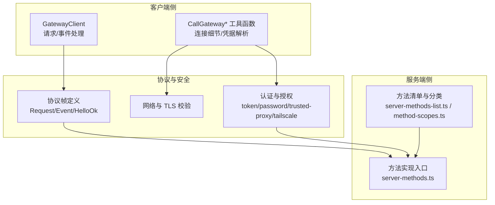
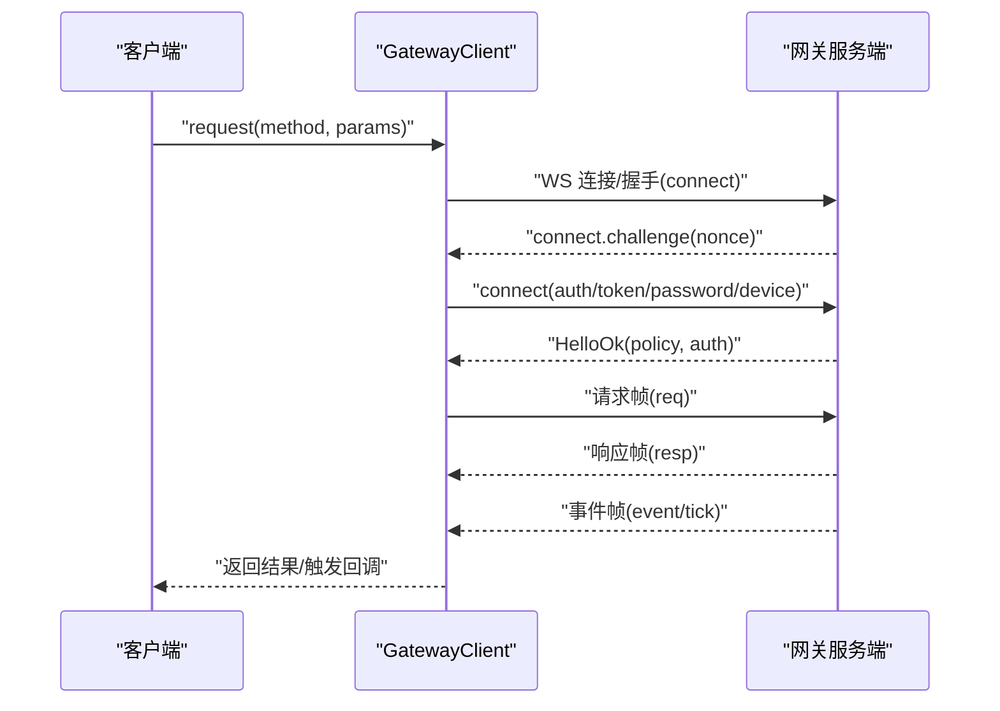
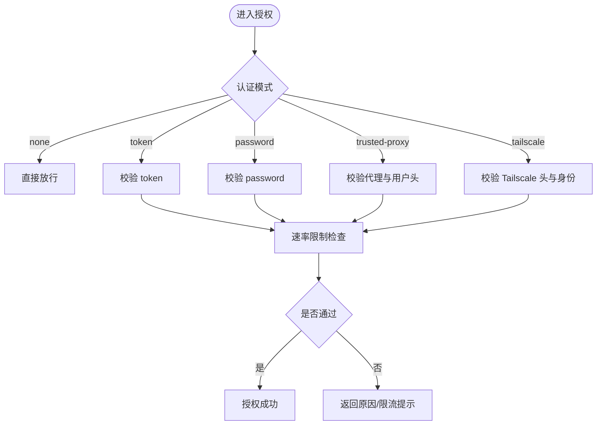
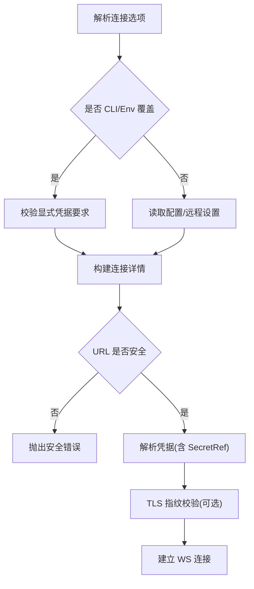
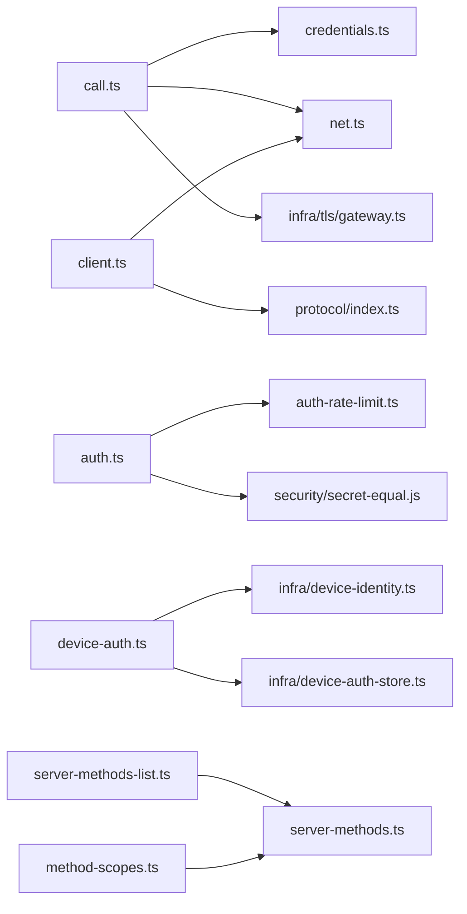

# API 方法

<cite>
**本文引用的文件**
- [src/gateway/call.ts](file://src/gateway/call.ts)
- [src/gateway/client.ts](file://src/gateway/client.ts)
- [src/gateway/auth.ts](file://src/gateway/auth.ts)
- [src/gateway/credentials.ts](file://src/gateway/credentials.ts)
- [src/gateway/method-scopes.ts](file://src/gateway/method-scopes.ts)
- [src/gateway/server-methods.ts](file://src/gateway/server-methods.ts)
- [src/gateway/server-methods-list.ts](file://src/gateway/server-methods-list.ts)
- [src/gateway/net.ts](file://src/gateway/net.ts)
- [src/gateway/protocol/index.ts](file://src/gateway/protocol/index.ts)
- [src/gateway/protocol/connect-error-details.ts](file://src/gateway/protocol/connect-error-details.ts)
- [src/gateway/device-auth.ts](file://src/gateway/device-auth.ts)
- [src/gateway/infra/device-identity.ts](file://src/gateway/infra/device-identity.ts)
- [src/gateway/infra/device-auth-store.ts](file://src/gateway/infra/device-auth-store.ts)
- [src/gateway/infra/tls/gateway.ts](file://src/gateway/infra/tls/gateway.ts)
- [src/gateway/infra/tls/fingerprint.js](file://src/gateway/infra/tls/fingerprint.js)
- [src/gateway/infra/ws.js](file://src/gateway/infra/ws.js)
- [src/gateway/security/secret-equal.js](file://src/gateway/security/secret-equal.js)
- [src/gateway/auth-rate-limit.ts](file://src/gateway/auth-rate-limit.ts)
- [src/gateway/auth-mode-policy.ts](file://src/gateway/auth-mode-policy.ts)
- [src/gateway/auth-config-utils.ts](file://src/gateway/auth-config-utils.ts)
- [src/gateway/boot.ts](file://src/gateway/boot.ts)
- [src/gateway/version.ts](file://src/gateway/version.ts)
- [src/gateway/utils/message-channel.js](file://src/gateway/utils/message-channel.js)
- [src/gateway/config/config.ts](file://src/gateway/config/config.ts)
- [src/gateway/secrets/resolve-secret-input-string.ts](file://src/gateway/secrets/resolve-secret-input-string.ts)
- [src/gateway/types.secrets.ts](file://src/gateway/types.secrets.ts)
- [src/gateway/logger.ts](file://src/gateway/logger.ts)
- [src/gateway/runtime.ts](file://src/gateway/runtime.ts)
- [src/gateway/commands/agent.ts](file://src/gateway/commands/agent.ts)
- [src/gateway/config/sessions/main-session.ts](file://src/gateway/config/sessions/main-session.ts)
- [src/gateway/config/sessions/store.ts](file://src/gateway/config/sessions/store.ts)
- [src/gateway/config/sessions/paths.ts](file://src/gateway/config/sessions/paths.ts)
- [src/gateway/config/sessions/types.ts](file://src/gateway/config/sessions/types.ts)
- [src/gateway/logging/subsystem.ts](file://src/gateway/logging/subsystem.ts)
- [src/gateway/auto-reply/tokens.ts](file://src/gateway/auto-reply/tokens.ts)
- [src/gateway/agents/tools/gateway.ts](file://src/gateway/agents/tools/gateway.ts)
- [src/gateway/agents/tools/gateway-tool.ts](file://src/gateway/agents/tools/gateway-tool.ts)
- [src/gateway/agents/openclaw-gateway-tool.test.ts](file://src/gateway/agents/openclaw-gateway-tool.test.ts)
- [src/gateway/agents/models-config.providers.cloudflare-ai-gateway.test.ts](file://src/gateway/agents/models-config.providers.cloudflare-ai-gateway.test.ts)
- [src/gateway/agents/models-config.providers.vercel-ai-gateway.test.ts](file://src/gateway/agents/models-config.providers.vercel-ai-gateway.test.ts)
- [src/gateway/agents/cloudflare-ai-gateway.ts](file://src/gateway/agents/cloudflare-ai-gateway.ts)
- [src/gateway/agents/vercel-ai-gateway.ts](file://src/gateway/agents/vercel-ai-gateway.ts)
- [src/gateway/agents/bash-tools.exec-host-gateway.ts](file://src/gateway/agents/bash-tools.exec-host-gateway.ts)
- [src/gateway/cli/gateway-cli.ts](file://src/gateway/cli/gateway-cli.ts)
- [src/gateway/cli/gateway-rpc.ts](file://src/gateway/cli/gateway-rpc.ts)
- [src/gateway/cli/command-secret-gateway.ts](file://src/gateway/cli/command-secret-gateway.ts)
- [src/gateway/cli/daemon-cli/gateway-token-drift.ts](file://src/gateway/cli/daemon-cli/gateway-token-drift.ts)
- [src/gateway/commands/agent-via-gateway.ts](file://src/gateway/commands/agent-via-gateway.ts)
- [src/gateway/commands/status-all/gateway.ts](file://src/gateway/commands/status-all/gateway.ts)
- [src/gateway/infra/tls/gateway.ts](file://src/gateway/infra/tls/gateway.ts)
- [src/gateway/ui/gateway.ts](file://src/gateway/ui/gateway.ts)
</cite>

## 目录
1. [简介](#简介)
2. [项目结构](#项目结构)
3. [核心组件](#核心组件)
4. [架构总览](#架构总览)
5. [详细组件分析](#详细组件分析)
6. [依赖关系分析](#依赖关系分析)
7. [性能考量](#性能考量)
8. [故障排查指南](#故障排查指南)
9. [结论](#结论)
10. [附录](#附录)

## 简介
本文件面向 OpenClaw 网关的 API 方法，系统性梳理控制平面方法、通道管理方法、节点操作方法与工具调用接口，覆盖参数规范、返回值格式、错误码定义、权限与认证、版本管理与废弃策略、批量与异步调用、回调机制、性能优化与最佳实践。文档以源码为依据，配合图示帮助读者快速理解与正确使用。

## 项目结构
OpenClaw 网关通过 WebSocket 协议提供统一的 RPC 能力，客户端通过“请求-响应”帧进行方法调用；服务端根据方法名与权限范围进行授权校验，并在必要时返回事件帧（如心跳、节点事件等）。认证支持 token/password/trusted-proxy/tailscale 等模式，TLS 可选指纹校验，设备身份可缓存持久化 token 以提升连接体验。

**图表来源**
- [src/gateway/client.ts:109-674](file://src/gateway/client.ts#L109-L674)
- [src/gateway/call.ts:137-226](file://src/gateway/call.ts#L137-L226)
- [src/gateway/auth.ts:217-504](file://src/gateway/auth.ts#L217-L504)
- [src/gateway/server-methods-list.ts](file://src/gateway/server-methods-list.ts)
- [src/gateway/server-methods.ts](file://src/gateway/server-methods.ts)
- [src/gateway/protocol/index.ts](file://src/gateway/protocol/index.ts)

**章节来源**
- [src/gateway/client.ts:109-674](file://src/gateway/client.ts#L109-L674)
- [src/gateway/call.ts:137-226](file://src/gateway/call.ts#L137-L226)
- [src/gateway/auth.ts:217-504](file://src/gateway/auth.ts#L217-L504)
- [src/gateway/server-methods-list.ts](file://src/gateway/server-methods-list.ts)
- [src/gateway/server-methods.ts](file://src/gateway/server-methods.ts)

## 核心组件
- 客户端请求与事件处理：GatewayClient 封装连接、握手、请求发送、事件接收、重连与心跳监控。
- 凭据与连接：CallGateway* 提供连接细节构建、凭据解析、URL 安全检查、TLS 指纹校验、超时与协议版本协商。
- 认证与授权：支持多种认证模式与代理信任策略，按方法粒度授予最小权限。
- 方法清单与分类：将方法按读写/管理/审批/配对等作用域分组，提供授权判定与最小权限推导。
- 服务端方法实现：集中于 server-methods.ts，结合 server-methods-list.ts 的方法清单与 method-scopes.ts 的权限映射执行。

**章节来源**
- [src/gateway/client.ts:109-674](file://src/gateway/client.ts#L109-L674)
- [src/gateway/call.ts:38-74](file://src/gateway/call.ts#L38-L74)
- [src/gateway/auth.ts:217-504](file://src/gateway/auth.ts#L217-L504)
- [src/gateway/method-scopes.ts:1-217](file://src/gateway/method-scopes.ts#L1-L217)
- [src/gateway/server-methods.ts](file://src/gateway/server-methods.ts)

## 架构总览
下图展示一次典型 API 调用从客户端到服务端的流程，包括握手、鉴权、方法路由与事件回传。

**图表来源**
- [src/gateway/client.ts:267-415](file://src/gateway/client.ts#L267-L415)
- [src/gateway/protocol/index.ts](file://src/gateway/protocol/index.ts)

**章节来源**
- [src/gateway/client.ts:109-674](file://src/gateway/client.ts#L109-L674)
- [src/gateway/protocol/index.ts](file://src/gateway/protocol/index.ts)

## 详细组件分析

### 控制平面方法（读取/状态/配置）
- 方法类别：读取类（status、health、config.*、usage.*、sessions.*、models.list、tools.catalog 等）。
- 权限：默认需 READ 或更高权限；部分前缀方法仅 ADMIN。
- 典型用途：健康检查、配置查询、用量统计、会话列表与详情、模型与工具目录。
- 参数与返回：由具体方法定义，通常为对象或数组；错误通过响应帧的 error 字段携带。
- 示例场景：CI 健康巡检、仪表盘数据拉取、会话归档与审计。

**章节来源**
- [src/gateway/method-scopes.ts:52-88](file://src/gateway/method-scopes.ts#L52-L88)
- [src/gateway/server-methods-list.ts](file://src/gateway/server-methods-list.ts)

### 通道管理方法（消息/轮询/频道）
- 方法类别：消息发送（send、chat.send）、轮询（poll）、频道状态（channels.status）、注入（chat.inject）。
- 权限：写入类（WRITE）或管理类（ADMIN），部分涉及外部通道需登录/登出。
- 参数与返回：消息体、轮询参数、频道状态对象；错误码涵盖鉴权失败、速率限制、通道不可用等。
- 示例场景：机器人消息推送、定时轮询、频道上下线管理。

**章节来源**
- [src/gateway/method-scopes.ts:89-107](file://src/gateway/method-scopes.ts#L89-L107)
- [src/gateway/server-methods-list.ts](file://src/gateway/server-methods-list.ts)

### 节点操作方法（节点生命周期/能力/事件）
- 方法类别：节点枚举与描述（node.list、node.describe）、节点调用（node.invoke、node.invoke.result）、节点事件（node.event）、画布能力刷新（node.canvas.capability.refresh）、待处理队列（node.pending.*）。
- 权限：节点角色方法多为只读或事件流，但调用需具备相应权限。
- 参数与返回：节点标识、能力描述、调用参数与结果；事件帧用于实时通知。
- 示例场景：节点能力发现、异步任务调度、事件订阅。

**章节来源**
- [src/gateway/method-scopes.ts:22-30](file://src/gateway/method-scopes.ts#L22-L30)
- [src/gateway/method-scopes.ts:101-106](file://src/gateway/method-scopes.ts#L101-L106)
- [src/gateway/server-methods-list.ts](file://src/gateway/server-methods-list.ts)

### 工具调用接口（技能/插件/代理工具）
- 方法类别：技能安装/更新（skills.install/update）、代理工具调用（agent.*、agent.wait）、浏览器请求（browser.request）、TTS 管理（tts.*）、语音唤醒（voicewake.*）。
- 权限：写入/管理类；部分工具调用可能受沙箱/审批策略限制。
- 参数与返回：工具输入参数、输出结果；错误码包含工具不可用、参数校验失败、权限不足等。
- 示例场景：自动化脚本执行、网页抓取、文本转语音、语音唤醒配置。

**章节来源**
- [src/gateway/method-scopes.ts:113-132](file://src/gateway/method-scopes.ts#L113-L132)
- [src/gateway/server-methods-list.ts](file://src/gateway/server-methods-list.ts)

### 认证与授权
- 支持模式：none、token、password、trusted-proxy、tailscale。
- 授权判定：基于方法名映射到最小权限集合，若未分类则默认拒绝。
- 速率限制：共享密钥场景下的失败尝试计数与冷却时间。
- 代理信任：可信代理白名单、用户头、允许用户列表、必需头校验。
- 设备身份：设备公私钥签名、设备 token 缓存与轮换。

**图表来源**
- [src/gateway/auth.ts:378-485](file://src/gateway/auth.ts#L378-L485)
- [src/gateway/auth-rate-limit.ts](file://src/gateway/auth-rate-limit.ts)

**章节来源**
- [src/gateway/auth.ts:217-504](file://src/gateway/auth.ts#L217-L504)
- [src/gateway/auth-rate-limit.ts](file://src/gateway/auth-rate-limit.ts)
- [src/gateway/auth-mode-policy.ts](file://src/gateway/auth-mode-policy.ts)
- [src/gateway/auth-config-utils.ts](file://src/gateway/auth-config-utils.ts)

### 连接与凭据解析
- 连接细节：自动选择本地 loopback、远程 URL 或 CLI/环境变量覆盖；安全检查强制 wss 到非环回地址。
- 凭据解析：支持显式 token/password、配置中 SecretRef、远程/本地优先级与回退策略。
- TLS 指纹：本地 TLS 运行时与远程指纹校验，支持断言与覆盖。
- 超时与协议：可配置超时与最小/最大协议版本，确保兼容性。

**图表来源**
- [src/gateway/call.ts:137-226](file://src/gateway/call.ts#L137-L226)
- [src/gateway/call.ts:330-351](file://src/gateway/call.ts#L330-L351)
- [src/gateway/call.ts:702-729](file://src/gateway/call.ts#L702-L729)

**章节来源**
- [src/gateway/call.ts:137-226](file://src/gateway/call.ts#L137-L226)
- [src/gateway/call.ts:330-351](file://src/gateway/call.ts#L330-L351)
- [src/gateway/call.ts:702-729](file://src/gateway/call.ts#L702-L729)
- [src/gateway/credentials.ts:253-323](file://src/gateway/credentials.ts#L253-L323)

### 方法权限与最小权限
- 方法到作用域映射：读取（READ）、写入（WRITE）、管理（ADMIN）、审批（APPROVALS）、配对（PAIRING）。
- 最小权限推导：未明确分类的方法默认拒绝；节点角色方法有专门集合。
- 授权判定：若包含 ADMIN 则全部放行；否则按所需最小权限校验。

**章节来源**
- [src/gateway/method-scopes.ts:1-217](file://src/gateway/method-scopes.ts#L1-L217)

### 事件与心跳
- 事件帧：用于推送节点事件、心跳等；客户端维护序列号与丢包检测。
- 心跳监控：服务端周期性发送 tick，客户端检测超时后主动断开以避免静默卡死。
- 回调机制：客户端提供 onEvent/onHelloOk/onClose 等回调钩子。

**章节来源**
- [src/gateway/client.ts:497-554](file://src/gateway/client.ts#L497-L554)
- [src/gateway/client.ts:596-618](file://src/gateway/client.ts#L596-L618)

### 批量操作与异步调用
- 异步调用：请求-响应模型，服务端可先返回 accepted 并持续推送事件帧，最终以响应帧收尾。
- 批量场景：可通过多次请求组合实现批量；注意幂等性与错误隔离。
- 回调与事件：事件帧可用于订阅节点状态变化，减少轮询成本。

**章节来源**
- [src/gateway/client.ts:527-550](file://src/gateway/client.ts#L527-L550)

### 版本管理、废弃与迁移
- 协议版本：客户端与服务端协商 min/maxProtocol，默认使用当前 PROTOCOL_VERSION。
- 废弃方法：通过 server-methods-list.ts 维护方法清单，未在清单中的方法视为未知或已废弃。
- 迁移建议：升级客户端/服务端至新版本；对依赖 SecretRef 的方法，确保在正确的命令路径中解析后再发起调用。

**章节来源**
- [src/gateway/client.ts:344-347](file://src/gateway/client.ts#L344-L347)
- [src/gateway/call.ts:750-777](file://src/gateway/call.ts#L750-L777)
- [src/gateway/version.ts](file://src/gateway/version.ts)

## 依赖关系分析
- 客户端依赖协议帧定义与网络/TLS工具；服务端依赖方法清单与权限映射。
- 认证模块贯穿连接阶段，授权模块贯穿方法执行阶段。
- 设备身份与存储模块支持设备 token 的持久化与轮换。

**图表来源**
- [src/gateway/call.ts:1-36](file://src/gateway/call.ts#L1-L36)
- [src/gateway/credentials.ts:1-17](file://src/gateway/credentials.ts#L1-L17)
- [src/gateway/client.ts:1-41](file://src/gateway/client.ts#L1-L41)
- [src/gateway/auth.ts:1-21](file://src/gateway/auth.ts#L1-L21)
- [src/gateway/auth-rate-limit.ts](file://src/gateway/auth-rate-limit.ts)
- [src/gateway/security/secret-equal.js](file://src/gateway/security/secret-equal.js)
- [src/gateway/device-auth.ts](file://src/gateway/device-auth.ts)
- [src/gateway/infra/device-identity.ts](file://src/gateway/infra/device-identity.ts)
- [src/gateway/infra/device-auth-store.ts](file://src/gateway/infra/device-auth-store.ts)
- [src/gateway/server-methods-list.ts](file://src/gateway/server-methods-list.ts)
- [src/gateway/server-methods.ts](file://src/gateway/server-methods.ts)
- [src/gateway/method-scopes.ts:1-217](file://src/gateway/method-scopes.ts#L1-L217)

**章节来源**
- [src/gateway/call.ts:1-36](file://src/gateway/call.ts#L1-L36)
- [src/gateway/credentials.ts:1-17](file://src/gateway/credentials.ts#L1-L17)
- [src/gateway/client.ts:1-41](file://src/gateway/client.ts#L1-L41)
- [src/gateway/auth.ts:1-21](file://src/gateway/auth.ts#L1-L21)
- [src/gateway/server-methods-list.ts](file://src/gateway/server-methods-list.ts)
- [src/gateway/server-methods.ts](file://src/gateway/server-methods.ts)
- [src/gateway/method-scopes.ts:1-217](file://src/gateway/method-scopes.ts#L1-L217)

## 性能考量
- 连接复用：保持长连接，避免频繁握手；合理设置心跳间隔与超时。
- 事件驱动：优先使用事件帧订阅变更，降低轮询频率。
- 负载均衡与远端访问：使用 wss 与可信代理/隧道；避免明文传输。
- 大对象处理：客户端已放宽最大负载限制，注意服务端资源消耗。
- 速率限制：遵守服务端限速策略，避免触发限流导致退避与重试。

[本节为通用指导，无需特定文件引用]

## 故障排查指南
- 连接失败
  - 明文 ws:// 非环回地址被阻断：改为 wss:// 或使用 SSH 隧道/Tailscale。
  - TLS 指纹不匹配：核对指纹或关闭断言（仅限受控网络）。
  - 连接挑战超时：检查服务端可达性与防火墙。
- 认证失败
  - token/password 不匹配：核对配置与环境变量；查看速率限制提示。
  - 代理/头信息缺失：确认可信代理配置与必需头。
  - 设备 token 不一致：清理过期设备 token 后重试。
- 方法调用异常
  - 方法不存在或未分类：检查方法名与版本；确认 SecretRef 解析路径。
  - 权限不足：补充所需作用域（READ/WRITE/ADMIN/APPROVALS/PAIRING）。
- 事件丢失
  - 心跳超时：检查网络稳定性与服务端策略；适当增大心跳间隔。

**章节来源**
- [src/gateway/client.ts:144-168](file://src/gateway/client.ts#L144-L168)
- [src/gateway/client.ts:211-244](file://src/gateway/client.ts#L211-L244)
- [src/gateway/auth.ts:378-485](file://src/gateway/auth.ts#L378-L485)
- [src/gateway/protocol/connect-error-details.ts](file://src/gateway/protocol/connect-error-details.ts)

## 结论
OpenClaw 网关 API 以清晰的权限模型与稳健的连接机制为核心，覆盖控制平面、通道管理、节点操作与工具调用等关键领域。遵循本文的参数规范、权限与认证策略、版本与废弃处理、异步与事件机制，可获得稳定、高效且可扩展的集成体验。

[本节为总结，无需特定文件引用]

## 附录

### API 方法清单与分类（节选）
- 读取类（READ）：health、status、usage.*、sessions.*、models.list、tools.catalog、config.* 等
- 写入类（WRITE）：send、poll、agent.*、wake、talk.mode、tts.*、voicewake.*、node.invoke、chat.*、browser.request、push.test、node.pending.*
- 管理类（ADMIN）：channels.logout、agents.*、skills.*、secrets.*、cron.*、sessions.*、connect、chat.inject、web.login.*、system-event、agents.files.*
- 审批类（APPROVALS）：exec.approval.*
- 配对类（PAIRING）：node.pair.*、device.pair.*、device.token.*

**章节来源**
- [src/gateway/method-scopes.ts:52-132](file://src/gateway/method-scopes.ts#L52-L132)
- [src/gateway/server-methods-list.ts](file://src/gateway/server-methods-list.ts)

### 权限与作用域对照
- ADMIN_SCOPE：最高权限，可执行所有方法
- READ_SCOPE：可读取状态与配置
- WRITE_SCOPE：可执行写入与调用
- APPROVALS_SCOPE：审批相关方法
- PAIRING_SCOPE：配对与设备令牌管理

**章节来源**
- [src/gateway/method-scopes.ts:1-21](file://src/gateway/method-scopes.ts#L1-L21)

### 错误码与恢复建议
- 连接错误：包含连接挑战缺失、超时、TLS 指纹不匹配等；参考 connect-error-details 中的细节码与恢复建议。
- 认证错误：token 缺失/不匹配、password 缺失/不匹配、速率限制、配对要求、设备身份要求等。
- 方法错误：方法不存在、参数校验失败、权限不足、远端方法不支持（需更新网关或禁用 SecretRef）。

**章节来源**
- [src/gateway/protocol/connect-error-details.ts](file://src/gateway/protocol/connect-error-details.ts)
- [src/gateway/call.ts:750-777](file://src/gateway/call.ts#L750-L777)
- [src/gateway/auth.ts:448-484](file://src/gateway/auth.ts#L448-L484)

### 使用示例（步骤说明）
- 健康检查
  - 方法：health
  - 权限：READ
  - 步骤：构建连接 → 发送请求 → 解析响应
- 发送消息
  - 方法：send
  - 权限：WRITE
  - 步骤：准备消息参数 → 发送请求 → 监听事件/等待响应
- 节点调用
  - 方法：node.invoke
  - 权限：WRITE
  - 步骤：指定节点与参数 → 接收事件帧 → 获取最终结果
- 代理工具
  - 方法：agent.*、browser.request、tts.convert
  - 权限：WRITE/ADMIN
  - 步骤：准备工具参数 → 发送请求 → 处理输出/错误

[本节为流程说明，无需特定文件引用]

### 最佳实践
- 优先使用 wss 与 TLS 指纹校验保障传输安全
- 合理设置心跳与超时，避免静默卡死
- 使用事件订阅替代轮询，降低带宽与延迟
- 严格区分作用域，最小权限原则
- 对依赖 SecretRef 的方法，确保在正确的命令路径中解析后再调用
- 在 CI/监控中使用只读方法进行健康巡检

[本节为通用指导，无需特定文件引用]