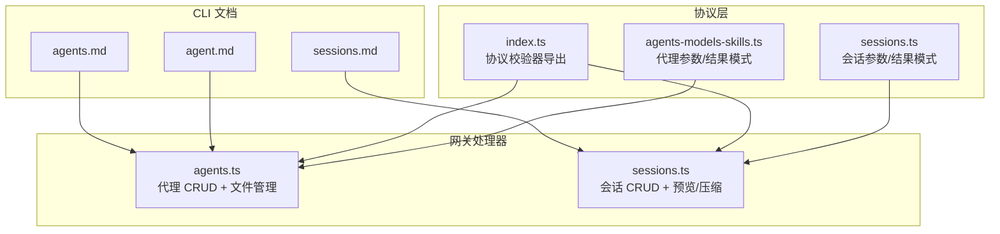
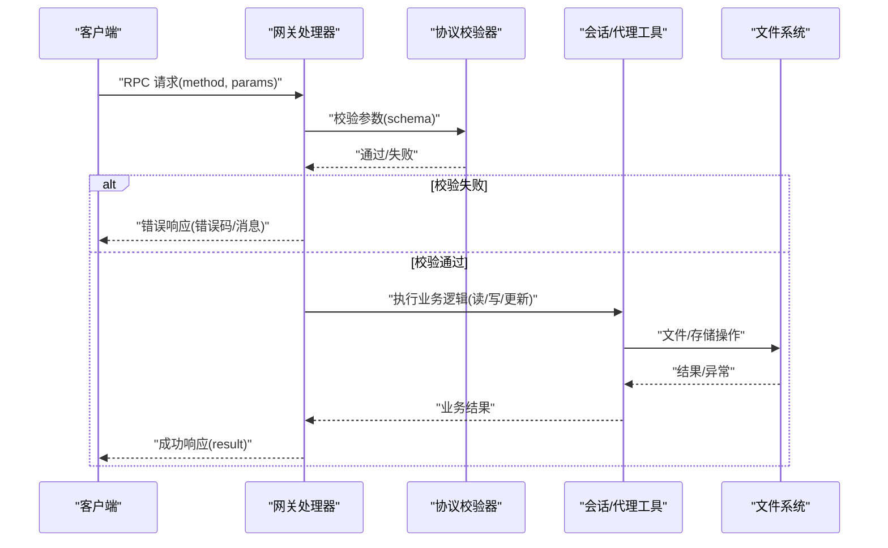
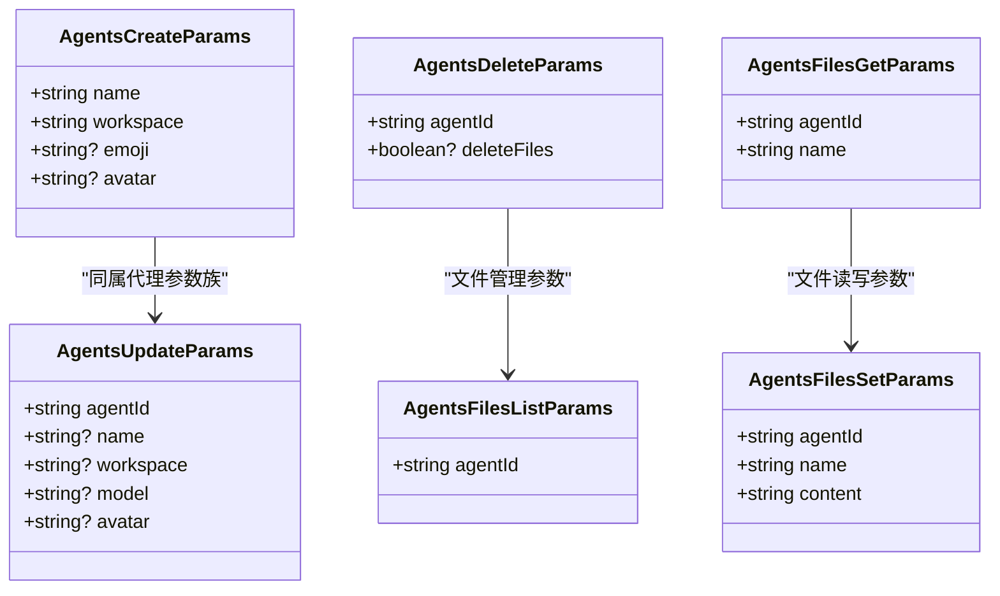
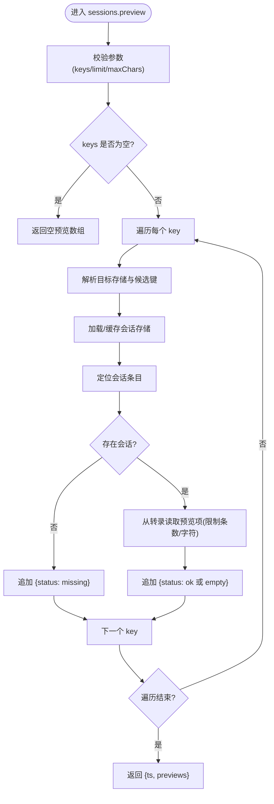
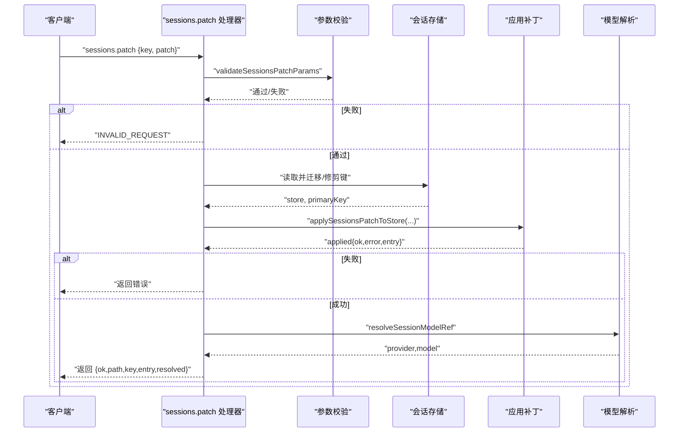
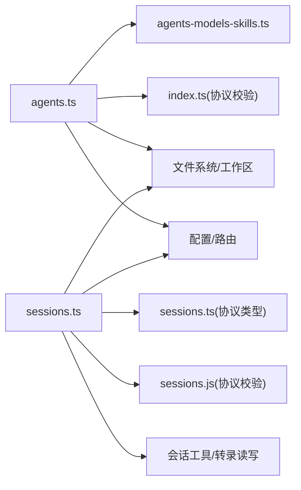

# 代理和会话方法

<cite>
**本文引用的文件**
- [agents.ts](file://src/gateway/server-methods/agents.ts)
- [agents-models-skills.ts](file://src/gateway/protocol/schema/agents-models-skills.ts)
- [index.ts（协议索引）](file://src/gateway/protocol/index.ts)
- [sessions.ts](file://src/gateway/server-methods/sessions.ts)
- [sessions.ts（协议校验）](file://src/gateway/protocol/schema/sessions.js)
- [sessions.ts（协议类型）](file://src/gateway/protocol/schema/sessions.ts)
- [agent.md](file://docs/cli/agent.md)
- [agents.md](file://docs/cli/agents.md)
- [sessions.md](file://docs/cli/sessions.md)
</cite>

## 目录
1. [简介](#简介)
2. [项目结构](#项目结构)
3. [核心组件](#核心组件)
4. [架构总览](#架构总览)
5. [详细组件分析](#详细组件分析)
6. [依赖关系分析](#依赖关系分析)
7. [性能考量](#性能考量)
8. [故障排查指南](#故障排查指南)
9. [结论](#结论)
10. [附录](#附录)

## 简介
本文件面向 OpenClaw 网关的“代理与会话”API，系统化梳理以下内容：
- 代理生命周期：创建、查询、更新、删除、文件管理（列出、读取、写入）
- 会话生命周期：列表、预览、解析、补丁更新、重置、删除、获取消息、压缩
- 参数规范、返回结构、错误码定义
- 使用示例（请求格式、响应结构、典型场景）
- 代理工作空间、会话状态管理与历史记录处理
- 身份验证、权限控制与并发访问限制说明

## 项目结构
围绕代理与会话的实现，主要涉及以下模块：
- 协议层（schema 与校验）：定义请求/响应结构与参数校验规则
- 网关处理器（server-methods）：实现具体 RPC 方法
- CLI 文档：提供命令行参考与使用示例

图表来源
- [agents.ts:458-775](file://src/gateway/server-methods/agents.ts#L458-L775)
- [sessions.ts:120-473](file://src/gateway/server-methods/sessions.ts#L120-L473)
- [agents-models-skills.ts:47-101](file://src/gateway/protocol/schema/agents-models-skills.ts#L47-L101)
- [index.ts（协议索引）:253-423](file://src/gateway/protocol/index.ts#L253-L423)
- [agent.md:1-29](file://docs/cli/agent.md#L1-L29)
- [agents.md:1-124](file://docs/cli/agents.md#L1-L124)
- [sessions.md:1-105](file://docs/cli/sessions.md#L1-L105)

章节来源
- [agents.ts:1-775](file://src/gateway/server-methods/agents.ts#L1-L775)
- [sessions.ts:1-473](file://src/gateway/server-methods/sessions.ts#L1-L473)
- [agents-models-skills.ts:47-101](file://src/gateway/protocol/schema/agents-models-skills.ts#L47-L101)
- [index.ts（协议索引）:253-423](file://src/gateway/protocol/index.ts#L253-L423)
- [agent.md:1-29](file://docs/cli/agent.md#L1-L29)
- [agents.md:1-124](file://docs/cli/agents.md#L1-L124)
- [sessions.md:1-105](file://docs/cli/sessions.md#L1-L105)

## 核心组件
- 代理（Agents）
  - 列表、创建、更新、删除
  - 工作区文件：列出、读取、写入
- 会话（Sessions）
  - 列表、预览、解析、补丁、重置、删除、获取消息、压缩

章节来源
- [agents.ts:458-775](file://src/gateway/server-methods/agents.ts#L458-L775)
- [sessions.ts:120-473](file://src/gateway/server-methods/sessions.ts#L120-L473)

## 架构总览
下图展示客户端调用到网关处理器再到存储与工具函数的端到端流程。

图表来源
- [index.ts（协议索引）:253-423](file://src/gateway/protocol/index.ts#L253-L423)
- [agents.ts:458-775](file://src/gateway/server-methods/agents.ts#L458-L775)
- [sessions.ts:120-473](file://src/gateway/server-methods/sessions.ts#L120-L473)

## 详细组件分析

### 代理 API（agents.*）

- 方法清单与职责
  - agents.list：列出已配置代理
  - agents.create：创建新代理（含工作区与默认文件）
  - agents.update：更新代理名称/工作区/模型/头像
  - agents.delete：删除代理（可选删除文件）
  - agents.files.list：列出代理工作区关键文件
  - agents.files.get：读取代理工作区文件
  - agents.files.set：写入代理工作区文件

- 参数与返回结构（节选）
  - agents.create
    - 入参：name, workspace, 可选 emoji, avatar
    - 返回：ok, agentId, name, workspace
  - agents.update
    - 入参：agentId, 可选 name, workspace, model, avatar
    - 返回：ok, agentId
  - agents.delete
    - 入参：agentId, 可选 deleteFiles
    - 返回：ok, agentId, removedBindings
  - agents.files.list
    - 入参：agentId
    - 返回：agentId, workspace, files[]
  - agents.files.get
    - 入参：agentId, name
    - 返回：agentId, workspace, file{name,path,missing,size,updatedAtMs,content}
  - agents.files.set
    - 入参：agentId, name, content
    - 返回：ok, agentId, workspace, file...

- 错误码与行为
  - INVALID_REQUEST：参数非法、未知代理、路径不安全、文件不存在等
  - 保留代理名与删除保护：默认代理不可删除
  - 文件安全：严格路径边界检查、禁止硬链接、符号链接解析校验

- 使用示例（基于 CLI 文档）
  - 创建代理并指定工作区与身份信息
  - 更新代理模型或头像
  - 删除代理并选择是否清理文件
  - 列出/读取/写入代理工作区文件

章节来源
- [agents.ts:458-775](file://src/gateway/server-methods/agents.ts#L458-L775)
- [agents-models-skills.ts:47-101](file://src/gateway/protocol/schema/agents-models-skills.ts#L47-L101)
- [index.ts（协议索引）:253-423](file://src/gateway/protocol/index.ts#L253-L423)
- [agents.md:1-124](file://docs/cli/agents.md#L1-L124)
- [agent.md:1-29](file://docs/cli/agent.md#L1-L29)

#### 代理类关系图（代码级）

图表来源
- [agents-models-skills.ts:47-101](file://src/gateway/protocol/schema/agents-models-skills.ts#L47-L101)
- [index.ts（协议索引）:253-423](file://src/gateway/protocol/index.ts#L253-L423)

### 会话 API（sessions.*）

- 方法清单与职责
  - sessions.list：按范围聚合列出会话
  - sessions.preview：批量预览会话片段（限制条数/字符）
  - sessions.resolve：解析/规范化会话键
  - sessions.patch：对会话条目进行补丁式更新
  - sessions.reset：重置会话（保留/新建）
  - sessions.delete：删除会话（可选归档转录）
  - sessions.get：按键读取消息列表（限制数量）
  - sessions.compact：按最大行数压缩转录文件

- 参数与返回结构（节选）
  - sessions.list
    - 入参：scope 选择（默认/指定代理/全部/显式路径）
    - 返回：stores[], count, activeMinutes, sessions[]
  - sessions.preview
    - 入参：keys[], 可选 limit, maxChars
    - 返回：ts, previews[{key,status,items[]}]
  - sessions.resolve
    - 入参：待解析键
    - 返回：ok, key
  - sessions.patch
    - 入参：key, 补丁字段（由补丁模式定义）
    - 返回：ok, path, key, entry, resolved{modelProvider,model}
  - sessions.reset
    - 入参：key, reason("new"|"reset")
    - 返回：ok, key, entry
  - sessions.delete
    - 入参：key, 可选 deleteTranscript, 可选 emitLifecycleHooks
    - 返回：ok, key, deleted, archived[]
  - sessions.get
    - 入参：key/sessionKey, 可选 limit
    - 返回：messages[]
  - sessions.compact
    - 入参：key, 可选 maxLines
    - 返回：ok, key, compacted{true/false}, reason/kept/archived

- 错误码与行为
  - INVALID_REQUEST：键必填、主会话不可删除、webchat 客户端禁止直接变更会话（除 chat.send）
  - 并发与清理：删除前迁移/修剪键、必要时归档转录、触发解绑生命周期事件
  - 权限与来源：区分控制 UI 与其他客户端的权限

- 使用示例（基于 CLI 文档）
  - 列出会话并按不同作用域筛选
  - 执行维护性清理（预览/强制执行/保护活跃键）
  - 通过键预览会话片段（限制条数与字符）

章节来源
- [sessions.ts:120-473](file://src/gateway/server-methods/sessions.ts#L120-L473)
- [sessions.ts（协议类型）](file://src/gateway/protocol/schema/sessions.ts)
- [sessions.ts（协议校验）](file://src/gateway/protocol/schema/sessions.js)
- [sessions.md:1-105](file://docs/cli/sessions.md#L1-L105)

#### 会话预览流程图（算法级）

图表来源
- [sessions.ts:136-197](file://src/gateway/server-methods/sessions.ts#L136-L197)

#### 会话补丁更新序列图（代码级）

图表来源
- [sessions.ts:212-254](file://src/gateway/server-methods/sessions.ts#L212-L254)

## 依赖关系分析

图表来源
- [agents.ts:1-775](file://src/gateway/server-methods/agents.ts#L1-L775)
- [sessions.ts:1-473](file://src/gateway/server-methods/sessions.ts#L1-L473)
- [agents-models-skills.ts:47-101](file://src/gateway/protocol/schema/agents-models-skills.ts#L47-L101)
- [index.ts（协议索引）:253-423](file://src/gateway/protocol/index.ts#L253-L423)
- [sessions.ts（协议类型）](file://src/gateway/protocol/schema/sessions.ts)
- [sessions.ts（协议校验）](file://src/gateway/protocol/schema/sessions.js)

章节来源
- [agents.ts:1-775](file://src/gateway/server-methods/agents.ts#L1-L775)
- [sessions.ts:1-473](file://src/gateway/server-methods/sessions.ts#L1-L473)
- [agents-models-skills.ts:47-101](file://src/gateway/protocol/schema/agents-models-skills.ts#L47-L101)
- [index.ts（协议索引）:253-423](file://src/gateway/protocol/index.ts#L253-L423)
- [sessions.ts（协议类型）](file://src/gateway/protocol/schema/sessions.ts)
- [sessions.ts（协议校验）](file://src/gateway/protocol/schema/sessions.js)

## 性能考量
- 会话预览：支持批量 keys，内部限制最大条数与字符，避免一次性读取过大数据量
- 存储缓存：预览阶段对存储路径做缓存，减少重复 IO
- 压缩：按最大行数截断转录文件，自动归档旧版本，降低磁盘占用
- 并发与锁：压缩过程在短临界区内仅读取/锁定，实际转录处理在临界区外完成

[本节为通用性能建议，无需特定文件来源]

## 故障排查指南
- 代理相关
  - 无法创建：检查保留代理名、工作区路径合法性、默认文件生成
  - 更新失败：确认 agentId 存在、workspace 变更时确保工作区存在
  - 删除失败：确认非默认代理、deleteFiles 选项与文件权限
  - 文件读写失败：检查文件名是否受支持、路径是否逃逸工作区根、是否存在硬链接
- 会话相关
  - 预览为空：确认 keys 规范化后仍存在对应会话；检查 limit/maxChars 合理性
  - 补丁失败：检查补丁字段是否符合模式；确认会话存在且可迁移键
  - 删除失败：主会话不可删除；确认 deleteTranscript 与生命周期钩子设置
  - 压缩失败：确认转录文件存在且可读；检查磁盘权限与归档策略

章节来源
- [agents.ts:458-775](file://src/gateway/server-methods/agents.ts#L458-L775)
- [sessions.ts:120-473](file://src/gateway/server-methods/sessions.ts#L120-L473)

## 结论
本文系统梳理了 OpenClaw 的代理与会话 API，覆盖参数、返回、错误码与典型用法，并结合 CLI 文档给出实践示例。通过严格的参数校验、工作区安全策略与会话生命周期管理，保障了代理与会话在多客户端场景下的稳定性与一致性。

[本节为总结性内容，无需特定文件来源]

## 附录

### 代理 API 参数与返回概览
- agents.create
  - 入参：name, workspace, 可选 emoji, avatar
  - 返回：ok, agentId, name, workspace
- agents.update
  - 入参：agentId, 可选 name, workspace, model, avatar
  - 返回：ok, agentId
- agents.delete
  - 入参：agentId, 可选 deleteFiles
  - 返回：ok, agentId, removedBindings
- agents.files.list
  - 入参：agentId
  - 返回：agentId, workspace, files[]
- agents.files.get
  - 入参：agentId, name
  - 返回：agentId, workspace, file{...}
- agents.files.set
  - 入参：agentId, name, content
  - 返回：ok, agentId, workspace, file{...}

章节来源
- [agents.ts:458-775](file://src/gateway/server-methods/agents.ts#L458-L775)
- [agents-models-skills.ts:47-101](file://src/gateway/protocol/schema/agents-models-skills.ts#L47-L101)

### 会话 API 参数与返回概览
- sessions.list
  - 入参：scope 选择（默认/指定代理/全部/显式路径）
  - 返回：stores[], count, activeMinutes, sessions[]
- sessions.preview
  - 入参：keys[], 可选 limit, maxChars
  - 返回：ts, previews[{key,status,items[]}]
- sessions.resolve
  - 入参：待解析键
  - 返回：ok, key
- sessions.patch
  - 入参：key, 补丁字段
  - 返回：ok, path, key, entry, resolved{modelProvider,model}
- sessions.reset
  - 入参：key, reason("new"|"reset")
  - 返回：ok, key, entry
- sessions.delete
  - 入参：key, 可选 deleteTranscript, emitLifecycleHooks
  - 返回：ok, key, deleted, archived[]
- sessions.get
  - 入参：key/sessionKey, 可选 limit
  - 返回：messages[]
- sessions.compact
  - 入参：key, 可选 maxLines
  - 返回：ok, key, compacted{true/false}, reason/kept/archived

章节来源
- [sessions.ts:120-473](file://src/gateway/server-methods/sessions.ts#L120-L473)
- [sessions.ts（协议类型）](file://src/gateway/protocol/schema/sessions.ts)
- [sessions.ts（协议校验）](file://src/gateway/protocol/schema/sessions.js)

### 错误码定义（节选）
- INVALID_REQUEST：参数非法、键缺失、主会话删除、webchat 客户端禁止直接变更会话、路径不安全、文件不存在等
- 其他：根据具体方法返回相应错误（如文件读写失败、转录不存在等）

章节来源
- [index.ts（协议索引）:253-423](file://src/gateway/protocol/index.ts#L253-L423)

### 使用示例（来自 CLI 文档）
- 代理
  - 创建与绑定、设置身份、删除代理
- 会话
  - 列出会话、按作用域筛选、执行清理维护

章节来源
- [agent.md:1-29](file://docs/cli/agent.md#L1-L29)
- [agents.md:1-124](file://docs/cli/agents.md#L1-L124)
- [sessions.md:1-105](file://docs/cli/sessions.md#L1-L105)