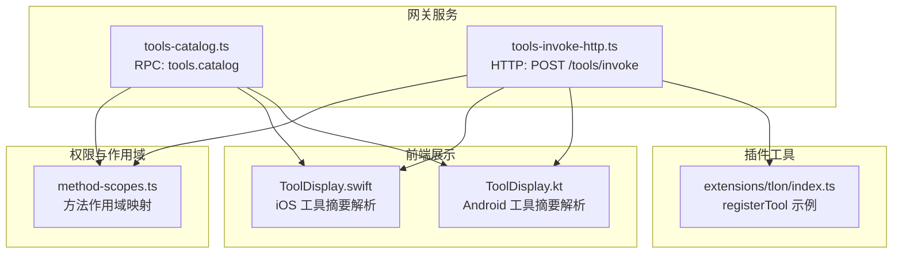
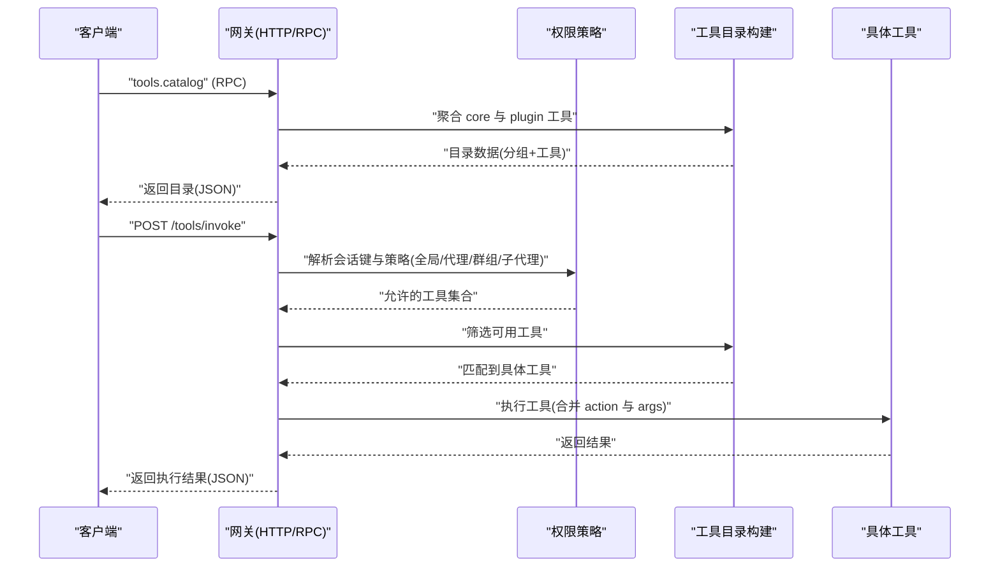
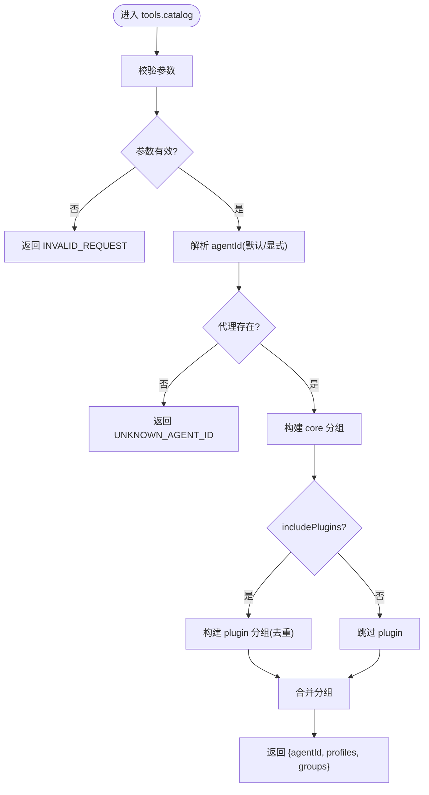
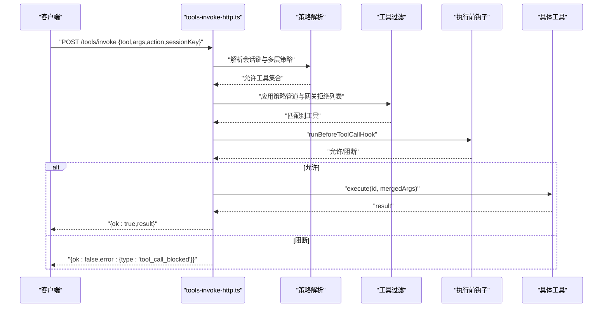
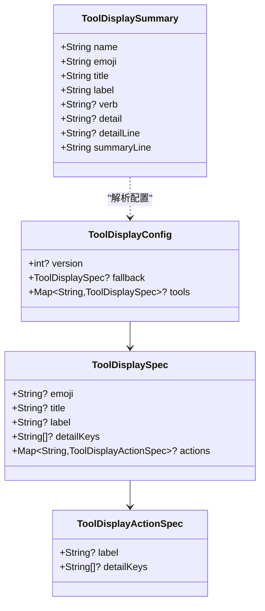
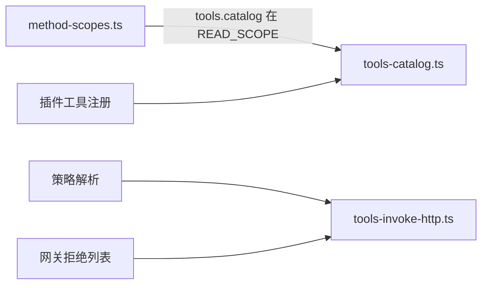

# 工具目录方法

<cite>
**本文引用的文件**
- [tools-catalog.ts](file://src/gateway/server-methods/tools-catalog.ts)
- [tools-invoke-http.ts](file://src/gateway/tools-invoke-http.ts)
- [server.tools-catalog.test.ts](file://src/gateway/server.tools-catalog.test.ts)
- [GatewayModels.swift](file://apps/shared/OpenClawKit/Sources/OpenClawKit/ToolDisplay.swift)
- [ToolDisplay.kt](file://apps/android/app/src/main/java/ai/openclaw/app/tools/ToolDisplay.kt)
- [method-scopes.ts](file://src/gateway/method-scopes.ts)
- [index.ts（tlon 插件）](file://extensions/tlon/index.ts)
</cite>

## 目录
1. [简介](#简介)
2. [项目结构](#项目结构)
3. [核心组件](#核心组件)
4. [架构总览](#架构总览)
5. [详细组件分析](#详细组件分析)
6. [依赖关系分析](#依赖关系分析)
7. [性能考量](#性能考量)
8. [故障排查指南](#故障排查指南)
9. [结论](#结论)
10. [附录](#附录)

## 简介
本文件面向 OpenClaw 的“工具目录”相关 API，系统性梳理工具目录查询、工具调用与结果获取的接口规范、参数与返回值、错误码、鉴权与权限控制、执行上下文、安全沙箱与资源限制、以及开发与调试最佳实践。文档同时覆盖跨平台前端对工具显示摘要的解析逻辑，帮助开发者在不同客户端正确呈现工具信息。

## 项目结构
与工具目录 API 相关的关键位置如下：
- 网关 RPC/HTTP 方法：工具目录查询与工具调用处理
- 前端工具展示摘要：iOS Swift 与 Android Kotlin 实现
- 权限与作用域：网关方法的作用域映射
- 插件工具注册：以 tlon 插件为例展示工具注册流程

图表来源
- [tools-catalog.ts:125-166](file://src/gateway/server-methods/tools-catalog.ts#L125-L166)
- [tools-invoke-http.ts:136-360](file://src/gateway/tools-invoke-http.ts#L136-L360)
- [ToolDisplay.swift:46-203](file://apps/shared/OpenClawKit/Sources/OpenClawKit/ToolDisplay.swift#L46-L203)
- [ToolDisplay.kt:1-52](file://apps/android/app/src/main/java/ai/openclaw/app/tools/ToolDisplay.kt#L1-L52)
- [method-scopes.ts:32-93](file://src/gateway/method-scopes.ts#L32-L93)
- [index.ts（tlon 插件）:135-172](file://extensions/tlon/index.ts#L135-L172)

章节来源
- [tools-catalog.ts:1-167](file://src/gateway/server-methods/tools-catalog.ts#L1-L167)
- [tools-invoke-http.ts:1-361](file://src/gateway/tools-invoke-http.ts#L1-L361)
- [ToolDisplay.swift:46-203](file://apps/shared/OpenClawKit/Sources/OpenClawKit/ToolDisplay.swift#L46-L203)
- [ToolDisplay.kt:1-52](file://apps/android/app/src/main/java/ai/openclaw/app/tools/ToolDisplay.kt#L1-L52)
- [method-scopes.ts:32-93](file://src/gateway/method-scopes.ts#L32-L93)
- [index.ts（tlon 插件）:135-172](file://extensions/tlon/index.ts#L135-L172)

## 核心组件
- 工具目录查询（RPC）
  - 方法名：tools.catalog
  - 功能：返回工具目录分组与工具清单，支持是否包含插件工具、目标代理 ID 解析
  - 返回结构要点：包含 agentId、profiles 列表、groups（含 id、label、source、pluginId、tools 列表）
- 工具调用（HTTP）
  - 路径：POST /tools/invoke
  - 功能：按会话键与策略过滤后选择具体工具并执行，返回执行结果或错误
  - 请求体字段：tool、action（可选）、args（对象）、sessionKey（可选）
  - 响应：ok、result 或 error（含 type 与 message）

章节来源
- [tools-catalog.ts:125-166](file://src/gateway/server-methods/tools-catalog.ts#L125-L166)
- [tools-invoke-http.ts:42-55](file://src/gateway/tools-invoke-http.ts#L42-L55)
- [tools-invoke-http.ts:136-360](file://src/gateway/tools-invoke-http.ts#L136-L360)

## 架构总览
工具目录与调用的端到端流程如下：

图表来源
- [tools-catalog.ts:125-166](file://src/gateway/server-methods/tools-catalog.ts#L125-L166)
- [tools-invoke-http.ts:250-313](file://src/gateway/tools-invoke-http.ts#L250-L313)

## 详细组件分析

### 组件一：工具目录查询（RPC: tools.catalog）
- 参数
  - agentId: 字符串，可选；未提供则使用默认代理
  - includePlugins: 布尔，可选；默认包含插件工具
- 行为
  - 校验参数有效性
  - 解析代理 ID，若指定但不存在则返回错误
  - 构建 core 工具分组
  - 可选地构建 plugin 工具分组，并去重已有名称
  - 返回 agentId、profiles（预设配置选项）、groups
- 返回值
  - agentId: 当前使用的代理 ID
  - profiles: 预设配置项列表（id、label）
  - groups: 分组数组，每组包含 id、label、source、pluginId（如适用）、tools
  - 每个工具条目包含 id、label、description、source、pluginId（如适用）、optional（如适用）、defaultProfiles
- 错误
  - INVALID_REQUEST: 参数校验失败
  - UNKNOWN_AGENT_ID: 指定 agentId 不存在
- 使用示例
  - 查询包含插件的完整目录
  - 关闭插件返回仅 core 目录
  - 指定未知 agentId 触发错误

图表来源
- [tools-catalog.ts:125-166](file://src/gateway/server-methods/tools-catalog.ts#L125-L166)

章节来源
- [tools-catalog.ts:125-166](file://src/gateway/server-methods/tools-catalog.ts#L125-L166)
- [server.tools-catalog.test.ts:7-46](file://src/gateway/server.tools-catalog.test.ts#L7-L46)

### 组件二：工具调用（HTTP: POST /tools/invoke）
- 请求路径与方法
  - POST /tools/invoke
- 请求体字段
  - tool: 字符串，必填；工具名称
  - action: 字符串，可选；动作标识
  - args: 对象，可选；工具参数
  - sessionKey: 字符串，可选；会话键，默认使用主会话
- 执行上下文
  - 会话键解析：支持 "main" 映射为主会话键
  - 消息通道/账户提示：从请求头读取渠道、账户、消息 to、线程 id，用于策略继承
- 权限与策略
  - 解析全局/代理/提供方/群组/子代理策略
  - 构建工具允许白名单并应用默认策略步骤
  - 应用网关级 HTTP 拒绝列表（可被 allow 覆盖）
- 工具选择与执行
  - 在允许列表中查找匹配工具
  - 合并 action 与 args（若工具 schema 支持 action 属性）
  - 执行前钩子：runBeforeToolCallHook
  - 执行工具并返回结果
- 响应
  - 成功：{ ok: true, result }
  - 失败：{ ok: false, error: { type, message } }
- 错误码
  - 400: 无效请求（缺少 tool、工具输入参数错误）
  - 403: 工具调用被拦截（before hook 阻止）
  - 404: 工具不可用（不在允许列表或不存在）
  - 500: 工具执行失败
- 使用示例
  - 正常调用：提供 tool 与 args
  - 缺少 tool：触发 400
  - 工具不存在：触发 404
  - before hook 拦截：触发 403
  - 执行异常：触发 500

图表来源
- [tools-invoke-http.ts:136-360](file://src/gateway/tools-invoke-http.ts#L136-L360)

章节来源
- [tools-invoke-http.ts:42-55](file://src/gateway/tools-invoke-http.ts#L42-L55)
- [tools-invoke-http.ts:136-360](file://src/gateway/tools-invoke-http.ts#L136-L360)

### 组件三：工具显示摘要（前端）
- iOS（Swift）
  - 解析工具显示摘要：emoji、title、label、verb、detail
  - 支持根据 action 与 detailKeys 提取详情
  - 特殊处理：read 工具的路径区间展示、路径中的家目录缩写
- Android（Kotlin）
  - 定义工具显示配置的数据结构（version、fallback、tools）
  - 输出 ToolDisplaySummary，包含 name、emoji、title、label、verb、detail
  - 生成摘要行与详情行

图表来源
- [ToolDisplay.swift:46-203](file://apps/shared/OpenClawKit/Sources/OpenClawKit/ToolDisplay.swift#L46-L203)
- [ToolDisplay.kt:1-52](file://apps/android/app/src/main/java/ai/openclaw/app/tools/ToolDisplay.kt#L1-L52)

章节来源
- [ToolDisplay.swift:46-203](file://apps/shared/OpenClawKit/Sources/OpenClawKit/ToolDisplay.swift#L46-L203)
- [ToolDisplay.kt:1-52](file://apps/android/app/src/main/java/ai/openclaw/app/tools/ToolDisplay.kt#L1-L52)

### 组件四：工具注册机制与示例
- 插件通过 registerTool 注册工具，提供名称、标签、描述、参数 Schema 与执行函数
- tlon 插件示例：注册名为 "tlon" 的工具，参数包含 command 字段，执行时进行子命令白名单校验

章节来源
- [index.ts（tlon 插件）:135-172](file://extensions/tlon/index.ts#L135-L172)

## 依赖关系分析
- 方法作用域
  - tools.catalog 属于 READ_SCOPE，要求 operator.read 或更高权限
- 工具目录构建
  - 聚合 core 工具与 plugin 工具，避免名称冲突
- 工具调用
  - 依赖多层策略解析与网关拒绝列表
  - 通过 before hook 进行调用前拦截

图表来源
- [method-scopes.ts:32-93](file://src/gateway/method-scopes.ts#L32-L93)
- [tools-catalog.ts:125-166](file://src/gateway/server-methods/tools-catalog.ts#L125-L166)
- [tools-invoke-http.ts:295-304](file://src/gateway/tools-invoke-http.ts#L295-L304)

章节来源
- [method-scopes.ts:32-93](file://src/gateway/method-scopes.ts#L32-L93)
- [tools-catalog.ts:125-166](file://src/gateway/server-methods/tools-catalog.ts#L125-L166)
- [tools-invoke-http.ts:295-304](file://src/gateway/tools-invoke-http.ts#L295-L304)

## 性能考量
- 工具目录构建
  - core 工具直接枚举；plugin 工具需扫描插件元数据，注意避免重复构建
  - includePlugins=false 可显著减少构建开销
- 工具调用
  - 策略解析与工具筛选为 O(n) 查找，建议保持允许列表精简
  - 大型 args 与媒体内容可能增加内存占用，注意 HTTP 请求体大小限制
- 前端摘要解析
  - 仅基于配置与参数提取，复杂度低；注意避免在 UI 线程做重型计算

## 故障排查指南
- tools.catalog
  - 参数无效：检查参数类型与必填字段
  - 未知 agentId：确认代理 ID 是否存在于已知代理列表
- /tools/invoke
  - 400：确认 tool 存在且 args 符合工具 Schema；必要时将 action 合并入 args
  - 403：before hook 返回 blocked，检查策略与钩子逻辑
  - 404：工具不在允许列表或不存在，检查策略白名单与网关拒绝列表
  - 500：工具执行异常，查看日志并复现最小化输入
- 测试环境
  - 内存类工具在测试中可能被禁用，检查测试默认配置与插件槽位设置

章节来源
- [tools-catalog.ts:40-54](file://src/gateway/server-methods/tools-catalog.ts#L40-L54)
- [tools-invoke-http.ts:178-200](file://src/gateway/tools-invoke-http.ts#L178-L200)
- [tools-invoke-http.ts:307-313](file://src/gateway/tools-invoke-http.ts#L307-L313)
- [tools-invoke-http.ts:343-357](file://src/gateway/tools-invoke-http.ts#L343-L357)

## 结论
OpenClaw 的工具目录 API 通过 tools.catalog 提供统一的工具清单视图，结合 /tools/invoke 提供受控的工具执行能力。通过多层策略与网关拒绝列表实现权限与安全控制，配合前端工具摘要解析提升用户体验。建议在生产环境中严格管理工具白名单、启用 before hook 拦截、合理配置会话键与消息通道提示，确保工具调用的安全与稳定。

## 附录

### API 定义与示例

- tools.catalog（RPC）
  - 请求参数
    - agentId: 字符串，可选
    - includePlugins: 布尔，可选（默认包含插件）
  - 成功响应
    - agentId: 字符串
    - profiles: 数组，元素含 id、label
    - groups: 数组，元素含 id、label、source、pluginId（如适用）、tools
    - tools: 数组，元素含 id、label、description、source、pluginId（如适用）、optional（如适用）、defaultProfiles
  - 错误
    - INVALID_REQUEST: 参数校验失败
    - UNKNOWN_AGENT_ID: 指定 agentId 不存在
  - 示例
    - 查询完整目录：包含 core 与 plugin
    - 关闭插件：仅返回 core
    - 指定未知 agentId：返回错误

- POST /tools/invoke（HTTP）
  - 请求体
    - tool: 字符串，必填
    - action: 字符串，可选
    - args: 对象，可选
    - sessionKey: 字符串，可选（默认主会话）
  - 成功响应
    - ok: true
    - result: 工具执行结果
  - 错误响应
    - ok: false
    - error: { type, message }
  - 状态码
    - 400: 无效请求/工具输入错误
    - 403: 工具调用被拦截
    - 404: 工具不可用
    - 500: 工具执行失败
  - 示例
    - 正常调用：提供 tool 与 args
    - 缺少 tool：400
    - 工具不存在：404
    - before hook 拦截：403
    - 执行异常：500

章节来源
- [tools-catalog.ts:125-166](file://src/gateway/server-methods/tools-catalog.ts#L125-L166)
- [tools-invoke-http.ts:42-55](file://src/gateway/tools-invoke-http.ts#L42-L55)
- [tools-invoke-http.ts:136-360](file://src/gateway/tools-invoke-http.ts#L136-L360)