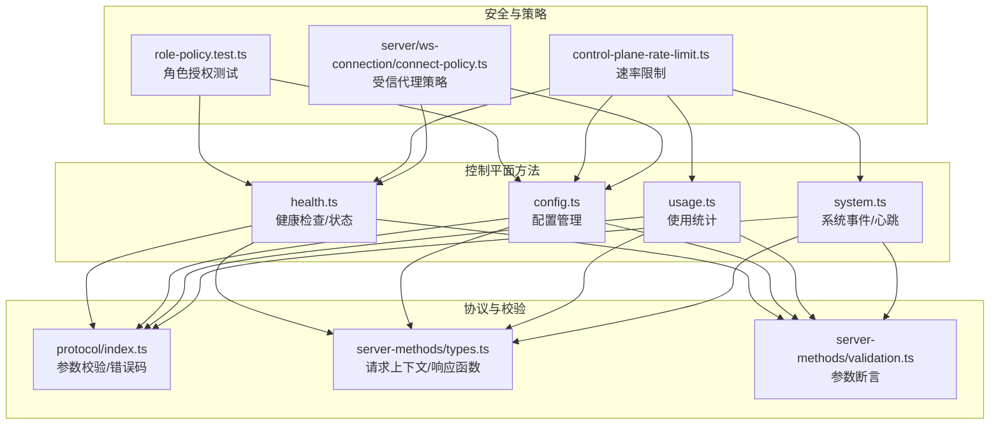
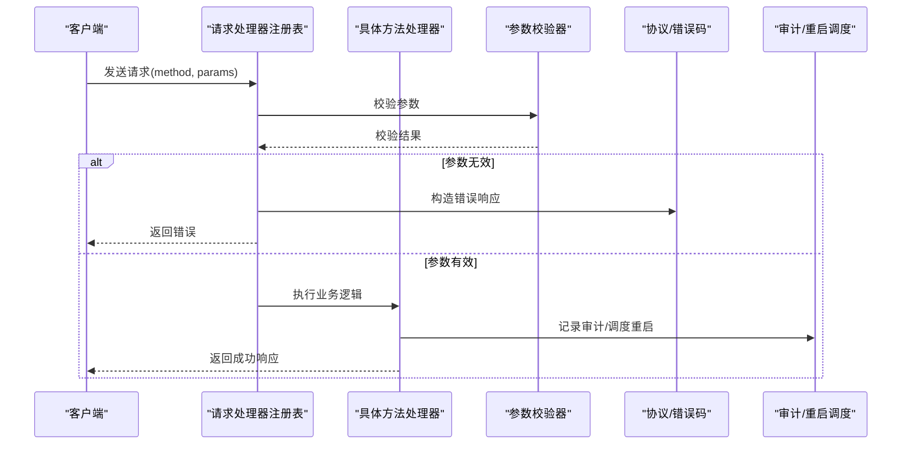
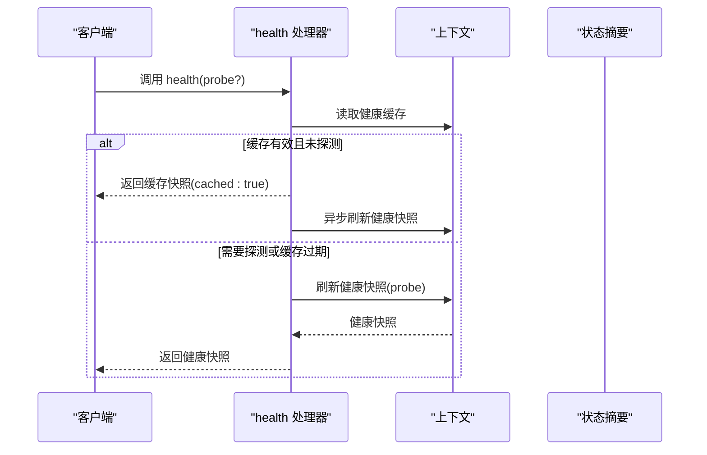
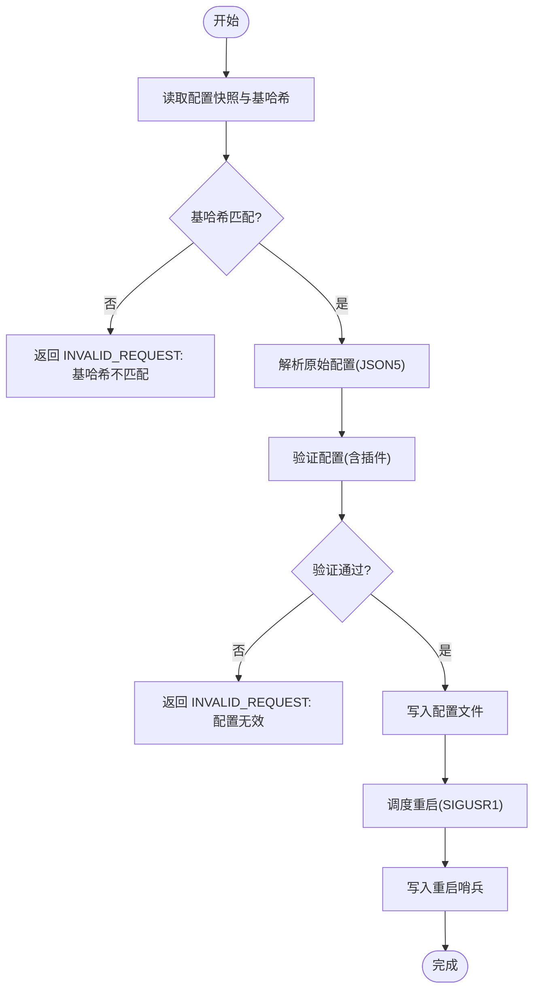
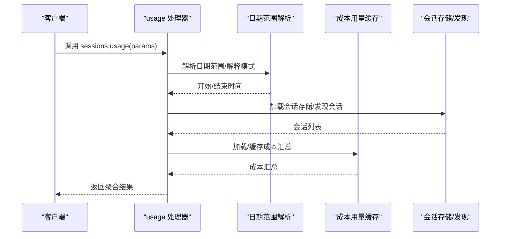
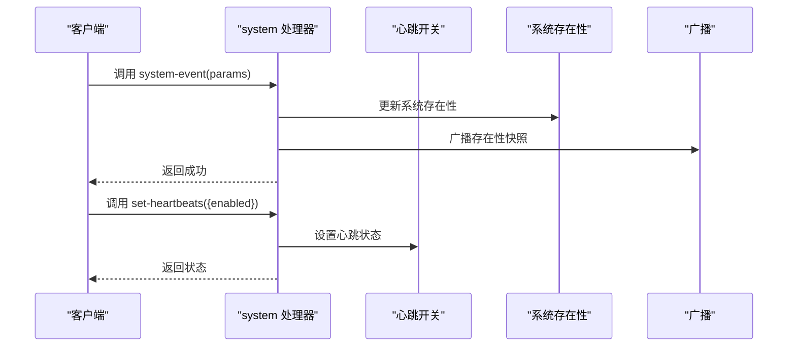
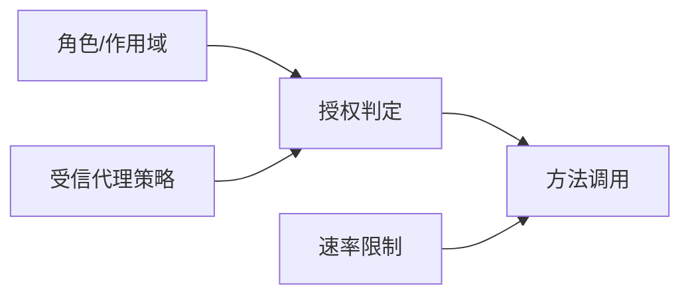

# 控制平面方法

<cite>
**本文引用的文件**
- [health.ts](file://src/gateway/server-methods/health.ts)
- [config.ts](file://src/gateway/server-methods/config.ts)
- [usage.ts](file://src/gateway/server-methods/usage.ts)
- [system.ts](file://src/gateway/server-methods/system.ts)
- [index.ts](file://src/gateway/protocol/index.ts)
- [types.ts](file://src/gateway/server-methods/types.ts)
- [validation.ts](file://src/gateway/server-methods/validation.ts)
- [role-policy.test.ts](file://src/gateway/role-policy.test.ts)
- [control-plane-rate-limit.ts](file://src/gateway/control-plane-rate-limit.ts)
- [connect-policy.ts](file://src/gateway/server/ws-connection/connect-policy.ts)
</cite>

## 目录
1. [简介](#简介)
2. [项目结构](#项目结构)
3. [核心组件](#核心组件)
4. [架构总览](#架构总览)
5. [详细组件分析](#详细组件分析)
6. [依赖关系分析](#依赖关系分析)
7. [性能考量](#性能考量)
8. [故障排查指南](#故障排查指南)
9. [结论](#结论)
10. [附录](#附录)

## 简介
本文件面向 OpenClaw 网关控制平面 API 的使用者，系统性梳理健康检查、状态查询、配置管理、使用统计、系统事件与心跳、以及系统级开关等核心控制平面方法。文档覆盖以下内容：
- 每个方法的用途、请求参数、返回结构、错误码与典型用法
- 权限与认证要求（角色、作用域、代理信任策略）
- 访问限制（速率限制）与安全注意事项
- 监控、诊断与维护相关的调用建议
- 批量操作、异步调用与回调机制的说明

## 项目结构
控制平面 API 的实现集中在网关服务器的方法模块中，并通过统一的协议校验与响应框架进行封装。

**图表来源**
- [health.ts:1-38](file://src/gateway/server-methods/health.ts#L1-L38)
- [config.ts:1-533](file://src/gateway/server-methods/config.ts#L1-L533)
- [usage.ts:1-800](file://src/gateway/server-methods/usage.ts#L1-L800)
- [system.ts:1-135](file://src/gateway/server-methods/system.ts#L1-L135)
- [index.ts:1-673](file://src/gateway/protocol/index.ts#L1-L673)
- [types.ts:1-113](file://src/gateway/server-methods/types.ts#L1-L113)
- [validation.ts:1-28](file://src/gateway/server-methods/validation.ts#L1-L28)
- [role-policy.test.ts:1-30](file://src/gateway/role-policy.test.ts#L1-L30)
- [control-plane-rate-limit.ts:47-86](file://src/gateway/control-plane-rate-limit.ts#L47-L86)
- [connect-policy.ts:46-66](file://src/gateway/server/ws-connection/connect-policy.ts#L46-L66)

**章节来源**
- [health.ts:1-38](file://src/gateway/server-methods/health.ts#L1-L38)
- [config.ts:1-533](file://src/gateway/server-methods/config.ts#L1-L533)
- [usage.ts:1-800](file://src/gateway/server-methods/usage.ts#L1-L800)
- [system.ts:1-135](file://src/gateway/server-methods/system.ts#L1-L135)
- [index.ts:1-673](file://src/gateway/protocol/index.ts#L1-L673)
- [types.ts:1-113](file://src/gateway/server-methods/types.ts#L1-L113)
- [validation.ts:1-28](file://src/gateway/server-methods/validation.ts#L1-L28)
- [role-policy.test.ts:1-30](file://src/gateway/role-policy.test.ts#L1-L30)
- [control-plane-rate-limit.ts:47-86](file://src/gateway/control-plane-rate-limit.ts#L47-L86)
- [connect-policy.ts:46-66](file://src/gateway/server/ws-connection/connect-policy.ts#L46-L66)

## 核心组件
- 健康检查与状态：提供健康快照与运行状态摘要，支持探测刷新与缓存。
- 配置管理：提供配置获取、模式查询、路径查询、设置、补丁、应用与重启哨兵写入。
- 使用统计：提供提供商用量汇总、会话粒度用量聚合与按日期范围统计。
- 系统事件与心跳：提供最近心跳、开启/关闭心跳、系统存在性更新与系统事件广播。
- 协议与校验：统一的参数校验器、错误码与响应形状。
- 安全与策略：角色授权、速率限制、受信代理认证策略。

**章节来源**
- [health.ts:10-37](file://src/gateway/server-methods/health.ts#L10-L37)
- [config.ts:279-532](file://src/gateway/server-methods/config.ts#L279-L532)
- [usage.ts:350-800](file://src/gateway/server-methods/usage.ts#L350-L800)
- [system.ts:10-134](file://src/gateway/server-methods/system.ts#L10-L134)
- [index.ts:123-564](file://src/gateway/protocol/index.ts#L123-L564)
- [validation.ts:9-27](file://src/gateway/server-methods/validation.ts#L9-L27)

## 架构总览
控制平面方法通过统一的请求处理器注册表分发到具体实现，所有请求均经过参数校验与错误处理，部分方法在上下文中记录审计信息并触发重启流程。

**图表来源**
- [types.ts:110-113](file://src/gateway/server-methods/types.ts#L110-L113)
- [validation.ts:9-27](file://src/gateway/server-methods/validation.ts#L9-L27)
- [index.ts:424-458](file://src/gateway/protocol/index.ts#L424-L458)

**章节来源**
- [types.ts:1-113](file://src/gateway/server-methods/types.ts#L1-L113)
- [validation.ts:1-28](file://src/gateway/server-methods/validation.ts#L1-L28)
- [index.ts:1-673](file://src/gateway/protocol/index.ts#L1-L673)

## 详细组件分析

### 健康检查与状态
- 方法列表
  - health：获取健康快照，支持探测刷新与缓存。
  - status：获取运行状态摘要，敏感信息需特定作用域。
- 请求参数
  - health：可选探测标志。
  - status：无参数。
- 返回结构
  - health：成功时返回健康快照；失败时返回错误形状。
  - status：返回状态摘要对象。
- 错误码
  - UNAVAILABLE：服务不可用。
- 典型用法
  - 健康探针：定期调用 health 获取状态。
  - 管理界面：携带管理员作用域调用 status 获取完整信息。
- 权限与认证
  - status 受作用域约束，需要特定作用域才显示敏感信息。
- 速率限制
  - 控制平面统一速率限制生效。
- 监控与诊断
  - 结合后台刷新与缓存策略，减少频繁读取开销。

**图表来源**
- [health.ts:11-29](file://src/gateway/server-methods/health.ts#L11-L29)

**章节来源**
- [health.ts:1-38](file://src/gateway/server-methods/health.ts#L1-L38)
- [index.ts:562-564](file://src/gateway/protocol/index.ts#L562-L564)

### 配置管理
- 方法列表
  - config.get：获取当前配置快照与 UI 提示。
  - config.schema：获取配置模式（含插件与通道）。
  - config.schema.lookup：按路径查询模式详情。
  - config.set：设置配置（需基哈希校验）。
  - config.patch：补丁式修改配置（需基哈希校验）。
  - config.apply：应用配置（需基哈希校验）。
- 请求参数
  - config.get：无参数。
  - config.schema：无参数。
  - config.schema.lookup：路径字符串。
  - config.set/patch/apply：原始 JSON 字符串、可选基哈希、可选重启请求参数。
- 返回结构
  - config.get/schema：配置快照/模式。
  - config.schema.lookup：模式详情或错误。
  - config.set/patch/apply：写入结果、重写后的配置、重启计划与重启哨兵信息。
- 错误码
  - INVALID_REQUEST：参数无效、基哈希缺失或不匹配、配置无效、模式路径不存在。
  - UNAVAILABLE：内部不可用。
- 典型用法
  - 在修改前先调用 config.get 获取基哈希，再执行 set/patch/apply。
  - 修改后可选择写入重启哨兵并触发延迟重启。
- 权限与认证
  - 仅允许具备相应作用域的角色调用。
- 速率限制
  - 控制平面统一速率限制生效。
- 审计与重启
  - 写入时记录审计信息，计算变更路径，调度 SIGUSR1 重启，支持合并去抖。

**图表来源**
- [config.ts:60-104](file://src/gateway/server-methods/config.ts#L60-L104)
- [config.ts:134-171](file://src/gateway/server-methods/config.ts#L134-L171)
- [config.ts:327-531](file://src/gateway/server-methods/config.ts#L327-L531)

**章节来源**
- [config.ts:1-533](file://src/gateway/server-methods/config.ts#L1-L533)
- [index.ts:562-564](file://src/gateway/protocol/index.ts#L562-L564)

### 使用统计
- 方法列表
  - usage.status：提供商用量汇总。
  - usage.cost：成本用量汇总（支持日期范围与解释模式）。
  - sessions.usage：会话用量聚合（支持按键过滤、限制数量、包含上下文权重）。
- 请求参数
  - usage.status：无参数。
  - usage.cost：开始/结束日期或天数、解释模式与 UTC 偏移。
  - sessions.usage：开始/结束日期或天数、限制条数、键过滤、是否包含上下文权重。
- 返回结构
  - usage.status：提供商用量摘要。
  - usage.cost：成本汇总（带缓存 TTL）。
  - sessions.usage：会话列表、总计、聚合统计（消息、工具、模型、供应商、代理、通道、延迟、每日明细等）。
- 错误码
  - INVALID_REQUEST：参数无效。
- 典型用法
  - 成本报表：按日/周/月范围查询 usage.cost。
  - 会话审计：使用 sessions.usage 获取会话维度用量与工具调用统计。
- 权限与认证
  - 仅允许具备相应作用域的角色调用。
- 性能优化
  - 成本用量汇总带缓存与飞行中去重，避免重复计算。

**图表来源**
- [usage.ts:350-800](file://src/gateway/server-methods/usage.ts#L350-L800)
- [usage.ts:282-332](file://src/gateway/server-methods/usage.ts#L282-L332)

**章节来源**
- [usage.ts:1-800](file://src/gateway/server-methods/usage.ts#L1-L800)
- [index.ts:562-564](file://src/gateway/protocol/index.ts#L562-L564)

### 系统事件与心跳
- 方法列表
  - last-heartbeat：获取最近心跳事件。
  - set-heartbeats：开启/关闭心跳。
  - system-presence：列出系统存在性。
  - system-event：发布系统事件并广播存在性快照。
- 请求参数
  - last-heartbeat：无参数。
  - set-heartbeats：enabled 布尔值。
  - system-presence：无参数。
  - system-event：文本、设备/实例/主机/IP/版本/平台/设备族/型号/最后输入秒数/原因/角色/作用域/标签等。
- 返回结构
  - last-heartbeat：心跳事件。
  - set-heartbeats：启用状态。
  - system-presence：存在性列表。
  - system-event：成功标记。
- 错误码
  - INVALID_REQUEST：参数无效。
- 典型用法
  - 运维告警：通过 system-event 发布节点变更事件。
  - 监控集成：轮询 last-heartbeat 与 system-presence。
- 权限与认证
  - 仅允许具备相应作用域的角色调用。
- 广播与上下文
  - system-event 更新存在性后广播快照，必要时生成系统事件。

**图表来源**
- [system.ts:10-134](file://src/gateway/server-methods/system.ts#L10-L134)

**章节来源**
- [system.ts:1-135](file://src/gateway/server-methods/system.ts#L1-L135)

## 依赖关系分析
- 角色授权
  - 不同角色对方法的访问权限不同，例如 operator 可调用 status，node 角色可调用 node.event 等。
- 速率限制
  - 控制平面统一速率限制，超过配额将返回重试时间与剩余次数。
- 受信代理认证
  - 对来自受信代理的控制 UI 操作员认证有专门策略判定。

**图表来源**
- [role-policy.test.ts:22-29](file://src/gateway/role-policy.test.ts#L22-L29)
- [control-plane-rate-limit.ts:47-86](file://src/gateway/control-plane-rate-limit.ts#L47-L86)
- [connect-policy.ts:46-66](file://src/gateway/server/ws-connection/connect-policy.ts#L46-L66)

**章节来源**
- [role-policy.test.ts:1-30](file://src/gateway/role-policy.test.ts#L1-L30)
- [control-plane-rate-limit.ts:47-86](file://src/gateway/control-plane-rate-limit.ts#L47-L86)
- [connect-policy.ts:46-66](file://src/gateway/server/ws-connection/connect-policy.ts#L46-L66)

## 性能考量
- 健康快照缓存：避免频繁刷新，后台异步刷新提升响应速度。
- 成本用量缓存：带 TTL 的缓存与飞行中去重，降低重复计算。
- 配置写入与重启：合并多次写入的重启调度，避免频繁重启。
- 速率限制：统一控制平面请求频率，防止滥用。

[本节为通用指导，无需特定文件来源]

## 故障排查指南
- 健康检查
  - 若 health 返回 UNAVAILABLE，检查后台刷新任务与日志。
- 配置管理
  - INVALID_REQUEST: 基哈希不匹配：重新调用 config.get 获取最新快照与哈希。
  - INVALID_REQUEST: 配置无效：根据错误详情修复配置。
  - UNAVAILABLE: 内部错误：检查重启哨兵与重启调度。
- 使用统计
  - INVALID_REQUEST: 参数无效：检查日期范围与解释模式。
  - 成本汇总异常：确认缓存状态与飞行中任务。
- 系统事件
  - INVALID_REQUEST: 参数无效：检查文本与字段类型。
  - 广播异常：检查存在性更新与广播上下文。

**章节来源**
- [health.ts:26-28](file://src/gateway/server-methods/health.ts#L26-L28)
- [config.ts:70-102](file://src/gateway/server-methods/config.ts#L70-L102)
- [usage.ts:368-377](file://src/gateway/server-methods/usage.ts#L368-L377)
- [system.ts:14-28](file://src/gateway/server-methods/system.ts#L14-L28)

## 结论
OpenClaw 控制平面 API 通过统一的协议校验、严格的参数与错误处理、以及完善的审计与重启机制，为健康监控、配置管理、使用统计与系统运维提供了稳定可靠的能力。配合角色授权、速率限制与受信代理策略，确保了在多场景下的安全性与可用性。

[本节为总结，无需特定文件来源]

## 附录

### 方法一览与要点
- health
  - 用途：健康快照与状态摘要。
  - 关键点：缓存与后台刷新、探测模式。
- status
  - 用途：运行状态摘要。
  - 关键点：敏感信息受作用域保护。
- config.get
  - 用途：获取配置快照。
  - 关键点：配合基哈希使用。
- config.schema / config.schema.lookup
  - 用途：配置模式与路径查询。
  - 关键点：返回模式详情或错误。
- config.set / config.patch / config.apply
  - 用途：配置设置/补丁/应用。
  - 关键点：基哈希校验、审计、重启调度、重启哨兵。
- usage.status / usage.cost
  - 用途：用量汇总。
  - 关键点：日期范围与解释模式、成本汇总缓存。
- sessions.usage
  - 用途：会话用量聚合。
  - 关键点：键过滤、限制条数、上下文权重。
- last-heartbeat / set-heartbeats
  - 用途：心跳事件与开关。
  - 关键点：布尔参数校验。
- system-presence / system-event
  - 用途：系统存在性与事件发布。
  - 关键点：广播存在性快照、系统事件队列。

**章节来源**
- [health.ts:10-37](file://src/gateway/server-methods/health.ts#L10-L37)
- [config.ts:279-532](file://src/gateway/server-methods/config.ts#L279-L532)
- [usage.ts:350-800](file://src/gateway/server-methods/usage.ts#L350-L800)
- [system.ts:10-134](file://src/gateway/server-methods/system.ts#L10-L134)