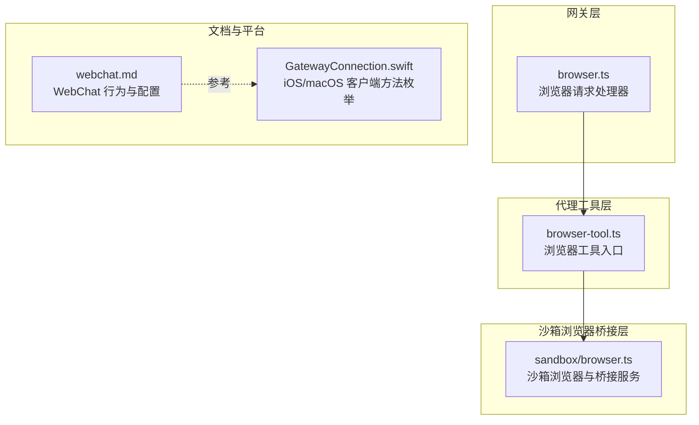
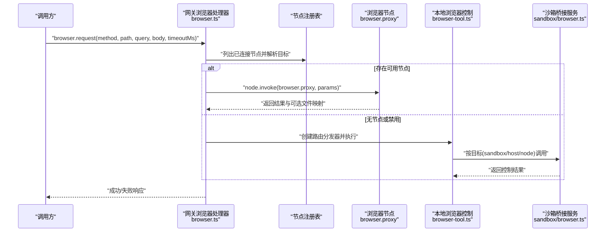
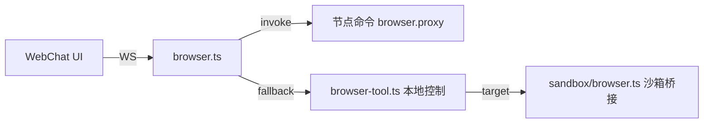

# 浏览器和 WebChat 方法

<cite>
**本文引用的文件**
- [src/gateway/server-methods/browser.ts](file://src/gateway/server-methods/browser.ts)
- [src/agents/tools/browser-tool.ts](file://src/agents/tools/browser-tool.ts)
- [src/agents/sandbox/browser.ts](file://src/agents/sandbox/browser.ts)
- [docs/web/webchat.md](file://docs/web/webchat.md)
- [apps/macos/Sources/OpenClaw/GatewayConnection.swift](file://apps/macos/Sources/OpenClaw/GatewayConnection.swift)
- [src/gateway/test-helpers.server.ts](file://src/gateway/test-helpers.server.ts)
</cite>

## 目录
1. [简介](#简介)
2. [项目结构](#项目结构)
3. [核心组件](#核心组件)
4. [架构总览](#架构总览)
5. [详细组件分析](#详细组件分析)
6. [依赖关系分析](#依赖关系分析)
7. [性能考量](#性能考量)
8. [故障排除指南](#故障排除指南)
9. [结论](#结论)
10. [附录](#附录)

## 简介
本文件面向 OpenClaw 的浏览器控制与 WebChat 实时聊天能力，系统化梳理以下内容：
- 浏览器请求代理与本地控制：浏览器状态查询、启动/停止、标签页管理、截图、PDF 导出、上传选择器、对话框处理、通用动作执行等。
- WebChat 聊天历史、消息注入与发送流程；实时通信与会话管理；跨域与安全策略；用户体验优化与兼容性建议。
- 错误码定义与典型问题排查；性能监控与最佳实践。

## 项目结构
围绕浏览器与 WebChat 的关键代码分布在网关层（Gateway）、代理工具层（Agent Tools）、沙箱浏览器桥接层（Sandbox）以及文档与平台侧实现中。

图表来源
- [src/gateway/server-methods/browser.ts:142-267](file://src/gateway/server-methods/browser.ts#L142-L267)
- [src/agents/tools/browser-tool.ts:281-660](file://src/agents/tools/browser-tool.ts#L281-L660)
- [src/agents/sandbox/browser.ts:1-402](file://src/agents/sandbox/browser.ts#L1-L402)
- [docs/web/webchat.md:1-62](file://docs/web/webchat.md#L1-L62)
- [apps/macos/Sources/OpenClaw/GatewayConnection.swift:56-89](file://apps/macos/Sources/OpenClaw/GatewayConnection.swift#L56-L89)

章节来源
- [src/gateway/server-methods/browser.ts:1-267](file://src/gateway/server-methods/browser.ts#L1-L267)
- [src/agents/tools/browser-tool.ts:1-660](file://src/agents/tools/browser-tool.ts#L1-L660)
- [src/agents/sandbox/browser.ts:1-402](file://src/agents/sandbox/browser.ts#L1-L402)
- [docs/web/webchat.md:1-62](file://docs/web/webchat.md#L1-L62)
- [apps/macos/Sources/OpenClaw/GatewayConnection.swift:56-89](file://apps/macos/Sources/OpenClaw/GatewayConnection.swift#L56-L89)

## 核心组件
- 网关浏览器请求处理器：负责接收浏览器相关请求，解析目标节点或本地控制服务，转发到浏览器代理或本地浏览器控制，并对结果进行持久化与路径映射。
- 代理浏览器工具：面向智能体的统一浏览器操作入口，支持沙箱/宿主机/节点三种目标模式，自动路由至可用节点或本地控制。
- 沙箱浏览器桥接：在容器内运行隔离浏览器并通过桥接服务对外暴露控制接口，支持无头模式、VNC/noVNC 观察、认证令牌等。
- WebChat 文档与客户端：描述 WebChat 的行为、配置与 WebSocket 交互方式，明确历史、发送、注入等方法的边界与稳定性策略。

章节来源
- [src/gateway/server-methods/browser.ts:142-267](file://src/gateway/server-methods/browser.ts#L142-L267)
- [src/agents/tools/browser-tool.ts:281-660](file://src/agents/tools/browser-tool.ts#L281-L660)
- [src/agents/sandbox/browser.ts:1-402](file://src/agents/sandbox/browser.ts#L1-L402)
- [docs/web/webchat.md:1-62](file://docs/web/webchat.md#L1-L62)

## 架构总览
下图展示从调用方到浏览器控制的端到端链路，包括节点代理与本地控制两条路径。

图表来源
- [src/gateway/server-methods/browser.ts:142-267](file://src/gateway/server-methods/browser.ts#L142-L267)
- [src/agents/tools/browser-tool.ts:305-660](file://src/agents/tools/browser-tool.ts#L305-L660)
- [src/agents/sandbox/browser.ts:129-402](file://src/agents/sandbox/browser.ts#L129-L402)

## 详细组件分析

### 网关浏览器请求处理器（browser.request）
- 功能要点
  - 参数校验：要求 method 和 path，且 method 限定为 GET/POST/DELETE。
  - 目标解析：优先匹配已声明“browser”能力或支持“browser.proxy”的节点；支持自动/手动/关闭三种模式与模糊匹配。
  - 权限检查：对节点命令“browser.proxy”进行白名单校验。
  - 代理执行：通过 node.invoke 调用目标节点的浏览器代理；若失败则返回 UNAVAILABLE 或 INVALID_REQUEST。
  - 本地回退：当无可用节点时，启动本地浏览器控制服务并执行路由分发。
  - 结果处理：持久化代理返回的文件，将内部路径映射为可访问 URL 并返回给调用方。

- 关键参数
  - method: 字符串，大写，必填（GET/POST/DELETE）
  - path: 字符串，必填
  - query: 对象，可选
  - body: 任意 JSON 兼容对象，可选
  - timeoutMs: 数字，毫秒，可选

- 返回值
  - 成功：返回代理或本地控制的结果对象
  - 失败：返回错误形状，包含错误码与可选 details

- 错误码
  - INVALID_REQUEST：缺少必要参数、method 非法、节点命令未允许、HTTP 状态 4xx
  - UNAVAILABLE：节点不可达、浏览器控制禁用、HTTP 状态 5xx、代理失败

- 使用示例（请求/响应示意）
  - 请求：携带 method/path/query/body/timeoutMs
  - 响应：成功返回业务数据；失败返回错误形状（含 details）

章节来源
- [src/gateway/server-methods/browser.ts:142-267](file://src/gateway/server-methods/browser.ts#L142-L267)

### 代理浏览器工具（browser 工具）
- 功能要点
  - 统一入口：根据 action 分派到不同浏览器操作（状态、启动/停止、标签页、打开、聚焦、关闭、快照、截图、导航、控制台、PDF、上传、对话框、通用动作等）。
  - 目标选择：支持 sandbox/host/node 三类目标；当存在节点型浏览器代理时优先自动路由。
  - 文件处理：代理返回的二进制文件会持久化并映射为可访问路径。
  - 会话跟踪：打开新标签时记录会话关联信息，便于后续动作复用同一标签上下文。

- 关键参数
  - action: 必填，字符串，如 "status"/"start"/"stop"/"profiles"/"tabs"/"open"/"focus"/"close"/"snapshot"/"screenshot"/"navigate"/"console"/"pdf"/"upload"/"dialog"/"act"
  - profile: 字符串，如 "chrome"/"openclaw"，用于区分扩展接管或隔离浏览器
  - target: "sandbox"|"host"|"node"，默认依据沙箱与策略决定
  - node: 字符串，指定节点 ID/名称，仅在 target="node" 时有效
  - 其他参数随 action 变化（如 targetUrl、targetId、fullPage、ref、element、paths、accept、promptText、request 等）

- 返回值
  - 不同 action 返回对应结构；截图/PDF 返回文件路径；通用动作返回执行结果

- 使用示例（典型场景）
  - 打开新标签并截图：action=open 后紧接 action=screenshot
  - 上传文件：action=upload，传入 paths 列表
  - 执行复杂动作：action=act，传入 request 描述点击/输入/等待等

章节来源
- [src/agents/tools/browser-tool.ts:281-660](file://src/agents/tools/browser-tool.ts#L281-L660)

### 沙箱浏览器桥接（Sandbox）
- 功能要点
  - 容器化隔离浏览器：基于 Docker 启动带 CDP 的浏览器实例，自动映射 CDP 端口，支持无头/有头模式。
  - 桥接服务：对外暴露受控的浏览器控制接口，支持认证令牌与密码，支持 noVNC 观察。
  - 热重启与配置哈希：检测配置变更并在“热窗口”内提示重建，否则强制重建以应用变更。
  - 自动启动：可配置自动启动并等待 CDP 就绪。

- 关键参数
  - scopeKey/workspaceDir/agentWorkspaceDir：作用域与工作区
  - cfg.browser：镜像、网络、端口、是否启用 noVNC、headless 等
  - evaluateEnabled：是否允许远程脚本评估
  - bridgeAuth：桥接认证令牌/密码（可复用或生成）

- 返回值
  - 返回 bridgeUrl/noVncUrl/containerName 等信息，供上层调用

章节来源
- [src/agents/sandbox/browser.ts:129-402](file://src/agents/sandbox/browser.ts#L129-L402)

### WebChat 实时通信与会话管理
- 行为与配置
  - WebChat 通过 Gateway WebSocket 连接，使用 chat.history、chat.send、chat.inject 等方法。
  - 历史获取受稳定性限制：长文本可能被截断，重元数据可能省略，超大条目会被替换为占位提示。
  - 注入助手备注：直接追加到转录并广播到 UI，不触发代理运行。
  - 中断处理：中断后 UI 可保留部分输出；Gateway 会在缓冲存在时持久化并标记中断元数据。
  - 历史来源：始终来自 Gateway，不进行本地文件监听。
  - 可用性：Gateway 不可达时，WebChat 为只读。

- 客户端方法枚举（参考 iOS/macOS 客户端）
  - 包括 chat.history、chat.send、chat.abort 等方法名，用于 WebSocket 交互。

- 使用示例（请求/响应示意）
  - 获取历史：chat.history
  - 发送消息：chat.send
  - 中断运行：chat.abort
  - 注入备注：chat.inject

章节来源
- [docs/web/webchat.md:1-62](file://docs/web/webchat.md#L1-L62)
- [apps/macos/Sources/OpenClaw/GatewayConnection.swift:77-80](file://apps/macos/Sources/OpenClaw/GatewayConnection.swift#L77-L80)

## 依赖关系分析
- 网关处理器依赖节点注册表与命令白名单策略，确保仅允许经许可的节点执行浏览器代理。
- 代理工具在无节点可用时回退到本地浏览器控制；当存在沙箱桥接时优先走容器化隔离环境。
- WebChat 与 Gateway 通过 WebSocket 协议交互，遵循统一的方法命名与错误语义。

图表来源
- [src/gateway/server-methods/browser.ts:171-267](file://src/gateway/server-methods/browser.ts#L171-L267)
- [src/agents/tools/browser-tool.ts:321-358](file://src/agents/tools/browser-tool.ts#L321-L358)
- [src/agents/sandbox/browser.ts:350-362](file://src/agents/sandbox/browser.ts#L350-L362)
- [docs/web/webchat.md:26-32](file://docs/web/webchat.md#L26-L32)

章节来源
- [src/gateway/server-methods/browser.ts:171-267](file://src/gateway/server-methods/browser.ts#L171-L267)
- [src/agents/tools/browser-tool.ts:321-358](file://src/agents/tools/browser-tool.ts#L321-L358)
- [src/agents/sandbox/browser.ts:350-362](file://src/agents/sandbox/browser.ts#L350-L362)
- [docs/web/webchat.md:26-32](file://docs/web/webchat.md#L26-L32)

## 性能考量
- 超时与节流
  - 网关层对浏览器代理设置超时并预留额外时间；代理工具层对节点代理与网关调用分别设定超时，避免阻塞。
  - 建议：根据页面复杂度与网络状况调整 timeoutMs，避免过短导致频繁超时。
- 文件处理
  - 代理返回的文件需持久化并映射路径，注意磁盘空间与清理策略。
- 沙箱热重启
  - 配置变更时尽量利用“热窗口”避免重建；频繁重建会影响体验与资源占用。
- WebSocket 交互
  - WebChat 历史获取受稳定性限制，建议前端做分页/节流加载，避免一次性拉取过多数据。

## 故障排除指南
- 浏览器代理失败
  - 确认节点已声明“browser”能力或支持“browser.proxy”，并处于已连接状态。
  - 检查命令白名单策略是否允许该节点执行 browser.proxy。
  - 若无节点可用，确认本地浏览器控制已启用且可访问。
- 节点目标冲突
  - 当传入 node 参数但 target 非 "node" 时会报错；请统一为 target="node"。
- 无可用浏览器节点
  - 在 manual 模式或未配置目标时，可能无法自动选择节点；请显式指定 node 或切换到 auto 模式。
- WebChat 只读
  - 当 Gateway 不可达时，WebChat 为只读；请检查网络连通性与认证配置。
- WebSocket 客户端
  - 参考客户端方法枚举，确保使用正确的 chat.history/chat.send/chat.abort/chat.inject 等方法名。

章节来源
- [src/gateway/server-methods/browser.ts:171-267](file://src/gateway/server-methods/browser.ts#L171-L267)
- [src/agents/tools/browser-tool.ts:312-314](file://src/agents/tools/browser-tool.ts#L312-L314)
- [docs/web/webchat.md:30-32](file://docs/web/webchat.md#L30-L32)
- [apps/macos/Sources/OpenClaw/GatewayConnection.swift:77-80](file://apps/macos/Sources/OpenClaw/GatewayConnection.swift#L77-L80)

## 结论
- 浏览器控制通过“节点代理 + 本地回退”的双通道设计，兼顾灵活性与可用性。
- 代理工具提供统一的 API 与目标选择策略，适配沙箱/宿主机/节点多种场景。
- WebChat 采用 Gateway WebSocket 实时通信，具备稳定的边界与中断处理机制。
- 建议结合超时策略、文件持久化与沙箱热重启策略，持续优化性能与可靠性。

## 附录

### API 方法清单与规范

- 网关浏览器请求（browser.request）
  - 方法：browser.request
  - 参数：
    - method: "GET"|"POST"|"DELETE"
    - path: 字符串，必填
    - query: 对象，可选
    - body: 对象，可选
    - timeoutMs: 数字，可选
  - 返回：成功返回业务对象；失败返回错误形状
  - 错误码：INVALID_REQUEST、UNAVAILABLE

- 代理浏览器工具（browser 工具）
  - 方法：browser（内部 action 分派）
  - 常见 action：
    - status/start/stop/profiles/tabs/open/focus/close/snapshot/screenshot/navigate/console/pdf/upload/dialog/act
  - 参数：随 action 变化（如 targetUrl、targetId、fullPage、ref、element、paths、accept、promptText、request 等）
  - 返回：各 action 对应结构；截图/PDF 返回文件路径
  - 错误码：INVALID_REQUEST、UNAVAILABLE

- WebChat 方法（WebSocket）
  - 方法：chat.history、chat.send、chat.abort、chat.inject
  - 说明：历史受稳定性限制；注入不触发代理运行；中断后保留部分输出并持久化

章节来源
- [src/gateway/server-methods/browser.ts:142-267](file://src/gateway/server-methods/browser.ts#L142-L267)
- [src/agents/tools/browser-tool.ts:360-660](file://src/agents/tools/browser-tool.ts#L360-L660)
- [docs/web/webchat.md:26-32](file://docs/web/webchat.md#L26-L32)

### 跨域与安全策略
- WebSocket 认证
  - 支持 token/password 或受信代理认证；WebChat 与客户端需正确配置。
- 沙箱桥接认证
  - 桥接服务要求认证令牌/密码，保持稳定以便复用。
- CORS 与 Origin
  - 测试辅助函数展示了如何设置 Origin 头部，确保 WebSocket 连接符合预期。

章节来源
- [docs/web/webchat.md:57-61](file://docs/web/webchat.md#L57-L61)
- [src/gateway/test-helpers.server.ts:668-704](file://src/gateway/test-helpers.server.ts#L668-L704)