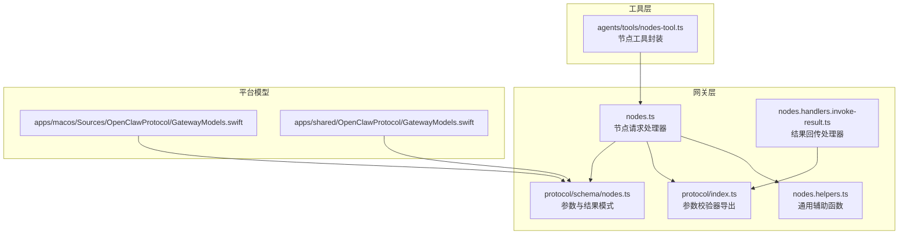
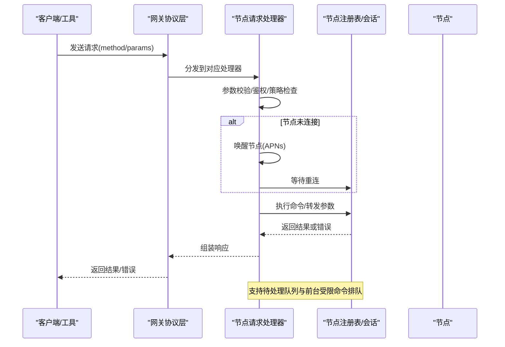
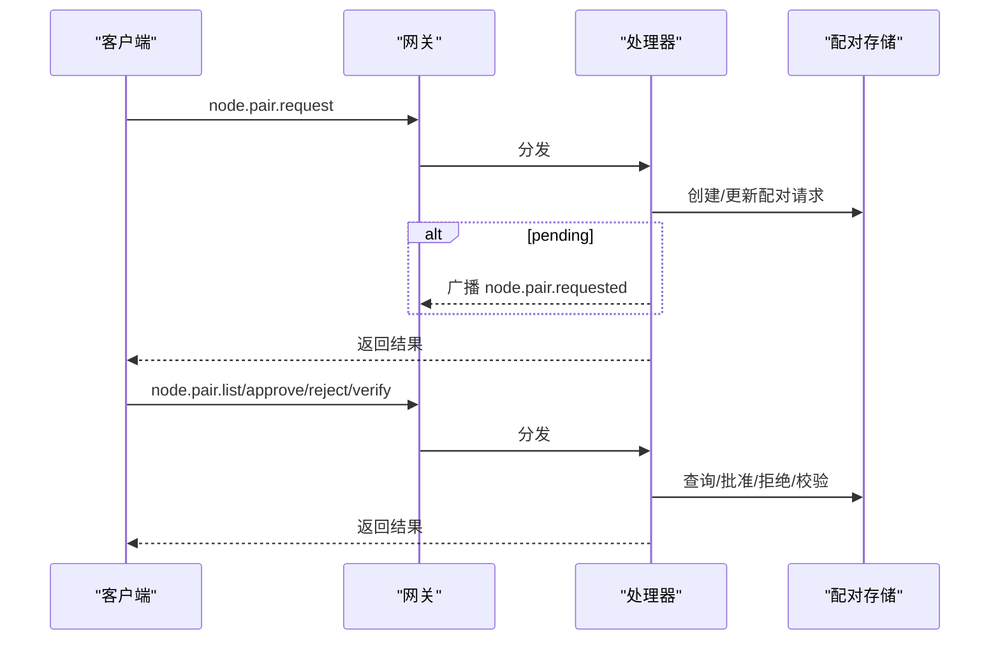
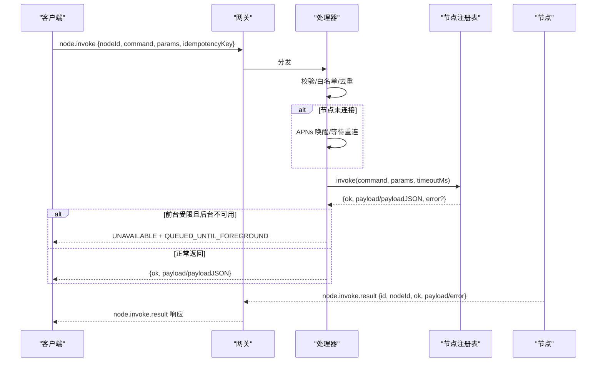
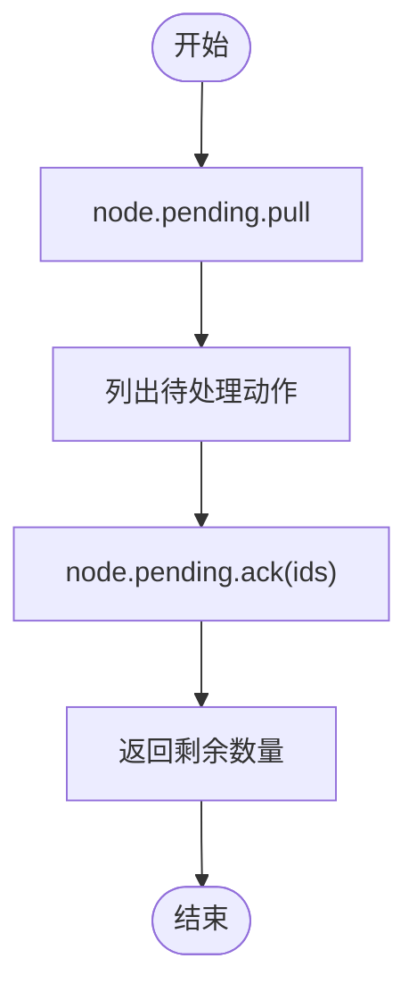
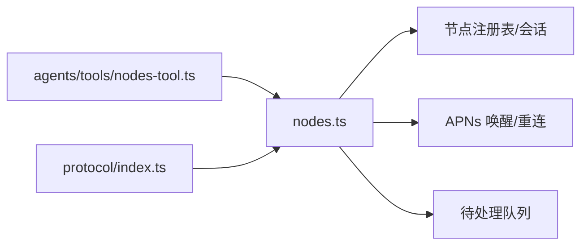

# 节点操作方法

<cite>
**本文引用的文件**
- [src/gateway/server-methods/nodes.ts](file://src/gateway/server-methods/nodes.ts)
- [src/gateway/protocol/schema/nodes.ts](file://src/gateway/protocol/schema/nodes.ts)
- [src/gateway/protocol/index.ts](file://src/gateway/protocol/index.ts)
- [src/gateway/server-methods/nodes.handlers.invoke-result.ts](file://src/gateway/server-methods/nodes.handlers.invoke-result.ts)
- [src/gateway/server-methods/nodes.helpers.ts](file://src/gateway/server-methods/nodes.helpers.ts)
- [src/agents/tools/nodes-tool.ts](file://src/agents/tools/nodes-tool.ts)
- [apps/macos/Sources/OpenClawProtocol/GatewayModels.swift](file://apps/macos/Sources/OpenClawProtocol/GatewayModels.swift)
- [apps/shared/OpenClawProtocol/GatewayModels.swift](file://apps/shared/OpenClawProtocol/GatewayModels.swift)
- [docs/concepts/architecture.md](file://docs/concepts/architecture.md)
</cite>

## 目录
1. [简介](#简介)
2. [项目结构](#项目结构)
3. [核心组件](#核心组件)
4. [架构总览](#架构总览)
5. [详细组件分析](#详细组件分析)
6. [依赖关系分析](#依赖关系分析)
7. [性能考量](#性能考量)
8. [故障排除指南](#故障排除指南)
9. [结论](#结论)
10. [附录](#附录)

## 简介
本文件系统性梳理 OpenClaw 的“节点操作”相关 API，覆盖节点配对（请求、列表、批准、拒绝、校验）、重命名、描述查询、节点命令调用、待处理队列拉取与确认、事件上报与结果回传等能力。文档面向开发者与运维人员，提供参数规范、返回结构、错误码、典型使用场景、生命周期与状态同步机制、权限与安全控制、以及性能优化与排障建议。

## 项目结构
围绕节点操作的核心代码位于网关层的 server-methods 与 protocol 子模块，并通过工具层（agents/tools）对外暴露统一的节点操作入口。下图展示与节点操作直接相关的模块关系：

**图表来源**
- [src/gateway/server-methods/nodes.ts:384-1052](file://src/gateway/server-methods/nodes.ts#L384-L1052)
- [src/gateway/protocol/schema/nodes.ts:1-167](file://src/gateway/protocol/schema/nodes.ts#L1-L167)
- [src/gateway/protocol/index.ts:283-312](file://src/gateway/protocol/index.ts#L283-L312)
- [src/gateway/server-methods/nodes.handlers.invoke-result.ts:1-72](file://src/gateway/server-methods/nodes.handlers.invoke-result.ts#L1-L72)
- [src/gateway/server-methods/nodes.helpers.ts:1-81](file://src/gateway/server-methods/nodes.helpers.ts#L1-L81)
- [src/agents/tools/nodes-tool.ts:175-800](file://src/agents/tools/nodes-tool.ts#L175-L800)
- [apps/macos/Sources/OpenClawProtocol/GatewayModels.swift:813-872](file://apps/macos/Sources/OpenClawProtocol/GatewayModels.swift#L813-L872)
- [apps/shared/OpenClawProtocol/GatewayModels.swift:813-872](file://apps/shared/OpenClawProtocol/GatewayModels.swift#L813-L872)

**章节来源**
- [src/gateway/server-methods/nodes.ts:384-1052](file://src/gateway/server-methods/nodes.ts#L384-L1052)
- [src/gateway/protocol/schema/nodes.ts:1-167](file://src/gateway/protocol/schema/nodes.ts#L1-L167)
- [src/gateway/protocol/index.ts:283-312](file://src/gateway/protocol/index.ts#L283-L312)
- [src/gateway/server-methods/nodes.handlers.invoke-result.ts:1-72](file://src/gateway/server-methods/nodes.handlers.invoke-result.ts#L1-L72)
- [src/gateway/server-methods/nodes.helpers.ts:1-81](file://src/gateway/server-methods/nodes.helpers.ts#L1-L81)
- [src/agents/tools/nodes-tool.ts:175-800](file://src/agents/tools/nodes-tool.ts#L175-L800)
- [apps/macos/Sources/OpenClawProtocol/GatewayModels.swift:813-872](file://apps/macos/Sources/OpenClawProtocol/GatewayModels.swift#L813-L872)
- [apps/shared/OpenClawProtocol/GatewayModels.swift:813-872](file://apps/shared/OpenClawProtocol/GatewayModels.swift#L813-L872)

## 核心组件
- 节点请求处理器：实现节点配对、重命名、描述、列表、命令调用、待处理队列、事件上报与结果回传等方法。
- 协议模式与校验：基于 TypeBox 定义的参数/结果模式，生成 AJV 校验器，确保入参合法性。
- 工具封装：在 agents/tools 中统一封装节点操作，便于上层代理工具调用。
- 平台模型：Swift 端的 NodeRenameParams、NodeDescribeParams、NodeInvokeParams 等模型与网关层保持一致字段映射。

**章节来源**
- [src/gateway/server-methods/nodes.ts:384-1052](file://src/gateway/server-methods/nodes.ts#L384-L1052)
- [src/gateway/protocol/schema/nodes.ts:1-167](file://src/gateway/protocol/schema/nodes.ts#L1-L167)
- [src/gateway/protocol/index.ts:283-312](file://src/gateway/protocol/index.ts#L283-L312)
- [src/agents/tools/nodes-tool.ts:175-800](file://src/agents/tools/nodes-tool.ts#L175-L800)
- [apps/macos/Sources/OpenClawProtocol/GatewayModels.swift:813-872](file://apps/macos/Sources/OpenClawProtocol/GatewayModels.swift#L813-L872)
- [apps/shared/OpenClawProtocol/GatewayModels.swift:813-872](file://apps/shared/OpenClawProtocol/GatewayModels.swift#L813-L872)

## 架构总览
节点操作贯穿“客户端/工具层 → 网关协议层 → 节点请求处理器 → 节点会话/注册表”的链路。节点连接采用 WebSocket，设备身份在握手阶段声明并完成配对；命令调用时支持唤醒、重连等待、命令白名单校验、幂等键去重、待处理队列等机制。

**图表来源**
- [src/gateway/server-methods/nodes.ts:776-1004](file://src/gateway/server-methods/nodes.ts#L776-L1004)
- [src/gateway/server-methods/nodes.helpers.ts:25-80](file://src/gateway/server-methods/nodes.helpers.ts#L25-L80)
- [docs/concepts/architecture.md:12-140](file://docs/concepts/architecture.md#L12-L140)

**章节来源**
- [src/gateway/server-methods/nodes.ts:776-1004](file://src/gateway/server-methods/nodes.ts#L776-L1004)
- [src/gateway/server-methods/nodes.helpers.ts:25-80](file://src/gateway/server-methods/nodes.helpers.ts#L25-L80)
- [docs/concepts/architecture.md:12-140](file://docs/concepts/architecture.md#L12-L140)

## 详细组件分析

### 节点配对方法
- node.pair.request
  - 功能：发起节点配对请求，携带设备信息与能力声明。
  - 参数模式：NodePairRequestParamsSchema
  - 返回：包含请求状态与请求对象（当状态为 pending 时广播 node.pair.requested）
  - 典型场景：新节点首次连接或更换设备后重新配对
- node.pair.list
  - 功能：列出待审批的节点配对请求
  - 参数模式：NodePairListParamsSchema
  - 返回：请求列表
- node.pair.approve
  - 功能：批准节点配对请求
  - 参数模式：NodePairApproveParamsSchema
  - 返回：已批准的配对结果，并广播 node.pair.resolved（decision=approved）
- node.pair.reject
  - 功能：拒绝节点配对请求
  - 参数模式：NodePairRejectParamsSchema
  - 返回：被拒绝的配对结果，并广播 node.pair.resolved（decision=rejected）
- node.pair.verify
  - 功能：校验节点令牌有效性
  - 参数模式：NodePairVerifyParamsSchema
  - 返回：校验结果

**图表来源**
- [src/gateway/server-methods/nodes.ts:384-508](file://src/gateway/server-methods/nodes.ts#L384-L508)
- [src/gateway/protocol/schema/nodes.ts:12-45](file://src/gateway/protocol/schema/nodes.ts#L12-L45)
- [src/gateway/protocol/index.ts:283-295](file://src/gateway/protocol/index.ts#L283-L295)

**章节来源**
- [src/gateway/server-methods/nodes.ts:384-508](file://src/gateway/server-methods/nodes.ts#L384-L508)
- [src/gateway/protocol/schema/nodes.ts:12-45](file://src/gateway/protocol/schema/nodes.ts#L12-L45)
- [src/gateway/protocol/index.ts:283-295](file://src/gateway/protocol/index.ts#L283-L295)

### 节点重命名
- node.rename
  - 功能：修改已配对节点显示名称
  - 参数模式：NodeRenameParamsSchema
  - 返回：包含 nodeId 与 displayName 的对象
  - 错误：未知 nodeId 或空显示名将返回 INVALID_REQUEST

**章节来源**
- [src/gateway/server-methods/nodes.ts:509-535](file://src/gateway/server-methods/nodes.ts#L509-L535)
- [src/gateway/protocol/schema/nodes.ts:47-50](file://src/gateway/protocol/schema/nodes.ts#L47-L50)
- [src/gateway/protocol/index.ts](file://src/gateway/protocol/index.ts#L296)

### 节点描述与列表
- node.describe
  - 功能：获取节点的详细信息（含已连接与已配对状态的合并视图）
  - 参数模式：NodeDescribeParamsSchema
  - 返回：包含节点标识、显示名、平台、版本、能力、命令、权限、连接状态等
- node.list
  - 功能：列出所有节点（已连接与已配对合并），按连接状态与显示名排序
  - 参数模式：NodeListParamsSchema
  - 返回：包含时间戳与节点数组

**章节来源**
- [src/gateway/server-methods/nodes.ts:617-670](file://src/gateway/server-methods/nodes.ts#L617-L670)
- [src/gateway/protocol/schema/nodes.ts:61-64](file://src/gateway/protocol/schema/nodes.ts#L61-L64)
- [src/gateway/protocol/schema/nodes.ts:52-53](file://src/gateway/protocol/schema/nodes.ts#L52-L53)

### 节点命令调用与结果回传
- node.invoke
  - 功能：向节点发送命令执行请求
  - 参数模式：NodeInvokeParamsSchema
  - 关键流程：
    - 校验参数与命令白名单
    - 若节点未连接，尝试 APNs 唤醒并等待重连
    - 对前台受限命令在后台不可用时可进入待处理队列
    - 结果通过 node.invoke.result 回传，或在超时/失败时返回 UNAVAILABLE
- node.invoke.result
  - 功能：节点侧上报调用结果
  - 参数模式：NodeInvokeResultParamsSchema
  - 校验：严格校验 nodeId 一致性，忽略过期/重复结果

**图表来源**
- [src/gateway/server-methods/nodes.ts:776-1004](file://src/gateway/server-methods/nodes.ts#L776-L1004)
- [src/gateway/server-methods/nodes.handlers.invoke-result.ts:25-72](file://src/gateway/server-methods/nodes.handlers.invoke-result.ts#L25-L72)
- [src/gateway/protocol/schema/nodes.ts:66-95](file://src/gateway/protocol/schema/nodes.ts#L66-L95)

**章节来源**
- [src/gateway/server-methods/nodes.ts:776-1004](file://src/gateway/server-methods/nodes.ts#L776-L1004)
- [src/gateway/server-methods/nodes.handlers.invoke-result.ts:25-72](file://src/gateway/server-methods/nodes.handlers.invoke-result.ts#L25-L72)
- [src/gateway/protocol/schema/nodes.ts:66-95](file://src/gateway/protocol/schema/nodes.ts#L66-L95)

### 待处理队列管理
- node.pending.pull
  - 功能：拉取当前节点的待处理动作队列
  - 参数模式：NodeListParamsSchema
  - 返回：包含 nodeId 与 actions 数组（每项含 id、command、paramsJSON、enqueuedAtMs）
- node.pending.ack
  - 功能：确认消费待处理动作
  - 参数模式：NodePendingAckParamsSchema
  - 返回：ackedIds 与 remainingCount

**图表来源**
- [src/gateway/server-methods/nodes.ts:716-775](file://src/gateway/server-methods/nodes.ts#L716-L775)
- [src/gateway/protocol/schema/nodes.ts:54-59](file://src/gateway/protocol/schema/nodes.ts#L54-L59)

**章节来源**
- [src/gateway/server-methods/nodes.ts:716-775](file://src/gateway/server-methods/nodes.ts#L716-L775)
- [src/gateway/protocol/schema/nodes.ts:54-59](file://src/gateway/protocol/schema/nodes.ts#L54-L59)

### 事件上报与通知
- node.event
  - 功能：接收节点侧上报的事件（如通知变化、位置请求等）
  - 参数模式：NodeEventParamsSchema
  - 处理：交由节点事件处理器，触发相应系统事件与心跳

**章节来源**
- [src/gateway/server-methods/nodes.ts:1006-1051](file://src/gateway/server-methods/nodes.ts#L1006-L1051)
- [src/gateway/protocol/schema/nodes.ts:97-104](file://src/gateway/protocol/schema/nodes.ts#L97-L104)

### 平台模型映射
- Swift 端模型与网关层参数保持一致字段映射，例如：
  - NodeRenameParams：nodeId、displayName
  - NodeDescribeParams：nodeId
  - NodeInvokeParams：nodeId、command、params、timeoutMs、idempotencyKey

**章节来源**
- [apps/macos/Sources/OpenClawProtocol/GatewayModels.swift:813-872](file://apps/macos/Sources/OpenClawProtocol/GatewayModels.swift#L813-L872)
- [apps/shared/OpenClawProtocol/GatewayModels.swift:813-872](file://apps/shared/OpenClawProtocol/GatewayModels.swift#L813-L872)

## 依赖关系分析
- 参数校验依赖：AJV 校验器由 protocol/index.ts 导出，供各处理器复用。
- 命令白名单：节点命令允许策略由 node-command-policy 模块解析，结合节点声明命令进行判定。
- 去重与幂等：idempotencyKey 用于避免重复副作用；工具层默认生成随机键。
- 前台受限命令：iOS 前台受限命令在后台不可用时自动进入待处理队列并可触发唤醒。

**图表来源**
- [src/agents/tools/nodes-tool.ts:175-800](file://src/agents/tools/nodes-tool.ts#L175-L800)
- [src/gateway/server-methods/nodes.ts:384-1052](file://src/gateway/server-methods/nodes.ts#L384-L1052)
- [src/gateway/protocol/index.ts:283-312](file://src/gateway/protocol/index.ts#L283-L312)

**章节来源**
- [src/agents/tools/nodes-tool.ts:175-800](file://src/agents/tools/nodes-tool.ts#L175-L800)
- [src/gateway/server-methods/nodes.ts:384-1052](file://src/gateway/server-methods/nodes.ts#L384-L1052)
- [src/gateway/protocol/index.ts:283-312](file://src/gateway/protocol/index.ts#L283-L312)

## 性能考量
- 唤醒与重连退避：内置节流与轮询间隔，避免频繁唤醒造成资源浪费。
- 前台受限命令队列：在后台不可用时延迟执行，减少无效调用。
- 去重与幂等：合理使用 idempotencyKey，降低重复调用成本。
- 超时设置：根据命令特性设置合理的 timeoutMs，避免长时间阻塞。

[本节为通用指导，无需特定文件引用]

## 故障排除指南
- 常见错误码
  - INVALID_REQUEST：参数校验失败、未知节点、命令不在白名单、缺少必要字段等
  - UNAVAILABLE：节点未连接、节点调用失败、前台受限命令排队
- 排查步骤
  - 确认节点已配对并通过 node.list/node.describe 获取状态
  - 检查命令是否在节点声明的 commands 列表中
  - 验证 idempotencyKey 是否正确传递
  - 对前台受限命令，关注 QUEUED_UNTIL_FOREGROUND 提示并等待前台恢复
  - 使用 node.invoke.result 追踪节点侧返回的错误详情

**章节来源**
- [src/gateway/server-methods/nodes.ts:509-535](file://src/gateway/server-methods/nodes.ts#L509-L535)
- [src/gateway/server-methods/nodes.ts:776-1004](file://src/gateway/server-methods/nodes.ts#L776-L1004)
- [src/gateway/server-methods/nodes.helpers.ts:55-80](file://src/gateway/server-methods/nodes.helpers.ts#L55-L80)

## 结论
节点操作 API 以严格的参数模式与校验为基础，结合配对、重命名、描述、命令调用、待处理队列与事件回传等能力，形成完整的节点生命周期管理闭环。通过白名单策略、APNs 唤醒、前台受限命令队列与幂等键等机制，兼顾安全性与可用性。建议在生产环境中合理设置超时与重试策略，并通过工具层统一封装常用操作。

[本节为总结，无需特定文件引用]

## 附录

### API 方法一览与参数/返回说明

- node.pair.request
  - 请求参数：nodeId、displayName、platform、version、coreVersion、uiVersion、deviceFamily、modelIdentifier、caps、commands、remoteIp、silent
  - 返回：状态与请求对象（pending 时广播 node.pair.requested）
  - 参考
    - [src/gateway/protocol/schema/nodes.ts:12-28](file://src/gateway/protocol/schema/nodes.ts#L12-L28)
    - [src/gateway/server-methods/nodes.ts:384-418](file://src/gateway/server-methods/nodes.ts#L384-L418)

- node.pair.list
  - 请求参数：无
  - 返回：请求列表
  - 参考
    - [src/gateway/protocol/schema/nodes.ts](file://src/gateway/protocol/schema/nodes.ts#L30)
    - [src/gateway/server-methods/nodes.ts:419-432](file://src/gateway/server-methods/nodes.ts#L419-L432)

- node.pair.approve
  - 请求参数：requestId
  - 返回：已批准的配对结果（广播 node.pair.resolved）
  - 参考
    - [src/gateway/protocol/schema/nodes.ts:32-35](file://src/gateway/protocol/schema/nodes.ts#L32-L35)
    - [src/gateway/server-methods/nodes.ts:433-461](file://src/gateway/server-methods/nodes.ts#L433-L461)

- node.pair.reject
  - 请求参数：requestId
  - 返回：已拒绝的配对结果（广播 node.pair.resolved）
  - 参考
    - [src/gateway/protocol/schema/nodes.ts:37-40](file://src/gateway/protocol/schema/nodes.ts#L37-L40)
    - [src/gateway/server-methods/nodes.ts:462-490](file://src/gateway/server-methods/nodes.ts#L462-L490)

- node.pair.verify
  - 请求参数：nodeId、token
  - 返回：校验结果
  - 参考
    - [src/gateway/protocol/schema/nodes.ts:42-45](file://src/gateway/protocol/schema/nodes.ts#L42-L45)
    - [src/gateway/server-methods/nodes.ts:491-508](file://src/gateway/server-methods/nodes.ts#L491-L508)

- node.rename
  - 请求参数：nodeId、displayName
  - 返回：{nodeId, displayName}
  - 参考
    - [src/gateway/protocol/schema/nodes.ts:47-50](file://src/gateway/protocol/schema/nodes.ts#L47-L50)
    - [src/gateway/server-methods/nodes.ts:509-535](file://src/gateway/server-methods/nodes.ts#L509-L535)

- node.describe
  - 请求参数：nodeId
  - 返回：节点详细信息（合并已连接与已配对视图）
  - 参考
    - [src/gateway/protocol/schema/nodes.ts:61-64](file://src/gateway/protocol/schema/nodes.ts#L61-L64)
    - [src/gateway/server-methods/nodes.ts:617-670](file://src/gateway/server-methods/nodes.ts#L617-L670)

- node.list
  - 请求参数：无
  - 返回：{ts, nodes[]}
  - 参考
    - [src/gateway/protocol/schema/nodes.ts:52-53](file://src/gateway/protocol/schema/nodes.ts#L52-L53)
    - [src/gateway/server-methods/nodes.ts:536-616](file://src/gateway/server-methods/nodes.ts#L536-L616)

- node.invoke
  - 请求参数：nodeId、command、params、timeoutMs、idempotencyKey
  - 返回：{ok, nodeId, command, payload 或 payloadJSON}
  - 参考
    - [src/gateway/protocol/schema/nodes.ts:66-75](file://src/gateway/protocol/schema/nodes.ts#L66-L75)
    - [src/gateway/server-methods/nodes.ts:776-1004](file://src/gateway/server-methods/nodes.ts#L776-L1004)

- node.invoke.result
  - 请求参数：id、nodeId、ok、payload/payloadJSON、error
  - 返回：{ok} 或 {ok, ignored:true}
  - 参考
    - [src/gateway/server-methods/nodes.handlers.invoke-result.ts:25-72](file://src/gateway/server-methods/nodes.handlers.invoke-result.ts#L25-L72)
    - [src/gateway/protocol/schema/nodes.ts:77-95](file://src/gateway/protocol/schema/nodes.ts#L77-L95)

- node.pending.pull
  - 请求参数：无
  - 返回：{nodeId, actions[]}
  - 参考
    - [src/gateway/protocol/schema/nodes.ts:52-53](file://src/gateway/protocol/schema/nodes.ts#L52-L53)
    - [src/gateway/server-methods/nodes.ts:716-746](file://src/gateway/server-methods/nodes.ts#L716-L746)

- node.pending.ack
  - 请求参数：ids[]
  - 返回：{nodeId, ackedIds, remainingCount}
  - 参考
    - [src/gateway/protocol/schema/nodes.ts:54-59](file://src/gateway/protocol/schema/nodes.ts#L54-L59)
    - [src/gateway/server-methods/nodes.ts:747-775](file://src/gateway/server-methods/nodes.ts#L747-L775)

- node.event
  - 请求参数：event、payload/payloadJSON
  - 返回：{ok}
  - 参考
    - [src/gateway/protocol/schema/nodes.ts:97-104](file://src/gateway/protocol/schema/nodes.ts#L97-L104)
    - [src/gateway/server-methods/nodes.ts:1006-1051](file://src/gateway/server-methods/nodes.ts#L1006-L1051)

### 权限控制与安全
- 设备身份与签名：连接时需提供设备身份并在握手时签名，非本地连接仍需显式批准。
- 白名单策略：命令调用前进行白名单校验，防止未声明命令被执行。
- 幂等键：要求对有副作用的方法提供 idempotencyKey，服务端进行去重。
- 本地信任：同机环回或网关主机自身尾网地址可自动批准，提升本地体验。

**章节来源**
- [docs/concepts/architecture.md:93-128](file://docs/concepts/architecture.md#L93-L128)
- [src/gateway/server-methods/nodes.ts:897-914](file://src/gateway/server-methods/nodes.ts#L897-L914)
- [src/gateway/server-methods/nodes.helpers.ts:33-53](file://src/gateway/server-methods/nodes.helpers.ts#L33-L53)