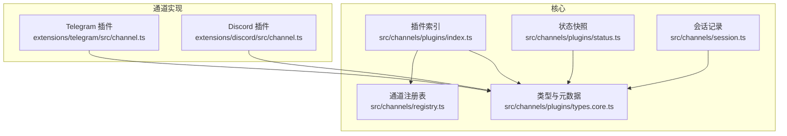
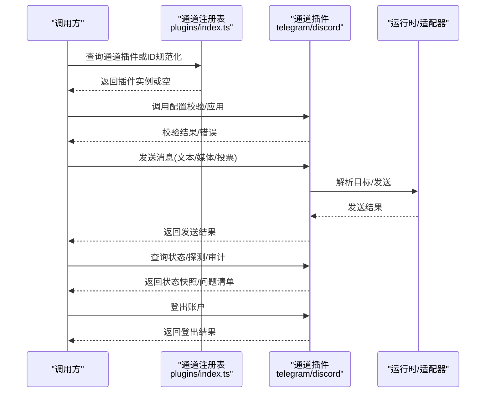
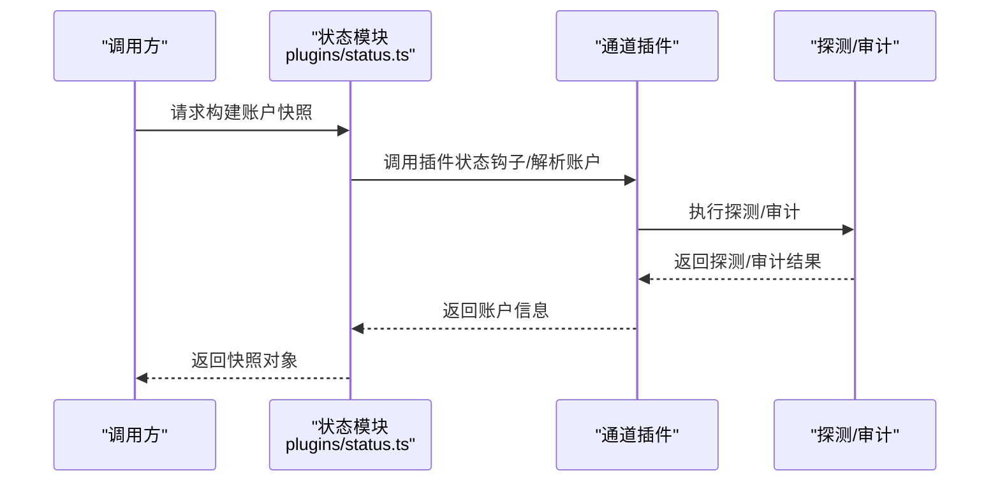
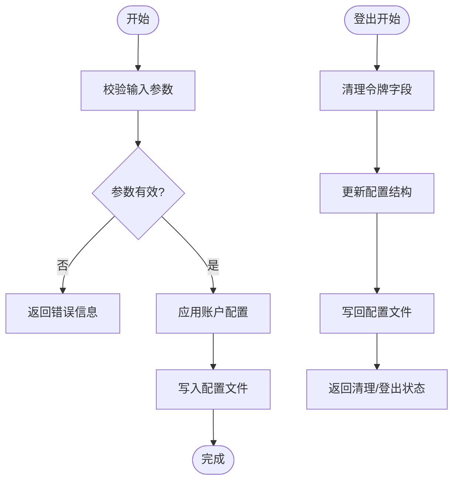
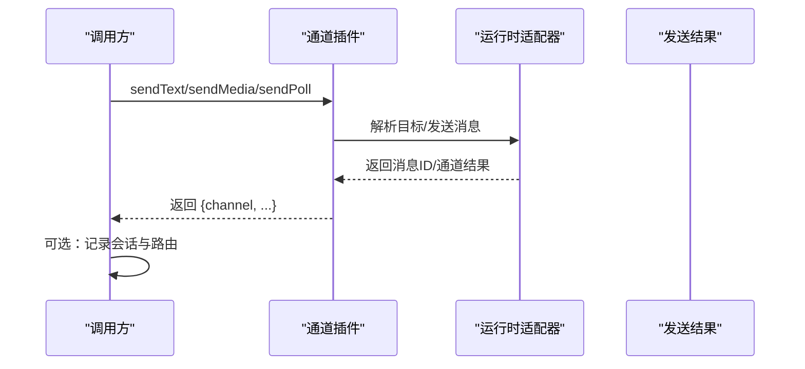
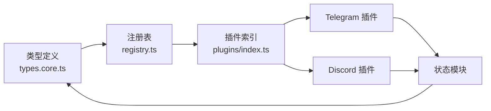

# 通道管理方法

<cite>
**本文引用的文件**   
- [src/channels/plugins/index.ts](file://src/channels/plugins/index.ts)
- [src/channels/plugins/types.core.ts](file://src/channels/plugins/types.core.ts)
- [src/channels/plugins/status.ts](file://src/channels/plugins/status.ts)
- [extensions/telegram/src/channel.ts](file://extensions/telegram/src/channel.ts)
- [extensions/discord/src/channel.ts](file://extensions/discord/src/channel.ts)
- [src/channels/registry.ts](file://src/channels/registry.ts)
- [src/channels/session.ts](file://src/channels/session.ts)
</cite>

## 目录
1. [简介](#简介)
2. [项目结构](#项目结构)
3. [核心组件](#核心组件)
4. [架构总览](#架构总览)
5. [详细组件分析](#详细组件分析)
6. [依赖关系分析](#依赖关系分析)
7. [性能考量](#性能考量)
8. [故障排除指南](#故障排除指南)
9. [结论](#结论)
10. [附录](#附录)

## 简介
本文件面向 OpenClaw 的通道管理 API，系统性梳理“通道状态查询、登录/登出、消息发送”等关键能力，并对各通道类型（如 Telegram、Discord）的特定参数与行为进行对比说明。文档同时覆盖认证、权限控制与访问限制，以及常见问题排查与调试建议，帮助开发者与运维人员快速上手并稳定集成。

## 项目结构
OpenClaw 将“通道插件注册与运行时加载”集中在核心模块中，具体到各通道（如 Telegram、Discord）则以扩展形式实现。整体结构要点如下：
- 核心通道插件注册与缓存：src/channels/plugins/index.ts
- 通道类型与元数据定义：src/channels/plugins/types.core.ts、src/channels/registry.ts
- 通道状态快照构建：src/channels/plugins/status.ts
- 典型通道实现示例：extensions/telegram/src/channel.ts、extensions/discord/src/channel.ts
- 会话与路由记录：src/channels/session.ts

**图表来源**
- [src/channels/plugins/index.ts:1-118](file://src/channels/plugins/index.ts#L1-L118)
- [src/channels/plugins/types.core.ts:1-403](file://src/channels/plugins/types.core.ts#L1-L403)
- [src/channels/plugins/status.ts:1-90](file://src/channels/plugins/status.ts#L1-L90)
- [src/channels/registry.ts:1-201](file://src/channels/registry.ts#L1-L201)
- [src/channels/session.ts:1-82](file://src/channels/session.ts#L1-L82)
- [extensions/telegram/src/channel.ts:1-587](file://extensions/telegram/src/channel.ts#L1-L587)
- [extensions/discord/src/channel.ts:1-463](file://extensions/discord/src/channel.ts#L1-L463)

**章节来源**
- [src/channels/plugins/index.ts:1-118](file://src/channels/plugins/index.ts#L1-L118)
- [src/channels/plugins/types.core.ts:1-403](file://src/channels/plugins/types.core.ts#L1-L403)
- [src/channels/plugins/status.ts:1-90](file://src/channels/plugins/status.ts#L1-L90)
- [src/channels/registry.ts:1-201](file://src/channels/registry.ts#L1-L201)
- [src/channels/session.ts:1-82](file://src/channels/session.ts#L1-L82)
- [extensions/telegram/src/channel.ts:1-587](file://extensions/telegram/src/channel.ts#L1-L587)
- [extensions/discord/src/channel.ts:1-463](file://extensions/discord/src/channel.ts#L1-L463)

## 核心组件
- 通道插件注册与检索
  - 提供通道插件列表与按 ID 获取插件的能力；内部维护带顺序与去重的缓存，避免重复解析插件注册表。
  - 关键函数：listChannelPlugins、getChannelPlugin、normalizeChannelId。
- 通道类型与元数据
  - 定义通道 ID、能力集、安全上下文、消息动作适配器、线程上下文、目录条目等核心类型。
  - 通道元信息（名称、文档路径、排序、别名等）集中于 registry。
- 通道状态快照
  - 统一构建账户快照（启用/配置/连接/运行时等），支持探测与审计结果注入。
- 通道实现示例
  - Telegram 与 Discord 插件展示了“配置校验、目标解析、消息发送、状态探测/审计、启动与登出”的完整流程。

**章节来源**
- [src/channels/plugins/index.ts:74-90](file://src/channels/plugins/index.ts#L74-L90)
- [src/channels/plugins/types.core.ts:11-159](file://src/channels/plugins/types.core.ts#L11-L159)
- [src/channels/plugins/status.ts:68-89](file://src/channels/plugins/status.ts#L68-L89)
- [src/channels/registry.ts:7-121](file://src/channels/registry.ts#L7-L121)

## 架构总览
通道管理 API 的调用链通常包括：配置校验与应用、目标解析、消息发送、状态查询与登出。下图展示从“调用方”到“通道插件”的交互：

**图表来源**
- [src/channels/plugins/index.ts:74-90](file://src/channels/plugins/index.ts#L74-L90)
- [extensions/telegram/src/channel.ts:237-311](file://extensions/telegram/src/channel.ts#L237-L311)
- [extensions/discord/src/channel.ts:231-295](file://extensions/discord/src/channel.ts#L231-L295)
- [src/channels/plugins/status.ts:68-89](file://src/channels/plugins/status.ts#L68-L89)

## 详细组件分析

### 通道状态查询 API
- 功能概述
  - 通过通道插件提供的状态钩子，统一收集“启用/配置/连接/运行时”等指标，并可结合探测与审计结果生成快照。
- 关键入口
  - 构建只读账户快照：buildReadOnlySourceChannelAccountSnapshot
  - 构建账户快照：buildChannelAccountSnapshot
  - 默认运行时字段：status.defaultRuntime
- 响应结构
  - 快照字段涵盖：账户ID、名称、启用/配置/连接/运行时时间线、最后事件/入站/出站时间、错误、模式（如 webhook/polling）、探测/审计结果等。
- 使用示例（步骤）
  - 步骤1：获取通道插件实例（通过 ID 或注册表）。
  - 步骤2：调用构建快照函数，传入配置、账户ID、运行时状态、探测与审计结果。
  - 步骤3：解析返回的快照对象，用于前端展示或健康检查。
- 错误与边界
  - 若账户不可检出或未配置，返回空或降级字段。
  - 探测/审计失败时，保留其他可用字段并标注错误。

**图表来源**
- [src/channels/plugins/status.ts:44-89](file://src/channels/plugins/status.ts#L44-L89)
- [extensions/telegram/src/channel.ts:398-484](file://extensions/telegram/src/channel.ts#L398-L484)
- [extensions/discord/src/channel.ts:343-414](file://extensions/discord/src/channel.ts#L343-L414)

**章节来源**
- [src/channels/plugins/status.ts:68-89](file://src/channels/plugins/status.ts#L68-L89)
- [extensions/telegram/src/channel.ts:398-484](file://extensions/telegram/src/channel.ts#L398-L484)
- [extensions/discord/src/channel.ts:343-414](file://extensions/discord/src/channel.ts#L343-L414)

### 登录/登出 API
- 登录（配置与校验）
  - 验证输入参数（如 token/tokenFile/useEnv 等），将账户配置写入配置文件。
  - 支持为默认账户或指定账户应用名称与令牌。
- 登出（清理凭据）
  - 清理指定账户的令牌字段，必要时删除账户条目或 channels 段落，写回配置文件。
  - 返回清理结果与是否已登出的状态。
- 示例（Telegram）
  - 登录：validateInput -> applyAccountConfig -> 写入配置。
  - 登出：gateway.logoutAccount -> 清理字段 -> 写回配置 -> 返回清理/登出状态。
- 示例（Discord）
  - 登录：validateInput -> applyAccountConfig -> 写入配置。
  - 登出：清理 token 字段并更新配置。

**图表来源**
- [extensions/telegram/src/channel.ts:237-311](file://extensions/telegram/src/channel.ts#L237-L311)
- [extensions/telegram/src/channel.ts:533-584](file://extensions/telegram/src/channel.ts#L533-L584)
- [extensions/discord/src/channel.ts:231-295](file://extensions/discord/src/channel.ts#L231-L295)

**章节来源**
- [extensions/telegram/src/channel.ts:237-311](file://extensions/telegram/src/channel.ts#L237-L311)
- [extensions/telegram/src/channel.ts:533-584](file://extensions/telegram/src/channel.ts#L533-L584)
- [extensions/discord/src/channel.ts:231-295](file://extensions/discord/src/channel.ts#L231-L295)

### 消息发送 API
- 通用能力
  - 文本发送、媒体发送、投票发送、目标解析、线程/回复上下文处理。
  - 不同通道可能有最大长度限制、分块策略、线程模式等差异。
- Telegram
  - 支持 Markdown 分块、投票最多选项数限制、线程/回复上下文解析。
  - 发送接口返回包含通道标识的结果对象。
- Discord
  - 支持组件按钮/选择/模态等富内容，目标解析与目录查询支持实时拉取。
  - 发送接口返回包含通道标识的结果对象。
- 示例（步骤）
  - 步骤1：解析目标（normalizeTarget/resolveTarget）。
  - 步骤2：准备负载（文本/媒体/投票）。
  - 步骤3：调用 sendPayload/sendText/sendMedia/sendPoll。
  - 步骤4：解析返回结果，记录会话与路由（可选）。

**图表来源**
- [extensions/telegram/src/channel.ts:312-397](file://extensions/telegram/src/channel.ts#L312-L397)
- [extensions/discord/src/channel.ts:296-342](file://extensions/discord/src/channel.ts#L296-L342)
- [src/channels/session.ts:41-81](file://src/channels/session.ts#L41-L81)

**章节来源**
- [extensions/telegram/src/channel.ts:312-397](file://extensions/telegram/src/channel.ts#L312-L397)
- [extensions/discord/src/channel.ts:296-342](file://extensions/discord/src/channel.ts#L296-L342)
- [src/channels/session.ts:41-81](file://src/channels/session.ts#L41-L81)

### 通道类型特定参数与行为
- Telegram
  - 关键参数：botToken/tokenFile/name/useEnv、webhook 配置、代理/网络设置、组策略与提及要求。
  - 行为差异：支持投票、媒体、线程；文本分块基于 Markdown；不允许同一 token 多个拥有者。
- Discord
  - 关键参数：token、群组/频道允许列表、消息内容意图、历史/媒体大小限制。
  - 行为差异：支持组件富内容；目标解析支持用户与频道；目录支持实时查询；消息内容意图影响消息可见性。
- 会话与路由
  - 记录入站会话与最近路由，支持主 DM 固定路由跳过逻辑，避免泄露入站来源元数据。

**章节来源**
- [extensions/telegram/src/channel.ts:120-186](file://extensions/telegram/src/channel.ts#L120-L186)
- [extensions/telegram/src/channel.ts:398-484](file://extensions/telegram/src/channel.ts#L398-L484)
- [extensions/discord/src/channel.ts:74-114](file://extensions/discord/src/channel.ts#L74-L114)
- [extensions/discord/src/channel.ts:343-414](file://extensions/discord/src/channel.ts#L343-L414)
- [src/channels/session.ts:26-39](file://src/channels/session.ts#L26-L39)

## 依赖关系分析
- 插件注册与检索
  - 通过 requireActivePluginRegistry 获取当前活跃插件注册表，按 ID 与别名匹配通道插件。
- 类型与元数据
  - ChannelPlugin、ChannelMeta、ChannelCapabilities、ChannelAccountSnapshot 等类型贯穿配置、安全、消息与状态模块。
- 状态与探测
  - 通道插件在 status 钩子中组合探测与审计结果，形成最终快照。
- 实现差异
  - Telegram 与 Discord 在目标解析、消息能力、线程模式、富内容支持等方面存在差异。

**图表来源**
- [src/channels/plugins/types.core.ts:11-159](file://src/channels/plugins/types.core.ts#L11-L159)
- [src/channels/registry.ts:135-183](file://src/channels/registry.ts#L135-L183)
- [src/channels/plugins/index.ts:42-90](file://src/channels/plugins/index.ts#L42-L90)
- [src/channels/plugins/status.ts:68-89](file://src/channels/plugins/status.ts#L68-L89)

**章节来源**
- [src/channels/plugins/index.ts:42-90](file://src/channels/plugins/index.ts#L42-L90)
- [src/channels/plugins/types.core.ts:11-159](file://src/channels/plugins/types.core.ts#L11-L159)
- [src/channels/registry.ts:135-183](file://src/channels/registry.ts#L135-L183)
- [src/channels/plugins/status.ts:68-89](file://src/channels/plugins/status.ts#L68-L89)

## 性能考量
- 插件缓存
  - 通道插件列表与映射采用缓存，避免重复解析注册表；仅在注册表版本变化时重建。
- 发送批量化
  - 对于支持的通道，建议合并短消息或使用平台原生分块策略，减少往返次数。
- 探测与审计
  - 探测/审计应设置合理超时与并发上限，避免阻塞主流程；对失败项进行降级处理。
- 会话记录
  - 记录会话与路由为异步操作，异常不影响主流程；错误回调需捕获并记录。

[本节为通用指导，不直接分析具体文件]

## 故障排除指南
- 常见问题
  - 通道未配置/令牌缺失：检查 validateInput 与 isConfigured 返回信息；确认 token/tokenFile/useEnv 是否正确。
  - 目标解析失败：核对 normalizeTarget/resolveTarget 的输入格式与通道允许列表。
  - 登出后仍残留令牌：确认 logoutAccount 是否成功写回配置并清理了对应字段。
  - 状态快照为空：检查 inspectAccount/resolveAccount 是否返回有效账户对象。
- 调试建议
  - 启用详细日志，观察探测/审计阶段输出。
  - 使用最小化配置复现问题，逐步增加复杂度定位根因。
  - 对比 Telegram 与 Discord 的差异点（如线程模式、富内容、意图设置）。

**章节来源**
- [extensions/telegram/src/channel.ts:237-311](file://extensions/telegram/src/channel.ts#L237-L311)
- [extensions/discord/src/channel.ts:231-295](file://extensions/discord/src/channel.ts#L231-L295)
- [src/channels/plugins/status.ts:44-66](file://src/channels/plugins/status.ts#L44-L66)

## 结论
OpenClaw 的通道管理 API 通过统一的插件注册与类型体系，为多通道提供了标准化的登录/登出、消息发送与状态查询能力。Telegram 与 Discord 的实现展示了在目标解析、消息能力与安全策略上的差异化设计。遵循本文档的参数规范、错误处理与调试建议，可显著提升集成效率与稳定性。

[本节为总结性内容，不直接分析具体文件]

## 附录

### API 一览与约定
- 通道插件检索
  - 列表：listChannelPlugins()
  - 获取：getChannelPlugin(id)
  - 规范化：normalizeChannelId(raw)
- 状态查询
  - 构建快照：buildChannelAccountSnapshot(...)
  - 只读快照：buildReadOnlySourceChannelAccountSnapshot(...)
- 登录/登出
  - 登录：setup.validateInput/setup.applyAccountConfig
  - 登出：gateway.logoutAccount
- 消息发送
  - 文本：outbound.sendText(...)
  - 媒体：outbound.sendMedia(...)
  - 投票：outbound.sendPoll(...)
  - 负载：outbound.sendPayload(...)

**章节来源**
- [src/channels/plugins/index.ts:74-90](file://src/channels/plugins/index.ts#L74-L90)
- [src/channels/plugins/status.ts:68-89](file://src/channels/plugins/status.ts#L68-L89)
- [extensions/telegram/src/channel.ts:237-311](file://extensions/telegram/src/channel.ts#L237-L311)
- [extensions/discord/src/channel.ts:231-295](file://extensions/discord/src/channel.ts#L231-L295)