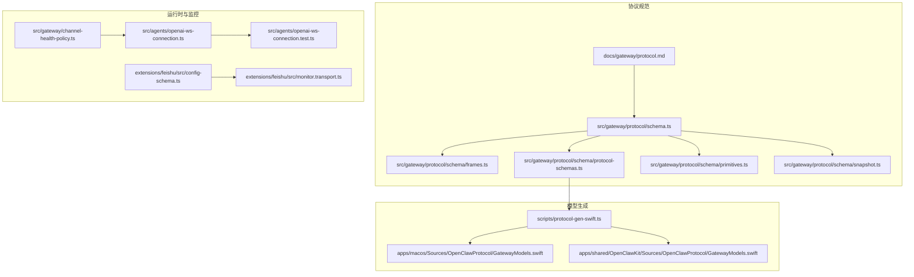
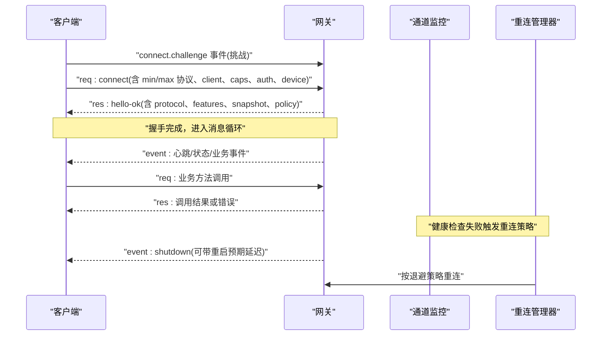
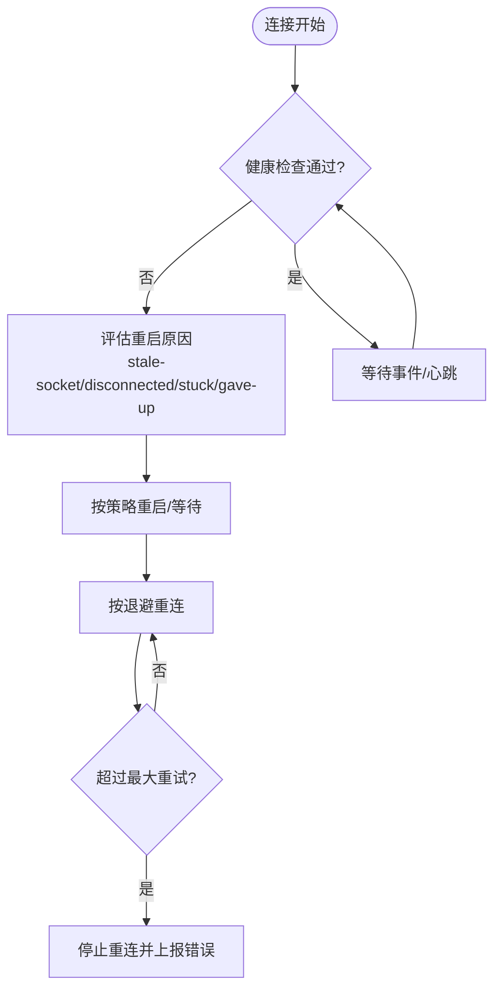
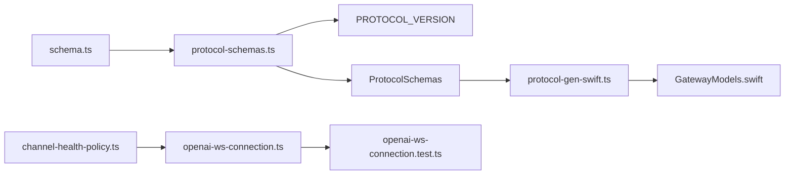

# WebSocket 协议

<cite>
**本文引用的文件**
- [docs/gateway/protocol.md](file://docs/gateway/protocol.md)
- [src/gateway/protocol/schema.ts](file://src/gateway/protocol/schema.ts)
- [src/gateway/protocol/schema/frames.ts](file://src/gateway/protocol/schema/frames.ts)
- [src/gateway/protocol/schema/protocol-schemas.ts](file://src/gateway/protocol/schema/protocol-schemas.ts)
- [src/gateway/protocol/schema/primitives.ts](file://src/gateway/protocol/schema/primitives.ts)
- [src/gateway/protocol/schema/snapshot.ts](file://src/gateway/protocol/schema/snapshot.ts)
- [scripts/protocol-gen-swift.ts](file://scripts/protocol-gen-swift.ts)
- [apps/macos/Sources/OpenClawProtocol/GatewayModels.swift](file://apps/macos/Sources/OpenClawProtocol/GatewayModels.swift)
- [apps/shared/OpenClawKit/Sources/OpenClawProtocol/GatewayModels.swift](file://apps/shared/OpenClawKit/Sources/OpenClawProtocol/GatewayModels.swift)
- [apps/macos/Tests/OpenClawIPCTests/GatewayFrameDecodeTests.swift](file://apps/macos/Tests/OpenClawIPCTests/GatewayFrameDecodeTests.swift)
- [src/gateway/channel-health-policy.ts](file://src/gateway/channel-health-policy.ts)
- [src/agents/openai-ws-connection.ts](file://src/agents/openai-ws-connection.ts)
- [src/agents/openai-ws-connection.test.ts](file://src/agents/openai-ws-connection.test.ts)
- [extensions/feishu/src/monitor.transport.ts](file://extensions/feishu/src/monitor.transport.ts)
- [extensions/feishu/src/config-schema.ts](file://extensions/feishu/src/config-schema.ts)
</cite>

## 目录
1. [简介](#简介)
2. [项目结构](#项目结构)
3. [核心组件](#核心组件)
4. [架构总览](#架构总览)
5. [详细组件分析](#详细组件分析)
6. [依赖关系分析](#依赖关系分析)
7. [性能考量](#性能考量)
8. [故障排查指南](#故障排查指南)
9. [结论](#结论)
10. [附录](#附录)

## 简介
本文件为 OpenClaw 的 WebSocket 协议权威文档，覆盖连接建立、认证与会话管理、消息格式与事件模型、消息类型（控制、业务、心跳）、重连与错误处理、协议版本与兼容性策略，以及客户端实现建议与最佳实践。内容基于仓库中的协议规范、Swift 模型生成脚本与测试用例进行系统化整理。

## 项目结构
围绕 WebSocket 协议的关键代码与文档分布如下：
- 协议规范与示例：docs/gateway/protocol.md
- 类型定义与协议版本：src/gateway/protocol/schema.ts、protocol-schemas.ts、frames.ts、primitives.ts、snapshot.ts
- Swift 模型生成与产物：scripts/protocol-gen-swift.ts、apps/*/OpenClawProtocol/GatewayModels.swift
- 健康检查与重连策略：src/gateway/channel-health-policy.ts、src/agents/openai-ws-connection.ts、src/agents/openai-ws-connection.test.ts
- 具体通道的 WebSocket 监控示例：extensions/feishu/src/monitor.transport.ts、config-schema.ts

图表来源
- [docs/gateway/protocol.md:1-268](file://docs/gateway/protocol.md#L1-L268)
- [src/gateway/protocol/schema.ts:1-19](file://src/gateway/protocol/schema.ts#L1-L19)
- [src/gateway/protocol/schema/frames.ts:1-164](file://src/gateway/protocol/schema/frames.ts#L1-L164)
- [src/gateway/protocol/schema/protocol-schemas.ts:1-302](file://src/gateway/protocol/schema/protocol-schemas.ts#L1-L302)
- [scripts/protocol-gen-swift.ts:1-248](file://scripts/protocol-gen-swift.ts#L1-L248)
- [apps/macos/Sources/OpenClawProtocol/GatewayModels.swift:3543-3583](file://apps/macos/Sources/OpenClawProtocol/GatewayModels.swift#L3543-L3583)
- [apps/shared/OpenClawKit/Sources/OpenClawProtocol/GatewayModels.swift:3543-3583](file://apps/shared/OpenClawKit/Sources/OpenClawProtocol/GatewayModels.swift#L3543-L3583)
- [src/gateway/channel-health-policy.ts:83-148](file://src/gateway/channel-health-policy.ts#L83-L148)
- [src/agents/openai-ws-connection.ts:434-474](file://src/agents/openai-ws-connection.ts#L434-L474)
- [src/agents/openai-ws-connection.test.ts:451-519](file://src/agents/openai-ws-connection.test.ts#L451-L519)
- [extensions/feishu/src/monitor.transport.ts:28-64](file://extensions/feishu/src/monitor.transport.ts#L28-L64)
- [extensions/feishu/src/config-schema.ts:14-209](file://extensions/feishu/src/config-schema.ts#L14-L209)

章节来源
- [docs/gateway/protocol.md:1-268](file://docs/gateway/protocol.md#L1-L268)
- [src/gateway/protocol/schema.ts:1-19](file://src/gateway/protocol/schema.ts#L1-L19)

## 核心组件
- 协议帧模型与版本
  - 请求帧、响应帧、事件帧三类帧统一由判别字段 type 组成的联合类型承载，便于下游代码生成与强类型解析。
  - 协议版本常量在协议 Schema 中集中导出，确保 TypeScript 与 Swift 两端一致。
- 设备身份与握手参数
  - ConnectParams 定义了最小/最大协议版本、客户端信息、能力声明、权限与认证等握手必需字段。
  - HelloOk 包含服务器版本、连接标识、特性清单、初始快照与策略参数（如最大负载、缓冲字节、心跳间隔）。
- 错误模型
  - ErrorShape 提供标准错误码、消息、可选详情、是否可重试及重试等待时间，用于统一错误语义。
- 快照与状态版本
  - Snapshot 与 StateVersion 描述当前服务端状态视图，支持事件携带 stateVersion 以辅助客户端一致性校验。

章节来源
- [src/gateway/protocol/schema/frames.ts:125-164](file://src/gateway/protocol/schema/frames.ts#L125-L164)
- [src/gateway/protocol/schema/protocol-schemas.ts:162-302](file://src/gateway/protocol/schema/protocol-schemas.ts#L162-L302)
- [src/gateway/protocol/schema/snapshot.ts:38-73](file://src/gateway/protocol/schema/snapshot.ts#L38-L73)

## 架构总览
下图展示了从客户端到网关的典型握手与消息流转，以及健康检查与自动重连的协作关系。

图表来源
- [docs/gateway/protocol.md:22-90](file://docs/gateway/protocol.md#L22-L90)
- [src/gateway/protocol/schema/frames.ts:125-164](file://src/gateway/protocol/schema/frames.ts#L125-L164)
- [src/gateway/channel-health-policy.ts:134-148](file://src/gateway/channel-health-policy.ts#L134-L148)
- [src/agents/openai-ws-connection.ts:434-474](file://src/agents/openai-ws-connection.ts#L434-L474)

## 详细组件分析

### 连接建立与握手流程
- 传输层
  - 使用 WebSocket 文本帧承载 JSON。
  - 首帧必须是 connect 请求。
- 握手阶段
  - 网关先下发 connect.challenge 事件（包含随机数与时间戳），客户端需签名并回传。
  - 客户端发送 connect 请求，包含 minProtocol、maxProtocol、client 信息、角色/作用域、能力声明、认证与设备签名等。
  - 网关返回 hello-ok，确认协议版本、特性列表、初始快照与策略参数；若已配对，可能返回设备级 token。
- 角色与作用域
  - operator：控制面客户端（CLI/UI/自动化）。
  - node：能力宿主（相机/屏幕/画布/系统执行等）。
  - 作用域限定方法访问边界，部分命令还需更严格的命令级校验。
- 设备身份与配对
  - 所有连接必须携带设备身份并在 connect 阶段签名挑战；节点应使用稳定指纹派生的设备 ID。
  - 新设备首次连接通常需要人工批准，除非启用本地自动批准。

章节来源
- [docs/gateway/protocol.md:17-90](file://docs/gateway/protocol.md#L17-L90)
- [src/gateway/protocol/schema/frames.ts:20-69](file://src/gateway/protocol/schema/frames.ts#L20-L69)
- [src/gateway/protocol/schema/frames.ts:71-112](file://src/gateway/protocol/schema/frames.ts#L71-L112)

### 认证机制与会话管理
- 认证令牌
  - 若网关启用了全局令牌，connect.params.auth.token 必须匹配，否则断开。
  - 成功配对后，网关颁发设备级 token（包含角色与作用域），客户端应持久化以便后续连接复用。
- 设备签名与迁移
  - 客户端必须等待并签名 connect.challenge 返回的随机数，且在 connect.params.device.nonce 中回传。
  - v3 签名绑定平台与设备家族等更多上下文，v2 仍兼容但受配对元数据约束。
- 会话与策略
  - hello-ok 中的 policy 字段包含最大负载、缓冲字节与心跳间隔等，客户端据此调整发送窗口与心跳节奏。
  - 初始快照 snapshot 提供当前在线设备、健康度、会话默认值等状态视图。

章节来源
- [docs/gateway/protocol.md:200-230](file://docs/gateway/protocol.md#L200-L230)
- [src/gateway/protocol/schema/frames.ts:71-112](file://src/gateway/protocol/schema/frames.ts#L71-L112)
- [src/gateway/protocol/schema/protocol-schemas.ts:162-172](file://src/gateway/protocol/schema/protocol-schemas.ts#L162-L172)

### 消息格式规范
- 帧类型
  - 请求帧：type="req"，包含 id、method、params。
  - 响应帧：type="res"，包含 id、ok、payload 或 error。
  - 事件帧：type="event"，包含 event、payload、可选序号 seq 与 stateVersion。
- 错误结构
  - error.code、message、details、retryable、retryAfterMs。
- 数据编码
  - 文本帧，JSON 序列化；payload 支持任意 JSON 结构，具体字段由各方法的参数/结果模式定义。

章节来源
- [docs/gateway/protocol.md:127-134](file://docs/gateway/protocol.md#L127-L134)
- [src/gateway/protocol/schema/frames.ts:125-164](file://src/gateway/protocol/schema/frames.ts#L125-L164)
- [src/gateway/protocol/schema/frames.ts:114-124](file://src/gateway/protocol/schema/frames.ts#L114-L124)

### 协议版本与兼容性
- 版本常量与生成
  - 协议版本在协议 Schema 中集中导出，TypeScript 与 Swift 两端通过脚本生成模型，确保一致性。
- 向后兼容
  - 客户端通过 minProtocol/maxProtocol 声明支持范围，服务器拒绝不兼容版本。
  - 对于设备签名迁移，v2 保持兼容但受配对元数据约束，建议尽快迁移到 v3 签名。
- 迁移指南
  - 总是等待 connect.challenge 再签名；
  - 在 connect.params.device.nonce 回传同一 nonce；
  - 优先使用 v3 签名，绑定更多上下文字段。

章节来源
- [src/gateway/protocol/schema/protocol-schemas.ts:301](file://src/gateway/protocol/schema/protocol-schemas.ts#L301)
- [scripts/protocol-gen-swift.ts:30-34](file://scripts/protocol-gen-swift.ts#L30-L34)
- [docs/gateway/protocol.md:191-256](file://docs/gateway/protocol.md#L191-L256)

### 连接状态管理、重连机制与错误处理
- 健康检查
  - 通道健康策略根据启动宽限、最后事件时间、忙碌状态等因素判定健康度，并决定是否重启。
- 自动重连
  - 失败关闭时按指数退避重连，避免重复计数导致预算过早耗尽。
  - 达到最大重试次数后上报“超过最大重连次数”错误，停止继续重试。
- 错误处理
  - 错误帧包含可重试标记与建议重试时间；认证失败包含恢复提示码与下一步建议。
  - 未处理的错误事件不会导致 Node.js 异常崩溃（内部安全发射）。

图表来源
- [src/gateway/channel-health-policy.ts:83-148](file://src/gateway/channel-health-policy.ts#L83-L148)
- [src/agents/openai-ws-connection.ts:434-474](file://src/agents/openai-ws-connection.ts#L434-L474)
- [src/agents/openai-ws-connection.test.ts:490-519](file://src/agents/openai-ws-connection.test.ts#L490-L519)

章节来源
- [src/gateway/channel-health-policy.ts:83-148](file://src/gateway/channel-health-policy.ts#L83-L148)
- [src/agents/openai-ws-connection.ts:434-474](file://src/agents/openai-ws-connection.ts#L434-L474)
- [src/agents/openai-ws-connection.test.ts:490-519](file://src/agents/openai-ws-connection.test.ts#L490-L519)

### 消息类型详解
- 控制消息
  - connect：握手请求，包含协议范围、客户端信息、角色/作用域、能力声明、认证与设备签名。
  - hello-ok：握手成功响应，包含协议版本、特性清单、初始快照与策略。
- 业务消息
  - 以 req/res 形式调用各类方法（如代理、节点、配置、会话、工具目录、执行审批、设备配对等），参数与结果由对应 Schema 定义。
- 心跳与事件
  - event:tick：周期性心跳事件，携带时间戳。
  - event:shutdown：服务端通知关闭，可包含重启预期延迟。
  - presence/health 等系统事件：反映当前在线设备与健康度变化。

章节来源
- [docs/gateway/protocol.md:127-190](file://docs/gateway/protocol.md#L127-L190)
- [src/gateway/protocol/schema/frames.ts:5-18](file://src/gateway/protocol/schema/frames.ts#L5-L18)
- [src/gateway/protocol/schema/frames.ts:125-164](file://src/gateway/protocol/schema/frames.ts#L125-L164)

### 完整消息示例（路径引用）
- 握手挑战与响应
  - [握手挑战事件示例:24-32](file://docs/gateway/protocol.md#L24-L32)
  - [connect 请求示例（控制面）:34-67](file://docs/gateway/protocol.md#L34-L67)
  - [connect 请求示例（节点）:92-125](file://docs/gateway/protocol.md#L92-L125)
  - [hello-ok 响应示例:69-78](file://docs/gateway/protocol.md#L69-L78)
- 帧结构
  - [请求帧结构:125-133](file://src/gateway/protocol/schema/frames.ts#L125-L133)
  - [响应帧结构:135-144](file://src/gateway/protocol/schema/frames.ts#L135-L144)
  - [事件帧结构:146-155](file://src/gateway/protocol/schema/frames.ts#L146-L155)
- Swift 模型与解码验证
  - [GatewayFrame 枚举与编码/解码:3543-3583](file://apps/macos/Sources/OpenClawProtocol/GatewayModels.swift#L3543-L3583)
  - [Swift 解码测试（事件帧与请求帧）:1-54](file://apps/macos/Tests/OpenClawIPCTests/GatewayFrameDecodeTests.swift#L1-L54)

章节来源
- [docs/gateway/protocol.md:22-125](file://docs/gateway/protocol.md#L22-L125)
- [src/gateway/protocol/schema/frames.ts:125-164](file://src/gateway/protocol/schema/frames.ts#L125-L164)
- [apps/macos/Sources/OpenClawProtocol/GatewayModels.swift:3543-3583](file://apps/macos/Sources/OpenClawProtocol/GatewayModels.swift#L3543-L3583)
- [apps/macos/Tests/OpenClawIPCTests/GatewayFrameDecodeTests.swift:1-54](file://apps/macos/Tests/OpenClawIPCTests/GatewayFrameDecodeTests.swift#L1-L54)

### 客户端实现要点与最佳实践
- 必须遵循握手流程：等待 connect.challenge 并签名，随后发送 connect 请求。
- 正确处理 hello-ok：记录协议版本、特性清单、初始快照与策略参数。
- 严格遵守策略参数：按最大负载与心跳间隔控制发送节奏，避免被限流。
- 实现健壮的重连：采用指数退避，避免重复计数；达到上限后停止并提示用户干预。
- 错误处理：尊重 error.retryable 与 retryAfterMs；对认证失败按建议码采取相应措施。
- 通道监控：参考 Feishu WebSocket 监控实现，区分 WebSocket 与 webhook 模式，按需切换。

章节来源
- [docs/gateway/protocol.md:191-230](file://docs/gateway/protocol.md#L191-L230)
- [src/gateway/channel-health-policy.ts:134-148](file://src/gateway/channel-health-policy.ts#L134-L148)
- [src/agents/openai-ws-connection.ts:434-474](file://src/agents/openai-ws-connection.ts#L434-L474)
- [extensions/feishu/src/monitor.transport.ts:28-64](file://extensions/feishu/src/monitor.transport.ts#L28-L64)
- [extensions/feishu/src/config-schema.ts:14-209](file://extensions/feishu/src/config-schema.ts#L14-L209)

## 依赖关系分析
- 协议 Schema 导出与生成
  - schema.ts 汇总导出各模块 Schema，protocol-schemas.ts 汇总为 ProtocolSchemas 并导出 PROTOCOL_VERSION。
  - protocol-gen-swift.ts 读取 ProtocolSchemas 生成 Swift 模型，确保两端一致。
- Swift 模型与测试
  - 生成的 GatewayModels.swift 包含 GatewayFrame 枚举与各帧结构，配合测试用例验证解码正确性。
- 运行时监控与重连
  - channel-health-policy.ts 提供健康度评估与重启原因解析；openai-ws-connection.ts 提供自动重连与错误安全发射。

图表来源
- [src/gateway/protocol/schema.ts:1-19](file://src/gateway/protocol/schema.ts#L1-L19)
- [src/gateway/protocol/schema/protocol-schemas.ts:162-302](file://src/gateway/protocol/schema/protocol-schemas.ts#L162-L302)
- [scripts/protocol-gen-swift.ts:213-242](file://scripts/protocol-gen-swift.ts#L213-L242)
- [apps/macos/Sources/OpenClawProtocol/GatewayModels.swift:3543-3583](file://apps/macos/Sources/OpenClawProtocol/GatewayModels.swift#L3543-L3583)
- [src/gateway/channel-health-policy.ts:134-148](file://src/gateway/channel-health-policy.ts#L134-L148)
- [src/agents/openai-ws-connection.ts:434-474](file://src/agents/openai-ws-connection.ts#L434-L474)
- [src/agents/openai-ws-connection.test.ts:451-519](file://src/agents/openai-ws-connection.test.ts#L451-L519)

章节来源
- [src/gateway/protocol/schema.ts:1-19](file://src/gateway/protocol/schema.ts#L1-L19)
- [src/gateway/protocol/schema/protocol-schemas.ts:162-302](file://src/gateway/protocol/schema/protocol-schemas.ts#L162-L302)
- [scripts/protocol-gen-swift.ts:213-242](file://scripts/protocol-gen-swift.ts#L213-L242)

## 性能考量
- 心跳与背压
  - 依据 hello-ok.policy.tickIntervalMs 设置心跳周期，避免频繁唤醒。
  - 遵守 maxPayload 与 maxBufferedBytes，避免大包与堆积。
- 重连退避
  - 使用指数退避减少网络拥塞与服务器压力，达到上限后停止重连以保护资源。
- 事件去抖
  - 对高频事件进行合并或去重，降低客户端处理负担。

## 故障排查指南
- 认证失败
  - 检查 connect.params.auth.token 是否与网关配置一致；若使用设备 token，确认其角色与作用域是否满足要求。
  - 参考错误详情码与建议下一步操作，按指引更新配置或等待重试。
- 设备签名问题
  - 确认已等待 connect.challenge 并使用相同 nonce 签名；迁移至 v3 签名以获得更强绑定与兼容性。
- 连接不稳定
  - 查看健康检查原因（stale-socket/disconnected/stuck/gave-up），结合通道模式（websocket/webhook）定位问题。
  - 检查重连日志与最大重试次数，必要时手动干预。
- Swift 解码异常
  - 使用测试用例中的示例 JSON 对比解码行为，确认 GatewayFrame 枚举分支与未知字段处理逻辑。

章节来源
- [docs/gateway/protocol.md:200-230](file://docs/gateway/protocol.md#L200-L230)
- [src/gateway/channel-health-policy.ts:134-148](file://src/gateway/channel-health-policy.ts#L134-L148)
- [src/agents/openai-ws-connection.test.ts:490-519](file://src/agents/openai-ws-connection.test.ts#L490-L519)
- [apps/macos/Tests/OpenClawIPCTests/GatewayFrameDecodeTests.swift:1-54](file://apps/macos/Tests/OpenClawIPCTests/GatewayFrameDecodeTests.swift#L1-L54)

## 结论
OpenClaw 的 WebSocket 协议以清晰的握手、严谨的认证与设备签名、统一的帧模型与版本管理为核心，辅以健康检查与稳健的重连策略，既保证了跨平台一致性，也为客户端实现提供了明确的落地路径。建议在实现中严格遵循握手与认证流程、合理设置心跳与退避策略，并充分利用协议版本与模型生成工具确保长期兼容。

## 附录
- 关键文件索引
  - 协议规范与示例：[docs/gateway/protocol.md](file://docs/gateway/protocol.md)
  - 协议 Schema 与版本：[src/gateway/protocol/schema.ts](file://src/gateway/protocol/schema.ts)、[src/gateway/protocol/schema/protocol-schemas.ts](file://src/gateway/protocol/schema/protocol-schemas.ts)
  - 帧模型与错误结构：[src/gateway/protocol/schema/frames.ts](file://src/gateway/protocol/schema/frames.ts)
  - Swift 模型生成与产物：[scripts/protocol-gen-swift.ts](file://scripts/protocol-gen-swift.ts)、[apps/macos/Sources/OpenClawProtocol/GatewayModels.swift](file://apps/macos/Sources/OpenClawProtocol/GatewayModels.swift)、[apps/shared/OpenClawKit/Sources/OpenClawProtocol/GatewayModels.swift](file://apps/shared/OpenClawKit/Sources/OpenClawProtocol/GatewayModels.swift)
  - 健康检查与重连：[src/gateway/channel-health-policy.ts](file://src/gateway/channel-health-policy.ts)、[src/agents/openai-ws-connection.ts](file://src/agents/openai-ws-connection.ts)、[src/agents/openai-ws-connection.test.ts](file://src/agents/openai-ws-connection.test.ts)
  - 通道监控示例：[extensions/feishu/src/monitor.transport.ts](file://extensions/feishu/src/monitor.transport.ts)、[extensions/feishu/src/config-schema.ts](file://extensions/feishu/src/config-schema.ts)