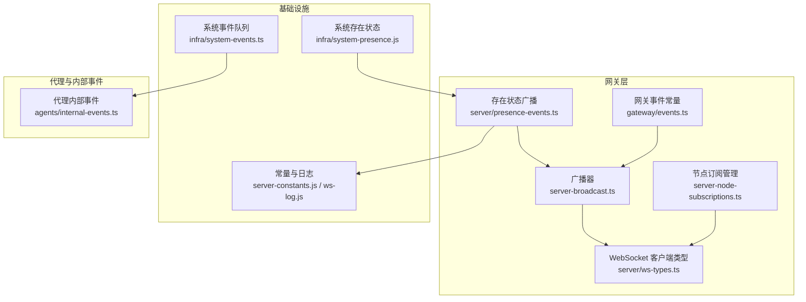
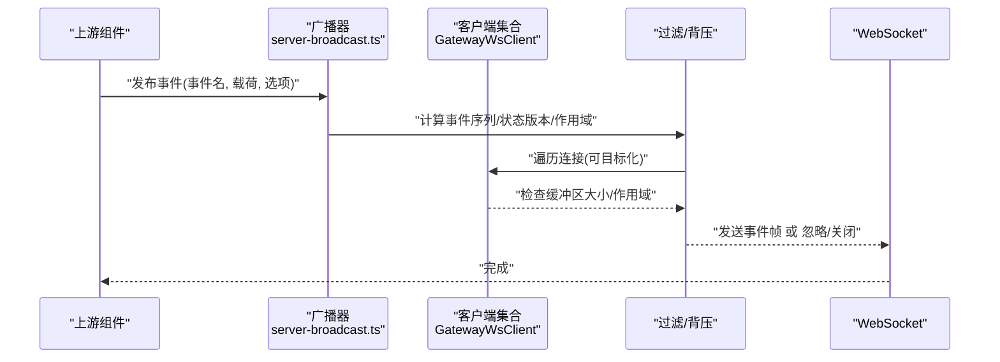
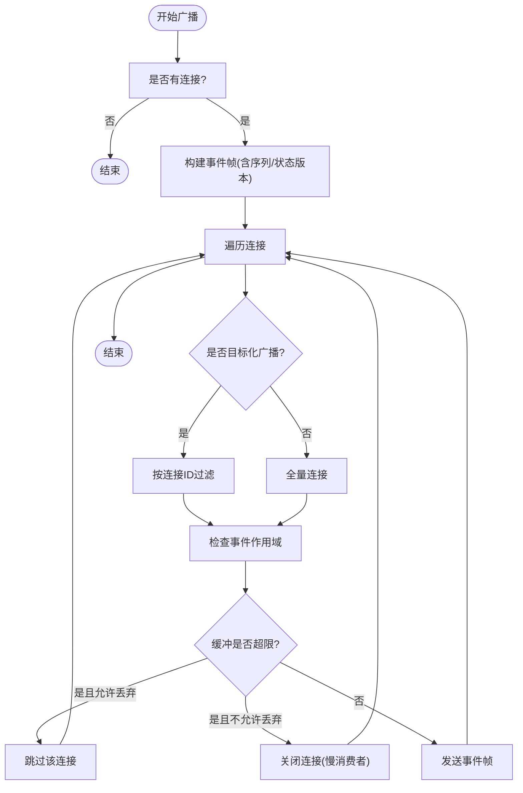
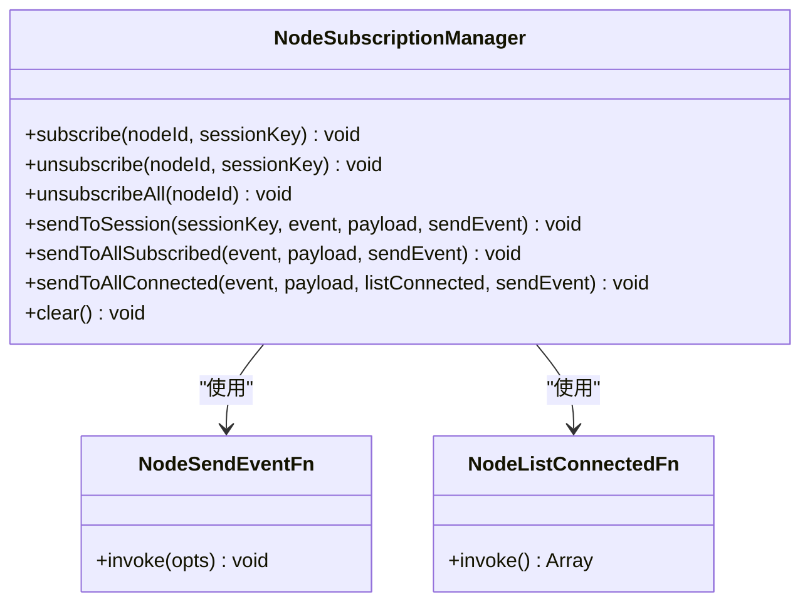
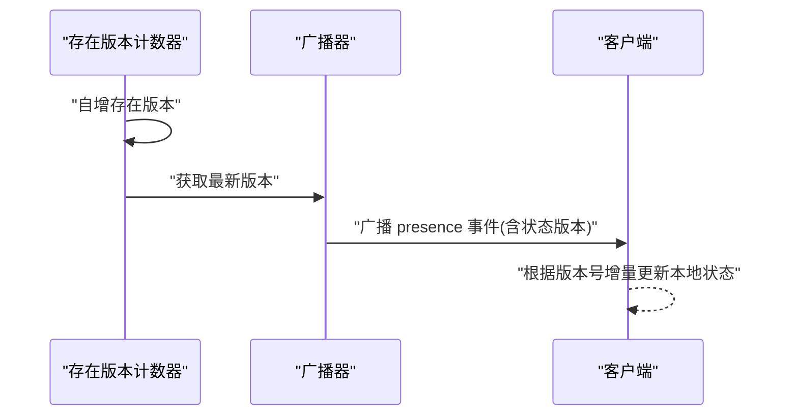
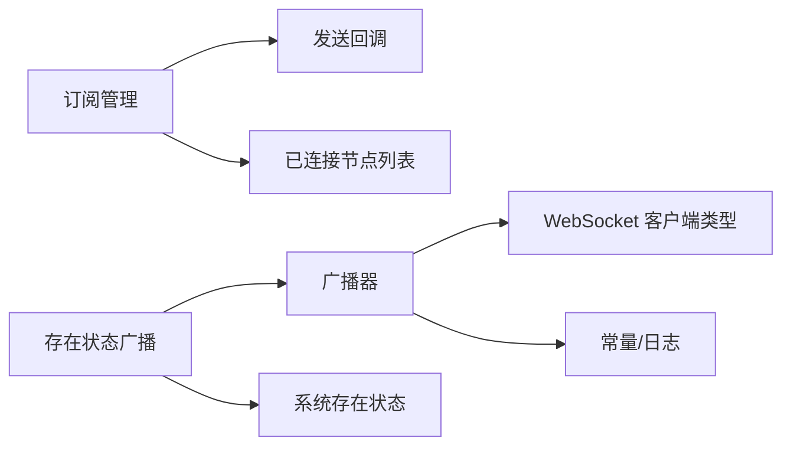

# 事件系统

<cite>
**本文引用的文件**
- [src/gateway/server-broadcast.ts](file://src/gateway/server-broadcast.ts)
- [src/gateway/server-node-subscriptions.ts](file://src/gateway/server-node-subscriptions.ts)
- [src/gateway/server-node-events-types.ts](file://src/gateway/server-node-events-types.ts)
- [src/gateway/server/ws-types.ts](file://src/gateway/server/ws-types.ts)
- [src/gateway/events.ts](file://src/gateway/events.ts)
- [src/gateway/server/presence-events.ts](file://src/gateway/server/presence-events.ts)
- [src/infra/system-events.ts](file://src/infra/system-events.ts)
- [src/agents/internal-events.ts](file://src/agents/internal-events.ts)
- [src/gateway/gateway-misc.test.ts](file://src/gateway/gateway-misc.test.ts)
- [src/discord/monitor/listeners.test.ts](file://src/discord/monitor/listeners.test.ts)
- [src/discord/monitor.test.ts](file://src/discord/monitor.test.ts)
- [src/infra/system-presence.js](file://src/infra/system-presence.js)
- [src/gateway/server-constants.js](file://src/gateway/server-constants.js)
- [src/gateway/ws-log.js](file://src/gateway/ws-log.js)
</cite>

## 目录
1. [简介](#简介)
2. [项目结构](#项目结构)
3. [核心组件](#核心组件)
4. [架构总览](#架构总览)
5. [详细组件分析](#详细组件分析)
6. [依赖关系分析](#依赖关系分析)
7. [性能考量](#性能考量)
8. [故障排查指南](#故障排查指南)
9. [结论](#结论)
10. [附录](#附录)

## 简介
本文件系统性梳理 OpenClaw 的 WebSocket 事件系统，覆盖事件类型定义（系统事件、业务事件、状态变更事件）、发布与订阅机制（路由、过滤、分发）、广播与目标化投递、事件处理流程（接收、处理、响应）、优先级与队列管理（背压与延迟策略）、事件持久化与重放、监听示例以及性能优化建议。内容以仓库中实际实现为依据，辅以可视化图示帮助理解。

## 项目结构
OpenClaw 的事件系统主要由以下模块构成：
- 广播器：负责将事件帧广播到所有或指定连接，并进行背压控制与事件作用域过滤。
- 节点订阅管理：维护节点与会话之间的订阅关系，支持按会话、全部订阅者或已连接节点进行定向分发。
- 事件类型与上下文：定义节点侧事件上下文接口、事件载荷结构等。
- 系统事件与状态快照：提供系统事件队列、存在状态快照广播等能力。
- 监听与处理：演示事件监听器如何异步处理并避免阻塞。

图表来源
- [src/gateway/server-broadcast.ts:1-132](file://src/gateway/server-broadcast.ts#L1-L132)
- [src/gateway/server-node-subscriptions.ts:1-165](file://src/gateway/server-node-subscriptions.ts#L1-L165)
- [src/gateway/server/ws-types.ts:1-14](file://src/gateway/server/ws-types.ts#L1-L14)
- [src/gateway/server/presence-events.ts:1-23](file://src/gateway/server/presence-events.ts#L1-L23)
- [src/gateway/events.ts:1-8](file://src/gateway/events.ts#L1-L8)
- [src/infra/system-events.ts:1-120](file://src/infra/system-events.ts#L1-L120)
- [src/agents/internal-events.ts:1-63](file://src/agents/internal-events.ts#L1-L63)
- [src/infra/system-presence.js](file://src/infra/system-presence.js)
- [src/gateway/server-constants.js](file://src/gateway/server-constants.js)
- [src/gateway/ws-log.js](file://src/gateway/ws-log.js)

章节来源
- [src/gateway/server-broadcast.ts:1-132](file://src/gateway/server-broadcast.ts#L1-L132)
- [src/gateway/server-node-subscriptions.ts:1-165](file://src/gateway/server-node-subscriptions.ts#L1-L165)
- [src/gateway/server/ws-types.ts:1-14](file://src/gateway/server/ws-types.ts#L1-L14)
- [src/gateway/server/presence-events.ts:1-23](file://src/gateway/server/presence-events.ts#L1-L23)
- [src/gateway/events.ts:1-8](file://src/gateway/events.ts#L1-L8)
- [src/infra/system-events.ts:1-120](file://src/infra/system-events.ts#L1-L120)
- [src/agents/internal-events.ts:1-63](file://src/agents/internal-events.ts#L1-L63)

## 核心组件
- 广播器（Gateway Broadcaster）
  - 提供全量广播与按连接 ID 目标化广播能力；内置事件作用域过滤与背压处理。
  - 关键能力：事件序列号、状态版本标记、慢消费者丢弃或关闭、可选丢弃策略。
- 节点订阅管理（Node Subscription Manager）
  - 维护节点到会话的订阅映射，支持按会话、全部订阅者或已连接节点定向发送。
  - 关键能力：订阅/取消订阅、批量取消、清理、JSON 序列化载荷。
- 事件类型与上下文（Node Event Types）
  - 定义节点侧事件上下文接口，包含广播、会话内广播、订阅管理、聊天运行时信息等。
- 系统事件与状态快照
  - 系统事件队列（会话隔离、去重、上限）；存在状态快照广播（带版本号）。
- 监听与处理
  - 示例展示监听器异步处理事件，避免阻塞后续事件派发。

章节来源
- [src/gateway/server-broadcast.ts:23-55](file://src/gateway/server-broadcast.ts#L23-L55)
- [src/gateway/server-node-subscriptions.ts:9-31](file://src/gateway/server-node-subscriptions.ts#L9-L31)
- [src/gateway/server-node-events-types.ts:8-37](file://src/gateway/server-node-events-types.ts#L8-L37)
- [src/infra/system-events.ts:51-101](file://src/infra/system-events.ts#L51-L101)
- [src/gateway/server/presence-events.ts:4-22](file://src/gateway/server/presence-events.ts#L4-L22)

## 架构总览
下图展示了事件从产生到分发的关键路径：上游通过广播器或订阅管理器生成事件帧，经过作用域过滤与背压控制后发送至客户端；同时存在状态快照通过版本号驱动客户端状态同步。

图表来源
- [src/gateway/server-broadcast.ts:60-118](file://src/gateway/server-broadcast.ts#L60-L118)
- [src/gateway/server/ws-types.ts:4-13](file://src/gateway/server/ws-types.ts#L4-L13)

章节来源
- [src/gateway/server-broadcast.ts:60-118](file://src/gateway/server-broadcast.ts#L60-L118)
- [src/gateway/server/ws-types.ts:4-13](file://src/gateway/server/ws-types.ts#L4-L13)

## 详细组件分析

### 广播器（事件发布与过滤）
- 事件作用域过滤
  - 对特定事件（如审批请求/解决、设备/节点配对请求/解决）要求连接具备相应作用域（管理员、审批、配对），非管理员或无对应作用域的连接会被忽略。
- 背压与丢弃策略
  - 当连接缓冲超过阈值时，若启用“慢消费者丢弃”则直接跳过该连接；否则主动关闭连接（慢消费者）。
- 事件序列与状态版本
  - 全局广播时维护事件序列号；广播选项支持携带状态版本（存在/健康），用于客户端状态同步。
- 日志与可观测性
  - 可配置日志输出事件元数据（事件名、序列、目标数、丢弃标志、状态版本等）。

图表来源
- [src/gateway/server-broadcast.ts:60-118](file://src/gateway/server-broadcast.ts#L60-L118)
- [src/gateway/server-constants.js](file://src/gateway/server-constants.js)
- [src/gateway/ws-log.js](file://src/gateway/ws-log.js)

章节来源
- [src/gateway/server-broadcast.ts:9-16](file://src/gateway/server-broadcast.ts#L9-L16)
- [src/gateway/server-broadcast.ts:41-55](file://src/gateway/server-broadcast.ts#L41-L55)
- [src/gateway/server-broadcast.ts:60-118](file://src/gateway/server-broadcast.ts#L60-L118)
- [src/gateway/server-broadcast.ts:18-26](file://src/gateway/server-broadcast.ts#L18-L26)

### 节点订阅管理（订阅与分发）
- 订阅模型
  - 节点到会话的多对多映射；支持订阅、取消订阅、批量取消、清理。
- 分发策略
  - 按会话分发：仅向订阅了该会话的节点发送。
  - 全部订阅者：向所有已订阅节点广播。
  - 已连接节点：结合“已连接节点列表”与“发送回调”进行定向发送。
- 载荷处理
  - 将载荷序列化为 JSON 字符串，避免重复序列化。

图表来源
- [src/gateway/server-node-subscriptions.ts:9-31](file://src/gateway/server-node-subscriptions.ts#L9-L31)
- [src/gateway/server-node-subscriptions.ts:33-164](file://src/gateway/server-node-subscriptions.ts#L33-L164)

章节来源
- [src/gateway/server-node-subscriptions.ts:39-62](file://src/gateway/server-node-subscriptions.ts#L39-L62)
- [src/gateway/server-node-subscriptions.ts:100-119](file://src/gateway/server-node-subscriptions.ts#L100-L119)
- [src/gateway/server-node-subscriptions.ts:121-148](file://src/gateway/server-node-subscriptions.ts#L121-L148)

### 事件类型与上下文
- 节点事件上下文
  - 包含广播、会话内广播、订阅管理、聊天运行时信息、健康缓存、模型目录加载、日志记录等能力。
- 节点事件载荷
  - 事件名与可选 JSON 字符串载荷。

章节来源
- [src/gateway/server-node-events-types.ts:8-37](file://src/gateway/server-node-events-types.ts#L8-L37)

### 系统事件与状态快照
- 系统事件队列
  - 会话隔离、去重（连续重复文本）、上限控制（默认最多 20 条），支持入队、出队、窥视、检测是否存在。
- 存在状态快照广播
  - 增加存在版本号并广播给所有客户端，同时携带健康版本号，便于客户端做增量更新。

图表来源
- [src/gateway/server/presence-events.ts:4-22](file://src/gateway/server/presence-events.ts#L4-L22)
- [src/infra/system-presence.js](file://src/infra/system-presence.js)

章节来源
- [src/infra/system-events.ts:51-101](file://src/infra/system-events.ts#L51-L101)
- [src/gateway/server/presence-events.ts:4-22](file://src/gateway/server/presence-events.ts#L4-L22)

### 监听与处理示例
- Discord 监听器示例
  - 事件监听器采用 fire-and-forget 方式调度处理器，避免阻塞后续事件派发；处理器内部可异步等待完成。
- 测试验证
  - 单测验证并发事件不会相互阻塞，处理器被正确触发且错误未被吞没。

章节来源
- [src/discord/monitor/listeners.test.ts:16-37](file://src/discord/monitor/listeners.test.ts#L16-L37)
- [src/discord/monitor.test.ts:118-153](file://src/discord/monitor.test.ts#L118-L153)

## 依赖关系分析
- 广播器依赖
  - WebSocket 客户端类型、常量（最大缓冲阈值）、日志工具。
- 订阅管理依赖
  - 发送回调与已连接节点列表函数，用于定向分发。
- 状态广播依赖
  - 存在状态与健康版本号来源。

图表来源
- [src/gateway/server-broadcast.ts:1-4](file://src/gateway/server-broadcast.ts#L1-L4)
- [src/gateway/server/ws-types.ts:1-14](file://src/gateway/server/ws-types.ts#L1-L14)
- [src/gateway/server/presence-events.ts:1-2](file://src/gateway/server/presence-events.ts#L1-L2)
- [src/infra/system-presence.js](file://src/infra/system-presence.js)

章节来源
- [src/gateway/server-broadcast.ts:1-4](file://src/gateway/server-broadcast.ts#L1-L4)
- [src/gateway/server/ws-types.ts:1-14](file://src/gateway/server/ws-types.ts#L1-L14)
- [src/gateway/server/presence-events.ts:1-2](file://src/gateway/server/presence-events.ts#L1-L2)

## 性能考量
- 背压处理
  - 使用连接缓冲阈值判断慢消费者，支持“丢弃策略”或“关闭连接”，避免阻塞其他连接。
- 事件作用域过滤
  - 在广播前即行过滤，减少无效发送。
- 目标化广播
  - 避免全量广播，仅向目标连接发送，降低网络与 CPU 开销。
- 状态版本增量同步
  - 通过状态版本号实现客户端增量更新，减少传输冗余。
- 异步处理
  - 监听器采用 fire-and-forget 调度，避免事件处理阻塞后续事件派发。

章节来源
- [src/gateway/server-broadcast.ts:100-117](file://src/gateway/server-broadcast.ts#L100-L117)
- [src/gateway/server-broadcast.ts:18-26](file://src/gateway/server-broadcast.ts#L18-L26)
- [src/gateway/server/presence-events.ts:13-20](file://src/gateway/server/presence-events.ts#L13-L20)
- [src/discord/monitor/listeners.test.ts:27-37](file://src/discord/monitor/listeners.test.ts#L27-L37)

## 故障排查指南
- 事件未到达客户端
  - 检查事件作用域：确认连接角色与作用域是否满足事件要求。
  - 检查慢消费者：若缓冲超限且未启用丢弃策略，连接可能被关闭。
  - 检查目标化广播：确认目标连接 ID 是否正确。
- 广播性能问题
  - 启用目标化广播或会话级分发，减少不必要的全量广播。
  - 合理设置“丢弃策略”，避免慢连接拖累整体吞吐。
- 状态不同步
  - 确认存在状态广播携带的状态版本号是否递增，客户端是否按版本号增量更新。
- 监听器阻塞
  - 确保监听器内部异步处理，避免阻塞后续事件派发。

章节来源
- [src/gateway/server-broadcast.ts:9-16](file://src/gateway/server-broadcast.ts#L9-L16)
- [src/gateway/server-broadcast.ts:100-117](file://src/gateway/server-broadcast.ts#L100-L117)
- [src/gateway/server/presence-events.ts:13-20](file://src/gateway/server/presence-events.ts#L13-L20)
- [src/discord/monitor/listeners.test.ts:27-37](file://src/discord/monitor/listeners.test.ts#L27-L37)

## 结论
OpenClaw 的 WebSocket 事件系统通过广播器与订阅管理器实现了灵活的事件发布与分发，配合作用域过滤与背压控制保障了安全与性能。状态快照广播与版本号机制进一步提升了客户端状态同步效率。监听器示例展示了异步处理的最佳实践。整体设计兼顾易用性与扩展性，适合在多节点、多会话场景下稳定运行。

## 附录
- 事件类型定义参考
  - 系统事件：会话隔离、去重、上限控制。
  - 代理内部事件：任务完成事件格式化与提示词注入。
  - 网关事件常量：如更新可用事件标识。
- 广播与订阅 API 参考
  - 广播器：全量广播、目标化广播、作用域过滤、背压处理。
  - 订阅管理器：订阅/取消订阅、按会话/全部/已连接节点分发。

章节来源
- [src/infra/system-events.ts:51-101](file://src/infra/system-events.ts#L51-L101)
- [src/agents/internal-events.ts:19-39](file://src/agents/internal-events.ts#L19-L39)
- [src/gateway/events.ts:3-7](file://src/gateway/events.ts#L3-L7)
- [src/gateway/server-broadcast.ts:120-130](file://src/gateway/server-broadcast.ts#L120-L130)
- [src/gateway/server-node-subscriptions.ts:100-148](file://src/gateway/server-node-subscriptions.ts#L100-L148)