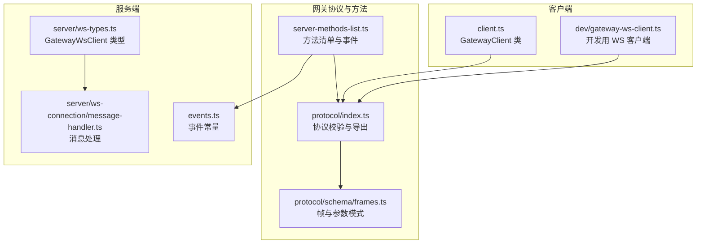
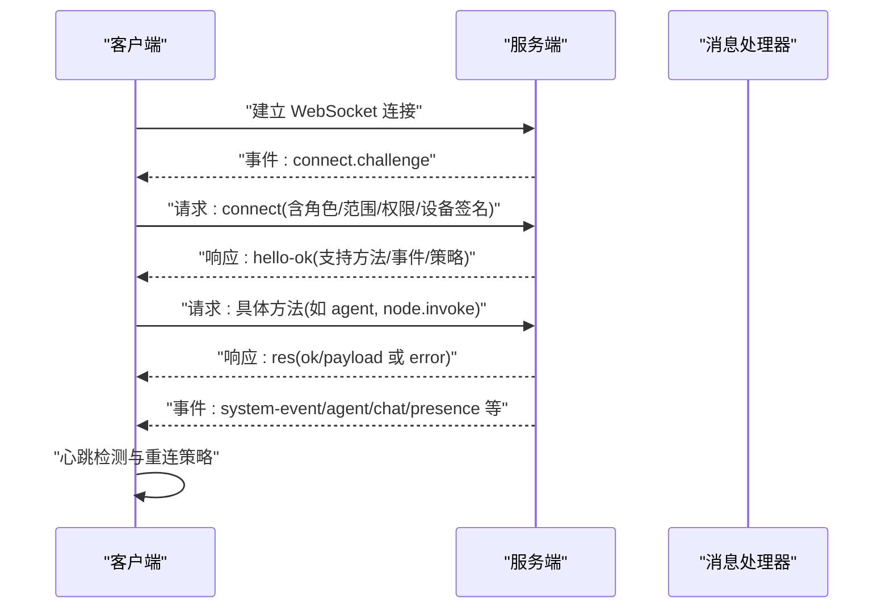
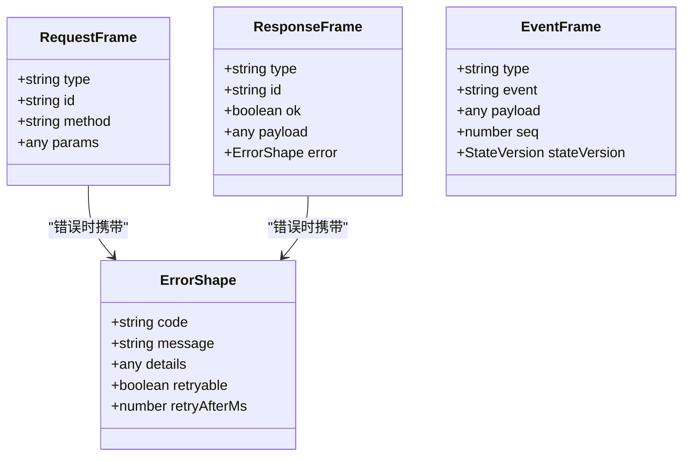
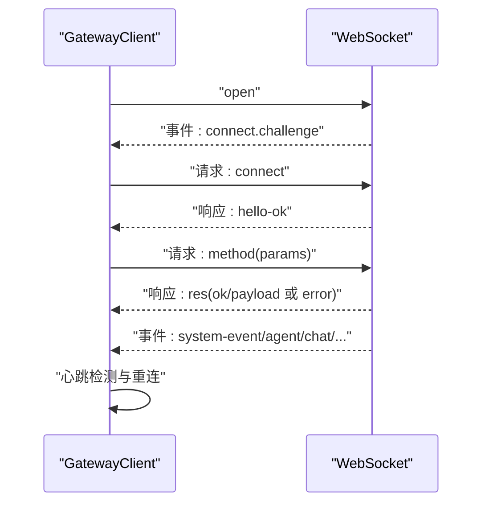
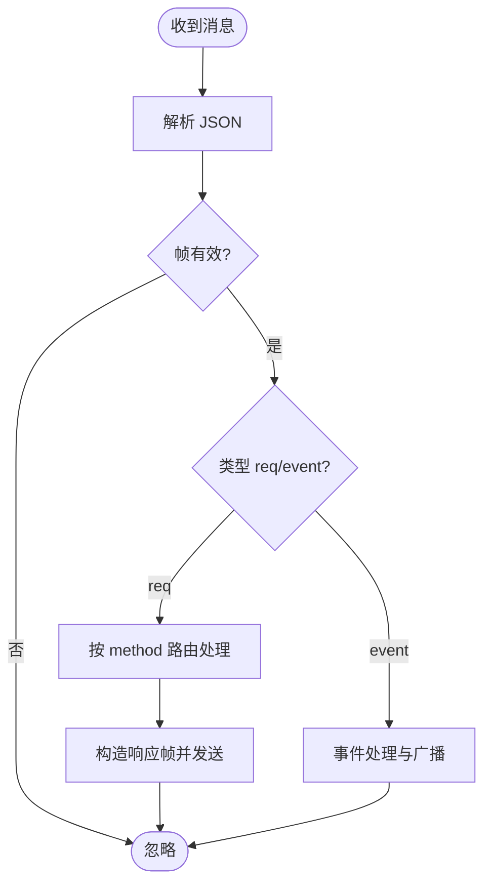
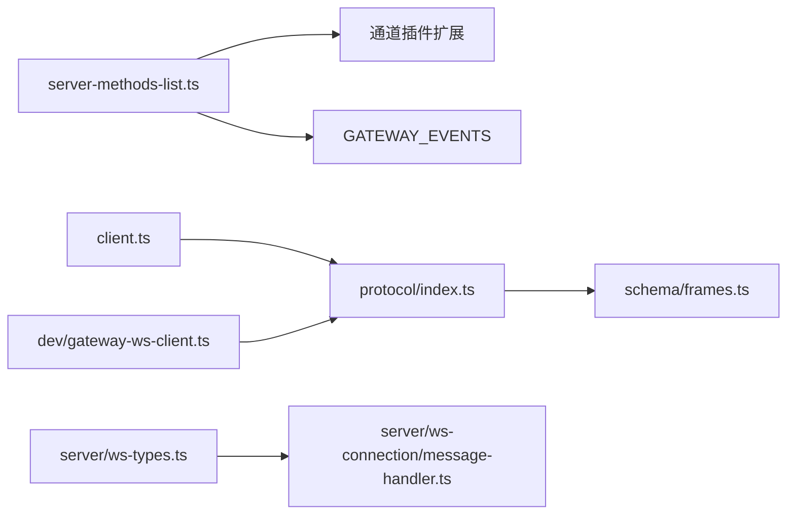

# 方法定义

<cite>
**本文引用的文件**
- [src/gateway/server-methods-list.ts](file://src/gateway/server-methods-list.ts)
- [src/gateway/protocol/index.ts](file://src/gateway/protocol/index.ts)
- [src/gateway/protocol/schema/frames.ts](file://src/gateway/protocol/schema/frames.ts)
- [src/gateway/client.ts](file://src/gateway/client.ts)
- [scripts/dev/gateway-ws-client.ts](file://scripts/dev/gateway-ws-client.ts)
- [src/gateway/server/ws-types.ts](file://src/gateway/server/ws-types.ts)
- [src/gateway/server/ws-connection/message-handler.ts](file://src/gateway/server/ws-connection/message-handler.ts)
- [src/gateway/events.ts](file://src/gateway/events.ts)
</cite>

## 目录
1. [简介](#简介)
2. [项目结构](#项目结构)
3. [核心组件](#核心组件)
4. [架构总览](#架构总览)
5. [详细组件分析](#详细组件分析)
6. [依赖关系分析](#依赖关系分析)
7. [性能考量](#性能考量)
8. [故障排查指南](#故障排查指南)
9. [结论](#结论)
10. [附录](#附录)

## 简介
本文件为 OpenClaw 的 WebSocket 方法定义提供系统化 API 文档，覆盖方法分类（控制平面、数据平面、管理平面）、方法清单、参数与返回值规范、调用流程、权限与作用域、错误处理、性能与使用限制，以及扩展与自定义指南。文档以仓库中网关协议与方法清单为核心依据，结合客户端与服务端实现，帮助开发者正确集成与扩展 OpenClaw 的 WebSocket 能力。

## 项目结构
与 WebSocket 方法定义直接相关的核心模块如下：
- 方法清单与事件：src/gateway/server-methods-list.ts
- 协议帧与校验：src/gateway/protocol/index.ts、src/gateway/protocol/schema/frames.ts
- 客户端实现：src/gateway/client.ts
- 开发用 WebSocket 客户端：scripts/dev/gateway-ws-client.ts
- 服务端连接类型：src/gateway/server/ws-types.ts
- 服务端消息处理：src/gateway/server/ws-connection/message-handler.ts
- 网关事件常量：src/gateway/events.ts

**图表来源**
- [src/gateway/server-methods-list.ts:1-133](file://src/gateway/server-methods-list.ts#L1-L133)
- [src/gateway/protocol/index.ts:1-673](file://src/gateway/protocol/index.ts#L1-L673)
- [src/gateway/protocol/schema/frames.ts:1-164](file://src/gateway/protocol/schema/frames.ts#L1-L164)
- [src/gateway/client.ts:1-674](file://src/gateway/client.ts#L1-L674)
- [scripts/dev/gateway-ws-client.ts:1-133](file://scripts/dev/gateway-ws-client.ts#L1-L133)
- [src/gateway/server/ws-types.ts:1-14](file://src/gateway/server/ws-types.ts#L1-L14)
- [src/gateway/server/ws-connection/message-handler.ts:363-390](file://src/gateway/server/ws-connection/message-handler.ts#L363-L390)
- [src/gateway/events.ts:1-8](file://src/gateway/events.ts#L1-L8)

**章节来源**
- [src/gateway/server-methods-list.ts:1-133](file://src/gateway/server-methods-list.ts#L1-L133)
- [src/gateway/protocol/index.ts:1-673](file://src/gateway/protocol/index.ts#L1-L673)
- [src/gateway/protocol/schema/frames.ts:1-164](file://src/gateway/protocol/schema/frames.ts#L1-L164)
- [src/gateway/client.ts:1-674](file://src/gateway/client.ts#L1-L674)
- [scripts/dev/gateway-ws-client.ts:1-133](file://scripts/dev/gateway-ws-client.ts#L1-L133)
- [src/gateway/server/ws-types.ts:1-14](file://src/gateway/server/ws-types.ts#L1-L14)
- [src/gateway/server/ws-connection/message-handler.ts:363-390](file://src/gateway/server/ws-connection/message-handler.ts#L363-L390)
- [src/gateway/events.ts:1-8](file://src/gateway/events.ts#L1-L8)

## 核心组件
- 方法清单与事件
  - 基础方法集合与通道插件扩展方法集合合并后形成最终可用方法集。
  - 事件集合包含系统事件、节点配对事件、设备配对事件、执行审批事件等。
- 协议与帧
  - 请求帧、响应帧、事件帧三类帧结构，统一通过 Ajv 校验。
  - 连接参数、握手结果、错误结构等均有明确模式定义。
- 客户端
  - GatewayClient 提供连接、鉴权、请求发送、事件监听、重连与心跳检测等能力。
  - 开发用客户端提供最小化请求/事件处理封装，便于调试与演示。
- 服务端
  - GatewayWsClient 类型描述连接状态与上下文信息。
  - 消息处理器负责解析帧、记录元数据、分发到对应处理逻辑。

**章节来源**
- [src/gateway/server-methods-list.ts:107-132](file://src/gateway/server-methods-list.ts#L107-L132)
- [src/gateway/protocol/index.ts:253-458](file://src/gateway/protocol/index.ts#L253-L458)
- [src/gateway/protocol/schema/frames.ts:125-164](file://src/gateway/protocol/schema/frames.ts#L125-L164)
- [src/gateway/client.ts:109-674](file://src/gateway/client.ts#L109-L674)
- [scripts/dev/gateway-ws-client.ts:52-133](file://scripts/dev/gateway-ws-client.ts#L52-L133)
- [src/gateway/server/ws-types.ts:4-13](file://src/gateway/server/ws-types.ts#L4-L13)
- [src/gateway/server/ws-connection/message-handler.ts:363-390](file://src/gateway/server/ws-connection/message-handler.ts#L363-L390)

## 架构总览
下图展示了客户端与服务端之间的交互流程：握手、鉴权、请求-响应、事件推送与心跳检测。

**图表来源**
- [src/gateway/client.ts:134-251](file://src/gateway/client.ts#L134-L251)
- [src/gateway/client.ts:267-415](file://src/gateway/client.ts#L267-L415)
- [src/gateway/client.ts:497-554](file://src/gateway/client.ts#L497-L554)
- [src/gateway/server/ws-connection/message-handler.ts:363-390](file://src/gateway/server/ws-connection/message-handler.ts#L363-L390)

## 详细组件分析

### 方法分类与清单
- 控制平面方法
  - 用于系统控制与配置，如健康检查、状态查询、更新、会话管理、模型与工具目录、TTS 配置、语音唤醒、日志追踪等。
  - 示例：health、status、usage.status、usage.cost、config.get/set/apply/patch、models.list、tools.catalog、tts.*、voicewake.*、sessions.*、update.run、logs.tail、channels.status/logout。
- 数据平面方法
  - 用于业务数据与交互，如代理交互、节点编排、聊天接口、浏览器请求等。
  - 示例：agent、agent.identity.get、agent.wait、node.invoke、node.invoke.result、node.event、node.pending.*、node.canvas.capability.refresh、send、browser.request、chat.history/send/abort。
- 管理方法
  - 用于配对与设备令牌管理、执行审批、向导流程等。
  - 示例：node.pair.*、device.pair.*、device.token.rotate/revoke、exec.approval.*、wizard.*。

方法清单由基础方法与通道插件扩展方法合并生成，确保动态扩展能力。

**章节来源**
- [src/gateway/server-methods-list.ts:4-105](file://src/gateway/server-methods-list.ts#L4-L105)
- [src/gateway/server-methods-list.ts:107-110](file://src/gateway/server-methods-list.ts#L107-L110)

### 协议帧与参数校验
- 帧类型
  - 请求帧：包含 id、method、可选 params。
  - 响应帧：包含 id、ok、可选 payload 或 error。
  - 事件帧：包含 event、可选 payload、seq、stateVersion。
- 参数模式
  - ConnectParams、HelloOk、RequestFrame、ResponseFrame、EventFrame 等均有严格模式定义。
  - 所有方法参数均通过 Ajv 校验，格式化错误信息便于定位问题。
- 错误结构
  - 包含 code、message、details、retryable、retryAfterMs 等字段，便于客户端进行重试与提示。

**图表来源**
- [src/gateway/protocol/schema/frames.ts:125-164](file://src/gateway/protocol/schema/frames.ts#L125-L164)
- [src/gateway/protocol/index.ts:253-458](file://src/gateway/protocol/index.ts#L253-L458)

**章节来源**
- [src/gateway/protocol/schema/frames.ts:125-164](file://src/gateway/protocol/schema/frames.ts#L125-L164)
- [src/gateway/protocol/index.ts:253-458](file://src/gateway/protocol/index.ts#L253-L458)

### 客户端调用流程
- 连接与握手
  - 客户端在打开连接后等待服务端的 connect.challenge 事件，获取 nonce 后发送 connect 请求。
  - 支持设备签名、共享令牌、密码等多种认证方式，并持久化设备令牌。
- 请求发送
  - request 方法生成唯一 id，构造请求帧并发送；根据 expectFinal 标记等待最终响应。
  - 响应帧通过 pending 映射解析并 resolve/reject。
- 事件与心跳
  - 事件帧交由 onEvent 回调处理；周期性 tick 事件用于心跳检测，超时触发关闭。
  - 支持序列号 gap 检测与重连策略。

**图表来源**
- [src/gateway/client.ts:134-251](file://src/gateway/client.ts#L134-L251)
- [src/gateway/client.ts:267-415](file://src/gateway/client.ts#L267-L415)
- [src/gateway/client.ts:497-554](file://src/gateway/client.ts#L497-L554)

**章节来源**
- [src/gateway/client.ts:134-251](file://src/gateway/client.ts#L134-L251)
- [src/gateway/client.ts:267-415](file://src/gateway/client.ts#L267-L415)
- [src/gateway/client.ts:497-554](file://src/gateway/client.ts#L497-L554)

### 服务端消息处理
- 帧解析与元数据记录
  - 解析消息为对象，提取 type/method/id 并记录最近帧元数据，便于诊断。
- 方法路由与执行
  - 根据 method 分派到对应处理器，执行后通过响应帧返回结果或错误。
- 事件广播
  - 将系统事件、节点事件、聊天事件等以事件帧形式推送给客户端。

**图表来源**
- [src/gateway/server/ws-connection/message-handler.ts:363-390](file://src/gateway/server/ws-connection/message-handler.ts#L363-L390)

**章节来源**
- [src/gateway/server/ws-connection/message-handler.ts:363-390](file://src/gateway/server/ws-connection/message-handler.ts#L363-L390)

### 方法调用示例（流程）
以下为通用调用流程示例（不包含具体代码内容）：
- 握手与鉴权
  - 客户端连接后等待 connect.challenge，收到 nonce 后发送 connect，携带角色、范围、权限、设备签名或令牌。
- 发送请求
  - 使用 request(method, params) 发送请求，等待响应；若 expectFinal=true，则持续等待最终结果。
- 处理事件
  - 订阅 onEvent 回调，处理 system-event、agent、chat、presence 等事件。
- 错误处理
  - 响应帧 error 字段包含错误码与详情；客户端可根据 details 判断是否可重试。

**章节来源**
- [src/gateway/client.ts:647-672](file://src/gateway/client.ts#L647-L672)
- [src/gateway/client.ts:527-550](file://src/gateway/client.ts#L527-L550)

### 权限与作用域
- 角色与范围
  - connect 请求包含 role 与 scopes，用于声明客户端权限边界。
- 设备签名
  - 可选 device 字段包含公钥、签名与时间戳，用于设备级身份验证。
- 权限映射
  - 可通过 permissions 传入键值映射，声明细粒度权限。
- 令牌与重试
  - 支持设备令牌与共享令牌；当设备令牌不匹配且端点可信时，允许一次性重试。

**章节来源**
- [src/gateway/protocol/schema/frames.ts:20-69](file://src/gateway/protocol/schema/frames.ts#L20-L69)
- [src/gateway/client.ts:282-366](file://src/gateway/client.ts#L282-L366)
- [src/gateway/client.ts:395-476](file://src/gateway/client.ts#L395-L476)

### 性能指标与使用限制
- 心跳与保活
  - 服务端通过 tick 事件驱动心跳，客户端检测超时自动关闭并重连。
- 负载与缓冲
  - hello-ok 中包含策略字段，包含最大负载与缓冲字节限制，客户端需遵守。
- 大消息支持
  - 客户端默认允许较大负载（如屏幕快照），服务端亦应具备相应策略。

**章节来源**
- [src/gateway/client.ts:384-414](file://src/gateway/client.ts#L384-L414)
- [src/gateway/protocol/schema/frames.ts:102-109](file://src/gateway/protocol/schema/frames.ts#L102-L109)
- [src/gateway/client.ts:169-173](file://src/gateway/client.ts#L169-L173)

### 方法扩展与自定义指南
- 扩展方法
  - 通过通道插件的 gatewayMethods 字段注册新方法，最终与基础方法合并。
- 参数校验
  - 新增方法参数需在 schema 中新增模式并通过 Ajv 编译器导出，确保两端一致。
- 事件扩展
  - 在 GATEWAY_EVENTS 中添加新事件名，服务端在合适时机以事件帧推送。
- 客户端适配
  - 客户端 request 方法保持通用行为；如需特殊处理（如 expectFinal），在调用侧设置选项。

**章节来源**
- [src/gateway/server-methods-list.ts:107-110](file://src/gateway/server-methods-list.ts#L107-L110)
- [src/gateway/protocol/index.ts:253-458](file://src/gateway/protocol/index.ts#L253-L458)
- [src/gateway/events.ts:1-8](file://src/gateway/events.ts#L1-L8)

## 依赖关系分析
- 方法清单依赖于通道插件的扩展方法，保证动态能力聚合。
- 协议层通过 Ajv 对所有帧与参数进行强类型校验，降低运行期错误。
- 客户端与服务端均依赖统一的帧结构与错误模式，确保互操作一致性。

**图表来源**
- [src/gateway/server-methods-list.ts:107-110](file://src/gateway/server-methods-list.ts#L107-L110)
- [src/gateway/protocol/index.ts:253-458](file://src/gateway/protocol/index.ts#L253-L458)
- [src/gateway/protocol/schema/frames.ts:125-164](file://src/gateway/protocol/schema/frames.ts#L125-L164)
- [src/gateway/client.ts:109-674](file://src/gateway/client.ts#L109-L674)
- [scripts/dev/gateway-ws-client.ts:52-133](file://scripts/dev/gateway-ws-client.ts#L52-L133)
- [src/gateway/server/ws-types.ts:4-13](file://src/gateway/server/ws-types.ts#L4-L13)
- [src/gateway/server/ws-connection/message-handler.ts:363-390](file://src/gateway/server/ws-connection/message-handler.ts#L363-L390)

**章节来源**
- [src/gateway/server-methods-list.ts:107-110](file://src/gateway/server-methods-list.ts#L107-L110)
- [src/gateway/protocol/index.ts:253-458](file://src/gateway/protocol/index.ts#L253-L458)
- [src/gateway/protocol/schema/frames.ts:125-164](file://src/gateway/protocol/schema/frames.ts#L125-L164)
- [src/gateway/client.ts:109-674](file://src/gateway/client.ts#L109-L674)
- [scripts/dev/gateway-ws-client.ts:52-133](file://scripts/dev/gateway-ws-client.ts#L52-L133)
- [src/gateway/server/ws-types.ts:4-13](file://src/gateway/server/ws-types.ts#L4-L13)
- [src/gateway/server/ws-connection/message-handler.ts:363-390](file://src/gateway/server/ws-connection/message-handler.ts#L363-L390)

## 性能考量
- 心跳与保活
  - 客户端基于 tick 事件维护心跳窗口，避免静默断开。
- 负载与缓冲
  - 服务端策略限制最大负载与缓冲字节，客户端需控制消息大小与并发。
- 重连退避
  - 客户端采用指数退避与最小间隔保护，避免风暴式重连。

**章节来源**
- [src/gateway/client.ts:384-414](file://src/gateway/client.ts#L384-L414)
- [src/gateway/protocol/schema/frames.ts:102-109](file://src/gateway/protocol/schema/frames.ts#L102-L109)
- [src/gateway/client.ts:576-587](file://src/gateway/client.ts#L576-L587)

## 故障排查指南
- 连接失败
  - 检查 connect.challenge 是否到达、nonce 是否存在；确认 URL 安全性（wss:// 或允许的私有网络）。
- 认证问题
  - 关注 connect 失败详情码与恢复建议；设备令牌不匹配时，检查端点可信性与重试预算。
- 请求无响应
  - 确认 expectFinal 设置与服务端处理耗时；检查 pending 映射与超时。
- 事件缺失
  - 检查事件过滤条件与 onEvent 回调注册；关注序列号 gap 与心跳状态。

**章节来源**
- [src/gateway/client.ts:144-168](file://src/gateway/client.ts#L144-L168)
- [src/gateway/client.ts:392-414](file://src/gateway/client.ts#L392-L414)
- [src/gateway/client.ts:527-550](file://src/gateway/client.ts#L527-L550)
- [src/gateway/client.ts:514-525](file://src/gateway/client.ts#L514-L525)

## 结论
OpenClaw 的 WebSocket 方法体系以统一协议帧与严格的参数校验为基础，结合客户端的握手、鉴权、请求-响应与事件机制，提供了清晰的控制平面、数据平面与管理平面方法集合。通过通道插件扩展机制，系统具备良好的可扩展性；配合完善的错误与心跳策略，满足生产环境的稳定性与可观测性需求。

## 附录
- 开发用 WebSocket 客户端
  - 提供最小化封装，便于快速验证方法与事件。
- 服务端连接类型
  - GatewayWsClient 类型描述连接上下文，便于服务端管理多路连接。

**章节来源**
- [scripts/dev/gateway-ws-client.ts:52-133](file://scripts/dev/gateway-ws-client.ts#L52-L133)
- [src/gateway/server/ws-types.ts:4-13](file://src/gateway/server/ws-types.ts#L4-L13)