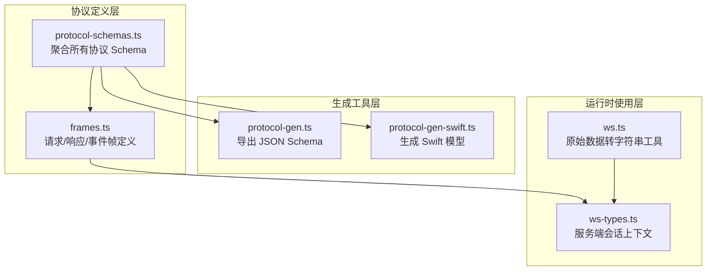
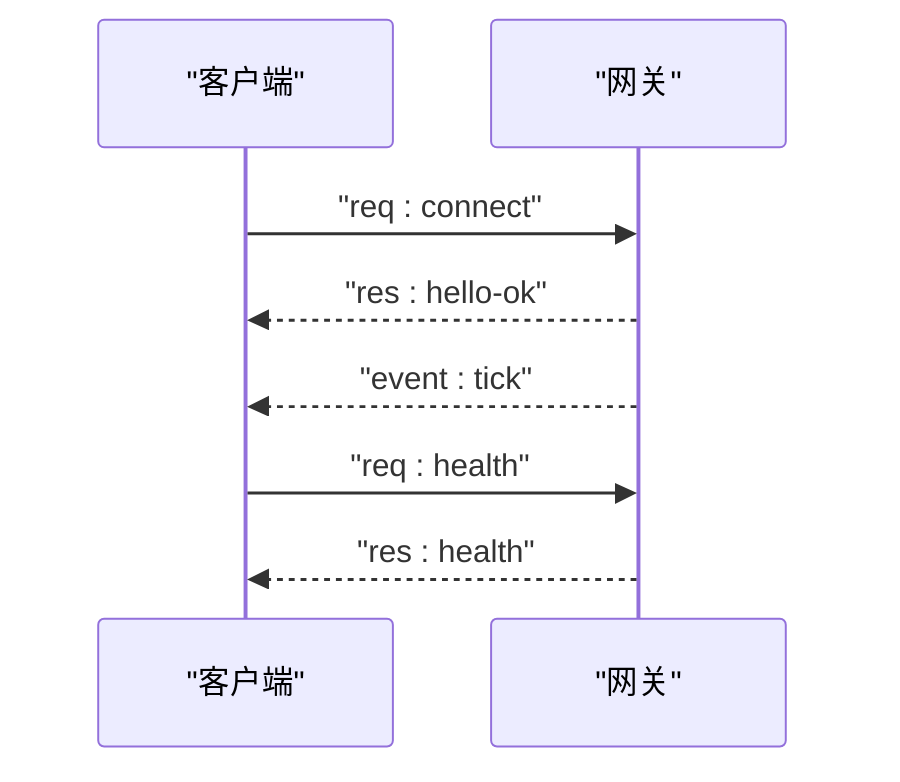
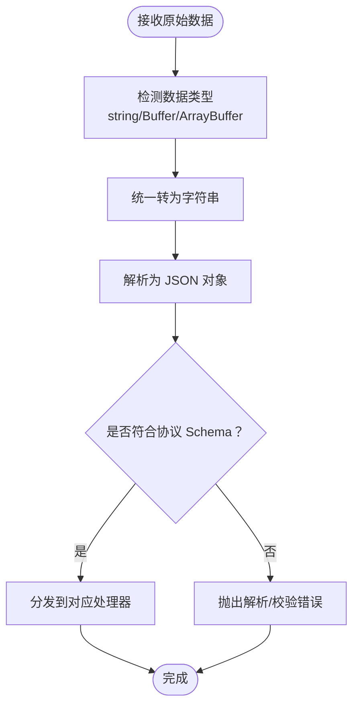
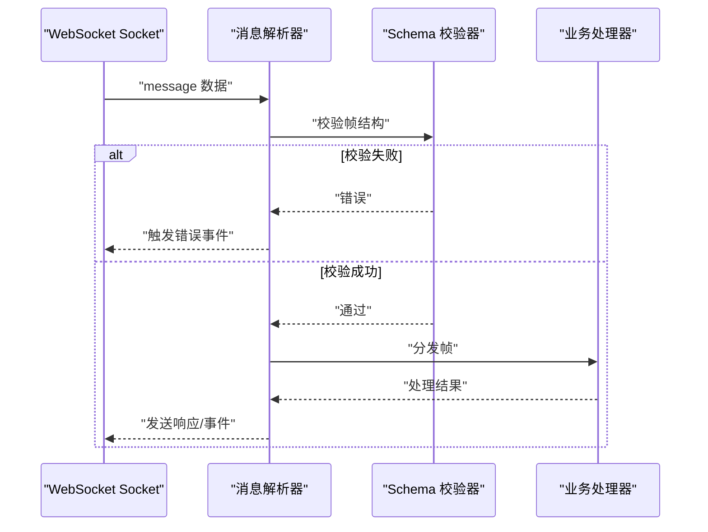
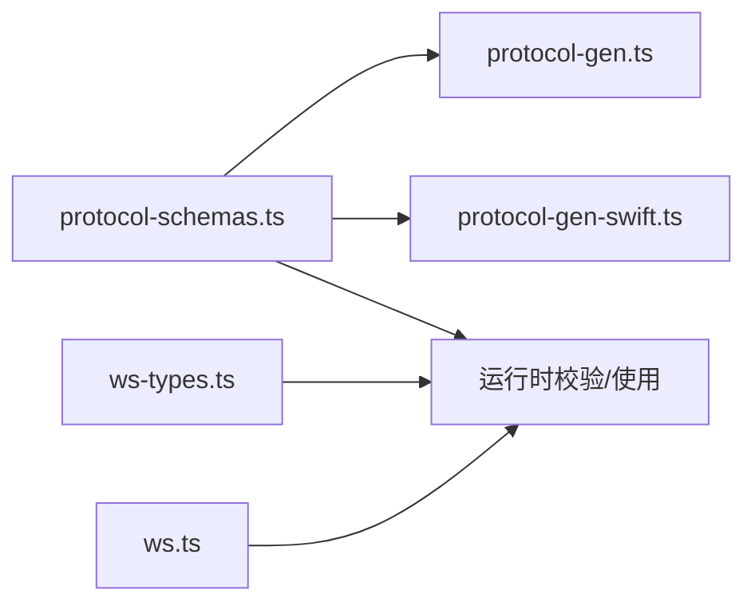

# 消息格式

<cite>
**本文引用的文件**
- [protocol-schemas.ts](file://src/gateway/protocol/schema/protocol-schemas.ts)
- [frames.ts](file://src/gateway/protocol/schema/frames.ts)
- [typebox.md](file://docs/concepts/typebox.md)
- [protocol-gen.ts](file://scripts/protocol-gen.ts)
- [protocol-gen-swift.ts](file://scripts/protocol-gen-swift.ts)
- [ws-types.ts](file://src/gateway/server/ws-types.ts)
- [ws.ts](file://src/infra/ws.ts)
- [GatewayNodeSessionTests.swift](file://apps/shared/OpenClawKit/Tests/OpenClawKitTests/GatewayNodeSessionTests.swift)
- [openai-ws-connection.test.ts](file://src/agents/openai-ws-connection.test.ts)
- [GatewayConnection.swift](file://apps/macos/Sources/OpenClaw/GatewayConnection.swift)
</cite>

## 目录
1. [简介](#简介)
2. [项目结构](#项目结构)
3. [核心组件](#核心组件)
4. [架构总览](#架构总览)
5. [详细组件分析](#详细组件分析)
6. [依赖关系分析](#依赖关系分析)
7. [性能考量](#性能考量)
8. [故障排查指南](#故障排查指南)
9. [结论](#结论)
10. [附录](#附录)

## 简介
本文件为 OpenClaw WebSocket 消息格式的权威规范，覆盖消息结构定义（消息头、负载与元数据）、请求/响应模式（同步调用、异步事件、批量操作）、消息类型分类（控制、业务、系统）、消息示例、序列化与反序列化流程、版本控制与兼容性策略，以及验证规则与错误处理机制。规范以仓库内协议源码与生成工具为依据，确保一致性与可追溯性。

## 项目结构
OpenClaw 的 WebSocket 协议由“TypeBox 定义 + JSON Schema 导出 + Swift 代码生成”三位一体驱动：TypeBox 定义协议帧与参数；脚本导出 JSON Schema；另一脚本生成 Swift 模型，保证跨语言一致性。

图示来源
- [protocol-schemas.ts:162-299](file://src/gateway/protocol/schema/protocol-schemas.ts#L162-L299)
- [frames.ts:125-164](file://src/gateway/protocol/schema/frames.ts#L125-L164)
- [protocol-gen.ts:9-42](file://scripts/protocol-gen.ts#L9-L42)
- [protocol-gen-swift.ts:213-242](file://scripts/protocol-gen-swift.ts#L213-L242)
- [ws-types.ts:4-13](file://src/gateway/server/ws-types.ts#L4-L13)
- [ws.ts:4-21](file://src/infra/ws.ts#L4-L21)

章节来源
- [protocol-schemas.ts:162-299](file://src/gateway/protocol/schema/protocol-schemas.ts#L162-L299)
- [frames.ts:125-164](file://src/gateway/protocol/schema/frames.ts#L125-L164)
- [protocol-gen.ts:9-42](file://scripts/protocol-gen.ts#L9-L42)
- [protocol-gen-swift.ts:213-242](file://scripts/protocol-gen-swift.ts#L213-L242)
- [ws-types.ts:4-13](file://src/gateway/server/ws-types.ts#L4-L13)
- [ws.ts:4-21](file://src/infra/ws.ts#L4-L21)

## 核心组件
- 帧类型与结构
  - 请求帧：携带方法名与参数，用于同步调用。
  - 响应帧：携带结果或错误，与请求 id 对应。
  - 事件帧：服务器主动推送的状态变更或通知。
- 协议版本与能力
  - 协议版本在协议定义中集中声明，作为版本控制基础。
  - 服务器通过 hello-ok 帧告知支持的方法与事件集合。
- 错误模型
  - 统一的错误形状包含错误码、消息、细节、重试信息等字段。

章节来源
- [frames.ts:125-164](file://src/gateway/protocol/schema/frames.ts#L125-L164)
- [protocol-schemas.ts:301](file://src/gateway/protocol/schema/protocol-schemas.ts#L301)
- [typebox.md:22-31](file://docs/concepts/typebox.md#L22-L31)

## 架构总览
下图展示了客户端与网关之间的典型交互：握手、心跳、方法调用与事件订阅。

图示来源
- [typebox.md:32-41](file://docs/concepts/typebox.md#L32-L41)
- [frames.ts:125-164](file://src/gateway/protocol/schema/frames.ts#L125-L164)

## 详细组件分析

### 消息结构定义
- 通用字段
  - type：帧类型，区分 req/res/event。
  - id：请求唯一标识，用于响应匹配。
  - method：方法名，用于请求帧。
  - event/payload：事件名与载荷，用于事件帧。
  - ok/payload/error：成功标志、返回数据或错误对象，用于响应帧。
  - seq/stateVersion：事件序号与状态版本，用于事件帧。
- 结构约束
  - 所有字段均在 TypeBox 中显式约束，禁止额外属性，确保严格校验。
  - 错误形状包含可选的重试控制字段，便于客户端策略化处理。

章节来源
- [frames.ts:125-164](file://src/gateway/protocol/schema/frames.ts#L125-L164)
- [frames.ts:114-123](file://src/gateway/protocol/schema/frames.ts#L114-L123)

### 请求/响应模式
- 同步调用
  - 客户端发送请求帧，服务端返回对应响应帧，通过 id 匹配。
- 异步通知
  - 服务器通过事件帧推送状态变化（如心跳、代理事件）。
- 批量操作
  - 协议未定义专用“批量”帧；可通过多次独立请求实现，或在上层应用中组合多个方法调用。

章节来源
- [typebox.md:22-31](file://docs/concepts/typebox.md#L22-L31)
- [frames.ts:125-164](file://src/gateway/protocol/schema/frames.ts#L125-L164)

### 消息类型分类
- 控制消息
  - 连接握手：connect 请求与 hello-ok 响应。
  - 心跳与系统事件：tick、shutdown 等。
- 业务消息
  - 代理、节点、会话、配置、密钥、定时任务、聊天等方法调用与事件。
- 系统消息
  - 状态快照、策略参数（最大载荷、缓冲字节、心跳间隔）等。

章节来源
- [frames.ts:20-18](file://src/gateway/protocol/schema/frames.ts#L20-L18)
- [frames.ts:71-112](file://src/gateway/protocol/schema/frames.ts#L71-L112)
- [protocol-schemas.ts:162-299](file://src/gateway/protocol/schema/protocol-schemas.ts#L162-L299)

### 消息示例
以下示例路径展示典型帧形态，避免直接粘贴代码内容：
- 连接握手
  - 请求帧：[示例路径:85-105](file://docs/concepts/typebox.md#L85-L105)
  - 响应帧（hello-ok）：[示例路径:107-128](file://docs/concepts/typebox.md#L107-L128)
- 方法调用
  - 请求帧：[示例路径:130-134](file://docs/concepts/typebox.md#L130-L134)
  - 响应帧：[示例路径:135-138](file://docs/concepts/typebox.md#L135-L138)
- 事件推送
  - 事件帧：[示例路径:140-144](file://docs/concepts/typebox.md#L140-L144)

章节来源
- [typebox.md:83-144](file://docs/concepts/typebox.md#L83-L144)

### 序列化与反序列化
- JSON 编码
  - 协议基于 JSON 文本帧；TypeBox 与 JSON Schema 保证字段与类型一致性。
  - 生成工具导出 JSON Schema，便于第三方校验与 IDE 支持。
- 二进制格式
  - 仓库未定义二进制帧格式；默认以文本 JSON 传输。
- Swift 侧模型
  - 通过代码生成器将协议 Schema 转换为 Swift 模型，支持 Codable 与 Sendable。

图示来源
- [ws.ts:4-21](file://src/infra/ws.ts#L4-L21)
- [protocol-gen.ts:9-42](file://scripts/protocol-gen.ts#L9-L42)
- [protocol-gen-swift.ts:213-242](file://scripts/protocol-gen-swift.ts#L213-L242)

章节来源
- [ws.ts:4-21](file://src/infra/ws.ts#L4-L21)
- [protocol-gen.ts:9-42](file://scripts/protocol-gen.ts#L9-L42)
- [protocol-gen-swift.ts:213-242](file://scripts/protocol-gen-swift.ts#L213-L242)

### 版本控制、向后兼容与迁移
- 协议版本
  - 协议版本常量集中声明于协议定义文件，作为版本控制基础。
- 兼容策略
  - 服务器在 hello-ok 中声明支持的方法与事件列表，客户端据此适配。
  - 新增字段采用可选方式，避免破坏旧客户端解析。
- 迁移策略
  - 新版本引入新方法/事件时，旧客户端仍可安全连接但无法调用新功能；建议在升级窗口内滚动发布并提供降级路径。

章节来源
- [protocol-schemas.ts:301](file://src/gateway/protocol/schema/protocol-schemas.ts#L301)
- [frames.ts:71-112](file://src/gateway/protocol/schema/frames.ts#L71-L112)

### 验证规则与错误处理
- 服务器端
  - 使用 AJV 对入站帧进行严格校验；仅接受符合 ConnectParams 的握手请求。
- 客户端
  - JS 客户端在收到事件与响应帧后进行二次校验后再使用。
- 错误事件
  - 解析失败、缺少 type 字段、WebSocket 错误等场景触发错误事件，便于上层捕获与重连。
- 错误形状
  - 统一错误对象包含 code/message/details/retryable/retryAfterMs 等字段，便于客户端策略化重试。

图示来源
- [openai-ws-connection.test.ts:617-643](file://src/agents/openai-ws-connection.test.ts#L617-L643)
- [frames.ts:114-123](file://src/gateway/protocol/schema/frames.ts#L114-L123)

章节来源
- [openai-ws-connection.test.ts:617-643](file://src/agents/openai-ws-connection.test.ts#L617-L643)
- [frames.ts:114-123](file://src/gateway/protocol/schema/frames.ts#L114-L123)

## 依赖关系分析
协议定义通过聚合器集中导出，供生成工具与运行时使用；服务端会话上下文承载连接元数据；底层工具负责原始数据到字符串的转换。

图示来源
- [protocol-schemas.ts:162-299](file://src/gateway/protocol/schema/protocol-schemas.ts#L162-L299)
- [protocol-gen.ts:9-42](file://scripts/protocol-gen.ts#L9-L42)
- [protocol-gen-swift.ts:213-242](file://scripts/protocol-gen-swift.ts#L213-L242)
- [ws-types.ts:4-13](file://src/gateway/server/ws-types.ts#L4-L13)
- [ws.ts:4-21](file://src/infra/ws.ts#L4-L21)

章节来源
- [protocol-schemas.ts:162-299](file://src/gateway/protocol/schema/protocol-schemas.ts#L162-L299)
- [protocol-gen.ts:9-42](file://scripts/protocol-gen.ts#L9-L42)
- [protocol-gen-swift.ts:213-242](file://scripts/protocol-gen-swift.ts#L213-L242)
- [ws-types.ts:4-13](file://src/gateway/server/ws-types.ts#L4-L13)
- [ws.ts:4-21](file://src/infra/ws.ts#L4-L21)

## 性能考量
- 心跳与带宽
  - 服务器通过策略参数告知心跳间隔与缓冲上限，客户端据此优化长连接行为。
- 快照与增量
  - 服务器在 hello-ok 中提供初始快照与状态版本，有助于客户端快速建立一致视图。
- 错误重试
  - 错误形状中的重试控制字段可用于指数退避策略，降低风暴效应。

章节来源
- [frames.ts:71-112](file://src/gateway/protocol/schema/frames.ts#L71-L112)
- [frames.ts:114-123](file://src/gateway/protocol/schema/frames.ts#L114-L123)

## 故障排查指南
- 常见问题
  - 无法解析消息：检查消息是否为合法 JSON，是否存在 type 字段。
  - 握手失败：确认 min/maxProtocol 与客户端版本范围匹配。
  - WebSocket 错误：关注底层 socket 错误事件，结合重试策略处理。
- 定位手段
  - 利用测试用例中的断言点定位解析与校验失败场景。
  - 在服务端/客户端分别打印帧结构，核对字段与类型。

章节来源
- [openai-ws-connection.test.ts:617-643](file://src/agents/openai-ws-connection.test.ts#L617-L643)

## 结论
OpenClaw 的 WebSocket 协议以 TypeBox 为核心，形成“定义—导出—生成—运行”的闭环，确保跨语言一致性与强类型安全。通过严格的帧结构、明确的版本与能力声明、完善的错误模型与校验流程，协议在复杂多端环境中具备良好的可维护性与扩展性。

## 附录

### 方法与事件清单（示例）
- 方法类
  - 示例：connect、health、chat.send、cron.add 等。
- 事件类
  - 示例：tick、agent、presence 等。
- 设备配对与执行审批
  - 示例：device.pair.list、exec.approval.resolve 等。

章节来源
- [typebox.md:83-144](file://docs/concepts/typebox.md#L83-L144)
- [GatewayConnection.swift:88-99](file://apps/macos/Sources/OpenClaw/GatewayConnection.swift#L88-L99)