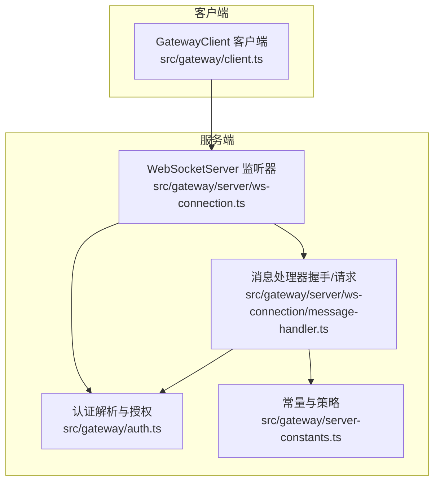
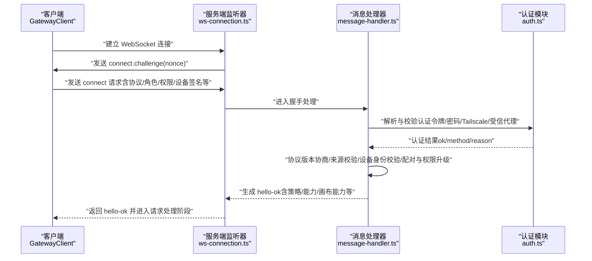
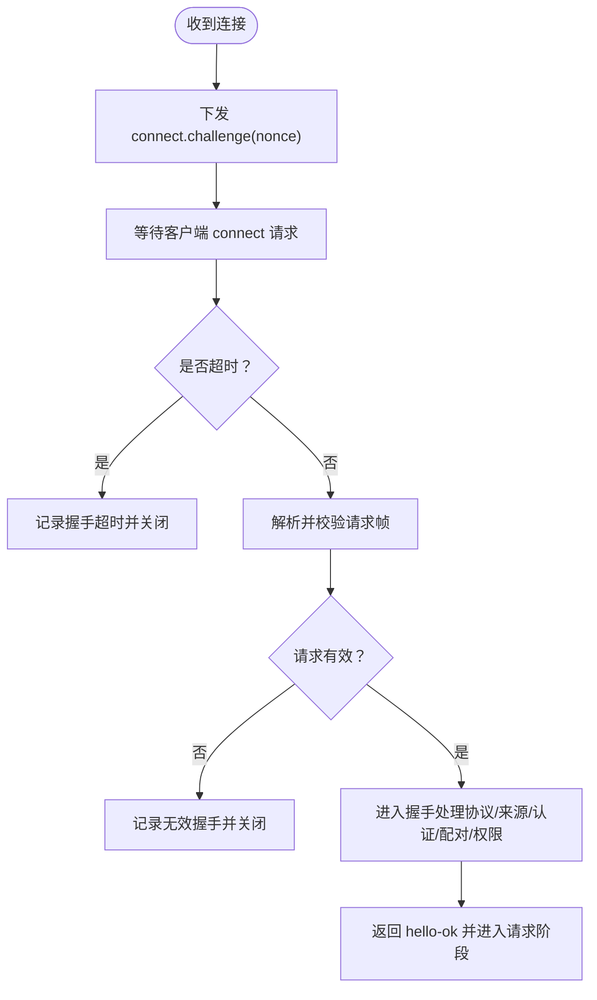
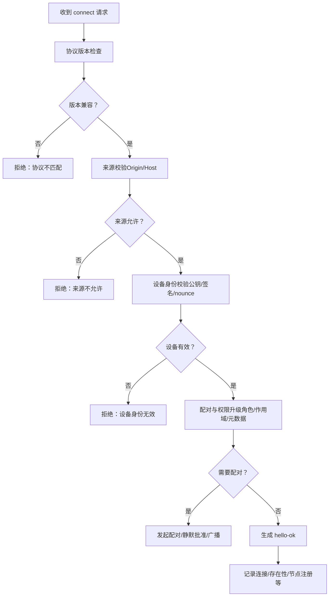
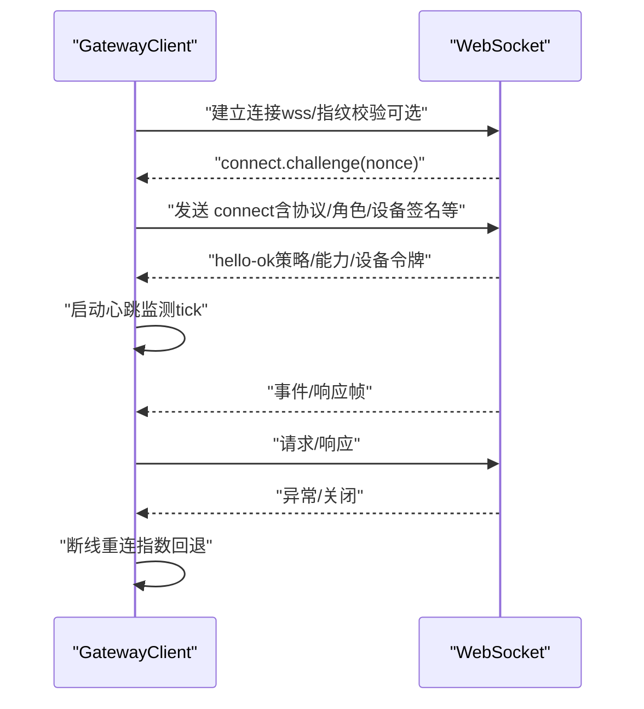
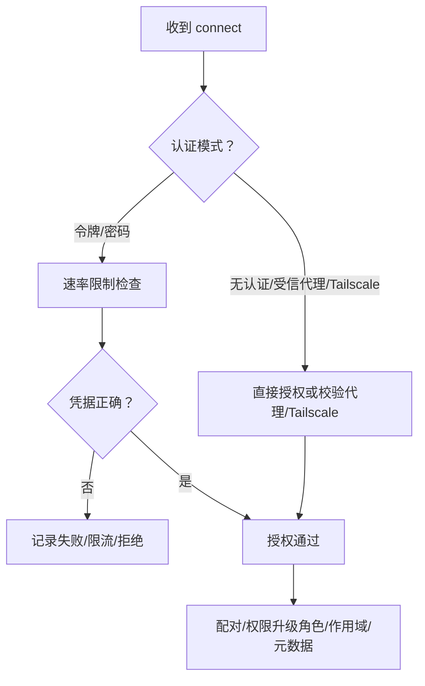
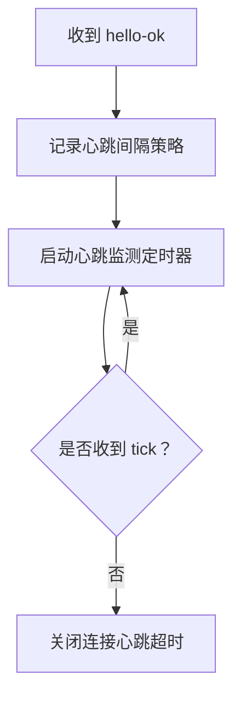
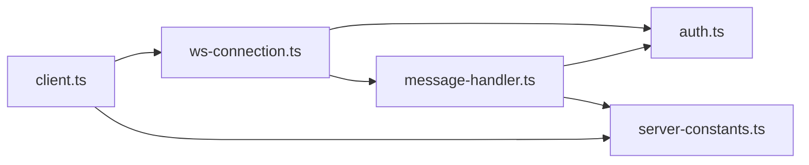

# 连接管理

<cite>
**本文引用的文件**   
- [src/gateway/server/ws-connection.ts](file://src/gateway/server/ws-connection.ts)
- [src/gateway/server/ws-connection/message-handler.ts](file://src/gateway/server/ws-connection/message-handler.ts)
- [src/gateway/client.ts](file://src/gateway/client.ts)
- [src/gateway/auth.ts](file://src/gateway/auth.ts)
- [src/gateway/server-constants.ts](file://src/gateway/server-constants.ts)
- [src/gateway/server.auth.default-token.suite.ts](file://src/gateway/server.auth.default-token.suite.ts)
- [docs/gateway/heartbeat.md](file://docs/gateway/heartbeat.md)
</cite>

## 目录
1. [简介](#简介)
2. [项目结构](#项目结构)
3. [核心组件](#核心组件)
4. [架构总览](#架构总览)
5. [详细组件分析](#详细组件分析)
6. [依赖关系分析](#依赖关系分析)
7. [性能考量](#性能考量)
8. [故障排除指南](#故障排除指南)
9. [结论](#结论)
10. [附录](#附录)

## 简介
本文件系统化梳理 OpenClaw 的 WebSocket 连接管理系统，覆盖以下主题：
- WebSocket 连接建立流程：握手过程、端口监听与服务器启动
- 连接认证机制：令牌验证、权限检查与会话管理
- 连接状态管理：生命周期、心跳检测与断线重连策略
- 连接参数配置：超时、缓冲区大小、并发限制等
- 连接监控与诊断：日志、指标与错误码
- 客户端连接示例与故障排除

## 项目结构
OpenClaw 的 WebSocket 连接管理由“服务端监听器 + 消息处理器 + 客户端库”三部分组成，并通过统一协议版本与安全策略协同工作。

图示来源
- [src/gateway/server/ws-connection.ts:93-319](file://src/gateway/server/ws-connection.ts#L93-L319)
- [src/gateway/server/ws-connection/message-handler.ts:236-1243](file://src/gateway/server/ws-connection/message-handler.ts#L236-L1243)
- [src/gateway/auth.ts:217-504](file://src/gateway/auth.ts#L217-L504)
- [src/gateway/server-constants.ts:1-37](file://src/gateway/server-constants.ts#L1-L37)
- [src/gateway/client.ts:109-674](file://src/gateway/client.ts#L109-L674)

章节来源
- [src/gateway/server/ws-connection.ts:93-319](file://src/gateway/server/ws-connection.ts#L93-L319)
- [src/gateway/server/ws-connection/message-handler.ts:236-1243](file://src/gateway/server/ws-connection/message-handler.ts#L236-L1243)
- [src/gateway/client.ts:109-674](file://src/gateway/client.ts#L109-L674)
- [src/gateway/auth.ts:217-504](file://src/gateway/auth.ts#L217-L504)
- [src/gateway/server-constants.ts:1-37](file://src/gateway/server-constants.ts#L1-L37)

## 核心组件
- 服务端监听器：负责接收连接、下发“连接挑战”、触发握手处理、维护连接生命周期与关闭原因
- 消息处理器：完成协议协商、浏览器来源校验、设备身份与令牌校验、配对与权限升级、最终返回 hello-ok
- 客户端库：发起连接、等待挑战、发送 connect 请求、处理事件与响应、心跳监测与断线重连
- 认证模块：解析配置、执行令牌/密码/Tailscale/受信代理校验、速率限制与防刷
- 常量与策略：握手超时、心跳间隔、最大载荷与缓冲上限等

章节来源
- [src/gateway/server/ws-connection.ts:93-319](file://src/gateway/server/ws-connection.ts#L93-L319)
- [src/gateway/server/ws-connection/message-handler.ts:236-1243](file://src/gateway/server/ws-connection/message-handler.ts#L236-L1243)
- [src/gateway/client.ts:109-674](file://src/gateway/client.ts#L109-L674)
- [src/gateway/auth.ts:217-504](file://src/gateway/auth.ts#L217-L504)
- [src/gateway/server-constants.ts:1-37](file://src/gateway/server-constants.ts#L1-L37)

## 架构总览
下图展示从客户端发起连接到服务端完成握手并建立会话的关键步骤。

图示来源
- [src/gateway/server/ws-connection.ts:115-319](file://src/gateway/server/ws-connection.ts#L115-L319)
- [src/gateway/server/ws-connection/message-handler.ts:363-1158](file://src/gateway/server/ws-connection/message-handler.ts#L363-L1158)
- [src/gateway/auth.ts:378-485](file://src/gateway/auth.ts#L378-L485)

## 详细组件分析

### 服务端监听器与握手流程
- 监听器在收到新连接后立即下发“连接挑战”，要求客户端在握手前提供 nonce
- 握手超时控制：默认 10 秒，可通过测试环境变量覆盖
- 关闭原因记录：将握手失败原因、最后帧元信息、远端地址等写入关闭上下文
- 客户端类型识别：区分 webchat、CLI 等，影响日志与行为

图示来源
- [src/gateway/server/ws-connection.ts:115-277](file://src/gateway/server/ws-connection.ts#L115-L277)
- [src/gateway/server/ws-connection.ts:267-277](file://src/gateway/server/ws-connection.ts#L267-L277)
- [src/gateway/server/ws-connection.ts:207-265](file://src/gateway/server/ws-connection.ts#L207-L265)

章节来源
- [src/gateway/server/ws-connection.ts:115-319](file://src/gateway/server/ws-connection.ts#L115-L319)
- [src/gateway/server-constants.ts:23-32](file://src/gateway/server-constants.ts#L23-L32)

### 消息处理器与握手细节
- 协议版本协商：min/max 协议必须与服务端版本兼容，否则拒绝
- 浏览器来源校验：根据 Host/Origin 与允许列表进行校验，支持 Host 头回退的安全开关
- 设备身份校验：校验公钥、签名时间戳、nonce、签名有效性；支持 v2/v3 载荷
- 配对与权限升级：未配对设备需发起配对；角色/作用域升级需二次确认或自动静默批准
- 最终握手成功后生成 hello-ok，包含策略（最大载荷、缓冲上限、心跳间隔）、能力清单与可选画布能力

图示来源
- [src/gateway/server/ws-connection/message-handler.ts:462-478](file://src/gateway/server/ws-connection/message-handler.ts#L462-L478)
- [src/gateway/server/ws-connection/message-handler.ts:509-532](file://src/gateway/server/ws-connection/message-handler.ts#L509-L532)
- [src/gateway/server/ws-connection/message-handler.ts:733-751](file://src/gateway/server/ws-connection/message-handler.ts#L733-L751)
- [src/gateway/server/ws-connection/message-handler.ts:835-895](file://src/gateway/server/ws-connection/message-handler.ts#L835-L895)
- [src/gateway/server/ws-connection/message-handler.ts:1058-1081](file://src/gateway/server/ws-connection/message-handler.ts#L1058-L1081)

章节来源
- [src/gateway/server/ws-connection/message-handler.ts:363-1158](file://src/gateway/server/ws-connection/message-handler.ts#L363-L1158)

### 客户端库与连接生命周期
- 安全连接策略：非本地私有网络禁止明文 ws；wss 可通过指纹校验加强可信度
- 连接挑战：等待服务端下发 nonce，超时则关闭
- 发送 connect：填充协议范围、客户端信息、角色/作用域、可选设备签名
- hello-ok 后更新策略：最大载荷、缓冲上限、心跳间隔；持久化设备令牌
- 心跳监测：定期检查 tick，超过两倍心跳间隔即主动关闭
- 断线重连：指数回退，受控暂停与恢复

图示来源
- [src/gateway/client.ts:134-251](file://src/gateway/client.ts#L134-L251)
- [src/gateway/client.ts:267-415](file://src/gateway/client.ts#L267-L415)
- [src/gateway/client.ts:596-618](file://src/gateway/client.ts#L596-L618)
- [src/gateway/client.ts:576-587](file://src/gateway/client.ts#L576-L587)

章节来源
- [src/gateway/client.ts:109-674](file://src/gateway/client.ts#L109-L674)

### 认证机制与权限检查
- 支持模式：无认证、令牌、密码、受信代理、Tailscale（按需启用）
- 速率限制：共享密钥类认证的失败尝试按 IP 限流
- 来源校验：浏览器 Origin/Host 校验，支持 Host 回退的安全开关
- 设备配对：首次连接或权限升级时发起配对，支持静默批准（本地且满足条件）
- 角色与作用域：基于配对记录与角色策略进行允许集判定

图示来源
- [src/gateway/auth.ts:378-485](file://src/gateway/auth.ts#L378-L485)
- [src/gateway/server/ws-connection/message-handler.ts:547-774](file://src/gateway/server/ws-connection/message-handler.ts#L547-L774)
- [src/gateway/server/ws-connection/message-handler.ts:835-895](file://src/gateway/server/ws-connection/message-handler.ts#L835-L895)

章节来源
- [src/gateway/auth.ts:217-504](file://src/gateway/auth.ts#L217-L504)
- [src/gateway/server/ws-connection/message-handler.ts:547-774](file://src/gateway/server/ws-connection/message-handler.ts#L547-L774)

### 连接状态管理与心跳
- 心跳间隔：默认 30 秒，客户端可在 hello-ok 中收到服务端策略
- 心跳监测：若超过两倍心跳间隔未收到 tick，客户端主动关闭
- 服务端健康快照：握手完成后刷新一次，便于客户端感知

图示来源
- [src/gateway/client.ts:596-618](file://src/gateway/client.ts#L596-L618)
- [src/gateway/server-constants.ts:33-34](file://src/gateway/server-constants.ts#L33-L34)
- [src/gateway/server/ws-connection/message-handler.ts:1154-1158](file://src/gateway/server/ws-connection/message-handler.ts#L1154-L1158)

章节来源
- [src/gateway/client.ts:596-618](file://src/gateway/client.ts#L596-L618)
- [src/gateway/server-constants.ts:33-34](file://src/gateway/server-constants.ts#L33-L34)
- [docs/gateway/heartbeat.md:1-386](file://docs/gateway/heartbeat.md#L1-L386)

### 连接参数配置
- 超时设置：握手超时默认 10 秒，可通过测试环境变量覆盖
- 缓冲区大小：每连接发送缓冲上限与最大载荷保持一致以避免“超出最大载荷”断开
- 心跳间隔：默认 30 秒，客户端可按服务端策略调整
- 并发限制：通过连接数与速率限制共同约束

章节来源
- [src/gateway/server-constants.ts:1-37](file://src/gateway/server-constants.ts#L1-L37)
- [src/gateway/client.ts:169-196](file://src/gateway/client.ts#L169-L196)

### 连接监控与诊断
- 日志子系统：分别输出“连接控制”“网关”“健康”等日志通道，便于分层排查
- 关闭原因：握手失败、来源不匹配、协议不兼容、速率限制、重复未授权调用等
- 错误码与建议：握手失败时返回结构化错误，包含推荐下一步操作
- TLS 指纹校验：wss 下可强制校验证书指纹，提升信任度

章节来源
- [src/gateway/server/ws-connection.ts:207-265](file://src/gateway/server/ws-connection.ts#L207-L265)
- [src/gateway/server/ws-connection/message-handler.ts:445-478](file://src/gateway/server/ws-connection/message-handler.ts#L445-L478)
- [src/gateway/client.ts:200-207](file://src/gateway/client.ts#L200-L207)

### 客户端连接示例与故障排除
- 示例要点：确保使用 wss；必要时设置 TLS 指纹；在收到 connect.challenge 后发送 connect
- 常见问题与对策：
  - 协议不匹配：确保客户端 min/max 协议与服务端版本兼容
  - 来源不允许：在允许列表中配置 Host/Origin 或开启 Host 回退（谨慎）
  - 设备身份无效：检查公钥、签名时间戳、nonce 与签名有效性
  - 速率限制：减少失败尝试或等待重试时间
  - 心跳超时：检查网络稳定性与服务端健康状态

章节来源
- [src/gateway/server.auth.default-token.suite.ts:301-330](file://src/gateway/server.auth.default-token.suite.ts#L301-L330)
- [src/gateway/client.ts:134-251](file://src/gateway/client.ts#L134-L251)
- [src/gateway/server/ws-connection/message-handler.ts:462-478](file://src/gateway/server/ws-connection/message-handler.ts#L462-L478)

## 依赖关系分析
- 服务端监听器依赖消息处理器与认证模块，同时受常量与策略约束
- 消息处理器依赖认证模块、设备配对与权限策略、来源校验与速率限制
- 客户端依赖协议定义、设备身份与签名、TLS 指纹校验与心跳策略

图示来源
- [src/gateway/server/ws-connection.ts:93-319](file://src/gateway/server/ws-connection.ts#L93-L319)
- [src/gateway/server/ws-connection/message-handler.ts:236-1243](file://src/gateway/server/ws-connection/message-handler.ts#L236-L1243)
- [src/gateway/auth.ts:217-504](file://src/gateway/auth.ts#L217-L504)
- [src/gateway/server-constants.ts:1-37](file://src/gateway/server-constants.ts#L1-L37)
- [src/gateway/client.ts:109-674](file://src/gateway/client.ts#L109-L674)

章节来源
- [src/gateway/server/ws-connection.ts:93-319](file://src/gateway/server/ws-connection.ts#L93-L319)
- [src/gateway/server/ws-connection/message-handler.ts:236-1243](file://src/gateway/server/ws-connection/message-handler.ts#L236-L1243)
- [src/gateway/auth.ts:217-504](file://src/gateway/auth.ts#L217-L504)
- [src/gateway/server-constants.ts:1-37](file://src/gateway/server-constants.ts#L1-L37)
- [src/gateway/client.ts:109-674](file://src/gateway/client.ts#L109-L674)

## 性能考量
- 最大载荷与缓冲上限对齐，避免高分辨率画面传输中断
- 心跳间隔与最小监测间隔的组合，平衡保活与资源占用
- 速率限制降低暴力破解与滥用风险，同时保护服务端 CPU 与内存
- 客户端指数回退与暂停策略，避免雪崩式重连

## 故障排除指南
- 握手失败
  - 协议不匹配：核对 min/max 协议范围
  - 来源不允许：检查 allowedOrigins 与 Host 回退开关
  - 设备身份无效：核对公钥、签名时间戳、nonce 与签名
  - 速率限制：等待重试时间或修正凭据
- 连接后断开
  - 心跳超时：检查网络质量与服务端健康
  - 未授权请求过多：降低未授权调用频率
- TLS 指纹不匹配：确认证书指纹与目标主机一致性

章节来源
- [src/gateway/server/ws-connection/message-handler.ts:445-478](file://src/gateway/server/ws-connection/message-handler.ts#L445-L478)
- [src/gateway/client.ts:596-618](file://src/gateway/client.ts#L596-L618)
- [src/gateway/server.auth.default-token.suite.ts:301-330](file://src/gateway/server.auth.default-token.suite.ts#L301-L330)

## 结论
OpenClaw 的 WebSocket 连接管理以“严格的握手与认证、清晰的配对与权限升级、稳健的心跳与断线重连”为核心设计，配合完善的日志与错误码体系，能够满足生产环境下的安全与可靠性需求。通过合理配置超时、缓冲与心跳策略，可在不同网络环境下获得稳定体验。

## 附录
- 心跳机制参考：详见文档“心跳（Gateway）”
  
章节来源
- [docs/gateway/heartbeat.md:1-386](file://docs/gateway/heartbeat.md#L1-L386)