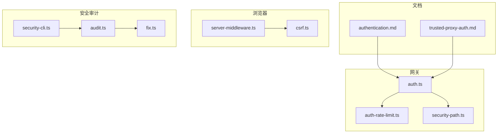
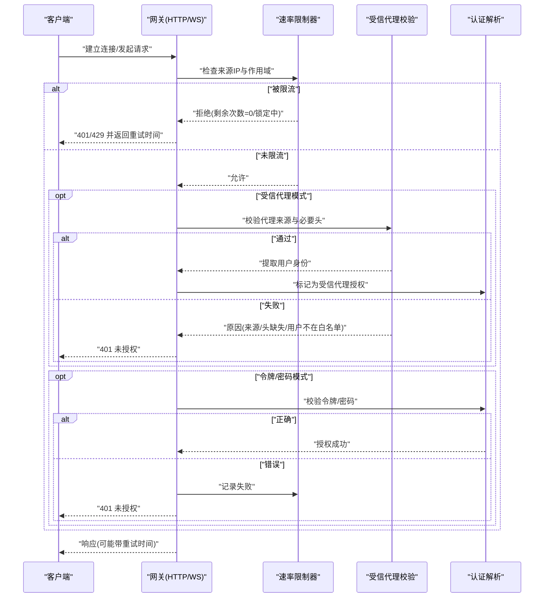
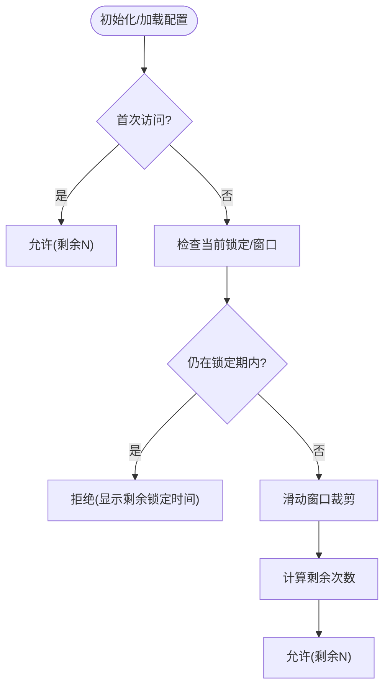
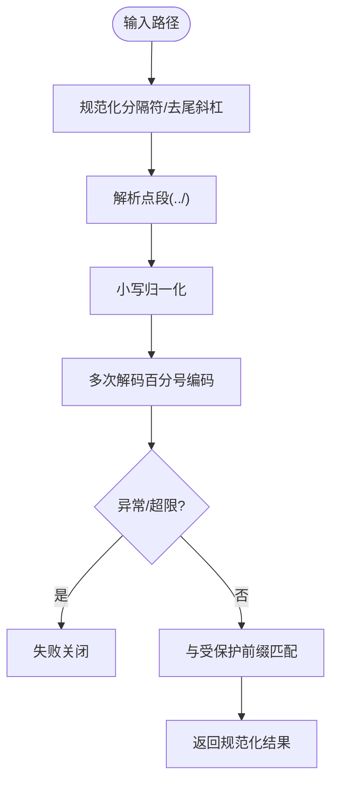
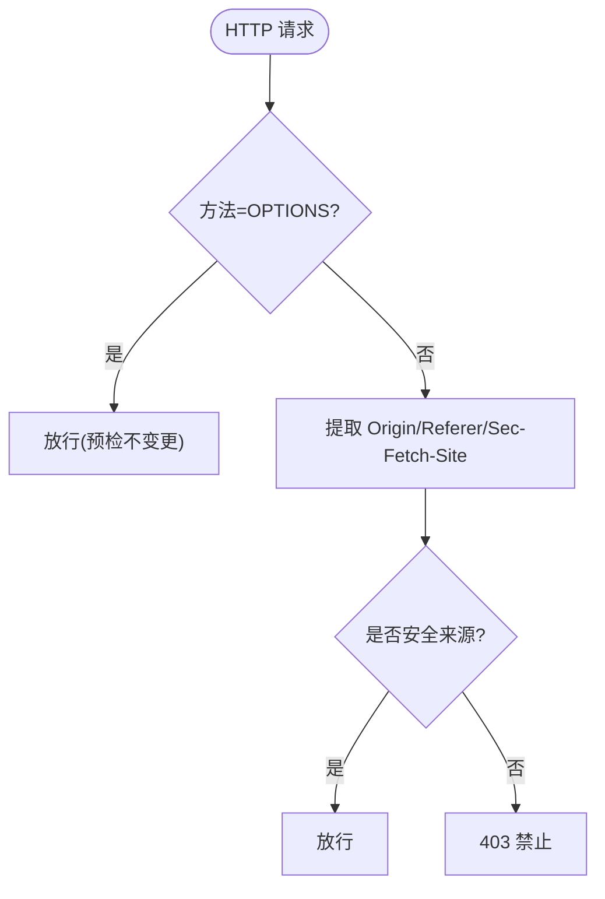
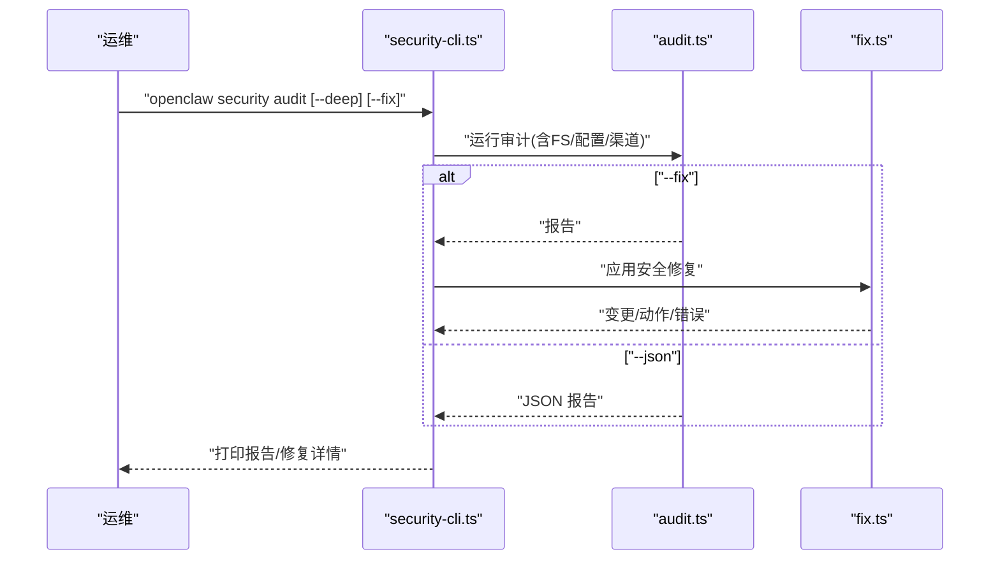
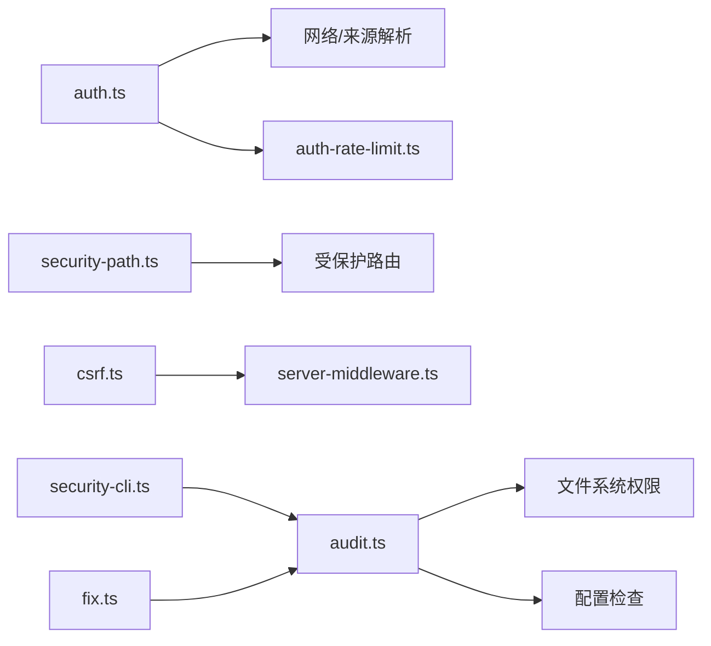

# 安全与认证

<cite>
**本文引用的文件**
- [SECURITY.md](file://SECURITY.md)
- [authentication.md](file://docs/gateway/authentication.md)
- [trusted-proxy-auth.md](file://docs/gateway/trusted-proxy-auth.md)
- [security-path.ts](file://src/gateway/security-path.ts)
- [auth.ts](file://src/gateway/auth.ts)
- [auth-rate-limit.ts](file://src/gateway/auth-rate-limit.ts)
- [audit.ts](file://src/security/audit.ts)
- [fix.ts](file://src/security/fix.ts)
- [security-cli.ts](file://src/cli/security-cli.ts)
- [csrf.ts](file://src/browser/csrf.ts)
- [server-middleware.ts](file://src/browser/server-middleware.ts)
</cite>

## 目录
1. [简介](#简介)
2. [项目结构](#项目结构)
3. [核心组件](#核心组件)
4. [架构总览](#架构总览)
5. [详细组件分析](#详细组件分析)
6. [依赖关系分析](#依赖关系分析)
7. [性能考量](#性能考量)
8. [故障排查指南](#故障排查指南)
9. [结论](#结论)
10. [附录](#附录)

## 简介
本文件面向 OpenClaw 网关的安全与认证体系，系统阐述认证机制（令牌管理、会话控制、权限验证）、连接认证流程（握手、身份验证、授权检查）、速率限制（请求频率控制、防滥用保护、配额管理）、跨域安全策略（CORS 配置、来源检查、CSRF 防护），并提供安全配置指南（TLS 设置、密钥管理、访问控制）、最佳实践、威胁缓解策略、安全审计与监控建议以及常见问题诊断。

## 项目结构
围绕“安全与认证”的关键目录与文件分布如下：
- 文档层：认证与代理认证文档，提供配置参考与部署建议
- 网关层：认证解析、速率限制、路径安全规范化
- 浏览器中间件：CSRF 与浏览器请求守卫
- 安全审计：本地配置与状态审计、自动修复工具



图表来源
- [authentication.md](file://docs/gateway/authentication.md)
- [trusted-proxy-auth.md](file://docs/gateway/trusted-proxy-auth.md)
- [auth.ts](file://src/gateway/auth.ts)
- [auth-rate-limit.ts](file://src/gateway/auth-rate-limit.ts)
- [security-path.ts](file://src/gateway/security-path.ts)
- [csrf.ts](file://src/browser/csrf.ts)
- [server-middleware.ts](file://src/browser/server-middleware.ts)
- [audit.ts](file://src/security/audit.ts)
- [fix.ts](file://src/security/fix.ts)
- [security-cli.ts](file://src/cli/security-cli.ts)

章节来源
- [SECURITY.md](file://SECURITY.md)
- [authentication.md](file://docs/gateway/authentication.md)
- [trusted-proxy-auth.md](file://docs/gateway/trusted-proxy-auth.md)

## 核心组件
- 认证解析与授权
  - 解析网关认证模式（令牌、密码、无认证、受信代理），校验配置，执行握手与授权
  - 支持 Tailscale 身份头与受信代理用户头提取
- 速率限制
  - 基于滑动窗口的内存级限流，按作用域（共享密钥、设备令牌等）独立计数，支持循环清理
- 路径安全规范化
  - 规范化路径分隔符、去除点段、解码百分号编码，检测异常以失败关闭
- 浏览器 CSRF 与来源检查
  - 基于 Origin/Referer/Sec-Fetch-Site 的变更类请求守卫
- 安全审计与修复
  - 本地配置与状态审计、自动修复（权限收紧、策略修正）

章节来源
- [auth.ts](file://src/gateway/auth.ts)
- [auth-rate-limit.ts](file://src/gateway/auth-rate-limit.ts)
- [security-path.ts](file://src/gateway/security-path.ts)
- [csrf.ts](file://src/browser/csrf.ts)
- [audit.ts](file://src/security/audit.ts)
- [fix.ts](file://src/security/fix.ts)
- [security-cli.ts](file://src/cli/security-cli.ts)

## 架构总览
下图展示从客户端到网关的认证与授权主路径，包括速率限制与受信代理模式：



图表来源
- [auth.ts](file://src/gateway/auth.ts)
- [auth-rate-limit.ts](file://src/gateway/auth-rate-limit.ts)

## 详细组件分析

### 组件一：认证解析与授权（auth.ts）
- 功能要点
  - 解析认证模式：none/token/password/trusted-proxy
  - 校验配置合法性（如受信代理必须提供 userHeader）
  - 受信代理：校验来源 IP、必要头、用户白名单
  - Tailscale：仅在 WS 控制界面启用，校验转发头与身份匹配
  - 速率限制：对共享密钥类凭据进行失败计数与锁定
  - 结果：返回授权结果与原因，必要时携带重试时间
- 关键流程
  - 选择认证模式 → 解析请求来源与头 → 执行对应授权分支 → 更新限流状态

```mermaid
flowchart TD
Start(["进入授权"]) --> Mode{"认证模式?"}
Mode --> |trusted-proxy| TP["校验代理来源/头/白名单"]
Mode --> |token/password| TC["校验凭据"]
Mode --> |none| Allow["直接放行"]
Mode --> |默认(token)或password| TC
TP --> TPRes{"通过?"}
TPRes --> |是| OK1["授权成功"]
TPRes --> |否| Err1["返回未授权/原因"]
TC --> Cred{"凭据正确?"}
Cred --> |是| OK2["授权成功"]
Cred --> |否| RL["记录失败"] --> Err2["返回未授权"]
Allow --> OK3["授权成功"]
```

图表来源
- [auth.ts](file://src/gateway/auth.ts)

章节来源
- [auth.ts](file://src/gateway/auth.ts)

### 组件二：速率限制（auth-rate-limit.ts）
- 设计特性
  - 滑动窗口计数，按 {作用域, 客户端IP} 维度独立计数
  - 默认豁免本地回环地址，避免本地调试被锁
  - 自动清理过期条目，防止内存膨胀
  - 提供检查、记录失败、重置、修剪、释放等接口
- 作用域
  - 共享密钥、设备令牌、钩子认证等，便于差异化治理
- 使用建议
  - 非 loopback 绑定时务必配置速率限制
  - 合理设置最大尝试次数、窗口与锁定时长



图表来源
- [auth-rate-limit.ts](file://src/gateway/auth-rate-limit.ts)

章节来源
- [auth-rate-limit.ts](file://src/gateway/auth-rate-limit.ts)

### 组件三：路径安全规范化（security-path.ts）
- 目标
  - 抵御路径遍历与编码绕过攻击，失败即关闭
- 处理步骤
  - 规范化分隔符与末尾斜杠
  - 解析点段（..）与大小写归一化
  - 多次解码百分号编码，检测异常与上限
  - 缓存前缀归一化结果，提升性能
- 使用场景
  - 受保护路由前缀匹配（如通道插件 API）



图表来源
- [security-path.ts](file://src/gateway/security-path.ts)

章节来源
- [security-path.ts](file://src/gateway/security-path.ts)

### 组件四：浏览器 CSRF 与来源检查（csrf.ts、server-middleware.ts）
- CSRF 防护
  - 对非 OPTIONS 的变更类请求，检查 Origin/Referer/Sec-Fetch-Site
  - 不满足条件时返回 403
- 中间件
  - 统一安装 JSON 限制与 CSRF 守卫
  - 可选安装浏览器认证中间件（令牌/密码）



图表来源
- [csrf.ts](file://src/browser/csrf.ts)
- [server-middleware.ts](file://src/browser/server-middleware.ts)

章节来源
- [csrf.ts](file://src/browser/csrf.ts)
- [server-middleware.ts](file://src/browser/server-middleware.ts)

### 组件五：安全审计与修复（audit.ts、fix.ts、security-cli.ts）
- 审计范围
  - 文件系统权限（状态目录、配置文件）
  - 网关绑定与认证配置（暴露风险、缺少认证、受信代理配置不当）
  - 控制界面来源白名单与 Host 头回退
  - 危险配置标志位
  - 浏览器控制端点认证
- 修复能力
  - 自动收紧权限（chmod 或 Windows ACL reset）
  - 写入推荐配置（如日志脱敏策略、频道组策略）
  - 将修复动作与错误汇总输出
- CLI
  - openclaw security audit [--deep] [--fix] [--json]
  - 输出分级报告与修复建议



图表来源
- [security-cli.ts](file://src/cli/security-cli.ts)
- [audit.ts](file://src/security/audit.ts)
- [fix.ts](file://src/security/fix.ts)

章节来源
- [audit.ts](file://src/security/audit.ts)
- [fix.ts](file://src/security/fix.ts)
- [security-cli.ts](file://src/cli/security-cli.ts)

## 依赖关系分析
- 认证模块依赖网络与速率限制模块，确保来源解析与失败计数一致
- 路径安全模块被受保护路由使用，作为前置安全检查
- 浏览器中间件依赖 CSRF 模块，统一拦截跨站变更请求
- 审计模块贯穿配置、文件系统与渠道安全，CLI 作为入口



图表来源
- [auth.ts](file://src/gateway/auth.ts)
- [auth-rate-limit.ts](file://src/gateway/auth-rate-limit.ts)
- [security-path.ts](file://src/gateway/security-path.ts)
- [csrf.ts](file://src/browser/csrf.ts)
- [server-middleware.ts](file://src/browser/server-middleware.ts)
- [audit.ts](file://src/security/audit.ts)
- [fix.ts](file://src/security/fix.ts)
- [security-cli.ts](file://src/cli/security-cli.ts)

章节来源
- [auth.ts](file://src/gateway/auth.ts)
- [auth-rate-limit.ts](file://src/gateway/auth-rate-limit.ts)
- [security-path.ts](file://src/gateway/security-path.ts)
- [csrf.ts](file://src/browser/csrf.ts)
- [server-middleware.ts](file://src/browser/server-middleware.ts)
- [audit.ts](file://src/security/audit.ts)
- [fix.ts](file://src/security/fix.ts)
- [security-cli.ts](file://src/cli/security-cli.ts)

## 性能考量
- 速率限制
  - 内存 Map 存储，定期清理；合理设置清理间隔与窗口大小
  - 本地回环豁免避免影响本地调试
- 路径规范化
  - 弱缓存前缀归一化结果，降低重复计算
- 审计
  - 深度探测可选，避免在生产环境频繁触发
- 浏览器中间件
  - 简单守卫逻辑，开销极低

## 故障排查指南
- 受信代理认证失败
  - 代理来源 IP 未加入 trustedProxies
  - 必要头缺失或为空
  - 用户头为空或不在 allowUsers 白名单
  - WebSocket 升级时未传递身份头
- 速率限制导致 401/429
  - 检查 maxAttempts/windowMs/lockoutMs 配置
  - 确认客户端 IP 解析与作用域
- 控制界面跨域问题
  - 非 loopback 绑定需配置 allowedOrigins
  - 避免使用 Host 头回退
- 路径异常与 404/403
  - 检查编码与点段绕过尝试
  - 确认受保护前缀配置
- 审计发现“缺少认证”或“权限宽松”
  - 运行 openclaw security audit --fix 自动收紧
  - 按照 remediation 建议逐项修正

章节来源
- [trusted-proxy-auth.md](file://docs/gateway/trusted-proxy-auth.md)
- [auth.ts](file://src/gateway/auth.ts)
- [auth-rate-limit.ts](file://src/gateway/auth-rate-limit.ts)
- [security-path.ts](file://src/gateway/security-path.ts)
- [audit.ts](file://src/security/audit.ts)

## 结论
OpenClaw 在网关侧提供了完善的认证与授权框架：支持多种认证模式、受信代理集成、速率限制与路径安全规范化，并辅以浏览器端 CSRF 防护与全面的安全审计与修复工具。遵循本文的安全配置与最佳实践，可在不同部署形态（本地、反向代理、容器、Tailscale）下实现稳健的安全边界。

## 附录

### 安全配置清单（摘要）
- 认证与访问控制
  - 非 loopback 绑定时启用令牌或密码认证
  - 受信代理模式：严格限定 trustedProxies、配置 userHeader 与可选 allowUsers
  - 控制界面：配置 allowedOrigins，禁用 Host 头回退
- 速率限制
  - 配置 gateway.auth.rateLimit（最大尝试、窗口、锁定时长）
  - 作用域区分（共享密钥/设备令牌/钩子）
- 跨域与 CSRF
  - 明确 allowedOrigins，避免通配符
  - 启用浏览器中间件的 CSRF 守卫
- TLS 与传输安全
  - 推荐在反向代理终止 TLS 并设置 HSTS
  - 网关直连 HTTPS 时开启安全头
- 审计与修复
  - 定期运行 openclaw security audit
  - 使用 --fix 自动收紧权限与策略

章节来源
- [trusted-proxy-auth.md](file://docs/gateway/trusted-proxy-auth.md)
- [authentication.md](file://docs/gateway/authentication.md)
- [audit.ts](file://src/security/audit.ts)
- [fix.ts](file://src/security/fix.ts)
- [security-cli.ts](file://src/cli/security-cli.ts)