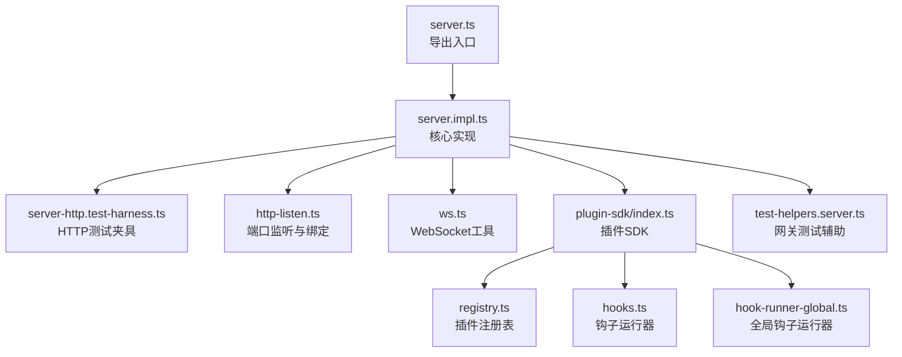
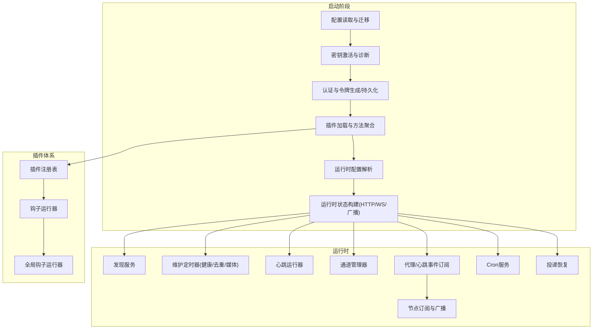
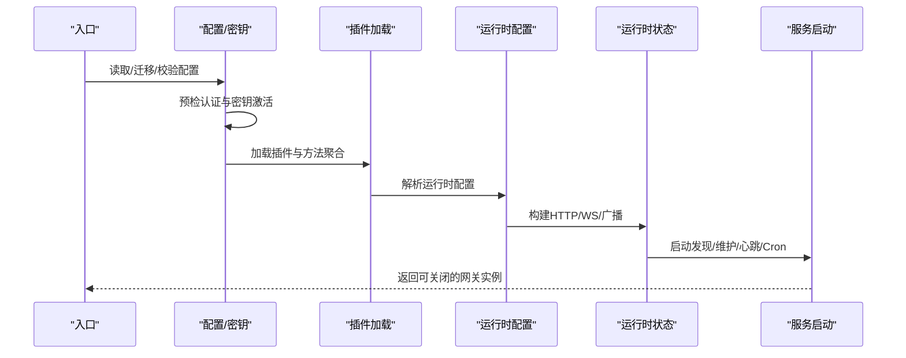
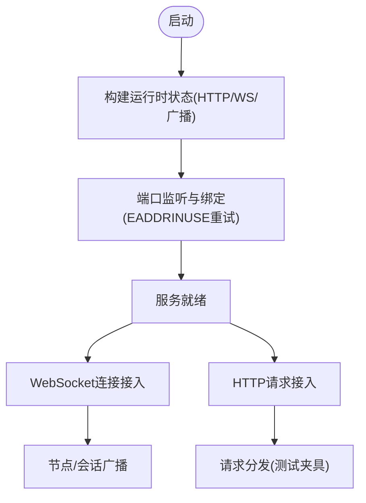
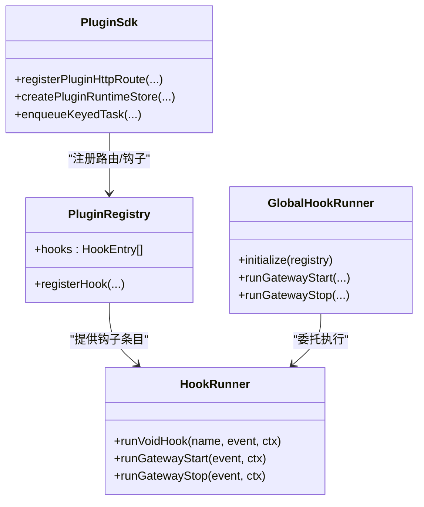
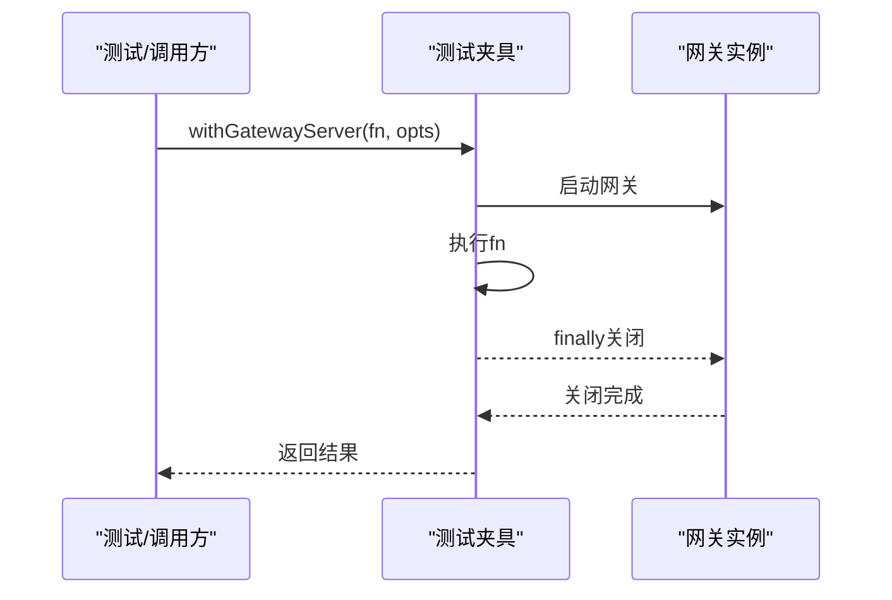
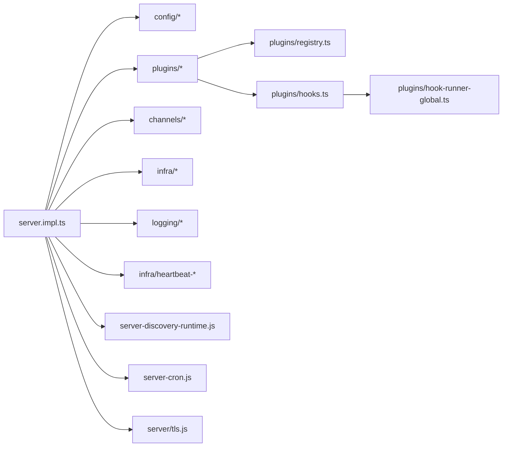

# 服务器架构

<cite>
**本文引用的文件**
- [server.impl.ts](file://src/gateway/server.impl.ts)
- [server.ts](file://src/gateway/server.ts)
- [server-http.test-harness.ts](file://src/gateway/server-http.test-harness.ts)
- [http-listen.ts](file://src/gateway/server/http-listen.ts)
- [ws.ts](file://src/infra/ws.ts)
- [plugin-sdk/index.ts](file://src/plugin-sdk/index.ts)
- [registry.ts](file://src/plugins/registry.ts)
- [hooks.ts](file://src/plugins/hooks.ts)
- [hook-runner-global.ts](file://src/plugins/hook-runner-global.ts)
- [test-helpers.server.ts](file://src/gateway/test-helpers.server.ts)
</cite>

## 目录
1. [简介](#简介)
2. [项目结构](#项目结构)
3. [核心组件](#核心组件)
4. [架构总览](#架构总览)
5. [组件详解](#组件详解)
6. [依赖关系分析](#依赖关系分析)
7. [性能与并发](#性能与并发)
8. [故障排查指南](#故障排查指南)
9. [结论](#结论)
10. [附录](#附录)

## 简介
本文件面向 OpenClaw 网关服务器，系统性阐述其整体架构设计、启动与初始化流程、运行时状态管理、WebSocket 连接与 HTTP 集成、插件系统与事件驱动机制、生命周期管理、状态存储与资源清理、性能与并发策略、错误恢复与诊断，以及配置示例与部署场景。目标是帮助开发者与运维人员快速理解并高效使用该网关。

## 项目结构
OpenClaw 网关位于 src/gateway 目录下，核心入口导出位于 server.ts，具体实现位于 server.impl.ts；同时包含 HTTP 测试夹具、端口监听与绑定逻辑等模块。插件体系由 plugin-sdk 暴露统一 API，插件注册与钩子运行由 registry 与 hooks 提供支持，全局钩子运行器在 hook-runner-global 中初始化。

**图示来源**
- [server.ts:1-4](file://src/gateway/server.ts#L1-L4)
- [server.impl.ts:1-120](file://src/gateway/server.impl.ts#L1-L120)
- [server-http.test-harness.ts:43-94](file://src/gateway/server-http.test-harness.ts#L43-L94)
- [http-listen.ts:25-61](file://src/gateway/server/http-listen.ts#L25-L61)
- [ws.ts:1-22](file://src/infra/ws.ts#L1-L22)
- [plugin-sdk/index.ts:1-120](file://src/plugin-sdk/index.ts#L1-L120)
- [registry.ts:241-288](file://src/plugins/registry.ts#L241-L288)
- [hooks.ts:184-224](file://src/plugins/hooks.ts#L184-L224)
- [hook-runner-global.ts:1-46](file://src/plugins/hook-runner-global.ts#L1-L46)
- [test-helpers.server.ts:320-423](file://src/gateway/test-helpers.server.ts#L320-L423)

**章节来源**
- [server.ts:1-4](file://src/gateway/server.ts#L1-L4)
- [server.impl.ts:1-120](file://src/gateway/server.impl.ts#L1-L120)

## 核心组件
- 启动与初始化
  - 读取并迁移配置、校验合法性、应用插件自动启用策略
  - 启动前预检认证与密钥，生成/持久化网关令牌
  - 初始化子代理注册、默认工作区、方法列表与插件加载
  - 解析运行时配置（绑定地址、端口、TLS、认证、HTTP端点开关等）
  - 构建运行时状态（HTTP/WebSocket 服务器、客户端集合、广播器等）
  - 启动发现服务、维护定时器、心跳、通道健康检查、技能缓存与远程二进制刷新
  - 订阅代理事件、心跳事件，建立节点订阅与语音唤醒广播
  - 启动 Cron 服务与投递恢复
- 运行时状态管理
  - 维护节点注册表、订阅管理、去重缓存、聊天运行状态与中止控制器
  - 健康快照与存在版本更新、媒体清理、聊天缓冲与增量发送时间
  - 执行审批管理器与转发器、密钥重载处理器
- 插件系统与事件驱动
  - 插件注册表与钩子运行器，支持 gateway_start/gateway_stop 等钩子
  - 全局钩子运行器在插件加载后初始化，可在任意位置调用
  - 插件 SDK 暴露运行时能力（通道、日志、状态目录等），统一 HTTP 路由注册
- 生命周期管理
  - 支持优雅关闭（可选原因与重启预期时间），测试辅助函数 withGatewayServer 与 createGatewaySuiteHarness 自动回收资源

**章节来源**
- [server.impl.ts:266-800](file://src/gateway/server.impl.ts#L266-L800)
- [plugin-sdk/index.ts:100-180](file://src/plugin-sdk/index.ts#L100-L180)
- [registry.ts:241-288](file://src/plugins/registry.ts#L241-L288)
- [hooks.ts:685-723](file://src/plugins/hooks.ts#L685-L723)
- [hook-runner-global.ts:32-46](file://src/plugins/hook-runner-global.ts#L32-L46)
- [test-helpers.server.ts:382-423](file://src/gateway/test-helpers.server.ts#L382-L423)

## 架构总览
下图展示网关启动与运行时关键组件的交互关系：配置加载与密钥激活、插件加载与方法聚合、运行时状态构建、服务启动与事件订阅、维护任务与健康监控、插件钩子与全局钩子运行器。

**图示来源**
- [server.impl.ts:284-800](file://src/gateway/server.impl.ts#L284-L800)
- [registry.ts:241-288](file://src/plugins/registry.ts#L241-L288)
- [hooks.ts:685-723](file://src/plugins/hooks.ts#L685-L723)
- [hook-runner-global.ts:32-46](file://src/plugins/hook-runner-global.ts#L32-L46)

## 组件详解

### 启动流程与初始化
- 配置与密钥
  - 读取配置快照，迁移旧配置并在需要时写回；校验配置合法性
  - 应用插件自动启用策略并持久化变更
  - 启动前预检：合并认证与 Tailscale 覆盖配置，准备密钥快照，必要时激活
  - 启动诊断心跳、重启策略设置、Control UI 允许来源种子
- 插件与方法
  - 初始化子代理注册，解析默认代理与工作区
  - 加载插件，聚合基础方法与通道方法，构建插件服务句柄
- 运行时配置与服务
  - 解析绑定主机、端口、HTTP 端点开关、TLS、认证与安全头
  - 创建认证速率限制器、Control UI 根路径与根状态
  - 构建运行时状态：HTTP/WS 服务器、客户端集合、广播器、聊天运行状态与缓冲、去重缓存、代理运行序列
  - 启动发现服务（Bonjour/Tailscale/mdns）、维护定时器、心跳、通道健康检查、Cron 与投递恢复
  - 订阅代理事件与心跳事件，建立节点订阅与语音唤醒广播
- 完整启动后，返回可关闭的网关实例

**图示来源**
- [server.impl.ts:284-800](file://src/gateway/server.impl.ts#L284-L800)

**章节来源**
- [server.impl.ts:266-800](file://src/gateway/server.impl.ts#L266-L800)

### WebSocket 连接管理与 HTTP 集成
- 连接管理
  - 运行时状态包含 WebSocket 服务器、客户端集合、广播器与按连接 ID 广播器
  - 节点注册表负责节点事件发送，节点订阅管理器负责会话级订阅与广播
  - 聊天运行状态、缓冲与增量发送时间用于流式消息与去重
- HTTP 集成
  - HTTP 服务器与多绑定主机支持，严格传输安全头、Control UI 根路径与覆盖
  - 测试夹具提供请求分发与临时配置封装，便于端到端测试
- 端口监听与绑定
  - 端口占用重试与错误分类，TIME_WAIT 处理，异常时抛出网关锁错误

**图示来源**
- [server.impl.ts:582-626](file://src/gateway/server.impl.ts#L582-L626)
- [server-http.test-harness.ts:76-83](file://src/gateway/server-http.test-harness.ts#L76-L83)
- [http-listen.ts:25-61](file://src/gateway/server/http-listen.ts#L25-L61)

**章节来源**
- [server.impl.ts:582-626](file://src/gateway/server.impl.ts#L582-L626)
- [server-http.test-harness.ts:43-94](file://src/gateway/server-http.test-harness.ts#L43-L94)
- [http-listen.ts:25-61](file://src/gateway/server/http-listen.ts#L25-L61)

### 插件系统架构与事件驱动
- 插件注册与钩子
  - 注册表记录插件钩子条目，支持内部钩子注册与事件类型标准化
  - 钩子运行器以并行方式执行无返回值钩子，支持错误捕获与日志
  - 提供 gateway_start 与 gateway_stop 钩子，用于插件在网关生命周期中的扩展
- 全局钩子运行器
  - 在插件加载完成后初始化，提供跨模块一致的钩子调用入口
- 插件 SDK
  - 暴露通道适配、日志、状态目录、HTTP 路由注册、Webhook 目标解析等统一能力

**图示来源**
- [registry.ts:241-288](file://src/plugins/registry.ts#L241-L288)
- [hooks.ts:685-723](file://src/plugins/hooks.ts#L685-L723)
- [hook-runner-global.ts:32-46](file://src/plugins/hook-runner-global.ts#L32-L46)
- [plugin-sdk/index.ts:125-175](file://src/plugin-sdk/index.ts#L125-L175)

**章节来源**
- [registry.ts:241-288](file://src/plugins/registry.ts#L241-L288)
- [hooks.ts:184-224](file://src/plugins/hooks.ts#L184-L224)
- [hooks.ts:685-723](file://src/plugins/hooks.ts#L685-L723)
- [hook-runner-global.ts:32-46](file://src/plugins/hook-runner-global.ts#L32-L46)
- [plugin-sdk/index.ts:100-180](file://src/plugin-sdk/index.ts#L100-L180)

### 生命周期管理与资源清理
- 关闭流程
  - 支持带原因与重启预期时间的优雅关闭
  - 测试辅助 withGatewayServer 与 createGatewaySuiteHarness 在 finally 中自动关闭服务器
- 资源清理
  - 维护定时器、心跳、通道健康检查、Cron 与投递恢复均在关闭时停止
  - 节点订阅与广播器在关闭时释放

**图示来源**
- [test-helpers.server.ts:382-395](file://src/gateway/test-helpers.server.ts#L382-L395)
- [server.impl.ts:211-213](file://src/gateway/server.impl.ts#L211-L213)

**章节来源**
- [test-helpers.server.ts:382-395](file://src/gateway/test-helpers.server.ts#L382-L395)
- [server.impl.ts:211-213](file://src/gateway/server.impl.ts#L211-L213)

### 状态存储、内存管理与资源清理机制
- 状态存储
  - 健康快照与存在版本、聊天运行状态与缓冲、增量发送时间戳、去重缓存
  - 节点注册表与订阅管理器，支持按会话与全局广播
- 内存管理
  - 媒体 TTL 清理（小时数约束与毫秒换算）、聊天中止控制器、队列大小与待回复计数
- 资源清理
  - 维护定时器（健康/去重/媒体）、心跳运行器、通道健康监控、Cron 与投递恢复
  - 关闭时停止上述任务并释放资源

**章节来源**
- [server.impl.ts:706-725](file://src/gateway/server.impl.ts#L706-L725)
- [server.impl.ts:125-132](file://src/gateway/server.impl.ts#L125-L132)

## 依赖关系分析
- 组件耦合
  - server.impl.ts 是核心枢纽，依赖配置、插件、通道、日志、心跳、诊断、TLS、发现、Cron 等子系统
  - 插件体系通过 registry 与 hooks 解耦，全局钩子运行器提供统一入口
- 外部依赖
  - Node.js 内置模块（如 path、Buffer）、第三方库（如 ws）与本地子系统（channels、agents、infra 等）

**图示来源**
- [server.impl.ts:1-120](file://src/gateway/server.impl.ts#L1-L120)
- [registry.ts:241-288](file://src/plugins/registry.ts#L241-L288)
- [hooks.ts:685-723](file://src/plugins/hooks.ts#L685-L723)
- [hook-runner-global.ts:32-46](file://src/plugins/hook-runner-global.ts#L32-L46)

**章节来源**
- [server.impl.ts:1-120](file://src/gateway/server.impl.ts#L1-L120)

## 性能与并发
- 并发模式
  - 钩子运行器并行执行无返回值钩子，提升插件扩展性能
  - WebSocket/HTTP 并发接入，客户端集合与广播器支持高并发消息分发
- 性能优化
  - 去重缓存与媒体 TTL 清理降低重复处理与磁盘压力
  - 技能变更去抖（30 秒延迟）避免频繁探测与反馈循环
  - 心跳与健康监控定时器按需启动，减少空转开销
- 资源控制
  - 认证速率限制器（浏览器与非浏览器区分）防止滥用
  - 严格传输安全头与受信代理配置增强安全性

**章节来源**
- [hooks.ts:200-224](file://src/plugins/hooks.ts#L200-L224)
- [server.impl.ts:684-698](file://src/gateway/server.impl.ts#L684-L698)
- [server.impl.ts:706-725](file://src/gateway/server.impl.ts#L706-L725)
- [server.impl.ts:517-519](file://src/gateway/server.impl.ts#L517-L519)

## 故障排查指南
- 启动失败
  - 配置无效：检查 doctor 输出与格式化问题行；修正后重试
  - 密钥不可用：查看密钥重载降级/恢复事件与警告；修复后重试
  - 端口占用：监听器对 EADDRINUSE 进行重试与 TIME_WAIT 处理；确认端口可用
- 运行时异常
  - 插件钩子错误：钩子运行器捕获并记录错误；检查插件实现
  - 投递恢复：崩溃后自动恢复未完成投递；关注日志中的恢复失败
- 诊断与可观测性
  - 启用诊断心跳与诊断事件；通过诊断事件流定位问题

**章节来源**
- [server.impl.ts:308-317](file://src/gateway/server.impl.ts#L308-L317)
- [server.impl.ts:353-397](file://src/gateway/server.impl.ts#L353-L397)
- [http-listen.ts:42-59](file://src/gateway/server/http-listen.ts#L42-L59)
- [hooks.ts:184-197](file://src/plugins/hooks.ts#L184-L197)
- [server.impl.ts:768-780](file://src/gateway/server.impl.ts#L768-L780)

## 结论
OpenClaw 网关采用模块化与事件驱动的设计，通过严格的启动预检、灵活的插件体系与完善的运行时状态管理，实现了高性能、可扩展且易于维护的网关服务。结合测试夹具与诊断能力，能够满足从开发到生产的多种部署场景。

## 附录

### 配置示例与部署场景
- 基本部署
  - 使用默认端口与绑定策略，启用所需 HTTP 端点与 Control UI
  - 配置认证与 Tailscale 暴露，确保受信代理与安全头设置
- 开发调试
  - 使用测试夹具 withGatewayServer 或 createGatewaySuiteHarness 快速启动与关闭
  - 启用诊断心跳与详细日志，观察钩子与事件流
- 生产环境
  - 设置媒体 TTL、速率限制与健康检查周期
  - 启用 Cron 与投递恢复，确保消息可靠性
  - 使用 TLS 与严格传输安全头，结合受信代理策略

**章节来源**
- [server.impl.ts:488-512](file://src/gateway/server.impl.ts#L488-L512)
- [test-helpers.server.ts:382-423](file://src/gateway/test-helpers.server.ts#L382-L423)
- [server.impl.ts:764-780](file://src/gateway/server.impl.ts#L764-L780)