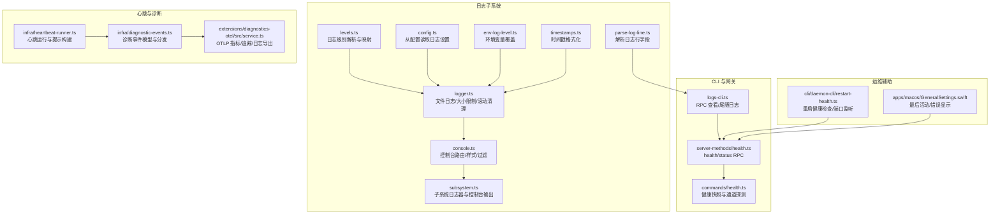
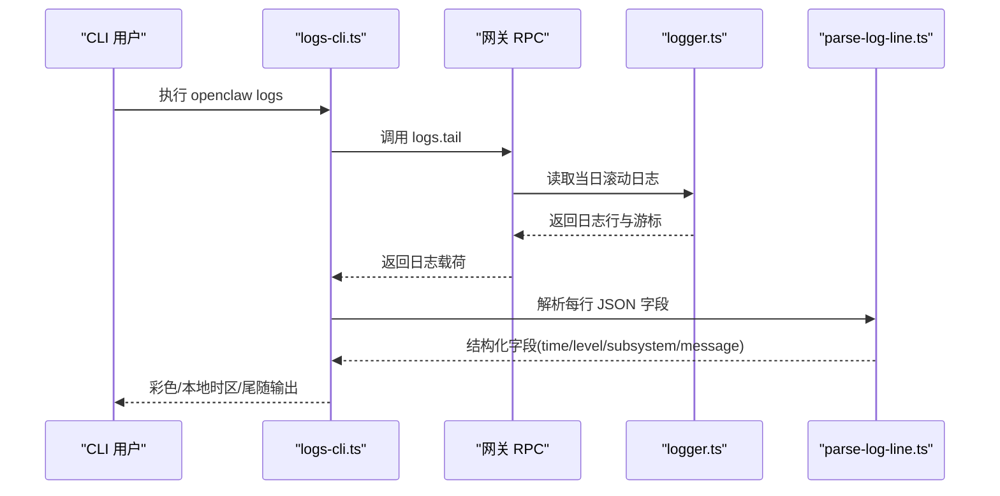
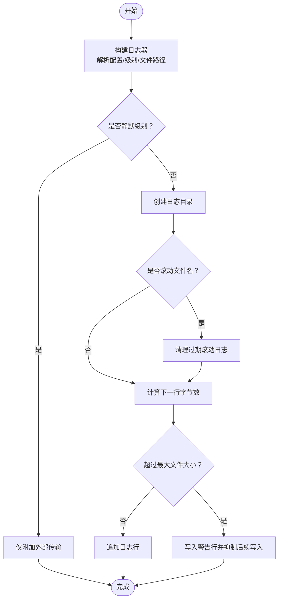
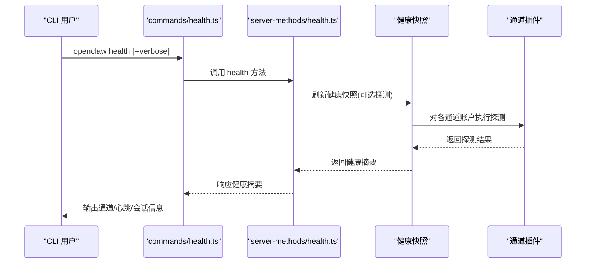
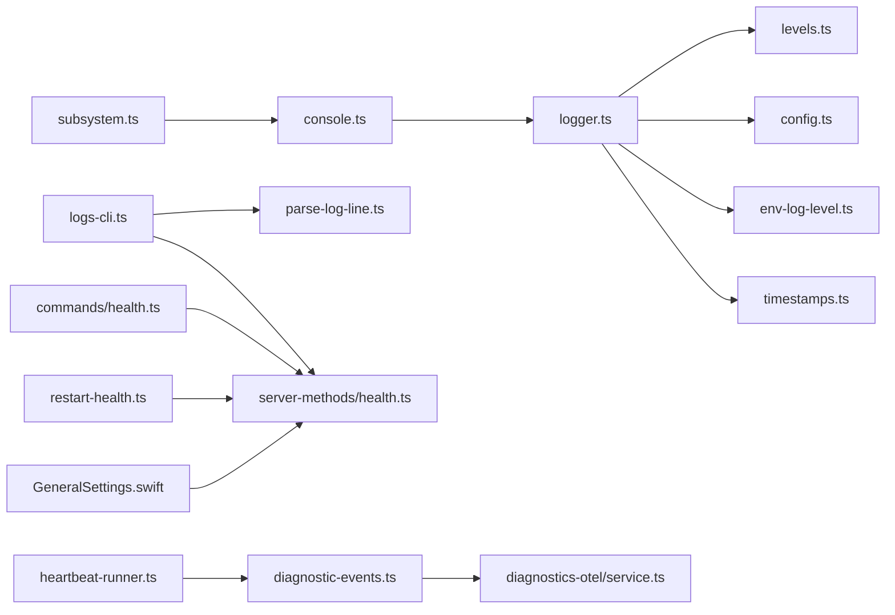

# 监控与日志

<cite>
**本文引用的文件**
- [src/logging/logger.ts](file://src/logging/logger.ts)
- [src/logging/console.ts](file://src/logging/console.ts)
- [src/logging/levels.ts](file://src/logging/levels.ts)
- [src/logging/config.ts](file://src/logging/config.ts)
- [src/logging/env-log-level.ts](file://src/logging/env-log-level.ts)
- [src/logging/timestamps.ts](file://src/logging/timestamps.ts)
- [src/logging/parse-log-line.ts](file://src/logging/parse-log-line.ts)
- [src/logging/subsystem.ts](file://src/logging/subsystem.ts)
- [src/cli/logs-cli.ts](file://src/cli/logs-cli.ts)
- [src/commands/health.ts](file://src/commands/health.ts)
- [src/gateway/server-methods/health.ts](file://src/gateway/server-methods/health.ts)
- [src/infra/heartbeat-runner.ts](file://src/infra/heartbeat-runner.ts)
- [docs/gateway/heartbeat.md](file://docs/gateway/heartbeat.md)
- [docs/automation/cron-vs-heartbeat.md](file://docs/automation/cron-vs-heartbeat.md)
- [src/infra/diagnostic-events.ts](file://src/infra/diagnostic-events.ts)
- [extensions/diagnostics-otel/src/service.ts](file://extensions/diagnostics-otel/src/service.ts)
- [src/cli/daemon-cli/restart-health.ts](file://src/cli/daemon-cli/restart-health.ts)
- [apps/macos/Sources/OpenClaw/GeneralSettings.swift](file://apps/macos/Sources/OpenClaw/GeneralSettings.swift)
</cite>

## 目录
1. [简介](#简介)
2. [项目结构](#项目结构)
3. [核心组件](#核心组件)
4. [架构总览](#架构总览)
5. [详细组件分析](#详细组件分析)
6. [依赖关系分析](#依赖关系分析)
7. [性能考量](#性能考量)
8. [故障排除指南](#故障排除指南)
9. [结论](#结论)
10. [附录](#附录)

## 简介
本文件面向 OpenClaw 网关的运维与开发团队，系统化阐述监控与日志体系：包括监控指标设计与采集机制（性能、健康状态、资源使用）、日志系统架构（日志级别、格式规范、输出目标）、健康检查机制（服务状态监控、故障检测与自动恢复）、诊断事件系统（调试信息收集、性能分析与问题定位）、监控仪表板配置指南（关键指标、告警规则与通知机制），以及日志轮转、存储管理与检索优化策略，并提供故障排除工具与调试技巧。

## 项目结构
围绕监控与日志的关键目录与文件：
- 日志子系统：logger、console、levels、config、env-log-level、timestamps、parse-log-line、subsystem
- CLI 日志查看：logs-cli
- 健康检查：commands/health、gateway/server-methods/health
- 心跳与周期性检查：infra/heartbeat-runner、docs/gateway/heartbeat.md、docs/automation/cron-vs-heartbeat.md
- 诊断事件与可观测性导出：infra/diagnostic-events、extensions/diagnostics-otel/src/service.ts
- 运维辅助：cli/daemon-cli/restart-health、apps/macos/Sources/OpenClaw/GeneralSettings.swift

图表来源
- [src/logging/logger.ts:1-348](file://src/logging/logger.ts#L1-L348)
- [src/logging/console.ts:1-327](file://src/logging/console.ts#L1-L327)
- [src/logging/levels.ts:1-37](file://src/logging/levels.ts#L1-L37)
- [src/logging/config.ts:1-25](file://src/logging/config.ts#L1-L25)
- [src/logging/env-log-level.ts:1-24](file://src/logging/env-log-level.ts#L1-L24)
- [src/logging/timestamps.ts:1-37](file://src/logging/timestamps.ts#L1-L37)
- [src/logging/parse-log-line.ts:1-64](file://src/logging/parse-log-line.ts#L1-L64)
- [src/logging/subsystem.ts:1-235](file://src/logging/subsystem.ts#L1-L235)
- [src/cli/logs-cli.ts:1-330](file://src/cli/logs-cli.ts#L1-L330)
- [src/gateway/server-methods/health.ts:1-38](file://src/gateway/server-methods/health.ts#L1-L38)
- [src/commands/health.ts:1-752](file://src/commands/health.ts#L1-L752)
- [src/infra/heartbeat-runner.ts:1-800](file://src/infra/heartbeat-runner.ts#L1-L800)
- [src/infra/diagnostic-events.ts:1-243](file://src/infra/diagnostic-events.ts#L1-L243)
- [extensions/diagnostics-otel/src/service.ts:1-686](file://extensions/diagnostics-otel/src/service.ts#L1-L686)
- [src/cli/daemon-cli/restart-health.ts:96-230](file://src/cli/daemon-cli/restart-health.ts#L96-L230)
- [apps/macos/Sources/OpenClaw/GeneralSettings.swift:482-497](file://apps/macos/Sources/OpenClaw/GeneralSettings.swift#L482-L497)

章节来源
- [src/logging/logger.ts:1-348](file://src/logging/logger.ts#L1-L348)
- [src/logging/console.ts:1-327](file://src/logging/console.ts#L1-L327)
- [src/cli/logs-cli.ts:1-330](file://src/cli/logs-cli.ts#L1-L330)
- [src/commands/health.ts:1-752](file://src/commands/health.ts#L1-L752)
- [src/gateway/server-methods/health.ts:1-38](file://src/gateway/server-methods/health.ts#L1-L38)
- [src/infra/heartbeat-runner.ts:1-800](file://src/infra/heartbeat-runner.ts#L1-L800)
- [src/infra/diagnostic-events.ts:1-243](file://src/infra/diagnostic-events.ts#L1-L243)
- [extensions/diagnostics-otel/src/service.ts:1-686](file://extensions/diagnostics-otel/src/service.ts#L1-L686)
- [src/cli/daemon-cli/restart-health.ts:96-230](file://src/cli/daemon-cli/restart-health.ts#L96-L230)
- [apps/macos/Sources/OpenClaw/GeneralSettings.swift:482-497](file://apps/macos/Sources/OpenClaw/GeneralSettings.swift#L482-L497)

## 核心组件
- 日志记录器与传输
  - 文件日志：按日期滚动、大小上限、过期清理；支持外部传输注册，避免阻塞。
  - 控制台路由：统一写入 stderr，支持样式、时间戳前缀、子系统过滤、抑制噪声。
  - 子系统日志器：按模块/子系统命名、可降级最小级别、父子 logger 绑定。
- 日志级别与解析：允许级别集合、标准化与数值映射，支持环境变量覆盖。
- 配置与环境：从配置文件读取日志设置，支持测试快速路径与静默模式。
- CLI 日志查看：通过 RPC 获取网关文件日志，支持尾随、颜色、本地时区、JSON 输出。
- 健康检查：RPC 提供健康快照，包含通道连接、账户探测、心跳间隔、会话统计等。
- 诊断事件与导出：统一事件模型，OTLP 导出指标、追踪与日志，支持敏感信息脱敏。
- 运维辅助：重启健康检查（端口监听、进程状态）、macOS UI 展示健康状态。

章节来源
- [src/logging/logger.ts:1-348](file://src/logging/logger.ts#L1-L348)
- [src/logging/console.ts:1-327](file://src/logging/console.ts#L1-L327)
- [src/logging/subsystem.ts:1-235](file://src/logging/subsystem.ts#L1-L235)
- [src/logging/levels.ts:1-37](file://src/logging/levels.ts#L1-L37)
- [src/logging/config.ts:1-25](file://src/logging/config.ts#L1-L25)
- [src/logging/env-log-level.ts:1-24](file://src/logging/env-log-level.ts#L1-L24)
- [src/cli/logs-cli.ts:1-330](file://src/cli/logs-cli.ts#L1-L330)
- [src/commands/health.ts:1-752](file://src/commands/health.ts#L1-L752)
- [src/gateway/server-methods/health.ts:1-38](file://src/gateway/server-methods/health.ts#L1-L38)
- [src/infra/diagnostic-events.ts:1-243](file://src/infra/diagnostic-events.ts#L1-L243)
- [extensions/diagnostics-otel/src/service.ts:1-686](file://extensions/diagnostics-otel/src/service.ts#L1-L686)
- [src/cli/daemon-cli/restart-health.ts:96-230](file://src/cli/daemon-cli/restart-health.ts#L96-L230)
- [apps/macos/Sources/OpenClaw/GeneralSettings.swift:482-497](file://apps/macos/Sources/OpenClaw/GeneralSettings.swift#L482-L497)

## 架构总览
OpenClaw 的监控与日志由“日志子系统”“健康检查 RPC”“心跳与诊断事件”“OTLP 导出扩展”四部分协同构成。日志子系统负责结构化日志生成与输出；健康检查提供服务状态视图；心跳驱动周期性任务并产出诊断事件；OTLP 扩展将事件转换为指标、追踪与日志，便于集中观测。

图表来源
- [src/cli/logs-cli.ts:1-330](file://src/cli/logs-cli.ts#L1-L330)
- [src/logging/logger.ts:1-348](file://src/logging/logger.ts#L1-L348)
- [src/logging/parse-log-line.ts:1-64](file://src/logging/parse-log-line.ts#L1-L64)

章节来源
- [src/cli/logs-cli.ts:1-330](file://src/cli/logs-cli.ts#L1-L330)
- [src/logging/logger.ts:1-348](file://src/logging/logger.ts#L1-L348)
- [src/logging/parse-log-line.ts:1-64](file://src/logging/parse-log-line.ts#L1-L64)

## 详细组件分析

### 日志系统架构与数据流
- 结构化日志：所有日志以 JSON 行输出，包含时间、级别、子系统/模块、消息与原始行，便于解析与检索。
- 文件日志：默认滚动到“openclaw-YYYY-MM-DD.log”，最大文件大小默认 500MB；超过阈值时写入警告并抑制后续写入，避免磁盘打满。
- 外部传输：支持注册外部传输函数，不阻塞主流程；OTLP 扩展通过该机制将日志转为 OTLP 日志记录。
- 控制台路由：所有 console.* 输出被重定向到文件日志，同时保留 stdout/stderr 输出；支持时间戳前缀、样式与子系统过滤。
- 子系统日志器：按 subsystem/module 命名，支持最小级别控制与父子绑定，便于模块化治理。

图表来源
- [src/logging/logger.ts:126-184](file://src/logging/logger.ts#L126-L184)
- [src/logging/logger.ts:323-347](file://src/logging/logger.ts#L323-L347)

章节来源
- [src/logging/logger.ts:1-348](file://src/logging/logger.ts#L1-L348)
- [src/logging/console.ts:1-327](file://src/logging/console.ts#L1-L327)
- [src/logging/subsystem.ts:1-235](file://src/logging/subsystem.ts#L1-L235)
- [src/logging/parse-log-line.ts:1-64](file://src/logging/parse-log-line.ts#L1-L64)

### 日志级别、格式与输出目标
- 允许级别：silent/fatal/error/warn/info/debug/trace，映射为内部数值，支持环境变量覆盖。
- 格式规范：JSON 行，字段 time、level、subsystem/module、message/raw；CLI 可解析并着色展示。
- 输出目标：文件（滚动/大小限制/过期清理）与控制台（stderr），支持本地时区显示与紧凑/美化样式。

章节来源
- [src/logging/levels.ts:1-37](file://src/logging/levels.ts#L1-L37)
- [src/logging/env-log-level.ts:1-24](file://src/logging/env-log-level.ts#L1-L24)
- [src/logging/timestamps.ts:1-37](file://src/logging/timestamps.ts#L1-L37)
- [src/logging/parse-log-line.ts:1-64](file://src/logging/parse-log-line.ts#L1-L64)
- [src/cli/logs-cli.ts:64-132](file://src/cli/logs-cli.ts#L64-L132)

### 健康检查机制
- RPC 接口：health/status，支持缓存刷新与后台刷新；status 包含敏感信息需管理员权限范围。
- 健康快照：聚合通道连接状态、账户探测结果、心跳间隔、会话存储路径与最近会话。
- 通道探测：对每个插件列出账户，解析默认/首选账户，执行探测并汇总状态行。
- UI 展示：CLI 输出美化状态行；macOS UI 显示最后活动与错误信息。

图表来源
- [src/commands/health.ts:348-523](file://src/commands/health.ts#L348-L523)
- [src/gateway/server-methods/health.ts:10-37](file://src/gateway/server-methods/health.ts#L10-L37)

章节来源
- [src/commands/health.ts:1-752](file://src/commands/health.ts#L1-L752)
- [src/gateway/server-methods/health.ts:1-38](file://src/gateway/server-methods/health.ts#L1-L38)
- [apps/macos/Sources/OpenClaw/GeneralSettings.swift:482-497](file://apps/macos/Sources/OpenClaw/GeneralSettings.swift#L482-L497)

### 诊断事件系统与可观测性导出
- 事件模型：统一的诊断事件类型，如模型用量、Webhook 收发处理、消息队列、会话状态/卡顿、心跳队列深度、工具循环检测等。
- 分发机制：全局状态维护序列号、监听者集合与递归保护，事件去重与失败忽略。
- OTLP 导出：指标计数/直方图（令牌、成本、时延、上下文、队列深度/等待、会话卡顿时长、尝试次数）；追踪记录错误与原因；日志记录带属性与脱敏。

```mermaid
classDiagram
class DiagnosticEventPayload {
+type
+ts
+seq
}
class DiagnosticUsageEvent
class DiagnosticWebhookReceivedEvent
class DiagnosticWebhookProcessedEvent
class DiagnosticWebhookErrorEvent
class DiagnosticMessageQueuedEvent
class DiagnosticMessageProcessedEvent
class DiagnosticSessionStateEvent
class DiagnosticSessionStuckEvent
class DiagnosticLaneEnqueueEvent
class DiagnosticLaneDequeueEvent
class DiagnosticRunAttemptEvent
class DiagnosticHeartbeatEvent
class DiagnosticToolLoopEvent
DiagnosticEventPayload <|-- DiagnosticUsageEvent
DiagnosticEventPayload <|-- DiagnosticWebhookReceivedEvent
DiagnosticEventPayload <|-- DiagnosticWebhookProcessedEvent
DiagnosticEventPayload <|-- DiagnosticWebhookErrorEvent
DiagnosticEventPayload <|-- DiagnosticMessageQueuedEvent
DiagnosticEventPayload <|-- DiagnosticMessageProcessedEvent
DiagnosticEventPayload <|-- DiagnosticSessionStateEvent
DiagnosticEventPayload <|-- DiagnosticSessionStuckEvent
DiagnosticEventPayload <|-- DiagnosticLaneEnqueueEvent
DiagnosticEventPayload <|-- DiagnosticLaneDequeueEvent
DiagnosticEventPayload <|-- DiagnosticRunAttemptEvent
DiagnosticEventPayload <|-- DiagnosticHeartbeatEvent
DiagnosticEventPayload <|-- DiagnosticToolLoopEvent
```

图表来源
- [src/infra/diagnostic-events.ts:150-163](file://src/infra/diagnostic-events.ts#L150-L163)

章节来源
- [src/infra/diagnostic-events.ts:1-243](file://src/infra/diagnostic-events.ts#L1-L243)
- [extensions/diagnostics-otel/src/service.ts:1-686](file://extensions/diagnostics-otel/src/service.ts#L1-L686)

### 心跳与周期性检查
- 心跳配置：支持 per-agent/per-channel 的间隔、目标、响应前缀、静默/告警指示器开关。
- 运行逻辑：在活跃时段、无飞行中请求时触发；根据事件队列与配置决定是否发送“心跳 OK”；可裁剪空回复对话以减少上下文污染。
- 文档参考：心跳行为、默认行为、通道覆盖与常见模式；与 Cron 的对比与优势。

章节来源
- [src/infra/heartbeat-runner.ts:608-800](file://src/infra/heartbeat-runner.ts#L608-L800)
- [docs/gateway/heartbeat.md:277-313](file://docs/gateway/heartbeat.md#L277-L313)
- [docs/automation/cron-vs-heartbeat.md:29-71](file://docs/automation/cron-vs-heartbeat.md#L29-L71)

### 运维辅助：重启健康检查与 UI 展示
- 重启健康检查：扫描端口占用、监听者状态、旧进程 PID，支持多次轮询与超时，返回健康快照。
- macOS UI：展示最后活动、最后检查时间与错误信息，便于本地诊断。

章节来源
- [src/cli/daemon-cli/restart-health.ts:96-230](file://src/cli/daemon-cli/restart-health.ts#L96-L230)
- [apps/macos/Sources/OpenClaw/GeneralSettings.swift:482-497](file://apps/macos/Sources/OpenClaw/GeneralSettings.swift#L482-L497)

## 依赖关系分析
- 日志子系统依赖：配置解析、环境变量、时间戳格式化、级别映射、状态缓存。
- CLI 日志查看依赖：RPC 客户端、日志解析、主题与颜色、安全输出写入器。
- 健康检查依赖：通道插件接口、会话存储、心跳摘要解析。
- 诊断事件依赖：全局状态、事件类型与属性、OTLP 导出器。
- 运维辅助依赖：进程/端口扫描、UI 组件。

图表来源
- [src/logging/logger.ts:1-348](file://src/logging/logger.ts#L1-L348)
- [src/logging/levels.ts:1-37](file://src/logging/levels.ts#L1-L37)
- [src/logging/config.ts:1-25](file://src/logging/config.ts#L1-L25)
- [src/logging/env-log-level.ts:1-24](file://src/logging/env-log-level.ts#L1-L24)
- [src/logging/timestamps.ts:1-37](file://src/logging/timestamps.ts#L1-L37)
- [src/logging/console.ts:1-327](file://src/logging/console.ts#L1-L327)
- [src/logging/subsystem.ts:1-235](file://src/logging/subsystem.ts#L1-L235)
- [src/logging/parse-log-line.ts:1-64](file://src/logging/parse-log-line.ts#L1-L64)
- [src/cli/logs-cli.ts:1-330](file://src/cli/logs-cli.ts#L1-L330)
- [src/gateway/server-methods/health.ts:1-38](file://src/gateway/server-methods/health.ts#L1-L38)
- [src/commands/health.ts:1-752](file://src/commands/health.ts#L1-L752)
- [src/infra/heartbeat-runner.ts:1-800](file://src/infra/heartbeat-runner.ts#L1-L800)
- [src/infra/diagnostic-events.ts:1-243](file://src/infra/diagnostic-events.ts#L1-L243)
- [extensions/diagnostics-otel/src/service.ts:1-686](file://extensions/diagnostics-otel/src/service.ts#L1-L686)
- [src/cli/daemon-cli/restart-health.ts:96-230](file://src/cli/daemon-cli/restart-health.ts#L96-L230)
- [apps/macos/Sources/OpenClaw/GeneralSettings.swift:482-497](file://apps/macos/Sources/OpenClaw/GeneralSettings.swift#L482-L497)

章节来源
- 同上

## 性能考量
- 日志写入非阻塞：外部传输与文件写入均在异常时吞掉错误，避免影响业务。
- 测试优化：测试环境默认静默文件日志与紧凑控制台，减少启动与 IO 开销。
- 滚动与清理：按天滚动与 24 小时过期清理，降低单文件体积与磁盘压力。
- 控制台抑制：对高频/低价值消息进行抑制，减少噪声与渲染开销。
- 心跳节流：在队列有请求或非活跃时段跳过心跳，避免资源竞争。

章节来源
- [src/logging/logger.ts:149-178](file://src/logging/logger.ts#L149-L178)
- [src/logging/console.ts:148-162](file://src/logging/console.ts#L148-L162)
- [src/infra/heartbeat-runner.ts:634-642](file://src/infra/heartbeat-runner.ts#L634-L642)

## 故障排除指南
- 无法访问网关日志
  - 使用 CLI logs 命令，确认网关可达；若不可达，参考连接详情与 doctor 建议。
  - 关注截断与游标重置提示，必要时增大 max-bytes 或调整 interval。
- 日志过大或磁盘空间不足
  - 检查滚动文件与大小上限；超过阈值会写入警告并抑制写入，需清理或扩容。
- 控制台噪音过多
  - 设置 OPENCLAW_LOG_LEVEL 或使用 --log-level 降低级别；启用子系统过滤与时间戳前缀。
- 健康检查失败
  - 使用 openclaw health --verbose 查看通道探测细节；关注失败状态与错误信息。
  - macOS UI 中检查最后活动与错误文本。
- 重启后健康状态异常
  - 使用重启健康检查工具扫描端口与监听者，识别遗留进程并等待健康轮询稳定。

章节来源
- [src/cli/logs-cli.ts:158-196](file://src/cli/logs-cli.ts#L158-L196)
- [src/logging/logger.ts:156-171](file://src/logging/logger.ts#L156-L171)
- [src/commands/health.ts:525-751](file://src/commands/health.ts#L525-L751)
- [src/cli/daemon-cli/restart-health.ts:187-222](file://src/cli/daemon-cli/restart-health.ts#L187-L222)
- [apps/macos/Sources/OpenClaw/GeneralSettings.swift:482-497](file://apps/macos/Sources/OpenClaw/GeneralSettings.swift#L482-L497)

## 结论
OpenClaw 的监控与日志体系以结构化日志为核心，结合健康检查 RPC、心跳与诊断事件，以及 OTLP 导出，形成完整的可观测性闭环。通过合理的日志级别、滚动与清理策略、控制台路由与抑制、以及 CLI 与 UI 辅助工具，能够高效地进行问题定位、容量规划与自动化运维。

## 附录

### 监控仪表板配置指南（建议）
- 关键指标定义
  - 模型用量：输入/输出/缓存/提示/总计令牌计数与成本 USD。
  - Webhook：接收/处理/错误计数与时延直方图。
  - 消息：排队/处理计数与时延直方图，按通道与结果分类。
  - 队列：队列深度直方图、各 lane 入队/出队计数与等待时延。
  - 会话：状态转换计数、卡顿时长直方图。
  - 运行：尝试次数计数。
  - 心跳：队列深度直方图（通道=heartbeat）。
- 告警规则（示例）
  - Webhook 错误率或时延超过阈值持续 N 分钟。
  - 会话卡顿次数或卡顿时长超过阈值。
  - 消息处理失败率上升。
  - 队列深度持续高于阈值。
  - 模型成本超出预算。
- 通知机制
  - 通过 OTLP 导出至集中式监控平台（Prometheus/Grafana/OTel 生态），配置告警通道（邮件/IM/Webhook）。

章节来源
- [extensions/diagnostics-otel/src/service.ts:167-242](file://extensions/diagnostics-otel/src/service.ts#L167-L242)
- [extensions/diagnostics-otel/src/service.ts:446-501](file://extensions/diagnostics-otel/src/service.ts#L446-L501)
- [extensions/diagnostics-otel/src/service.ts:503-558](file://extensions/diagnostics-otel/src/service.ts#L503-L558)
- [extensions/diagnostics-otel/src/service.ts:560-577](file://extensions/diagnostics-otel/src/service.ts#L560-L577)
- [extensions/diagnostics-otel/src/service.ts:579-607](file://extensions/diagnostics-otel/src/service.ts#L579-L607)
- [extensions/diagnostics-otel/src/service.ts:609-617](file://extensions/diagnostics-otel/src/service.ts#L609-L617)

### 日志轮转、存储管理与检索优化
- 轮转策略：按天滚动文件，保留 24 小时内的历史文件，到期自动删除。
- 存储管理：文件大小上限（默认 500MB），超过阈值写入警告并抑制写入，防止磁盘打满。
- 检索优化：CLI logs 支持 JSON 输出、本地时区、颜色与游标重置提示；解析器提取 time/level/subsystem/message，便于过滤与聚合。

章节来源
- [src/logging/logger.ts:309-347](file://src/logging/logger.ts#L309-L347)
- [src/logging/logger.ts:186-191](file://src/logging/logger.ts#L186-L191)
- [src/cli/logs-cli.ts:241-285](file://src/cli/logs-cli.ts#L241-L285)
- [src/logging/parse-log-line.ts:41-63](file://src/logging/parse-log-line.ts#L41-L63)