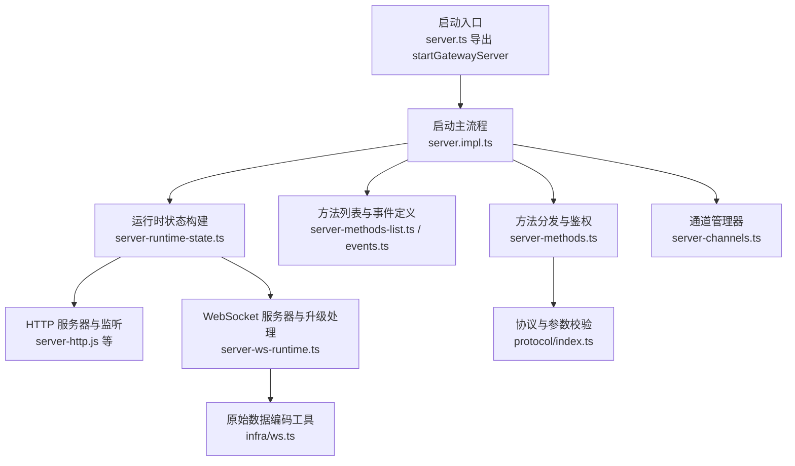
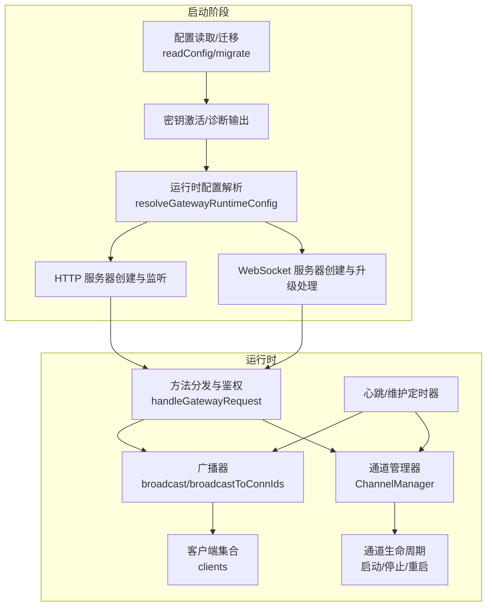
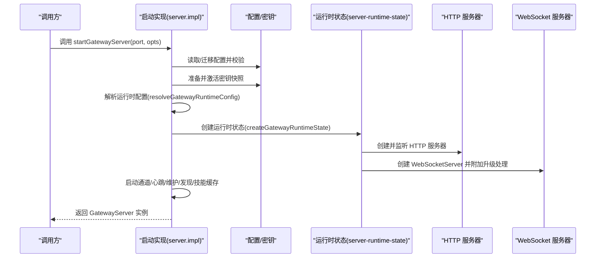
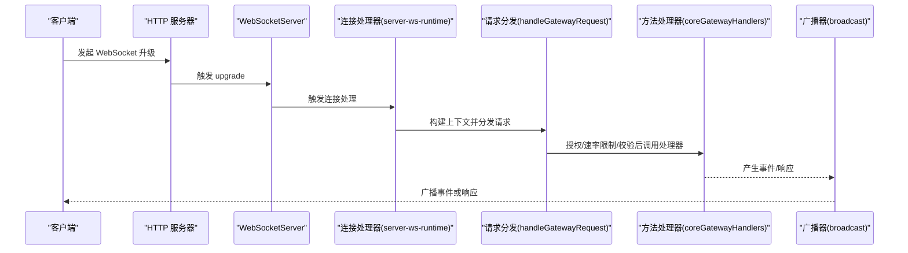
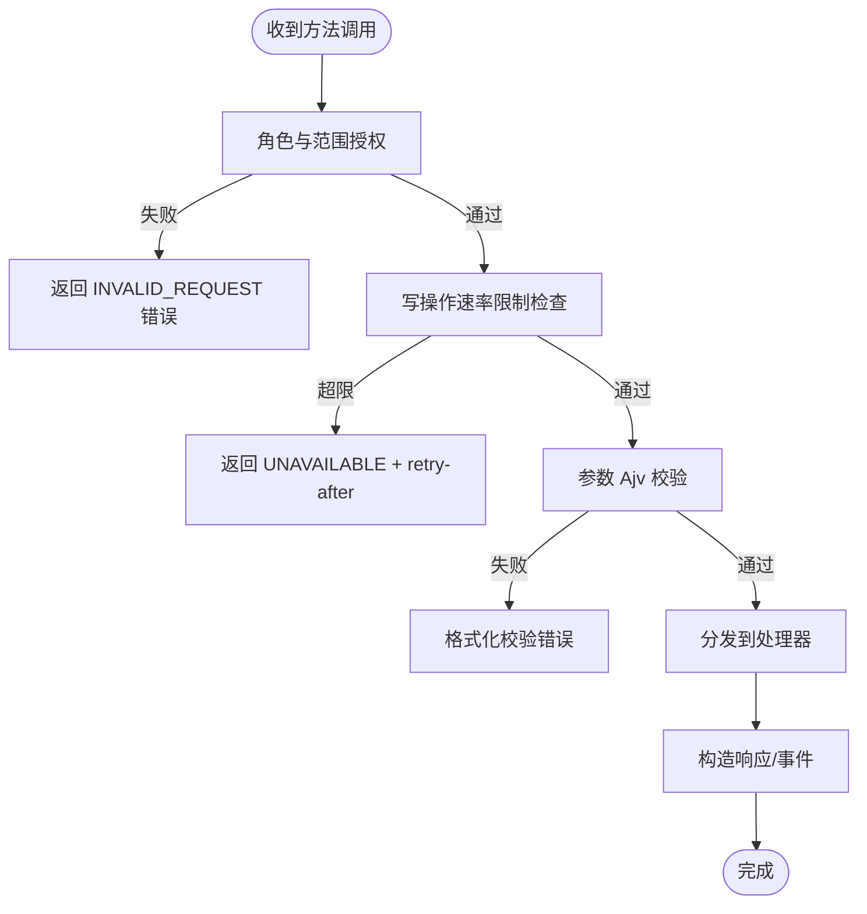
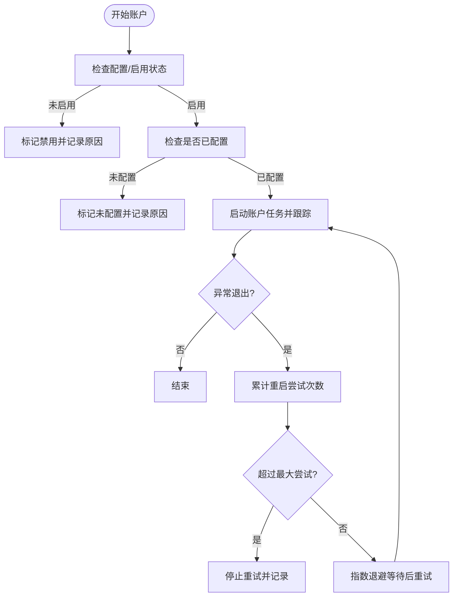
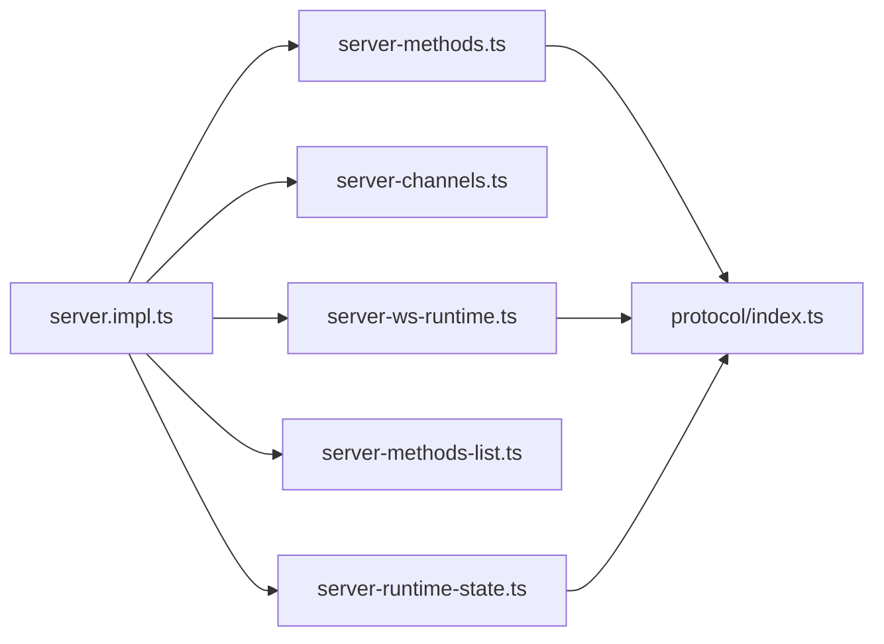

# 网关服务器

<cite>
**本文引用的文件**
- [src/gateway/server.impl.ts](file://src/gateway/server.impl.ts)
- [src/gateway/server.ts](file://src/gateway/server.ts)
- [src/gateway/server-ws-runtime.ts](file://src/gateway/server-ws-runtime.ts)
- [src/gateway/server-methods-list.ts](file://src/gateway/server-methods-list.ts)
- [src/gateway/server-methods.ts](file://src/gateway/server-methods.ts)
- [src/gateway/server-channels.ts](file://src/gateway/server-channels.ts)
- [src/gateway/server-runtime-state.ts](file://src/gateway/server-runtime-state.ts)
- [src/gateway/events.ts](file://src/gateway/events.ts)
- [src/gateway/protocol/index.ts](file://src/gateway/protocol/index.ts)
- [src/infra/ws.ts](file://src/infra/ws.ts)
</cite>

## 目录
1. [简介](#简介)
2. [项目结构](#项目结构)
3. [核心组件](#核心组件)
4. [架构总览](#架构总览)
5. [详细组件分析](#详细组件分析)
6. [依赖关系分析](#依赖关系分析)
7. [性能考虑](#性能考虑)
8. [故障排除指南](#故障排除指南)
9. [结论](#结论)
10. [附录：服务器方法与 API 接口](#附录服务器方法与-api-接口)

## 简介
本文件面向 OpenClaw 网关服务器（Gateway）的技术文档，聚焦于 WebSocket 控制平面的架构设计与实现细节，涵盖连接管理、消息路由、事件广播、方法授权与速率限制、通道生命周期管理、启动流程与配置加载、运行时管理、协议与消息格式、以及安全与可观测性等主题。文档同时提供系统级图示、流程图与时序图，帮助读者从高层到代码层面理解网关的工作原理，并给出性能优化、监控指标与故障排除建议。

## 项目结构
网关相关代码主要位于 src/gateway 目录下，围绕“启动与运行时状态”“WebSocket 控制平面”“方法与权限”“通道管理”“协议与校验”等模块组织。核心入口通过导出函数对外暴露启动能力；运行时状态在启动阶段构建 HTTP 与 WebSocket 服务、插件与钩子、通道管理器、心跳与维护任务等。

图表来源
- [src/gateway/server.ts:1-4](file://src/gateway/server.ts#L1-L4)
- [src/gateway/server.impl.ts:266-269](file://src/gateway/server.impl.ts#L266-L269)
- [src/gateway/server-runtime-state.ts:39-88](file://src/gateway/server-runtime-state.ts#L39-L88)
- [src/gateway/server-ws-runtime.ts:24-44](file://src/gateway/server-ws-runtime.ts#L24-L44)
- [src/gateway/server-methods-list.ts:107-133](file://src/gateway/server-methods-list.ts#L107-L133)
- [src/gateway/server-methods.ts:100-158](file://src/gateway/server-methods.ts#L100-L158)
- [src/gateway/server-channels.ts:110-108](file://src/gateway/server-channels.ts#L110-L108)
- [src/gateway/protocol/index.ts:253-458](file://src/gateway/protocol/index.ts#L253-L458)
- [src/infra/ws.ts:4-21](file://src/infra/ws.ts#L4-L21)

章节来源
- [src/gateway/server.ts:1-4](file://src/gateway/server.ts#L1-L4)
- [src/gateway/server.impl.ts:266-269](file://src/gateway/server.impl.ts#L266-L269)

## 核心组件
- 启动与运行时
  - startGatewayServer：负责配置读取/迁移、密钥激活、认证引导、TLS 加载、运行时配置解析、HTTP/WebSocket 服务创建、通道管理器、心跳与维护定时器、插件与钩子、广播器与上下文等。
  - createGatewayRuntimeState：创建 HTTP 服务器、WebSocket 服务器、客户端集合、广播器、聊天运行时状态、去重表、工具事件接收者注册等。
- WebSocket 控制平面
  - attachGatewayWsHandlers：将连接处理器挂载到 WebSocketServer，建立连接、鉴权、速率限制、请求上下文与广播回调。
- 方法与事件
  - listGatewayMethods/GATEWAY_EVENTS：汇总基础方法与事件，外加各通道插件扩展的方法。
  - coreGatewayHandlers/handleGatewayRequest：方法分发、角色与范围授权、写操作速率限制、错误封装。
- 通道管理
  - createChannelManager：按账户维度启动/停止通道，带指数退避自动重启、手动停止标记、运行快照。
- 协议与校验
  - protocol/index.ts：基于 Ajv 的参数 Schema 校验与错误格式化，统一错误码与帧结构。

章节来源
- [src/gateway/server.impl.ts:266-800](file://src/gateway/server.impl.ts#L266-L800)
- [src/gateway/server-runtime-state.ts:39-232](file://src/gateway/server-runtime-state.ts#L39-L232)
- [src/gateway/server-ws-runtime.ts:24-44](file://src/gateway/server-ws-runtime.ts#L24-L44)
- [src/gateway/server-methods-list.ts:107-133](file://src/gateway/server-methods-list.ts#L107-L133)
- [src/gateway/server-methods.ts:68-158](file://src/gateway/server-methods.ts#L68-L158)
- [src/gateway/server-channels.ts:110-458](file://src/gateway/server-channels.ts#L110-L458)
- [src/gateway/protocol/index.ts:253-458](file://src/gateway/protocol/index.ts#L253-L458)

## 架构总览
下图展示网关启动后的主要组件交互：配置与密钥准备、HTTP 与 WebSocket 服务、方法分发、事件广播、通道生命周期、心跳与维护任务。

图表来源
- [src/gateway/server.impl.ts:284-421](file://src/gateway/server.impl.ts#L284-L421)
- [src/gateway/server-runtime-state.ts:142-200](file://src/gateway/server-runtime-state.ts#L142-L200)
- [src/gateway/server-channels.ts:149-305](file://src/gateway/server-channels.ts#L149-L305)
- [src/gateway/server-methods.ts:100-158](file://src/gateway/server-methods.ts#L100-L158)

## 详细组件分析

### 启动流程与运行时管理
- 配置与密钥
  - 读取配置快照并迁移旧配置；校验失败抛错；自动启用插件并持久化变更；密钥激活失败在启动阶段直接报错，其他场景降级保留上次已知良好快照。
- 认证与 TLS
  - 启动前确保认证令牌/策略存在并可写入；加载 TLS 运行时；根据绑定模式与主机解析决定监听地址；非回环绑定发出警告。
- 运行时配置与服务
  - 解析运行时配置（绑定主机、是否启用 Control UI、HTTP 端点开关、严格传输安全头、认证与速率限制、Tailscale 模式等），创建 HTTP 服务器并监听；为每个 HTTP 服务器附加 WebSocket 升级处理；初始化广播器、聊天运行时状态、去重表、工具事件接收者。
- 插件与钩子
  - 加载插件并合并方法集；创建钩子请求处理器与插件 HTTP 路由处理器；根据配置决定是否强制对插件路径进行网关认证。
- 通道与维护
  - 初始化通道管理器；启动发现服务；启动技能远程缓存预热；启动心跳与维护定时器；恢复出站投递队列；订阅代理事件与心跳事件并广播。

图表来源
- [src/gateway/server.impl.ts:284-421](file://src/gateway/server.impl.ts#L284-L421)
- [src/gateway/server-runtime-state.ts:142-200](file://src/gateway/server-runtime-state.ts#L142-L200)

章节来源
- [src/gateway/server.impl.ts:284-421](file://src/gateway/server.impl.ts#L284-L421)
- [src/gateway/server-runtime-state.ts:142-200](file://src/gateway/server-runtime-state.ts#L142-L200)

### WebSocket 控制平面：连接管理、消息路由与事件处理
- 连接管理
  - 使用 WebSocketServer，noServer 模式配合 HTTP 服务器 upgrade 处理；记录客户端集合；设置最大负载限制；支持 Canvas Host 作为静态资源服务。
- 消息路由
  - 将请求分发至 coreGatewayHandlers 或额外处理器；执行角色与范围授权；对写操作进行速率限制；使用 Ajv 校验请求帧与参数；错误统一封装。
- 事件处理
  - 事件通过广播器发送给所有或指定连接；支持丢弃过慢广播；事件类型来自 GATEWAY_EVENTS；系统事件与更新可用事件通过专用常量标识。
- 原始数据处理
  - 提供 raw 数据转字符串的工具函数，兼容多种输入类型。

图表来源
- [src/gateway/server-ws-runtime.ts:24-44](file://src/gateway/server-ws-runtime.ts#L24-L44)
- [src/gateway/server-methods.ts:100-158](file://src/gateway/server-methods.ts#L100-L158)
- [src/gateway/server-methods-list.ts:107-133](file://src/gateway/server-methods-list.ts#L107-L133)
- [src/gateway/events.ts:3-8](file://src/gateway/events.ts#L3-L8)
- [src/infra/ws.ts:4-21](file://src/infra/ws.ts#L4-L21)

章节来源
- [src/gateway/server-ws-runtime.ts:24-44](file://src/gateway/server-ws-runtime.ts#L24-L44)
- [src/gateway/server-methods.ts:100-158](file://src/gateway/server-methods.ts#L100-L158)
- [src/gateway/server-methods-list.ts:107-133](file://src/gateway/server-methods-list.ts#L107-L133)
- [src/gateway/events.ts:3-8](file://src/gateway/events.ts#L3-L8)
- [src/infra/ws.ts:4-21](file://src/infra/ws.ts#L4-L21)

### 方法列表与 API 接口
- 基础方法
  - 包含健康检查、医生诊断、日志、通道状态/登出、系统状态、用量统计、TTS、配置读写/应用/补丁/Schema、执行审批、向导、模型列表、工具目录、代理与代理文件、技能、更新、语音唤醒、会话管理、节点配对/描述/调用/事件、浏览器请求、聊天历史/中止/发送等。
- 事件
  - 连接挑战、代理、聊天、在线状态、周期性 tick、Talk 模式、关闭、健康、心跳、定时任务、节点/设备配对请求/解决、语音唤醒变更、执行审批请求/解决、更新可用等。
- 方法分发与鉴权
  - 未连接客户端仅允许 health；角色解析失败返回无效请求；节点角色免授权；管理员范围豁免；其他方法需满足角色与范围授权；写操作（应用/补丁/更新）受速率限制。
- 参数校验
  - 所有方法参数通过 Ajv Schema 校验，错误格式化统一，便于客户端定位问题。

图表来源
- [src/gateway/server-methods.ts:38-158](file://src/gateway/server-methods.ts#L38-L158)
- [src/gateway/server-methods-list.ts:4-110](file://src/gateway/server-methods-list.ts#L4-L110)
- [src/gateway/protocol/index.ts:253-458](file://src/gateway/protocol/index.ts#L253-L458)

章节来源
- [src/gateway/server-methods-list.ts:4-133](file://src/gateway/server-methods-list.ts#L4-L133)
- [src/gateway/server-methods.ts:38-158](file://src/gateway/server-methods.ts#L38-L158)
- [src/gateway/protocol/index.ts:253-458](file://src/gateway/protocol/index.ts#L253-L458)

### 通道管理：生命周期与自动重启
- 生命周期
  - 支持按账户启动/停止；默认运行时快照克隆；运行中/停止中/重启待定状态；错误信息记录；手动停止标记避免自动重启。
- 自动重启
  - 指数退避策略（初始/最大/因子/抖动），最多尝试次数限制；崩溃后延迟重试并累计尝试次数；达到上限后停止重试并记录。
- 快照与状态
  - 提供运行时快照，聚合各通道与账户的当前状态；支持查询默认账户与描述字段。

图表来源
- [src/gateway/server-channels.ts:149-305](file://src/gateway/server-channels.ts#L149-L305)

章节来源
- [src/gateway/server-channels.ts:110-458](file://src/gateway/server-channels.ts#L110-L458)

### 协议与消息格式
- 帧结构
  - 连接参数、请求帧、响应帧、事件帧、状态版本、快照等均有对应 Schema 与校验函数。
- 错误码与错误形状
  - 统一错误码与错误形状，支持重试提示与详情字段。
- 参数校验
  - 通过 Ajv 编译各方法参数 Schema，提供格式化错误信息，便于调试与自动化处理。

章节来源
- [src/gateway/protocol/index.ts:253-458](file://src/gateway/protocol/index.ts#L253-L458)

## 依赖关系分析
- 组件耦合
  - 启动实现与运行时状态紧密耦合：前者负责装配后者所需的所有依赖（配置、认证、TLS、插件、钩子、通道、定时器等）。
  - WebSocket 控制平面依赖运行时状态提供的广播器、客户端集合、上下文与速率限制器。
  - 方法分发依赖方法列表与事件常量，结合协议层的校验与错误封装。
- 外部依赖
  - ws 用于 WebSocket 服务器与升级处理；Ajv 用于参数校验；Node 内置 crypto/path 等模块用于 TLS 与路径解析。
- 循环依赖
  - 当前模块以“启动实现 → 运行时状态 → 服务/广播/上下文”的单向链路为主，未见循环导入迹象。

图表来源
- [src/gateway/server.impl.ts:1-120](file://src/gateway/server.impl.ts#L1-L120)
- [src/gateway/server-runtime-state.ts:1-38](file://src/gateway/server-runtime-state.ts#L1-L38)
- [src/gateway/server-channels.ts:1-12](file://src/gateway/server-channels.ts#L1-L12)
- [src/gateway/server-ws-runtime.ts:1-12](file://src/gateway/server-ws-runtime.ts#L1-L12)
- [src/gateway/server-methods-list.ts:1-3](file://src/gateway/server-methods-list.ts#L1-L3)
- [src/gateway/server-methods.ts:1-6](file://src/gateway/server-methods.ts#L1-L6)
- [src/gateway/protocol/index.ts:1-3](file://src/gateway/protocol/index.ts#L1-L3)

章节来源
- [src/gateway/server.impl.ts:1-120](file://src/gateway/server.impl.ts#L1-L120)
- [src/gateway/server-runtime-state.ts:1-38](file://src/gateway/server-runtime-state.ts#L1-L38)
- [src/gateway/server-channels.ts:1-12](file://src/gateway/server-channels.ts#L1-L12)
- [src/gateway/server-ws-runtime.ts:1-12](file://src/gateway/server-ws-runtime.ts#L1-L12)
- [src/gateway/server-methods-list.ts:1-3](file://src/gateway/server-methods-list.ts#L1-L3)
- [src/gateway/server-methods.ts:1-6](file://src/gateway/server-methods.ts#L1-L6)
- [src/gateway/protocol/index.ts:1-3](file://src/gateway/protocol/index.ts#L1-L3)

## 性能考虑
- 广播与丢包保护
  - 广播支持“过慢丢弃”策略，避免阻塞；聊天增量发送时间戳与缓冲区减少重复与抖动。
- 负载与速率限制
  - WebSocket 最大负载限制；写操作控制平面方法速率限制；认证速率限制器针对浏览器来源采用非豁免策略。
- 维护与清理
  - 健康快照与在线版本管理；去重表清理；媒体文件 TTL 清理；聊天运行时与中止控制器管理。
- 通道稳定性
  - 指数退避自动重启，避免频繁崩溃导致的资源争用；手动停止标记防止无意义重启。
- 监控与可观测性
  - 心跳事件广播；诊断心跳；系统事件队列；日志子系统按功能拆分（网关/发现/TLS/通道/浏览器/健康/计划任务/重载/钩子/插件/WS/密钥）。

章节来源
- [src/gateway/server.impl.ts:706-725](file://src/gateway/server.impl.ts#L706-L725)
- [src/gateway/server-methods.ts:109-134](file://src/gateway/server-methods.ts#L109-L134)
- [src/gateway/server-runtime-state.ts:186-189](file://src/gateway/server-runtime-state.ts#L186-L189)

## 故障排除指南
- 启动失败
  - 配置校验失败：根据 doctor 命令修复；Nix 模式下检测到旧配置需迁移。
  - 密钥不可用：启动阶段直接报错；其他场景降级保留上次已知良好快照并发出系统事件。
  - TLS 启用失败：明确错误信息并终止启动。
- 连接与认证
  - 非回环绑定未配置认证：启动时警告；建议尽快配置认证策略。
  - 浏览器来源认证：采用非豁免速率限制策略，避免暴力破解。
- 通道异常
  - 通道未配置/被禁用：运行时快照中标记相应状态并记录原因；可通过插件配置修正。
  - 通道崩溃：指数退避自动重启，超过上限后停止；检查日志与错误信息。
- 方法调用失败
  - 参数校验失败：查看格式化后的错误信息；确认请求帧结构与字段。
  - 权限不足：检查角色与范围授权；管理员范围可豁免。
  - 写操作限流：等待重试间隔后重试。

章节来源
- [src/gateway/server.impl.ts:284-421](file://src/gateway/server.impl.ts#L284-L421)
- [src/gateway/server-channels.ts:177-203](file://src/gateway/server-channels.ts#L177-L203)
- [src/gateway/server-methods.ts:109-134](file://src/gateway/server-methods.ts#L109-L134)
- [src/gateway/protocol/index.ts:424-458](file://src/gateway/protocol/index.ts#L424-L458)

## 结论
OpenClaw 网关服务器通过清晰的启动流程、严格的鉴权与速率限制、完善的事件广播与通道生命周期管理，构建了稳定可控的 WebSocket 控制平面。协议层的参数校验与错误封装提升了系统的可维护性与可观测性。结合本文的架构图、流程图与实践建议，用户可以高效地部署、运维与扩展网关服务。

## 附录：服务器方法与 API 接口
以下为常用方法类别与典型用途（方法名来源于方法列表）：

- 健康与诊断
  - health/status/last-heartbeat/set-heartbeats：系统健康与心跳查询与设置。
- 配置管理
  - config.get/config.set/config.apply/config.patch/config.schema/config.schema.lookup：配置读取、写入、应用、补丁、Schema 查询。
- 会话管理
  - sessions.list/sessions.preview/sessions.patch/sessions.reset/sessions.delete/sessions.compact：会话查询、预览、补丁、重置、删除、压缩。
- 代理与代理文件
  - agents.list/agents.create/agents.update/agents.delete/agents.files.list/agents.files.get/agents.files.set：代理与代理文件管理。
- 工具与模型
  - tools.catalog/models.list：工具目录与模型列表。
- 技能与更新
  - skills.status/skills.bins/skills.install/skills.update/update.run：技能状态、二进制、安装、更新与执行更新。
- 语音唤醒
  - voicewake.get/voicewake.set：语音唤醒开关与触发词设置。
- 秘钥与执行审批
  - secrets.reload/secrets.resolve/exec.approvals.*：密钥重载与解析、执行审批查询与设置、请求与决策。
- 节点与设备配对
  - node.pair.*、device.pair.*、node.rename/node.list/node.describe/node.invoke/node.event 等：节点与设备配对、重命名、列举、描述、调用与事件。
- 浏览器与聊天
  - browser.request、chat.history/chat.abort/chat.send：浏览器请求与聊天相关方法。
- 系统事件与 Presence
  - system-event/system-presence：系统事件与在线状态。

章节来源
- [src/gateway/server-methods-list.ts:4-105](file://src/gateway/server-methods-list.ts#L4-L105)
- [src/gateway/server-methods.ts:68-98](file://src/gateway/server-methods.ts#L68-L98)