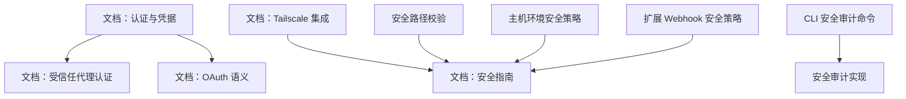
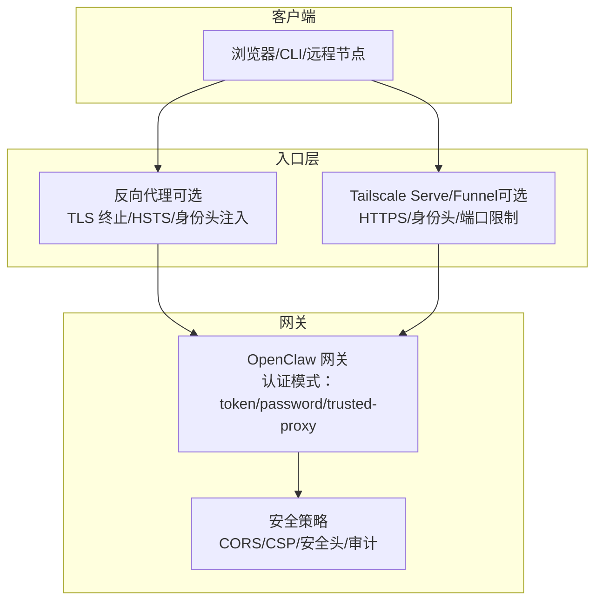
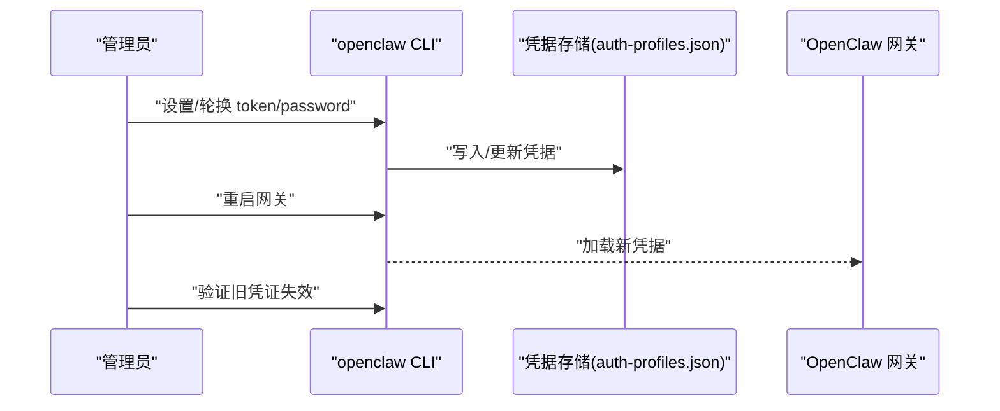
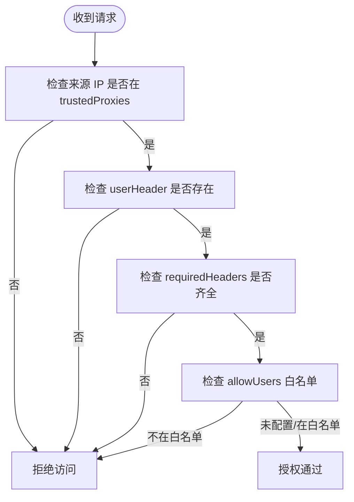
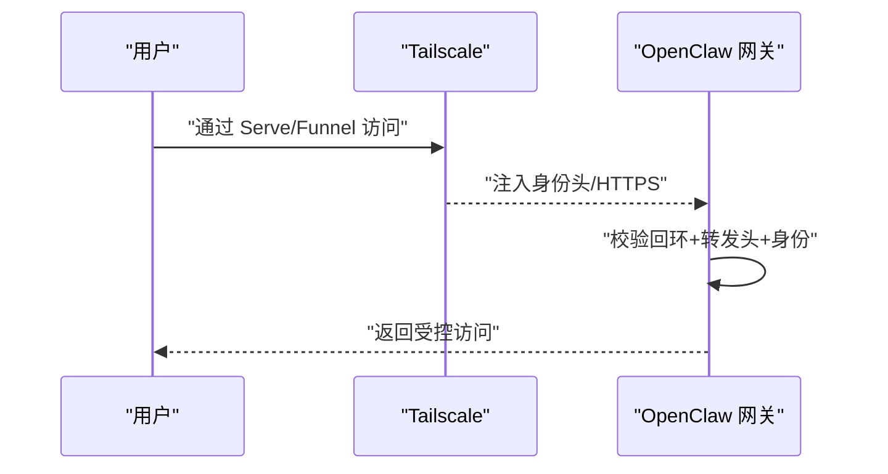
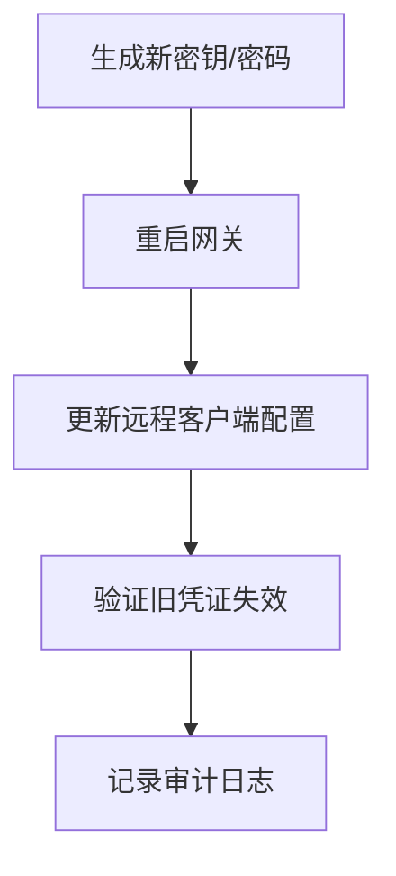
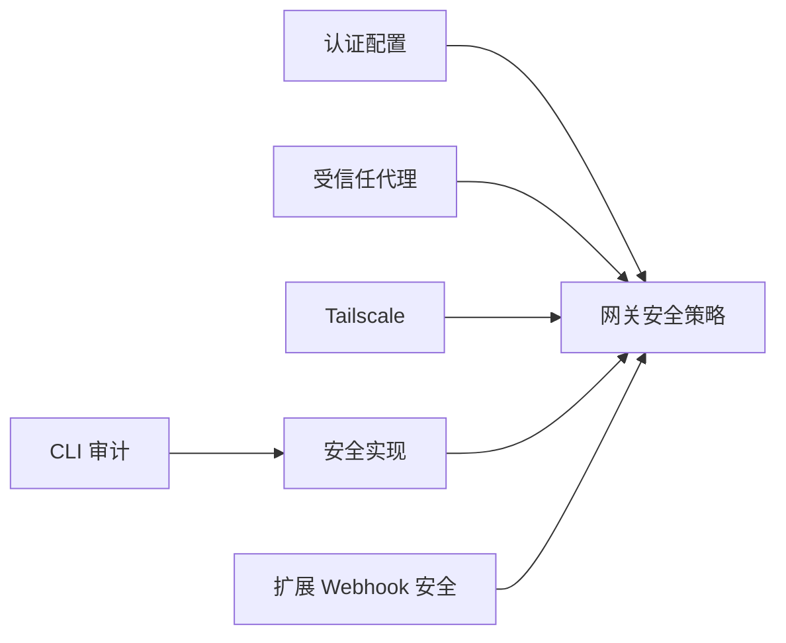

# 安全配置

<cite>
**本文引用的文件**
- [docs/gateway/authentication.md](file://docs/gateway/authentication.md)
- [docs/gateway/trusted-proxy-auth.md](file://docs/gateway/trusted-proxy-auth.md)
- [docs/gateway/tailscale.md](file://docs/gateway/tailscale.md)
- [docs/gateway/security/index.md](file://docs/gateway/security/index.md)
- [docs/zh-CN/gateway/security/index.md](file://docs/zh-CN/gateway/security/index.md)
- [docs/concepts/oauth.md](file://docs/concepts/oauth.md)
- [docs/auth-credential-semantics.md](file://docs/auth-credential-semantics.md)
- [docs/cli/security.md](file://docs/cli/security.md)
- [src/cli/security-cli.ts](file://src/cli/security-cli.ts)
- [src/commands/doctor-security.ts](file://src/commands/doctor-security.ts)
- [src/gateway/security-path.ts](file://src/gateway/security-path.ts)
- [src/infra/host-env-security.ts](file://src/infra/host-env-security.ts)
- [extensions/voice-call/src/webhook-security.ts](file://extensions/voice-call/src/webhook-security.ts)
- [extensions/synology-chat/src/security.ts](file://extensions/synology-chat/src/security.ts)
</cite>

## 目录
1. [简介](#简介)
2. [项目结构](#项目结构)
3. [核心组件](#核心组件)
4. [架构总览](#架构总览)
5. [详细组件分析](#详细组件分析)
6. [依赖关系分析](#依赖关系分析)
7. [性能考量](#性能考量)
8. [故障排查指南](#故障排查指南)
9. [结论](#结论)
10. [附录](#附录)

## 简介
本技术文档聚焦于 OpenClaw 网关的安全配置，围绕认证配置（令牌认证、密码认证、受信任代理认证）、TLS/SSL 与安全头、访问控制（CORS/CSP/安全头）、Tailscale 集成（隧道模式与访问控制）、安全最佳实践（强密码策略、令牌轮换、安全审计）以及常见安全威胁防护（CSRF/XSS/暴力破解）展开，并提供测试与验证方法，帮助读者在不同部署形态下构建安全可靠的网关。

## 项目结构
OpenClaw 的安全配置涉及多处文档与实现：
- 文档侧：认证、受信任代理认证、Tailscale、安全指南、OAuth 语义、CLI 安全审计等
- 实现侧：安全路径校验、主机环境安全策略、Webhook 安全策略、安全审计 CLI 命令等

图示来源
- [docs/gateway/authentication.md:1-180](file://docs/gateway/authentication.md#L1-L180)
- [docs/gateway/trusted-proxy-auth.md:1-330](file://docs/gateway/trusted-proxy-auth.md#L1-L330)
- [docs/gateway/tailscale.md:1-133](file://docs/gateway/tailscale.md#L1-L133)
- [docs/gateway/security/index.md:1-800](file://docs/gateway/security/index.md#L1-L800)
- [docs/concepts/oauth.md:1-159](file://docs/concepts/oauth.md#L1-L159)
- [docs/auth-credential-semantics.md:1-46](file://docs/auth-credential-semantics.md#L1-L46)
- [docs/cli/security.md:1-72](file://docs/cli/security.md#L1-L72)
- [src/cli/security-cli.ts](file://src/cli/security-cli.ts)
- [src/commands/doctor-security.ts](file://src/commands/doctor-security.ts)
- [src/gateway/security-path.ts](file://src/gateway/security-path.ts)
- [src/infra/host-env-security.ts](file://src/infra/host-env-security.ts)
- [extensions/voice-call/src/webhook-security.ts](file://extensions/voice-call/src/webhook-security.ts)
- [extensions/synology-chat/src/security.ts](file://extensions/synology-chat/src/security.ts)

章节来源
- [docs/gateway/authentication.md:1-180](file://docs/gateway/authentication.md#L1-L180)
- [docs/gateway/trusted-proxy-auth.md:1-330](file://docs/gateway/trusted-proxy-auth.md#L1-L330)
- [docs/gateway/tailscale.md:1-133](file://docs/gateway/tailscale.md#L1-L133)
- [docs/gateway/security/index.md:1-800](file://docs/gateway/security/index.md#L1-L800)
- [docs/concepts/oauth.md:1-159](file://docs/concepts/oauth.md#L1-L159)
- [docs/auth-credential-semantics.md:1-46](file://docs/auth-credential-semantics.md#L1-L46)
- [docs/cli/security.md:1-72](file://docs/cli/security.md#L1-L72)
- [src/cli/security-cli.ts](file://src/cli/security-cli.ts)
- [src/commands/doctor-security.ts](file://src/commands/doctor-security.ts)
- [src/gateway/security-path.ts](file://src/gateway/security-path.ts)
- [src/infra/host-env-security.ts](file://src/infra/host-env-security.ts)
- [extensions/voice-call/src/webhook-security.ts](file://extensions/voice-call/src/webhook-security.ts)
- [extensions/synology-chat/src/security.ts](file://extensions/synology-chat/src/security.ts)

## 核心组件
- 认证与凭据管理
  - API 密钥与订阅型凭据（含 Anthropic setup-token、OpenAI Codex OAuth）
  - 凭据存储位置与多账户路由
- 受信任代理认证（trusted-proxy）
  - 代理负责认证，网关基于可信源与头部提取用户身份
- Tailscale 集成
  - Serve（Tailnet 仅）与 Funnel（公网）两种模式，支持身份头与密码认证
- TLS/SSL 与安全头
  - 代理终止 TLS 时的 HSTS 策略与网关直连 HTTPS 的安全头配置
- 访问控制
  - CORS、CSP、安全头配置建议与控制 UI 安全上下文要求
- 安全审计与 CLI 工具
  - 自动化审计、修复建议与 JSON 报告输出
- 扩展与 Webhook 安全
  - 插件/扩展的 Webhook 安全策略与校验

章节来源
- [docs/gateway/authentication.md:1-180](file://docs/gateway/authentication.md#L1-L180)
- [docs/concepts/oauth.md:1-159](file://docs/concepts/oauth.md#L1-L159)
- [docs/auth-credential-semantics.md:1-46](file://docs/auth-credential-semantics.md#L1-L46)
- [docs/gateway/trusted-proxy-auth.md:1-330](file://docs/gateway/trusted-proxy-auth.md#L1-L330)
- [docs/gateway/tailscale.md:1-133](file://docs/gateway/tailscale.md#L1-L133)
- [docs/gateway/security/index.md:1-800](file://docs/gateway/security/index.md#L1-L800)
- [docs/cli/security.md:1-72](file://docs/cli/security.md#L1-L72)
- [src/cli/security-cli.ts](file://src/cli/security-cli.ts)
- [src/commands/doctor-security.ts](file://src/commands/doctor-security.ts)
- [src/gateway/security-path.ts](file://src/gateway/security-path.ts)
- [src/infra/host-env-security.ts](file://src/infra/host-env-security.ts)
- [extensions/voice-call/src/webhook-security.ts](file://extensions/voice-call/src/webhook-security.ts)
- [extensions/synology-chat/src/security.ts](file://extensions/synology-chat/src/security.ts)

## 架构总览
下图展示 OpenClaw 网关在不同部署形态下的安全交互：本地回环、反向代理、Tailscale Serve/Funnel，以及认证与安全头策略。

图示来源
- [docs/gateway/trusted-proxy-auth.md:91-136](file://docs/gateway/trusted-proxy-auth.md#L91-L136)
- [docs/gateway/tailscale.md:21-43](file://docs/gateway/tailscale.md#L21-L43)
- [docs/gateway/security/index.md:80-120](file://docs/gateway/security/index.md#L80-L120)

## 详细组件分析

### 认证配置：令牌认证、密码认证与订阅型凭据
- 令牌认证（Bearer Token）
  - 适用于大多数场景，推荐在生产环境使用
  - 支持轮换流程：生成新 token → 重启网关 → 更新远程客户端 → 验证旧凭证失效
- 密码认证（Shared Password）
  - 优先通过环境变量设置，避免明文写入配置
  - 与 Tailscale Serve 模式配合时，可利用身份头实现免密登录（需谨慎）
- 订阅型凭据
  - Anthropic setup-token：技术兼容，存在使用限制，建议优先 API Key
  - OpenAI Codex OAuth：支持 PKCE 流程，令牌存储于 per-agent 文件中
- 凭据存储与多账户路由
  - 凭据集中存储于 per-agent 目录，支持多配置文件与 per-session 路由
  - 支持 SecretRef 引用与静态值混合使用

图示来源
- [docs/gateway/authentication.md:21-57](file://docs/gateway/authentication.md#L21-L57)
- [docs/gateway/authentication.md:123-139](file://docs/gateway/authentication.md#L123-L139)
- [docs/concepts/oauth.md:41-56](file://docs/concepts/oauth.md#L41-L56)
- [docs/auth-credential-semantics.md:12-46](file://docs/auth-credential-semantics.md#L12-L46)

章节来源
- [docs/gateway/authentication.md:1-180](file://docs/gateway/authentication.md#L1-L180)
- [docs/concepts/oauth.md:1-159](file://docs/concepts/oauth.md#L1-L159)
- [docs/auth-credential-semantics.md:1-46](file://docs/auth-credential-semantics.md#L1-L46)

### 受信任代理认证（trusted-proxy）
- 适用场景
  - 反向代理具备身份能力（OIDC/SAML/OAuth），且所有流量必须经代理
  - 解决 WebSocket 无法携带 token 的问题
- 关键配置
  - 仅允许代理 IP 列表（trustedProxies）
  - 用户身份头名称（userHeader）
  - 可选：必需头列表（requiredHeaders）、用户白名单（allowUsers）
- 安全要点
  - 代理必须覆盖而非追加 x-forwarded-* 头
  - 仅在代理终止 TLS 时应用 HSTS
  - 审计会标记该模式为高风险，需严格核对配置

图示来源
- [docs/gateway/trusted-proxy-auth.md:30-90](file://docs/gateway/trusted-proxy-auth.md#L30-L90)
- [docs/gateway/trusted-proxy-auth.md:256-275](file://docs/gateway/trusted-proxy-auth.md#L256-L275)

章节来源
- [docs/gateway/trusted-proxy-auth.md:1-330](file://docs/gateway/trusted-proxy-auth.md#L1-L330)

### TLS/SSL 与安全头配置
- 代理终止 TLS（推荐）
  - 在代理层设置 HSTS，域名维度统一管理证书与安全策略
  - 网关保持 loopback HTTP，降低攻击面
- 网关直连 HTTPS
  - 开启 TLS 并在 http.securityHeaders 中设置 strictTransportSecurity
  - 使用长生命周期 HSTS 时需谨慎评估子域与预加载策略

章节来源
- [docs/gateway/trusted-proxy-auth.md:91-136](file://docs/gateway/trusted-proxy-auth.md#L91-L136)

### 访问控制：CORS、CSP 与安全头
- 控制 UI 安全上下文
  - 需要在 HTTPS 或 localhost 下生成设备身份；启用允许不安全认证会降级为仅令牌认证
- 安全头与策略
  - HSTS、X-Frame-Options、X-Content-Type-Options、Referrer-Policy、Permissions-Policy 等
  - CSP 建议最小化内联脚本与外链资源，使用 nonce/hash
- 审计与建议
  - 安全指南文档提供了优先级处理清单与具体建议

章节来源
- [docs/gateway/security/index.md:82-120](file://docs/gateway/security/index.md#L82-L120)
- [docs/zh-CN/gateway/security/index.md:71-80](file://docs/zh-CN/gateway/security/index.md#L71-L80)

### Tailscale 集成：隧道模式与访问控制
- 模式
  - serve：Tailnet 内部 HTTPS，网关仍绑定 loopback
  - funnel：公网 HTTPS，需共享密码
- 身份与认证
  - serve 模式下可使用 Tailscale 身份头（如 tailscale-user-login），但仅在回环+特定转发头组合满足时生效
  - funnel 模式强制 password 认证，避免公网暴露
- 运维注意
  - funnel 仅支持特定端口
  - 可在退出时重置 Serve/Funnel 配置

图示来源
- [docs/gateway/tailscale.md:21-43](file://docs/gateway/tailscale.md#L21-L43)
- [docs/gateway/tailscale.md:79-92](file://docs/gateway/tailscale.md#L79-L92)
- [docs/gateway/security/index.md:755-783](file://docs/gateway/security/index.md#L755-L783)

章节来源
- [docs/gateway/tailscale.md:1-133](file://docs/gateway/tailscale.md#L1-L133)
- [docs/gateway/security/index.md:755-783](file://docs/gateway/security/index.md#L755-L783)

### 安全最佳实践：强密码策略、令牌轮换与审计
- 强密码策略
  - 使用足够熵的随机字符串，优先通过环境变量注入
- 令牌轮换
  - 生成新 token → 重启网关 → 更新远程客户端 → 验证旧凭证失效
- 安全审计
  - 使用 CLI 审计命令输出 JSON 报告，结合 CI/策略检查
  - 自动修复仅限安全、确定性变更（如组策略收紧、敏感文件权限收紧）

图示来源
- [docs/cli/security.md:58-72](file://docs/cli/security.md#L58-L72)
- [docs/gateway/security/index.md:412-418](file://docs/gateway/security/index.md#L412-L418)

章节来源
- [docs/cli/security.md:1-72](file://docs/cli/security.md#L1-L72)
- [docs/gateway/security/index.md:412-418](file://docs/gateway/security/index.md#L412-L418)

### 常见安全威胁防护
- CSRF
  - 依赖 SameSite Cookie、Origin/Referer 校验、CSRF Token（在 Web 层实现）
- XSS
  - 输出编码、CSP、禁止内联脚本与 eval
- 暴力破解
  - 限制登录尝试、速率限制、双因素、受信任代理或 Tailscale 限定访问
- Webhook 安全
  - 校验签名、限定来源 IP、HTTPS、防重放

章节来源
- [extensions/voice-call/src/webhook-security.ts](file://extensions/voice-call/src/webhook-security.ts)
- [extensions/synology-chat/src/security.ts](file://extensions/synology-chat/src/security.ts)
- [src/infra/host-env-security.ts](file://src/infra/host-env-security.ts)

## 依赖关系分析
- 认证与安全策略耦合点
  - 受信任代理认证依赖代理正确注入身份头与覆盖 x-forwarded-* 头
  - Tailscale 身份头仅在特定回环+转发头条件下生效
- 审计与实现
  - CLI 审计命令与安全策略实现相互印证，确保配置与行为一致
- 扩展与插件
  - 各扩展的 Webhook 安全策略需遵循统一的安全基线

图示来源
- [src/cli/security-cli.ts](file://src/cli/security-cli.ts)
- [src/commands/doctor-security.ts](file://src/commands/doctor-security.ts)
- [src/gateway/security-path.ts](file://src/gateway/security-path.ts)
- [extensions/voice-call/src/webhook-security.ts](file://extensions/voice-call/src/webhook-security.ts)
- [extensions/synology-chat/src/security.ts](file://extensions/synology-chat/src/security.ts)

章节来源
- [src/cli/security-cli.ts](file://src/cli/security-cli.ts)
- [src/commands/doctor-security.ts](file://src/commands/doctor-security.ts)
- [src/gateway/security-path.ts](file://src/gateway/security-path.ts)
- [extensions/voice-call/src/webhook-security.ts](file://extensions/voice-call/src/webhook-security.ts)
- [extensions/synology-chat/src/security.ts](file://extensions/synology-chat/src/security.ts)

## 性能考量
- 受信任代理与 Tailscale 的额外头校验与身份解析会带来轻微开销，通常可忽略
- HSTS 与安全头的计算成本极低
- 审计与日志输出建议在 CI/离线场景使用 JSON 输出，减少交互式输出开销

## 故障排查指南
- 受信任代理错误
  - 代理来源不可信：确认 trustedProxies 配置与实际容器/节点 IP
  - 用户头缺失：确认代理正确注入 userHeader，大小写与拼写
  - 缺少必需头：检查 requiredHeaders 是否被上游代理剥离
  - 用户未在白名单：添加 allowUsers 或移除白名单
  - WebSocket 仍失败：确认代理支持升级并传递身份头
- Tailscale 身份头无效
  - 请求未满足回环+转发头条件；或代理转发了 Tailscale 身份头导致冲突
- CLI 审计发现
  - 重点关注“开放 + 启用工具”“公共网络暴露”“权限”“插件/扩展”等优先级项

章节来源
- [docs/gateway/trusted-proxy-auth.md:276-323](file://docs/gateway/trusted-proxy-auth.md#L276-L323)
- [docs/gateway/tailscale.md:119-133](file://docs/gateway/tailscale.md#L119-L133)
- [docs/cli/security.md:17-42](file://docs/cli/security.md#L17-L42)

## 结论
通过合理选择认证模式（token/password/trusted-proxy）、在代理层统一 TLS 与安全头策略、结合 Tailscale 的 Serve/Funnel 与严格的访问控制，OpenClaw 可在多种部署形态下实现强健的安全保障。配合自动化安全审计与严格的轮换流程，可有效降低凭证泄露与越权访问的风险。

## 附录
- 安全审计命令与输出
  - 审计、深度审计、自动修复、JSON 输出
- 安全路径与主机环境策略
  - 安全路径校验、主机环境安全策略
- 扩展 Webhook 安全
  - 各扩展的 Webhook 安全策略实现

章节来源
- [docs/cli/security.md:17-72](file://docs/cli/security.md#L17-L72)
- [src/gateway/security-path.ts](file://src/gateway/security-path.ts)
- [src/infra/host-env-security.ts](file://src/infra/host-env-security.ts)
- [extensions/voice-call/src/webhook-security.ts](file://extensions/voice-call/src/webhook-security.ts)
- [extensions/synology-chat/src/security.ts](file://extensions/synology-chat/src/security.ts)