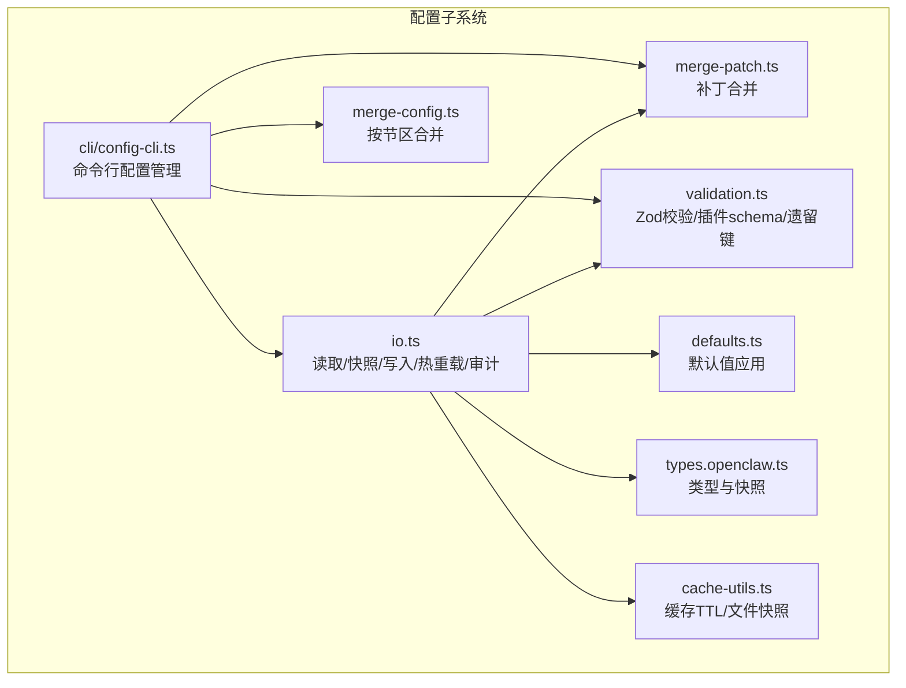
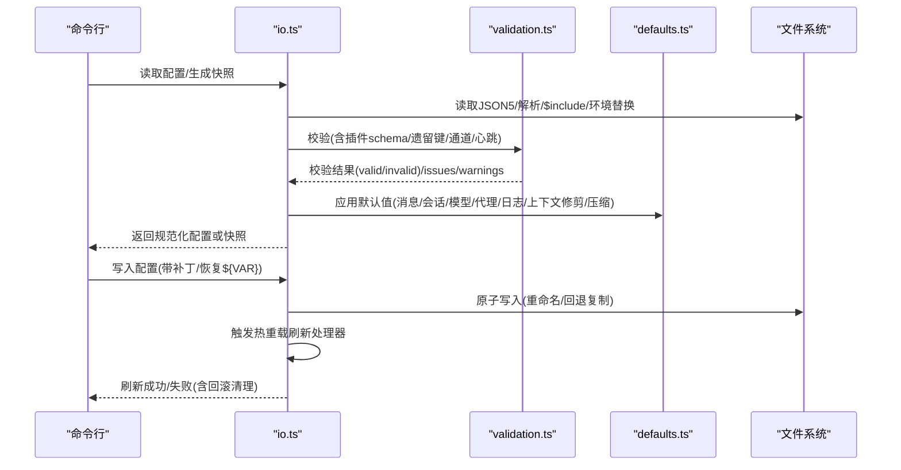
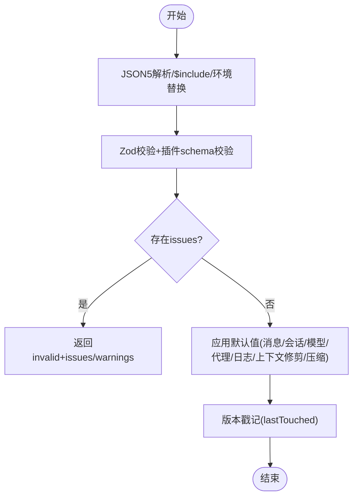
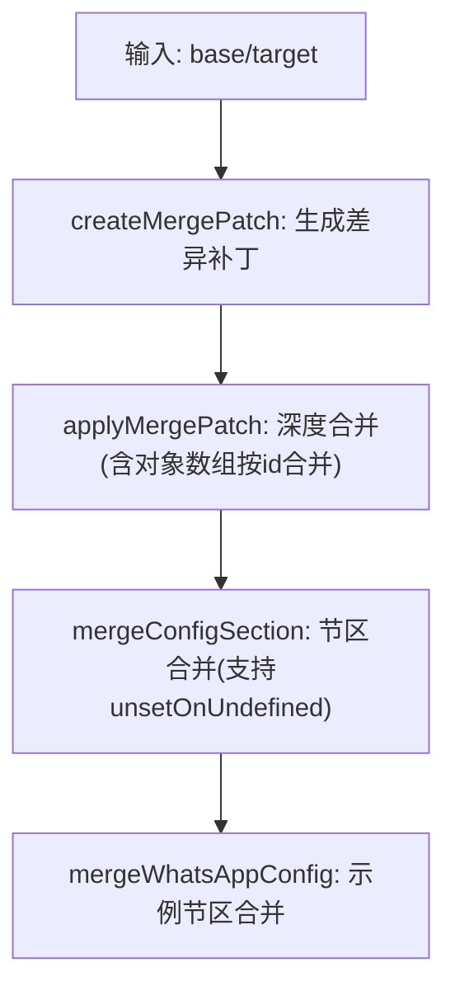
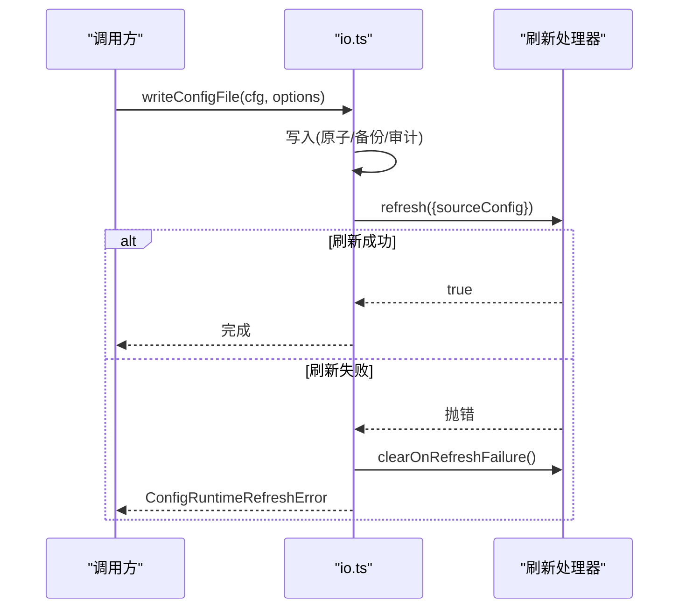
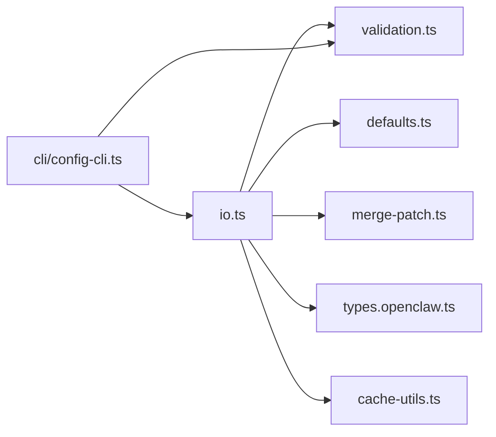

# 运行时配置

<cite>
**本文引用的文件**
- [src/config/io.ts](file://src/config/io.ts)
- [src/config/merge-patch.ts](file://src/config/merge-patch.ts)
- [src/config/merge-config.ts](file://src/config/merge-config.ts)
- [src/config/validation.ts](file://src/config/validation.ts)
- [src/config/defaults.ts](file://src/config/defaults.ts)
- [src/config/types.openclaw.ts](file://src/config/types.openclaw.ts)
- [src/config/cache-utils.ts](file://src/config/cache-utils.ts)
- [src/config/config.ts](file://src/config/config.ts)
- [src/cli/config-cli.ts](file://src/cli/config-cli.ts)
</cite>

## 目录
1. [简介](#简介)
2. [项目结构](#项目结构)
3. [核心组件](#核心组件)
4. [架构总览](#架构总览)
5. [详细组件分析](#详细组件分析)
6. [依赖分析](#依赖分析)
7. [性能考虑](#性能考虑)
8. [故障排除指南](#故障排除指南)
9. [结论](#结论)
10. [附录](#附录)

## 简介
本文件面向 OpenClaw 的运行时配置系统，系统性阐述配置的解析与验证、合并算法、默认值处理、类型转换、热重载机制（变更检测、平滑重启与回滚）、配置缓存与性能优化、更新最佳实践、故障排除与监控审计等主题。目标是帮助开发者与运维人员在不深入源码的前提下，理解并正确使用配置系统。

## 项目结构
OpenClaw 的配置子系统位于 src/config 目录，围绕“读取/解析/包含/环境变量替换/校验/默认值应用/写入/快照/热重载”形成闭环。关键模块职责如下：
- io.ts：配置文件读取、快照生成、写入、热重载刷新、审计日志、缓存控制
- merge-patch.ts：基于补丁的深度合并算法，支持对象数组按 id 合并
- merge-config.ts：按节区合并工具函数，支持将补丁应用于特定配置段
- validation.ts：基于 Zod 的严格校验，含插件 schema 校验、通道与心跳目标校验、遗留键检测等
- defaults.ts：各类默认值应用（消息、会话、模型、代理、日志、上下文修剪、压缩）
- types.openclaw.ts：顶层配置类型定义与快照结构
- cache-utils.ts：缓存 TTL 解析与文件状态快照
- config.ts：对外导出入口（加载、快照、写入、热重载刷新等）
- cli/config-cli.ts：命令行配置管理（读取、设置、删除、校验、备份）

图表来源
- [src/config/io.ts:1342-1560](file://src/config/io.ts#L1342-L1560)
- [src/config/merge-patch.ts:1-98](file://src/config/merge-patch.ts#L1-L98)
- [src/config/merge-config.ts:1-39](file://src/config/merge-config.ts#L1-L39)
- [src/config/validation.ts:1-605](file://src/config/validation.ts#L1-L605)
- [src/config/defaults.ts:1-537](file://src/config/defaults.ts#L1-L537)
- [src/config/types.openclaw.ts:1-155](file://src/config/types.openclaw.ts#L1-L155)
- [src/config/cache-utils.ts:1-38](file://src/config/cache-utils.ts#L1-L38)
- [src/cli/config-cli.ts](file://src/cli/config-cli.ts)

章节来源
- [src/config/io.ts:1342-1560](file://src/config/io.ts#L1342-L1560)
- [src/config/types.openclaw.ts:1-155](file://src/config/types.openclaw.ts#L1-L155)

## 核心组件
- 配置读取与快照
  - 支持 JSON5 解析、$include 引用解析、${ENV} 变量替换、缺失环境变量警告、遗留键检测、版本戳记与未来版本提示
  - 生成 ConfigFileSnapshot，区分 valid/invalid、issues/warnings、legacyIssues
- 验证与默认值
  - 使用 Zod Schema 校验；对插件配置进行 schema 校验；通道与心跳目标校验；重复代理工作空间目录检测
  - 应用多层默认值（消息、会话、模型、代理、日志、上下文修剪、压缩）
- 合并与写入
  - 基于补丁的合并（createMergePatch + applyMergePatch），支持对象数组按 id 合并
  - 写入前恢复环境变量引用（如 ${VAR}），避免覆盖未变更的敏感值
  - 备份轮转、原子写入（rename 或 fallback copy），审计日志记录
- 热重载与运行时快照
  - 维护运行时配置快照与源快照，投影编辑后的配置到源快照，触发刷新处理器
  - 刷新失败时可执行回滚清理，保证并发读取不暴露中间态
- 缓存与性能
  - 可配置的短时缓存（毫秒级），避免频繁磁盘访问
  - 文件状态快照用于外部变更检测

章节来源
- [src/config/io.ts:663-1560](file://src/config/io.ts#L663-L1560)
- [src/config/validation.ts:229-605](file://src/config/validation.ts#L229-L605)
- [src/config/defaults.ts:131-537](file://src/config/defaults.ts#L131-L537)
- [src/config/merge-patch.ts:62-98](file://src/config/merge-patch.ts#L62-L98)
- [src/config/cache-utils.ts:4-38](file://src/config/cache-utils.ts#L4-L38)

## 架构总览
下图展示从配置文件到运行时快照的整体流程，包括解析、验证、默认值应用、写入与热重载刷新。

图表来源
- [src/config/io.ts:734-1560](file://src/config/io.ts#L734-L1560)
- [src/config/validation.ts:308-605](file://src/config/validation.ts#L308-L605)
- [src/config/defaults.ts:131-537](file://src/config/defaults.ts#L131-L537)

## 详细组件分析

### 配置解析与验证流程
- 解析与包含
  - JSON5 解析失败、$include 解析失败、环境变量替换失败均被记录为问题
  - 对缺失环境变量以警告形式保留配置可用性，避免关键路径中断
- 校验
  - Zod Schema 校验 + 插件 schema 校验（动态加载插件清单与 schema）
  - 通道 ID 与心跳目标校验，未知通道/心跳目标报错
  - 重复代理工作空间目录检测，直接报错
  - 遗留键检测与迁移提示
- 默认值应用
  - 按需应用消息、会话、模型、代理、日志、上下文修剪、压缩等默认值
  - Talk API Key 自动注入（仅在默认提供者且未显式配置时）
- 版本与未来配置提示
  - 记录 lastTouchedVersion/lastTouchedAt，并对来自未来版本的配置给出警告

图表来源
- [src/config/io.ts:734-883](file://src/config/io.ts#L734-L883)
- [src/config/validation.ts:229-286](file://src/config/validation.ts#L229-L286)
- [src/config/defaults.ts:131-537](file://src/config/defaults.ts#L131-L537)

章节来源
- [src/config/io.ts:663-1067](file://src/config/io.ts#L663-L1067)
- [src/config/validation.ts:229-286](file://src/config/validation.ts#L229-L286)
- [src/config/defaults.ts:172-211](file://src/config/defaults.ts#L172-L211)

### 配置合并算法与类型转换
- 补丁生成与应用
  - createMergePatch：递归比较 base 与 target，仅输出差异补丁
  - applyMergePatch：按补丁深度合并，支持对象数组按 id 合并（当基数组元素均为带 id 的对象时）
- 节区合并
  - mergeConfigSection：将 patch 合并到指定节区，支持对 undefined 值按需删除键
  - mergeWhatsAppConfig：示例节区合并函数，演示如何将补丁应用于 channels.whatsapp
- 类型转换
  - 环境变量引用收集与恢复：写回前根据当前文件解析出的 ${VAR} 映射，仅对未变更的引用保持原样
  - 路径变更集合：用于判断是否需要恢复某处的 ${VAR}

图表来源
- [src/config/merge-patch.ts:62-98](file://src/config/merge-patch.ts#L62-L98)
- [src/config/merge-config.ts:8-39](file://src/config/merge-config.ts#L8-L39)

章节来源
- [src/config/merge-patch.ts:1-98](file://src/config/merge-patch.ts#L1-L98)
- [src/config/merge-config.ts:1-39](file://src/config/merge-config.ts#L1-L39)
- [src/config/io.ts:1133-1186](file://src/config/io.ts#L1133-L1186)

### 默认值处理与类型转换
- 默认值应用顺序
  - 消息、会话、模型、代理、日志、上下文修剪、压缩等逐层应用
  - Talk API Key 注入：在默认提供者且未显式配置时自动注入
- 类型转换与规范化
  - 路径规范化、Talk 配置标准化、模型别名映射、上下文窗口与最大输出 token 的约束
- 兼容性与降级
  - 重复代理工作空间目录直接报错
  - 未知通道/心跳目标、遗留键等严格校验

章节来源
- [src/config/defaults.ts:131-537](file://src/config/defaults.ts#L131-L537)
- [src/config/validation.ts:148-223](file://src/config/validation.ts#L148-L223)

### 配置热重载机制
- 快照与投影
  - 维护运行时快照与源快照，projectConfigOntoRuntimeSourceSnapshot 将编辑后的配置投影回源快照
- 刷新处理器
  - setRuntimeConfigSnapshotRefreshHandler 注册刷新处理器
  - writeConfigFile 写入后尝试调用刷新处理器；若失败则执行 clearOnRefreshFailure 回滚清理
- 并发安全
  - 刷新失败期间保持旧快照，避免并发读者看到中间态
- 无快照时行为
  - 若无运行时快照，写入后仍从磁盘读取最新配置，确保外部/手动修改可见

图表来源
- [src/config/io.ts:1507-1560](file://src/config/io.ts#L1507-L1560)

章节来源
- [src/config/io.ts:1386-1560](file://src/config/io.ts#L1386-L1560)

### 配置验证规则
- 必需字段与值域
  - Zod Schema 严格校验；允许值集合通过提示补充
- 依赖关系
  - 通道 ID 与心跳目标必须在已知集合中（含插件扩展）
  - 代理工作空间头像路径必须在工作空间内
  - Tailscale serve/funnel 模式下 gateway.bind 必须为 loopback 或自定义 127.0.0.1
- 插件配置
  - 动态加载插件清单与 schema，校验每个插件的配置
  - 未知插件 ID 作为错误或警告（移除的插件仅警告）
- 遗留键
  - 发现遗留键时标记为 legacyIssues，指导迁移

章节来源
- [src/config/validation.ts:117-140](file://src/config/validation.ts#L117-L140)
- [src/config/validation.ts:148-223](file://src/config/validation.ts#L148-L223)
- [src/config/validation.ts:384-455](file://src/config/validation.ts#L384-L455)
- [src/config/validation.ts:464-597](file://src/config/validation.ts#L464-L597)

### 配置缓存机制与性能优化
- 短时缓存
  - loadConfig 支持可配置缓存时间（毫秒），避免频繁磁盘访问
  - OPENCLAW_CONFIG_CACHE_MS 控制缓存时长，0 或禁用环境变量关闭缓存
- 文件状态快照
  - getFileStatSnapshot 提供 mtime/size 快照，辅助外部变更检测
- 写入优化
  - 仅在必要时写入，原子重命名优先，失败回退复制
  - 备份轮转减少磁盘碎片与历史版本管理成本

章节来源
- [src/config/io.ts:1360-1380](file://src/config/io.ts#L1360-L1380)
- [src/config/io.ts:1467-1492](file://src/config/io.ts#L1467-L1492)
- [src/config/cache-utils.ts:22-38](file://src/config/cache-utils.ts#L22-L38)

### 配置更新最佳实践
- 分阶段部署
  - 先在测试环境写入并验证，再逐步推广
  - 使用 writeConfigFile 的 unsetPaths 选项精确删除不需要的键，避免误删
- 渐进式变更
  - 通过 createMergePatch 生成最小补丁，减少写入范围
  - 保持 ${VAR} 引用不变，避免不必要的覆盖
- 回滚策略
  - 写入后若刷新失败，执行 clearOnRefreshFailure 回滚清理，确保一致性
- 监控与审计
  - 开启配置审计日志，记录写入事件、大小变化、模式变更等可疑点

章节来源
- [src/config/io.ts:1086-1333](file://src/config/io.ts#L1086-L1333)
- [src/config/io.ts:1236-1286](file://src/config/io.ts#L1236-L1286)

### 配置监控与审计
- 审计日志
  - 写入时追加 JSONL 记录，包含时间戳、进程信息、变更前后哈希、字节数、变更路径数、元数据存在性、网关模式等
  - suspicious 字段汇总可疑原因（如大小骤降、缺少 meta、移除 gateway.mode 等）
- 日志位置
  - 位于状态目录 logs/config-audit.jsonl

章节来源
- [src/config/io.ts:534-581](file://src/config/io.ts#L534-L581)
- [src/config/io.ts:1236-1286](file://src/config/io.ts#L1236-L1286)

## 依赖分析
- 模块耦合
  - io.ts 是核心枢纽，依赖 validation.ts、defaults.ts、merge-patch.ts、types.openclaw.ts、cache-utils.ts
  - CLI 通过 config-cli.ts 间接依赖 io.ts 与 validation.ts
- 外部依赖
  - JSON5 解析、文件系统、结构化克隆、环境变量、版本比较
- 循环依赖
  - 未发现循环依赖迹象；各模块职责清晰

图表来源
- [src/config/io.ts:1-100](file://src/config/io.ts#L1-L100)
- [src/config/validation.ts:1-30](file://src/config/validation.ts#L1-L30)
- [src/config/defaults.ts:1-20](file://src/config/defaults.ts#L1-L20)
- [src/config/merge-patch.ts:1-10](file://src/config/merge-patch.ts#L1-L10)
- [src/config/types.openclaw.ts:1-36](file://src/config/types.openclaw.ts#L1-L36)
- [src/config/cache-utils.ts:1-10](file://src/config/cache-utils.ts#L1-L10)
- [src/cli/config-cli.ts](file://src/cli/config-cli.ts)

章节来源
- [src/config/io.ts:1-100](file://src/config/io.ts#L1-L100)
- [src/config/config.ts:1-29](file://src/config/config.ts#L1-L29)

## 性能考虑
- 缓存命中
  - 在高频率读取场景启用短时缓存，显著降低磁盘 IO
- 写入路径优化
  - 仅写入差异补丁，避免全量写入
  - 原子重命名优先，失败回退复制，减少锁竞争
- 校验与默认值
  - 校验与默认值应用在加载时完成，运行时只读取快照，降低运行期开销

## 故障排除指南
- 无效配置
  - 现象：启动时报 INVALID_CONFIG 错误
  - 排查：查看 issues/warnings，修正 Zod 校验失败项、未知通道/心跳目标、遗留键
  - 参考：[src/config/validation.ts:229-286](file://src/config/validation.ts#L229-L286)
- 权限问题
  - 现象：读取失败，提示权限不足
  - 排查：检查配置文件属主与权限，按提示修复
  - 参考：[src/config/io.ts:1034-1051](file://src/config/io.ts#L1034-L1051)
- 环境变量缺失
  - 现象：非关键配置段不可用
  - 排查：查看警告信息，确认环境变量是否应注入或改为显式配置
  - 参考：[src/config/io.ts:756-760](file://src/config/io.ts#L756-L760)
- 热重载失败
  - 现象：写入成功但刷新失败
  - 排查：检查刷新处理器逻辑，必要时执行回滚清理
  - 参考：[src/config/io.ts:1527-1546](file://src/config/io.ts#L1527-L1546)
- 审计异常
  - 现象：可疑原因（如大小骤降、缺少 meta、移除 gateway.mode）
  - 排查：核对变更内容，确认是否符合预期
  - 参考：[src/config/io.ts:1201-1235](file://src/config/io.ts#L1201-L1235)

章节来源
- [src/config/validation.ts:229-286](file://src/config/validation.ts#L229-L286)
- [src/config/io.ts:1034-1051](file://src/config/io.ts#L1034-L1051)
- [src/config/io.ts:1527-1546](file://src/config/io.ts#L1527-L1546)

## 结论
OpenClaw 的运行时配置系统以“可验证、可合并、可热重载、可观测”为核心设计原则，通过严格的校验、完善的默认值、稳健的合并与写入、细粒度的审计与缓存，实现了生产级的配置管理能力。遵循本文的最佳实践与排障建议，可在保障稳定性的同时高效地进行配置演进。

## 附录
- 命令行配置管理
  - 读取、设置、删除、校验、备份等操作由 CLI 实现，底层依赖 io.ts 与 validation.ts
  - 参考：[src/cli/config-cli.ts](file://src/cli/config-cli.ts)

章节来源
- [src/cli/config-cli.ts](file://src/cli/config-cli.ts)