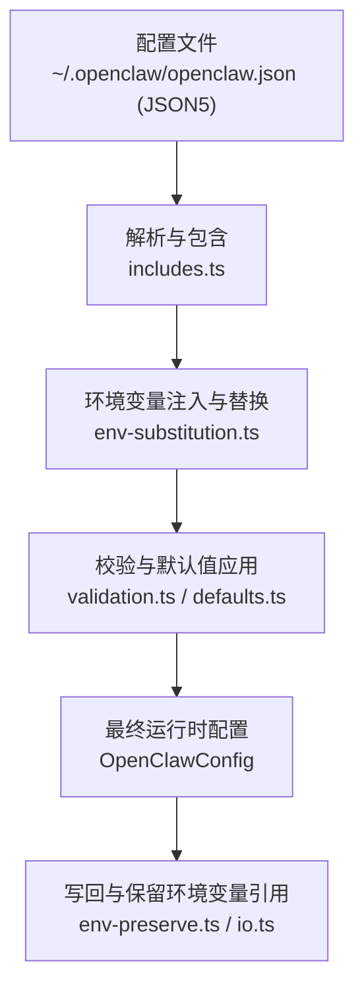
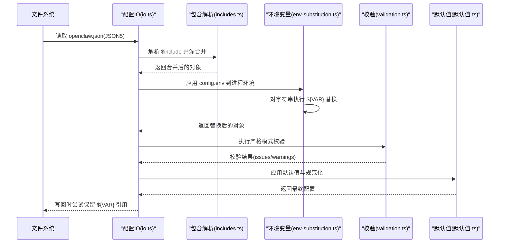
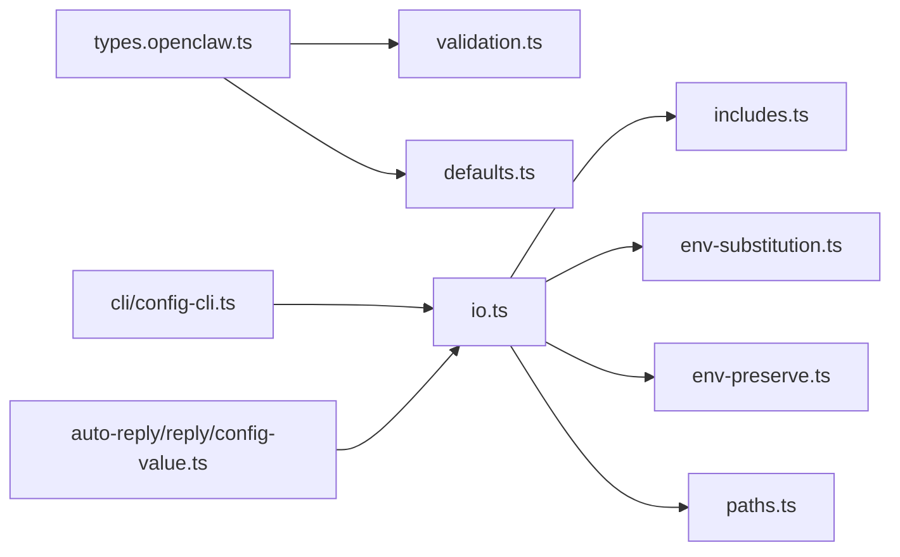

# 配置文件格式

<cite>
**本文引用的文件**
- [src/config/types.openclaw.ts](file://src/config/types.openclaw.ts)
- [src/config/io.ts](file://src/config/io.ts)
- [src/config/env-substitution.ts](file://src/config/env-substitution.ts)
- [src/config/includes.ts](file://src/config/includes.ts)
- [src/config/paths.ts](file://src/config/paths.ts)
- [src/config/validation.ts](file://src/config/validation.ts)
- [src/config/defaults.ts](file://src/config/defaults.ts)
- [src/config/env-preserve.ts](file://src/config/env-preserve.ts)
- [src/cli/config-cli.ts](file://src/cli/config-cli.ts)
- [src/auto-reply/reply/config-value.ts](file://src/auto-reply/reply/config-value.ts)
- [docs/gateway/configuration.md](file://docs/gateway/configuration.md)
- [docs/gateway/configuration-reference.md](file://docs/gateway/configuration-reference.md)
</cite>

## 目录
1. [简介](#简介)
2. [项目结构](#项目结构)
3. [核心组件](#核心组件)
4. [架构总览](#架构总览)
5. [详细组件分析](#详细组件分析)
6. [依赖关系分析](#依赖关系分析)
7. [性能考量](#性能考量)
8. [故障排查指南](#故障排查指南)
9. [结论](#结论)
10. [附录：配置参数参考手册](#附录配置参数参考手册)

## 简介
本文件系统性阐述 OpenClaw 配置文件格式与加载机制，覆盖以下要点：
- 配置文件格式与数据模型（JSON5 语法、顶层字段、嵌套对象与数组）
- 配置项的数据类型、默认值与校验规则
- 加载顺序与优先级（文件路径解析、环境变量注入、变量替换、$include 合并与覆盖）
- 命令行与交互式配置工具的使用方式
- 安全最佳实践、性能优化与常见错误预防
- 开发/生产/混合部署等典型场景的配置示例与建议

## 项目结构
OpenClaw 的配置系统由“类型定义 + IO 流程 + 替换/包含/校验/默认值应用”构成，核心文件如下：
- 类型与结构：src/config/types.openclaw.ts
- 文件读写与合并：src/config/io.ts、src/config/includes.ts、src/config/paths.ts
- 环境变量处理：src/config/env-substitution.ts、src/config/env-preserve.ts
- 校验与默认值：src/config/validation.ts、src/config/defaults.ts
- CLI 解析与值解析：src/cli/config-cli.ts、src/auto-reply/reply/config-value.ts
- 文档参考：docs/gateway/configuration.md、docs/gateway/configuration-reference.md

图表来源
- [src/config/includes.ts:340-347](file://src/config/includes.ts#L340-L347)
- [src/config/env-substitution.ts:197-204](file://src/config/env-substitution.ts#L197-L204)
- [src/config/validation.ts:1-200](file://src/config/validation.ts#L1-L200)
- [src/config/defaults.ts:1-200](file://src/config/defaults.ts#L1-L200)
- [src/config/env-preserve.ts:1-38](file://src/config/env-preserve.ts#L1-L38)
- [src/config/io.ts:734-800](file://src/config/io.ts#L734-L800)

章节来源
- [src/config/types.openclaw.ts:31-123](file://src/config/types.openclaw.ts#L31-L123)
- [src/config/paths.ts:118-194](file://src/config/paths.ts#L118-L194)
- [docs/gateway/configuration.md:10-25](file://docs/gateway/configuration.md#L10-L25)

## 核心组件
- 配置数据模型：OpenClawConfig 定义了顶层键及其嵌套结构（认证、代理、通道、会话、消息、工具、插件、模型、网关、内存等）。
- 文件解析与包含：支持 $include 指令，按顺序深合并，限制最大深度与文件大小，防止路径穿越。
- 环境变量注入与替换：在读取阶段将 config.env 注入进程环境，随后对字符串进行 ${VAR} 变量替换；缺失变量可记录警告而非直接报错。
- 校验与默认值：基于 Zod Schema 的严格校验，并在必要时应用默认值与规范化逻辑。
- 写回与引用保留：写回时尝试恢复原配置中的 ${VAR} 引用，避免环境变量被硬编码写入。

章节来源
- [src/config/types.openclaw.ts:31-123](file://src/config/types.openclaw.ts#L31-L123)
- [src/config/io.ts:734-800](file://src/config/io.ts#L734-L800)
- [src/config/env-substitution.ts:1-204](file://src/config/env-substitution.ts#L1-L204)
- [src/config/includes.ts:1-347](file://src/config/includes.ts#L1-L347)
- [src/config/validation.ts:1-200](file://src/config/validation.ts#L1-L200)
- [src/config/defaults.ts:1-200](file://src/config/defaults.ts#L1-L200)
- [src/config/env-preserve.ts:1-38](file://src/config/env-preserve.ts#L1-L38)

## 架构总览
下图展示从磁盘到运行时配置的关键步骤与模块交互：

图表来源
- [src/config/io.ts:734-800](file://src/config/io.ts#L734-L800)
- [src/config/includes.ts:340-347](file://src/config/includes.ts#L340-L347)
- [src/config/env-substitution.ts:197-204](file://src/config/env-substitution.ts#L197-L204)
- [src/config/validation.ts:1-200](file://src/config/validation.ts#L1-L200)
- [src/config/defaults.ts:1-200](file://src/config/defaults.ts#L1-L200)
- [src/config/env-preserve.ts:1-38](file://src/config/env-preserve.ts#L1-L38)

## 详细组件分析

### 配置文件格式与数据模型
- 格式：JSON5（允许注释与尾随逗号），顶层为对象，键名区分大小写。
- 顶层结构：包含元数据、认证、代理、环境、向导、诊断、日志、CLI、更新、浏览器、UI、密钥、技能、插件、模型、节点主机、智能体、工具、绑定、广播、音频、媒体、消息、命令、审批、会话、Web、通道、定时任务、钩子、发现、画布主机、Talk、网关、内存等。
- 数据类型：布尔、数值、字符串、数组、对象；部分字段存在枚举取值集合。
- 默认值：未显式设置时由默认值应用流程填充；某些字段存在别名或成本/输入规格等默认值。

章节来源
- [src/config/types.openclaw.ts:31-123](file://src/config/types.openclaw.ts#L31-L123)
- [docs/gateway/configuration.md:12-25](file://docs/gateway/configuration.md#L12-L25)

### $include 指令与包含解析
- 支持单文件或文件数组，数组按顺序深合并，后者覆盖前者同名键。
- 路径解析：相对路径相对于包含文件所在目录；禁止路径穿越与符号链接逃逸；限制最大包含深度与文件大小。
- 错误处理：缺失文件、解析失败、循环包含、越界等均有明确错误类型与提示。

章节来源
- [src/config/includes.ts:1-347](file://src/config/includes.ts#L1-L347)

### 环境变量注入与变量替换
- 注入：先将 config.env 中的变量合并到进程环境，再进行变量替换，使 ${VAR} 可引用配置中定义的变量。
- 替换：仅匹配大写命名模式；支持转义 $${VAR} 输出字面量；缺失变量可选择抛出异常或记录警告并保留占位符。
- 写回：写回时尝试恢复原配置中的 ${VAR} 引用，避免硬编码写入。

章节来源
- [src/config/env-substitution.ts:1-204](file://src/config/env-substitution.ts#L1-L204)
- [src/config/env-preserve.ts:1-38](file://src/config/env-preserve.ts#L1-L38)
- [src/config/io.ts:698-718](file://src/config/io.ts#L698-L718)

### 文件路径解析与候选路径
- 默认状态目录：~/.openclaw；可通过环境变量覆盖。
- 配置文件候选路径：优先使用已存在的候选，否则回退到默认路径；支持历史遗留目录兼容。
- 端口解析：优先级为环境变量 > 配置 > 默认端口。

章节来源
- [src/config/paths.ts:118-194](file://src/config/paths.ts#L118-L194)

### 校验与默认值应用
- 校验：基于 Zod Schema 的严格校验，未知键、类型不匹配、非法值会导致启动拒绝；校验器会汇总允许值提示。
- 默认值：对会话、消息、模型等关键字段应用默认值与规范化，确保运行时一致性。
- 兼容性：对历史遗留配置进行检测与告警。

章节来源
- [src/config/validation.ts:1-200](file://src/config/validation.ts#L1-L200)
- [src/config/defaults.ts:1-200](file://src/config/defaults.ts#L1-L200)

### 命令行与交互式配置
- CLI 路径解析：支持点号与方括号索引的路径表达式，用于 set/unset/get 操作。
- 值解析：支持 JSON5/JSON 字面量、布尔、空值、数字、字符串等；空字符串与转义引号有特殊处理。
- 文档参考：交互式向导、控制 UI、直接编辑与热重载等。

章节来源
- [src/cli/config-cli.ts:29-89](file://src/cli/config-cli.ts#L29-L89)
- [src/auto-reply/reply/config-value.ts:1-48](file://src/auto-reply/reply/config-value.ts#L1-L48)
- [docs/gateway/configuration.md:36-59](file://docs/gateway/configuration.md#L36-L59)

## 依赖关系分析

图表来源
- [src/config/types.openclaw.ts:1-30](file://src/config/types.openclaw.ts#L1-L30)
- [src/config/io.ts:1-60](file://src/config/io.ts#L1-L60)
- [src/config/includes.ts:1-40](file://src/config/includes.ts#L1-L40)
- [src/config/env-substitution.ts:1-25](file://src/config/env-substitution.ts#L1-L25)
- [src/config/env-preserve.ts:1-17](file://src/config/env-preserve.ts#L1-L17)
- [src/config/paths.ts:1-25](file://src/config/paths.ts#L1-L25)
- [src/cli/config-cli.ts:25-79](file://src/cli/config-cli.ts#L25-L79)
- [src/auto-reply/reply/config-value.ts:1-10](file://src/auto-reply/reply/config-value.ts#L1-L10)

章节来源
- [src/config/io.ts:1-60](file://src/config/io.ts#L1-L60)
- [src/config/validation.ts:1-25](file://src/config/validation.ts#L1-L25)
- [src/config/defaults.ts:1-15](file://src/config/defaults.ts#L1-L15)

## 性能考量
- 包含文件大小限制与最大深度限制，避免过大配置导致解析开销与栈溢出。
- 热重载模式：hybrid/hot/restart/off 四种模式，按类别决定是否即时应用或重启。
- 环境变量替换仅作用于字符串，避免对非字符串字段产生额外遍历成本。
- 默认值应用集中在一次规范化流程，减少重复计算。

章节来源
- [src/config/includes.ts:21-24](file://src/config/includes.ts#L21-L24)
- [docs/gateway/configuration.md:349-387](file://docs/gateway/configuration.md#L349-L387)

## 故障排查指南
- 配置校验失败：启动被拒绝，仅诊断命令可用；使用 doctor 查看具体问题并修复。
- 缺失环境变量：替换阶段可记录警告并保留占位符；若 onMissing 未提供回调则抛出异常。
- 循环包含与路径越界：包含解析阶段即报错，定位链路清晰。
- 写回后环境变量丢失：通过 env-preserve 机制恢复 ${VAR} 引用，避免硬编码写入。

章节来源
- [docs/gateway/configuration.md:61-73](file://docs/gateway/configuration.md#L61-L73)
- [src/config/env-substitution.ts:78-86](file://src/config/env-substitution.ts#L78-L86)
- [src/config/includes.ts:58-63](file://src/config/includes.ts#L58-L63)
- [src/config/env-preserve.ts:1-38](file://src/config/env-preserve.ts#L1-L38)

## 结论
OpenClaw 的配置系统以 JSON5 为基础，结合严格的校验、灵活的 $include、可控的环境变量替换与稳健的默认值应用，提供了高可靠性的运行时配置体验。通过合理的组织与优先级设计，用户可在不同环境中稳定地管理复杂配置。

## 附录：配置参数参考手册

### 顶层字段概览
- meta：配置元信息（最后写入版本、时间戳）
- auth：认证配置
- acp：ACP 相关配置
- env：环境变量导入与替换
- wizard：向导运行记录
- diagnostics：诊断配置
- logging：日志配置
- cli：CLI 行为配置
- update：更新策略
- browser：浏览器相关
- ui：界面主题与助手信息
- secrets：密钥管理
- skills：技能配置
- plugins：插件配置
- models：模型提供者与别名
- nodeHost：节点主机
- agents：智能体列表与默认工作区
- tools：工具集
- bindings：多智能体路由绑定
- broadcast：广播配置
- audio：音频相关
- media：媒体存储与保留策略
- messages：消息行为
- commands：命令配置
- approvals：审批配置
- session：会话与线程绑定
- web：Web 渠道相关
- channels：各渠道配置
- cron：定时任务
- hooks：HTTP 钩子
- discovery：服务发现
- canvasHost：画布主机
- talk：Talk 提供者
- gateway：网关服务器
- memory：内存配置

章节来源
- [src/config/types.openclaw.ts:31-123](file://src/config/types.openclaw.ts#L31-L123)

### 关键字段与默认值
- 更新策略（update.auto.*）：可配置自动检查与应用策略，默认关闭。
- 会话主键（session.mainKey）：始终视为 "main"，其他值会被忽略并发出警告。
- 消息确认反应作用域（messages.ackReactionScope）：默认为 "group-mentions"。
- 模型别名与成本：内置常用别名与默认成本/输入规格，便于简化配置。

章节来源
- [src/config/defaults.ts:146-170](file://src/config/defaults.ts#L146-L170)
- [src/config/defaults.ts:131-144](file://src/config/defaults.ts#L131-L144)
- [src/config/defaults.ts:21-56](file://src/config/defaults.ts#L21-L56)

### 环境变量与替换规则
- 注入：config.env 与进程环境合并，config.env 在替换前生效。
- 替换：仅大写命名的 ${VAR} 有效；$${VAR} 为字面量输出；缺失变量可记录警告。
- 写回：恢复 ${VAR} 引用，避免硬编码写入。

章节来源
- [src/config/env-substitution.ts:1-204](file://src/config/env-substitution.ts#L1-L204)
- [src/config/env-preserve.ts:1-38](file://src/config/env-preserve.ts#L1-L38)
- [src/config/io.ts:698-718](file://src/config/io.ts#L698-L718)

### $include 合并与覆盖规则
- 单文件：整段替换。
- 数组文件：按序深合并，后者覆盖前者。
- 同级键：包含内容与同级键合并，后者覆盖前者。
- 安全限制：深度上限、文件大小上限、路径合法性与符号链接保护。

章节来源
- [src/config/includes.ts:69-85](file://src/config/includes.ts#L69-L85)
- [src/config/includes.ts:131-153](file://src/config/includes.ts#L131-L153)
- [src/config/includes.ts:190-222](file://src/config/includes.ts#L190-L222)

### 加载顺序与优先级
- 文件路径：优先使用已存在的候选路径，否则使用默认路径；支持环境变量覆盖。
- 环境变量：config.env → 进程环境 → .env（当前目录与全局）→ 登录 Shell 导入（可选）。
- 变量替换：在包含解析之后、校验之前执行。
- 默认值：在严格校验之后应用，确保 schema 一致。

章节来源
- [src/config/paths.ts:118-194](file://src/config/paths.ts#L118-L194)
- [src/config/io.ts:734-768](file://src/config/io.ts#L734-L768)
- [src/config/env-substitution.ts:197-204](file://src/config/env-substitution.ts#L197-L204)
- [src/config/validation.ts:1-200](file://src/config/validation.ts#L1-L200)
- [src/config/defaults.ts:1-200](file://src/config/defaults.ts#L1-L200)

### 最佳实践
- 安全
  - 使用 SecretRef 或环境变量引用敏感信息，避免明文写入配置。
  - 通过 $include 将敏感配置拆分至独立文件，配合权限控制。
  - 仅在必要时启用 shellEnv 导入，并限定超时。
- 性能
  - 控制 $include 层数与文件大小，避免过深包含与超大文件。
  - 合理设置热重载模式，避免频繁重启影响稳定性。
- 可维护性
  - 使用别名与默认值简化模型配置。
  - 通过 channels.defaults 统一策略，减少重复配置。
  - 使用 CLI 与控制 UI 进行增量修改，配合 doctor 自动修复。

章节来源
- [docs/gateway/configuration.md:449-539](file://docs/gateway/configuration.md#L449-L539)
- [docs/gateway/configuration-reference.md:1-200](file://docs/gateway/configuration-reference.md#L1-L200)

### 常见场景示例
- 开发环境
  - 使用较低端口与本地模型，开启调试日志与宽松的 DM 策略。
  - 示例要点：gateway.port、channels.defaults.dmPolicy、logging.level。
- 生产环境
  - 严格 DM/群组策略、最小暴露面、强认证与密钥管理。
  - 示例要点：channels.<provider>.dmPolicy、auth/profiles、secrets/providers。
- 混合部署
  - 使用 $include 将公共配置与环境特定配置分离，按需深合并。
  - 示例要点：$include 数组、同级键覆盖、路径相对化。

章节来源
- [docs/gateway/configuration.md:26-347](file://docs/gateway/configuration.md#L26-L347)
- [docs/gateway/configuration-reference.md:1-200](file://docs/gateway/configuration-reference.md#L1-L200)