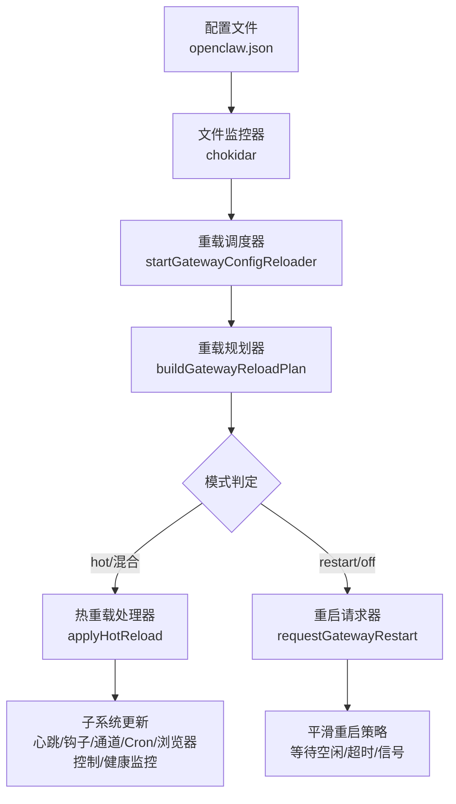
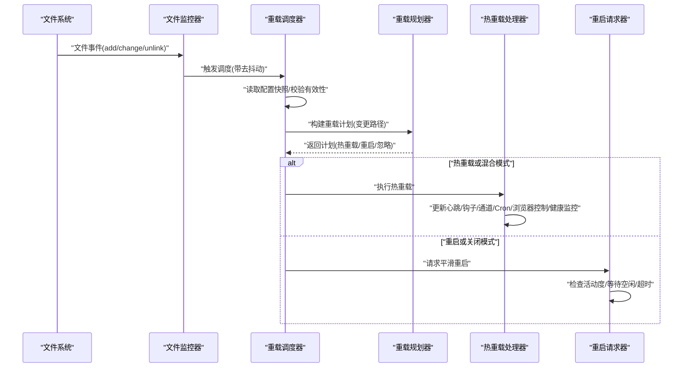
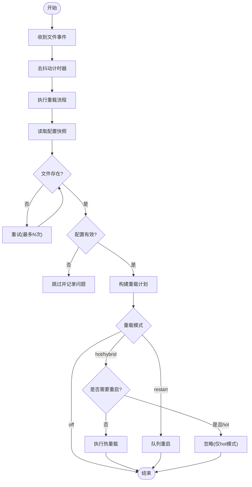
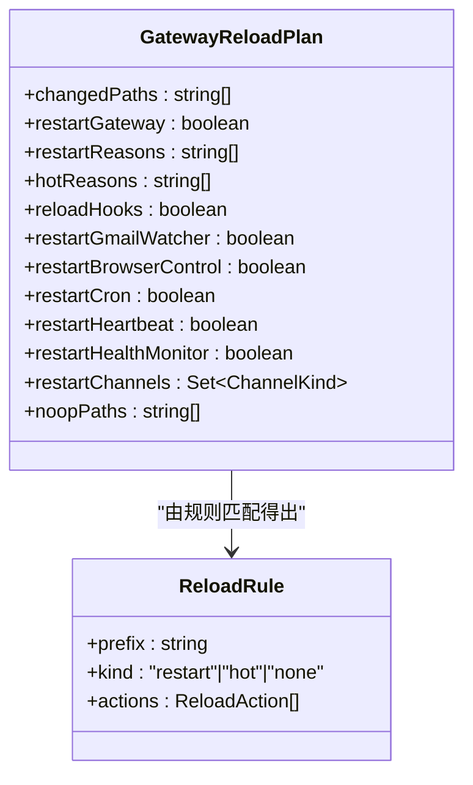
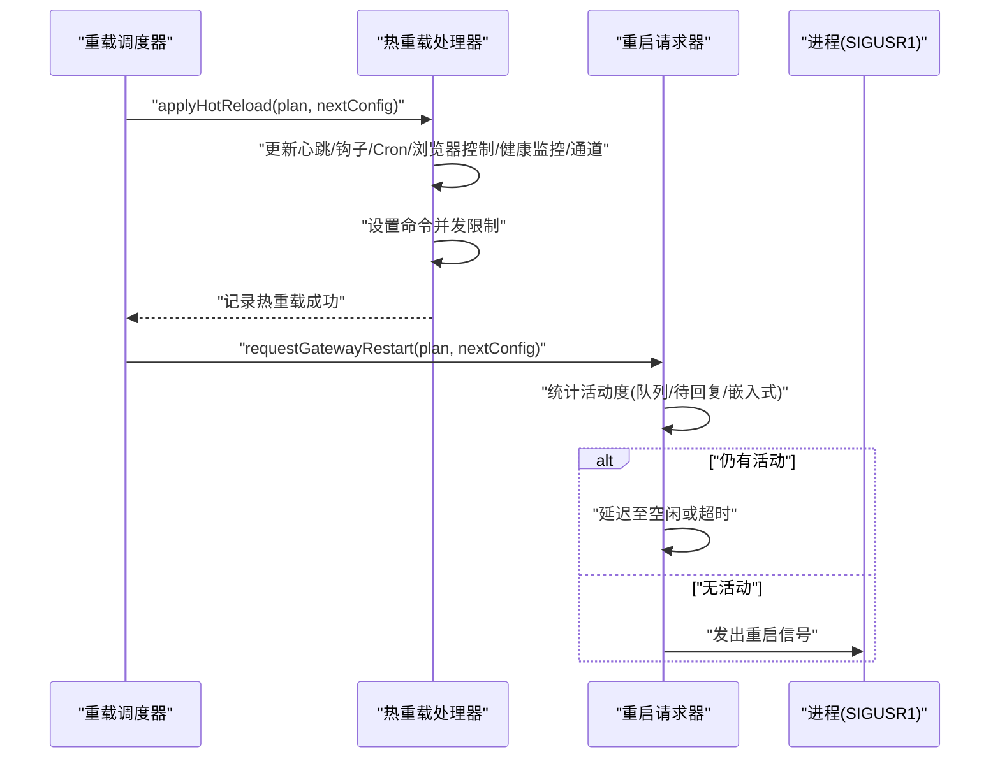

# 配置热重载

<cite>
**本文引用的文件**
- [src/gateway/config-reload.ts](file://src/gateway/config-reload.ts)
- [src/gateway/config-reload-plan.ts](file://src/gateway/config-reload-plan.ts)
- [src/gateway/server-reload-handlers.ts](file://src/gateway/server-reload-handlers.ts)
- [src/gateway/config-reload.test.ts](file://src/gateway/config-reload.test.ts)
- [src/config/config.ts](file://src/config/config.ts)
- [src/canvas-host/server.ts](file://src/canvas-host/server.ts)
- [docs/diagnostics/flags.md](file://docs/diagnostics/flags.md)
</cite>

## 目录
1. [简介](#简介)
2. [项目结构](#项目结构)
3. [核心组件](#核心组件)
4. [架构总览](#架构总览)
5. [详细组件分析](#详细组件分析)
6. [依赖关系分析](#依赖关系分析)
7. [性能考量](#性能考量)
8. [故障排除指南](#故障排除指南)
9. [结论](#结论)
10. [附录](#附录)

## 简介
本文件系统性阐述 OpenClaw 的“配置热重载”能力：从变更检测（文件监控、变更通知、冲突处理）、到热重载执行流程（预检查、安全验证、平滑重启、后检查），再到配置回滚策略（备份与自动回滚触发条件、手动回滚操作）、不同配置类型的重载行为（认证、网络、功能开关等），并提供监控与日志记录、故障排除与最佳实践建议。目标是帮助开发者与运维人员在不中断服务的前提下安全地应用配置变更。

## 项目结构
OpenClaw 将配置热重载拆分为三个主要模块：
- 变更检测与调度：基于文件系统事件的监控与去抖动，负责识别配置变更并触发后续流程。
- 重载规划：根据变更路径推导出“热重载/重启/忽略”的决策，并映射到具体子系统。
- 应用层处理：执行热重载或请求平滑重启；在重启前进行安全检查与延迟策略。

图表来源
- [src/gateway/config-reload.ts:217-234](file://src/gateway/config-reload.ts#L217-L234)
- [src/gateway/config-reload-plan.ts:142-215](file://src/gateway/config-reload-plan.ts#L142-L215)
- [src/gateway/server-reload-handlers.ts:52-145](file://src/gateway/server-reload-handlers.ts#L52-L145)
- [src/gateway/server-reload-handlers.ts:149-233](file://src/gateway/server-reload-handlers.ts#L149-L233)

章节来源
- [src/gateway/config-reload.ts:1-248](file://src/gateway/config-reload.ts#L1-L248)
- [src/gateway/config-reload-plan.ts:1-216](file://src/gateway/config-reload-plan.ts#L1-L216)
- [src/gateway/server-reload-handlers.ts:1-237](file://src/gateway/server-reload-handlers.ts#L1-L237)

## 核心组件
- 配置重载调度器：负责监听配置文件变化、去抖动、读取快照、校验有效性、生成变更路径、构建重载计划、按模式执行热重载或重启请求。
- 重载规划器：将变更路径映射到“热重载/重启/忽略”，并计算需要重启或热重载的具体子系统（心跳、钩子、通道、Cron、浏览器控制、健康监控）。
- 服务器重载处理器：执行热重载状态迁移与子系统更新；在需要重启时，进行活动度检查、延迟重启直至空闲或超时。

章节来源
- [src/gateway/config-reload.ts:72-247](file://src/gateway/config-reload.ts#L72-L247)
- [src/gateway/config-reload-plan.ts:6-131](file://src/gateway/config-reload-plan.ts#L6-L131)
- [src/gateway/server-reload-handlers.ts:34-236](file://src/gateway/server-reload-handlers.ts#L34-L236)

## 架构总览
下图展示从配置文件变更到最终生效的关键调用链路与职责边界：

图表来源
- [src/gateway/config-reload.ts:184-215](file://src/gateway/config-reload.ts#L184-L215)
- [src/gateway/config-reload-plan.ts:142-215](file://src/gateway/config-reload-plan.ts#L142-L215)
- [src/gateway/server-reload-handlers.ts:52-145](file://src/gateway/server-reload-handlers.ts#L52-L145)
- [src/gateway/server-reload-handlers.ts:149-233](file://src/gateway/server-reload-handlers.ts#L149-L233)

## 详细组件分析

### 组件A：配置变更检测与调度
- 文件监控：使用 chokidar 监听配置文件的新增、修改、删除事件；启用“写入完成稳定期”以避免中途截断导致的误判。
- 去抖动：通过定时器对连续事件进行合并，避免频繁触发；支持运行中排队，确保一次只执行一次重载。
- 快照读取与校验：读取配置快照，处理缺失文件（有限次重试）与无效配置（输出问题列表）。
- 模式与策略：依据配置中的重载模式（off/restart/hot/hybrid）决定是否热重载或请求重启；当热模式要求重启而实际需重启时，会忽略该变更。

图表来源
- [src/gateway/config-reload.ts:184-215](file://src/gateway/config-reload.ts#L184-L215)
- [src/gateway/config-reload.ts:124-148](file://src/gateway/config-reload.ts#L124-L148)
- [src/gateway/config-reload.ts:150-182](file://src/gateway/config-reload.ts#L150-L182)

章节来源
- [src/gateway/config-reload.ts:217-234](file://src/gateway/config-reload.ts#L217-L234)
- [src/gateway/config-reload.ts:93-106](file://src/gateway/config-reload.ts#L93-L106)
- [src/gateway/config-reload.ts:184-215](file://src/gateway/config-reload.ts#L184-L215)
- [src/gateway/config-reload.test.ts:324-367](file://src/gateway/config-reload.test.ts#L324-L367)

### 组件B：重载规划器
- 规则体系：内置基础规则（如心跳、钩子、Cron、浏览器控制、健康监控、网关重启等）以及来自插件的热重载/忽略前缀。
- 路径匹配：对每个变更路径进行规则匹配，输出“热重载路径/重启原因/忽略路径/需要重启的通道集合”。
- 默认策略：未知路径默认视为需要重启。

图表来源
- [src/gateway/config-reload-plan.ts:6-19](file://src/gateway/config-reload-plan.ts#L6-L19)
- [src/gateway/config-reload-plan.ts:21-35](file://src/gateway/config-reload-plan.ts#L21-L35)
- [src/gateway/config-reload-plan.ts:142-215](file://src/gateway/config-reload-plan.ts#L142-L215)

章节来源
- [src/gateway/config-reload-plan.ts:36-98](file://src/gateway/config-reload-plan.ts#L36-L98)
- [src/gateway/config-reload-plan.ts:103-131](file://src/gateway/config-reload-plan.ts#L103-L131)
- [src/gateway/config-reload-plan.ts:142-215](file://src/gateway/config-reload-plan.ts#L142-L215)

### 组件C：热重载处理器与重启请求器
- 热重载处理：根据计划更新心跳、钩子、Cron、浏览器控制、健康监控、通道等；同时设置命令并发限制；记录应用日志。
- 重启请求：在有 SIGUSR1 监听时，检查当前活动度（队列、待回复、嵌入式运行），若仍有活动则延迟重启直至空闲或超时；否则直接发出重启信号。
- 安全策略：避免重复重启信号；在检查异常时记录告警并继续重启。

图表来源
- [src/gateway/server-reload-handlers.ts:52-145](file://src/gateway/server-reload-handlers.ts#L52-L145)
- [src/gateway/server-reload-handlers.ts:149-233](file://src/gateway/server-reload-handlers.ts#L149-L233)

章节来源
- [src/gateway/server-reload-handlers.ts:52-145](file://src/gateway/server-reload-handlers.ts#L52-L145)
- [src/gateway/server-reload-handlers.ts:149-233](file://src/gateway/server-reload-handlers.ts#L149-L233)

### 组件D：配置回滚机制
- 备份策略：系统提供备份与校验命令，可生成归档并在非干跑模式下自动校验，确保回滚可用性。
- 自动回滚触发条件：当前热重载实现未内置自动回滚逻辑；若在重载过程中出现不可恢复错误，可通过外部备份恢复。
- 手动回滚操作：通过备份命令与校验命令组合，在确认备份有效后进行恢复。

章节来源
- [src/commands/backup.ts:11-31](file://src/commands/backup.ts#L11-L31)
- [src/commands/backup-verify.ts:92-140](file://src/commands/backup-verify.ts#L92-L140)

### 不同类型配置的重载策略
- 认证配置：通常属于“重启”类变更（例如网关端口、远程地址等），热重载无法覆盖时将请求重启。
- 网络配置：如通道相关配置（channels.*）由插件声明的热重载前缀决定，可能触发对应通道的重启。
- 功能开关：如 hooks、cron、browser、gateway.* 等，依据规则映射为热重载或重启。

章节来源
- [src/gateway/config-reload-plan.ts:36-98](file://src/gateway/config-reload-plan.ts#L36-L98)
- [src/gateway/config-reload-plan.ts:113-127](file://src/gateway/config-reload-plan.ts#L113-L127)

## 依赖关系分析
- 配置读取与校验：重载调度器依赖配置 IO 与校验工具，确保快照有效后再进入规划与应用阶段。
- 插件集成：通道插件通过 reload 字段声明热重载/忽略前缀，规划器动态纳入规则集。
- 子系统更新：热重载处理器依赖心跳、钩子、Cron、浏览器控制、健康监控、通道管理等模块。

图表来源
- [src/gateway/config-reload.ts:1-10](file://src/gateway/config-reload.ts#L1-L10)
- [src/gateway/config-reload-plan.ts:1-3](file://src/gateway/config-reload-plan.ts#L1-L3)
- [src/gateway/server-reload-handlers.ts:1-25](file://src/gateway/server-reload-handlers.ts#L1-L25)

章节来源
- [src/gateway/config-reload.ts:1-10](file://src/gateway/config-reload.ts#L1-L10)
- [src/gateway/config-reload-plan.ts:1-3](file://src/gateway/config-reload-plan.ts#L1-L3)
- [src/gateway/server-reload-handlers.ts:1-25](file://src/gateway/server-reload-handlers.ts#L1-L25)

## 性能考量
- 去抖动与稳定性：通过 awaitWriteFinish 的稳定阈值与轮询间隔减少抖动；在测试环境下启用轮询模式以提升稳定性。
- 并发与排队：运行中再次触发会标记 pending，避免并发执行；去抖动结束后统一调度。
- 活动度检查：重启前统计队列、待回复与嵌入式运行数，避免在高负载时重启造成更大影响。

章节来源
- [src/gateway/config-reload.ts:217-221](file://src/gateway/config-reload.ts#L217-L221)
- [src/gateway/config-reload.ts:188-191](file://src/gateway/config-reload.ts#L188-L191)
- [src/gateway/server-reload-handlers.ts:163-173](file://src/gateway/server-reload-handlers.ts#L163-L173)

## 故障排除指南
- 配置文件缺失：在一定次数内重试；超过上限后跳过本次重载并记录告警。
- 配置无效：格式化问题列表并记录告警，跳过本次重载。
- 重启检查失败：重启回调抛错时保留重载器存活并允许后续变更重试。
- 无 SIGUSR1 监听：重启请求被跳过并记录告警。
- 日志级别：若日志级别高于 warn，相关日志可能被抑制；可调整日志级别以便观察。

章节来源
- [src/gateway/config-reload.ts:124-148](file://src/gateway/config-reload.ts#L124-L148)
- [src/gateway/config-reload.test.ts:369-417](file://src/gateway/config-reload.test.ts#L369-L417)
- [src/gateway/server-reload-handlers.ts:158-161](file://src/gateway/server-reload-handlers.ts#L158-L161)
- [docs/diagnostics/flags.md:87-92](file://docs/diagnostics/flags.md#L87-L92)

## 结论
OpenClaw 的配置热重载通过“文件监控+去抖动+快照校验+规则驱动的重载规划+子系统级热重载/重启”的分层设计，在保证变更安全的同时最大化减少停机时间。对于无法热重载的配置，系统采用“延迟重启直至空闲”的策略，确保在业务低峰或空闲时进行重启，降低对用户的影响。当前未内置自动回滚，建议结合备份与校验命令形成闭环。

## 附录

### 监控与日志记录
- 热重载应用日志：记录热重载原因与动态读取路径。
- 重启请求日志：记录重启原因、活动度详情、延迟与超时告警。
- 文件监控告警：记录监控错误并优雅关闭监控器。

章节来源
- [src/gateway/server-reload-handlers.ts:138-142](file://src/gateway/server-reload-handlers.ts#L138-L142)
- [src/gateway/server-reload-handlers.ts:199-201](file://src/gateway/server-reload-handlers.ts#L199-L201)
- [src/gateway/config-reload.ts:227-234](file://src/gateway/config-reload.ts#L227-L234)

### 配置热重载的 UI 支持
- UI 层提供配置表单与模式分析，辅助用户理解 schema 与潜在不支持的路径，从而减少无效变更引发的重启。

章节来源
- [ui/src/ui/views/config-form.analyze.ts:27-32](file://ui/src/ui/views/config-form.analyze.ts#L27-L32)
- [ui/src/ui/views/config.ts:405-420](file://ui/src/ui/views/config.ts#L405-L420)

### 开发者提示：热重载与 Live Reload 的协同
- Canvas Host 的 Live Reload 用于前端资源热更新，与后端配置热重载互补，分别服务于界面与运行时配置。

章节来源
- [src/canvas-host/server.ts:219-258](file://src/canvas-host/server.ts#L219-L258)