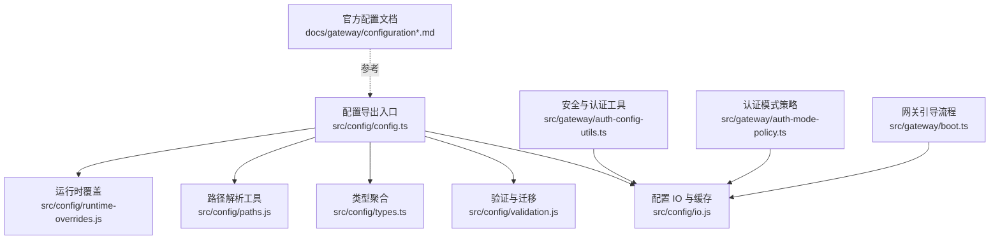
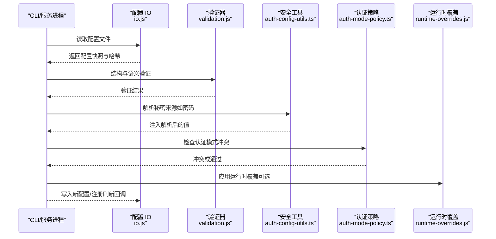
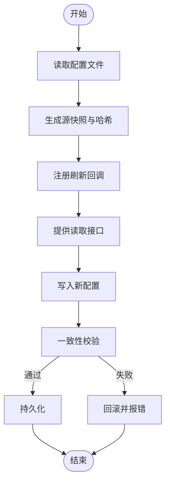
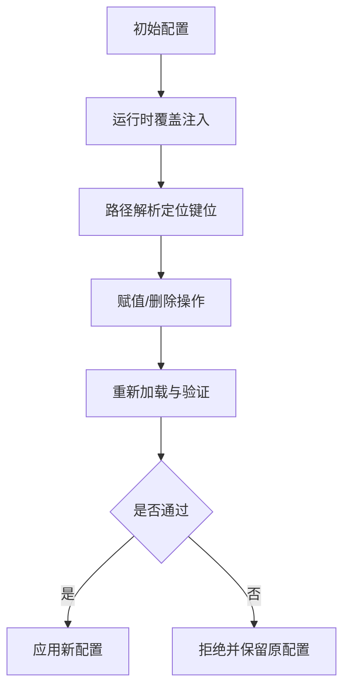
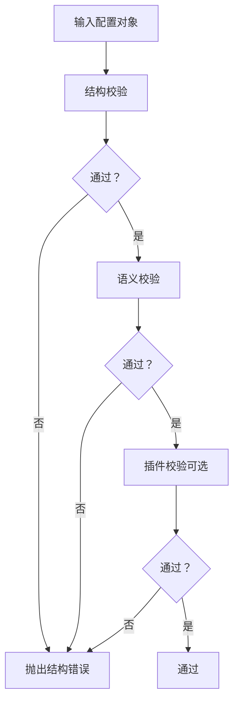
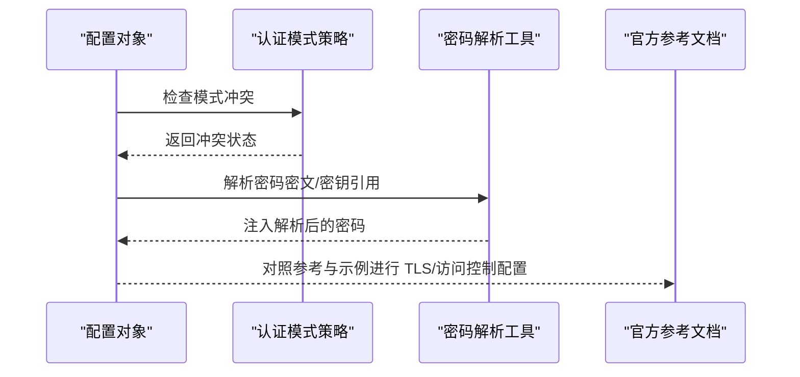
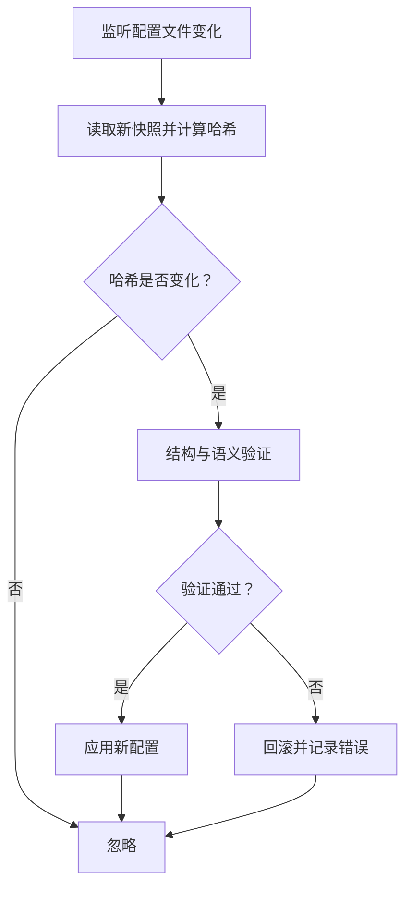
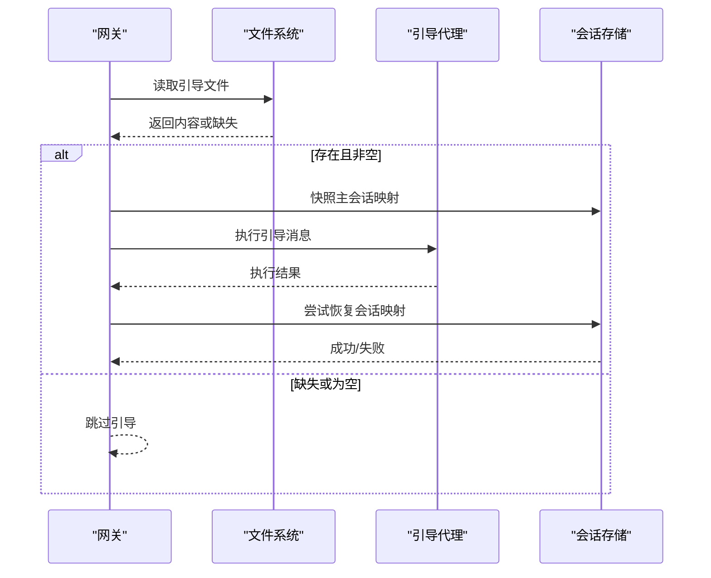
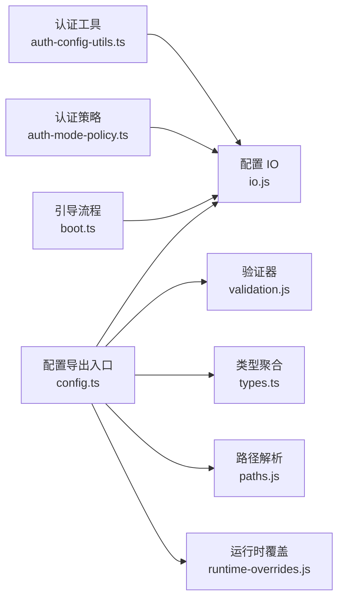

# 配置管理

<cite>
**本文引用的文件**
- [src/config/config.ts](file://src/config/config.ts)
- [src/config/io.js](file://src/config/io.js)
- [src/config/validation.js](file://src/config/validation.js)
- [src/config/types.ts](file://src/config/types.ts)
- [src/config/types.secrets.ts](file://src/config/types.secrets.ts)
- [src/config/paths.js](file://src/config/paths.js)
- [src/config/runtime-overrides.js](file://src/config/runtime-overrides.js)
- [src/gateway/auth-config-utils.ts](file://src/gateway/auth-config-utils.ts)
- [src/gateway/auth-mode-policy.ts](file://src/gateway/auth-mode-policy.ts)
- [src/gateway/boot.ts](file://src/gateway/boot.ts)
- [docs/gateway/configuration.md](file://docs/gateway/configuration.md)
- [docs/gateway/configuration-reference.md](file://docs/gateway/configuration-reference.md)
- [docs/gateway/configuration-examples.md](file://docs/gateway/configuration-examples.md)
</cite>

## 目录
1. [简介](#简介)
2. [项目结构](#项目结构)
3. [核心组件](#核心组件)
4. [架构总览](#架构总览)
5. [详细组件分析](#详细组件分析)
6. [依赖关系分析](#依赖关系分析)
7. [性能考量](#性能考量)
8. [故障排除指南](#故障排除指南)
9. [结论](#结论)
10. [附录](#附录)

## 简介
本文件面向 OpenClaw 网关的配置管理，系统性阐述配置文件格式、加载与验证机制、运行时解析与覆盖策略、热重载与回滚、安全配置（认证、TLS、访问控制）以及完整参数参考与最佳实践。内容基于仓库中的配置实现与官方文档，帮助开发者在不同部署场景下正确、安全地配置与维护网关。

## 项目结构
OpenClaw 的配置子系统主要由以下模块组成：
- 配置导出与入口：集中导出配置 IO、验证、类型与运行时覆盖能力
- 配置 IO 与缓存：负责配置文件读写、快照、哈希校验与刷新回调
- 验证与迁移：对配置对象进行结构与语义校验，并支持从旧版本迁移
- 路径解析与运行时覆盖：支持点路径定位、赋值、删除与运行时覆盖
- 安全与认证：密码/令牌解析、模式冲突检测、秘密来源解析
- 网关引导：在启动阶段执行一次性引导流程并进行会话映射快照与恢复

图表来源
- [src/config/config.ts:1-29](file://src/config/config.ts#L1-L29)
- [src/config/io.js](file://src/config/io.js)
- [src/config/validation.js](file://src/config/validation.js)
- [src/config/types.ts:1-36](file://src/config/types.ts#L1-L36)
- [src/config/paths.js](file://src/config/paths.js)
- [src/config/runtime-overrides.js](file://src/config/runtime-overrides.js)
- [src/gateway/auth-config-utils.ts:1-70](file://src/gateway/auth-config-utils.ts#L1-L70)
- [src/gateway/auth-mode-policy.ts:1-27](file://src/gateway/auth-mode-policy.ts#L1-L27)
- [src/gateway/boot.ts:1-204](file://src/gateway/boot.ts#L1-L204)
- [docs/gateway/configuration.md](file://docs/gateway/configuration.md)
- [docs/gateway/configuration-reference.md](file://docs/gateway/configuration-reference.md)
- [docs/gateway/configuration-examples.md](file://docs/gateway/configuration-examples.md)

章节来源
- [src/config/config.ts:1-29](file://src/config/config.ts#L1-L29)
- [src/config/io.js](file://src/config/io.js)
- [src/config/validation.js](file://src/config/validation.js)
- [src/config/types.ts:1-36](file://src/config/types.ts#L1-L36)
- [src/config/paths.js](file://src/config/paths.js)
- [src/config/runtime-overrides.js](file://src/config/runtime-overrides.js)
- [src/gateway/auth-config-utils.ts:1-70](file://src/gateway/auth-config-utils.ts#L1-L70)
- [src/gateway/auth-mode-policy.ts:1-27](file://src/gateway/auth-mode-policy.ts#L1-L27)
- [src/gateway/boot.ts:1-204](file://src/gateway/boot.ts#L1-L204)
- [docs/gateway/configuration.md](file://docs/gateway/configuration.md)
- [docs/gateway/configuration-reference.md](file://docs/gateway/configuration-reference.md)
- [docs/gateway/configuration-examples.md](file://docs/gateway/configuration-examples.md)

## 核心组件
- 配置导出入口：统一导出配置 IO、验证、类型与运行时覆盖等能力，便于上层使用
- 配置 IO 与缓存：提供配置文件读写、快照、哈希校验、刷新回调注册与运行时快照管理
- 验证与迁移：对配置对象进行结构与语义校验，并支持从旧版本迁移
- 路径解析与运行时覆盖：支持点路径定位、赋值、删除与运行时覆盖
- 安全与认证：密码/令牌解析、模式冲突检测、秘密来源解析
- 网关引导：在启动阶段执行一次性引导流程并进行会话映射快照与恢复

章节来源
- [src/config/config.ts:1-29](file://src/config/config.ts#L1-L29)
- [src/config/io.js](file://src/config/io.js)
- [src/config/validation.js](file://src/config/validation.js)
- [src/config/paths.js](file://src/config/paths.js)
- [src/config/runtime-overrides.js](file://src/config/runtime-overrides.js)
- [src/gateway/auth-config-utils.ts:1-70](file://src/gateway/auth-config-utils.ts#L1-L70)
- [src/gateway/auth-mode-policy.ts:1-27](file://src/gateway/auth-mode-policy.ts#L1-L27)
- [src/gateway/boot.ts:1-204](file://src/gateway/boot.ts#L1-L204)

## 架构总览
配置系统围绕“读取—解析—验证—应用—持久化”的闭环展开，同时支持运行时覆盖与热重载。安全配置通过秘密来源解析与认证模式策略确保敏感信息的安全与合规。

图表来源
- [src/config/io.js](file://src/config/io.js)
- [src/config/validation.js](file://src/config/validation.js)
- [src/gateway/auth-config-utils.ts:1-70](file://src/gateway/auth-config-utils.ts#L1-L70)
- [src/gateway/auth-mode-policy.ts:1-27](file://src/gateway/auth-mode-policy.ts#L1-L27)
- [src/config/runtime-overrides.js](file://src/config/runtime-overrides.js)

## 详细组件分析

### 配置文件格式与加载机制
- 文件格式：支持 JSON/JSON5 等格式，读取后生成快照并计算哈希，用于变更检测与热重载
- 加载流程：读取配置文件 → 生成源快照 → 计算哈希 → 注册刷新回调 → 提供读取接口
- 写入与持久化：写入新配置时进行一致性校验，必要时回滚以保证一致性

图表来源
- [src/config/io.js](file://src/config/io.js)

章节来源
- [src/config/io.js](file://src/config/io.js)

### 运行时配置解析与覆盖
- 默认值处理：通过运行时覆盖模块在不修改文件的前提下临时生效
- 环境变量覆盖：通过路径解析工具支持点路径定位与赋值，结合运行时覆盖实现按需覆盖
- 动态更新：注册刷新回调后，配置变更触发重新加载与验证，确保运行时一致性

图表来源
- [src/config/paths.js](file://src/config/paths.js)
- [src/config/runtime-overrides.js](file://src/config/runtime-overrides.js)

章节来源
- [src/config/paths.js](file://src/config/paths.js)
- [src/config/runtime-overrides.js](file://src/config/runtime-overrides.js)

### 配置验证规则
- 结构验证：确保配置对象符合预期字段与类型
- 语义验证：检查字段间的约束关系（如认证模式必须明确）
- 插件验证：在启用插件场景下，额外校验插件所需配置

图表来源
- [src/config/validation.js](file://src/config/validation.js)

章节来源
- [src/config/validation.js](file://src/config/validation.js)

### 安全配置选项
- 认证设置：支持密码与令牌两种模式；当同时配置两者时必须显式指定模式
- TLS 配置：通过官方文档提供的参考与示例进行配置
- 访问控制：结合网关与通道层的访问控制策略

图表来源
- [src/gateway/auth-mode-policy.ts:1-27](file://src/gateway/auth-mode-policy.ts#L1-L27)
- [src/gateway/auth-config-utils.ts:1-70](file://src/gateway/auth-config-utils.ts#L1-L70)
- [docs/gateway/configuration-reference.md](file://docs/gateway/configuration-reference.md)
- [docs/gateway/configuration-examples.md](file://docs/gateway/configuration-examples.md)

章节来源
- [src/gateway/auth-mode-policy.ts:1-27](file://src/gateway/auth-mode-policy.ts#L1-L27)
- [src/gateway/auth-config-utils.ts:1-70](file://src/gateway/auth-config-utils.ts#L1-L70)
- [docs/gateway/configuration-reference.md](file://docs/gateway/configuration-reference.md)
- [docs/gateway/configuration-examples.md](file://docs/gateway/configuration-examples.md)

### 配置热重载与回滚
- 变更检测：通过哈希比较判断配置是否发生变化
- 平滑重启：在验证通过后应用新配置，避免中断现有连接
- 回滚机制：验证失败时保持原配置不变，确保系统稳定

图表来源
- [src/config/io.js](file://src/config/io.js)
- [src/config/validation.js](file://src/config/validation.js)

章节来源
- [src/config/io.js](file://src/config/io.js)
- [src/config/validation.js](file://src/config/validation.js)

### 网关引导与会话映射
- 引导文件：工作区中存在特定引导文件时，网关在启动阶段执行一次性引导流程
- 会话映射快照：在执行引导前对主会话映射进行快照，执行完成后尝试恢复
- 失败处理：若引导或恢复失败，记录错误并返回失败状态

图表来源
- [src/gateway/boot.ts:1-204](file://src/gateway/boot.ts#L1-L204)

章节来源
- [src/gateway/boot.ts:1-204](file://src/gateway/boot.ts#L1-L204)

## 依赖关系分析
- 配置导出入口聚合了 IO、验证、类型与运行时覆盖模块，形成统一的配置 API
- 安全与认证工具依赖于秘密来源解析与配置对象，确保密码与令牌解析的安全性
- 网关引导流程依赖会话存储与配置对象，保障启动阶段的稳定性

图表来源
- [src/config/config.ts:1-29](file://src/config/config.ts#L1-L29)
- [src/config/io.js](file://src/config/io.js)
- [src/config/validation.js](file://src/config/validation.js)
- [src/config/types.ts:1-36](file://src/config/types.ts#L1-L36)
- [src/config/paths.js](file://src/config/paths.js)
- [src/config/runtime-overrides.js](file://src/config/runtime-overrides.js)
- [src/gateway/auth-config-utils.ts:1-70](file://src/gateway/auth-config-utils.ts#L1-L70)
- [src/gateway/auth-mode-policy.ts:1-27](file://src/gateway/auth-mode-policy.ts#L1-L27)
- [src/gateway/boot.ts:1-204](file://src/gateway/boot.ts#L1-L204)

章节来源
- [src/config/config.ts:1-29](file://src/config/config.ts#L1-L29)
- [src/config/io.js](file://src/config/io.js)
- [src/config/validation.js](file://src/config/validation.js)
- [src/config/types.ts:1-36](file://src/config/types.ts#L1-L36)
- [src/config/paths.js](file://src/config/paths.js)
- [src/config/runtime-overrides.js](file://src/config/runtime-overrides.js)
- [src/gateway/auth-config-utils.ts:1-70](file://src/gateway/auth-config-utils.ts#L1-L70)
- [src/gateway/auth-mode-policy.ts:1-27](file://src/gateway/auth-mode-policy.ts#L1-L27)
- [src/gateway/boot.ts:1-204](file://src/gateway/boot.ts#L1-L204)

## 性能考量
- 配置读写：采用快照与哈希机制，减少重复解析成本
- 并发与批处理：秘密来源解析支持并发与批量限制，避免资源争用
- 验证开销：在热重载场景下尽量复用已验证的结构，仅做必要语义校验
- 启动阶段：引导流程在启动时执行，避免影响运行时吞吐

## 故障排除指南
- 配置冲突：当同时配置密码与令牌而未指定模式时，系统会抛出明确错误提示
- 密码解析失败：检查密码密文/密钥引用是否正确，确认解析后值可用
- 热重载失败：验证失败时会自动回滚，检查日志定位具体问题
- 引导失败：检查引导文件是否存在且非空，关注会话映射恢复失败的日志

章节来源
- [src/gateway/auth-mode-policy.ts:1-27](file://src/gateway/auth-mode-policy.ts#L1-L27)
- [src/gateway/auth-config-utils.ts:1-70](file://src/gateway/auth-config-utils.ts#L1-L70)
- [src/config/io.js](file://src/config/io.js)
- [src/gateway/boot.ts:1-204](file://src/gateway/boot.ts#L1-L204)

## 结论
OpenClaw 的配置管理以“可验证、可覆盖、可热重载、可回滚”为核心目标，结合安全与认证策略，为多场景部署提供了稳健的配置基础。遵循本文档的最佳实践与参考示例，可在保证安全性的前提下高效完成配置与运维。

## 附录

### 配置参数参考（概述）
- 基础参数：工作目录、日志级别、网络端口等
- 安全参数：认证模式、密码/令牌、TLS 证书与密钥、访问控制列表
- 插件与通道：插件清单、通道适配器与凭据
- 秘密来源：环境变量、文件、执行命令等多源解析与并发限制
- 运行时覆盖：通过路径定位与赋值实现按需覆盖

章节来源
- [docs/gateway/configuration-reference.md](file://docs/gateway/configuration-reference.md)
- [src/config/types.secrets.ts:1-225](file://src/config/types.secrets.ts#L1-L225)
- [src/config/types.ts:1-36](file://src/config/types.ts#L1-L36)

### 配置最佳实践
- 明确认证模式：同时配置密码与令牌时必须显式指定模式
- 使用秘密来源：优先使用环境变量/文件/执行命令等受控来源
- 分层配置：通过运行时覆盖实现环境差异化，避免直接修改生产配置
- 热重载策略：在变更前先本地验证，变更后观察系统状态

章节来源
- [src/gateway/auth-mode-policy.ts:1-27](file://src/gateway/auth-mode-policy.ts#L1-L27)
- [src/config/runtime-overrides.js](file://src/config/runtime-overrides.js)
- [docs/gateway/configuration.md](file://docs/gateway/configuration.md)

### 配置模板与示例
- 官方示例：参考官方配置示例文档，覆盖常见部署场景
- TLS 与访问控制：参考官方参考文档中的 TLS 与访问控制示例

章节来源
- [docs/gateway/configuration-examples.md](file://docs/gateway/configuration-examples.md)
- [docs/gateway/configuration-reference.md](file://docs/gateway/configuration-reference.md)