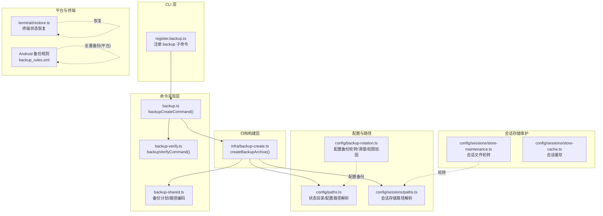
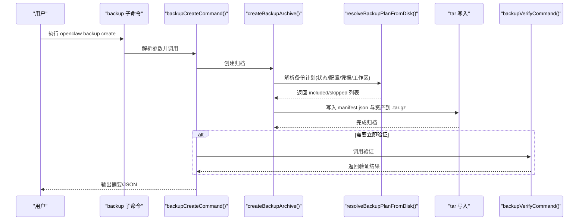
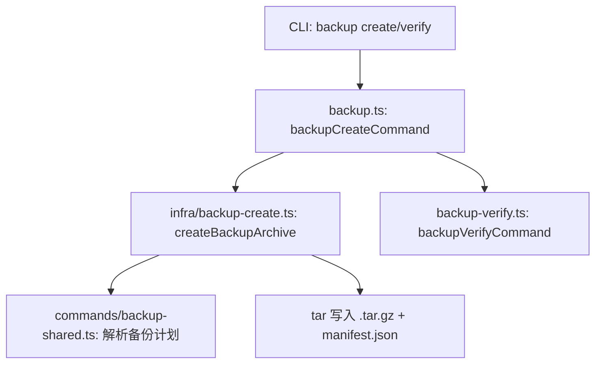
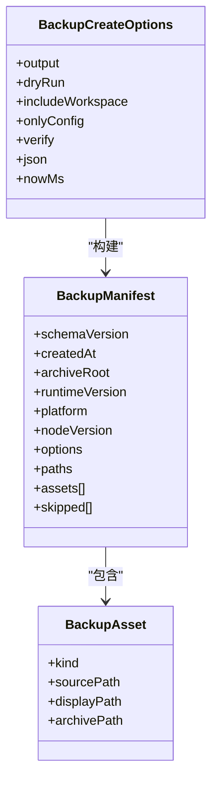
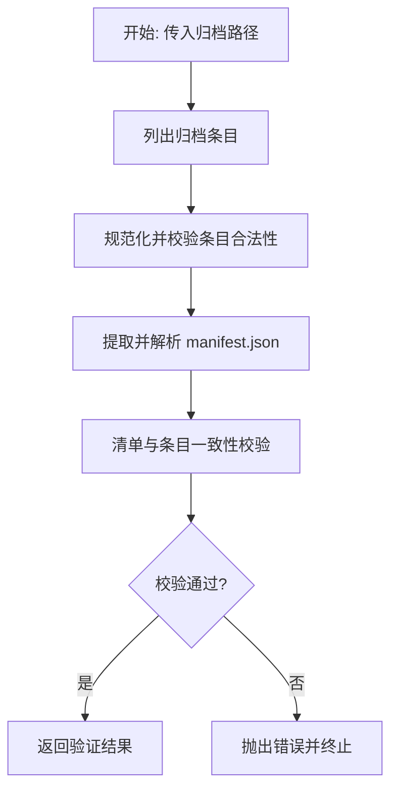
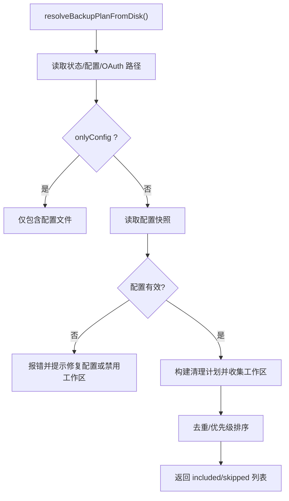
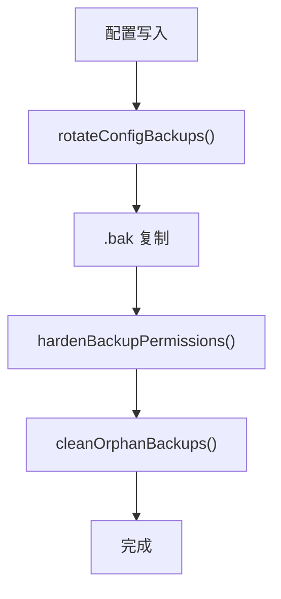
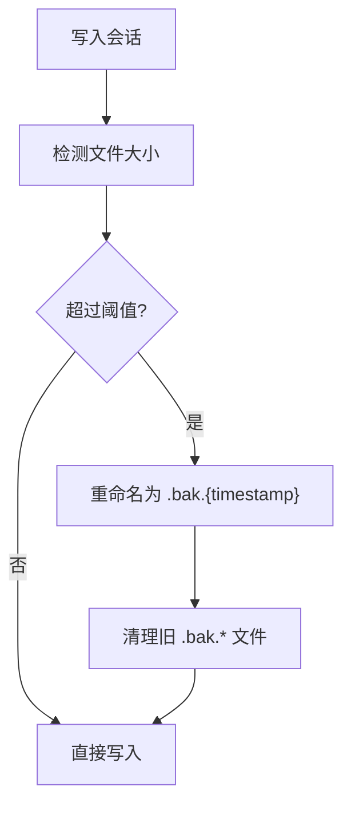
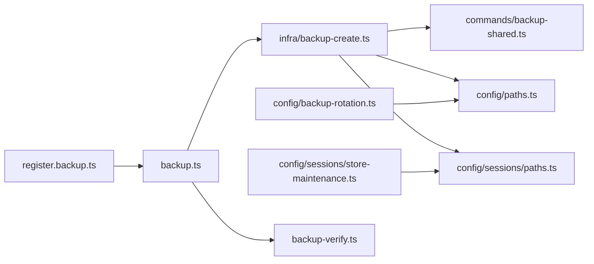

# 备份和恢复

<cite>
**本文引用的文件**
- [docs/cli/backup.md](file://docs/cli/backup.md)
- [src/cli/program/register.backup.ts](file://src/cli/program/register.backup.ts)
- [src/commands/backup.ts](file://src/commands/backup.ts)
- [src/commands/backup-verify.ts](file://src/commands/backup-verify.ts)
- [src/commands/backup-shared.ts](file://src/commands/backup-shared.ts)
- [src/infra/backup-create.ts](file://src/infra/backup-create.ts)
- [src/config/backup-rotation.ts](file://src/config/backup-rotation.ts)
- [src/config/paths.ts](file://src/config/paths.ts)
- [src/config/sessions/store-maintenance.ts](file://src/config/sessions/store-maintenance.ts)
- [src/config/sessions/store-cache.ts](file://src/config/sessions/store-cache.ts)
- [src/config/sessions/paths.ts](file://src/config/sessions/paths.ts)
- [src/terminal/restore.ts](file://src/terminal/restore.ts)
- [apps/android/app/src/main/res/xml/backup_rules.xml](file://apps/android/app/src/main/res/xml/backup_rules.xml)
</cite>

## 目录
1. [简介](#简介)
2. [项目结构](#项目结构)
3. [核心组件](#核心组件)
4. [架构总览](#架构总览)
5. [详细组件分析](#详细组件分析)
6. [依赖关系分析](#依赖关系分析)
7. [性能考量](#性能考量)
8. [故障排查指南](#故障排查指南)
9. [结论](#结论)
10. [附录](#附录)

## 简介
本文件面向 OpenClaw 的备份与恢复体系，系统化阐述备份策略设计（全量为主）、备份内容与结构、存储位置与格式、自动化与定时任务、恢复流程与验证、版本升级时的数据迁移与兼容性处理，以及灾难恢复与业务连续性保障。OpenClaw 提供基于本地归档的“全量备份”能力，并通过严格的清单校验确保可恢复性；同时内置配置文件的循环备份轮转与权限加固机制，以提升运维可靠性。

## 项目结构
围绕备份与恢复的关键代码分布在 CLI 命令层、命令实现层、归档构建层、共享逻辑层、配置与路径解析层、会话存储维护层、终端状态恢复工具，以及 Android 平台的全量备份规则声明中。

**图表来源**
- [src/cli/program/register.backup.ts:1-93](file://src/cli/program/register.backup.ts#L1-L93)
- [src/commands/backup.ts:1-32](file://src/commands/backup.ts#L1-L32)
- [src/commands/backup-verify.ts:1-325](file://src/commands/backup-verify.ts#L1-L325)
- [src/commands/backup-shared.ts:1-255](file://src/commands/backup-shared.ts#L1-L255)
- [src/infra/backup-create.ts:1-369](file://src/infra/backup-create.ts#L1-L369)
- [src/config/backup-rotation.ts:1-126](file://src/config/backup-rotation.ts#L1-L126)
- [src/config/paths.ts:39-194](file://src/config/paths.ts#L39-L194)
- [src/config/sessions/paths.ts:279-307](file://src/config/sessions/paths.ts#L279-L307)
- [src/config/sessions/store-maintenance.ts:270-327](file://src/config/sessions/store-maintenance.ts#L270-L327)
- [src/config/sessions/store-cache.ts:1-81](file://src/config/sessions/store-cache.ts#L1-L81)
- [apps/android/app/src/main/res/xml/backup_rules.xml:1-4](file://apps/android/app/src/main/res/xml/backup_rules.xml#L1-L4)
- [src/terminal/restore.ts:1-69](file://src/terminal/restore.ts#L1-L69)

**章节来源**
- [src/cli/program/register.backup.ts:1-93](file://src/cli/program/register.backup.ts#L1-L93)
- [src/commands/backup.ts:1-32](file://src/commands/backup.ts#L1-L32)
- [src/commands/backup-verify.ts:1-325](file://src/commands/backup-verify.ts#L1-L325)
- [src/commands/backup-shared.ts:1-255](file://src/commands/backup-shared.ts#L1-L255)
- [src/infra/backup-create.ts:1-369](file://src/infra/backup-create.ts#L1-L369)
- [src/config/backup-rotation.ts:1-126](file://src/config/backup-rotation.ts#L1-L126)
- [src/config/paths.ts:39-194](file://src/config/paths.ts#L39-L194)
- [src/config/sessions/paths.ts:279-307](file://src/config/sessions/paths.ts#L279-L307)
- [src/config/sessions/store-maintenance.ts:270-327](file://src/config/sessions/store-maintenance.ts#L270-L327)
- [src/config/sessions/store-cache.ts:1-81](file://src/config/sessions/store-cache.ts#L1-L81)
- [apps/android/app/src/main/res/xml/backup_rules.xml:1-4](file://apps/android/app/src/main/res/xml/backup_rules.xml#L1-L4)
- [src/terminal/restore.ts:1-69](file://src/terminal/restore.ts#L1-L69)

## 核心组件
- 备份 CLI 子命令：提供“创建备份”和“验证备份”的子命令入口，支持输出目录、干运行、仅配置备份、跳过工作区等选项。
- 备份创建器：负责生成时间戳命名的 .tar.gz 归档，写入清单 manifest.json，并在必要时进行硬链接发布或回退复制。
- 备份验证器：对归档进行结构与清单一致性校验，拒绝路径穿越、重复条目、缺失清单或资产等异常。
- 备份共享逻辑：从磁盘解析备份计划，合并去重，计算归档内相对路径，避免自包含与覆盖。
- 配置备份轮转：在配置写入前后自动旋转 .bak 循环备份、加固权限、清理孤儿 .bak 文件。
- 会话存储维护：按大小阈值轮转 sessions.json.bak.*，保留最近若干份，配合缓存与序列化缓存提升性能。
- 终端状态恢复：在异常退出或安装流程中断时恢复终端原始状态，保证用户体验与安全。
- Android 平台全量备份规则：声明应用可参与系统级全量备份的包含范围。

**章节来源**
- [docs/cli/backup.md:1-77](file://docs/cli/backup.md#L1-L77)
- [src/cli/program/register.backup.ts:10-93](file://src/cli/program/register.backup.ts#L10-L93)
- [src/commands/backup.ts:11-32](file://src/commands/backup.ts#L11-L32)
- [src/commands/backup-verify.ts:279-325](file://src/commands/backup-verify.ts#L279-L325)
- [src/commands/backup-shared.ts:106-255](file://src/commands/backup-shared.ts#L106-L255)
- [src/infra/backup-create.ts:272-369](file://src/infra/backup-create.ts#L272-L369)
- [src/config/backup-rotation.ts:16-126](file://src/config/backup-rotation.ts#L16-L126)
- [src/config/sessions/store-maintenance.ts:270-327](file://src/config/sessions/store-maintenance.ts#L270-L327)
- [src/config/sessions/store-cache.ts:1-81](file://src/config/sessions/store-cache.ts#L1-L81)
- [src/terminal/restore.ts:32-69](file://src/terminal/restore.ts#L32-L69)
- [apps/android/app/src/main/res/xml/backup_rules.xml:1-4](file://apps/android/app/src/main/res/xml/backup_rules.xml#L1-L4)

## 架构总览
OpenClaw 的备份与恢复采用“CLI → 命令 → 归档构建 → 清单校验”的分层设计。备份创建阶段生成 .tar.gz，清单记录归档根、资产列表与被跳过的项；验证阶段通过 tar 解析与清单比对完成完整性检查。配置写入时触发轮转与权限加固，会话存储按阈值轮转并清理旧备份。

**图表来源**
- [src/cli/program/register.backup.ts:53-64](file://src/cli/program/register.backup.ts#L53-L64)
- [src/commands/backup.ts:11-32](file://src/commands/backup.ts#L11-L32)
- [src/infra/backup-create.ts:272-369](file://src/infra/backup-create.ts#L272-L369)
- [src/commands/backup-shared.ts:106-255](file://src/commands/backup-shared.ts#L106-L255)
- [src/commands/backup-verify.ts:279-325](file://src/commands/backup-verify.ts#L279-L325)

## 详细组件分析

### 备份 CLI 与命令
- 注册 backup 子命令，提供 create 与 verify 子命令，支持输出目录、JSON、干运行、验证、仅配置、排除工作区等选项。
- backupCreateCommand 负责调用归档创建与可选的验证输出；backupVerifyCommand 对归档进行严格校验。

**图表来源**
- [src/cli/program/register.backup.ts:10-93](file://src/cli/program/register.backup.ts#L10-L93)
- [src/commands/backup.ts:11-32](file://src/commands/backup.ts#L11-L32)
- [src/commands/backup-verify.ts:279-325](file://src/commands/backup-verify.ts#L279-L325)
- [src/commands/backup-shared.ts:106-255](file://src/commands/backup-shared.ts#L106-L255)
- [src/infra/backup-create.ts:272-369](file://src/infra/backup-create.ts#L272-L369)

**章节来源**
- [src/cli/program/register.backup.ts:10-93](file://src/cli/program/register.backup.ts#L10-L93)
- [src/commands/backup.ts:11-32](file://src/commands/backup.ts#L11-L32)
- [src/commands/backup-verify.ts:279-325](file://src/commands/backup-verify.ts#L279-L325)

### 备份创建与归档结构
- 归档命名：使用时间戳作为根目录名，扩展名为 .tar.gz。
- 清单结构：包含 schemaVersion、createdAt、archiveRoot、runtimeVersion、platform、nodeVersion、选项、路径信息、资产列表与跳过的项。
- 资产路径编码：绝对路径在归档内按 posix 编码，Windows 盘符与 POSIX 路径分别映射，避免跨平台冲突。
- 输出策略：默认输出到当前目录或用户家目录，拒绝写入到源路径内部；支持临时文件与硬链接发布，不支持硬链接时回退排他复制。
- 跳过策略：当多个源路径存在包含关系时，优先保留较大目录，其余被标记为“被覆盖”。

**图表来源**
- [src/infra/backup-create.ts:18-76](file://src/infra/backup-create.ts#L18-L76)
- [src/commands/backup-shared.ts:16-38](file://src/commands/backup-shared.ts#L16-L38)

**章节来源**
- [src/infra/backup-create.ts:78-168](file://src/infra/backup-create.ts#L78-L168)
- [src/commands/backup-shared.ts:60-84](file://src/commands/backup-shared.ts#L60-L84)

### 备份验证流程
- 解析归档条目，拒绝空归档、重复条目、路径穿越、非根清单等。
- 校验清单与条目一致性：清单必须唯一且位于 archiveRoot 下，资产路径必须位于 payload 下，且对应条目存在。
- 输出结果包含归档路径、archiveRoot、创建时间、运行时版本、资产数与扫描条目数。

**图表来源**
- [src/commands/backup-verify.ts:173-325](file://src/commands/backup-verify.ts#L173-L325)

**章节来源**
- [src/commands/backup-verify.ts:218-253](file://src/commands/backup-verify.ts#L218-L253)

### 备份计划与路径解析
- 从磁盘解析状态目录、配置路径、OAuth 凭据目录与工作区目录。
- 当启用工作区时，若配置无效则拒绝继续解析工作区，避免不可靠的备份。
- 去重与优先级：按规范化路径长度、类型优先级排序，避免重复与覆盖。

**图表来源**
- [src/commands/backup-shared.ts:106-255](file://src/commands/backup-shared.ts#L106-L255)

**章节来源**
- [src/commands/backup-shared.ts:158-163](file://src/commands/backup-shared.ts#L158-L163)

### 配置文件备份轮转与权限加固
- 轮转：最多保留 N 个 .bak 循环备份，新写入后依次右移，最高位丢弃。
- 权限加固：对所有 .bak 文件设置 owner-only 权限，确保敏感配置安全。
- 清理孤儿：删除不在轮转范围内的 .bak.* 文件，避免历史残留。

**图表来源**
- [src/config/backup-rotation.ts:16-126](file://src/config/backup-rotation.ts#L16-L126)

**章节来源**
- [src/config/backup-rotation.ts:16-126](file://src/config/backup-rotation.ts#L16-L126)

### 会话存储轮转与缓存
- 轮转：超过阈值时将当前 sessions.json 重命名为 sessions.json.bak.{timestamp}，清理旧备份，保留最近若干份。
- 缓存：序列化缓存与对象缓存，按 TTL 与 mtime/size 校验有效性，减少 IO。

**图表来源**
- [src/config/sessions/store-maintenance.ts:270-327](file://src/config/sessions/store-maintenance.ts#L270-L327)
- [src/config/sessions/store-cache.ts:41-81](file://src/config/sessions/store-cache.ts#L41-L81)

**章节来源**
- [src/config/sessions/store-maintenance.ts:270-327](file://src/config/sessions/store-maintenance.ts#L270-L327)
- [src/config/sessions/store-cache.ts:1-81](file://src/config/sessions/store-cache.ts#L1-L81)

### 终端状态恢复
- 在异常或中断场景下恢复进度行、原始模式、stdin 暂停状态与 stdout 控制序列，避免终端污染影响后续交互。

**章节来源**
- [src/terminal/restore.ts:32-69](file://src/terminal/restore.ts#L32-L69)

### Android 平台全量备份
- 声明包含应用文件域下的全部内容，便于系统级全量备份集成。

**章节来源**
- [apps/android/app/src/main/res/xml/backup_rules.xml:1-4](file://apps/android/app/src/main/res/xml/backup_rules.xml#L1-L4)

## 依赖关系分析
- CLI 依赖命令实现；命令实现依赖归档构建与共享逻辑；归档构建依赖路径解析与会话存储路径；配置轮转与会话轮转分别作用于配置与会话存储，互不干扰。
- 备份验证独立于创建流程，但依赖归档结构与清单约定。

**图表来源**
- [src/cli/program/register.backup.ts:1-93](file://src/cli/program/register.backup.ts#L1-L93)
- [src/commands/backup.ts:1-32](file://src/commands/backup.ts#L1-L32)
- [src/commands/backup-verify.ts:1-325](file://src/commands/backup-verify.ts#L1-L325)
- [src/commands/backup-shared.ts:1-255](file://src/commands/backup-shared.ts#L1-L255)
- [src/infra/backup-create.ts:1-369](file://src/infra/backup-create.ts#L1-L369)
- [src/config/backup-rotation.ts:1-126](file://src/config/backup-rotation.ts#L1-L126)
- [src/config/paths.ts:39-194](file://src/config/paths.ts#L39-L194)
- [src/config/sessions/paths.ts:279-307](file://src/config/sessions/paths.ts#L279-L307)
- [src/config/sessions/store-maintenance.ts:270-327](file://src/config/sessions/store-maintenance.ts#L270-L327)

**章节来源**
- 同上

## 性能考量
- 归档大小主要由工作区决定；可通过“仅配置”“排除工作区”降低体积与压缩时间。
- 验证阶段需要重新扫描归档，建议在生产环境仅在必要时开启。
- 硬链接发布优先，不支持时回退排他复制，避免覆盖风险。

[本节为通用指导，无需具体文件分析]

## 故障排查指南
- 归档为空：检查输入路径与权限，确认 tar 写入是否成功。
- 清单缺失或非法：确认 manifest.json 是否位于归档根且仅有一个，路径使用正斜杠且无穿越。
- 资产缺失：核对清单中的 archivePath 是否存在于归档，或是否被覆盖。
- 输出覆盖保护：若目标已存在，系统拒绝覆盖；请更换输出路径或删除已有文件。
- 配置无效导致无法发现工作区：修复配置或使用“排除工作区”选项进行部分备份。
- 终端异常：调用终端恢复函数，确保控制序列与 raw 模式复位。

**章节来源**
- [src/commands/backup-verify.ts:284-302](file://src/commands/backup-verify.ts#L284-L302)
- [src/infra/backup-create.ts:113-124](file://src/infra/backup-create.ts#L113-L124)
- [src/commands/backup-shared.ts:158-163](file://src/commands/backup-shared.ts#L158-L163)
- [src/terminal/restore.ts:32-69](file://src/terminal/restore.ts#L32-L69)

## 结论
OpenClaw 的备份与恢复以“全量本地归档 + 清单校验”为核心，辅以配置文件轮转与权限加固、会话存储轮转与缓存，形成可靠的数据保护链。通过 CLI 提供灵活的备份策略选择与即时验证能力，满足日常运维与应急恢复需求。建议结合自动化脚本与定时任务定期执行备份，并在升级与迁移过程中优先进行全量备份与验证。

[本节为总结，无需具体文件分析]

## 附录

### 备份策略与内容
- 策略：以“全量备份”为主，提供“仅配置”“排除工作区”等变体，满足不同场景。
- 内容：状态目录、活动配置文件、OAuth/凭据目录、工作区目录（可选）。
- 结构：归档根为时间戳目录，payload 存放解码后的绝对路径，清单记录路径与资产。

**章节来源**
- [docs/cli/backup.md:34-77](file://docs/cli/backup.md#L34-L77)
- [src/commands/backup-shared.ts:60-84](file://src/commands/backup-shared.ts#L60-L84)
- [src/commands/backup-shared.ts:106-255](file://src/commands/backup-shared.ts#L106-L255)

### 存储位置与格式
- 默认输出：当前工作目录或用户家目录；若当前目录位于源树内，则默认改至家目录。
- 格式：.tar.gz，包含 manifest.json 与 payload。
- 平台：Android 支持系统级全量备份包含规则。

**章节来源**
- [docs/cli/backup.md:25-31](file://docs/cli/backup.md#L25-L31)
- [src/infra/backup-create.ts:78-111](file://src/infra/backup-create.ts#L78-L111)
- [apps/android/app/src/main/res/xml/backup_rules.xml:1-4](file://apps/android/app/src/main/res/xml/backup_rules.xml#L1-L4)

### 自动化脚本与定时任务
- 建议：在系统定时任务中调用备份 CLI，结合“仅配置”或“排除工作区”以降低开销。
- 注意：避免与正在运行的服务同时写入同一目录，必要时使用独立备份卷或网络存储挂载点。

[本节为通用指导，无需具体文件分析]

### 恢复流程与验证
- 恢复前准备：确认目标环境与 OpenClaw 版本兼容，准备好恢复介质。
- 恢复操作：将归档解压至目标位置，确保清单与资产一致。
- 验证步骤：使用验证命令检查清单与条目一致性，确认资产存在且未被篡改。
- 终端恢复：如遇中断，调用终端恢复函数恢复交互环境。

**章节来源**
- [src/commands/backup-verify.ts:279-325](file://src/commands/backup-verify.ts#L279-L325)
- [src/terminal/restore.ts:32-69](file://src/terminal/restore.ts#L32-L69)

### 版本升级与数据迁移
- 升级前：执行一次全量备份并验证。
- 迁移策略：遵循配置与路径解析规则，确保状态目录与配置路径正确；如需迁移，先备份再迁移，最后验证。
- 兼容性：关注清单 schemaVersion 与平台信息，确保新版本可识别旧版归档。

**章节来源**
- [src/commands/backup-verify.ts:97-171](file://src/commands/backup-verify.ts#L97-L171)
- [src/config/paths.ts:60-89](file://src/config/paths.ts#L60-L89)

### 灾难恢复与业务连续性
- 多地备份：本地与远端（如网络存储）并行保存，定期校验。
- 快速验证：在灾备演练中使用验证命令快速确认可恢复性。
- 终端恢复：异常中断时恢复终端状态，避免影响后续恢复流程。

**章节来源**
- [src/commands/backup-verify.ts:279-325](file://src/commands/backup-verify.ts#L279-L325)
- [src/terminal/restore.ts:32-69](file://src/terminal/restore.ts#L32-L69)