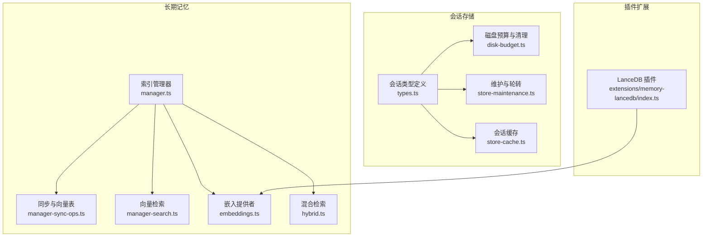
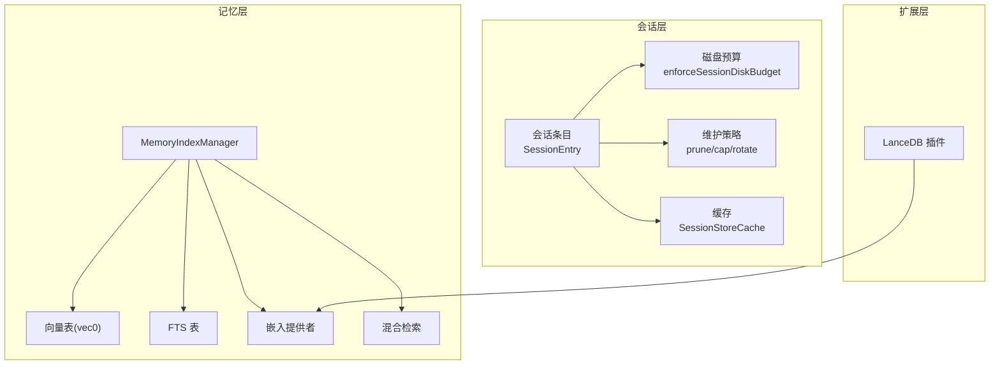
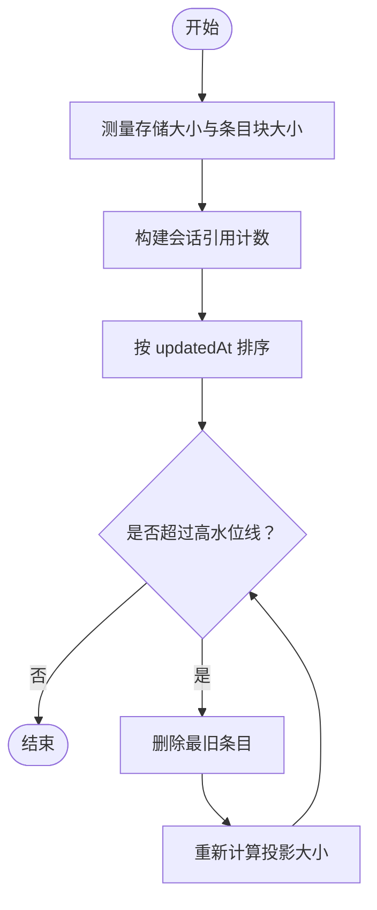
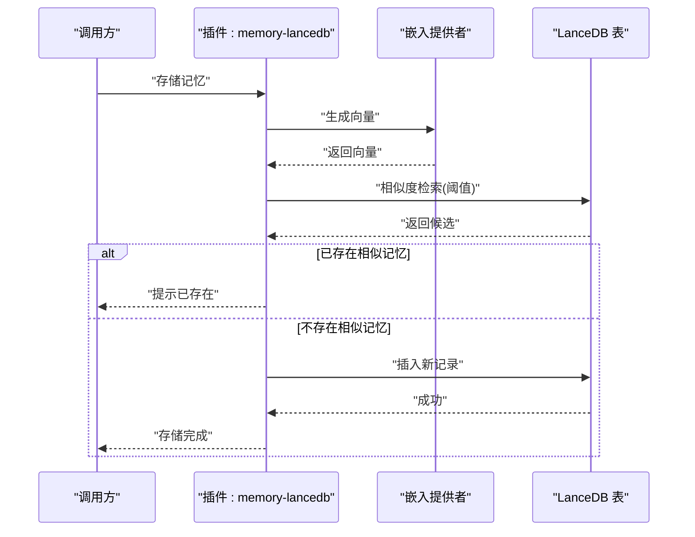
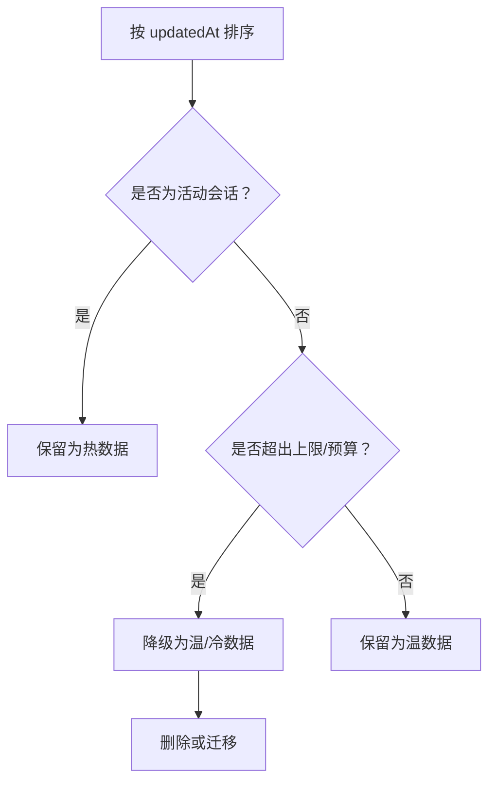
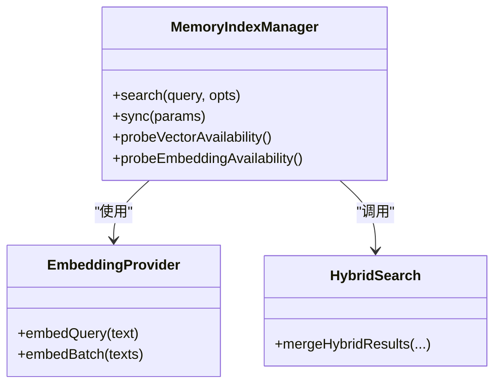
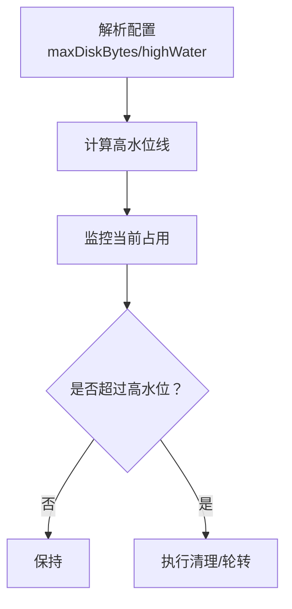
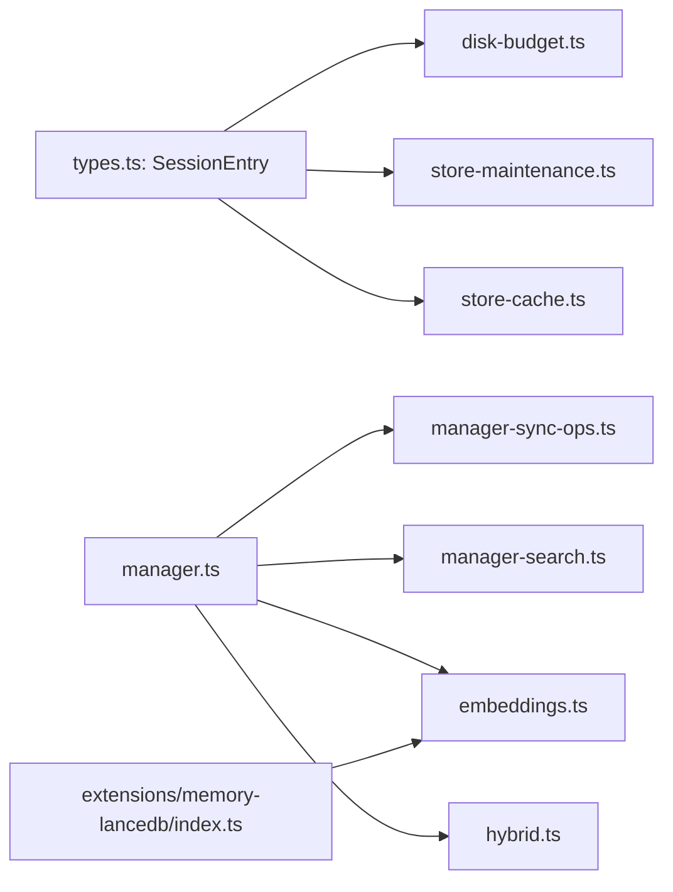

# 存储优化

<cite>
**本文引用的文件**
- [disk-budget.ts](file://src/config/sessions/disk-budget.ts)
- [store-maintenance.ts](file://src/config/sessions/store-maintenance.ts)
- [store-cache.ts](file://src/config/sessions/store-cache.ts)
- [types.ts](file://src/config/sessions/types.ts)
- [session-updates.ts](file://src/auto-reply/reply/session-updates.ts)
- [memory-flush.ts](file://src/auto-reply/reply/memory-flush.ts)
- [manager.ts](file://src/memory/manager.ts)
- [manager-sync-ops.ts](file://src/memory/manager-sync-ops.ts)
- [manager-search.ts](file://src/memory/manager-search.ts)
- [embeddings.ts](file://src/memory/embeddings.ts)
- [hybrid.ts](file://src/memory/hybrid.ts)
- [index.ts](file://extensions/memory-lancedb/index.ts)
</cite>

## 目录
1. [简介](#简介)
2. [项目结构](#项目结构)
3. [核心组件](#核心组件)
4. [架构总览](#架构总览)
5. [详细组件分析](#详细组件分析)
6. [依赖关系分析](#依赖关系分析)
7. [性能考量](#性能考量)
8. [故障排查指南](#故障排查指南)
9. [结论](#结论)
10. [附录](#附录)

## 简介
本文件系统性梳理 OpenClaw 的存储优化技术，围绕“会话数据压缩与存储格式优化”“数据去重与共享存储”“存储分层（热/温/冷）策略”“数据库优化与索引策略”“容量规划与扩展”“性能监控与容量管理工具”等主题展开，结合代码级实现细节，提供可操作的实践建议与可视化图示。

## 项目结构
OpenClaw 的存储优化涉及会话存储（sessions）、长期记忆（memory）与插件扩展（如 LanceDB）。关键模块分布如下：
- 会话存储：维护会话条目、磁盘配额、清理与轮转
- 长期记忆：SQLite 向量检索、关键词检索、混合检索、嵌入缓存与批处理
- 插件扩展：LanceDB 向量库与 OpenAI 嵌入，支持自动回忆与捕获

**图表来源**
- [types.ts:68-171](file://src/config/sessions/types.ts#L68-L171)
- [disk-budget.ts:188-376](file://src/config/sessions/disk-budget.ts#L188-L376)
- [store-maintenance.ts:130-328](file://src/config/sessions/store-maintenance.ts#L130-L328)
- [store-cache.ts:1-81](file://src/config/sessions/store-cache.ts#L1-L81)
- [manager.ts:61-800](file://src/memory/manager.ts#L61-L800)
- [manager-sync-ops.ts:168-274](file://src/memory/manager-sync-ops.ts#L168-L274)
- [manager-search.ts:20-69](file://src/memory/manager-search.ts#L20-L69)
- [embeddings.ts:168-288](file://src/memory/embeddings.ts#L168-L288)
- [hybrid.ts:57-156](file://src/memory/hybrid.ts#L57-L156)
- [index.ts:119-157](file://extensions/memory-lancedb/index.ts#L119-L157)

**章节来源**
- [types.ts:68-171](file://src/config/sessions/types.ts#L68-L171)
- [disk-budget.ts:188-376](file://src/config/sessions/disk-budget.ts#L188-L376)
- [store-maintenance.ts:130-328](file://src/config/sessions/store-maintenance.ts#L130-L328)
- [store-cache.ts:1-81](file://src/config/sessions/store-cache.ts#L1-L81)
- [manager.ts:61-800](file://src/memory/manager.ts#L61-L800)
- [manager-sync-ops.ts:168-274](file://src/memory/manager-sync-ops.ts#L168-L274)
- [manager-search.ts:20-69](file://src/memory/manager-search.ts#L20-L69)
- [embeddings.ts:168-288](file://src/memory/embeddings.ts#L168-L288)
- [hybrid.ts:57-156](file://src/memory/hybrid.ts#L57-L156)
- [index.ts:119-157](file://extensions/memory-lancedb/index.ts#L119-L157)

## 核心组件
- 会话存储与维护
  - 会话条目结构与字段语义（时间戳、令牌统计、压缩计数、刷新标记等）
  - 磁盘预算控制（最大值、高水位线、按修改时间清理、按引用计数删除）
  - 维护策略（过期清理、条目上限裁剪、文件轮转）
  - 会话缓存（对象与序列化缓存，带 TTL 与元信息校验）
- 长期记忆与检索
  - SQLite 向量检索（sqlite-vec 扩展），关键词检索（FTS），混合检索（向量+关键词加权）
  - 嵌入提供者（OpenAI、本地 node-llama-cpp、Gemini、Voyage、Mistral、Ollama）
  - 搜索结果后处理（MMR 多样性重排、时间衰减）
- 插件扩展（LanceDB）
  - 向量搜索、相似度映射、去重检查、自动回忆与捕获

**章节来源**
- [types.ts:68-171](file://src/config/sessions/types.ts#L68-L171)
- [disk-budget.ts:188-376](file://src/config/sessions/disk-budget.ts#L188-L376)
- [store-maintenance.ts:130-328](file://src/config/sessions/store-maintenance.ts#L130-L328)
- [store-cache.ts:1-81](file://src/config/sessions/store-cache.ts#L1-L81)
- [manager.ts:61-800](file://src/memory/manager.ts#L61-L800)
- [embeddings.ts:168-288](file://src/memory/embeddings.ts#L168-L288)
- [hybrid.ts:57-156](file://src/memory/hybrid.ts#L57-L156)
- [index.ts:119-157](file://extensions/memory-lancedb/index.ts#L119-L157)

## 架构总览
OpenClaw 的存储优化采用“会话层 + 记忆层 + 扩展层”的分层设计：
- 会话层：以 JSON 文件为主，辅以缓存与磁盘预算控制，确保会话数据的可读写与体积可控
- 记忆层：基于 SQLite 的向量与关键词检索，支持混合检索与批处理，降低嵌入成本
- 扩展层：通过插件接入 LanceDB 等外部向量库，实现更强大的长期记忆能力

**图表来源**
- [types.ts:68-171](file://src/config/sessions/types.ts#L68-L171)
- [disk-budget.ts:188-376](file://src/config/sessions/disk-budget.ts#L188-L376)
- [store-maintenance.ts:130-328](file://src/config/sessions/store-maintenance.ts#L130-L328)
- [store-cache.ts:1-81](file://src/config/sessions/store-cache.ts#L1-L81)
- [manager.ts:61-800](file://src/memory/manager.ts#L61-L800)
- [manager-sync-ops.ts:168-274](file://src/memory/manager-sync-ops.ts#L168-L274)
- [embeddings.ts:168-288](file://src/memory/embeddings.ts#L168-L288)
- [hybrid.ts:57-156](file://src/memory/hybrid.ts#L57-L156)
- [index.ts:119-157](file://extensions/memory-lancedb/index.ts#L119-L157)

## 详细组件分析

### 会话数据压缩与存储格式优化
- 存储格式
  - 会话以 JSON 文件持久化，使用缩进格式便于人工阅读与版本控制
  - 通过缓存减少频繁读写与序列化开销
- 压缩与估算
  - 使用逐条目块大小估算，避免整体序列化带来的误差
  - 通过“高水位线”策略在内存中预估删除收益，优先移除最旧且未被引用的条目
- 关键流程
  - 估算当前存储大小与条目块大小
  - 构建会话引用计数，避免误删仍被引用的会话文件
  - 按更新时间排序，优先清理最旧条目；若仍未达标，则尝试删除对应会话文件

**图表来源**
- [disk-budget.ts:50-89](file://src/config/sessions/disk-budget.ts#L50-L89)
- [disk-budget.ts:280-340](file://src/config/sessions/disk-budget.ts#L280-L340)

**章节来源**
- [disk-budget.ts:50-89](file://src/config/sessions/disk-budget.ts#L50-L89)
- [disk-budget.ts:188-376](file://src/config/sessions/disk-budget.ts#L188-L376)
- [store-cache.ts:1-81](file://src/config/sessions/store-cache.ts#L1-L81)

### 数据去重与共享存储
- 会话层面
  - 引用计数：同一 sessionId 多处出现时，仅保留一份实际文件，其余为软引用
  - 清理策略：当引用计数降至 0 时，删除对应的会话文件
- 记忆层面（LanceDB 插件）
  - 相似度阈值去重：插入前先检索相似向量，避免重复存储
  - UUID 主键：严格校验 ID 格式，防止注入攻击
- 嵌入缓存
  - 基于数据库的嵌入缓存表，按最大条目数裁剪，避免重复请求

**图表来源**
- [index.ts:388-423](file://extensions/memory-lancedb/index.ts#L388-L423)
- [embeddings.ts:168-288](file://src/memory/embeddings.ts#L168-L288)

**章节来源**
- [disk-budget.ts:79-89](file://src/config/sessions/disk-budget.ts#L79-L89)
- [index.ts:119-157](file://extensions/memory-lancedb/index.ts#L119-L157)
- [index.ts:388-423](file://extensions/memory-lancedb/index.ts#L388-L423)
- [manager-embedding-ops.ts:157-183](file://src/memory/manager-embedding-ops.ts#L157-L183)

### 存储分层策略（热/温/冷）
- 热数据
  - 最近更新的会话条目优先保留，按 updatedAt 排序，最近的在裁剪时最后删除
  - 记忆层：活跃会话启动时进行“预热”，确保向量与 FTS 准备就绪
- 温数据
  - 超过设定阈值但仍在使用中的条目，通过磁盘预算清理逐步降级
  - 记忆层：混合检索权重可适当提高关键词权重，平衡召回与相关性
- 冷数据
  - 过期或极少访问的会话文件与记忆项，优先删除或迁移至低成本存储（如插件扩展）

**图表来源**
- [store-maintenance.ts:226-259](file://src/config/sessions/store-maintenance.ts#L226-L259)
- [manager.ts:241-255](file://src/memory/manager.ts#L241-L255)

**章节来源**
- [store-maintenance.ts:226-259](file://src/config/sessions/store-maintenance.ts#L226-L259)
- [manager.ts:241-255](file://src/memory/manager.ts#L241-L255)

### 数据库优化与索引策略
- SQLite 向量检索
  - 使用 sqlite-vec 扩展，建立 vec0 虚拟表，按模型维度动态创建
  - 查询时使用余弦距离，结果按相似度排序
- FTS 关键词检索
  - 基于 FTS5 表，对查询进行分词与引号包裹，提升精确匹配
- 混合检索
  - 向量与关键词得分加权融合，支持 MMR 多样性重排与时间衰减
- 嵌入批处理与缓存
  - 批量嵌入，限制单次 token 数与并发，避免超时
  - 嵌入缓存表按最大条目数裁剪，减少重复请求

**图表来源**
- [manager.ts:257-365](file://src/memory/manager.ts#L257-L365)
- [embeddings.ts:168-288](file://src/memory/embeddings.ts#L168-L288)
- [hybrid.ts:57-156](file://src/memory/hybrid.ts#L57-L156)

**章节来源**
- [manager-sync-ops.ts:168-247](file://src/memory/manager-sync-ops.ts#L168-L247)
- [manager-search.ts:20-69](file://src/memory/manager-search.ts#L20-L69)
- [embeddings.ts:168-288](file://src/memory/embeddings.ts#L168-L288)
- [hybrid.ts:57-156](file://src/memory/hybrid.ts#L57-L156)

### 容量规划与扩展
- 会话存储
  - 通过配置解析得到最大磁盘字节与高水位线，按比例计算默认高水位
  - 支持文件轮转，保留最近若干备份
- 记忆存储
  - 向量维度随模型变化而重建表，确保查询效率
  - 嵌入缓存可配置最大条目，避免无限增长
- 扩展存储（LanceDB）
  - 可独立配置数据库路径与嵌入模型维度，支持自动回忆与捕获

**图表来源**
- [store-maintenance.ts:92-124](file://src/config/sessions/store-maintenance.ts#L92-L124)
- [store-maintenance.ts:275-327](file://src/config/sessions/store-maintenance.ts#L275-L327)
- [disk-budget.ts:188-244](file://src/config/sessions/disk-budget.ts#L188-L244)

**章节来源**
- [store-maintenance.ts:92-124](file://src/config/sessions/store-maintenance.ts#L92-L124)
- [store-maintenance.ts:275-327](file://src/config/sessions/store-maintenance.ts#L275-L327)
- [disk-budget.ts:188-244](file://src/config/sessions/disk-budget.ts#L188-L244)

### 存储性能监控与容量管理工具
- 会话清理与轮转
  - 提供清理摘要（缺失、过期、上限、预算驱逐等），支持干运行
  - 文件轮转保留最近 3 个备份，避免丢失
- 记忆状态
  - 提供向量可用性、FTS 可用性、缓存统计、批处理失败次数、只读恢复统计等
- 嵌入与检索
  - 嵌入批处理超时与重试策略，避免单点阻塞
  - 混合检索的多样性与时间衰减参数可调

**章节来源**
- [store-maintenance.ts:58-78](file://src/config/sessions/store-maintenance.ts#L58-L78)
- [store-maintenance.ts:275-327](file://src/config/sessions/store-maintenance.ts#L275-L327)
- [manager.ts:627-739](file://src/memory/manager.ts#L627-L739)
- [manager-embedding-ops.ts:185-193](file://src/memory/manager-embedding-ops.ts#L185-L193)

## 依赖关系分析

**图表来源**
- [types.ts:68-171](file://src/config/sessions/types.ts#L68-L171)
- [disk-budget.ts:188-376](file://src/config/sessions/disk-budget.ts#L188-L376)
- [store-maintenance.ts:130-328](file://src/config/sessions/store-maintenance.ts#L130-L328)
- [store-cache.ts:1-81](file://src/config/sessions/store-cache.ts#L1-L81)
- [manager.ts:61-800](file://src/memory/manager.ts#L61-L800)
- [manager-sync-ops.ts:168-274](file://src/memory/manager-sync-ops.ts#L168-L274)
- [manager-search.ts:20-69](file://src/memory/manager-search.ts#L20-L69)
- [embeddings.ts:168-288](file://src/memory/embeddings.ts#L168-L288)
- [hybrid.ts:57-156](file://src/memory/hybrid.ts#L57-L156)
- [index.ts:119-157](file://extensions/memory-lancedb/index.ts#L119-L157)

**章节来源**
- [types.ts:68-171](file://src/config/sessions/types.ts#L68-L171)
- [disk-budget.ts:188-376](file://src/config/sessions/disk-budget.ts#L188-L376)
- [store-maintenance.ts:130-328](file://src/config/sessions/store-maintenance.ts#L130-L328)
- [store-cache.ts:1-81](file://src/config/sessions/store-cache.ts#L1-L81)
- [manager.ts:61-800](file://src/memory/manager.ts#L61-L800)
- [manager-sync-ops.ts:168-274](file://src/memory/manager-sync-ops.ts#L168-L274)
- [manager-search.ts:20-69](file://src/memory/manager-search.ts#L20-L69)
- [embeddings.ts:168-288](file://src/memory/embeddings.ts#L168-L288)
- [hybrid.ts:57-156](file://src/memory/hybrid.ts#L57-L156)
- [index.ts:119-157](file://extensions/memory-lancedb/index.ts#L119-L157)

## 性能考量
- 嵌入批处理与并发
  - 限制单批 token 数与并发度，设置查询与批处理超时，避免阻塞
- 混合检索权重
  - 合理分配向量与关键词权重，结合 MMR 与时间衰减，提升相关性与多样性
- 缓存策略
  - 嵌入缓存与会话缓存双管齐下，减少重复计算与 IO
- 向量维度与表重建
  - 维度变化时重建向量表，确保查询性能稳定

[本节为通用指导，无需特定文件引用]

## 故障排查指南
- 只读数据库错误
  - 检测到只读错误时，自动重建连接并重试，记录失败次数与原因
- 嵌入提供者不可用
  - 自动回退策略，记录回退来源与原因；若所有提供者均不可用，进入 FTS-only 模式
- 清理与轮转失败
  - 轮转失败不中断写入；清理日志记录移除数量与字节数

**章节来源**
- [manager.ts:518-552](file://src/memory/manager.ts#L518-L552)
- [embeddings.ts:242-288](file://src/memory/embeddings.ts#L242-L288)
- [store-maintenance.ts:291-327](file://src/config/sessions/store-maintenance.ts#L291-L327)

## 结论
OpenClaw 的存储优化以“会话层的预算与维护、记忆层的向量与关键词检索、扩展层的外部向量库”为核心，结合去重、缓存、批处理与混合检索等手段，在保证检索质量的同时显著降低存储与计算成本。通过合理的分层策略与容量规划，系统可在不同规模场景下稳定运行，并具备良好的可扩展性与可观测性。

## 附录
- 会话压缩与清理的关键路径
  - 条目块大小估算与投影大小更新
  - 引用计数与文件删除
  - 活动会话保护与高水位控制
- 记忆检索的关键路径
  - 向量可用性探测与表准备
  - 混合检索与后处理
  - 嵌入缓存与批处理

**章节来源**
- [disk-budget.ts:50-89](file://src/config/sessions/disk-budget.ts#L50-L89)
- [disk-budget.ts:280-340](file://src/config/sessions/disk-budget.ts#L280-L340)
- [manager-sync-ops.ts:168-247](file://src/memory/manager-sync-ops.ts#L168-L247)
- [manager-search.ts:20-69](file://src/memory/manager-search.ts#L20-L69)
- [hybrid.ts:57-156](file://src/memory/hybrid.ts#L57-L156)
- [manager-embedding-ops.ts:157-193](file://src/memory/manager-embedding-ops.ts#L157-L193)