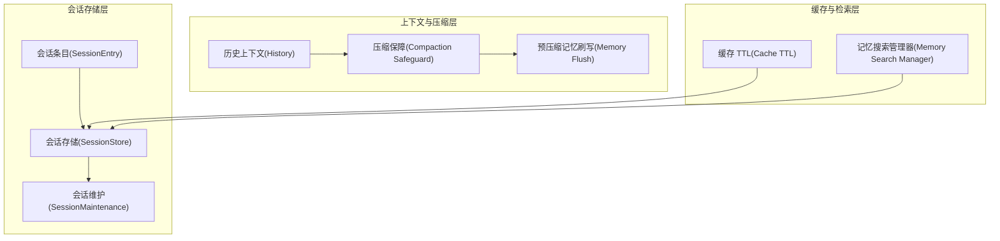
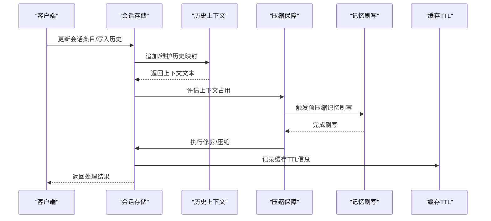
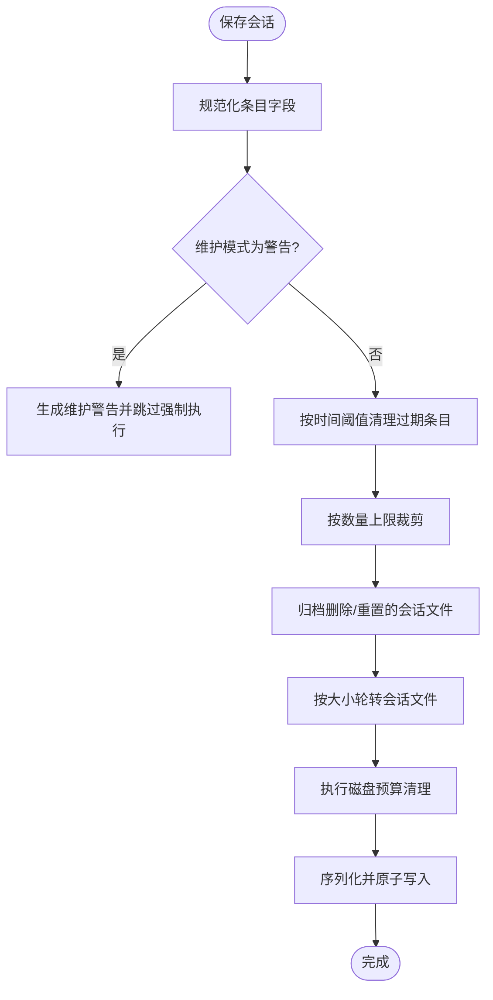
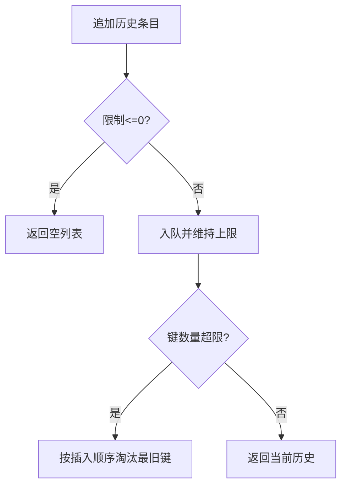
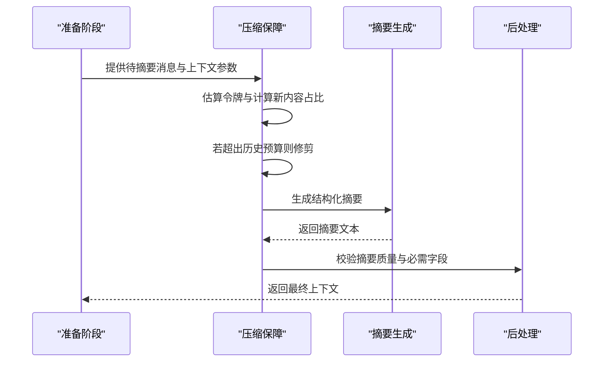
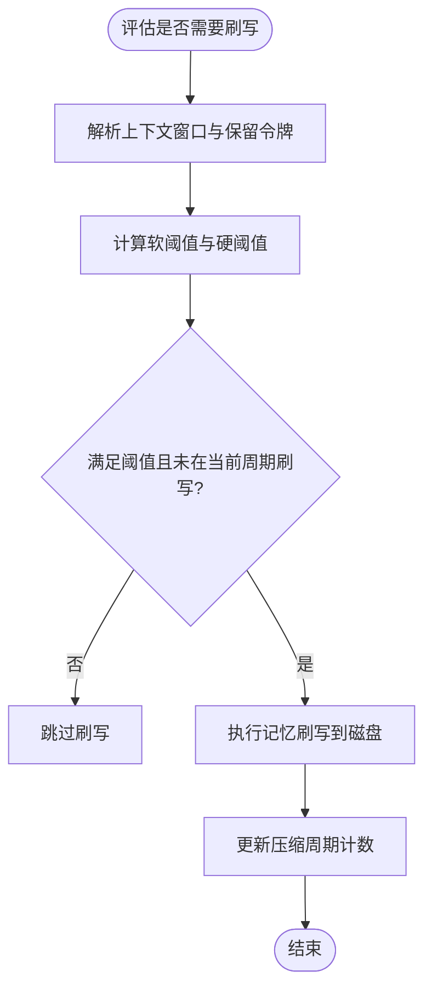
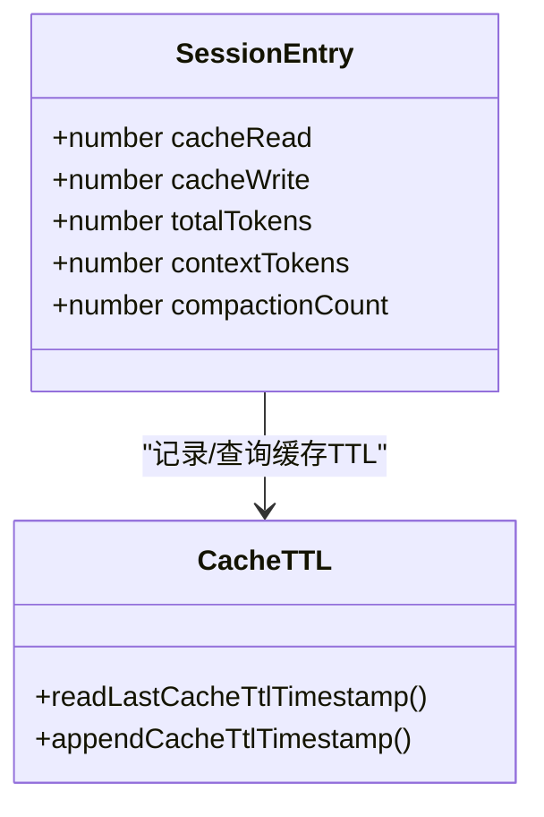
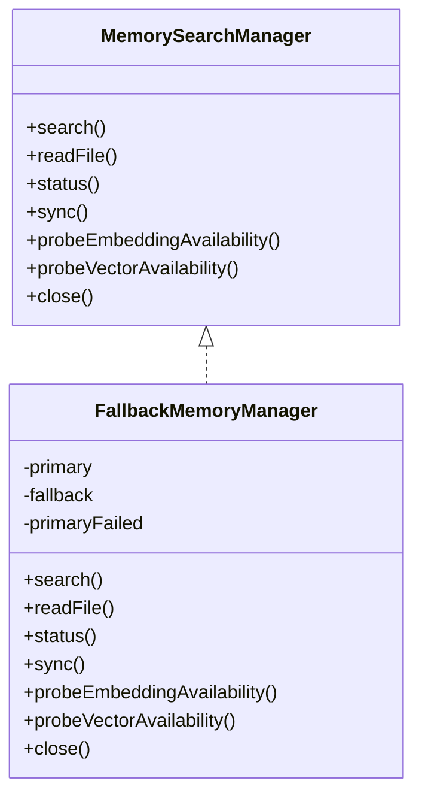
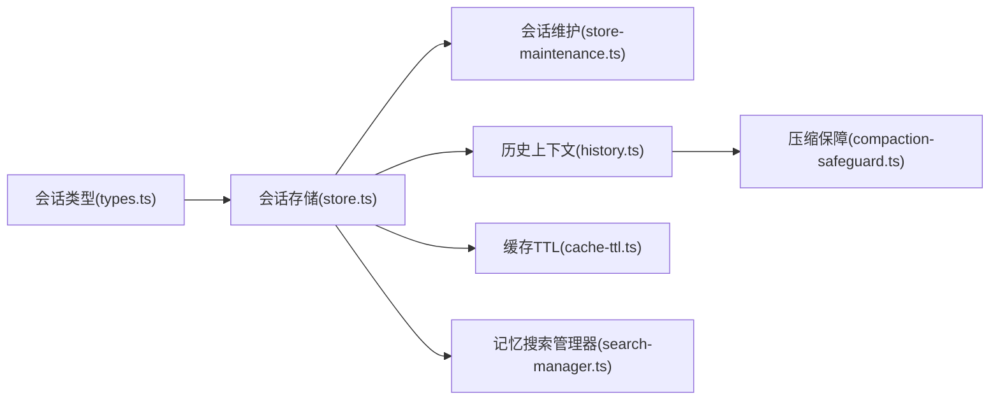

# 存储分层策略

<cite>
**本文档引用的文件**
- [src/config/sessions/types.ts](file://src/config/sessions/types.ts)
- [src/config/sessions/store.ts](file://src/config/sessions/store.ts)
- [src/config/sessions/store-maintenance.ts](file://src/config/sessions/store-maintenance.ts)
- [src/auto-reply/reply/history.ts](file://src/auto-reply/reply/history.ts)
- [src/auto-reply/reply/memory-flush.ts](file://src/auto-reply/reply/memory-flush.ts)
- [src/agents/pi-extensions/compaction-safeguard.ts](file://src/agents/pi-extensions/compaction-safeguard.ts)
- [src/agents/pi-embedded-runner/cache-ttl.ts](file://src/agents/pi-embedded-runner/cache-ttl.ts)
- [src/memory/search-manager.ts](file://src/memory/search-manager.ts)
- [docs/zh-CN/concepts/compaction.md](file://docs/zh-CN/concepts/compaction.md)
</cite>

## 目录
1. [简介](#简介)
2. [项目结构](#项目结构)
3. [核心组件](#核心组件)
4. [架构总览](#架构总览)
5. [详细组件分析](#详细组件分析)
6. [依赖关系分析](#依赖关系分析)
7. [性能考量](#性能考量)
8. [故障排查指南](#故障排查指南)
9. [结论](#结论)
10. [附录](#附录)

## 简介
本文件系统化阐述 OpenClaw 的存储分层策略，围绕“热数据、温数据、冷数据”的定义与管理机制展开，结合上下文窗口与压缩、会话生命周期维护、历史数据压缩策略以及智能缓存机制，给出配置选项与性能调优建议。目标是帮助读者在理解现有实现的基础上，安全地扩展与优化存储策略。

## 项目结构
OpenClaw 的存储分层涉及以下关键模块：
- 会话存储与维护：负责会话条目的持久化、缓存、清理与归档
- 历史数据管理：负责近期消息与上下文构建，支持 LRU 缓存与容量控制
- 压缩与上下文保障：在接近上下文窗口时进行压缩与修剪，确保请求可用性
- 智能缓存：基于访问特征与模型能力，动态记录缓存命中与 TTL 信息
- 记忆与检索：提供可选的向量/嵌入后端与回退机制，支撑长期记忆

**图表来源**
- [src/config/sessions/types.ts:68-171](file://src/config/sessions/types.ts#L68-L171)
- [src/config/sessions/store.ts:1-120](file://src/config/sessions/store.ts#L1-L120)
- [src/config/sessions/store-maintenance.ts:130-148](file://src/config/sessions/store-maintenance.ts#L130-L148)
- [src/auto-reply/reply/history.ts:1-75](file://src/auto-reply/reply/history.ts#L1-L75)
- [src/agents/pi-extensions/compaction-safeguard.ts:698-750](file://src/agents/pi-extensions/compaction-safeguard.ts#L698-L750)
- [src/auto-reply/reply/memory-flush.ts:170-229](file://src/auto-reply/reply/memory-flush.ts#L170-L229)
- [src/agents/pi-embedded-runner/cache-ttl.ts:1-77](file://src/agents/pi-embedded-runner/cache-ttl.ts#L1-L77)
- [src/memory/search-manager.ts:25-86](file://src/memory/search-manager.ts#L25-L86)

**章节来源**
- [src/config/sessions/types.ts:68-171](file://src/config/sessions/types.ts#L68-L171)
- [src/config/sessions/store.ts:1-120](file://src/config/sessions/store.ts#L1-L120)
- [src/config/sessions/store-maintenance.ts:130-148](file://src/config/sessions/store-maintenance.ts#L130-L148)
- [src/auto-reply/reply/history.ts:1-75](file://src/auto-reply/reply/history.ts#L1-L75)
- [src/agents/pi-extensions/compaction-safeguard.ts:698-750](file://src/agents/pi-extensions/compaction-safeguard.ts#L698-L750)
- [src/auto-reply/reply/memory-flush.ts:170-229](file://src/auto-reply/reply/memory-flush.ts#L170-L229)
- [src/agents/pi-embedded-runner/cache-ttl.ts:1-77](file://src/agents/pi-embedded-runner/cache-ttl.ts#L1-L77)
- [src/memory/search-manager.ts:25-86](file://src/memory/search-manager.ts#L25-L86)

## 核心组件
- 会话条目(SessionEntry)：承载会话元数据、令牌统计、缓存计数、压缩与记忆刷写状态等字段，用于驱动分层决策
- 会话存储(SessionStore)：提供加载、合并、持久化、加锁与维护流程，支持缓存 TTL 与序列化缓存
- 会话维护(SessionMaintenance)：负责过期清理、数量上限、文件轮转与磁盘预算控制
- 历史上下文(History)：维护近期消息映射，支持 LRU 淘汰与容量控制，构建上下文文本
- 压缩保障(Compaction Safeguard)：在接近上下文窗口时进行修剪与压缩，保证新内容有足够空间
- 预压缩记忆刷写(Memory Flush)：在压缩前将可持久的记忆写入磁盘，避免丢失重要信息
- 缓存 TTL(Cache TTL)：记录缓存时间戳与模型/提供商信息，辅助缓存有效性判断
- 记忆搜索管理器(Memory Search Manager)：提供可选的高性能向量/嵌入后端，并在失败时回退到内置索引

**章节来源**
- [src/config/sessions/types.ts:68-171](file://src/config/sessions/types.ts#L68-L171)
- [src/config/sessions/store.ts:195-270](file://src/config/sessions/store.ts#L195-L270)
- [src/config/sessions/store-maintenance.ts:155-259](file://src/config/sessions/store-maintenance.ts#L155-L259)
- [src/auto-reply/reply/history.ts:52-104](file://src/auto-reply/reply/history.ts#L52-L104)
- [src/agents/pi-extensions/compaction-safeguard.ts:766-790](file://src/agents/pi-extensions/compaction-safeguard.ts#L766-L790)
- [src/auto-reply/reply/memory-flush.ts:170-229](file://src/auto-reply/reply/memory-flush.ts#L170-L229)
- [src/agents/pi-embedded-runner/cache-ttl.ts:38-76](file://src/agents/pi-embedded-runner/cache-ttl.ts#L38-L76)
- [src/memory/search-manager.ts:104-179](file://src/memory/search-manager.ts#L104-L179)

## 架构总览
OpenClaw 的存储分层通过“会话存储 + 维护 + 上下文/压缩 + 缓存/检索”协同工作，形成热-温-冷三层数据管理闭环：
- 热数据：当前活跃会话的最新消息与上下文，驻留于内存映射与会话条目，具备高访问频度
- 温数据：近期被保留但未进入压缩摘要的历史片段，可能参与上下文构建但不持久化摘要
- 冷数据：已压缩为摘要并持久化的早期历史，仅在需要时检索或回放

**图表来源**
- [src/config/sessions/store.ts:520-533](file://src/config/sessions/store.ts#L520-L533)
- [src/auto-reply/reply/history.ts:52-104](file://src/auto-reply/reply/history.ts#L52-L104)
- [src/agents/pi-extensions/compaction-safeguard.ts:766-790](file://src/agents/pi-extensions/compaction-safeguard.ts#L766-L790)
- [src/auto-reply/reply/memory-flush.ts:170-229](file://src/auto-reply/reply/memory-flush.ts#L170-L229)
- [src/agents/pi-embedded-runner/cache-ttl.ts:64-76](file://src/agents/pi-embedded-runner/cache-ttl.ts#L64-L76)

## 详细组件分析

### 会话存储与维护
- 加载与缓存：支持基于 TTL 的对象与序列化缓存，Windows 平台具备空文件重试与原子写入保障
- 维护策略：按时间阈值清理过期条目、按数量上限裁剪、文件大小轮转、磁盘预算控制
- 归档与清理：删除/重置会话时归档历史文件，并按保留策略清理旧归档

**图表来源**
- [src/config/sessions/store.ts:340-509](file://src/config/sessions/store.ts#L340-L509)
- [src/config/sessions/store-maintenance.ts:155-259](file://src/config/sessions/store-maintenance.ts#L155-L259)

**章节来源**
- [src/config/sessions/store.ts:195-270](file://src/config/sessions/store.ts#L195-L270)
- [src/config/sessions/store.ts:340-509](file://src/config/sessions/store.ts#L340-L509)
- [src/config/sessions/store-maintenance.ts:155-259](file://src/config/sessions/store-maintenance.ts#L155-L259)

### 历史数据管理与上下文窗口
- 历史映射：以 Map 结构维护多组历史队列，支持 LRU 式淘汰与容量控制
- 上下文构建：将近期消息与当前消息拼接为上下文文本，支持标记与换行符定制
- 上下文窗口：由模型上下文长度决定，压缩保障在接近阈值时进行修剪与压缩

**图表来源**
- [src/auto-reply/reply/history.ts:52-75](file://src/auto-reply/reply/history.ts#L52-L75)

**章节来源**
- [src/auto-reply/reply/history.ts:1-194](file://src/auto-reply/reply/history.ts#L1-L194)

### 压缩与上下文保障
- 压缩触发：当会话接近上下文窗口时，先进行静默记忆刷写，再执行修剪与压缩
- 压缩策略：将早期对话总结为摘要条目，保留近期消息与必要工具结果配对
- 质量保障：校验摘要完整性（必需章节、精确标识符、最新用户询问），必要时回退到上一版摘要

**图表来源**
- [src/agents/pi-extensions/compaction-safeguard.ts:766-790](file://src/agents/pi-extensions/compaction-safeguard.ts#L766-L790)
- [docs/zh-CN/concepts/compaction.md:16-68](file://docs/zh-CN/concepts/compaction.md#L16-L68)

**章节来源**
- [src/agents/pi-extensions/compaction-safeguard.ts:698-750](file://src/agents/pi-extensions/compaction-safeguard.ts#L698-L750)
- [src/agents/pi-extensions/compaction-safeguard.ts:766-790](file://src/agents/pi-extensions/compaction-safeguard.ts#L766-L790)
- [docs/zh-CN/concepts/compaction.md:16-68](file://docs/zh-CN/concepts/compaction.md#L16-L68)

### 预压缩记忆刷写
- 触发条件：当会话令牌占用接近阈值或达到字节阈值时，触发记忆刷写
- 刷新保护：同一压缩周期内避免重复刷写，确保稳定性
- 输出格式：要求写入 canonical 文件名，仅追加不覆盖，遵循只读约束

**图表来源**
- [src/auto-reply/reply/memory-flush.ts:170-229](file://src/auto-reply/reply/memory-flush.ts#L170-L229)

**章节来源**
- [src/auto-reply/reply/memory-flush.ts:170-229](file://src/auto-reply/reply/memory-flush.ts#L170-L229)

### 缓存 TTL 与智能缓存
- 缓存 TTL：记录缓存时间戳与模型/提供商信息，用于判断缓存有效性
- 智能缓存：结合会话条目中的 cacheRead/cacheWrite 字段，统计命中率并在状态面板展示

**图表来源**
- [src/config/sessions/types.ts:138-152](file://src/config/sessions/types.ts#L138-L152)
- [src/agents/pi-embedded-runner/cache-ttl.ts:38-76](file://src/agents/pi-embedded-runner/cache-ttl.ts#L38-L76)

**章节来源**
- [src/config/sessions/types.ts:138-152](file://src/config/sessions/types.ts#L138-L152)
- [src/agents/pi-embedded-runner/cache-ttl.ts:38-76](file://src/agents/pi-embedded-runner/cache-ttl.ts#L38-L76)

### 记忆搜索管理器与回退机制
- 主后端：可选的高性能向量/嵌入后端（如 QMD），支持状态查询与同步
- 回退策略：主后端失败时自动切换到内置索引管理器，同时记录失败原因并清理缓存条目

**图表来源**
- [src/memory/search-manager.ts:104-179](file://src/memory/search-manager.ts#L104-L179)

**章节来源**
- [src/memory/search-manager.ts:25-86](file://src/memory/search-manager.ts#L25-L86)
- [src/memory/search-manager.ts:104-179](file://src/memory/search-manager.ts#L104-L179)

## 依赖关系分析
- 会话存储依赖会话类型定义与维护配置，提供统一的读写与加锁接口
- 历史模块为压缩与上下文构建提供基础数据结构
- 压缩保障依赖上下文窗口解析与令牌估算，协调记忆刷写
- 缓存 TTL 与会话条目字段配合，提供缓存命中统计
- 记忆搜索管理器与会话存储解耦，通过配置选择后端并支持回退

**图表来源**
- [src/config/sessions/types.ts:68-171](file://src/config/sessions/types.ts#L68-L171)
- [src/config/sessions/store.ts:1-120](file://src/config/sessions/store.ts#L1-L120)
- [src/config/sessions/store-maintenance.ts:130-148](file://src/config/sessions/store-maintenance.ts#L130-L148)
- [src/auto-reply/reply/history.ts:1-75](file://src/auto-reply/reply/history.ts#L1-L75)
- [src/agents/pi-extensions/compaction-safeguard.ts:698-750](file://src/agents/pi-extensions/compaction-safeguard.ts#L698-L750)
- [src/agents/pi-embedded-runner/cache-ttl.ts:1-77](file://src/agents/pi-embedded-runner/cache-ttl.ts#L1-L77)
- [src/memory/search-manager.ts:25-86](file://src/memory/search-manager.ts#L25-L86)

**章节来源**
- [src/config/sessions/types.ts:68-171](file://src/config/sessions/types.ts#L68-L171)
- [src/config/sessions/store.ts:1-120](file://src/config/sessions/store.ts#L1-L120)
- [src/config/sessions/store-maintenance.ts:130-148](file://src/config/sessions/store-maintenance.ts#L130-L148)
- [src/auto-reply/reply/history.ts:1-75](file://src/auto-reply/reply/history.ts#L1-L75)
- [src/agents/pi-extensions/compaction-safeguard.ts:698-750](file://src/agents/pi-extensions/compaction-safeguard.ts#L698-L750)
- [src/agents/pi-embedded-runner/cache-ttl.ts:1-77](file://src/agents/pi-embedded-runner/cache-ttl.ts#L1-L77)
- [src/memory/search-manager.ts:25-86](file://src/memory/search-manager.ts#L25-L86)

## 性能考量
- 会话存储缓存：通过 TTL 控制缓存有效期，减少频繁磁盘读取；Windows 平台采用空文件重试与原子写入，提升可靠性
- 历史映射容量：限制最大键数量，避免无界增长；入队时刷新插入顺序，实现 LRU 式淘汰
- 压缩与修剪：在接近上下文窗口时提前修剪，降低后续压缩成本；压缩后的新内容占比与历史预算共同决定保留比例
- 记忆刷写：在压缩前执行，避免丢失重要信息，同时通过周期计数防止重复刷写
- 缓存命中统计：利用 cacheRead/cacheWrite 字段与缓存 TTL 记录，评估缓存效果并指导调优

[本节为通用性能讨论，无需列出具体文件来源]

## 故障排查指南
- 会话维护警告：当维护模式为“警告”时，若即将清理活跃会话，会记录警告并跳过强制执行
- 文件轮转异常：检查磁盘空间与权限，确认轮转阈值设置合理
- 压缩失败：检查模型 API 密钥与上下文窗口解析，确认摘要质量校验通过
- 记忆刷写失败：确认 canonical 文件路径与只读约束，避免覆盖关键文件
- 缓存失效：检查缓存 TTL 设置与提供商/模型匹配，确保缓存条目有效

**章节来源**
- [src/config/sessions/store.ts:353-392](file://src/config/sessions/store.ts#L353-L392)
- [src/config/sessions/store-maintenance.ts:275-327](file://src/config/sessions/store-maintenance.ts#L275-L327)
- [src/agents/pi-extensions/compaction-safeguard.ts:714-744](file://src/agents/pi-extensions/compaction-safeguard.ts#L714-L744)
- [src/auto-reply/reply/memory-flush.ts:170-229](file://src/auto-reply/reply/memory-flush.ts#L170-L229)
- [src/agents/pi-embedded-runner/cache-ttl.ts:23-36](file://src/agents/pi-embedded-runner/cache-ttl.ts#L23-L36)

## 结论
OpenClaw 的存储分层策略通过“热-温-冷”三层次的数据管理，结合上下文窗口与压缩保障、预压缩记忆刷写、缓存 TTL 与智能缓存统计，实现了高效、稳定且可扩展的会话存储体系。在实际部署中，建议根据业务场景调整维护阈值、上下文窗口与压缩策略，并持续监控缓存命中率与磁盘预算，以获得最佳性能与成本平衡。

[本节为总结性内容，无需列出具体文件来源]

## 附录

### 配置选项与调优建议
- 会话维护
  - 维护模式：warn/强制执行
  - 过期阈值：支持天/毫秒单位
  - 最大条目数：限制活跃会话数量
  - 文件轮转阈值：按字节限制
  - 磁盘预算：最大磁盘使用量与高水位线
- 压缩与上下文
  - 上下文窗口：按模型解析
  - 历史预算占比：控制历史摘要占用比例
  - 压缩质量保障：启用/禁用，重试次数
- 记忆刷写
  - 启用开关：默认开启
  - 软阈值与硬阈值：令牌与字节双重触发
  - 输出规范：canonical 文件名、只读约束、追加写入
- 缓存 TTL
  - 全局 TTL：环境变量控制
  - 提供商/模型匹配：限定可记录 TTL 的范围

**章节来源**
- [src/config/sessions/store-maintenance.ts:130-148](file://src/config/sessions/store-maintenance.ts#L130-L148)
- [src/auto-reply/reply/memory-flush.ts:113-142](file://src/auto-reply/reply/memory-flush.ts#L113-L142)
- [src/agents/pi-embedded-runner/cache-ttl.ts:23-36](file://src/agents/pi-embedded-runner/cache-ttl.ts#L23-L36)
- [docs/zh-CN/concepts/compaction.md:29-31](file://docs/zh-CN/concepts/compaction.md#L29-L31)