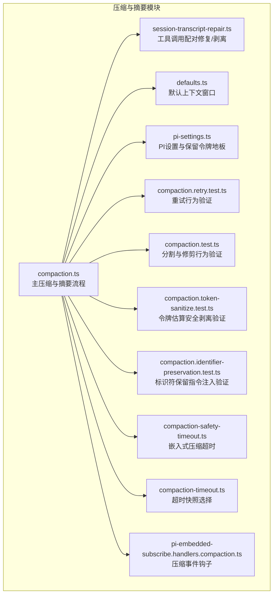
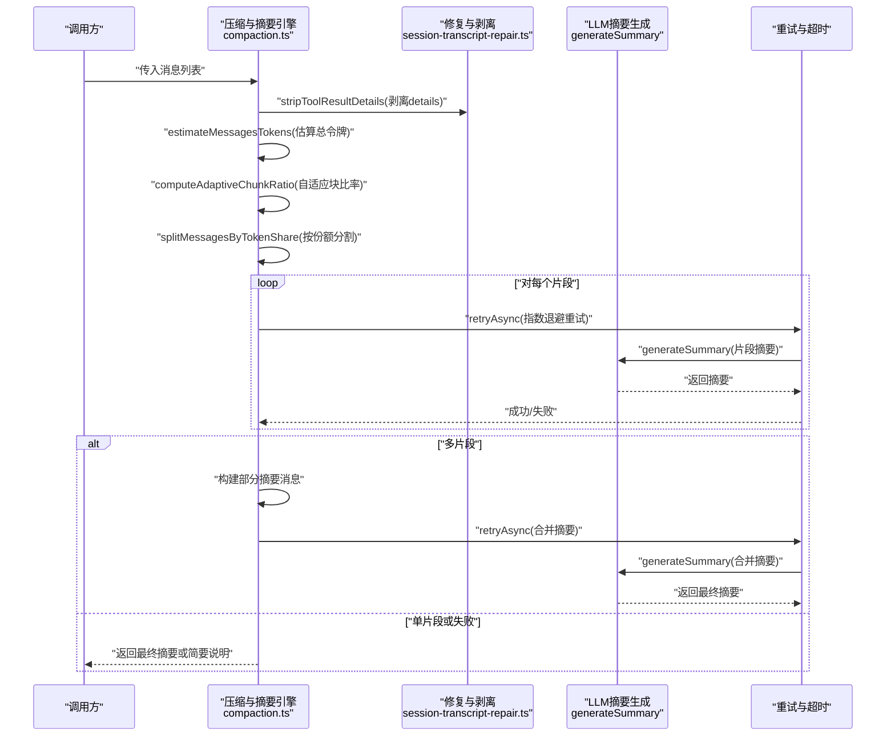
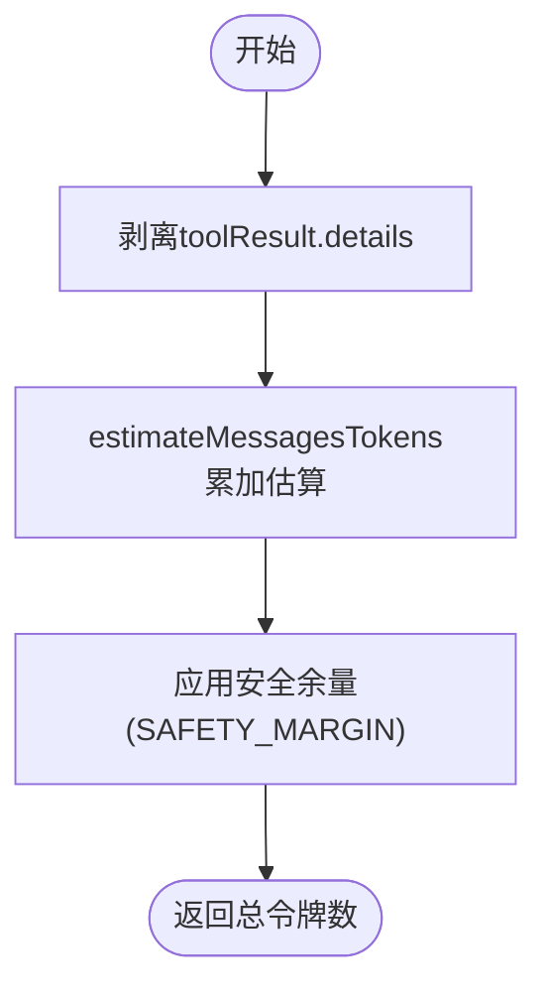
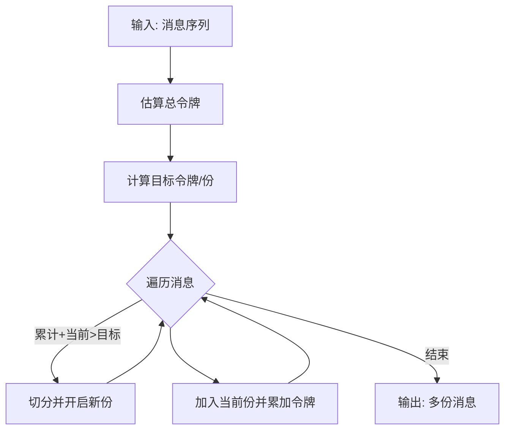
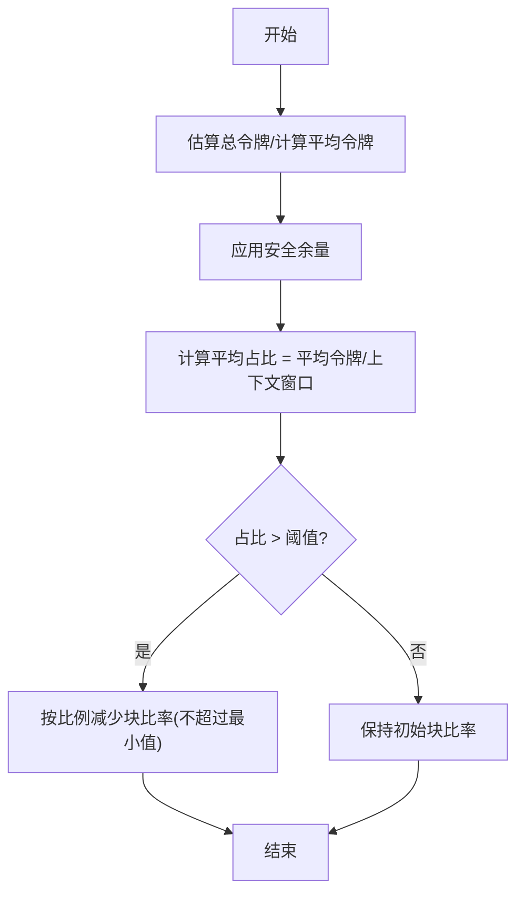
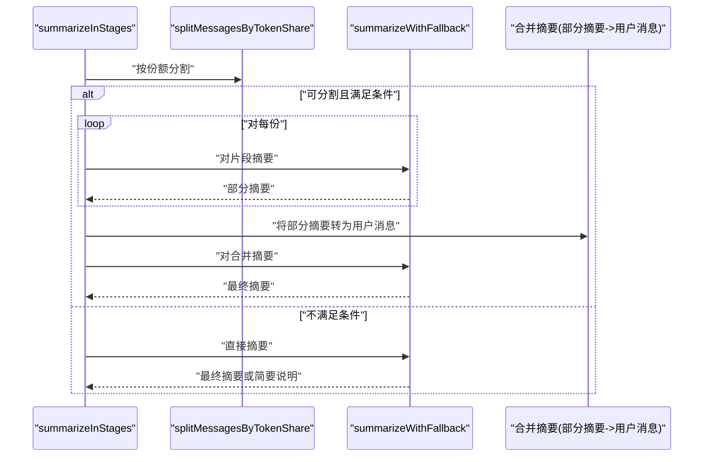
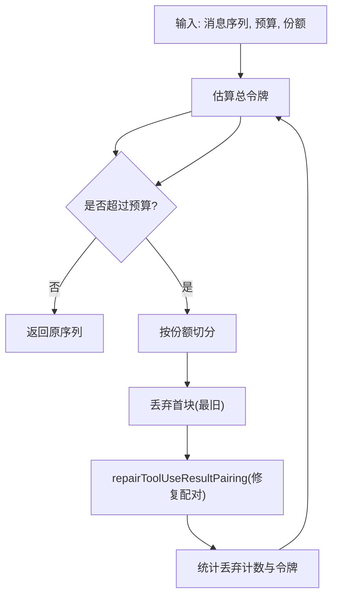
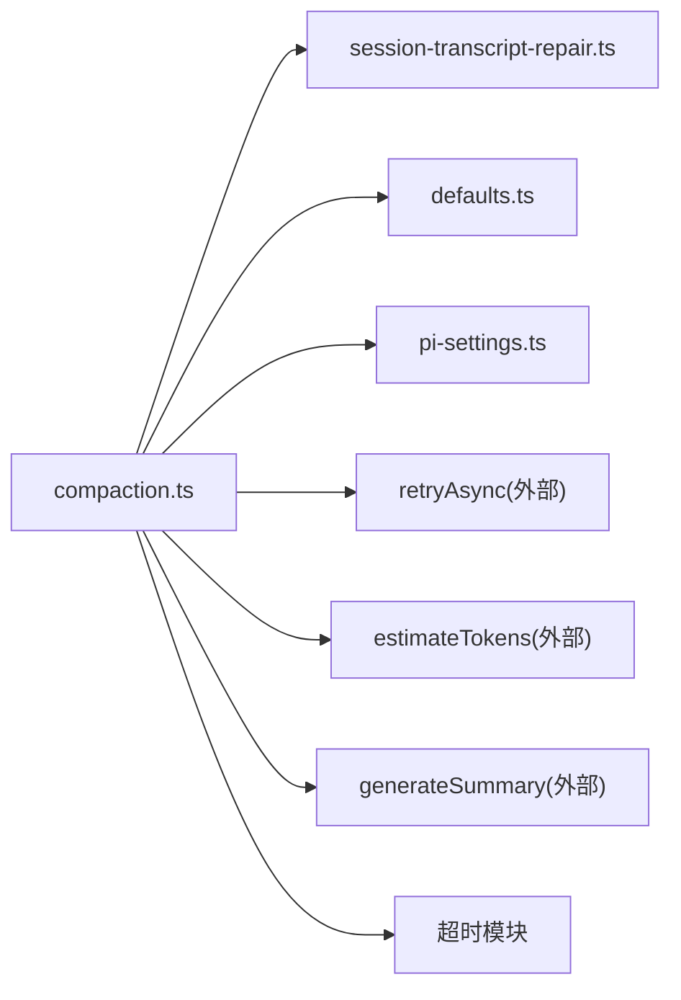

# 数据压缩算法

<cite>
**本文引用的文件**
- [compaction.ts](file://src/agents/compaction.ts)
- [compaction.test.ts](file://src/agents/compaction.test.ts)
- [compaction.token-sanitize.test.ts](file://src/agents/compaction.token-sanitize.test.ts)
- [compaction.identifier-preservation.test.ts](file://src/agents/compaction.identifier-preservation.test.ts)
- [session-transcript-repair.ts](file://src/agents/session-transcript-repair.ts)
- [defaults.ts](file://src/agents/defaults.ts)
- [pi-settings.ts](file://src/agents/pi-settings.ts)
- [compaction.retry.test.ts](file://src/agents/compaction.retry.test.ts)
- [compaction-safety-timeout.ts](file://src/agents/pi-embedded-runner/compaction-safety-timeout.ts)
- [compaction-timeout.ts](file://src/agents/pi-embedded-runner/run/compaction-timeout.ts)
- [pi-embedded-subscribe.handlers.compaction.ts](file://src/agents/pi-embedded-subscribe.handlers.compaction.ts)
</cite>

## 目录
1. [简介](#简介)
2. [项目结构](#项目结构)
3. [核心组件](#核心组件)
4. [架构总览](#架构总览)
5. [详细组件分析](#详细组件分析)
6. [依赖关系分析](#依赖关系分析)
7. [性能考量](#性能考量)
8. [故障排查指南](#故障排查指南)
9. [结论](#结论)

## 简介
本文件系统性阐述 OpenClaw 中的消息压缩与摘要生成算法，重点覆盖以下方面：
- 消息令牌估算：estimateTokens 的使用边界与安全剥离策略
- 消息分割策略：按令牌份额分割与按最大令牌数分割
- 自适应块比率：基于平均消息大小动态调整压缩比例
- 分阶段摘要生成：部分摘要合并与多级回退策略
- 性能优化与最佳实践：上下文预算、重试与超时控制

## 项目结构
围绕数据压缩的核心代码位于 agents 子模块中，关键文件如下：
- 压缩与摘要主逻辑：src/agents/compaction.ts
- 工具调用配对修复与敏感字段剥离：src/agents/session-transcript-repair.ts
- 默认上下文窗口与模型参数：src/agents/defaults.ts
- PI 设置与压缩保留令牌地板：src/agents/pi-settings.ts
- 超时与安全保护：src/agents/pi-embedded-runner/compaction-safety-timeout.ts、src/agents/pi-embedded-runner/run/compaction-timeout.ts
- 钩子事件与 UI 展示：src/agents/pi-embedded-subscribe.handlers.compaction.ts
- 单元测试与行为验证：src/agents/compaction.test.ts、src/agents/compaction.token-sanitize.test.ts、src/agents/compaction.identifier-preservation.test.ts、src/agents/compaction.retry.test.ts

**图表来源**
- [compaction.ts:1-465](file://src/agents/compaction.ts#L1-L465)
- [session-transcript-repair.ts:1-503](file://src/agents/session-transcript-repair.ts#L1-L503)
- [defaults.ts:1-7](file://src/agents/defaults.ts#L1-L7)
- [pi-settings.ts:1-122](file://src/agents/pi-settings.ts#L1-L122)
- [compaction.retry.test.ts:64-159](file://src/agents/compaction.retry.test.ts#L64-L159)
- [compaction.test.ts:1-259](file://src/agents/compaction.test.ts#L1-L259)
- [compaction.token-sanitize.test.ts:1-53](file://src/agents/compaction.token-sanitize.test.ts#L1-L53)
- [compaction.identifier-preservation.test.ts:1-129](file://src/agents/compaction.identifier-preservation.test.ts#L1-L129)
- [compaction-safety-timeout.ts:1-10](file://src/agents/pi-embedded-runner/compaction-safety-timeout.ts#L1-L10)
- [compaction-timeout.ts:1-54](file://src/agents/pi-embedded-runner/run/compaction-timeout.ts#L1-L54)
- [pi-embedded-subscribe.handlers.compaction.ts:1-39](file://src/agents/pi-embedded-subscribe.handlers.compaction.ts#L1-L39)

**章节来源**
- [compaction.ts:1-465](file://src/agents/compaction.ts#L1-L465)
- [session-transcript-repair.ts:1-503](file://src/agents/session-transcript-repair.ts#L1-L503)
- [defaults.ts:1-7](file://src/agents/defaults.ts#L1-L7)
- [pi-settings.ts:1-122](file://src/agents/pi-settings.ts#L1-L122)
- [compaction.retry.test.ts:64-159](file://src/agents/compaction.retry.test.ts#L64-L159)
- [compaction.test.ts:1-259](file://src/agents/compaction.test.ts#L1-L259)
- [compaction.token-sanitize.test.ts:1-53](file://src/agents/compaction.token-sanitize.test.ts#L1-L53)
- [compaction.identifier-preservation.test.ts:1-129](file://src/agents/compaction.identifier-preservation.test.ts#L1-L129)
- [compaction-safety-timeout.ts:1-10](file://src/agents/pi-embedded-runner/compaction-safety-timeout.ts#L1-L10)
- [compaction-timeout.ts:1-54](file://src/agents/pi-embedded-runner/run/compaction-timeout.ts#L1-L54)
- [pi-embedded-subscribe.handlers.compaction.ts:1-39](file://src/agents/pi-embedded-subscribe.handlers.compaction.ts#L1-L39)

## 核心组件
- 令牌估算与安全剥离
  - 使用外部库 estimateTokens 对消息进行令牌估算；在压缩前通过 stripToolResultDetails 剥离可能包含大体量内容的 details 字段，避免将其传入 LLM 提示词导致预算浪费或安全风险。
- 消息分割
  - 按令牌份额分割：splitMessagesByTokenShare 将消息序列切分为尽可能等量令牌的若干份，保证每份的令牌数接近总令牌数除以份数。
  - 按最大令牌数分割：chunkMessagesByMaxTokens 在单条消息过大时强制拆分，防止某条消息导致块尺寸异常膨胀。
- 自适应块比率
  - computeAdaptiveChunkRatio 基于平均消息大小与上下文窗口比例动态调整块比率，当平均消息占比过高时降低块比率，提升压缩稳定性。
- 分阶段摘要生成
  - summarizeInStages 先尝试按令牌份额切分并行摘要，再将部分摘要作为输入进行二次合并摘要；若失败则进入回退路径（仅摘要较小消息、或直接返回简要说明）。
- 上下文预算与保留令牌
  - pruneHistoryForContextShare 通过“按份额丢弃旧块”的方式确保历史占用不超过预算；resolveContextWindowTokens 提供默认上下文窗口；ensurePiCompactionReserveTokens 与 applyPiCompactionSettingsFromConfig 强制保留令牌地板，保障摘要提示词与输出有足够空间。

**章节来源**
- [compaction.ts:72-175](file://src/agents/compaction.ts#L72-L175)
- [compaction.ts:181-209](file://src/agents/compaction.ts#L181-L209)
- [compaction.ts:333-396](file://src/agents/compaction.ts#L333-L396)
- [compaction.ts:398-460](file://src/agents/compaction.ts#L398-L460)
- [defaults.ts:1-7](file://src/agents/defaults.ts#L1-L7)
- [pi-settings.ts:18-99](file://src/agents/pi-settings.ts#L18-L99)

## 架构总览
下图展示从消息输入到最终摘要输出的关键流程，包括令牌估算、分割、摘要与回退策略：

**图表来源**
- [compaction.ts:211-258](file://src/agents/compaction.ts#L211-L258)
- [compaction.ts:333-396](file://src/agents/compaction.ts#L333-L396)
- [compaction.ts:72-80](file://src/agents/compaction.ts#L72-L80)
- [session-transcript-repair.ts:198-216](file://src/agents/session-transcript-repair.ts#L198-L216)
- [compaction.retry.test.ts:64-159](file://src/agents/compaction.retry.test.ts#L64-L159)

**章节来源**
- [compaction.ts:211-258](file://src/agents/compaction.ts#L211-L258)
- [compaction.ts:333-396](file://src/agents/compaction.ts#L333-L396)
- [session-transcript-repair.ts:198-216](file://src/agents/session-transcript-repair.ts#L198-L216)
- [compaction.retry.test.ts:64-159](file://src/agents/compaction.retry.test.ts#L64-L159)

## 详细组件分析

### 令牌估算与安全剥离
- 估算策略
  - estimateMessagesTokens 对消息数组逐条调用 estimateTokens 并累加，得到总令牌数。
  - 为规避字符编码、特殊标记与代码标记等低估问题，在分割与估算时引入 20% 安全余量（SAFETY_MARGIN），在按最大令牌数分割时将 maxTokens 除以该余量以补偿低估。
- 安全剥离
  - stripToolResultDetails 在压缩前移除 toolResult.details 字段，避免将潜在的大体量原始数据带入 LLM 提示词，从而减少令牌消耗与安全风险。
- 行为验证
  - 测试确保在分割与按最大令牌数分割时不会将 details 传入 per-message 令牌估算。

**图表来源**
- [compaction.ts:72-80](file://src/agents/compaction.ts#L72-L80)
- [compaction.ts:143-145](file://src/agents/compaction.ts#L143-L145)
- [session-transcript-repair.ts:198-216](file://src/agents/session-transcript-repair.ts#L198-L216)
- [compaction.token-sanitize.test.ts:22-51](file://src/agents/compaction.token-sanitize.test.ts#L22-L51)

**章节来源**
- [compaction.ts:72-80](file://src/agents/compaction.ts#L72-L80)
- [compaction.ts:143-145](file://src/agents/compaction.ts#L143-L145)
- [session-transcript-repair.ts:198-216](file://src/agents/session-transcript-repair.ts#L198-L216)
- [compaction.token-sanitize.test.ts:22-51](file://src/agents/compaction.token-sanitize.test.ts#L22-L51)

### 消息分割策略
- 按令牌份额分割
  - splitMessagesByTokenShare 将消息序列按目标令牌数（总令牌数/份数）切分，确保每份尽可能均衡；当接近最后一份且当前累计超过目标时，提前切分，保证所有份非空。
- 按最大令牌数分割
  - chunkMessagesByMaxTokens 在单条消息超过有效阈值时强制拆分，避免某条消息导致块尺寸异常膨胀；同时应用安全余量以补偿低估。
- 行为验证
  - 测试验证分割后各份非空、顺序保持、预算内完成。

**图表来源**
- [compaction.ts:89-128](file://src/agents/compaction.ts#L89-L128)
- [compaction.ts:135-175](file://src/agents/compaction.ts#L135-L175)
- [compaction.test.ts:62-79](file://src/agents/compaction.test.ts#L62-L79)

**章节来源**
- [compaction.ts:89-128](file://src/agents/compaction.ts#L89-L128)
- [compaction.ts:135-175](file://src/agents/compaction.ts#L135-L175)
- [compaction.test.ts:62-79](file://src/agents/compaction.test.ts#L62-L79)

### 自适应块比率计算
- 计算逻辑
  - computeAdaptiveChunkRatio 基于平均消息大小与上下文窗口的比例动态调整块比率；当平均消息占比超过阈值（如 10%）时，按比例减少块比率，使块更小以避免超出模型限制。
- 参数范围
  - 初始块比率为 0.4，最小值为 0.15；通过安全余量提高估算稳健性。
- 行为验证
  - 当消息普遍较大时，块比率下降，提升压缩稳定性。

**图表来源**
- [compaction.ts:181-200](file://src/agents/compaction.ts#L181-L200)

**章节来源**
- [compaction.ts:181-200](file://src/agents/compaction.ts#L181-L200)

### 分阶段摘要生成与回退策略
- 分阶段摘要
  - summarizeInStages 先按令牌份额分割为多份，分别生成部分摘要，再将部分摘要作为输入生成合并摘要；若分割后少于两份或总令牌未超过阈值，则直接走 summarizeWithFallback。
- 回退策略
  - summarizeWithFallback 首先尝试完整摘要；失败时过滤掉过大的消息，仅对较小消息摘要，并在结果末尾附加被省略的说明；若仍失败，则返回简要说明。
- 标识符保留指令
  - buildCompactionSummarizationInstructions 注入严格保留标识符的指令，支持关闭策略与自定义指令；在分阶段路径中，合并摘要阶段会避免重复添加“Additional focus”头。

**图表来源**
- [compaction.ts:333-396](file://src/agents/compaction.ts#L333-L396)
- [compaction.ts:264-331](file://src/agents/compaction.ts#L264-L331)
- [compaction.identifier-preservation.test.ts:86-112](file://src/agents/compaction.identifier-preservation.test.ts#L86-L112)

**章节来源**
- [compaction.ts:333-396](file://src/agents/compaction.ts#L333-L396)
- [compaction.ts:264-331](file://src/agents/compaction.ts#L264-L331)
- [compaction.identifier-preservation.test.ts:86-112](file://src/agents/compaction.identifier-preservation.test.ts#L86-L112)

### 上下文预算与历史修剪
- 历史修剪
  - pruneHistoryForContextShare 通过“按份额丢弃最旧块”的方式，确保保留的历史不超过 maxContextTokens × maxHistoryShare；每次丢弃后调用 repairToolUseResultPairing 修复工具调用与结果的配对，避免 API 报错。
- 保留令牌与上下文窗口
  - resolveContextWindowTokens 提供默认上下文窗口；ensurePiCompactionReserveTokens 与 applyPiCompactionSettingsFromConfig 强制保留令牌地板，保障摘要提示词与输出有足够空间。

**图表来源**
- [compaction.ts:398-460](file://src/agents/compaction.ts#L398-L460)
- [session-transcript-repair.ts:342-502](file://src/agents/session-transcript-repair.ts#L342-L502)
- [pi-settings.ts:18-99](file://src/agents/pi-settings.ts#L18-L99)
- [defaults.ts:1-7](file://src/agents/defaults.ts#L1-L7)

**章节来源**
- [compaction.ts:398-460](file://src/agents/compaction.ts#L398-L460)
- [session-transcript-repair.ts:342-502](file://src/agents/session-transcript-repair.ts#L342-L502)
- [pi-settings.ts:18-99](file://src/agents/pi-settings.ts#L18-L99)
- [defaults.ts:1-7](file://src/agents/defaults.ts#L1-L7)

## 依赖关系分析
- 组件耦合
  - compaction.ts 依赖 session-transcript-repair.ts 进行安全剥离与配对修复；依赖 defaults.ts 获取默认上下文窗口；依赖 pi-settings.ts 应用保留令牌地板。
- 外部接口
  - 通过 generateSummary 与 estimateTokens 与外部 LLM 服务交互；通过 retryAsync 实现指数退避重试；通过超时模块保障长时间运行的安全性。
- 循环依赖
  - 未发现循环依赖；模块职责清晰，接口边界明确。

**图表来源**
- [compaction.ts:1-10](file://src/agents/compaction.ts#L1-L10)
- [session-transcript-repair.ts:1-503](file://src/agents/session-transcript-repair.ts#L1-L503)
- [defaults.ts:1-7](file://src/agents/defaults.ts#L1-L7)
- [pi-settings.ts:1-122](file://src/agents/pi-settings.ts#L1-L122)

**章节来源**
- [compaction.ts:1-10](file://src/agents/compaction.ts#L1-L10)
- [session-transcript-repair.ts:1-503](file://src/agents/session-transcript-repair.ts#L1-L503)
- [defaults.ts:1-7](file://src/agents/defaults.ts#L1-L7)
- [pi-settings.ts:1-122](file://src/agents/pi-settings.ts#L1-L122)

## 性能考量
- 令牌估算准确性
  - 采用 20% 安全余量补偿字符集、特殊标记与代码标记的低估；在分割阈值上应用反向余量以抵消低估带来的块膨胀。
- 分割策略选择
  - 对于消息规模差异较大的场景，优先使用按令牌份额分割，确保各份负载均衡；对单条消息过大场景，配合按最大令牌数分割进行强制拆分。
- 自适应块比率
  - 当平均消息占比超过阈值时降低块比率，有助于避免单次摘要过大导致的失败与超时。
- 重试与超时
  - 使用指数退避与抖动的重试策略，避免瞬时错误放大；嵌入式运行时设置压缩超时，超时后选择合适的快照继续后续流程。
- 保留令牌地板
  - 强制保留令牌地板，确保摘要提示词、系统提示词与输出有足够空间，避免因预算不足导致的截断与失败。

[本节为通用性能讨论，无需具体文件分析]

## 故障排查指南
- 令牌估算相关
  - 若发现摘要频繁失败或预算紧张，检查是否正确剥离了 toolResult.details；确认 estimateTokens 的调用边界未包含 details。
- 分割与合并
  - 若合并摘要阶段出现重复“Additional focus”头，确认使用了正确的合并指令构建逻辑。
- 过大消息处理
  - 若存在单条消息过大，isOversizedForSummary 会触发回退策略；检查 oversized 消息数量与被省略说明是否符合预期。
- 重试与超时
  - 若摘要生成不稳定，确认 retryAsync 的重试参数与 shouldRetry 条件；在嵌入式运行时关注压缩超时标志位与快照选择逻辑。
- 工具调用配对
  - 历史修剪后若出现 API 错误，检查 repairToolUseResultPairing 是否正确移除了孤儿 tool_result。

**章节来源**
- [compaction.token-sanitize.test.ts:22-51](file://src/agents/compaction.token-sanitize.test.ts#L22-L51)
- [compaction.identifier-preservation.test.ts:99-112](file://src/agents/compaction.identifier-preservation.test.ts#L99-L112)
- [compaction.retry.test.ts:64-159](file://src/agents/compaction.retry.test.ts#L64-L159)
- [compaction.ts:206-209](file://src/agents/compaction.ts#L206-L209)
- [compaction.ts:282-331](file://src/agents/compaction.ts#L282-L331)
- [compaction.ts:420-460](file://src/agents/compaction.ts#L420-L460)
- [session-transcript-repair.ts:342-502](file://src/agents/session-transcript-repair.ts#L342-L502)

## 结论
OpenClaw 的数据压缩算法通过“令牌估算安全剥离 + 双重分割策略 + 自适应块比率 + 分阶段摘要与多级回退”的组合，实现了在不同消息规模与上下文预算下的稳定压缩与摘要。配合保留令牌地板、重试与超时控制，能够在复杂场景中保持鲁棒性与可维护性。建议在生产环境中：
- 明确保留令牌地板与上下文窗口，确保摘要提示词与输出空间充足
- 启用按令牌份额分割为主、按最大令牌数分割为辅的混合策略
- 在大规模消息场景启用自适应块比率，降低失败概率
- 使用回退策略与工具调用配对修复，提升容错能力