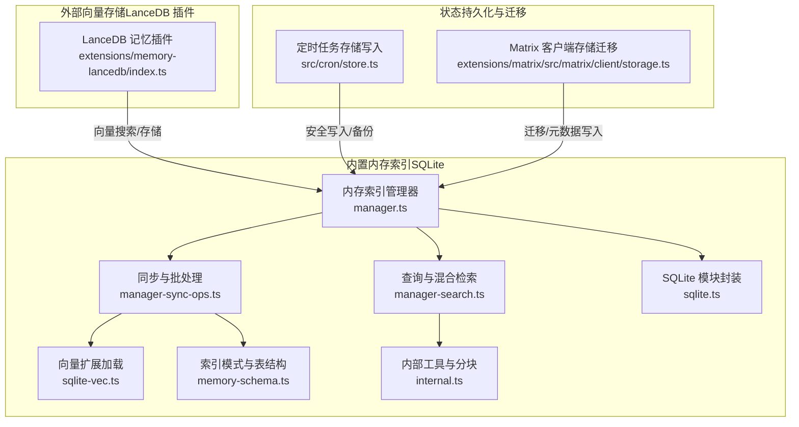
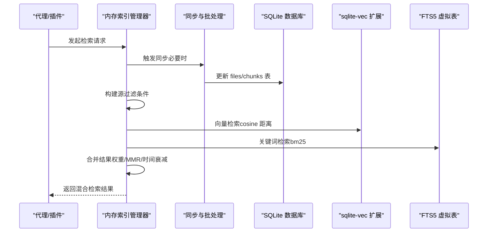
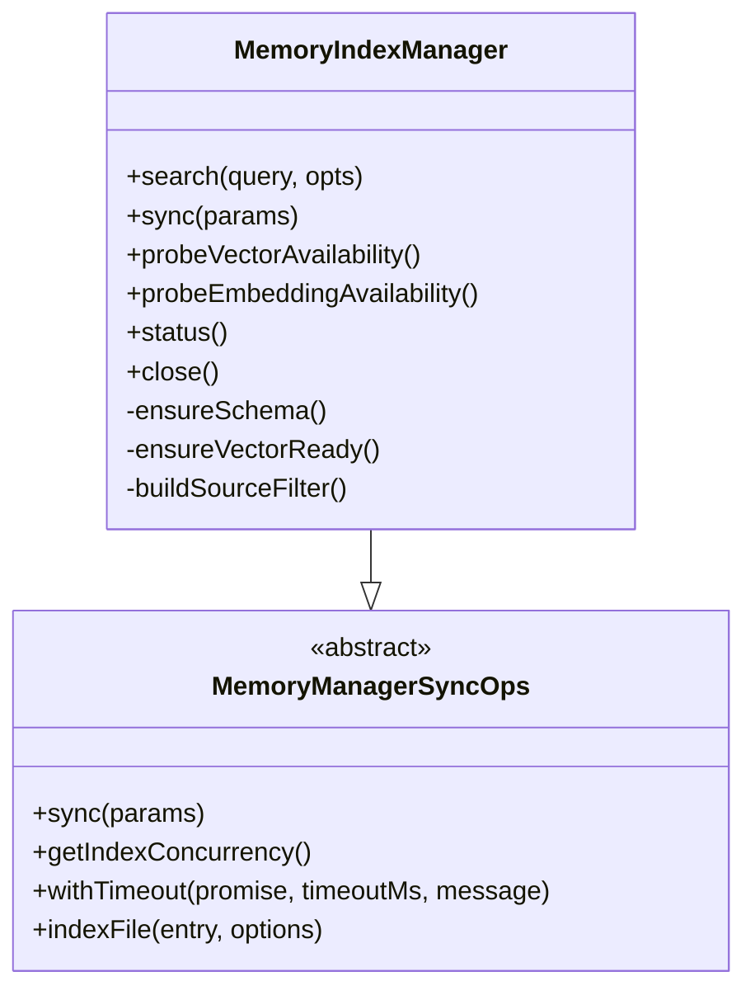
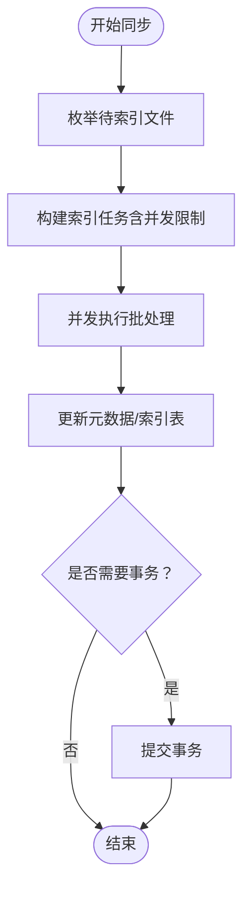
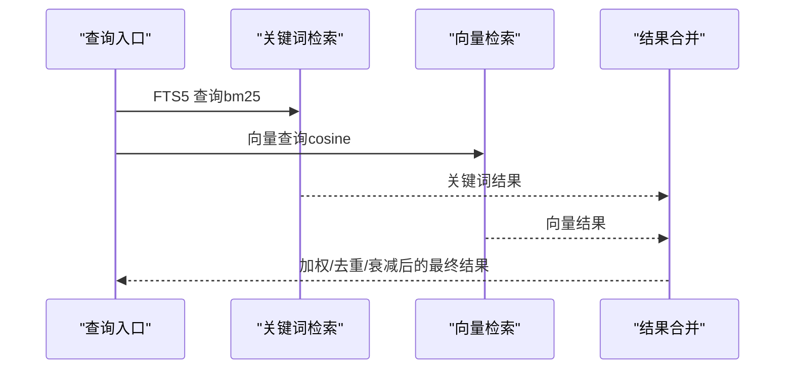
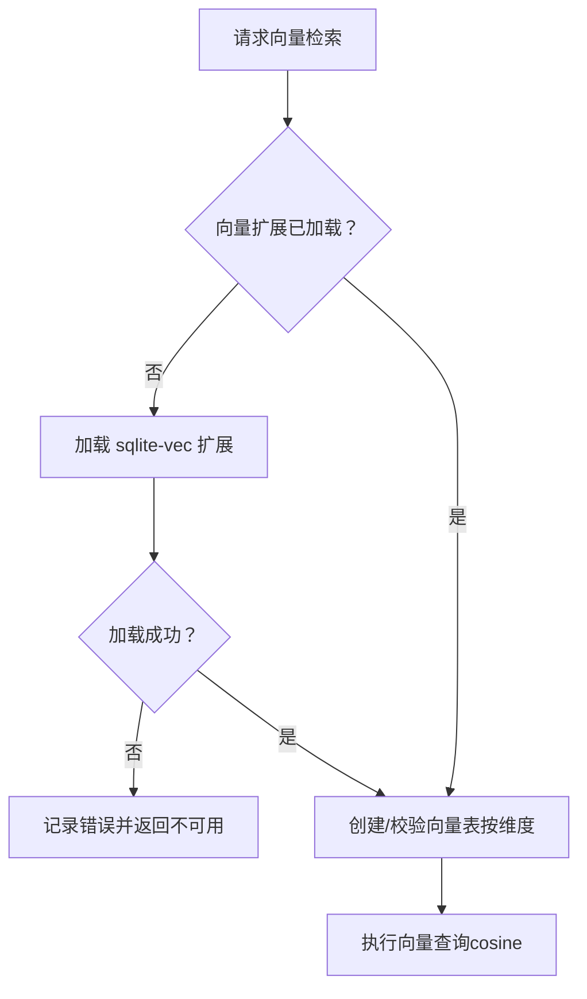
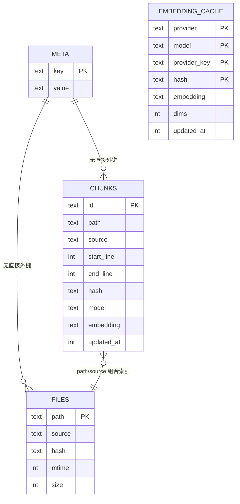
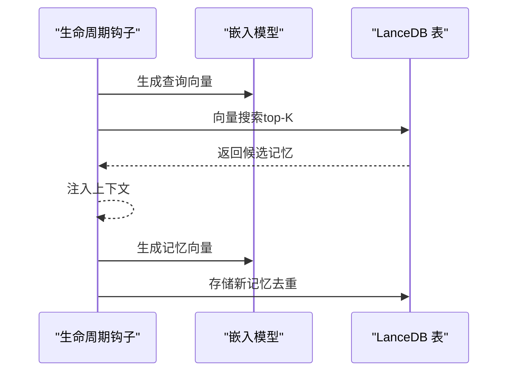
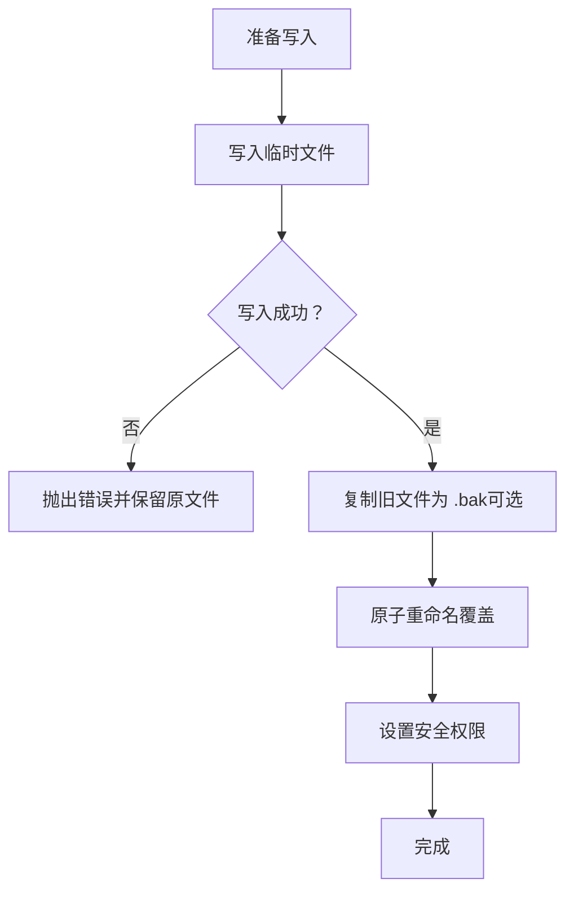
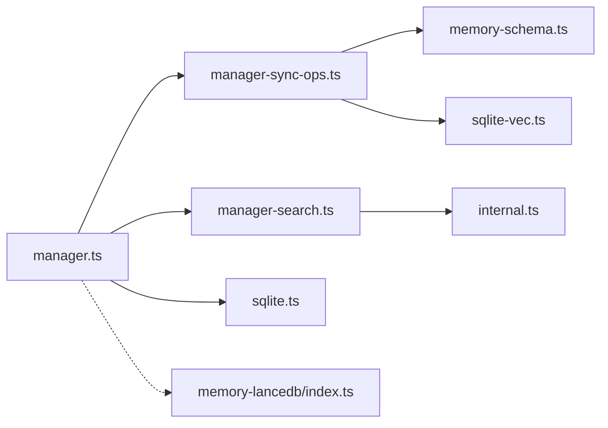

# 数据库优化

<cite>
**本文引用的文件**
- [src/memory/manager.ts](file://src/memory/manager.ts)
- [src/memory/manager-sync-ops.ts](file://src/memory/manager-sync-ops.ts)
- [src/memory/manager-search.ts](file://src/memory/manager-search.ts)
- [src/memory/sqlite-vec.ts](file://src/memory/sqlite-vec.ts)
- [src/memory/sqlite.ts](file://src/memory/sqlite.ts)
- [src/memory/memory-schema.ts](file://src/memory/memory-schema.ts)
- [src/memory/internal.ts](file://src/memory/internal.ts)
- [extensions/memory-lancedb/index.ts](file://extensions/memory-lancedb/index.ts)
- [extensions/open-prose/skills/prose/state/postgres.md](file://extensions/open-prose/skills/prose/state/postgres.md)
- [extensions/open-prose/skills/prose/state/sqlite.md](file://extensions/open-prose/skills/prose/state/sqlite.md)
- [src/cron/store.ts](file://src/cron/store.ts)
- [extensions/matrix/src/matrix/client/storage.ts](file://extensions/matrix/src/matrix/client/storage.ts)
- [src/memory/manager.readonly-recovery.test.ts](file://src/memory/manager.readonly-recovery.test.ts)
- [src/memory/qmd-manager.test.ts](file://src/memory/qmd-manager.test.ts)
</cite>

## 目录
1. [简介](#简介)
2. [项目结构](#项目结构)
3. [核心组件](#核心组件)
4. [架构总览](#架构总览)
5. [详细组件分析](#详细组件分析)
6. [依赖关系分析](#依赖关系分析)
7. [性能考量](#性能考量)
8. [故障排查指南](#故障排查指南)
9. [结论](#结论)
10. [附录](#附录)

## 简介
本文件聚焦 OpenClaw 的数据库优化技术，围绕以下主题展开：数据库索引策略与查询优化、数据序列化与反序列化性能优化、批量操作与事务管理最佳实践、内存映射文件与持久化存储选择策略、数据库性能监控指标与调优工具使用、以及数据库迁移与版本兼容性处理方案。内容基于仓库中 SQLite 内嵌向量扩展、混合检索（关键词+向量）、LanceDB 向量存储、状态持久化与备份等实现进行系统化梳理，并辅以可视化图示帮助理解。

## 项目结构
OpenClaw 的数据库优化涉及多层实现：
- 内置内存索引：基于 node:sqlite 的本地 SQLite 数据库，支持 FTS5 虚拟表与 sqlite-vec 扩展，提供向量相似度检索与关键词检索的混合能力。
- 外部向量存储：通过插件方式接入 LanceDB，用于长时记忆的向量检索与自动召回/捕获。
- 状态持久化与迁移：在不同平台与运行环境下对存储元数据与文件进行安全写入与迁移。
- 配置与模式：统一的索引模式定义与增量演进策略，确保跨版本兼容。

图表来源
- [src/memory/manager.ts:1-800](file://src/memory/manager.ts#L1-L800)
- [src/memory/manager-sync-ops.ts:1-800](file://src/memory/manager-sync-ops.ts#L1-L800)
- [src/memory/manager-search.ts:1-192](file://src/memory/manager-search.ts#L1-L192)
- [src/memory/sqlite-vec.ts:1-25](file://src/memory/sqlite-vec.ts#L1-L25)
- [src/memory/sqlite.ts:1-20](file://src/memory/sqlite.ts#L1-L20)
- [src/memory/memory-schema.ts:1-97](file://src/memory/memory-schema.ts#L1-L97)
- [src/memory/internal.ts:1-483](file://src/memory/internal.ts#L1-L483)
- [extensions/memory-lancedb/index.ts:1-679](file://extensions/memory-lancedb/index.ts#L1-L679)
- [src/cron/store.ts:77-109](file://src/cron/store.ts#L77-L109)
- [extensions/matrix/src/matrix/client/storage.ts:88-131](file://extensions/matrix/src/matrix/client/storage.ts#L88-L131)

章节来源
- [src/memory/manager.ts:1-800](file://src/memory/manager.ts#L1-L800)
- [src/memory/manager-sync-ops.ts:1-800](file://src/memory/manager-sync-ops.ts#L1-L800)
- [src/memory/manager-search.ts:1-192](file://src/memory/manager-search.ts#L1-L192)
- [src/memory/sqlite-vec.ts:1-25](file://src/memory/sqlite-vec.ts#L1-L25)
- [src/memory/sqlite.ts:1-20](file://src/memory/sqlite.ts#L1-L20)
- [src/memory/memory-schema.ts:1-97](file://src/memory/memory-schema.ts#L1-L97)
- [src/memory/internal.ts:1-483](file://src/memory/internal.ts#L1-L483)
- [extensions/memory-lancedb/index.ts:1-679](file://extensions/memory-lancedb/index.ts#L1-L679)
- [src/cron/store.ts:77-109](file://src/cron/store.ts#L77-L109)
- [extensions/matrix/src/matrix/client/storage.ts:88-131](file://extensions/matrix/src/matrix/client/storage.ts#L88-L131)

## 核心组件
- 内存索引管理器：负责打开/维护 SQLite 数据库、构建/更新索引、执行混合检索（关键词+向量）、批处理与并发控制、只读恢复与错误处理。
- 同步与批处理：负责文件监听、会话增量更新、批量任务调度、并发限制、超时与重试、事务提交/回滚。
- 查询与混合检索：提供关键词检索（FTS5）与向量检索（sqlite-vec）的组合，支持多样性重排（MMR）与时间衰减。
- 向量扩展加载：动态加载 sqlite-vec 扩展，按需创建向量表，支持维度变更与清理。
- 索引模式与表结构：统一定义 files/chunks/meta/embedding_cache 等表及索引，保证跨版本演进。
- 内部工具与分块：文本分块、行号映射、向量解析、余弦相似度计算、并发执行等。
- LanceDB 插件：提供向量搜索、存储、删除、统计命令，支持自动召回与自动捕获。
- 状态持久化与迁移：定时任务安全写入（原子替换、备份）、客户端存储迁移与元数据写入。

章节来源
- [src/memory/manager.ts:61-739](file://src/memory/manager.ts#L61-L739)
- [src/memory/manager-sync-ops.ts:97-373](file://src/memory/manager-sync-ops.ts#L97-L373)
- [src/memory/manager-search.ts:20-94](file://src/memory/manager-search.ts#L20-L94)
- [src/memory/sqlite-vec.ts:3-24](file://src/memory/sqlite-vec.ts#L3-L24)
- [src/memory/memory-schema.ts:3-82](file://src/memory/memory-schema.ts#L3-L82)
- [src/memory/internal.ts:17-483](file://src/memory/internal.ts#L17-L483)
- [extensions/memory-lancedb/index.ts:59-157](file://extensions/memory-lancedb/index.ts#L59-L157)
- [src/cron/store.ts:77-109](file://src/cron/store.ts#L77-L109)
- [extensions/matrix/src/matrix/client/storage.ts:88-131](file://extensions/matrix/src/matrix/client/storage.ts#L88-L131)

## 架构总览
OpenClaw 的数据库优化采用“内置 SQLite + 可选外部向量存储”的双轨架构：
- 内置：通过 node:sqlite 提供本地高性能检索；sqlite-vec 支持向量相似度；FTS5 支持关键词检索；混合检索融合两者并可启用多样性与时间衰减。
- 外置：LanceDB 插件提供向量检索与自动召回/捕获，适合长时记忆场景。
- 安全与可靠性：批量写入采用原子替换与备份；只读数据库错误触发连接重建；并发与超时保障稳定性。

图表来源
- [src/memory/manager.ts:257-365](file://src/memory/manager.ts#L257-L365)
- [src/memory/manager-sync-ops.ts:662-751](file://src/memory/manager-sync-ops.ts#L662-L751)
- [src/memory/manager-search.ts:136-191](file://src/memory/manager-search.ts#L136-L191)
- [src/memory/sqlite-vec.ts:3-24](file://src/memory/sqlite-vec.ts#L3-L24)

## 详细组件分析

### 组件一：内存索引管理器（SQLite）
- 职责：打开/维护 SQLite 连接、构建/更新索引、执行混合检索、批处理与并发控制、只读恢复与错误处理。
- 关键点：
  - 只读恢复：检测只读错误后重建连接并重新初始化向量扩展与模式。
  - 并发与批处理：通过并发限制与批处理配置降低资源竞争。
  - 模式与索引：统一创建 meta/files/chunks/embedding_cache 表与索引，支持 FTS5 虚拟表。
  - 源过滤：根据 source 列过滤检索范围，避免无关数据干扰。

图表来源
- [src/memory/manager.ts:61-739](file://src/memory/manager.ts#L61-L739)
- [src/memory/manager-sync-ops.ts:97-162](file://src/memory/manager-sync-ops.ts#L97-L162)

章节来源
- [src/memory/manager.ts:452-552](file://src/memory/manager.ts#L452-L552)
- [src/memory/manager.ts:627-739](file://src/memory/manager.ts#L627-L739)
- [src/memory/manager-sync-ops.ts:358-373](file://src/memory/manager-sync-ops.ts#L358-L373)

### 组件二：同步与批处理（批量操作与事务）
- 职责：文件监听与增量更新、会话增量批处理、批量任务并发控制、超时与重试、事务提交/回滚。
- 关键点：
  - 会话增量：基于文件大小变化与消息数量阈值触发增量索引。
  - 并发控制：通过并发限制函数控制索引任务并发度。
  - 事务：嵌入式缓存迁移使用显式事务，失败回滚。
  - 文件交换：索引文件原子替换与备份清理，避免部分写入。

图表来源
- [src/memory/manager-sync-ops.ts:662-751](file://src/memory/manager-sync-ops.ts#L662-L751)
- [src/memory/manager-sync-ops.ts:276-324](file://src/memory/manager-sync-ops.ts#L276-L324)
- [src/memory/manager-sync-ops.ts:326-356](file://src/memory/manager-sync-ops.ts#L326-L356)

章节来源
- [src/memory/manager-sync-ops.ts:448-592](file://src/memory/manager-sync-ops.ts#L448-L592)
- [src/memory/manager-sync-ops.ts:662-800](file://src/memory/manager-sync-ops.ts#L662-L800)

### 组件三：查询与混合检索（索引策略与查询优化）
- 职责：关键词检索（FTS5）、向量检索（sqlite-vec）、结果合并（权重/MMR/时间衰减）。
- 关键点：
  - 关键词查询：构建 bm25 查询，支持多关键词并集与去重合并。
  - 向量查询：使用 cosine 距离，支持运行时加载向量扩展与表创建。
  - 混合检索：向量与关键词结果加权融合，可选 MMR 去重与时间衰减。
  - 索引策略：chunks/path/source 等列建立索引，提升过滤与连接效率。

图表来源
- [src/memory/manager-search.ts:136-191](file://src/memory/manager-search.ts#L136-L191)
- [src/memory/manager-search.ts:20-94](file://src/memory/manager-search.ts#L20-L94)
- [src/memory/hybrid.ts:57-155](file://src/memory/hybrid.ts#L57-L155)

章节来源
- [src/memory/manager-search.ts:20-94](file://src/memory/manager-search.ts#L20-L94)
- [src/memory/hybrid.ts:33-55](file://src/memory/hybrid.ts#L33-L55)

### 组件四：向量扩展加载（sqlite-vec）
- 职责：动态加载 sqlite-vec 扩展，按需创建向量虚拟表，支持维度变更与清理。
- 关键点：
  - 允许扩展：在打开数据库时启用扩展加载。
  - 自动创建：首次使用时创建向量虚拟表，按维度参数生成列定义。
  - 错误处理：加载失败记录错误并降级为纯关键词检索。

图表来源
- [src/memory/sqlite-vec.ts:3-24](file://src/memory/sqlite-vec.ts#L3-L24)
- [src/memory/manager-sync-ops.ts:168-194](file://src/memory/manager-sync-ops.ts#L168-L194)
- [src/memory/manager-sync-ops.ts:224-238](file://src/memory/manager-sync-ops.ts#L224-L238)

章节来源
- [src/memory/sqlite-vec.ts:3-24](file://src/memory/sqlite-vec.ts#L3-L24)
- [src/memory/manager-sync-ops.ts:196-238](file://src/memory/manager-sync-ops.ts#L196-L238)

### 组件五：索引模式与表结构（模式演进与兼容）
- 职责：统一定义表结构与索引，支持增量演进与向后兼容。
- 关键点：
  - 核心表：meta/files/chunks/embedding_cache。
  - FTS5 虚拟表：按需创建，失败记录错误但不影响其他功能。
  - 索引：为 path/source 等常用过滤列建立索引。
  - 列演进：通过 PRAGMA table_info 检查并添加缺失列，避免破坏现有数据。

图表来源
- [src/memory/memory-schema.ts:3-82](file://src/memory/memory-schema.ts#L3-L82)

章节来源
- [src/memory/memory-schema.ts:3-82](file://src/memory/memory-schema.ts#L3-L82)

### 组件六：LanceDB 向量存储（长时记忆）
- 职责：提供向量搜索、存储、删除、统计命令，支持自动召回与自动捕获。
- 关键点：
  - 向量搜索：基于 LanceDB 的向量检索，转换距离到相似度分数。
  - 存储与删除：异步存储与删除，带 UUID 校验防止注入。
  - 自动召回/捕获：在代理开始前注入上下文，在代理结束后自动捕获重要信息。

图表来源
- [extensions/memory-lancedb/index.ts:116-140](file://extensions/memory-lancedb/index.ts#L116-L140)
- [extensions/memory-lancedb/index.ts:324-360](file://extensions/memory-lancedb/index.ts#L324-L360)
- [extensions/memory-lancedb/index.ts:546-658](file://extensions/memory-lancedb/index.ts#L546-L658)

章节来源
- [extensions/memory-lancedb/index.ts:59-157](file://extensions/memory-lancedb/index.ts#L59-L157)
- [extensions/memory-lancedb/index.ts:324-360](file://extensions/memory-lancedb/index.ts#L324-L360)
- [extensions/memory-lancedb/index.ts:546-658](file://extensions/memory-lancedb/index.ts#L546-L658)

### 组件七：状态持久化与迁移（安全写入与备份）
- 职责：定时任务安全写入（原子替换、备份）、客户端存储迁移与元数据写入。
- 关键点：
  - 原子写入：临时文件写入后重命名为目标路径，失败保留原文件。
  - 备份：写入前复制旧文件为 .bak，失败不中断主流程。
  - 迁移：移动旧存储目录到新位置，忽略迁移失败以保证新存储可用。

图表来源
- [src/cron/store.ts:77-109](file://src/cron/store.ts#L77-L109)
- [extensions/matrix/src/matrix/client/storage.ts:88-131](file://extensions/matrix/src/matrix/client/storage.ts#L88-L131)

章节来源
- [src/cron/store.ts:77-109](file://src/cron/store.ts#L77-L109)
- [extensions/matrix/src/matrix/client/storage.ts:88-131](file://extensions/matrix/src/matrix/client/storage.ts#L88-L131)

## 依赖关系分析
- 组件耦合：
  - MemoryIndexManager 组合了 MemoryManagerSyncOps 的同步逻辑，二者职责清晰分离。
  - manager-search 与 internal 提供查询与分块工具，被 manager.ts 调用。
  - sqlite-vec 与 memory-schema 为底层支撑，分别负责扩展加载与模式定义。
- 外部依赖：
  - sqlite-vec：动态加载本地扩展或使用内置路径。
  - node:sqlite：封装底层模块加载，缺失时给出明确提示。
  - LanceDB：插件式接入，不改变核心数据库接口。

图表来源
- [src/memory/manager.ts:1-800](file://src/memory/manager.ts#L1-L800)
- [src/memory/manager-sync-ops.ts:1-800](file://src/memory/manager-sync-ops.ts#L1-L800)
- [src/memory/manager-search.ts:1-192](file://src/memory/manager-search.ts#L1-L192)
- [src/memory/internal.ts:1-483](file://src/memory/internal.ts#L1-L483)
- [src/memory/memory-schema.ts:1-97](file://src/memory/memory-schema.ts#L1-L97)
- [src/memory/sqlite-vec.ts:1-25](file://src/memory/sqlite-vec.ts#L1-L25)
- [src/memory/sqlite.ts:1-20](file://src/memory/sqlite.ts#L1-L20)
- [extensions/memory-lancedb/index.ts:1-679](file://extensions/memory-lancedb/index.ts#L1-L679)

章节来源
- [src/memory/manager.ts:1-800](file://src/memory/manager.ts#L1-L800)
- [src/memory/manager-sync-ops.ts:1-800](file://src/memory/manager-sync-ops.ts#L1-L800)
- [src/memory/manager-search.ts:1-192](file://src/memory/manager-search.ts#L1-L192)
- [src/memory/internal.ts:1-483](file://src/memory/internal.ts#L1-L483)
- [src/memory/memory-schema.ts:1-97](file://src/memory/memory-schema.ts#L1-L97)
- [src/memory/sqlite-vec.ts:1-25](file://src/memory/sqlite-vec.ts#L1-L25)
- [src/memory/sqlite.ts:1-20](file://src/memory/sqlite.ts#L1-L20)
- [extensions/memory-lancedb/index.ts:1-679](file://extensions/memory-lancedb/index.ts#L1-L679)

## 性能考量
- 索引策略
  - 为 chunks.path/source 建立索引，加速过滤与连接。
  - embedding_cache.updated_at 建立索引，便于缓存清理与过期扫描。
  - FTS5 虚拟表按需启用，失败不影响整体检索能力。
- 查询优化
  - 混合检索：向量与关键词结果加权融合，可选 MMR 与时间衰减，平衡准确与多样性。
  - 源过滤：通过 source 列精确限定检索范围，减少无关数据扫描。
  - 截断与预处理：对大文本进行片段截断，避免传输与渲染开销。
- 批量与事务
  - 并发限制：通过并发控制函数限制同时执行的任务数，避免资源争用。
  - 事务：嵌入式缓存迁移使用显式事务，失败回滚，保证一致性。
  - 原子替换：写入采用临时文件+原子重命名，避免部分写入。
- 序列化与反序列化
  - 向量序列化：将浮点数组转为 Float32Array 缓冲区，减少传输与存储体积。
  - JSON 解析：embedding 字段采用 JSON 文本存储，解析时做容错处理。
- 内存映射与持久化
  - SQLite：使用 node:sqlite 内置模块，具备较好的并发与稳定性。
  - LanceDB：适合大规模向量检索与长期记忆，需关注磁盘空间与索引维护成本。
- 只读恢复
  - 检测只读错误后重建连接，避免因只读状态导致的持续失败。

章节来源
- [src/memory/memory-schema.ts:77-82](file://src/memory/memory-schema.ts#L77-L82)
- [src/memory/manager-search.ts:5-9](file://src/memory/manager-search.ts#L5-L9)
- [src/memory/manager.ts:257-365](file://src/memory/manager.ts#L257-L365)
- [src/memory/manager-sync-ops.ts:276-324](file://src/memory/manager-sync-ops.ts#L276-L324)
- [src/memory/manager.readonly-recovery.test.ts:113-121](file://src/memory/manager.readonly-recovery.test.ts#L113-L121)

## 故障排查指南
- 只读数据库错误
  - 现象：出现只读数据库写入失败。
  - 处理：自动检测并重建数据库连接，重新初始化向量扩展与模式。
  - 验证：测试用例验证 busy_timeout 设置与重试行为。
- SQLITE_BUSY/数据库锁定
  - 现象：并发写入导致数据库锁定。
  - 处理：设置 busy_timeout，重试机制缩短等待间隔以快速恢复。
  - 验证：测试用例模拟 SQLITE_BUSY 并验证重试次数。
- 向量扩展加载失败
  - 现象：sqlite-vec 扩展加载失败。
  - 处理：记录错误并降级为关键词检索；检查扩展路径与权限。
- FTS5 创建失败
  - 现象：FTS5 虚拟表创建失败。
  - 处理：记录错误但不影响其他功能；可在后续尝试修复环境。
- 安全写入失败
  - 现象：定时任务写入失败或权限问题。
  - 处理：采用临时文件+原子重命名，失败保留原文件；可选备份。

章节来源
- [src/memory/manager.ts:469-500](file://src/memory/manager.ts#L469-L500)
- [src/memory/manager.readonly-recovery.test.ts:113-121](file://src/memory/manager.readonly-recovery.test.ts#L113-L121)
- [src/memory/qmd-manager.test.ts:2006-2041](file://src/memory/qmd-manager.test.ts#L2006-L2041)
- [src/memory/sqlite-vec.ts:20-23](file://src/memory/sqlite-vec.ts#L20-L23)
- [src/memory/memory-schema.ts:70-75](file://src/memory/memory-schema.ts#L70-L75)
- [src/cron/store.ts:94-105](file://src/cron/store.ts#L94-L105)

## 结论
OpenClaw 的数据库优化以“SQLite 内置 + 可选 LanceDB 外置”为核心，结合 sqlite-vec 与 FTS5 实现高效混合检索；通过并发控制、事务管理、原子写入与只读恢复等手段保障性能与可靠性；借助模式演进与索引策略提升查询效率。针对不同场景（短期记忆/长期记忆、关键词优先/语义优先）可灵活选择检索模式与存储方案。

## 附录
- 索引与查询参考
  - PostgreSQL/LanceDB 状态与索引建议可作为扩展与自定义指标的参考。
- 版本兼容与迁移
  - SQLite 模式演进通过列检查与添加实现平滑升级。
  - 客户端存储迁移采用安全写入与备份策略，确保数据安全。

章节来源
- [extensions/open-prose/skills/prose/state/postgres.md:414-846](file://extensions/open-prose/skills/prose/state/postgres.md#L414-L846)
- [extensions/open-prose/skills/prose/state/sqlite.md:515-546](file://extensions/open-prose/skills/prose/state/sqlite.md#L515-L546)
- [src/memory/memory-schema.ts:85-96](file://src/memory/memory-schema.ts#L85-L96)
- [extensions/matrix/src/matrix/client/storage.ts:88-131](file://extensions/matrix/src/matrix/client/storage.ts#L88-L131)