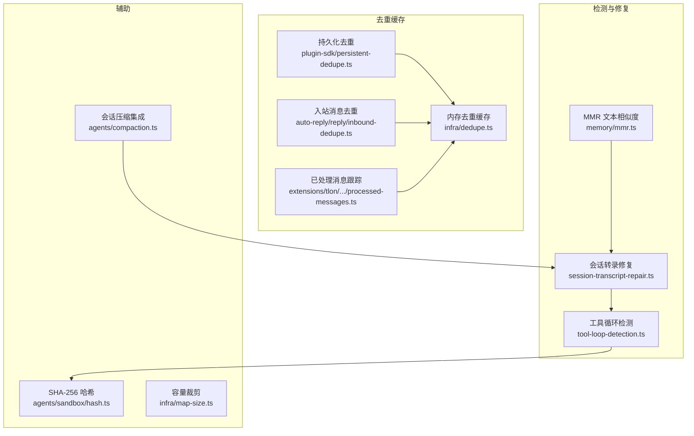
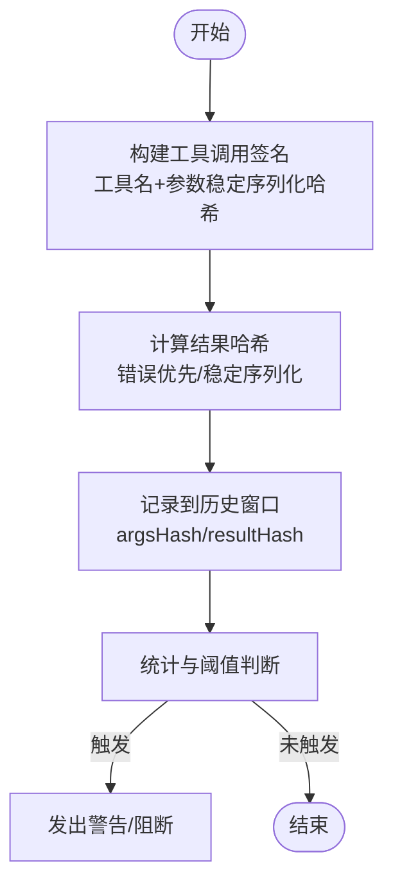
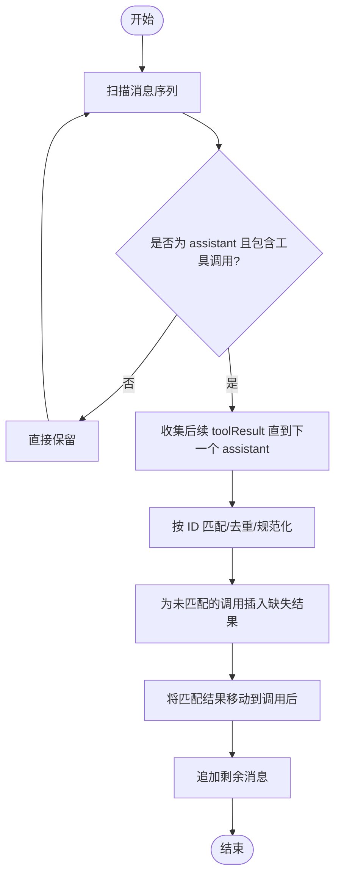
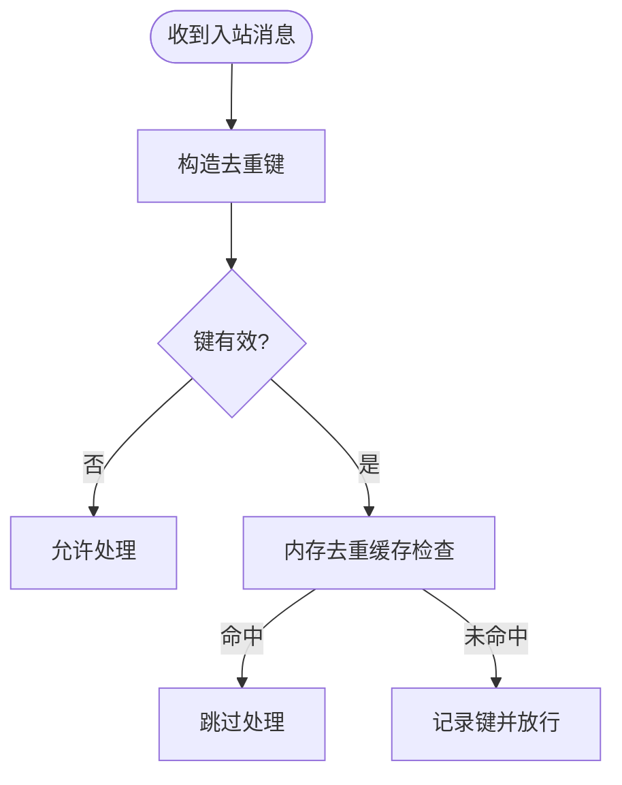
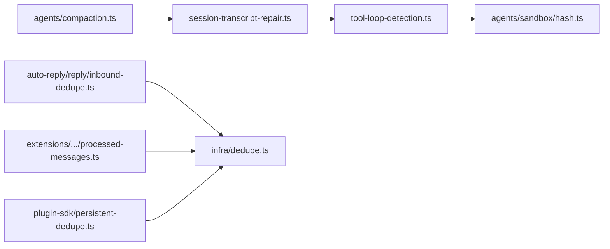

# 重复内容检测

<cite>
**本文引用的文件**
- [src/agents/session-transcript-repair.ts](file://src/agents/session-transcript-repair.ts)
- [src/agents/tool-loop-detection.ts](file://src/agents/tool-loop-detection.ts)
- [src/infra/dedupe.ts](file://src/infra/dedupe.ts)
- [src/plugin-sdk/persistent-dedupe.ts](file://src/plugin-sdk/persistent-dedupe.ts)
- [src/memory/mmr.ts](file://src/memory/mmr.ts)
- [src/auto-reply/reply/inbound-dedupe.ts](file://src/auto-reply/reply/inbound-dedupe.ts)
- [extensions/tlon/src/monitor/processed-messages.ts](file://extensions/tlon/src/monitor/processed-messages.ts)
- [src/agents/compaction.ts](file://src/agents/compaction.ts)
- [src/infra/map-size.ts](file://src/infra/map-size.ts)
- [src/agents/sandbox/hash.ts](file://src/agents/sandbox/hash.ts)
</cite>

## 目录
1. [简介](#简介)
2. [项目结构](#项目结构)
3. [核心组件](#核心组件)
4. [架构总览](#架构总览)
5. [详细组件分析](#详细组件分析)
6. [依赖关系分析](#依赖关系分析)
7. [性能与内存优化](#性能与内存优化)
8. [故障排查指南](#故障排查指南)
9. [结论](#结论)

## 简介
本文件系统性阐述 OpenClaw 的重复内容检测与去重技术，覆盖以下主题：
- 消息内容哈希与相似度比较：基于稳定序列化与 SHA-256 的工具调用哈希，以及基于分词与 Jaccard 的文本相似度。
- 去重策略与实现：内存去重缓存、持久化去重（带 TTL 与容量限制）、入站消息去重、工具调用结果配对修复。
- 工具结果去重处理：repairToolUseResultPairing 如何修复工具调用与结果的配对关系，避免严格模型接口报错。
- 性能优化与内存控制：滑动窗口、LRU 截断、TTL 清理、并发写锁、磁盘持久化裁剪。

## 项目结构
重复检测相关能力分布在多个模块中：
- 工具循环检测与哈希：agents/tool-loop-detection.ts
- 会话转录修复（含工具结果配对修复）：agents/session-transcript-repair.ts
- 内存去重缓存：infra/dedupe.ts
- 持久化去重（带文件锁与裁剪）：plugin-sdk/persistent-dedupe.ts
- 文本相似度与 MMR 重排：memory/mmr.ts
- 入站消息去重：auto-reply/reply/inbound-dedupe.ts
- 处理过的消息跟踪（插件扩展示例）：extensions/tlon/src/monitor/processed-messages.ts
- 会话压缩与配对修复集成：agents/compaction.ts
- 辅助工具（哈希函数、容量裁剪）：agents/sandbox/hash.ts、infra/map-size.ts



**图表来源**
- [src/agents/tool-loop-detection.ts:106-125](file://src/agents/tool-loop-detection.ts#L106-L125)
- [src/agents/session-transcript-repair.ts:342-502](file://src/agents/session-transcript-repair.ts#L342-L502)
- [src/memory/mmr.ts:32-68](file://src/memory/mmr.ts#L32-L68)
- [src/infra/dedupe.ts:15-79](file://src/infra/dedupe.ts#L15-L79)
- [src/plugin-sdk/persistent-dedupe.ts:94-190](file://src/plugin-sdk/persistent-dedupe.ts#L94-L190)
- [src/auto-reply/reply/inbound-dedupe.ts:9-74](file://src/auto-reply/reply/inbound-dedupe.ts#L9-L74)
- [extensions/tlon/src/monitor/processed-messages.ts:9-34](file://extensions/tlon/src/monitor/processed-messages.ts#L9-L34)
- [src/agents/compaction.ts:430-465](file://src/agents/compaction.ts#L430-L465)
- [src/agents/sandbox/hash.ts:3-5](file://src/agents/sandbox/hash.ts#L3-L5)
- [src/infra/map-size.ts:1-16](file://src/infra/map-size.ts#L1-L16)

**章节来源**
- [src/agents/tool-loop-detection.ts:106-125](file://src/agents/tool-loop-detection.ts#L106-L125)
- [src/agents/session-transcript-repair.ts:342-502](file://src/agents/session-transcript-repair.ts#L342-L502)
- [src/infra/dedupe.ts:15-79](file://src/infra/dedupe.ts#L15-L79)
- [src/plugin-sdk/persistent-dedupe.ts:94-190](file://src/plugin-sdk/persistent-dedupe.ts#L94-L190)
- [src/memory/mmr.ts:32-68](file://src/memory/mmr.ts#L32-L68)
- [src/auto-reply/reply/inbound-dedupe.ts:9-74](file://src/auto-reply/reply/inbound-dedupe.ts#L9-L74)
- [extensions/tlon/src/monitor/processed-messages.ts:9-34](file://extensions/tlon/src/monitor/processed-messages.ts#L9-L34)
- [src/agents/compaction.ts:430-465](file://src/agents/compaction.ts#L430-L465)
- [src/agents/sandbox/hash.ts:3-5](file://src/agents/sandbox/hash.ts#L3-L5)
- [src/infra/map-size.ts:1-16](file://src/infra/map-size.ts#L1-L16)

## 核心组件
- 工具调用哈希与结果哈希
  - 工具调用哈希：基于稳定序列化（对象键排序）与 SHA-256，确保参数顺序无关且可复现。
  - 工具结果哈希：对错误或结果进行稳定序列化后哈希；对特定轮询工具仅保留关键字段以降低抖动。
- 去重缓存
  - 内存去重缓存：支持 TTL 过期与最大容量裁剪，按最近访问时间更新。
  - 持久化去重：在文件锁保护下读写 JSON，支持 TTL 与条目上限裁剪，避免并发冲突。
- 文本相似度与重排
  - 分词与 Jaccard 相似度，用于 MMR 平衡相关性与多样性。
- 工具调用与结果配对修复
  - 保证工具结果紧随对应工具调用出现，插入缺失结果，去重并移动漂浮结果，防止严格模型接口报错。
- 入站消息去重
  - 基于多维键（渠道、账号、会话、对端、线程、消息 ID）生成去重键，结合内存缓存跳过重复处理。
- 已处理消息跟踪（插件示例）
  - 通过内存去重缓存跟踪已处理消息 ID，支持容量限制与即时查询。

**章节来源**
- [src/agents/tool-loop-detection.ts:106-125](file://src/agents/tool-loop-detection.ts#L106-L125)
- [src/agents/tool-loop-detection.ts:185-230](file://src/agents/tool-loop-detection.ts#L185-L230)
- [src/infra/dedupe.ts:15-79](file://src/infra/dedupe.ts#L15-L79)
- [src/plugin-sdk/persistent-dedupe.ts:94-190](file://src/plugin-sdk/persistent-dedupe.ts#L94-L190)
- [src/memory/mmr.ts:32-68](file://src/memory/mmr.ts#L32-L68)
- [src/agents/session-transcript-repair.ts:342-502](file://src/agents/session-transcript-repair.ts#L342-L502)
- [src/auto-reply/reply/inbound-dedupe.ts:36-74](file://src/auto-reply/reply/inbound-dedupe.ts#L36-L74)
- [extensions/tlon/src/monitor/processed-messages.ts:9-34](file://extensions/tlon/src/monitor/processed-messages.ts#L9-L34)

## 架构总览
重复检测与去重贯穿“输入—去重—处理—输出”的链路，关键交互如下：

```mermaid
sequenceDiagram
participant In as "输入层"
participant Dedup as "去重缓存/持久化"
participant Loop as "工具循环检测"
participant Fix as "配对修复"
participant Out as "输出层"
In->>Dedup : 生成去重键并检查
Dedup-->>In : 已存在? 跳过/继续
In->>Loop : 记录工具调用与结果哈希
Loop-->>In : 循环/无进展告警
In->>Fix : 修复工具调用与结果配对
Fix-->>Out : 规范化后的消息序列
```

**图表来源**
- [src/auto-reply/reply/inbound-dedupe.ts:55-69](file://src/auto-reply/reply/inbound-dedupe.ts#L55-L69)
- [src/agents/tool-loop-detection.ts:372-495](file://src/agents/tool-loop-detection.ts#L372-L495)
- [src/agents/session-transcript-repair.ts:342-502](file://src/agents/session-transcript-repair.ts#L342-L502)

## 详细组件分析

### 组件A：工具调用与结果哈希（循环检测）
- 设计要点
  - 工具调用哈希：工具名 + 参数稳定序列化哈希，保证同参不同序也一致。
  - 结果哈希：优先错误哈希；否则对结果做稳定序列化；对轮询类工具仅保留关键字段，减少抖动。
  - 历史记录：维护滑动窗口，记录 argsHash 与 resultHash，支持统计与告警。
- 关键流程



**图表来源**
- [src/agents/tool-loop-detection.ts:106-125](file://src/agents/tool-loop-detection.ts#L106-L125)
- [src/agents/tool-loop-detection.ts:185-230](file://src/agents/tool-loop-detection.ts#L185-L230)
- [src/agents/tool-loop-detection.ts:372-495](file://src/agents/tool-loop-detection.ts#L372-L495)
- [src/agents/tool-loop-detection.ts:501-588](file://src/agents/tool-loop-detection.ts#L501-L588)

**章节来源**
- [src/agents/tool-loop-detection.ts:106-125](file://src/agents/tool-loop-detection.ts#L106-L125)
- [src/agents/tool-loop-detection.ts:185-230](file://src/agents/tool-loop-detection.ts#L185-L230)
- [src/agents/tool-loop-detection.ts:372-495](file://src/agents/tool-loop-detection.ts#L372-L495)
- [src/agents/tool-loop-detection.ts:501-588](file://src/agents/tool-loop-detection.ts#L501-L588)

### 组件B：内存去重缓存（DedupeCache）
- 设计要点
  - 键值映射 + 时间戳，支持 TTL 过期与容量裁剪。
  - check 行为：命中返回真并触达最新时间；未命中写入并裁剪。
  - peek 行为：仅查询不触达。
- 复杂度
  - 查询/更新 O(1)，空间 O(n)。
- 使用场景
  - 入站消息去重、已处理消息跟踪等。

**章节来源**
- [src/infra/dedupe.ts:15-79](file://src/infra/dedupe.ts#L15-L79)
- [src/auto-reply/reply/inbound-dedupe.ts:9-12](file://src/auto-reply/reply/inbound-dedupe.ts#L9-L12)
- [extensions/tlon/src/monitor/processed-messages.ts:9-34](file://extensions/tlon/src/monitor/processed-messages.ts#L9-L34)

### 组件C：持久化去重（PersistentDedupe）
- 设计要点
  - 文件锁保护下的 JSON 存储，支持 TTL 与条目上限裁剪。
  - 支持命名空间隔离与预热加载。
  - 飞行中去重（inflight）避免重复 IO。
- 复杂度
  - checkAndRecord 包含 IO，平均 O(1)（受锁等待影响），空间 O(n)。
- 使用场景
  - 跨进程/跨重启的去重需求（如插件/通道幂等）。

**章节来源**
- [src/plugin-sdk/persistent-dedupe.ts:94-190](file://src/plugin-sdk/persistent-dedupe.ts#L94-L190)

### 组件D：文本相似度与 MMR 重排
- 设计要点
  - 分词：小写 + 字母数字 + 下划线正则提取。
  - 相似度：Jaccard 系数，空集时按约定返回。
  - MMR：平衡相关性与多样性，支持配置 lambda 与启用开关。
- 复杂度
  - 单次 Jaccard：O(min(|A|, |B|))；MMR 选择最优项需遍历剩余集合，整体 O(n^2)。

**章节来源**
- [src/memory/mmr.ts:32-68](file://src/memory/mmr.ts#L32-L68)
- [src/memory/mmr.ts:116-183](file://src/memory/mmr.ts#L116-L183)

### 组件E：工具调用与结果配对修复（repairToolUseResultPairing）
- 设计要点
  - 严格模型要求工具结果必须紧跟对应工具调用。
  - 修复策略：
    - 移动漂浮的工具结果到其工具调用之后；
    - 为缺失的结果插入合成错误结果；
    - 去重重复结果（按 ID）；
    - 对异常/中断的工具调用跳过合成结果。
- 流程图



**图表来源**
- [src/agents/session-transcript-repair.ts:342-502](file://src/agents/session-transcript-repair.ts#L342-L502)

**章节来源**
- [src/agents/session-transcript-repair.ts:342-502](file://src/agents/session-transcript-repair.ts#L342-L502)
- [src/agents/compaction.ts:430-465](file://src/agents/compaction.ts#L430-L465)

### 组件F：入站消息去重（InboundDedupe）
- 设计要点
  - 去重键由渠道、账号、会话作用域、对端、线程、消息 ID 组成。
  - 使用内存去重缓存，支持 TTL 与容量上限。
- 流程图



**图表来源**
- [src/auto-reply/reply/inbound-dedupe.ts:36-74](file://src/auto-reply/reply/inbound-dedupe.ts#L36-L74)
- [src/infra/dedupe.ts:57-73](file://src/infra/dedupe.ts#L57-L73)

**章节来源**
- [src/auto-reply/reply/inbound-dedupe.ts:36-74](file://src/auto-reply/reply/inbound-dedupe.ts#L36-L74)
- [src/infra/dedupe.ts:57-73](file://src/infra/dedupe.ts#L57-L73)

### 组件G：已处理消息跟踪（插件示例）
- 设计要点
  - 基于内存去重缓存跟踪消息 ID，支持容量限制。
  - 提供 mark/has/size 接口，便于外部监控与去重。

**章节来源**
- [extensions/tlon/src/monitor/processed-messages.ts:9-34](file://extensions/tlon/src/monitor/processed-messages.ts#L9-L34)

## 依赖关系分析
- 组件耦合
  - 工具循环检测依赖稳定序列化与 SHA-256 哈希。
  - 会话转录修复依赖工具调用解析与结果 ID 提取。
  - 去重缓存被入站去重与插件示例广泛使用。
  - 持久化去重依赖内存去重与文件锁。
- 可能的循环依赖
  - 当前模块间为单向依赖，未见循环导入。



**图表来源**
- [src/agents/tool-loop-detection.ts:106-125](file://src/agents/tool-loop-detection.ts#L106-L125)
- [src/agents/sandbox/hash.ts:3-5](file://src/agents/sandbox/hash.ts#L3-L5)
- [src/agents/session-transcript-repair.ts:342-502](file://src/agents/session-transcript-repair.ts#L342-L502)
- [src/auto-reply/reply/inbound-dedupe.ts:9-12](file://src/auto-reply/reply/inbound-dedupe.ts#L9-L12)
- [src/infra/dedupe.ts:15-79](file://src/infra/dedupe.ts#L15-L79)
- [src/plugin-sdk/persistent-dedupe.ts:94-190](file://src/plugin-sdk/persistent-dedupe.ts#L94-L190)
- [src/agents/compaction.ts:430-465](file://src/agents/compaction.ts#L430-L465)

**章节来源**
- [src/agents/tool-loop-detection.ts:106-125](file://src/agents/tool-loop-detection.ts#L106-L125)
- [src/agents/session-transcript-repair.ts:342-502](file://src/agents/session-transcript-repair.ts#L342-L502)
- [src/infra/dedupe.ts:15-79](file://src/infra/dedupe.ts#L15-L79)
- [src/plugin-sdk/persistent-dedupe.ts:94-190](file://src/plugin-sdk/persistent-dedupe.ts#L94-L190)
- [src/auto-reply/reply/inbound-dedupe.ts:9-12](file://src/auto-reply/reply/inbound-dedupe.ts#L9-L12)
- [src/agents/compaction.ts:430-465](file://src/agents/compaction.ts#L430-L465)
- [src/agents/sandbox/hash.ts:3-5](file://src/agents/sandbox/hash.ts#L3-L5)

## 性能与内存优化
- 哈希与序列化
  - 稳定序列化：对象键排序，避免参数顺序导致的伪差异。
  - SHA-256：常量时间复杂度，适合大规模去重键生成。
- 缓存与容量控制
  - 内存去重缓存：TTL 过期 + 最大容量裁剪，使用 LRU 驱逐策略。
  - 持久化去重：文件锁 + TTL + 条目上限裁剪，避免无限增长。
- 滑动窗口与批量处理
  - 工具循环检测使用固定长度历史窗口，避免无限增长。
  - 会话压缩阶段统一执行配对修复，减少多次扫描成本。
- I/O 与并发
  - 持久化去重采用飞行中去重（inflight）与文件锁，降低竞争。
- 文本相似度
  - MMR 中对所有项预分词，避免重复计算；归一化分数提升公平性。

**章节来源**
- [src/agents/tool-loop-detection.ts:106-125](file://src/agents/tool-loop-detection.ts#L106-L125)
- [src/infra/dedupe.ts:25-39](file://src/infra/dedupe.ts#L25-L39)
- [src/plugin-sdk/persistent-dedupe.ts:67-92](file://src/plugin-sdk/persistent-dedupe.ts#L67-L92)
- [src/agents/tool-loop-detection.ts:27-42](file://src/agents/tool-loop-detection.ts#L27-L42)
- [src/agents/compaction.ts:430-465](file://src/agents/compaction.ts#L430-L465)
- [src/memory/mmr.ts:132-148](file://src/memory/mmr.ts#L132-L148)

## 故障排查指南
- 工具循环检测误报
  - 检查工具参数稳定性与序列化行为；确认轮询工具仅保留关键字段。
  - 调整历史窗口与阈值配置。
- 工具结果配对失败
  - 确认工具调用 ID 正确传递；检查异常/中断状态的消息是否被跳过合成结果。
  - 在压缩阶段观察修复报告中的去重/孤儿数量。
- 去重失效
  - 内存去重：检查 TTL 与容量设置；确认键构造正确。
  - 持久化去重：检查文件路径与锁选项；关注 onDiskError 回调。
- 文本相似度异常
  - 检查分词规则与内容清洗；确认 MMR 配置合理。

**章节来源**
- [src/agents/tool-loop-detection.ts:372-495](file://src/agents/tool-loop-detection.ts#L372-L495)
- [src/agents/session-transcript-repair.ts:342-502](file://src/agents/session-transcript-repair.ts#L342-L502)
- [src/auto-reply/reply/inbound-dedupe.ts:55-69](file://src/auto-reply/reply/inbound-dedupe.ts#L55-L69)
- [src/plugin-sdk/persistent-dedupe.ts:129-134](file://src/plugin-sdk/persistent-dedupe.ts#L129-L134)
- [src/memory/mmr.ts:32-68](file://src/memory/mmr.ts#L32-L68)

## 结论
OpenClaw 的重复内容检测体系以“稳定哈希 + 多级去重 + 结果配对修复”为核心，兼顾实时性与一致性：
- 工具调用与结果哈希确保模式识别的确定性；
- 内存与持久化双层去重满足不同场景需求；
- 工具结果配对修复保障与严格模型接口的兼容；
- MMR 与容量裁剪策略提升检索质量与资源利用率。