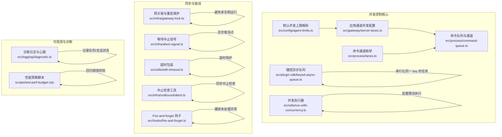
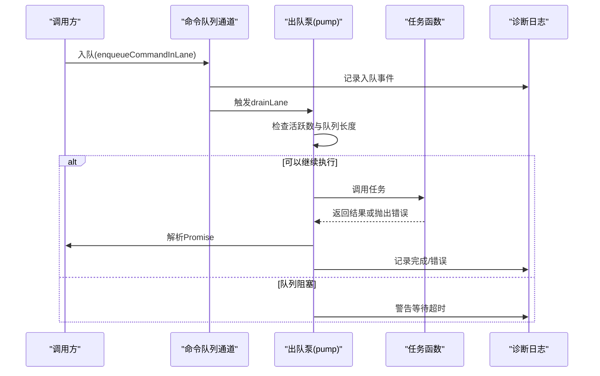
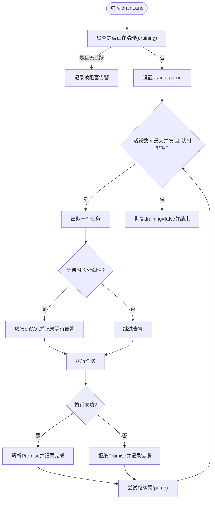
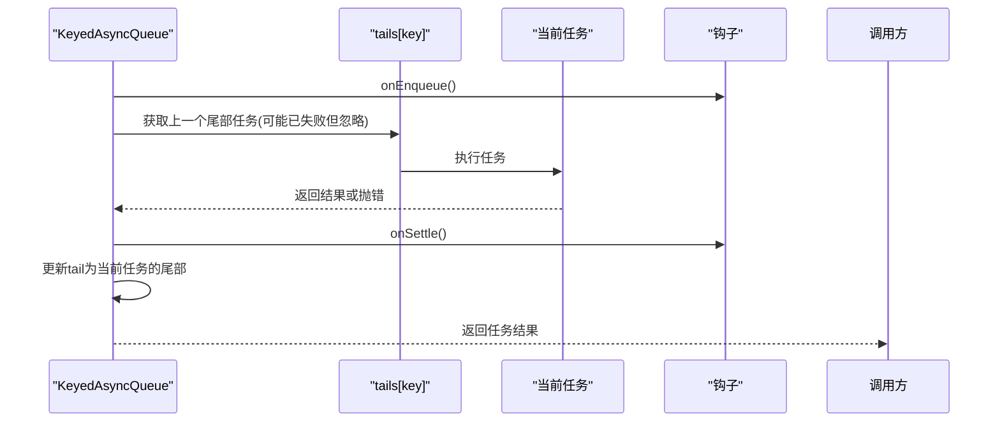
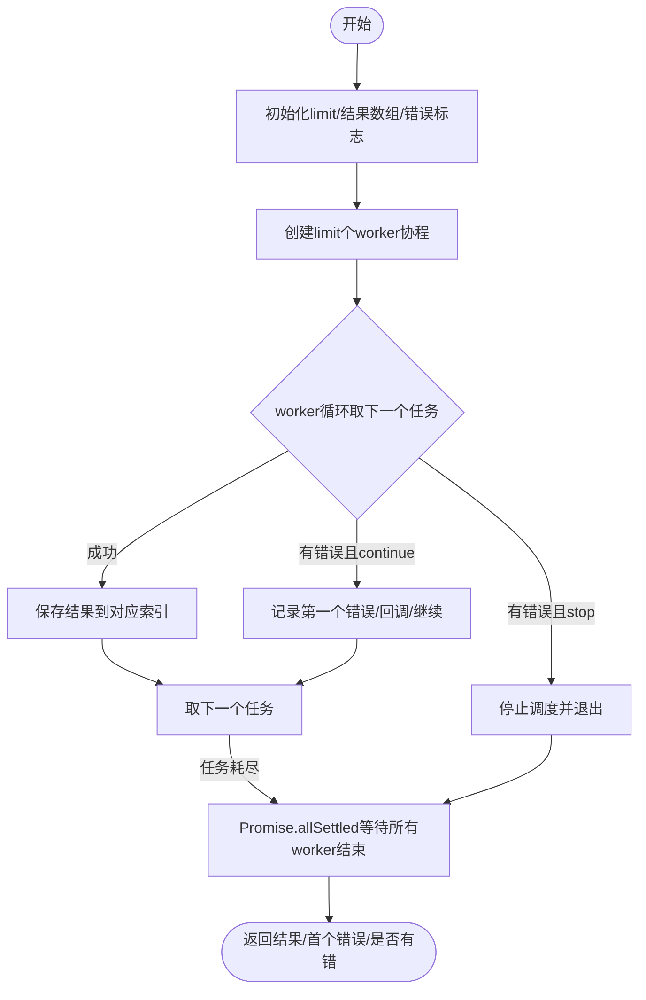
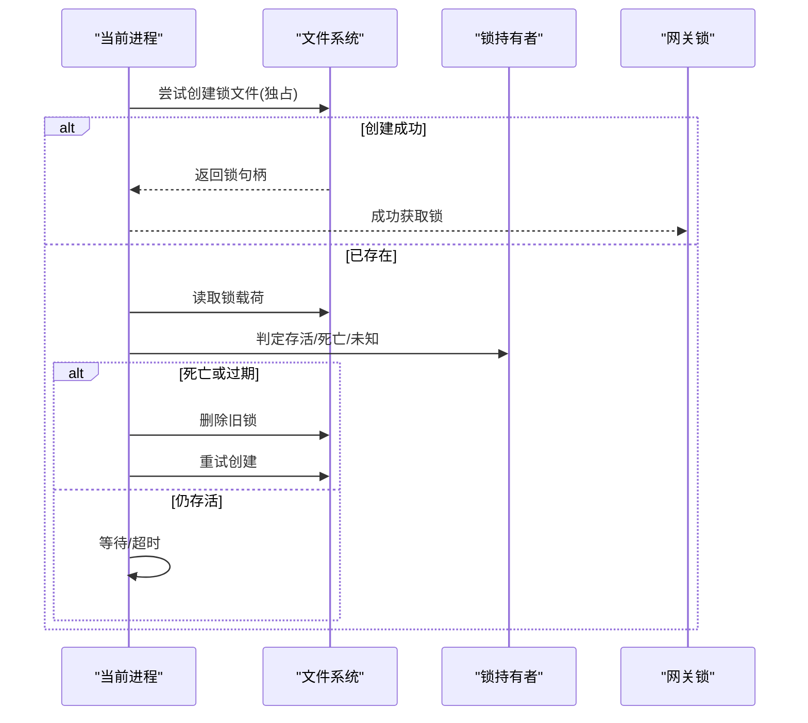
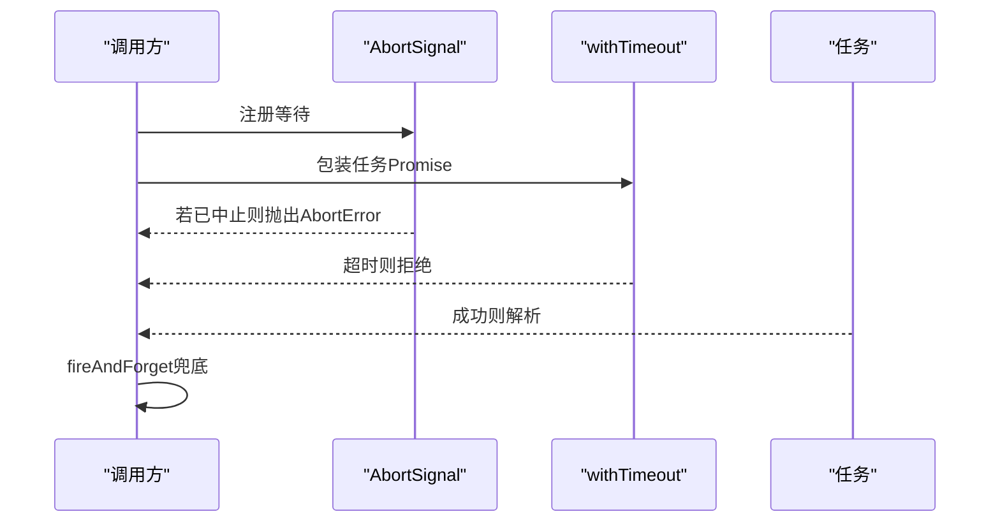
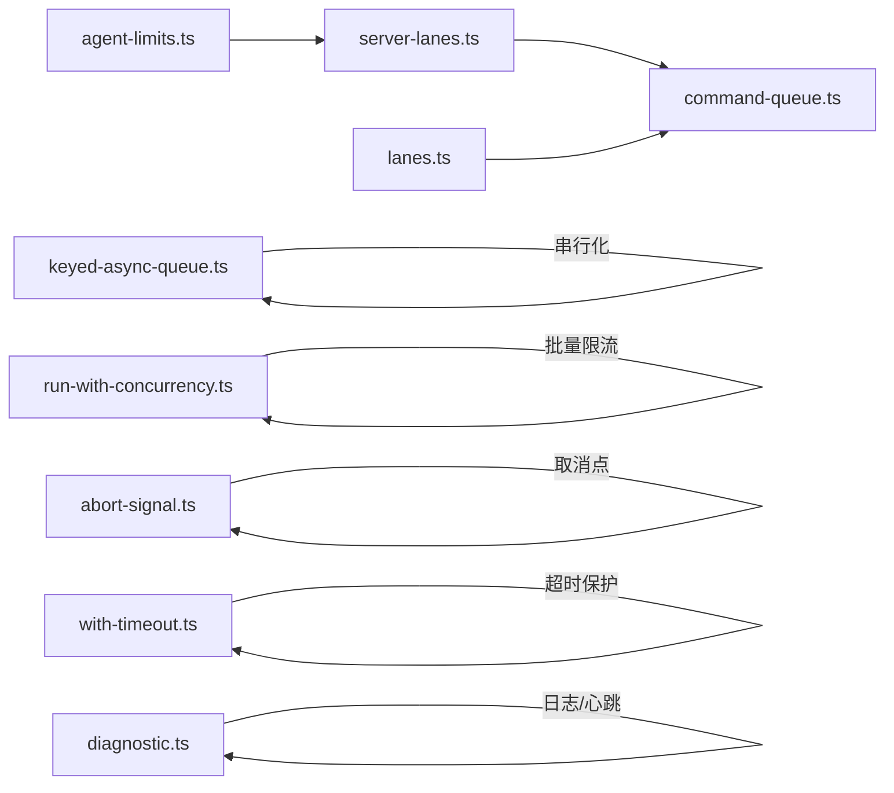

# 并发控制

<cite>
**本文引用的文件**
- [src/process/command-queue.ts](file://src/process/command-queue.ts)
- [src/process/lanes.ts](file://src/process/lanes.ts)
- [src/gateway/server-lanes.ts](file://src/gateway/server-lanes.ts)
- [src/config/agent-limits.ts](file://src/config/agent-limits.ts)
- [src/plugin-sdk/keyed-async-queue.ts](file://src/plugin-sdk/keyed-async-queue.ts)
- [src/utils/run-with-concurrency.ts](file://src/utils/run-with-concurrency.ts)
- [src/infra/gateway-lock.ts](file://src/infra/gateway-lock.ts)
- [src/infra/abort-signal.ts](file://src/infra/abort-signal.ts)
- [src/utils/with-timeout.ts](file://src/utils/with-timeout.ts)
- [src/hooks/fire-and-forget.ts](file://src/hooks/fire-and-forget.ts)
- [src/infra/outbound/abort.ts](file://src/infra/outbound/abort.ts)
- [src/auto-reply/reply/reply-dispatcher.ts](file://src/auto-reply/reply/reply-dispatcher.ts)
- [src/logging/diagnostic.ts](file://src/logging/diagnostic.ts)
- [scripts/test-perf-budget.mjs](file://scripts/test-perf-budget.mjs)
</cite>

## 目录
1. [简介](#简介)
2. [项目结构](#项目结构)
3. [核心组件](#核心组件)
4. [架构总览](#架构总览)
5. [详细组件分析](#详细组件分析)
6. [依赖关系分析](#依赖关系分析)
7. [性能考量](#性能考量)
8. [故障排查指南](#故障排查指南)
9. [结论](#结论)
10. [附录：并发配置与调优](#附录并发配置与调优)

## 简介
本文件系统性梳理 OpenClaw 的并发控制机制，覆盖任务调度与队列管理、任务优先级与执行顺序控制、并发限制与资源配额、异步 Promise 链与错误传播、并发安全与锁机制、并发性能监控与瓶颈分析，以及可调参数与优化建议。目标是帮助开发者在不深入源码的前提下理解并正确使用并发控制能力。

## 项目结构
围绕并发控制的关键模块分布如下：
- 进程内命令队列与通道（Lane）：统一的任务入队、出队、并发上限与清理
- 关键键值串行化队列：按 key 串行执行，不同 key 并行
- 通用并发执行器：固定并发度的批量任务执行与错误策略
- 网关锁与重启保护：进程级互斥与重启时的“清空/重置”语义
- 异步取消与超时：AbortSignal 检查、超时包装与 fire-and-forget 安全钩子
- 性能诊断与心跳：队列深度、等待时间、活动状态与会话卡顿检测
- 配置与应用：从配置解析并发上限，并在网关启动时应用到各 Lane

**图表来源**
- [src/process/command-queue.ts:1-325](file://src/process/command-queue.ts#L1-L325)
- [src/process/lanes.ts:1-7](file://src/process/lanes.ts#L1-L7)
- [src/gateway/server-lanes.ts:1-10](file://src/gateway/server-lanes.ts#L1-L10)
- [src/config/agent-limits.ts:1-23](file://src/config/agent-limits.ts#L1-L23)
- [src/plugin-sdk/keyed-async-queue.ts:1-49](file://src/plugin-sdk/keyed-async-queue.ts#L1-L49)
- [src/utils/run-with-concurrency.ts:1-49](file://src/utils/run-with-concurrency.ts#L1-L49)
- [src/infra/gateway-lock.ts:1-263](file://src/infra/gateway-lock.ts#L1-L263)
- [src/infra/abort-signal.ts:1-12](file://src/infra/abort-signal.ts#L1-L12)
- [src/utils/with-timeout.ts:1-14](file://src/utils/with-timeout.ts#L1-L14)
- [src/hooks/fire-and-forget.ts:1-11](file://src/hooks/fire-and-forget.ts#L1-L11)
- [src/infra/outbound/abort.ts:1-15](file://src/infra/outbound/abort.ts#L1-L15)
- [src/logging/diagnostic.ts:247-266](file://src/logging/diagnostic.ts#L247-L266)
- [scripts/test-perf-budget.mjs:98-127](file://scripts/test-perf-budget.mjs#L98-L127)

**章节来源**
- [src/process/command-queue.ts:1-325](file://src/process/command-queue.ts#L1-L325)
- [src/process/lanes.ts:1-7](file://src/process/lanes.ts#L1-L7)
- [src/gateway/server-lanes.ts:1-10](file://src/gateway/server-lanes.ts#L1-L10)
- [src/config/agent-limits.ts:1-23](file://src/config/agent-limits.ts#L1-L23)
- [src/plugin-sdk/keyed-async-queue.ts:1-49](file://src/plugin-sdk/keyed-async-queue.ts#L1-L49)
- [src/utils/run-with-concurrency.ts:1-49](file://src/utils/run-with-concurrency.ts#L1-L49)
- [src/infra/gateway-lock.ts:1-263](file://src/infra/gateway-lock.ts#L1-L263)
- [src/infra/abort-signal.ts:1-12](file://src/infra/abort-signal.ts#L1-L12)
- [src/utils/with-timeout.ts:1-14](file://src/utils/with-timeout.ts#L1-L14)
- [src/hooks/fire-and-forget.ts:1-11](file://src/hooks/fire-and-forget.ts#L1-L11)
- [src/infra/outbound/abort.ts:1-15](file://src/infra/outbound/abort.ts#L1-L15)
- [src/logging/diagnostic.ts:247-266](file://src/logging/diagnostic.ts#L247-L266)
- [scripts/test-perf-budget.mjs:98-127](file://scripts/test-perf-budget.mjs#L98-L127)

## 核心组件
- 命令队列与通道（Lane）
  - 支持多通道隔离执行，每通道独立维护队列、活跃任务集合、最大并发数与代际计数，保证重启后旧任务完成不会干扰新工作。
  - 提供入队、出队泵（pump）、清空通道、重置所有通道、等待当前活跃任务结束等能力。
- 键控异步队列
  - 同一 key 内部串行执行，不同 key 并行；通过“尾部 Promise”跟踪每个 key 的末尾任务，便于观察与清理。
- 并发执行器
  - 固定并发度的批量任务执行，支持“继续模式”或“遇错停止模式”，并回调每任务错误。
- 网关锁与重启保护
  - 文件锁防止多实例同时运行；在重启场景下标记“网关正在清理”，新入队直接失败，避免孤儿任务。
- 异步取消与超时
  - 在关键异步点检查 AbortSignal，支持超时包装与 fire-and-forget 的错误兜底。
- 诊断与性能
  - 记录队列入/出队、等待时长、会话状态变化、卡顿告警；配合性能预算脚本进行回归阈值校验。

**章节来源**
- [src/process/command-queue.ts:1-325](file://src/process/command-queue.ts#L1-L325)
- [src/plugin-sdk/keyed-async-queue.ts:1-49](file://src/plugin-sdk/keyed-async-queue.ts#L1-L49)
- [src/utils/run-with-concurrency.ts:1-49](file://src/utils/run-with-concurrency.ts#L1-L49)
- [src/infra/gateway-lock.ts:173-262](file://src/infra/gateway-lock.ts#L173-L262)
- [src/infra/abort-signal.ts:1-12](file://src/infra/abort-signal.ts#L1-L12)
- [src/utils/with-timeout.ts:1-14](file://src/utils/with-timeout.ts#L1-L14)
- [src/hooks/fire-and-forget.ts:1-11](file://src/hooks/fire-and-forget.ts#L1-L11)
- [src/logging/diagnostic.ts:247-266](file://src/logging/diagnostic.ts#L247-L266)
- [scripts/test-perf-budget.mjs:98-127](file://scripts/test-perf-budget.mjs#L98-L127)

## 架构总览
OpenClaw 的并发控制由“通道隔离 + 键控串行 + 批量限流 + 取消/超时 + 诊断监控”构成，既保证关键路径（如自动回复主通道）的串行与稳定，又允许低风险并行（如定时任务、子代理）提升吞吐。

**图表来源**
- [src/process/command-queue.ts:80-144](file://src/process/command-queue.ts#L80-L144)
- [src/logging/diagnostic.ts:247-266](file://src/logging/diagnostic.ts#L247-L266)

## 详细组件分析

### 命令队列与通道（Lane）
- 多通道隔离：通过枚举区分 main、cron、subagent、nested 等通道，各自独立并发上限与队列。
- 出队泵（drainLane）：循环从队列取出任务，根据活跃任务数与最大并发数决定是否执行；支持 onWait 回调与等待时长警告。
- 清理与重启：clearCommandLane 清空指定通道队列并拒绝旧任务；resetAllLanes 重置代际计数与活跃集合，保留队列以便重启后继续执行。
- 等待活跃任务：waitForActiveTasks 以短轮询方式等待当前活跃任务结束，支持超时返回。

**图表来源**
- [src/process/command-queue.ts:80-144](file://src/process/command-queue.ts#L80-L144)

**章节来源**
- [src/process/command-queue.ts:1-325](file://src/process/command-queue.ts#L1-L325)
- [src/process/lanes.ts:1-7](file://src/process/lanes.ts#L1-L7)

### 键控异步队列（Keyed Async Queue）
- 同一 key 的任务串行执行，不同 key 并行，适合对特定资源或会话的串行化保障。
- 使用“尾部 Promise”跟踪每个 key 的末尾任务，便于外部观测与清理。
- 支持入队/结算钩子，用于统计与埋点。

**图表来源**
- [src/plugin-sdk/keyed-async-queue.ts:6-31](file://src/plugin-sdk/keyed-async-queue.ts#L6-L31)

**章节来源**
- [src/plugin-sdk/keyed-async-queue.ts:1-49](file://src/plugin-sdk/keyed-async-queue.ts#L1-L49)

### 并发执行器（runTasksWithConcurrency）
- 固定并发度的批量任务执行，内部以多个 worker 循环取下一个任务执行。
- 错误模式：
  - continue：遇到错误继续执行其他任务，记录第一个错误与回调。
  - stop：遇到错误立即停止调度后续任务。
- 适用于工具批量执行、数据采集等场景。

**图表来源**
- [src/utils/run-with-concurrency.ts:3-48](file://src/utils/run-with-concurrency.ts#L3-L48)

**章节来源**
- [src/utils/run-with-concurrency.ts:1-49](file://src/utils/run-with-concurrency.ts#L1-L49)

### 网关锁与重启保护
- 文件锁：在状态目录生成基于配置路径哈希的锁文件，避免多实例同时运行。
- 锁持有者判定：结合 PID 存活、端口探测、Linux 启动时间等策略判断“存活/死亡/未知”。
- 重启保护：在重启前标记“网关正在清理”，新入队直接失败，避免孤儿任务；重启后重置通道状态并继续泵出队列。

**图表来源**
- [src/infra/gateway-lock.ts:173-262](file://src/infra/gateway-lock.ts#L173-L262)

**章节来源**
- [src/infra/gateway-lock.ts:1-263](file://src/infra/gateway-lock.ts#L1-L263)

### 异步取消与超时
- 中止信号：在异步关键点检查 AbortSignal，必要时抛出标准 AbortError。
- 超时包装：将任意 Promise 与超时竞态组合，超时后清理定时器。
- Fire-and-forget：对无需等待的任务，使用 fire-and-forget 钩子捕获未处理异常，避免未捕获异常噪声。

**图表来源**
- [src/infra/abort-signal.ts:1-12](file://src/infra/abort-signal.ts#L1-L12)
- [src/utils/with-timeout.ts:1-14](file://src/utils/with-timeout.ts#L1-L14)
- [src/hooks/fire-and-forget.ts:1-11](file://src/hooks/fire-and-forget.ts#L1-L11)
- [src/infra/outbound/abort.ts:1-15](file://src/infra/outbound/abort.ts#L1-L15)

**章节来源**
- [src/infra/abort-signal.ts:1-12](file://src/infra/abort-signal.ts#L1-L12)
- [src/utils/with-timeout.ts:1-14](file://src/utils/with-timeout.ts#L1-L14)
- [src/hooks/fire-and-forget.ts:1-11](file://src/hooks/fire-and-forget.ts#L1-L11)
- [src/infra/outbound/abort.ts:1-15](file://src/infra/outbound/abort.ts#L1-L15)

### 会话并发与工具执行并发控制
- 会话并发：通过键控队列确保同一会话内的任务串行，避免并发写冲突；不同会话并行。
- 工具执行并发：使用 runTasksWithConcurrency 对工具批量执行进行限流与错误策略控制。
- 自动回复链路：在消息发送链路中使用 Promise 链与错误回调，确保清理与空闲通知。

**章节来源**
- [src/plugin-sdk/keyed-async-queue.ts:1-49](file://src/plugin-sdk/keyed-async-queue.ts#L1-L49)
- [src/utils/run-with-concurrency.ts:1-49](file://src/utils/run-with-concurrency.ts#L1-L49)
- [src/auto-reply/reply/reply-dispatcher.ts:149-181](file://src/auto-reply/reply/reply-dispatcher.ts#L149-L181)

## 依赖关系分析
- 配置到通道：配置模块解析默认并发上限，网关启动时将上限应用到各命令通道。
- 通道到执行：命令通道负责队列与并发，键控队列负责按 key 串行，执行器负责批量限流。
- 取消与超时：贯穿各异步流程，作为安全边界。
- 诊断与监控：统一输出队列与会话状态，辅助定位瓶颈。

**图表来源**
- [src/config/agent-limits.ts:1-23](file://src/config/agent-limits.ts#L1-L23)
- [src/gateway/server-lanes.ts:1-10](file://src/gateway/server-lanes.ts#L1-L10)
- [src/process/command-queue.ts:1-325](file://src/process/command-queue.ts#L1-L325)
- [src/process/lanes.ts:1-7](file://src/process/lanes.ts#L1-L7)
- [src/plugin-sdk/keyed-async-queue.ts:1-49](file://src/plugin-sdk/keyed-async-queue.ts#L1-L49)
- [src/utils/run-with-concurrency.ts:1-49](file://src/utils/run-with-concurrency.ts#L1-L49)
- [src/infra/abort-signal.ts:1-12](file://src/infra/abort-signal.ts#L1-L12)
- [src/utils/with-timeout.ts:1-14](file://src/utils/with-timeout.ts#L1-L14)
- [src/logging/diagnostic.ts:247-266](file://src/logging/diagnostic.ts#L247-L266)

**章节来源**
- [src/config/agent-limits.ts:1-23](file://src/config/agent-limits.ts#L1-L23)
- [src/gateway/server-lanes.ts:1-10](file://src/gateway/server-lanes.ts#L1-L10)
- [src/process/command-queue.ts:1-325](file://src/process/command-queue.ts#L1-L325)
- [src/process/lanes.ts:1-7](file://src/process/lanes.ts#L1-L7)
- [src/plugin-sdk/keyed-async-queue.ts:1-49](file://src/plugin-sdk/keyed-async-queue.ts#L1-L49)
- [src/utils/run-with-concurrency.ts:1-49](file://src/utils/run-with-concurrency.ts#L1-L49)
- [src/infra/abort-signal.ts:1-12](file://src/infra/abort-signal.ts#L1-L12)
- [src/utils/with-timeout.ts:1-14](file://src/utils/with-timeout.ts#L1-L14)
- [src/logging/diagnostic.ts:247-266](file://src/logging/diagnostic.ts#L247-L266)

## 性能考量
- 队列深度与等待时间：通过诊断日志记录入队/出队与等待时长，识别瓶颈通道与积压。
- 会话卡顿检测：基于会话状态与最后活动时间，超过阈值发出卡顿告警。
- 性能预算：使用性能预算脚本对回归进行阈值校验，避免整体耗时恶化。
- 并发度权衡：主通道保持较低并发以保证串行稳定性，定时任务与子代理通道可适度提高并发。

**章节来源**
- [src/logging/diagnostic.ts:247-266](file://src/logging/diagnostic.ts#L247-L266)
- [scripts/test-perf-budget.mjs:98-127](file://scripts/test-perf-budget.mjs#L98-L127)

## 故障排查指南
- 新任务入队失败（GatewayDrainingError）
  - 现象：入队即刻被拒绝。
  - 排查：确认是否处于重启清理阶段；检查 resetAllLanes 是否被调用。
- 通道长时间无进展（drainLane 被阻塞告警）
  - 现象：诊断日志提示 draining=true 且活跃为 0 却仍有排队。
  - 排查：检查任务是否抛错未解析；确认 onWait 回调是否异常。
- 锁无法释放或重复运行
  - 现象：无法获取网关锁或提示已在运行。
  - 排查：检查锁文件是否存在、锁持有者 PID 是否存活、端口是否被占用、Linux 启动时间是否匹配。
- 任务未处理异常噪声
  - 现象：fire-and-forget 任务抛错导致未捕获异常。
  - 排查：使用 fireAndForget 钩子包裹任务，确保错误被捕获并记录。

**章节来源**
- [src/process/command-queue.ts:146-197](file://src/process/command-queue.ts#L146-L197)
- [src/infra/gateway-lock.ts:173-262](file://src/infra/gateway-lock.ts#L173-L262)
- [src/hooks/fire-and-forget.ts:1-11](file://src/hooks/fire-and-forget.ts#L1-L11)

## 结论
OpenClaw 的并发控制以“通道隔离 + 键控串行 + 批量限流 + 取消/超时 + 诊断监控”为核心，既满足关键路径的稳定性，又允许在低风险场景下提升吞吐。通过合理的并发上限配置、严格的取消与超时边界、完善的诊断与性能预算，可以有效避免死锁、饥饿与性能退化问题。

## 附录：并发配置与调优
- 通道并发上限
  - 主通道（Main）：来自配置解析的默认上限，可通过配置覆盖。
  - 子代理通道（Subagent）：默认较高并发，适合并行子任务。
  - 定时任务通道（Cron）：默认较小并发，避免与主通道争抢。
- 调优建议
  - 主通道并发：保持保守，优先保证串行一致性；仅在确认无副作用时适度提升。
  - 子代理并发：根据子任务数量与资源消耗评估，避免过度并行导致资源争用。
  - 定时任务并发：与主通道并发共同决定整体吞吐，建议与业务峰值匹配。
  - 键控串行：对共享资源（如会话状态）使用键控队列，确保串行化。
  - 批量限流：工具执行使用 runTasksWithConcurrency 控制并发度与错误策略。
  - 取消与超时：在长时间 IO 或网络调用处插入 AbortSignal 检查与超时包装。
  - 诊断与预算：开启诊断日志与心跳，结合性能预算脚本持续监控回归。

**章节来源**
- [src/gateway/server-lanes.ts:1-10](file://src/gateway/server-lanes.ts#L1-L10)
- [src/config/agent-limits.ts:1-23](file://src/config/agent-limits.ts#L1-L23)
- [src/process/command-queue.ts:154-159](file://src/process/command-queue.ts#L154-L159)
- [src/plugin-sdk/keyed-async-queue.ts:1-49](file://src/plugin-sdk/keyed-async-queue.ts#L1-L49)
- [src/utils/run-with-concurrency.ts:1-49](file://src/utils/run-with-concurrency.ts#L1-L49)
- [src/infra/abort-signal.ts:1-12](file://src/infra/abort-signal.ts#L1-L12)
- [src/utils/with-timeout.ts:1-14](file://src/utils/with-timeout.ts#L1-L14)
- [src/logging/diagnostic.ts:247-266](file://src/logging/diagnostic.ts#L247-L266)
- [scripts/test-perf-budget.mjs:98-127](file://scripts/test-perf-budget.mjs#L98-L127)