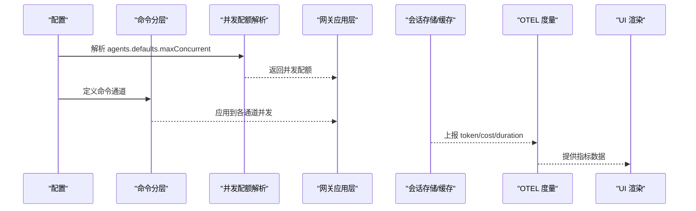
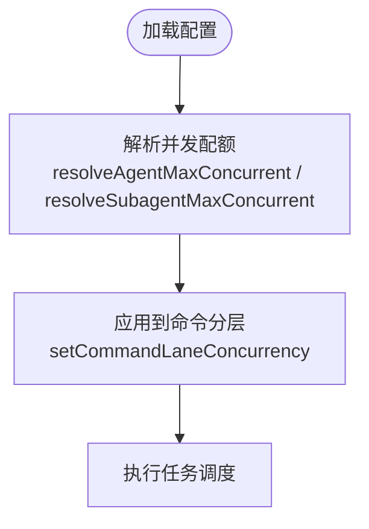
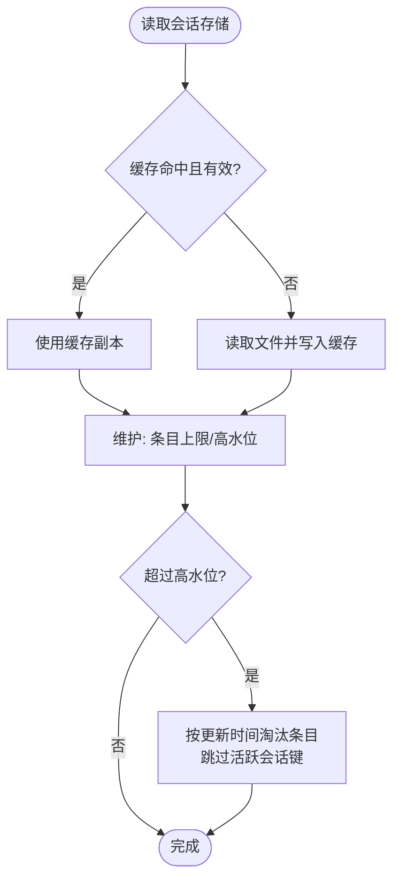
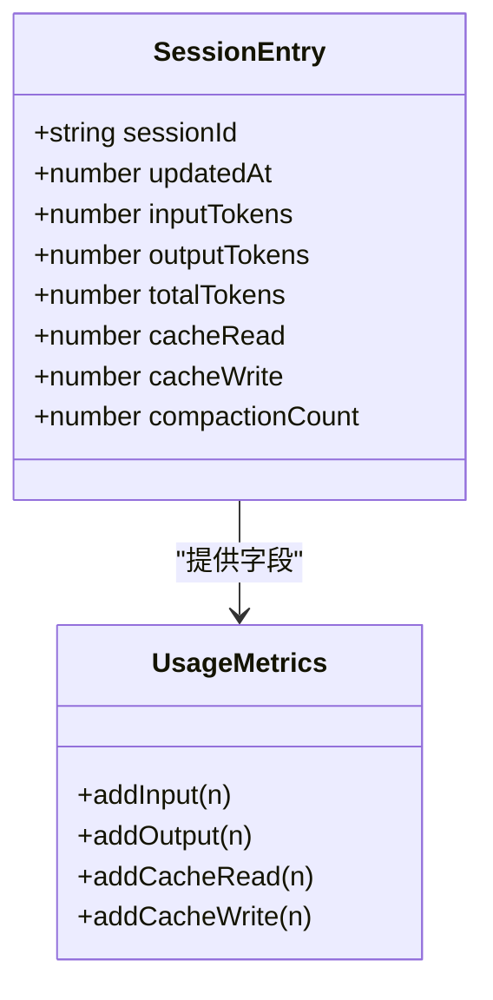
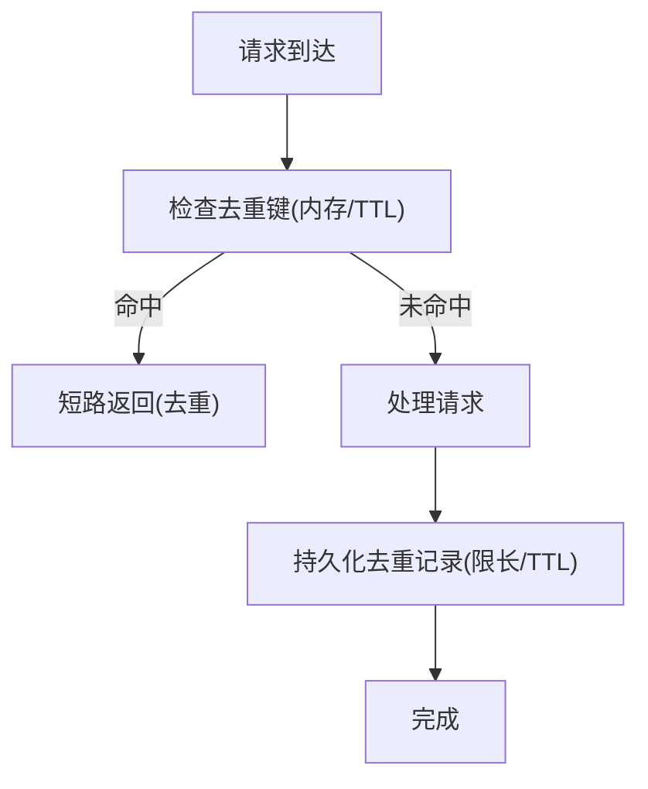
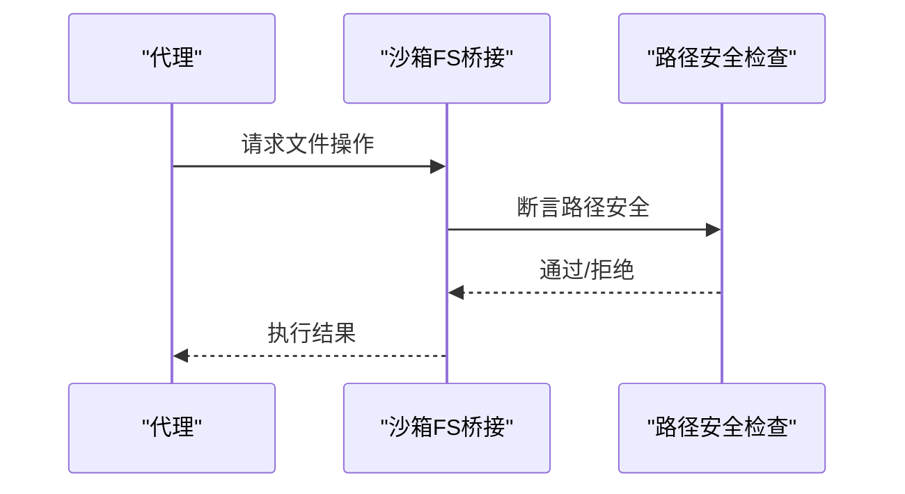
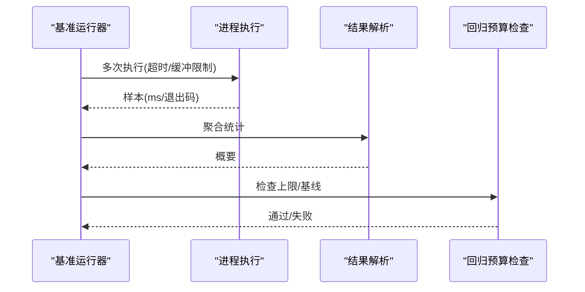
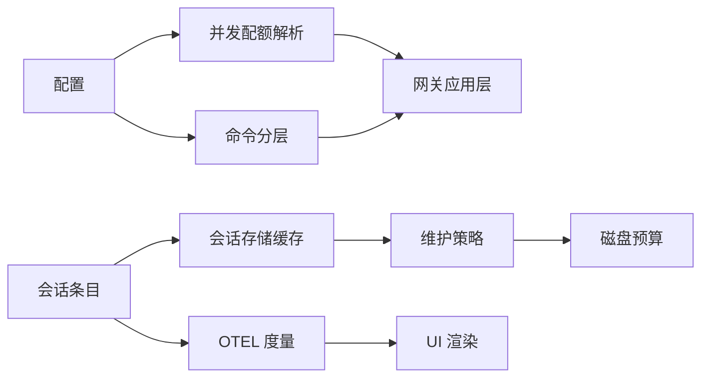

# 性能优化

<cite>
**本文引用的文件**
- [src/config/agent-limits.ts](file://src/config/agent-limits.ts)
- [src/process/lanes.ts](file://src/process/lanes.ts)
- [src/gateway/server-lanes.ts](file://src/gateway/server-lanes.ts)
- [src/config/sessions/types.ts](file://src/config/sessions/types.ts)
- [src/config/sessions/store-cache.ts](file://src/config/sessions/store-cache.ts)
- [src/config/sessions/store-maintenance.ts](file://src/config/sessions/store-maintenance.ts)
- [src/config/sessions/disk-budget.ts](file://src/config/sessions/disk-budget.ts)
- [src/auto-reply/reply/session-updates.ts](file://src/auto-reply/reply/session-updates.ts)
- [src/plugin-sdk/persistent-dedupe.ts](file://src/plugin-sdk/persistent-dedupe.ts)
- [src/shared/usage-aggregates.ts](file://src/shared/usage-aggregates.ts)
- [extensions/diagnostics-otel/src/service.ts](file://extensions/diagnostics-otel/src/service.ts)
- [ui/src/ui/views/usage-render-overview.ts](file://ui/src/ui/views/usage-render-overview.ts)
- [ui/src/ui/views/usage-render-details.ts](file://ui/src/ui/views/usage-render-details.ts)
- [scripts/bench-cli-startup.ts](file://scripts/bench-cli-startup.ts)
- [apps/android/scripts/perf-startup-benchmark.sh](file://apps/android/scripts/perf-startup-benchmark.sh)
- [scripts/test-perf-budget.mjs](file://scripts/test-perf-budget.mjs)
- [src/agents/sandbox/fs-bridge.ts](file://src/agents/sandbox/fs-bridge.ts)
- [src/agents/sandbox-paths.ts](file://src/agents/sandbox-paths.ts)
- [src/agents/sandbox/fs-bridge-path-safety.ts](file://src/agents/sandbox/fs-bridge-path-safety.ts)
- [src/agents/test-helpers/unsafe-mounted-sandbox.ts](file://src/agents/test-helpers/unsafe-mounted-sandbox.ts)
</cite>

## 目录
1. [简介](#简介)
2. [项目结构](#项目结构)
3. [核心组件](#核心组件)
4. [架构总览](#架构总览)
5. [详细组件分析](#详细组件分析)
6. [依赖关系分析](#依赖关系分析)
7. [性能考量](#性能考量)
8. [故障排查指南](#故障排查指南)
9. [结论](#结论)
10. [附录](#附录)

## 简介
本文件面向 OpenClaw 的性能优化，聚焦以下目标：
- 关键性能指标与监控：响应时间、吞吐量、内存使用、CPU 利用率
- 资源分配优化：内存限制、CPU 配额、磁盘 I/O 调优
- 缓存策略：会话缓存、模型缓存、媒体缓存（概念性）
- 并发控制与负载均衡：通道与任务分层、并发配额
- 压缩与去重：会话数据压缩、存储优化
- 沙箱隔离对性能的影响与优化建议
- 性能测试与基准测试：方法与工具

## 项目结构
OpenClaw 在多语言与多平台下运行，性能相关能力主要分布在以下模块：
- 会话与存储：会话条目类型、缓存与维护、磁盘预算
- 并发与通道：命令分层、并发配额解析
- 监控与度量：令牌计数、时延直方图、成本度量
- 测试与基准：CLI 启动基准、Android 启动基准、回归预算

```mermaid
graph TB
subgraph "并发与通道"
Lanes["命令分层<br/>src/process/lanes.ts"]
Limits["并发配额解析<br/>src/config/agent-limits.ts"]
GatewayLanes["网关应用分层并发<br/>src/gateway/server-lanes.ts"]
end
subgraph "会话与存储"
Types["会话条目类型<br/>src/config/sessions/types.ts"]
StoreCache["会话存储缓存<br/>src/config/sessions/store-cache.ts"]
Maint["会话维护与限额<br/>src/config/sessions/store-maintenance.ts"]
DiskBudget["磁盘预算与清理<br/>src/config/sessions/disk-budget.ts"]
Compaction["会话压缩计数更新<br/>src/auto-reply/reply/session-updates.ts"]
end
subgraph "监控与度量"
UsageAgg["使用聚合<br/>src/shared/usage-aggregates.ts"]
OTEL["OTEL 度量服务<br/>extensions/diagnostics-otel/src/service.ts"]
UIOverview["使用概览渲染<br/>ui/src/ui/views/usage-render-overview.ts"]
UIDetails["使用详情渲染<br/>ui/src/ui/views/usage-render-details.ts"]
end
subgraph "测试与基准"
BenchCLI["CLI 启动基准<br/>scripts/bench-cli-startup.ts"]
BenchAndroid["Android 启动基准脚本<br/>apps/android/scripts/perf-startup-benchmark.sh"]
PerfBudget["性能回归预算<br/>scripts/test-perf-budget.mjs"]
end
Lanes --> GatewayLanes
Limits --> GatewayLanes
Types --> StoreCache
StoreCache --> Maint
Maint --> DiskBudget
Types --> Compaction
UsageAgg --> OTEL
OTEL --> UIOverview
OTEL --> UIDetails
BenchCLI --> PerfBudget
BenchAndroid --> PerfBudget
```

**图表来源**
- [src/process/lanes.ts:1-7](file://src/process/lanes.ts#L1-L7)
- [src/config/agent-limits.ts:1-23](file://src/config/agent-limits.ts#L1-L23)
- [src/gateway/server-lanes.ts:1-10](file://src/gateway/server-lanes.ts#L1-L10)
- [src/config/sessions/types.ts:68-171](file://src/config/sessions/types.ts#L68-L171)
- [src/config/sessions/store-cache.ts:37-81](file://src/config/sessions/store-cache.ts#L37-L81)
- [src/config/sessions/store-maintenance.ts:221-268](file://src/config/sessions/store-maintenance.ts#L221-L268)
- [src/config/sessions/disk-budget.ts:50-311](file://src/config/sessions/disk-budget.ts#L50-L311)
- [src/auto-reply/reply/session-updates.ts:241-294](file://src/auto-reply/reply/session-updates.ts#L241-L294)
- [src/shared/usage-aggregates.ts:32-66](file://src/shared/usage-aggregates.ts#L32-L66)
- [extensions/diagnostics-otel/src/service.ts:389-426](file://extensions/diagnostics-otel/src/service.ts#L389-L426)
- [ui/src/ui/views/usage-render-overview.ts:380-533](file://ui/src/ui/views/usage-render-overview.ts#L380-L533)
- [ui/src/ui/views/usage-render-details.ts:394-429](file://ui/src/ui/views/usage-render-details.ts#L394-L429)
- [scripts/bench-cli-startup.ts:59-154](file://scripts/bench-cli-startup.ts#L59-L154)
- [apps/android/scripts/perf-startup-benchmark.sh:55-124](file://apps/android/scripts/perf-startup-benchmark.sh#L55-L124)
- [scripts/test-perf-budget.mjs:98-127](file://scripts/test-perf-budget.mjs#L98-L127)

**章节来源**
- [src/process/lanes.ts:1-7](file://src/process/lanes.ts#L1-L7)
- [src/config/agent-limits.ts:1-23](file://src/config/agent-limits.ts#L1-L23)
- [src/gateway/server-lanes.ts:1-10](file://src/gateway/server-lanes.ts#L1-L10)
- [src/config/sessions/types.ts:68-171](file://src/config/sessions/types.ts#L68-L171)
- [src/config/sessions/store-cache.ts:37-81](file://src/config/sessions/store-cache.ts#L37-L81)
- [src/config/sessions/store-maintenance.ts:221-268](file://src/config/sessions/store-maintenance.ts#L221-L268)
- [src/config/sessions/disk-budget.ts:50-311](file://src/config/sessions/disk-budget.ts#L50-L311)
- [src/auto-reply/reply/session-updates.ts:241-294](file://src/auto-reply/reply/session-updates.ts#L241-L294)
- [src/shared/usage-aggregates.ts:32-66](file://src/shared/usage-aggregates.ts#L32-L66)
- [extensions/diagnostics-otel/src/service.ts:389-426](file://extensions/diagnostics-otel/src/service.ts#L389-L426)
- [ui/src/ui/views/usage-render-overview.ts:380-533](file://ui/src/ui/views/usage-render-overview.ts#L380-L533)
- [ui/src/ui/views/usage-render-details.ts:394-429](file://ui/src/ui/views/usage-render-details.ts#L394-L429)
- [scripts/bench-cli-startup.ts:59-154](file://scripts/bench-cli-startup.ts#L59-L154)
- [apps/android/scripts/perf-startup-benchmark.sh:55-124](file://apps/android/scripts/perf-startup-benchmark.sh#L55-L124)
- [scripts/test-perf-budget.mjs:98-127](file://scripts/test-perf-budget.mjs#L98-L127)

## 核心组件
- 命令分层与并发配额
  - 分层枚举定义了主任务、定时任务、子代理等通道
  - 并发配额解析从配置中读取默认值，并可被网关应用层覆盖
- 会话条目与缓存
  - 会话条目包含输入/输出/总 token、缓存读写、紧凑化计数等字段
  - 会话存储支持内存缓存与序列化缓存，带 TTL 与一致性校验
  - 维护策略支持按大小上限与条目数量上限进行裁剪
  - 磁盘预算通过逐条估算与投影式删除实现高水位控制
- 使用统计与度量
  - 使用聚合函数合并延迟与用量
  - OTEL 插件上报令牌、成本、时延、上下文占用等指标
  - UI 展示吞吐、错误率、缓存命中率等关键指标
- 基准与回归测试
  - CLI 启动基准收集平均/中位/95 分位耗时
  - Android 启动基准导出 JSON 并支持与基线对比
  - 性能回归预算检查绝对上限与相对回归阈值

**章节来源**
- [src/process/lanes.ts:1-7](file://src/process/lanes.ts#L1-L7)
- [src/config/agent-limits.ts:1-23](file://src/config/agent-limits.ts#L1-L23)
- [src/gateway/server-lanes.ts:1-10](file://src/gateway/server-lanes.ts#L1-L10)
- [src/config/sessions/types.ts:68-171](file://src/config/sessions/types.ts#L68-L171)
- [src/config/sessions/store-cache.ts:37-81](file://src/config/sessions/store-cache.ts#L37-L81)
- [src/config/sessions/store-maintenance.ts:221-268](file://src/config/sessions/store-maintenance.ts#L221-L268)
- [src/config/sessions/disk-budget.ts:50-311](file://src/config/sessions/disk-budget.ts#L50-L311)
- [src/shared/usage-aggregates.ts:32-66](file://src/shared/usage-aggregates.ts#L32-L66)
- [extensions/diagnostics-otel/src/service.ts:389-426](file://extensions/diagnostics-otel/src/service.ts#L389-L426)
- [ui/src/ui/views/usage-render-overview.ts:380-533](file://ui/src/ui/views/usage-render-overview.ts#L380-L533)
- [scripts/bench-cli-startup.ts:59-154](file://scripts/bench-cli-startup.ts#L59-L154)
- [apps/android/scripts/perf-startup-benchmark.sh:55-124](file://apps/android/scripts/perf-startup-benchmark.sh#L55-L124)
- [scripts/test-perf-budget.mjs:98-127](file://scripts/test-perf-budget.mjs#L98-L127)

## 架构总览
下图展示性能相关模块在运行期的交互路径：并发控制决定任务调度，会话存储承载状态与缓存，度量插件采集指标，UI 渲染关键指标，基准与回归工具保障性能稳定性。

**图表来源**
- [src/config/agent-limits.ts:1-23](file://src/config/agent-limits.ts#L1-L23)
- [src/process/lanes.ts:1-7](file://src/process/lanes.ts#L1-L7)
- [src/gateway/server-lanes.ts:1-10](file://src/gateway/server-lanes.ts#L1-L10)
- [extensions/diagnostics-otel/src/service.ts:389-426](file://extensions/diagnostics-otel/src/service.ts#L389-L426)
- [ui/src/ui/views/usage-render-overview.ts:380-533](file://ui/src/ui/views/usage-render-overview.ts#L380-L533)

## 详细组件分析

### 并发控制与负载均衡
- 命令分层
  - 主通道、定时任务、子代理、嵌套通道用于区分优先级与隔离
- 并发配额解析
  - 默认值与配置项共同决定最大并发数
- 网关应用层
  - 将解析结果设置到命令队列，统一管理各通道并发

**图表来源**
- [src/config/agent-limits.ts:8-22](file://src/config/agent-limits.ts#L8-L22)
- [src/gateway/server-lanes.ts:6-10](file://src/gateway/server-lanes.ts#L6-L10)
- [src/process/lanes.ts:1-7](file://src/process/lanes.ts#L1-L7)

**章节来源**
- [src/config/agent-limits.ts:1-23](file://src/config/agent-limits.ts#L1-L23)
- [src/gateway/server-lanes.ts:1-10](file://src/gateway/server-lanes.ts#L1-L10)
- [src/process/lanes.ts:1-7](file://src/process/lanes.ts#L1-L7)

### 会话缓存与存储优化
- 会话条目字段
  - 包含输入/输出/总 token、缓存读写、紧凑化计数等，支撑缓存命中率与吞吐统计
- 存储缓存
  - 内存缓存与序列化缓存，带 TTL 与 mtime/size 校验，避免重复 IO
- 维护策略
  - 按条目数量上限裁剪，按最近更新时间排序，未更新条目优先移除
- 磁盘预算
  - 逐条估算 JSON 字节大小，投影式删除以逼近高水位，跳过活跃会话键

**图表来源**
- [src/config/sessions/store-cache.ts:41-81](file://src/config/sessions/store-cache.ts#L41-L81)
- [src/config/sessions/store-maintenance.ts:221-268](file://src/config/sessions/store-maintenance.ts#L221-L268)
- [src/config/sessions/disk-budget.ts:280-311](file://src/config/sessions/disk-budget.ts#L280-L311)
- [src/config/sessions/types.ts:129-150](file://src/config/sessions/types.ts#L129-L150)

**章节来源**
- [src/config/sessions/types.ts:68-171](file://src/config/sessions/types.ts#L68-L171)
- [src/config/sessions/store-cache.ts:37-81](file://src/config/sessions/store-cache.ts#L37-L81)
- [src/config/sessions/store-maintenance.ts:221-268](file://src/config/sessions/store-maintenance.ts#L221-L268)
- [src/config/sessions/disk-budget.ts:50-311](file://src/config/sessions/disk-budget.ts#L50-L311)

### 缓存策略设计与实现
- 会话缓存
  - 通过会话条目中的 cacheRead 与 cacheWrite 字段统计缓存命中与写入
  - UI 展示缓存命中率与缓存/新写入 token 数
- 模型缓存
  - 通过会话条目中的模型与提供方字段，结合 OTEL 指标进行模型使用统计
- 媒体缓存（概念性）
  - 可借鉴会话缓存模式，基于内容指纹或元数据建立缓存键，结合 TTL 与容量控制

**图表来源**
- [src/config/sessions/types.ts:129-150](file://src/config/sessions/types.ts#L129-L150)
- [extensions/diagnostics-otel/src/service.ts:389-426](file://extensions/diagnostics-otel/src/service.ts#L389-L426)
- [ui/src/ui/views/usage-render-overview.ts:380-533](file://ui/src/ui/views/usage-render-overview.ts#L380-L533)

**章节来源**
- [src/config/sessions/types.ts:129-150](file://src/config/sessions/types.ts#L129-L150)
- [extensions/diagnostics-otel/src/service.ts:389-426](file://extensions/diagnostics-otel/src/service.ts#L389-L426)
- [ui/src/ui/views/usage-render-overview.ts:380-533](file://ui/src/ui/views/usage-render-overview.ts#L380-L533)

### 压缩与去重技术
- 会话压缩
  - 通过 compactionCount 与 totalTokensFresh 字段跟踪上下文压缩状态，减少重复计算
- 去重
  - 基于持久化去重器的内存缓存与磁盘条目上限，结合 TTL 控制重复请求处理

**图表来源**
- [src/auto-reply/reply/session-updates.ts:241-294](file://src/auto-reply/reply/session-updates.ts#L241-L294)
- [src/plugin-sdk/persistent-dedupe.ts:94-111](file://src/plugin-sdk/persistent-dedupe.ts#L94-L111)

**章节来源**
- [src/auto-reply/reply/session-updates.ts:241-294](file://src/auto-reply/reply/session-updates.ts#L241-L294)
- [src/plugin-sdk/persistent-dedupe.ts:94-111](file://src/plugin-sdk/persistent-dedupe.ts#L94-L111)

### 沙箱隔离对性能的影响与优化建议
- 文件系统桥接
  - 沙箱文件系统桥接提供安全的读写/删除/重命名/统计接口，防止越界访问
- 路径安全
  - 路径解析与边界检查确保操作限定在沙箱根内，避免逃逸带来的额外开销
- 不安全挂载测试夹具
  - 提供不安全挂载场景的测试夹具，便于评估隔离与性能权衡

**图表来源**
- [src/agents/sandbox/fs-bridge.ts:37-71](file://src/agents/sandbox/fs-bridge.ts#L37-L71)
- [src/agents/sandbox-paths.ts:40-79](file://src/agents/sandbox-paths.ts#L40-L79)
- [src/agents/sandbox/fs-bridge-path-safety.ts:51-83](file://src/agents/sandbox/fs-bridge-path-safety.ts#L51-L83)
- [src/agents/test-helpers/unsafe-mounted-sandbox.ts:68-82](file://src/agents/test-helpers/unsafe-mounted-sandbox.ts#L68-L82)

**章节来源**
- [src/agents/sandbox/fs-bridge.ts:37-71](file://src/agents/sandbox/fs-bridge.ts#L37-L71)
- [src/agents/sandbox-paths.ts:40-79](file://src/agents/sandbox-paths.ts#L40-L79)
- [src/agents/sandbox/fs-bridge-path-safety.ts:51-83](file://src/agents/sandbox/fs-bridge-path-safety.ts#L51-L83)
- [src/agents/test-helpers/unsafe-mounted-sandbox.ts:68-82](file://src/agents/test-helpers/unsafe-mounted-sandbox.ts#L68-L82)

### 性能测试与基准测试
- CLI 启动基准
  - 收集多次启动样本，计算平均/中位/95 分位与退出码分布
- Android 启动基准
  - 运行仪器测试并提取 JSON 结果，支持与基线对比
- 性能回归预算
  - 检查绝对上限与相对回归阈值，失败时输出详细信息并退出

**图表来源**
- [scripts/bench-cli-startup.ts:59-154](file://scripts/bench-cli-startup.ts#L59-L154)
- [apps/android/scripts/perf-startup-benchmark.sh:55-124](file://apps/android/scripts/perf-startup-benchmark.sh#L55-L124)
- [scripts/test-perf-budget.mjs:98-127](file://scripts/test-perf-budget.mjs#L98-L127)

**章节来源**
- [scripts/bench-cli-startup.ts:59-154](file://scripts/bench-cli-startup.ts#L59-L154)
- [apps/android/scripts/perf-startup-benchmark.sh:55-124](file://apps/android/scripts/perf-startup-benchmark.sh#L55-L124)
- [scripts/test-perf-budget.mjs:98-127](file://scripts/test-perf-budget.mjs#L98-L127)

## 依赖关系分析
- 并发控制依赖配置解析与命令分层
- 会话存储依赖缓存与维护策略，受磁盘预算约束
- 度量插件依赖会话条目中的 token/缓存字段
- UI 渲染依赖使用聚合与度量数据

**图表来源**
- [src/config/agent-limits.ts:1-23](file://src/config/agent-limits.ts#L1-L23)
- [src/process/lanes.ts:1-7](file://src/process/lanes.ts#L1-L7)
- [src/gateway/server-lanes.ts:1-10](file://src/gateway/server-lanes.ts#L1-L10)
- [src/config/sessions/types.ts:68-171](file://src/config/sessions/types.ts#L68-L171)
- [src/config/sessions/store-cache.ts:37-81](file://src/config/sessions/store-cache.ts#L37-L81)
- [src/config/sessions/store-maintenance.ts:221-268](file://src/config/sessions/store-maintenance.ts#L221-L268)
- [src/config/sessions/disk-budget.ts:50-311](file://src/config/sessions/disk-budget.ts#L50-L311)
- [extensions/diagnostics-otel/src/service.ts:389-426](file://extensions/diagnostics-otel/src/service.ts#L389-L426)
- [ui/src/ui/views/usage-render-overview.ts:380-533](file://ui/src/ui/views/usage-render-overview.ts#L380-L533)

**章节来源**
- [src/config/agent-limits.ts:1-23](file://src/config/agent-limits.ts#L1-L23)
- [src/process/lanes.ts:1-7](file://src/process/lanes.ts#L1-L7)
- [src/gateway/server-lanes.ts:1-10](file://src/gateway/server-lanes.ts#L1-L10)
- [src/config/sessions/types.ts:68-171](file://src/config/sessions/types.ts#L68-L171)
- [src/config/sessions/store-cache.ts:37-81](file://src/config/sessions/store-cache.ts#L37-L81)
- [src/config/sessions/store-maintenance.ts:221-268](file://src/config/sessions/store-maintenance.ts#L221-L268)
- [src/config/sessions/disk-budget.ts:50-311](file://src/config/sessions/disk-budget.ts#L50-L311)
- [extensions/diagnostics-otel/src/service.ts:389-426](file://extensions/diagnostics-otel/src/service.ts#L389-L426)
- [ui/src/ui/views/usage-render-overview.ts:380-533](file://ui/src/ui/views/usage-render-overview.ts#L380-L533)

## 性能考量
- 响应时间
  - 通过命令分层与并发配额控制任务排队与执行；使用 OTEL 记录时延直方图
- 吞吐量
  - 通过会话条目中的 token 字段与 UI 指标计算吞吐；结合缓存命中率提升有效吞吐
- 内存使用
  - 会话存储缓存带 TTL 与一致性校验，避免频繁 IO；维护策略按条目数量上限裁剪
- CPU 利用率
  - 并发配额与通道隔离降低争用；基准工具在 CI 中根据主机负载动态调整工作集

[本节为通用指导，无需列出具体文件来源]

## 故障排查指南
- 缓存未命中或命中率低
  - 检查会话条目 cacheRead/cacheWrite 是否正确更新；确认缓存 TTL 与一致性参数
- 存储膨胀或磁盘不足
  - 检查高水位与条目上限配置；确认活跃会话键是否被跳过删除
- 并发瓶颈
  - 检查命令分层并发设置与实际负载；必要时调低并发或拆分通道
- 回归超限
  - 查看基准工具输出的绝对上限与基线对比信息，定位异常样本

**章节来源**
- [src/config/sessions/store-cache.ts:37-81](file://src/config/sessions/store-cache.ts#L37-L81)
- [src/config/sessions/disk-budget.ts:280-311](file://src/config/sessions/disk-budget.ts#L280-L311)
- [scripts/test-perf-budget.mjs:98-127](file://scripts/test-perf-budget.mjs#L98-L127)

## 结论
OpenClaw 的性能优化围绕“并发控制、会话存储、度量与基准”四大支柱展开。通过合理的并发配额、高效的会话缓存与磁盘预算、完善的度量体系以及严格的基准回归，可在多平台与多语言环境下保持稳定与高效。沙箱隔离虽带来一定开销，但通过路径安全检查与桥接接口的最小化设计，可将影响降至可控范围。

[本节为总结性内容，无需列出具体文件来源]

## 附录
- 关键指标与监控要点
  - 延迟：时延直方图、P95/P99
  - 吞吐：tokens/分钟、成本/分钟
  - 错误率：消息错误占比
  - 缓存命中率：缓存读/(输入+缓存读)
- 资源分配建议
  - CPU：根据主机负载动态调整并发；在 CI 中启用负载感知
  - 内存：合理设置缓存 TTL 与序列化缓存；定期清理过期条目
  - 磁盘：设定高水位与条目上限；保留活跃会话键不被裁剪
- 缓存策略建议
  - 会话缓存：基于会话键与时间戳；结合 TTL 与容量控制
  - 模型缓存：基于模型标识与提供方；结合使用统计
  - 媒体缓存：基于内容指纹或元数据；结合生命周期管理
- 并发与负载均衡
  - 使用命令分层隔离不同优先级；根据通道特性设置并发配额
- 压缩与去重
  - 会话压缩：通过紧凑化计数与新鲜度标记；减少重复计算
  - 去重：内存缓存与磁盘条目上限；结合 TTL 与锁选项
- 沙箱隔离
  - 通过路径安全检查与最小化桥接接口；在测试中评估隔离成本
- 基准与回归
  - CLI 与 Android 启动基准；回归预算检查；基线对比

[本节为附录性内容，无需列出具体文件来源]