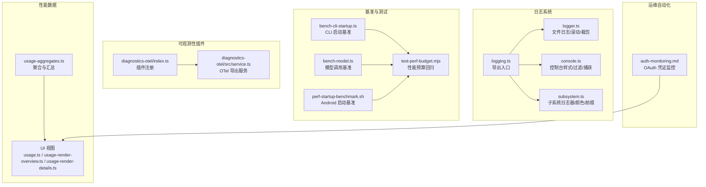
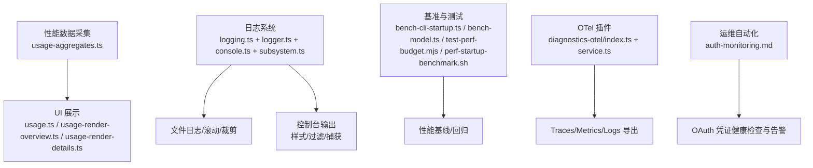
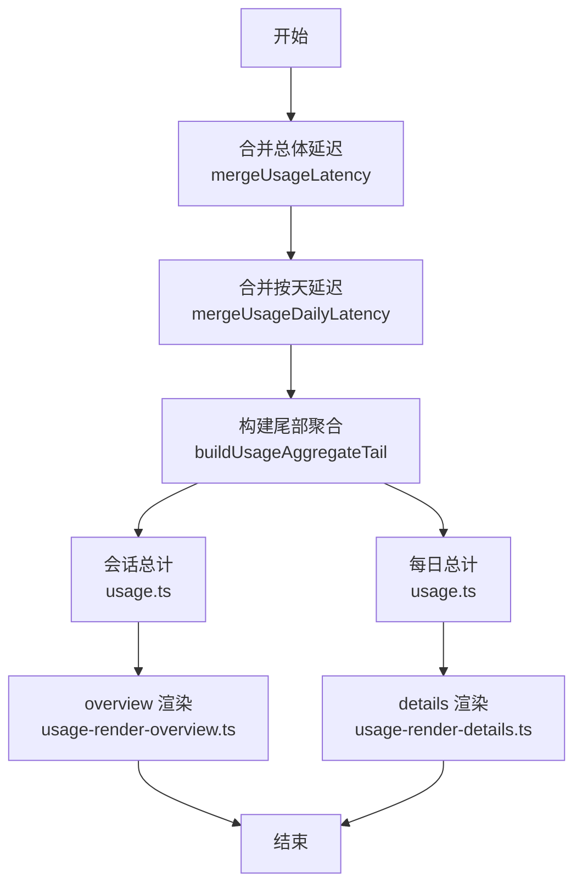
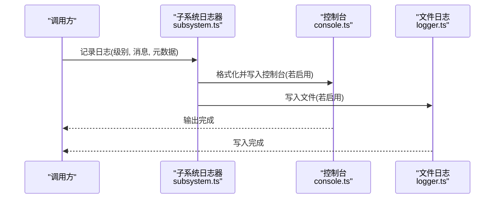
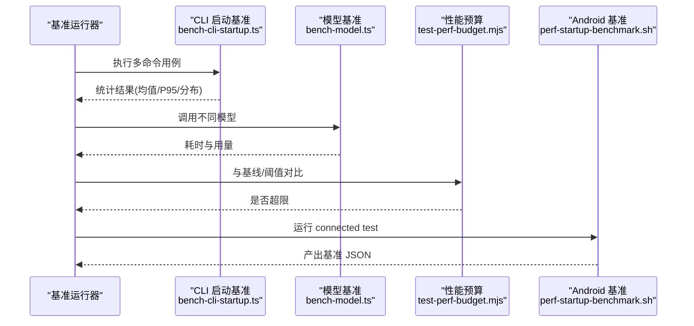
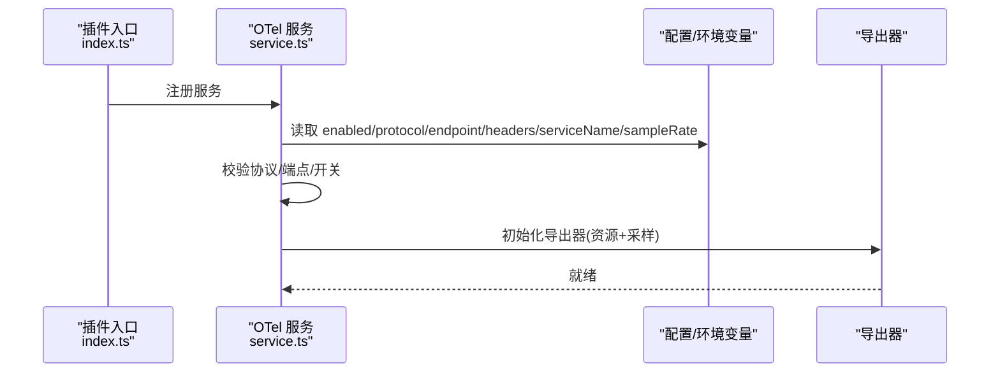
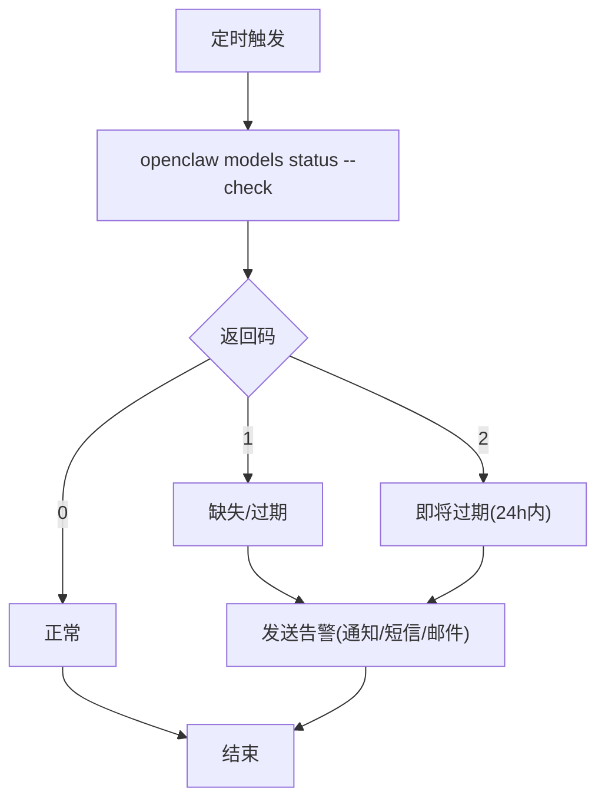
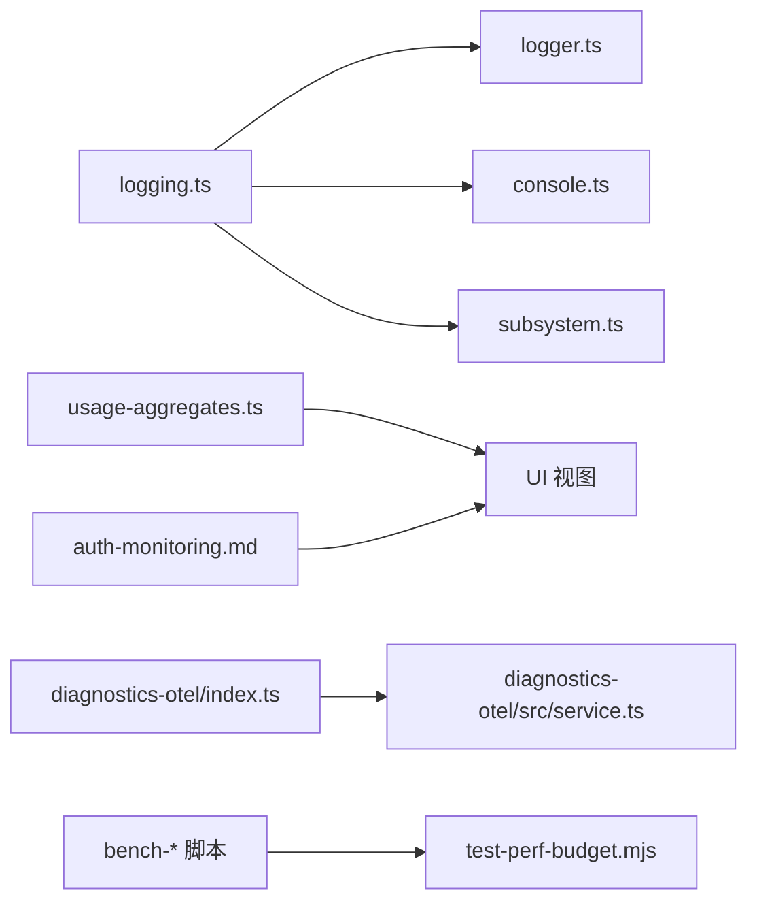

# 监控和性能分析

<cite>
**本文引用的文件**
- [src/shared/usage-aggregates.ts](file://src/shared/usage-aggregates.ts)
- [scripts/bench-cli-startup.ts](file://scripts/bench-cli-startup.ts)
- [scripts/bench-model.ts](file://scripts/bench-model.ts)
- [scripts/test-perf-budget.mjs](file://scripts/test-perf-budget.mjs)
- [apps/android/scripts/perf-startup-benchmark.sh](file://apps/android/scripts/perf-startup-benchmark.sh)
- [extensions/diagnostics-otel/index.ts](file://extensions/diagnostics-otel/index.ts)
- [extensions/diagnostics-otel/src/service.ts](file://extensions/diagnostics-otel/src/service.ts)
- [src/logging.ts](file://src/logging.ts)
- [src/logging/logger.ts](file://src/logging/logger.ts)
- [src/logging/console.ts](file://src/logging/console.ts)
- [src/logging/subsystem.ts](file://src/logging/subsystem.ts)
- [ui/src/ui/views/usage.ts](file://ui/src/ui/views/usage.ts)
- [ui/src/ui/views/usage-render-overview.ts](file://ui/src/ui/views/usage-render-overview.ts)
- [ui/src/ui/views/usage-render-details.ts](file://ui/src/ui/views/usage-render-details.ts)
- [docs/automation/auth-monitoring.md](file://docs/automation/auth-monitoring.md)
- [src/config/zod-schema.agent-runtime.ts](file://src/config/zod-schema.agent-runtime.ts)
</cite>

## 目录
1. [简介](#简介)
2. [项目结构](#项目结构)
3. [核心组件](#核心组件)
4. [架构总览](#架构总览)
5. [详细组件分析](#详细组件分析)
6. [依赖关系分析](#依赖关系分析)
7. [性能考量](#性能考量)
8. [故障排查指南](#故障排查指南)
9. [结论](#结论)
10. [附录](#附录)

## 简介
本文件面向 OpenClaw 的监控与性能分析，系统性梳理性能指标采集与监控体系（响应时间、吞吐量、资源利用率）、性能分析工具与方法（基准测试、压力测试）、日志分析与性能追踪、告警与异常检测、瓶颈识别与诊断流程，以及监控仪表板配置与报告生成实践。内容以仓库现有实现为依据，结合可扩展的最佳实践，帮助读者快速落地可观测性能力。

## 项目结构
OpenClaw 在多层位置提供了监控与性能分析能力：
- 性能数据聚合与展示：共享模块负责按天/通道/模型等维度聚合使用统计；UI 视图负责渲染成本与令牌用量、热点与洞察。
- 日志子系统：统一的日志接口、控制台输出样式与路由、子系统日志器、文件滚动与裁剪策略。
- 基准与测试脚本：CLI 启动性能基准、模型调用性能基准、性能预算回归检查、Android 启动基准脚本。
- 可观测性插件：OpenTelemetry 导出插件，支持 traces/metrics/logs 开关与采样率。
- 运维自动化：OAuth 凭证到期监控与告警自动化文档。

图表来源
- [src/shared/usage-aggregates.ts:1-109](file://src/shared/usage-aggregates.ts#L1-L109)
- [ui/src/ui/views/usage.ts:245-269](file://ui/src/ui/views/usage.ts#L245-L269)
- [ui/src/ui/views/usage-render-overview.ts:158-543](file://ui/src/ui/views/usage-render-overview.ts#L158-L543)
- [ui/src/ui/views/usage-render-details.ts:394-429](file://ui/src/ui/views/usage-render-details.ts#L394-L429)
- [src/logging.ts:1-70](file://src/logging.ts#L1-L70)
- [src/logging/logger.ts:1-348](file://src/logging/logger.ts#L1-L348)
- [src/logging/console.ts:1-327](file://src/logging/console.ts#L1-L327)
- [src/logging/subsystem.ts:1-426](file://src/logging/subsystem.ts#L1-L426)
- [scripts/bench-cli-startup.ts:113-200](file://scripts/bench-cli-startup.ts#L113-L200)
- [scripts/bench-model.ts:1-147](file://scripts/bench-model.ts#L1-L147)
- [scripts/test-perf-budget.mjs:98-127](file://scripts/test-perf-budget.mjs#L98-L127)
- [apps/android/scripts/perf-startup-benchmark.sh:55-86](file://apps/android/scripts/perf-startup-benchmark.sh#L55-L86)
- [extensions/diagnostics-otel/index.ts:1-16](file://extensions/diagnostics-otel/index.ts#L1-L16)
- [extensions/diagnostics-otel/src/service.ts:78-108](file://extensions/diagnostics-otel/src/service.ts#L78-L108)
- [docs/automation/auth-monitoring.md:1-45](file://docs/automation/auth-monitoring.md#L1-L45)

章节来源
- [src/shared/usage-aggregates.ts:1-109](file://src/shared/usage-aggregates.ts#L1-L109)
- [ui/src/ui/views/usage.ts:245-269](file://ui/src/ui/views/usage.ts#L245-L269)
- [ui/src/ui/views/usage-render-overview.ts:158-543](file://ui/src/ui/views/usage-render-overview.ts#L158-L543)
- [ui/src/ui/views/usage-render-details.ts:394-429](file://ui/src/ui/views/usage-render-details.ts#L394-L429)
- [src/logging.ts:1-70](file://src/logging.ts#L1-L70)
- [src/logging/logger.ts:1-348](file://src/logging/logger.ts#L1-L348)
- [src/logging/console.ts:1-327](file://src/logging/console.ts#L1-L327)
- [src/logging/subsystem.ts:1-426](file://src/logging/subsystem.ts#L1-L426)
- [scripts/bench-cli-startup.ts:113-200](file://scripts/bench-cli-startup.ts#L113-L200)
- [scripts/bench-model.ts:1-147](file://scripts/bench-model.ts#L1-L147)
- [scripts/test-perf-budget.mjs:98-127](file://scripts/test-perf-budget.mjs#L98-L127)
- [apps/android/scripts/perf-startup-benchmark.sh:55-86](file://apps/android/scripts/perf-startup-benchmark.sh#L55-L86)
- [extensions/diagnostics-otel/index.ts:1-16](file://extensions/diagnostics-otel/index.ts#L1-L16)
- [extensions/diagnostics-otel/src/service.ts:78-108](file://extensions/diagnostics-otel/src/service.ts#L78-L108)
- [docs/automation/auth-monitoring.md:1-45](file://docs/automation/auth-monitoring.md#L1-L45)

## 核心组件
- 性能数据聚合与展示
  - 聚合模块提供按通道、按天、按模型的成本与延迟聚合函数，支持合并与构建尾部聚合结果，便于 UI 展示与报表生成。
  - UI 视图负责计算会话与每日总计、筛选与范围选择、图表分组与洞察列表渲染。
- 日志系统
  - 统一日志入口导出控制台设置、文件日志、子系统日志器、Pino 兼容适配器等。
  - 文件日志支持滚动命名、大小上限、过期清理；控制台支持 pretty/compact/json 样式、子系统过滤、时间戳前缀、EPIPE 安全处理。
- 基准与测试
  - CLI 启动基准：多命令用例运行、统计均值/中位数/P95/最小/最大与退出码分布。
  - 模型调用基准：对比不同模型的耗时分布与令牌用量。
  - 性能预算回归：基于基线或绝对阈值的回归检查与失败判定。
  - Android 启动基准：通过 Gradle connected test 输出基准数据并归档。
- 可观测性插件
  - OpenTelemetry 插件：按配置启用 traces/metrics/logs，支持协议、端点、头部、服务名、采样率与资源属性。
- 运维自动化
  - OAuth 凭证到期监控：通过 CLI 状态检查返回码驱动告警；提供 systemd/cron 辅助脚本。

章节来源
- [src/shared/usage-aggregates.ts:32-109](file://src/shared/usage-aggregates.ts#L32-L109)
- [ui/src/ui/views/usage.ts:245-269](file://ui/src/ui/views/usage.ts#L245-L269)
- [ui/src/ui/views/usage-render-overview.ts:158-543](file://ui/src/ui/views/usage-render-overview.ts#L158-L543)
- [ui/src/ui/views/usage-render-details.ts:394-429](file://ui/src/ui/views/usage-render-details.ts#L394-L429)
- [src/logging.ts:1-70](file://src/logging.ts#L1-L70)
- [src/logging/logger.ts:15-106](file://src/logging/logger.ts#L15-L106)
- [src/logging/console.ts:60-111](file://src/logging/console.ts#L60-L111)
- [src/logging/subsystem.ts:308-402](file://src/logging/subsystem.ts#L308-L402)
- [scripts/bench-cli-startup.ts:113-200](file://scripts/bench-cli-startup.ts#L113-L200)
- [scripts/bench-model.ts:50-147](file://scripts/bench-model.ts#L50-L147)
- [scripts/test-perf-budget.mjs:98-127](file://scripts/test-perf-budget.mjs#L98-L127)
- [apps/android/scripts/perf-startup-benchmark.sh:55-86](file://apps/android/scripts/perf-startup-benchmark.sh#L55-L86)
- [extensions/diagnostics-otel/index.ts:1-16](file://extensions/diagnostics-otel/index.ts#L1-L16)
- [extensions/diagnostics-otel/src/service.ts:78-108](file://extensions/diagnostics-otel/src/service.ts#L78-L108)
- [docs/automation/auth-monitoring.md:14-45](file://docs/automation/auth-monitoring.md#L14-L45)

## 架构总览
下图展示了从“性能数据采集/聚合”到“日志与可观测性”的整体链路，以及“基准测试/回归检查”对性能基线的支撑。

图表来源
- [src/shared/usage-aggregates.ts:68-109](file://src/shared/usage-aggregates.ts#L68-L109)
- [ui/src/ui/views/usage.ts:245-269](file://ui/src/ui/views/usage.ts#L245-L269)
- [ui/src/ui/views/usage-render-overview.ts:158-543](file://ui/src/ui/views/usage-render-overview.ts#L158-L543)
- [ui/src/ui/views/usage-render-details.ts:394-429](file://ui/src/ui/views/usage-render-details.ts#L394-L429)
- [src/logging.ts:1-70](file://src/logging.ts#L1-L70)
- [src/logging/logger.ts:126-184](file://src/logging/logger.ts#L126-L184)
- [src/logging/console.ts:203-327](file://src/logging/console.ts#L203-L327)
- [src/logging/subsystem.ts:308-402](file://src/logging/subsystem.ts#L308-L402)
- [scripts/bench-cli-startup.ts:113-200](file://scripts/bench-cli-startup.ts#L113-L200)
- [scripts/bench-model.ts:50-147](file://scripts/bench-model.ts#L50-L147)
- [scripts/test-perf-budget.mjs:98-127](file://scripts/test-perf-budget.mjs#L98-L127)
- [apps/android/scripts/perf-startup-benchmark.sh:55-86](file://apps/android/scripts/perf-startup-benchmark.sh#L55-L86)
- [extensions/diagnostics-otel/index.ts:1-16](file://extensions/diagnostics-otel/index.ts#L1-L16)
- [extensions/diagnostics-otel/src/service.ts:78-108](file://extensions/diagnostics-otel/src/service.ts#L78-L108)
- [docs/automation/auth-monitoring.md:14-45](file://docs/automation/auth-monitoring.md#L14-L45)

## 详细组件分析

### 性能数据聚合与仪表板
- 聚合逻辑
  - 支持合并总体延迟与按天延迟，维护计数、求和、最小/最大、P95 最值，并在构建尾部聚合时计算平均值与排序。
- UI 渲染
  - 按会话与按天两种方式计算总计，支持范围选择与累计/分组模式，渲染每日成本/令牌用量条形图与洞察网格（Top 模型/提供商/工具/代理/渠道、峰值错误）。
- 报告生成
  - 建议将聚合结果导出为 JSON/CSV，供 BI 工具或自定义仪表板消费；结合 UI 的洞察列表形成摘要报告。

图表来源
- [src/shared/usage-aggregates.ts:32-109](file://src/shared/usage-aggregates.ts#L32-L109)
- [ui/src/ui/views/usage.ts:245-269](file://ui/src/ui/views/usage.ts#L245-L269)
- [ui/src/ui/views/usage-render-overview.ts:158-543](file://ui/src/ui/views/usage-render-overview.ts#L158-L543)
- [ui/src/ui/views/usage-render-details.ts:394-429](file://ui/src/ui/views/usage-render-details.ts#L394-L429)

章节来源
- [src/shared/usage-aggregates.ts:32-109](file://src/shared/usage-aggregates.ts#L32-L109)
- [ui/src/ui/views/usage.ts:245-269](file://ui/src/ui/views/usage.ts#L245-L269)
- [ui/src/ui/views/usage-render-overview.ts:158-543](file://ui/src/ui/views/usage-render-overview.ts#L158-L543)
- [ui/src/ui/views/usage-render-details.ts:394-429](file://ui/src/ui/views/usage-render-details.ts#L394-L429)

### 日志系统与性能追踪
- 文件日志
  - 默认滚动文件路径按日期命名，支持最大文件大小限制与过期清理（默认 24 小时）；在达到上限时发出警告并抑制写入，避免阻塞。
- 控制台输出
  - 支持 pretty/compact/json 三种样式；可按子系统过滤输出；自动处理 EPIPE 异常；可强制将日志路由至 stderr 以保持 stdout 清洁。
- 子系统日志器
  - 提供带颜色与精简前缀的控制台输出；支持元数据透传与“原始消息”覆盖；可按级别判断是否启用控制台/文件输出。
- 性能追踪建议
  - 在关键路径（如模型调用、工具执行、会话生命周期）打点，结合 UI 时间序列与日志上下文定位热点；利用子系统前缀区分来源。

图表来源
- [src/logging/subsystem.ts:308-402](file://src/logging/subsystem.ts#L308-L402)
- [src/logging/console.ts:203-327](file://src/logging/console.ts#L203-L327)
- [src/logging/logger.ts:126-184](file://src/logging/logger.ts#L126-L184)

章节来源
- [src/logging/logger.ts:15-106](file://src/logging/logger.ts#L15-L106)
- [src/logging/console.ts:60-111](file://src/logging/console.ts#L60-L111)
- [src/logging/subsystem.ts:308-402](file://src/logging/subsystem.ts#L308-L402)

### 基准测试与压力测试
- CLI 启动基准
  - 多命令用例重复运行，统计均值、中位数、P95、最小/最大，汇总退出码分布，支持主/次入口对比与百分比变化。
- 模型调用基准
  - 对比不同模型的耗时分布与令牌用量，支持自定义提示词与运行次数。
- 性能预算回归
  - 基于绝对阈值或基线加允许回归比例进行失败判定，输出统计摘要。
- Android 启动基准
  - 通过 Gradle connected test 采集基准数据 JSON 并归档，便于持续集成比较。

图表来源
- [scripts/bench-cli-startup.ts:113-200](file://scripts/bench-cli-startup.ts#L113-L200)
- [scripts/bench-model.ts:50-147](file://scripts/bench-model.ts#L50-L147)
- [scripts/test-perf-budget.mjs:98-127](file://scripts/test-perf-budget.mjs#L98-L127)
- [apps/android/scripts/perf-startup-benchmark.sh:55-86](file://apps/android/scripts/perf-startup-benchmark.sh#L55-L86)

章节来源
- [scripts/bench-cli-startup.ts:113-200](file://scripts/bench-cli-startup.ts#L113-L200)
- [scripts/bench-model.ts:50-147](file://scripts/bench-model.ts#L50-L147)
- [scripts/test-perf-budget.mjs:98-127](file://scripts/test-perf-budget.mjs#L98-L127)
- [apps/android/scripts/perf-startup-benchmark.sh:55-86](file://apps/android/scripts/perf-startup-benchmark.sh#L55-L86)

### OpenTelemetry 可观测性插件
- 插件注册
  - 插件 ID 为 diagnostics-otel，注册服务实例。
- 服务启动
  - 读取配置与环境变量，校验协议与端点，解析服务名与采样率，按开关决定导出 traces/metrics/logs；构造资源属性并初始化导出器。

图表来源
- [extensions/diagnostics-otel/index.ts:1-16](file://extensions/diagnostics-otel/index.ts#L1-L16)
- [extensions/diagnostics-otel/src/service.ts:78-108](file://extensions/diagnostics-otel/src/service.ts#L78-L108)

章节来源
- [extensions/diagnostics-otel/index.ts:1-16](file://extensions/diagnostics-otel/index.ts#L1-L16)
- [extensions/diagnostics-otel/src/service.ts:78-108](file://extensions/diagnostics-otel/src/service.ts#L78-L108)

### 告警机制与异常检测
- OAuth 凭证到期监控
  - 使用 CLI 模型状态检查，返回码驱动告警：0 正常、1 缺失/过期、2 即将过期（24h 内）；配合 systemd/cron 定时任务与通知脚本实现自动化告警。
- 工具循环检测
  - 配置中包含工具循环检测阈值与全局熔断阈值，用于识别潜在的工具调用环路风险事件，辅助异常检测与自动保护。

图表来源
- [docs/automation/auth-monitoring.md:14-45](file://docs/automation/auth-monitoring.md#L14-L45)
- [src/config/zod-schema.agent-runtime.ts:446-481](file://src/config/zod-schema.agent-runtime.ts#L446-L481)

章节来源
- [docs/automation/auth-monitoring.md:14-45](file://docs/automation/auth-monitoring.md#L14-L45)
- [src/config/zod-schema.agent-runtime.ts:446-481](file://src/config/zod-schema.agent-runtime.ts#L446-L481)

## 依赖关系分析
- 组件耦合
  - 日志子系统通过统一入口导出，降低上层对具体实现的依赖；文件日志与控制台输出解耦，便于按需启用。
  - 性能聚合模块与 UI 视图松耦合，通过数据结构传递；支持多种聚合维度与排序。
  - OTel 插件仅在启用时初始化，避免无谓开销。
- 外部依赖
  - 基准脚本依赖 Node/Gradle 环境；UI 依赖前端渲染框架；日志系统依赖文件系统与进程流。

图表来源
- [src/logging.ts:1-70](file://src/logging.ts#L1-L70)
- [src/logging/logger.ts:1-348](file://src/logging/logger.ts#L1-L348)
- [src/logging/console.ts:1-327](file://src/logging/console.ts#L1-L327)
- [src/logging/subsystem.ts:1-426](file://src/logging/subsystem.ts#L1-L426)
- [src/shared/usage-aggregates.ts:1-109](file://src/shared/usage-aggregates.ts#L1-L109)
- [ui/src/ui/views/usage.ts:245-269](file://ui/src/ui/views/usage.ts#L245-L269)
- [extensions/diagnostics-otel/index.ts:1-16](file://extensions/diagnostics-otel/index.ts#L1-L16)
- [extensions/diagnostics-otel/src/service.ts:78-108](file://extensions/diagnostics-otel/src/service.ts#L78-L108)
- [scripts/bench-cli-startup.ts:113-200](file://scripts/bench-cli-startup.ts#L113-L200)
- [scripts/bench-model.ts:1-147](file://scripts/bench-model.ts#L1-L147)
- [scripts/test-perf-budget.mjs:98-127](file://scripts/test-perf-budget.mjs#L98-L127)
- [docs/automation/auth-monitoring.md:1-45](file://docs/automation/auth-monitoring.md#L1-L45)

章节来源
- [src/logging.ts:1-70](file://src/logging.ts#L1-L70)
- [src/logging/logger.ts:1-348](file://src/logging/logger.ts#L1-L348)
- [src/logging/console.ts:1-327](file://src/logging/console.ts#L1-L327)
- [src/logging/subsystem.ts:1-426](file://src/logging/subsystem.ts#L1-L426)
- [src/shared/usage-aggregates.ts:1-109](file://src/shared/usage-aggregates.ts#L1-L109)
- [ui/src/ui/views/usage.ts:245-269](file://ui/src/ui/views/usage.ts#L245-L269)
- [extensions/diagnostics-otel/index.ts:1-16](file://extensions/diagnostics-otel/index.ts#L1-L16)
- [extensions/diagnostics-otel/src/service.ts:78-108](file://extensions/diagnostics-otel/src/service.ts#L78-L108)
- [scripts/bench-cli-startup.ts:113-200](file://scripts/bench-cli-startup.ts#L113-L200)
- [scripts/bench-model.ts:1-147](file://scripts/bench-model.ts#L1-L147)
- [scripts/test-perf-budget.mjs:98-127](file://scripts/test-perf-budget.mjs#L98-L127)
- [docs/automation/auth-monitoring.md:1-45](file://docs/automation/auth-monitoring.md#L1-L45)

## 性能考量
- 日志写入
  - 文件日志在达到大小上限时抑制写入并输出警告，避免阻塞；建议合理设置 maxFileBytes 与保留天数。
- 控制台输出
  - 在非 TTY 或测试环境下默认静默控制台，减少噪声；必要时开启时间戳与 JSON 样式便于机器解析。
- 基准与回归
  - 基准脚本支持多次运行取统计值；回归检查建议设定基线与允许回归比例，避免偶发抖动误报。
- UI 渲染
  - 按天/按类型分组渲染，支持范围选择与累计模式，建议在大数据集场景下启用虚拟滚动与懒加载。

## 故障排查指南
- 日志问题
  - 若出现 EPIPE 错误导致崩溃，系统已内置异步错误监听与安全处理；检查管道下游是否提前关闭。
  - 控制台被 stdout/stderr 混杂影响时，可启用路由至 stderr 的功能以保持 stdout 清洁。
- 基准失败
  - 检查运行参数（运行次数、超时、提示词），确认环境变量（API Key、基础地址）正确；对比基线与允许回归比例。
- Android 基准
  - 确认 connected test 成功生成基准 JSON，检查输出目录权限与文件存在性。
- OAuth 告警
  - 使用 CLI 状态检查验证返回码；核对 systemd/cron 定时任务与通知脚本配置。

章节来源
- [src/logging/console.ts:164-167](file://src/logging/console.ts#L164-L167)
- [src/logging/console.ts:215-225](file://src/logging/console.ts#L215-L225)
- [src/logging/logger.ts:156-178](file://src/logging/logger.ts#L156-L178)
- [scripts/bench-cli-startup.ts:113-200](file://scripts/bench-cli-startup.ts#L113-L200)
- [scripts/bench-model.ts:80-92](file://scripts/bench-model.ts#L80-L92)
- [scripts/test-perf-budget.mjs:98-127](file://scripts/test-perf-budget.mjs#L98-L127)
- [apps/android/scripts/perf-startup-benchmark.sh:78-86](file://apps/android/scripts/perf-startup-benchmark.sh#L78-L86)
- [docs/automation/auth-monitoring.md:14-45](file://docs/automation/auth-monitoring.md#L14-L45)

## 结论
OpenClaw 的监控与性能分析体系以“数据聚合 + 日志系统 + 基准测试 + 可观测性插件 + 运维自动化”为核心，既满足日常运维与性能观察需求，又具备扩展与自动化告警能力。建议在生产环境中结合 UI 仪表板与 OTel 导出，完善异常检测与回归基线管理，持续优化关键路径与资源利用率。

## 附录
- 监控仪表板配置建议
  - 数据源：UI 导出的聚合 JSON/CSV；OTel 导出的 Traces/Metrics/Logs。
  - 图表：每日成本/令牌用量、Top 模型/工具/代理、延迟分布（P95）、峰值错误趋势。
  - 报告：按日/周/月生成摘要报告，包含热点识别与改进建议。
- 性能优化清单
  - 关键路径打点与日志分级；合理设置日志级别与控制台样式；使用基准脚本持续跟踪回归；启用 OTel 导出统一采集。