# 会话缓存

<cite>
**本文引用的文件**
- [docs/concepts/session.md](file://docs/concepts/session.md)
- [docs/concepts/compaction.md](file://docs/concepts/compaction.md)
- [docs/reference/session-management-compaction.md](file://docs/reference/session-management-compaction.md)
- [docs/concepts/session-pruning.md](file://docs/concepts/session-pruning.md)
- [src/config/sessions.ts](file://src/config/sessions.ts)
- [src/sessions/session-id.ts](file://src/sessions/session-id.ts)
- [src/sessions/transcript-events.ts](file://src/sessions/transcript-events.ts)
- [src/memory/session-files.ts](file://src/memory/session-files.ts)
- [src/auto-reply/reply/session-updates.ts](file://src/auto-reply/reply/session-updates.ts)
- [src/auto-reply/reply/memory-flush.ts](file://src/auto-reply/reply/memory-flush.ts)
</cite>

## 目录
1. [简介](#简介)
2. [项目结构](#项目结构)
3. [核心组件](#核心组件)
4. [架构总览](#架构总览)
5. [详细组件分析](#详细组件分析)
6. [依赖关系分析](#依赖关系分析)
7. [性能考量](#性能考量)
8. [故障排查指南](#故障排查指南)
9. [结论](#结论)
10. [附录](#附录)

## 简介
本文件系统性阐述 OpenClaw 的会话缓存机制，覆盖以下主题：
- 会话状态的内存缓存与持久化缓存双层结构
- 会话压缩（compaction）算法的触发条件、执行流程与持久化位置
- 缓存命中率优化策略与缓存失效规则
- 一致性保证与并发访问控制
- 性能监控指标与调优方法
- 配置参数与最佳实践

## 项目结构
OpenClaw 将会话管理拆分为“路由键生成”“会话存储（sessions.json）”“转录文件（JSONL）”“维护与磁盘预算”等模块，并通过配置层统一入口。

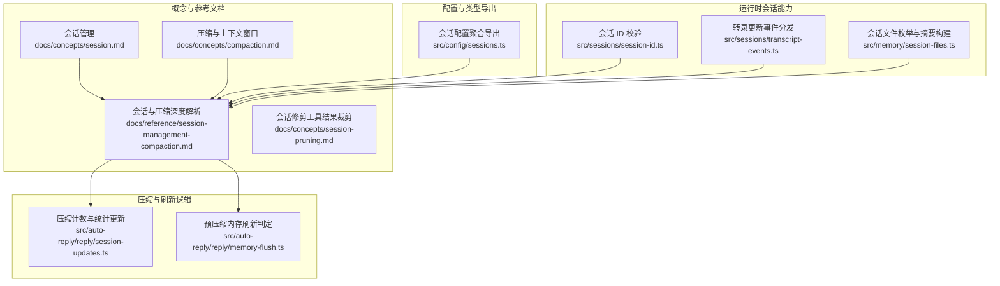

图示来源
- [docs/concepts/session.md:1-311](file://docs/concepts/session.md#L1-L311)
- [docs/concepts/compaction.md:1-105](file://docs/concepts/compaction.md#L1-L105)
- [docs/reference/session-management-compaction.md:1-325](file://docs/reference/session-management-compaction.md#L1-L325)
- [docs/concepts/session-pruning.md:1-122](file://docs/concepts/session-pruning.md#L1-L122)
- [src/config/sessions.ts:1-14](file://src/config/sessions.ts#L1-L14)
- [src/sessions/session-id.ts:1-6](file://src/sessions/session-id.ts#L1-L6)
- [src/sessions/transcript-events.ts:1-30](file://src/sessions/transcript-events.ts#L1-L30)
- [src/memory/session-files.ts:1-132](file://src/memory/session-files.ts#L1-L132)
- [src/auto-reply/reply/session-updates.ts:241-294](file://src/auto-reply/reply/session-updates.ts#L241-L294)
- [src/auto-reply/reply/memory-flush.ts:195-228](file://src/auto-reply/reply/memory-flush.ts#L195-L228)

章节来源
- [docs/concepts/session.md:1-311](file://docs/concepts/session.md#L1-L311)
- [docs/reference/session-management-compaction.md:1-325](file://docs/reference/session-management-compaction.md#L1-L325)
- [src/config/sessions.ts:1-14](file://src/config/sessions.ts#L1-L14)

## 核心组件
- 会话键与路由：根据消息来源与配置生成 sessionKey，决定会话归属桶。
- 会话存储（内存缓存）：以 sessions.json 为小而快的内存映射，记录当前 sessionId、最近活动时间、令牌计数、重置策略、发送策略等。
- 转录持久化（持久化缓存）：以 JSONL 文件树形式保存对话、工具调用、压缩摘要等，支持按需重建模型上下文。
- 维护与磁盘预算：在写入路径上进行过期清理、条目上限、轮转与磁盘配额回收。
- 压缩（Compaction）：在接近或超过模型上下文窗口时，将旧历史摘要化并持久到 JSONL，保留近期消息。
- 修剪（Pruning）：在请求前对工具结果进行内存内裁剪，不改写 JSONL。
- 预压缩内存刷新：在达到软阈值时，静默触发一次“写入持久化记忆”的系统转录，避免压缩丢失关键上下文。

章节来源
- [docs/concepts/session.md:74-120](file://docs/concepts/session.md#L74-L120)
- [docs/reference/session-management-compaction.md:40-94](file://docs/reference/session-management-compaction.md#L40-L94)
- [docs/concepts/compaction.md:11-26](file://docs/concepts/compaction.md#L11-L26)
- [docs/concepts/session-pruning.md:9-26](file://docs/concepts/session-pruning.md#L9-L26)
- [docs/reference/session-management-compaction.md:283-314](file://docs/reference/session-management-compaction.md#L283-L314)

## 架构总览
下图展示会话从“路由键生成”到“内存缓存+持久化缓存”的整体流转，以及压缩与维护的关键节点。

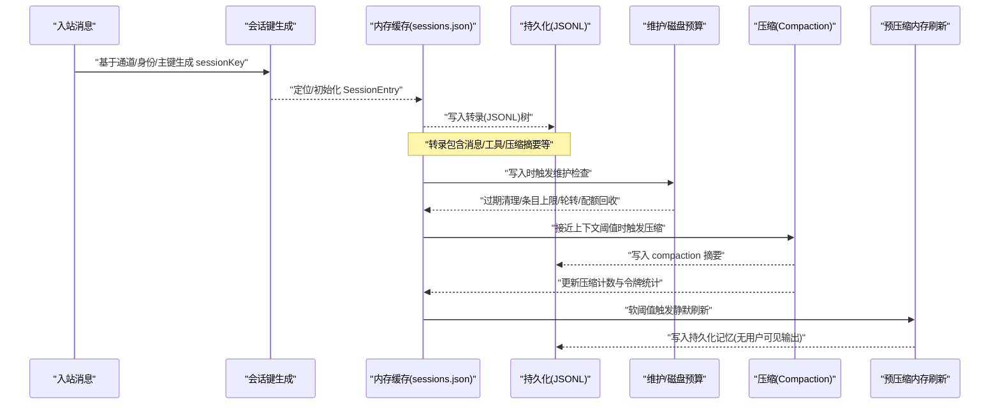

图示来源
- [docs/concepts/session.md:189-217](file://docs/concepts/session.md#L189-L217)
- [docs/reference/session-management-compaction.md:213-256](file://docs/reference/session-management-compaction.md#L213-L256)
- [docs/reference/session-management-compaction.md:283-314](file://docs/reference/session-management-compaction.md#L283-L314)
- [docs/reference/session-management-compaction.md:68-87](file://docs/reference/session-management-compaction.md#L68-L87)

## 详细组件分析

### 会话键与路由
- 键模式：主键直聊、按通道/身份隔离、群组/频道/房间、定时任务/Webhook 等。
- 身份链接：可将多平台同一联系人映射到统一会话键，实现跨渠道连续性。
- 重置策略：每日重置与空闲重置可组合，先到期者生效；支持按类型/按通道覆盖。

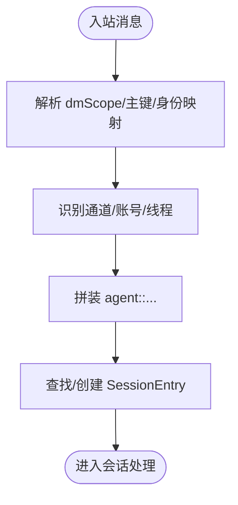

图示来源
- [docs/concepts/session.md:10-56](file://docs/concepts/session.md#L10-L56)
- [docs/concepts/session.md:189-206](file://docs/concepts/session.md#L189-L206)

章节来源
- [docs/concepts/session.md:10-56](file://docs/concepts/session.md#L10-L56)
- [docs/concepts/session.md:189-206](file://docs/concepts/session.md#L189-L206)

### 内存缓存（sessions.json）
- 结构要点：sessionKey -> SessionEntry，包含当前 sessionId、更新时间、聊天类型、令牌计数、发送策略、模型覆盖、压缩次数、预刷新标记等。
- 更新路径：写入转录后同步更新内存映射；支持增量更新与持久化落盘。
- 并发与一致性：内存映射在单网关进程中使用，写入通过受控更新函数完成，避免竞态；磁盘预算回收在写入路径执行，减少跨进程竞争。

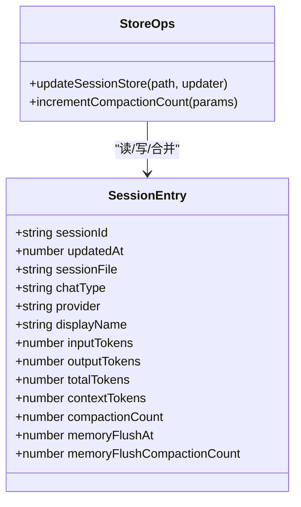

图示来源
- [docs/reference/session-management-compaction.md:137-160](file://docs/reference/session-management-compaction.md#L137-L160)
- [src/auto-reply/reply/session-updates.ts:241-294](file://src/auto-reply/reply/session-updates.ts#L241-L294)

章节来源
- [docs/reference/session-management-compaction.md:137-160](file://docs/reference/session-management-compaction.md#L137-L160)
- [src/auto-reply/reply/session-updates.ts:241-294](file://src/auto-reply/reply/session-updates.ts#L241-L294)

### 持久化缓存（JSONL 转录）
- 结构：首行为会话头，后续为带 id/parentId 的树形条目；支持 message、custom_message、custom、compaction、branch_summary 等类型。
- 用途：用于重建模型上下文；压缩摘要持久化，确保重启/迁移后仍可复用。
- 事件通知：转录变更通过事件分发器广播，便于 UI 或其他组件订阅。

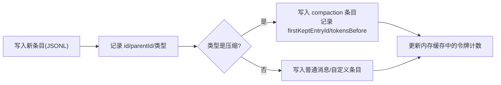

图示来源
- [docs/reference/session-management-compaction.md:163-181](file://docs/reference/session-management-compaction.md#L163-L181)
- [src/sessions/transcript-events.ts:1-30](file://src/sessions/transcript-events.ts#L1-L30)

章节来源
- [docs/reference/session-management-compaction.md:163-181](file://docs/reference/session-management-compaction.md#L163-L181)
- [src/sessions/transcript-events.ts:1-30](file://src/sessions/transcript-events.ts#L1-L30)

### 维护与磁盘预算
- 维护模式：warn/enforce；enforce 顺序为移除孤儿/归档文件、删除最旧条目及对应转录、直至低于高水位。
- 关键参数：pruneAfter、maxEntries、rotateBytes、resetArchiveRetention、maxDiskBytes、highWaterBytes。
- 触发时机：写入路径自动维护；也可通过命令行强制或预演。

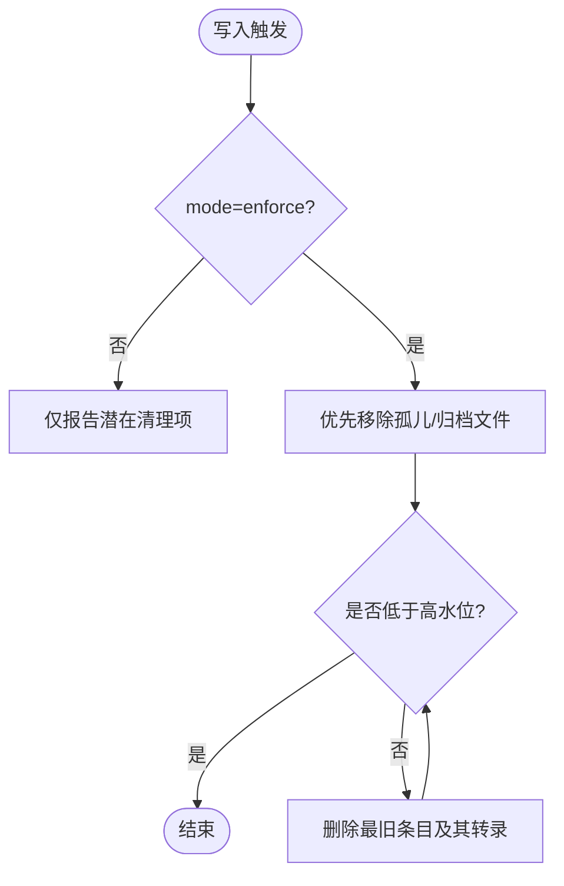

图示来源
- [docs/concepts/session.md:74-120](file://docs/concepts/session.md#L74-L120)
- [docs/reference/session-management-compaction.md:68-87](file://docs/reference/session-management-compaction.md#L68-L87)

章节来源
- [docs/concepts/session.md:74-120](file://docs/concepts/session.md#L74-L120)
- [docs/reference/session-management-compaction.md:68-87](file://docs/reference/session-management-compaction.md#L68-L87)

### 压缩（Compaction）算法与触发
- 目标：将旧历史摘要化，保留近期消息，使上下文保持在模型窗口内。
- 触发条件：
  - Pi 运行时溢出恢复：模型返回上下文溢出错误 → 压缩 → 重试。
  - 阈值维护：成功回合后，若 contextTokens 超过 contextWindow - reserveTokens，则触发压缩。
- 摘要持久化：在 JSONL 中插入 compaction 条目，记录 firstKeptEntryId 与 tokensBefore。
- 计数与统计：压缩完成后递增 compactionCount，并在提供 tokensAfter 时更新总令牌统计。

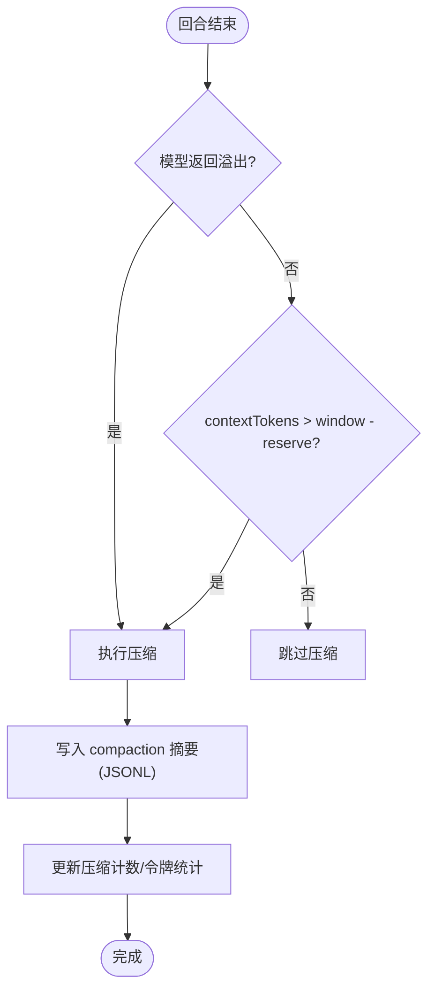

图示来源
- [docs/concepts/compaction.md:57-68](file://docs/concepts/compaction.md#L57-L68)
- [docs/reference/session-management-compaction.md:213-228](file://docs/reference/session-management-compaction.md#L213-L228)
- [src/auto-reply/reply/session-updates.ts:241-294](file://src/auto-reply/reply/session-updates.ts#L241-L294)

章节来源
- [docs/concepts/compaction.md:57-68](file://docs/concepts/compaction.md#L57-L68)
- [docs/reference/session-management-compaction.md:213-228](file://docs/reference/session-management-compaction.md#L213-L228)
- [src/auto-reply/reply/session-updates.ts:241-294](file://src/auto-reply/reply/session-updates.ts#L241-L294)

### 预压缩内存刷新（Pre-compaction Memory Flush）
- 目的：在压缩发生前，静默触发一次“写入持久化记忆”的系统转录，避免压缩丢失关键上下文。
- 触发条件：当 context 使用量达到软阈值且未在当前压缩周期内执行过刷新时触发。
- 行为：使用 NO_REPLY 提示抑制用户可见输出；仅在嵌入式 Pi 会话中执行；工作区只读时跳过。

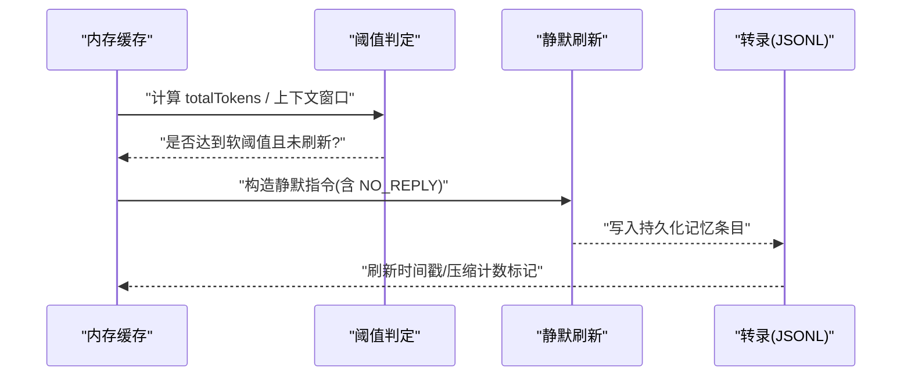

图示来源
- [docs/reference/session-management-compaction.md:283-314](file://docs/reference/session-management-compaction.md#L283-L314)
- [src/auto-reply/reply/memory-flush.ts:195-228](file://src/auto-reply/reply/memory-flush.ts#L195-L228)

章节来源
- [docs/reference/session-management-compaction.md:283-314](file://docs/reference/session-management-compaction.md#L283-L314)
- [src/auto-reply/reply/memory-flush.ts:195-228](file://src/auto-reply/reply/memory-flush.ts#L195-L228)

### 会话修剪（Pruning，内存内）
- 作用：在请求前对工具结果进行内存内裁剪，不改写 JSONL。
- 适用范围：Anthropic API（含 OpenRouter 的 Anthropic 模型），配合 cache-ttl 模式。
- 策略：软裁剪（保留头尾并标注）、硬清空（替换为占位符）；保护最近若干助手消息；跳过含图像块的结果。

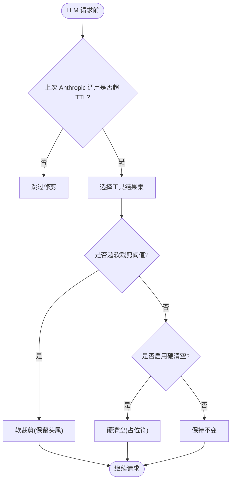

图示来源
- [docs/concepts/session-pruning.md:13-26](file://docs/concepts/session-pruning.md#L13-L26)
- [docs/concepts/session-pruning.md:59-87](file://docs/concepts/session-pruning.md#L59-L87)

章节来源
- [docs/concepts/session-pruning.md:13-26](file://docs/concepts/session-pruning.md#L13-L26)
- [docs/concepts/session-pruning.md:59-87](file://docs/concepts/session-pruning.md#L59-L87)

### 会话文件枚举与摘要
- 列表：遍历指定代理的会话目录，过滤 .jsonl 文件。
- 摘要：提取用户/助理消息文本，标准化并去敏，生成内容摘要与行映射，用于检索/索引/审计。

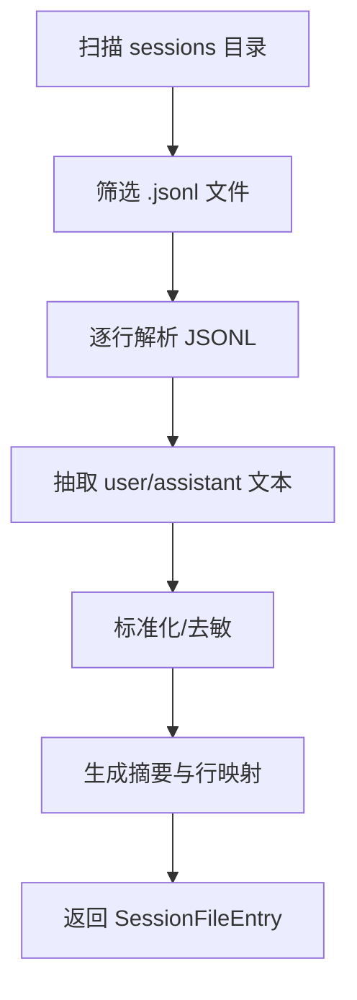

图示来源
- [src/memory/session-files.ts:21-33](file://src/memory/session-files.ts#L21-L33)
- [src/memory/session-files.ts:74-132](file://src/memory/session-files.ts#L74-L132)

章节来源
- [src/memory/session-files.ts:21-33](file://src/memory/session-files.ts#L21-L33)
- [src/memory/session-files.ts:74-132](file://src/memory/session-files.ts#L74-L132)

## 依赖关系分析
- 配置聚合导出：会话相关模块通过 src/config/sessions.ts 统一导出，便于上层按需引入。
- 事件驱动：转录更新通过事件分发器广播，降低耦合度。
- 运行时依赖：压缩计数与刷新逻辑依赖内存缓存中的字段；维护逻辑贯穿写入路径。

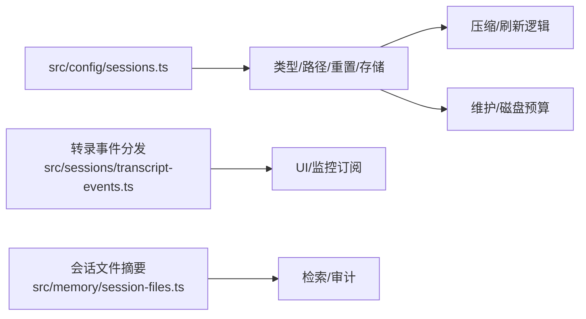

图示来源
- [src/config/sessions.ts:1-14](file://src/config/sessions.ts#L1-L14)
- [src/sessions/transcript-events.ts:1-30](file://src/sessions/transcript-events.ts#L1-L30)
- [src/memory/session-files.ts:1-132](file://src/memory/session-files.ts#L1-L132)

章节来源
- [src/config/sessions.ts:1-14](file://src/config/sessions.ts#L1-L14)
- [src/sessions/transcript-events.ts:1-30](file://src/sessions/transcript-events.ts#L1-L30)
- [src/memory/session-files.ts:1-132](file://src/memory/session-files.ts#L1-L132)

## 性能考量
- 写入路径开销：大型 sessions.json 会增加写入延迟；建议启用 enforce 模式并设置合理 pruneAfter/maxEntries。
- 磁盘预算：启用 maxDiskBytes 与 highWaterBytes，避免无限增长；定期清理孤儿/归档文件优先。
- 压缩频率：过高的压缩次数可能影响吞吐；适当提高 reserveTokens 或降低 keepRecentTokens 可缓解频繁压缩。
- 修剪策略：针对长会话启用 cache-ttl 模式，结合心跳与模型 cacheRetention 对齐，降低首次请求的 cacheWrite。
- 预刷新：在软阈值提前触发静默刷新，减少压缩后上下文丢失风险，但需评估额外写入成本。

## 故障排查指南
- 会话键异常：使用 /status 查看 sessionKey 是否符合预期；核对 dmScope/identityLinks/重置策略。
- 存储与转录不一致：确认网关主机与 sessions.json 路径；必要时通过命令行列出会话核对。
- 压缩过于频繁：检查模型上下文窗口、reserveTokens 设置；关注工具结果膨胀，启用/调整修剪。
- 静默刷新泄漏：确认回复以 NO_REPLY 开头，且使用包含流抑制修复的版本。
- 维护效果不佳：切换 enforce 模式并调整 pruneAfter/maxEntries/rotateBytes；开启磁盘预算并设置高水位。

章节来源
- [docs/reference/session-management-compaction.md:316-325](file://docs/reference/session-management-compaction.md#L316-L325)
- [docs/concepts/session-pruning.md:27-33](file://docs/concepts/session-pruning.md#L27-L33)

## 结论
OpenClaw 的会话缓存采用“内存映射 + JSONL 持久化”的双层设计，辅以维护、压缩与修剪三大机制，既保证运行时的低延迟访问，又确保历史上下文的可恢复性与可审计性。通过合理的配置与监控，可在成本、性能与一致性之间取得平衡。

## 附录
- 会话键生成与重置策略参考：[会话管理:189-217](file://docs/concepts/session.md#L189-L217)
- 压缩阈值与设置参考：[压缩与上下文窗口:22-56](file://docs/concepts/compaction.md#L22-L56)
- 深入理解会话与压缩内部机制：[会话与压缩深度解析:1-325](file://docs/reference/session-management-compaction.md#L1-L325)
- 修剪策略与默认值：[会话修剪:52-122](file://docs/concepts/session-pruning.md#L52-L122)
- 会话 ID 正则校验：[session-id:1-6](file://src/sessions/session-id.ts#L1-L6)
- 转录事件分发：[transcript-events:1-30](file://src/sessions/transcript-events.ts#L1-L30)
- 会话文件枚举与摘要：[session-files:1-132](file://src/memory/session-files.ts#L1-L132)
- 压缩计数与统计更新：[session-updates:241-294](file://src/auto-reply/reply/session-updates.ts#L241-L294)
- 预压缩内存刷新判定：[memory-flush:195-228](file://src/auto-reply/reply/memory-flush.ts#L195-L228)