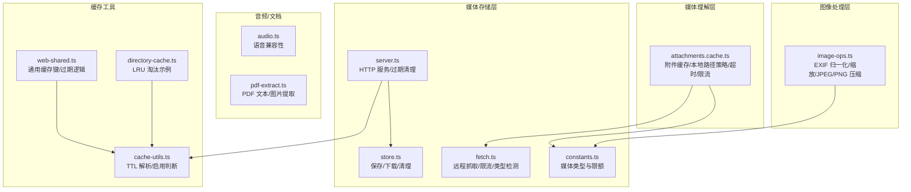
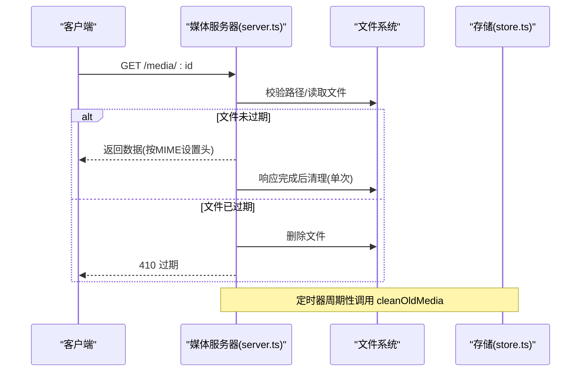
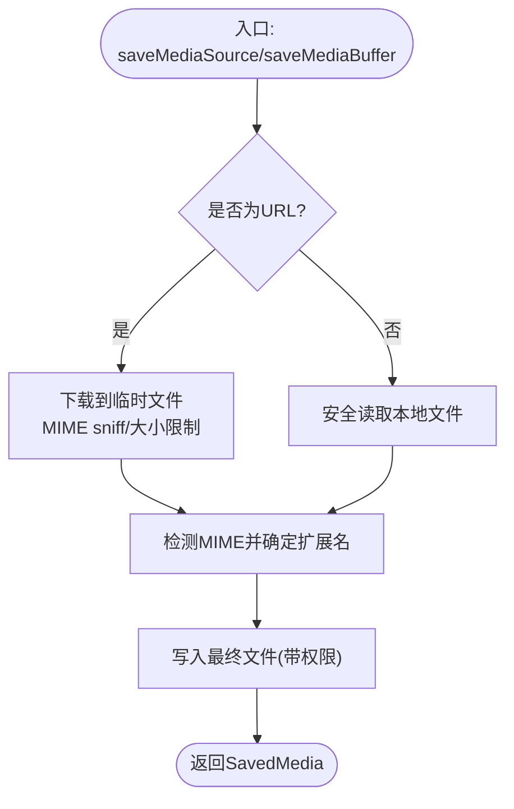
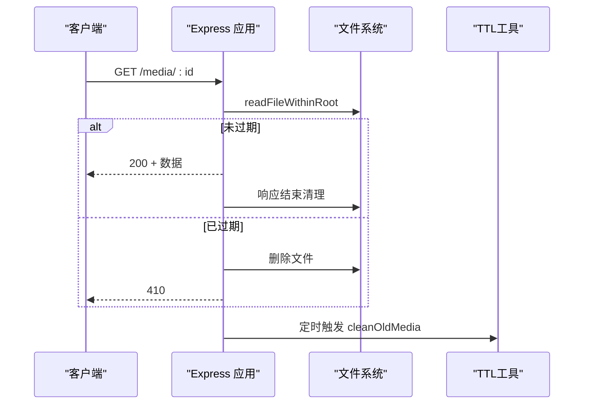
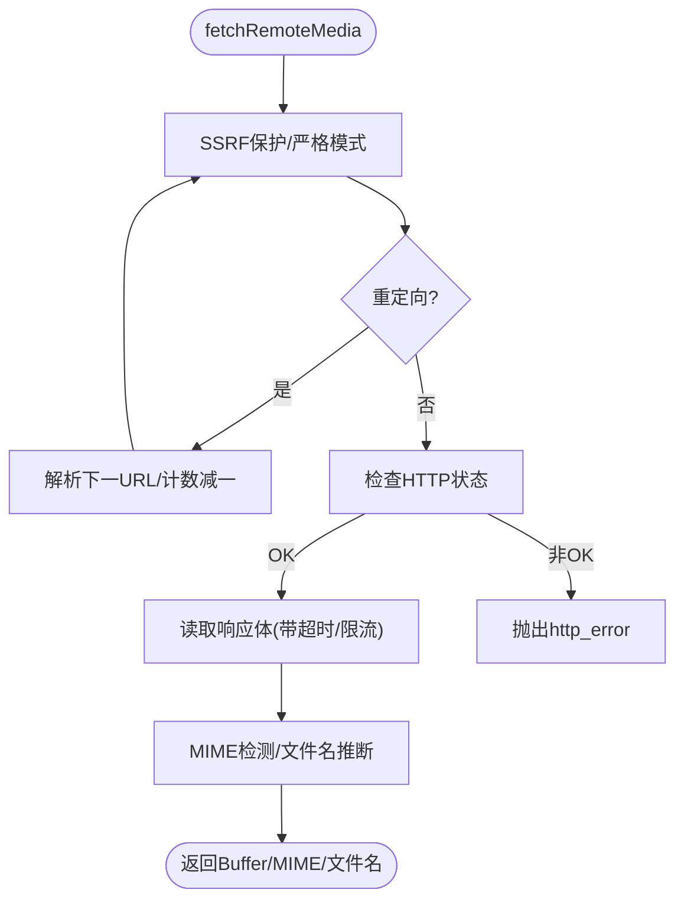
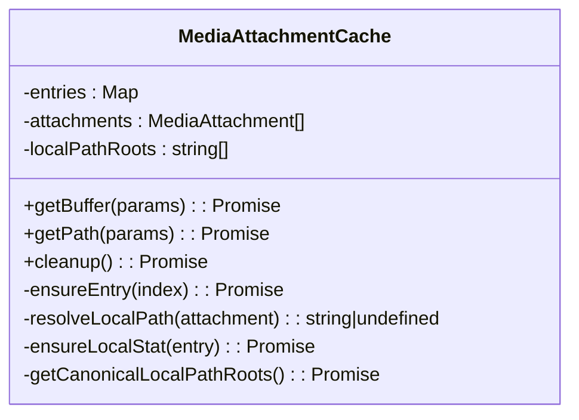
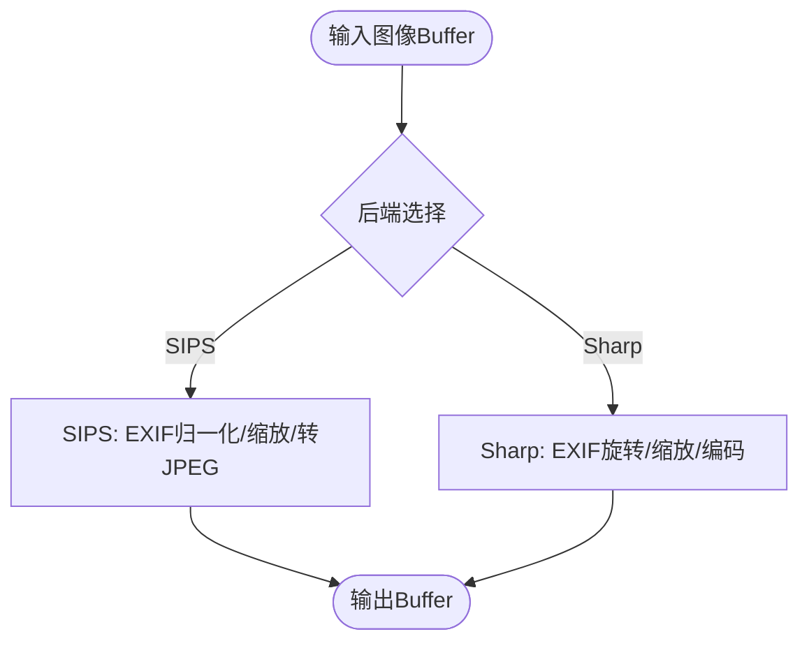
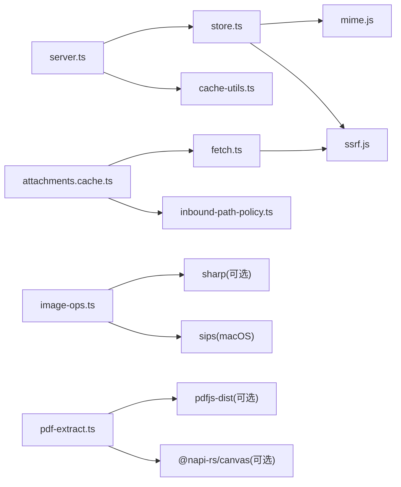

# 媒体缓存

<cite>
**本文引用的文件**
- [src/media/store.ts](file://src/media/store.ts)
- [src/media/server.ts](file://src/media/server.ts)
- [src/media/fetch.ts](file://src/media/fetch.ts)
- [src/media/constants.ts](file://src/media/constants.ts)
- [src/media/image-ops.ts](file://src/media/image-ops.ts)
- [src/media/audio.ts](file://src/media/audio.ts)
- [src/media/pdf-extract.ts](file://src/media/pdf-extract.ts)
- [src/media-understanding/attachments.cache.ts](file://src/media-understanding/attachments.cache.ts)
- [src/media/store.test.ts](file://src/media/store.test.ts)
- [src/media/server.test.ts](file://src/media/server.test.ts)
- [src/media-understanding/media-understanding-misc.test.ts](file://src/media-understanding/media-understanding-misc.test.ts)
- [src/config/cache-utils.ts](file://src/config/cache-utils.ts)
- [src/agents/tools/web-shared.ts](file://src/agents/tools/web-shared.ts)
- [src/infra/outbound/directory-cache.ts](file://src/infra/outbound/directory-cache.ts)
</cite>

## 目录
1. [简介](#简介)
2. [项目结构](#项目结构)
3. [核心组件](#核心组件)
4. [架构总览](#架构总览)
5. [详细组件分析](#详细组件分析)
6. [依赖关系分析](#依赖关系分析)
7. [性能考量](#性能考量)
8. [故障排查指南](#故障排查指南)
9. [结论](#结论)
10. [附录](#附录)

## 简介
本文件面向 OpenClaw 的媒体缓存系统，覆盖图片、音频、视频与文档类媒体的缓存策略、存储机制、预加载与淘汰、并发访问控制、线程安全、压缩与格式转换优化、性能监控与容量管理，以及配置参数与存储优化建议。内容基于仓库中的实际实现进行技术解读，并通过图示帮助读者快速把握系统设计。

## 项目结构
媒体缓存相关代码主要分布在以下模块：
- 存储与下载：src/media/store.ts、src/media/fetch.ts、src/media/server.ts
- 类型与限额：src/media/constants.ts
- 图像处理与压缩：src/media/image-ops.ts
- 音频兼容性：src/media/audio.ts
- PDF 提取：src/media/pdf-extract.ts
- 媒体理解附件缓存：src/media-understanding/attachments.cache.ts
- 缓存 TTL 工具：src/config/cache-utils.ts、src/agents/tools/web-shared.ts
- 其他缓存实现参考：src/infra/outbound/directory-cache.ts

**图表来源**
- [src/media/store.ts:113-171](file://src/media/store.ts#L113-L171)
- [src/media/server.ts:28-101](file://src/media/server.ts#L28-L101)
- [src/media/fetch.ts:84-206](file://src/media/fetch.ts#L84-L206)
- [src/media/constants.ts:1-47](file://src/media/constants.ts#L1-L47)
- [src/media/image-ops.ts:217-356](file://src/media/image-ops.ts#L217-L356)
- [src/media/audio.ts:1-49](file://src/media/audio.ts#L1-L49)
- [src/media/pdf-extract.ts:42-104](file://src/media/pdf-extract.ts#L42-L104)
- [src/media-understanding/attachments.cache.ts:61-324](file://src/media-understanding/attachments.cache.ts#L61-L324)
- [src/config/cache-utils.ts:1-37](file://src/config/cache-utils.ts#L1-L37)
- [src/agents/tools/web-shared.ts:1-39](file://src/agents/tools/web-shared.ts#L1-L39)
- [src/infra/outbound/directory-cache.ts:44-98](file://src/infra/outbound/directory-cache.ts#L44-L98)

**章节来源**
- [src/media/store.ts:13-171](file://src/media/store.ts#L13-L171)
- [src/media/server.ts:28-101](file://src/media/server.ts#L28-L101)
- [src/media/fetch.ts:84-206](file://src/media/fetch.ts#L84-L206)
- [src/media/constants.ts:1-47](file://src/media/constants.ts#L1-L47)
- [src/media/image-ops.ts:217-356](file://src/media/image-ops.ts#L217-L356)
- [src/media/audio.ts:1-49](file://src/media/audio.ts#L1-L49)
- [src/media/pdf-extract.ts:42-104](file://src/media/pdf-extract.ts#L42-L104)
- [src/media-understanding/attachments.cache.ts:61-324](file://src/media-understanding/attachments.cache.ts#L61-L324)
- [src/config/cache-utils.ts:1-37](file://src/config/cache-utils.ts#L1-L37)
- [src/agents/tools/web-shared.ts:1-39](file://src/agents/tools/web-shared.ts#L1-L39)
- [src/infra/outbound/directory-cache.ts:44-98](file://src/infra/outbound/directory-cache.ts#L44-L98)

## 核心组件
- 媒体存储与清理
  - 保存缓冲区或本地文件到受控目录，自动推断 MIME 并写入带扩展名的文件名；支持按 TTL 清理旧文件。
- 远程媒体抓取
  - 安全抓取（SSRF 保护）、重定向处理、响应体大小限制、超时控制、类型检测与文件名推断。
- HTTP 媒体服务
  - 仅在媒体目录内按 ID 返回文件，支持过期删除与一次性清理；定时清理任务。
- 媒体理解附件缓存
  - 本地路径白名单策略、超时/限流、最大字节检查、临时文件清理。
- 图像处理与压缩
  - EXIF 方向归一化、JPEG/PNG 缩放与压缩、透明度保留、SIPS/Sharp 后端选择。
- 音频与文档
  - 语音兼容性判定、PDF 文本与图片提取（可选依赖）。

**章节来源**
- [src/media/store.ts:303-377](file://src/media/store.ts#L303-L377)
- [src/media/fetch.ts:84-206](file://src/media/fetch.ts#L84-L206)
- [src/media/server.ts:28-101](file://src/media/server.ts#L28-L101)
- [src/media-understanding/attachments.cache.ts:61-324](file://src/media-understanding/attachments.cache.ts#L61-L324)
- [src/media/image-ops.ts:217-356](file://src/media/image-ops.ts#L217-L356)
- [src/media/audio.ts:1-49](file://src/media/audio.ts#L1-L49)
- [src/media/pdf-extract.ts:42-104](file://src/media/pdf-extract.ts#L42-L104)

## 架构总览
媒体缓存系统围绕“受控存储目录 + HTTP 服务 + 安全抓取 + 处理与压缩”构建，具备：
- 预加载：远程抓取与本地读取均支持预取并缓存至磁盘。
- 淘汰与清理：基于 TTL 的定期清理与一次性清理；支持递归清理与空目录修剪。
- 并发与线程安全：文件级操作采用原子写入与重试；HTTP 路由对路径进行严格校验；附件缓存使用内存 Map 作为缓存容器。
- 压缩与格式转换：JPEG/PNG 缩放、EXIF 归一化、HEIC 转换、透明度处理。
- 性能监控与容量管理：TTL 配置、最大字节数限制、日志与错误码。

**图表来源**
- [src/media/server.ts:35-95](file://src/media/server.ts#L35-L95)
- [src/media/store.ts:113-171](file://src/media/store.ts#L113-L171)

**章节来源**
- [src/media/server.ts:28-101](file://src/media/server.ts#L28-L101)
- [src/media/store.ts:113-171](file://src/media/store.ts#L113-L171)

## 详细组件分析

### 组件A：媒体存储与清理（store.ts）
- 功能要点
  - 保存缓冲区：根据内容类型推断扩展名，写入受控目录，返回元信息。
  - 保存本地文件：安全读取（防越界、防符号链接、防目录），失败映射为带语义化错误码的异常。
  - 下载远程媒体：HTTP(S) 请求、重定向、首若干 KB 抓取用于 MIME sniff、大小限制、写入最终文件。
  - 清理旧媒体：按 TTL 遍历目录，删除过期文件；可递归清理与修剪空目录。
  - 容错与重试：目录被清理导致的 ENOENT 错误会自动重建目录并重试一次。
- 关键数据结构
  - SavedMedia：包含 id、路径、大小、内容类型。
  - 错误码：invalid-path、not-found、not-file、path-mismatch、too-large。
- 并发与线程安全
  - 写入采用原子 rename 或写后删除策略；目录级竞争通过重试与 mkdir 保证一致性。
- 性能与容量
  - 默认最大 5MB；可按子目录调整；TTL 默认 2 分钟。

**图表来源**
- [src/media/store.ts:303-377](file://src/media/store.ts#L303-L377)
- [src/media/store.ts:180-249](file://src/media/store.ts#L180-L249)

**章节来源**
- [src/media/store.ts:113-171](file://src/media/store.ts#L113-L171)
- [src/media/store.ts:303-377](file://src/media/store.ts#L303-L377)
- [src/media/store.test.ts:98-145](file://src/media/store.test.ts#L98-L145)

### 组件B：HTTP 媒体服务（server.ts）
- 功能要点
  - 路由 /media/:id：严格校验 ID（长度、字符集、相对路径），在受控目录内读取。
  - 过期策略：若文件超过 TTL 则删除并返回 410；响应结束后进行一次性清理。
  - 定时清理：每 TTL 时间间隔触发一次 cleanOldMedia。
- 错误处理
  - 路径越权、非法路径、文件不存在、过大等均返回相应状态码。
- 并发与线程安全
  - 单请求内路径校验与读取为原子操作；定时器清理避免并发冲突。

**图表来源**
- [src/media/server.ts:28-101](file://src/media/server.ts#L28-L101)

**章节来源**
- [src/media/server.ts:28-101](file://src/media/server.ts#L28-L101)
- [src/media/server.test.ts](file://src/media/server.test.ts)

### 组件C：远程媒体抓取（fetch.ts）
- 功能要点
  - SSRF 保护与严格模式；支持自定义 fetch 实现与 lookup 函数。
  - 重定向处理与最大重定向次数；Content-Length 预检；响应体读取限制与空闲超时。
  - Content-Disposition 与 URL 推断文件名；MIME sniff 与扩展名补全。
- 错误码
  - max_bytes、http_error、fetch_failed；上层可据此决定是否跳过或重试。
- 并发与线程安全
  - 无共享状态，纯函数式调用。

**图表来源**
- [src/media/fetch.ts:84-206](file://src/media/fetch.ts#L84-L206)

**章节来源**
- [src/media/fetch.ts:84-206](file://src/media/fetch.ts#L84-L206)

### 组件D：媒体理解附件缓存（attachments.cache.ts）
- 功能要点
  - 支持本地路径、URL 与临时文件三种来源；本地路径受白名单策略约束。
  - 超时与最大字节限制；优先返回内存 Buffer，必要时落盘为临时文件。
  - 路径规范化与 canonical 化，防止越权与符号链接逃逸。
- 并发与线程安全
  - 使用 Map 存储条目，按索引访问；清理时异步执行所有临时清理回调。
- 安全性
  - SSRF 阻断、私网地址阻断、允许根目录白名单、禁止符号链接。

**图表来源**
- [src/media-understanding/attachments.cache.ts:61-324](file://src/media-understanding/attachments.cache.ts#L61-L324)

**章节来源**
- [src/media-understanding/attachments.cache.ts:61-324](file://src/media-understanding/attachments.cache.ts#L61-L324)
- [src/media-understanding/media-understanding-misc.test.ts:36-120](file://src/media-understanding/media-understanding-misc.test.ts#L36-L120)

### 组件E：图像处理与压缩（image-ops.ts）
- 功能要点
  - EXIF 方向读取与归一化（SIPS/Sharp 双后端）。
  - JPEG 缩放与质量控制；PNG 缩放与压缩级别；透明度保留。
  - HEIC 转 JPEG；SIPS 专用路径与 Sharp 回退。
- 性能与容量
  - 提供多尺寸网格与压缩级别组合尝试，以在体积与质量间折中。

**图表来源**
- [src/media/image-ops.ts:217-356](file://src/media/image-ops.ts#L217-L356)

**章节来源**
- [src/media/image-ops.ts:217-356](file://src/media/image-ops.ts#L217-L356)

### 组件F：音频与文档（audio.ts、pdf-extract.ts）
- 音频
  - Telegram 语音兼容性判定（MIME/扩展名）。
- 文档
  - PDF 文本抽取与图片抽取（可选依赖）；按像素预算缩放页面渲染。

**章节来源**
- [src/media/audio.ts:1-49](file://src/media/audio.ts#L1-L49)
- [src/media/pdf-extract.ts:42-104](file://src/media/pdf-extract.ts#L42-L104)

### 组件G：缓存 TTL 工具与通用缓存（cache-utils.ts、web-shared.ts、directory-cache.ts）
- TTL 解析与启用判断：从环境变量解析 TTL（毫秒），支持 0 表示禁用。
- 通用缓存键与过期：标准化键、过期时间计算、读取命中与清理。
- LRU 淘汰示例：按插入顺序淘汰最旧条目，维持最大容量。

**章节来源**
- [src/config/cache-utils.ts:1-37](file://src/config/cache-utils.ts#L1-L37)
- [src/agents/tools/web-shared.ts:1-39](file://src/agents/tools/web-shared.ts#L1-L39)
- [src/infra/outbound/directory-cache.ts:44-98](file://src/infra/outbound/directory-cache.ts#L44-L98)

## 依赖关系分析
- 存储层依赖
  - store.ts 依赖 MIME 检测、安全读取、网络 pinning 与 SSRF 保护（通过 fetch.ts 间接）。
- 服务层依赖
  - server.ts 依赖存储层与 TTL 工具；定时清理依赖存储层清理函数。
- 媒体理解层依赖
  - attachments.cache.ts 依赖 fetch.ts、路径策略、MIME 检测与临时路径生成。
- 处理层依赖
  - image-ops.ts 依赖 Sharp 或 macOS SIPS；pdf-extract.ts 依赖可选依赖。

**图表来源**
- [src/media/store.ts:1-11](file://src/media/store.ts#L1-L11)
- [src/media/server.ts:1-8](file://src/media/server.ts#L1-L8)
- [src/media/fetch.ts:1-6](file://src/media/fetch.ts#L1-L6)
- [src/media-understanding/attachments.cache.ts:1-17](file://src/media-understanding/attachments.cache.ts#L1-L17)
- [src/media/image-ops.ts:1-4](file://src/media/image-ops.ts#L1-L4)
- [src/media/pdf-extract.ts:1-6](file://src/media/pdf-extract.ts#L1-L6)

**章节来源**
- [src/media/store.ts:1-11](file://src/media/store.ts#L1-L11)
- [src/media/server.ts:1-8](file://src/media/server.ts#L1-L8)
- [src/media/fetch.ts:1-6](file://src/media/fetch.ts#L1-L6)
- [src/media-understanding/attachments.cache.ts:1-17](file://src/media-understanding/attachments.cache.ts#L1-L17)
- [src/media/image-ops.ts:1-4](file://src/media/image-ops.ts#L1-L4)
- [src/media/pdf-extract.ts:1-6](file://src/media/pdf-extract.ts#L1-L6)

## 性能考量
- 预加载与缓存
  - 远程媒体抓取与本地文件复制均写入受控目录，便于后续快速读取。
  - 附件缓存优先内存 Buffer，减少磁盘 IO；超大文件自动降级为临时文件。
- 淘汰与清理
  - TTL 默认 2 分钟，适合短期交互场景；可通过环境变量或配置调整。
  - 定时清理与一次性清理结合，避免长时间占用磁盘空间。
- 压缩与格式转换
  - 图像缩放与压缩采用网格搜索，平衡体积与质量；透明度保留与 EXIF 归一化提升用户体验。
- 并发与线程安全
  - 写入采用原子操作与重试；HTTP 路由严格校验路径；附件缓存使用 Map 与异步清理。
- 监控与可观测性
  - 通过错误码与日志定位问题；TTL 工具提供启用判断与统计快照。

[本节为通用指导，无需特定文件引用]

## 故障排查指南
- 常见错误与定位
  - 附件缓存：私网地址阻断、路径越权、符号链接逃逸、超时与超大文件。
  - 存储层：路径非法、文件不存在、过大、符号链接、目录被清理导致的 ENOENT。
  - 服务层：路径越权、非法路径、文件不存在、过大、过期。
- 排查步骤
  - 检查路径白名单与 canonical 化结果。
  - 确认 TTL 设置与定时清理是否触发。
  - 查看 MIME sniff 结果与扩展名推断是否符合预期。
  - 对于图像处理失败，确认 Sharp/SIPS 可用性与权限。
- 相关测试
  - 附件缓存 SSRF 与路径策略测试。
  - 存储层清理与重试行为测试。
  - 服务层过期与清理行为测试。

**章节来源**
- [src/media-understanding/media-understanding-misc.test.ts:36-120](file://src/media-understanding/media-understanding-misc.test.ts#L36-L120)
- [src/media/store.test.ts:98-205](file://src/media/store.test.ts#L98-L205)
- [src/media/server.test.ts](file://src/media/server.test.ts)

## 结论
OpenClaw 的媒体缓存系统以“安全、可控、高效”为核心目标：通过严格的路径与 MIME 策略、TTL 清理、图像处理与压缩优化，以及可插拔的后端能力，满足多场景下的图片、音频、视频与文档缓存需求。配合通用缓存工具与 LRU 示例，可在应用层进一步扩展缓存策略与容量管理。

[本节为总结，无需特定文件引用]

## 附录

### 配置参数与存储优化建议
- TTL 配置
  - 通过 TTL 工具解析环境变量或配置项，支持 0 表示禁用缓存。
  - 建议：短期交互场景使用较短 TTL（如 1~5 分钟），长链路场景适当延长。
- 最大字节数
  - 不同媒体类型有默认上限（图片、音频、视频、文档），可根据业务调整。
  - 建议：对大文件开启分页/分片策略或外部存储直传。
- 存储目录与权限
  - 存储目录位于受控位置，文件对非拥有者可读以便容器访问；父目录权限严格。
  - 建议：将存储目录置于高性能磁盘；定期监控磁盘使用率。
- 后端选择
  - 图像处理优先 Sharp，SIPS 作为 macOS/Bun 回退；确保可选依赖可用。
  - 建议：生产环境固定后端并预热依赖。
- 并发与清理
  - 合理设置定时清理间隔，避免与高并发写入冲突。
  - 建议：高峰期降低清理频率，低峰期批量清理。

**章节来源**
- [src/config/cache-utils.ts:1-37](file://src/config/cache-utils.ts#L1-L37)
- [src/media/constants.ts:1-47](file://src/media/constants.ts#L1-L47)
- [src/media/store.ts:13-19](file://src/media/store.ts#L13-L19)
- [src/media/image-ops.ts:22-31](file://src/media/image-ops.ts#L22-L31)