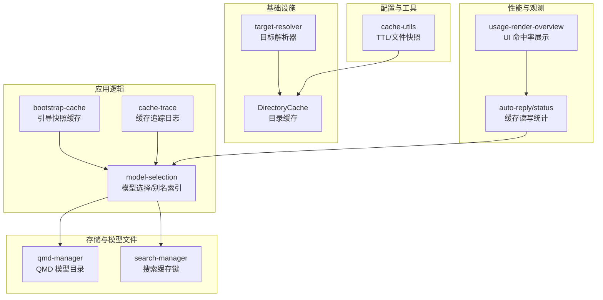
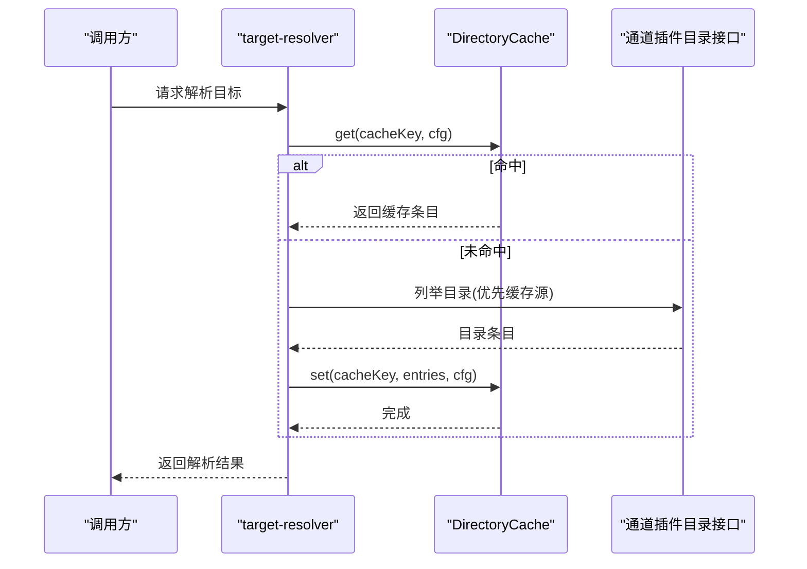
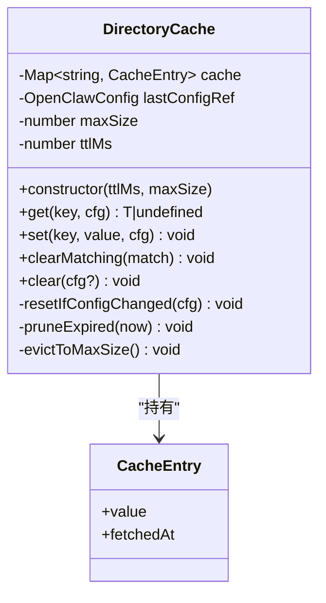
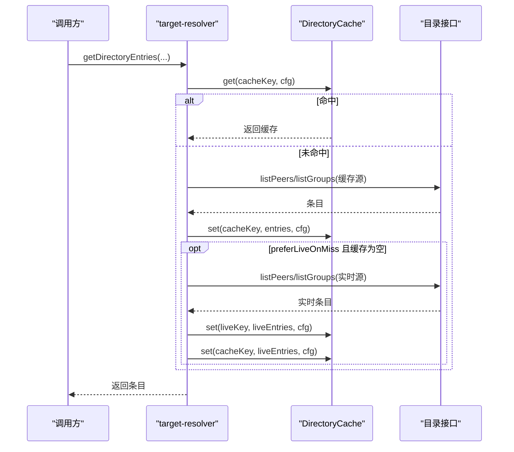
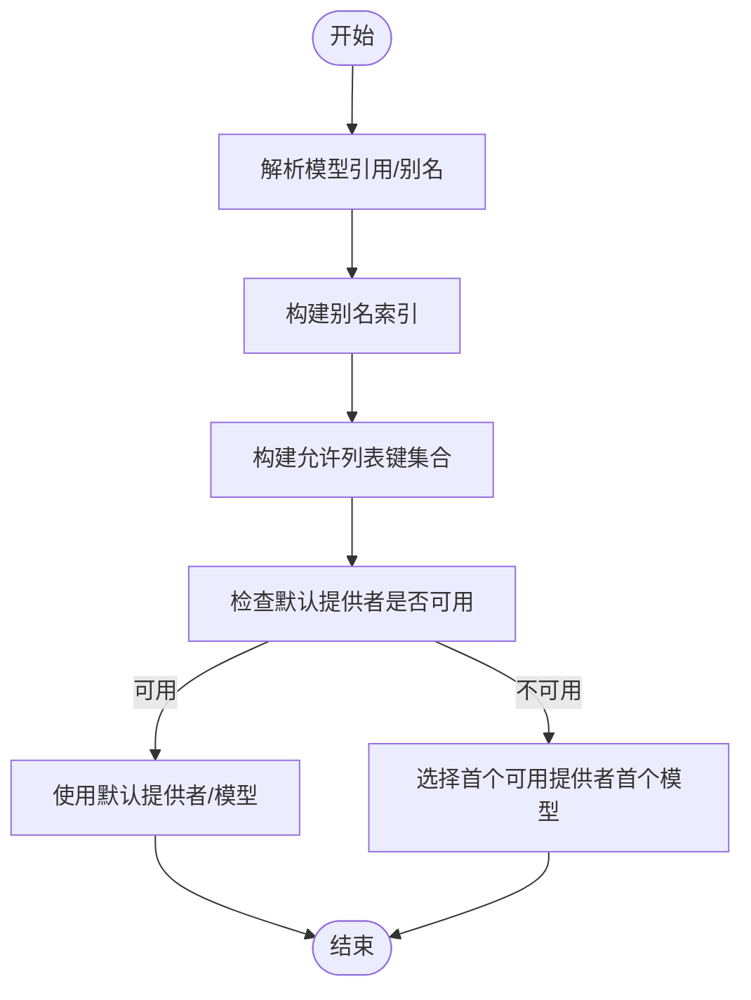
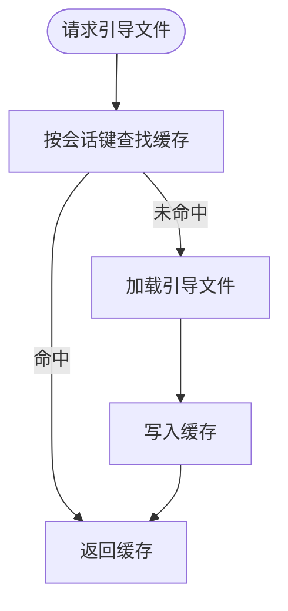
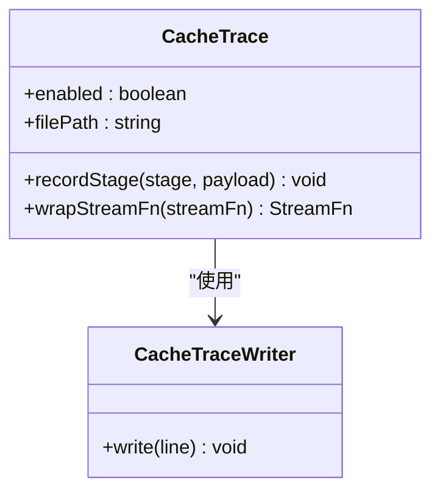
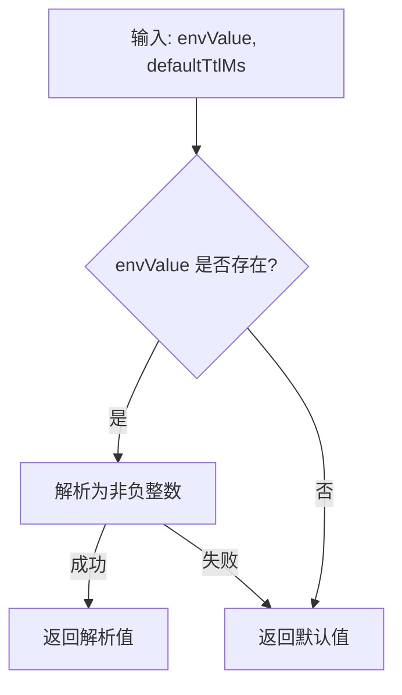
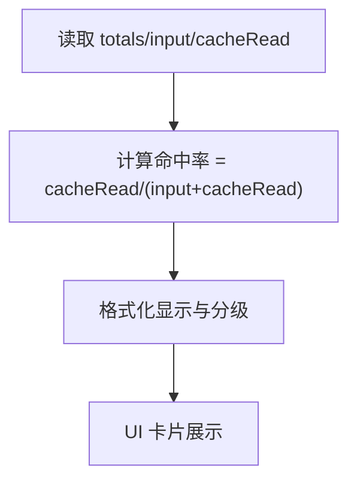
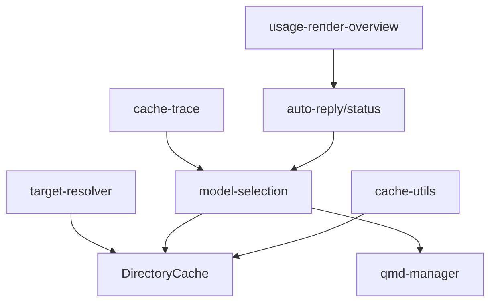

# 模型缓存

<cite>
**本文引用的文件**
- [src/infra/outbound/directory-cache.ts](file://src/infra/outbound/directory-cache.ts)
- [src/infra/outbound/target-resolver.ts](file://src/infra/outbound/target-resolver.ts)
- [src/agents/bootstrap-cache.ts](file://src/agents/bootstrap-cache.ts)
- [src/agents/cache-trace.ts](file://src/agents/cache-trace.ts)
- [src/config/cache-utils.ts](file://src/config/cache-utils.ts)
- [src/agents/model-selection.ts](file://src/agents/model-selection.ts)
- [src/auto-reply/status.ts](file://src/auto-reply/status.ts)
- [ui/src/ui/views/usage-render-overview.ts](file://ui/src/ui/views/usage-render-overview.ts)
- [src/memory/qmd-manager.ts](file://src/memory/qmd-manager.ts)
- [src/memory/search-manager.ts](file://src/memory/search-manager.ts)
- [src/commands/auth-choice.apply.huggingface.ts](file://src/commands/auth-choice.apply.huggingface.ts)
- [src/telegram/model-buttons.ts](file://src/telegram/model-buttons.ts)
- [apps/shared/OpenClawKit/Sources/OpenClawChatUI/ChatViewModel.swift](file://apps/shared/OpenClawKit/Sources/OpenClawChatUI/ChatViewModel.swift)
</cite>

## 目录
1. [简介](#简介)
2. [项目结构](#项目结构)
3. [核心组件](#核心组件)
4. [架构总览](#架构总览)
5. [详细组件分析](#详细组件分析)
6. [依赖关系分析](#依赖关系分析)
7. [性能考量](#性能考量)
8. [故障排除指南](#故障排除指南)
9. [结论](#结论)
10. [附录](#附录)

## 简介
本技术文档聚焦 OpenClaw 的“模型缓存系统”，系统性阐述模型加载与初始化的缓存策略、模型选择算法的缓存机制、模型版本管理与自动更新的缓存策略、性能监控与缓存命中率统计、配置项与优化建议，以及故障排除与清理策略。文档以代码为依据，结合可视化图示帮助读者从高层到细节全面理解。

## 项目结构
围绕模型缓存的关键模块分布于以下子系统：
- 基础设施层：目录缓存（DirectoryCache）与目标解析器（target-resolver），用于通道目录条目的缓存与失效控制。
- 应用层：模型选择与别名索引、引导快照缓存、缓存追踪日志。
- 配置与工具：缓存 TTL 解析、文件状态快照等。
- 性能与可观测性：会话状态中的缓存读写统计、UI 使用概览中的命中率展示。
- 存储与模型文件：QMD 模型目录的符号链接与默认缓存处理。

图表来源
- [src/infra/outbound/target-resolver.ts:81-100](file://src/infra/outbound/target-resolver.ts#L81-L100)
- [src/infra/outbound/directory-cache.ts:22-98](file://src/infra/outbound/directory-cache.ts#L22-L98)
- [src/agents/model-selection.ts:238-264](file://src/agents/model-selection.ts#L238-L264)
- [src/agents/bootstrap-cache.ts:1-37](file://src/agents/bootstrap-cache.ts#L1-L37)
- [src/agents/cache-trace.ts:178-261](file://src/agents/cache-trace.ts#L178-L261)
- [src/config/cache-utils.ts:4-38](file://src/config/cache-utils.ts#L4-L38)
- [src/auto-reply/status.ts:315-343](file://src/auto-reply/status.ts#L315-L343)
- [ui/src/ui/views/usage-render-overview.ts:380-533](file://ui/src/ui/views/usage-render-overview.ts#L380-L533)
- [src/memory/qmd-manager.ts:250-252](file://src/memory/qmd-manager.ts#L250-L252)
- [src/memory/search-manager.ts:248-252](file://src/memory/search-manager.ts#L248-L252)

章节来源
- [src/infra/outbound/target-resolver.ts:1-551](file://src/infra/outbound/target-resolver.ts#L1-L551)
- [src/infra/outbound/directory-cache.ts:1-99](file://src/infra/outbound/directory-cache.ts#L1-L99)
- [src/agents/model-selection.ts:1-671](file://src/agents/model-selection.ts#L1-L671)
- [src/agents/bootstrap-cache.ts:1-37](file://src/agents/bootstrap-cache.ts#L1-L37)
- [src/agents/cache-trace.ts:1-261](file://src/agents/cache-trace.ts#L1-L261)
- [src/config/cache-utils.ts:1-38](file://src/config/cache-utils.ts#L1-L38)
- [src/auto-reply/status.ts:306-343](file://src/auto-reply/status.ts#L306-L343)
- [ui/src/ui/views/usage-render-overview.ts:380-533](file://ui/src/ui/views/usage-render-overview.ts#L380-L533)
- [src/memory/qmd-manager.ts:250-252](file://src/memory/qmd-manager.ts#L250-L252)
- [src/memory/search-manager.ts:239-252](file://src/memory/search-manager.ts#L239-L252)

## 核心组件
- 目录缓存（DirectoryCache）
  - 提供基于键值的 TTL 过期与容量淘汰的内存缓存，支持按配置变更清空。
  - 关键能力：get/set/clear/clearMatching、过期修剪、LRU 风格的插入顺序刷新、容量上限逐出。
- 目标解析器（target-resolver）
  - 将用户输入解析为具体通道目标，内部使用 DirectoryCache 缓存目录列表，并在缓存缺失时可回退到实时查询。
  - 支持签名化缓存键、账户维度清理。
- 模型选择与别名索引（model-selection）
  - 负责模型引用解析、别名索引构建、允许列表校验、默认模型回退策略。
  - 与目录缓存配合，确保模型可用性检查与负载均衡缓存的稳定性。
- 引导快照缓存（bootstrap-cache）
  - 以会话键为单位缓存工作区引导文件，避免重复加载。
- 缓存追踪日志（cache-trace）
  - 可选地记录缓存生命周期事件与流式上下文摘要，便于诊断与审计。
- 缓存工具（cache-utils）
  - 提供 TTL 解析、缓存启用判断、文件状态快照等通用能力。
- 性能与命中率统计
  - 会话状态中累积 cacheRead/cacheWrite；UI 展示命中率、吞吐量、错误率等指标。

章节来源
- [src/infra/outbound/directory-cache.ts:22-98](file://src/infra/outbound/directory-cache.ts#L22-L98)
- [src/infra/outbound/target-resolver.ts:81-100](file://src/infra/outbound/target-resolver.ts#L81-L100)
- [src/agents/model-selection.ts:238-264](file://src/agents/model-selection.ts#L238-L264)
- [src/agents/bootstrap-cache.ts:1-37](file://src/agents/bootstrap-cache.ts#L1-L37)
- [src/agents/cache-trace.ts:178-261](file://src/agents/cache-trace.ts#L178-L261)
- [src/config/cache-utils.ts:4-38](file://src/config/cache-utils.ts#L4-L38)
- [src/auto-reply/status.ts:315-343](file://src/auto-reply/status.ts#L315-L343)
- [ui/src/ui/views/usage-render-overview.ts:380-533](file://ui/src/ui/views/usage-render-overview.ts#L380-L533)

## 架构总览
OpenClaw 的模型缓存体系由“内存缓存 + 磁盘缓存”双层构成：
- 内存缓存：DirectoryCache 用于短期、高频访问的数据（如通道目录、模型目录列表）。
- 磁盘缓存：QMD 等模型文件缓存通过符号链接或自定义目录维护，结合文件时间戳与大小快照进行一致性校验。

图表来源
- [src/infra/outbound/target-resolver.ts:289-340](file://src/infra/outbound/target-resolver.ts#L289-L340)
- [src/infra/outbound/directory-cache.ts:34-54](file://src/infra/outbound/directory-cache.ts#L34-L54)

章节来源
- [src/infra/outbound/target-resolver.ts:289-340](file://src/infra/outbound/target-resolver.ts#L289-L340)
- [src/infra/outbound/directory-cache.ts:34-54](file://src/infra/outbound/directory-cache.ts#L34-L54)

## 详细组件分析

### 组件一：目录缓存（DirectoryCache）
- 数据结构
  - 键空间：字符串键
  - 条目：包含值与插入时间戳
  - 最大容量：构造参数限制，逐出最旧条目
- 生命周期
  - get：若配置变更则清空缓存；修剪过期；返回命中或未命中
  - set：若存在则删除后重新插入，刷新插入顺序；修剪至最大容量
  - 清理：按匹配条件批量删除；按配置引用清空
- 复杂度
  - get/set 平均 O(1)，逐出 O(n)（最坏逐出一个最早条目）

图表来源
- [src/infra/outbound/directory-cache.ts:4-98](file://src/infra/outbound/directory-cache.ts#L4-L98)

章节来源
- [src/infra/outbound/directory-cache.ts:22-98](file://src/infra/outbound/directory-cache.ts#L22-L98)

### 组件二：目标解析器（target-resolver）与目录缓存集成
- 缓存键构建：包含 channel、accountId、kind、source、签名等维度
- 命中策略：优先返回缓存；缓存缺失时可回退到实时目录列举，并同时写入缓存
- 清理策略：支持按 channel 或 channel+accountId 精确清理

图表来源
- [src/infra/outbound/target-resolver.ts:289-340](file://src/infra/outbound/target-resolver.ts#L289-L340)
- [src/infra/outbound/directory-cache.ts:34-54](file://src/infra/outbound/directory-cache.ts#L34-L54)

章节来源
- [src/infra/outbound/target-resolver.ts:289-340](file://src/infra/outbound/target-resolver.ts#L289-L340)
- [src/infra/outbound/directory-cache.ts:34-54](file://src/infra/outbound/directory-cache.ts#L34-L54)

### 组件三：模型选择与别名索引（含允许列表与默认回退）
- 别名索引：将别名映射到模型引用，并反向记录所有别名集合
- 允许列表：根据配置生成允许的模型键集合，必要时合成目录条目
- 默认回退：当默认提供者不可用时，优先选择首个可用提供者的首个模型
- 与缓存的关系：通过目录缓存与模型目录的稳定键，提升模型可用性检查与负载均衡的命中率

图表来源
- [src/agents/model-selection.ts:238-264](file://src/agents/model-selection.ts#L238-L264)
- [src/agents/model-selection.ts:417-493](file://src/agents/model-selection.ts#L417-L493)
- [src/agents/model-selection.ts:334-351](file://src/agents/model-selection.ts#L334-L351)

章节来源
- [src/agents/model-selection.ts:238-264](file://src/agents/model-selection.ts#L238-L264)
- [src/agents/model-selection.ts:417-493](file://src/agents/model-selection.ts#L417-L493)
- [src/agents/model-selection.ts:334-351](file://src/agents/model-selection.ts#L334-L351)

### 组件四：引导快照缓存（bootstrap-cache）
- 作用：以会话键为单位缓存工作区引导文件，避免重复加载
- 清理：按会话轮换或显式清理

图表来源
- [src/agents/bootstrap-cache.ts:5-17](file://src/agents/bootstrap-cache.ts#L5-L17)

章节来源
- [src/agents/bootstrap-cache.ts:1-37](file://src/agents/bootstrap-cache.ts#L1-L37)

### 组件五：缓存追踪日志（cache-trace）
- 功能：可选记录缓存阶段事件、消息摘要、系统提示指纹等，支持流式上下文包装
- 用途：诊断缓存行为、定位命中/未命中原因

图表来源
- [src/agents/cache-trace.ts:47-105](file://src/agents/cache-trace.ts#L47-L105)
- [src/agents/cache-trace.ts:178-261](file://src/agents/cache-trace.ts#L178-L261)

章节来源
- [src/agents/cache-trace.ts:1-261](file://src/agents/cache-trace.ts#L1-L261)

### 组件六：缓存工具（cache-utils）
- TTL 解析：从环境变量或默认值解析 TTL（毫秒）
- 启用判断：ttl>0 即启用缓存
- 文件快照：获取文件的 mtime 与 size，用于一致性校验

图表来源
- [src/config/cache-utils.ts:4-16](file://src/config/cache-utils.ts#L4-L16)

章节来源
- [src/config/cache-utils.ts:1-38](file://src/config/cache-utils.ts#L1-L38)

### 组件七：性能监控与缓存命中率统计
- 会话状态：累计 cacheRead 与 cacheWrite
- UI 展示：命中率 = cacheRead / (input + cacheRead)，并给出吞吐、错误率等指标

图表来源
- [src/auto-reply/status.ts:315-343](file://src/auto-reply/status.ts#L315-L343)
- [ui/src/ui/views/usage-render-overview.ts:380-533](file://ui/src/ui/views/usage-render-overview.ts#L380-L533)

章节来源
- [src/auto-reply/status.ts:315-343](file://src/auto-reply/status.ts#L315-L343)
- [ui/src/ui/views/usage-render-overview.ts:380-533](file://ui/src/ui/views/usage-render-overview.ts#L380-L533)

### 组件八：模型文件的内存缓存与磁盘缓存
- 内存缓存：DirectoryCache 作为通用内存缓存容器，适用于模型目录、通道目录等
- 磁盘缓存：QMD 管理器对模型目录采用符号链接与默认缓存的策略，保证首次运行时的兼容与持久化

图表来源
- [src/memory/qmd-manager.ts:250-252](file://src/memory/qmd-manager.ts#L250-L252)
- [src/infra/outbound/directory-cache.ts:22-98](file://src/infra/outbound/directory-cache.ts#L22-L98)

章节来源
- [src/memory/qmd-manager.ts:250-252](file://src/memory/qmd-manager.ts#L250-L252)
- [src/infra/outbound/directory-cache.ts:22-98](file://src/infra/outbound/directory-cache.ts#L22-L98)

### 组件九：模型选择算法的缓存机制（含可用性检查与负载均衡）
- 可用性检查：通过允许列表与目录缓存，快速判定模型是否在配置允许范围内且目录可查
- 负载均衡缓存：利用目录缓存的 TTL 与容量控制，减少重复查询与抖动
- 默认回退：当默认提供者不可用时，优先选择首个可用提供者首个模型，避免缓存未命中导致的长时间等待

章节来源
- [src/agents/model-selection.ts:417-493](file://src/agents/model-selection.ts#L417-L493)
- [src/infra/outbound/target-resolver.ts:289-340](file://src/infra/outbound/target-resolver.ts#L289-L340)

### 组件十：模型版本管理与自动更新的缓存策略
- 版本标识：通过目录缓存键中的签名字段区分不同版本或配置集
- 自动更新：当配置变更时，目录缓存会清空，确保后续查询走实时路径，从而拉取最新模型目录
- 文件一致性：结合文件快照（mtime/size）进行一致性校验，避免陈旧文件被误用

章节来源
- [src/infra/outbound/target-resolver.ts:81-100](file://src/infra/outbound/target-resolver.ts#L81-L100)
- [src/config/cache-utils.ts:27-37](file://src/config/cache-utils.ts#L27-L37)

## 依赖关系分析
- 目标解析器依赖目录缓存进行目录条目缓存与失效控制
- 模型选择依赖目录缓存与模型目录的稳定键，提升可用性检查与负载均衡命中
- 缓存追踪日志与配置工具分别提供诊断与 TTL/文件快照能力
- 性能统计与 UI 展示依赖会话状态中的 cacheRead/cacheWrite

图表来源
- [src/infra/outbound/target-resolver.ts:81-100](file://src/infra/outbound/target-resolver.ts#L81-L100)
- [src/agents/model-selection.ts:238-264](file://src/agents/model-selection.ts#L238-L264)
- [src/agents/cache-trace.ts:178-261](file://src/agents/cache-trace.ts#L178-L261)
- [src/config/cache-utils.ts:4-38](file://src/config/cache-utils.ts#L4-L38)
- [src/auto-reply/status.ts:315-343](file://src/auto-reply/status.ts#L315-L343)
- [ui/src/ui/views/usage-render-overview.ts:380-533](file://ui/src/ui/views/usage-render-overview.ts#L380-L533)
- [src/memory/qmd-manager.ts:250-252](file://src/memory/qmd-manager.ts#L250-L252)

章节来源
- [src/infra/outbound/target-resolver.ts:81-100](file://src/infra/outbound/target-resolver.ts#L81-L100)
- [src/agents/model-selection.ts:238-264](file://src/agents/model-selection.ts#L238-L264)
- [src/agents/cache-trace.ts:178-261](file://src/agents/cache-trace.ts#L178-L261)
- [src/config/cache-utils.ts:4-38](file://src/config/cache-utils.ts#L4-L38)
- [src/auto-reply/status.ts:315-343](file://src/auto-reply/status.ts#L315-L343)
- [ui/src/ui/views/usage-render-overview.ts:380-533](file://ui/src/ui/views/usage-render-overview.ts#L380-L533)
- [src/memory/qmd-manager.ts:250-252](file://src/memory/qmd-manager.ts#L250-L252)

## 性能考量
- TTL 设置
  - 合理设置目录缓存 TTL，平衡新鲜度与命中率
  - 使用缓存工具解析 TTL，避免硬编码
- 容量控制
  - 控制目录缓存最大条目数量，避免内存膨胀
  - 逐出策略优先移除最旧条目，保持活跃键高命中
- 配置变更
  - 配置变更时清空缓存，确保后续查询走实时路径
- 文件一致性
  - 结合文件快照进行一致性校验，避免陈旧模型文件被误用
- 观测与调优
  - 通过缓存追踪日志与 UI 命中率展示，持续优化 TTL 与容量参数

## 故障排除指南
- 目标解析缓存未命中
  - 现象：解析目标时频繁回退到实时查询
  - 排查：确认目录缓存键构建是否正确、TTL 是否过短、是否被配置变更清空
  - 处理：适当增大 TTL、检查签名字段、避免频繁配置切换
- 模型可用性检查异常
  - 现象：允许列表校验失败或默认回退不生效
  - 排查：检查模型别名索引构建、允许列表键集合生成、默认提供者可用性
  - 处理：修正配置、确保提供者模型目录可达
- 缓存命中率低
  - 现象：UI 命中率偏低
  - 排查：查看缓存追踪日志、确认 cacheRead 是否为零、检查输入规模
  - 处理：优化提示词稳定性、减少无关字段变化、调整 TTL
- 磁盘缓存不一致
  - 现象：模型文件更新后仍使用旧版本
  - 排查：检查文件快照（mtime/size）、符号链接状态
  - 处理：清理缓存目录、重建符号链接、重启服务

章节来源
- [src/infra/outbound/target-resolver.ts:81-100](file://src/infra/outbound/target-resolver.ts#L81-L100)
- [src/agents/model-selection.ts:417-493](file://src/agents/model-selection.ts#L417-L493)
- [src/agents/cache-trace.ts:178-261](file://src/agents/cache-trace.ts#L178-L261)
- [src/config/cache-utils.ts:27-37](file://src/config/cache-utils.ts#L27-L37)
- [ui/src/ui/views/usage-render-overview.ts:380-533](file://ui/src/ui/views/usage-render-overview.ts#L380-L533)

## 结论
OpenClaw 的模型缓存系统通过“目录缓存 + 模型目录 + 引导快照 + 缓存追踪 + 性能统计”的组合，实现了高效、稳定、可观测的模型加载与选择体验。合理配置 TTL 与容量、关注配置变更与文件一致性、利用缓存追踪与命中率指标进行持续优化，是保障系统性能与可靠性的重要手段。

## 附录
- 模型选择与回调数据
  - Telegram 回调数据构建与长度限制
  - iOS 客户端模型 ID 规范化
- 认证与模型发现
  - HuggingFace 模型发现与默认模型选择

章节来源
- [src/telegram/model-buttons.ts:103-115](file://src/telegram/model-buttons.ts#L103-L115)
- [apps/shared/OpenClawKit/Sources/OpenClawChatUI/ChatViewModel.swift:704-710](file://apps/shared/OpenClawKit/Sources/OpenClawChatUI/ChatViewModel.swift#L704-L710)
- [src/commands/auth-choice.apply.huggingface.ts:59-97](file://src/commands/auth-choice.apply.huggingface.ts#L59-L97)