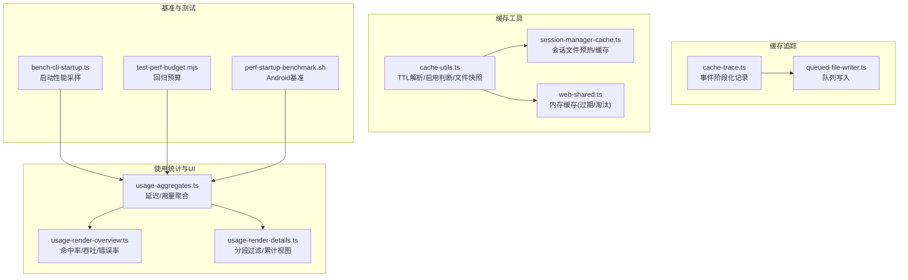
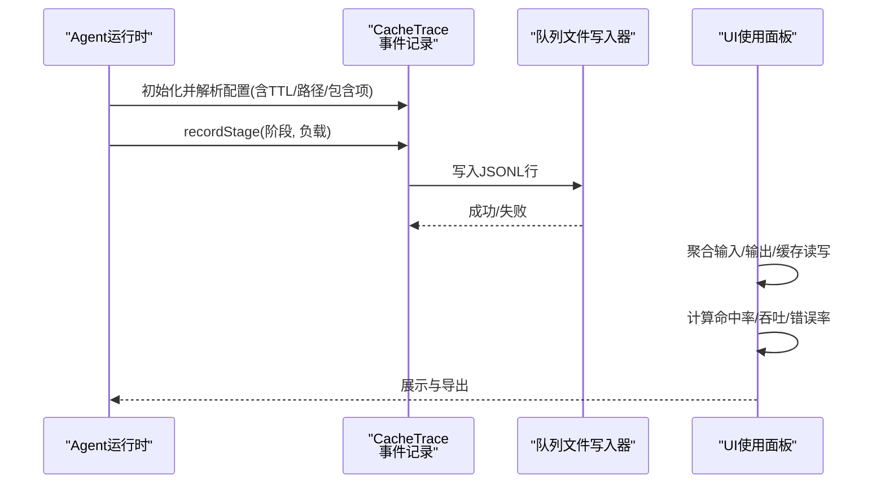
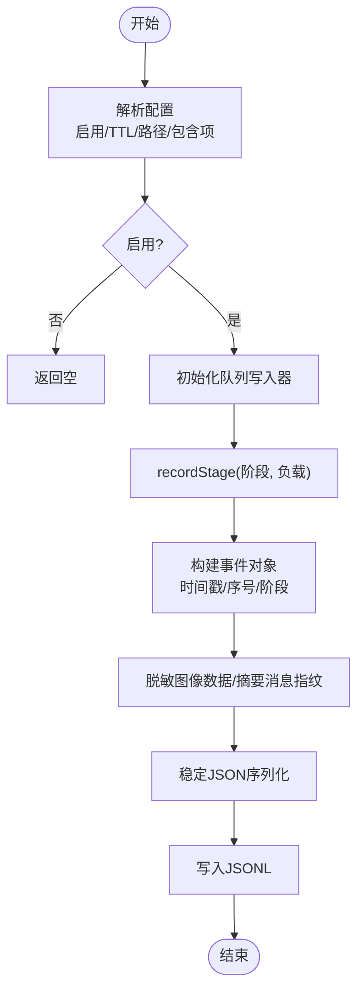
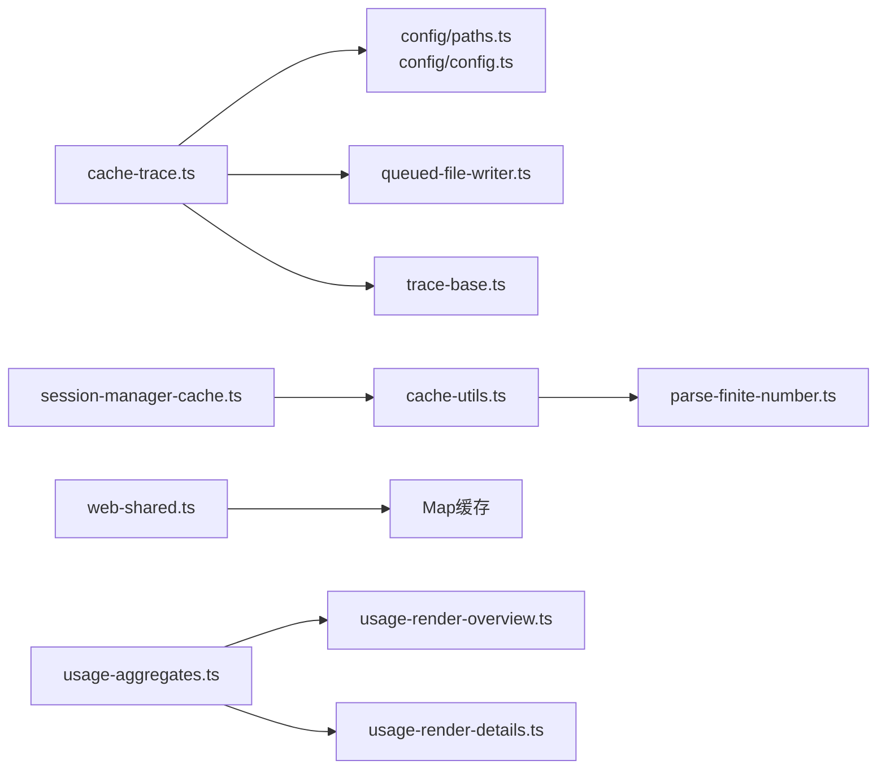

# 缓存性能监控

<cite>
**本文引用的文件**   
- [src/agents/cache-trace.ts](file://src/agents/cache-trace.ts)
- [src/agents/cache-trace.test.ts](file://src/agents/cache-trace.test.ts)
- [src/agents/pi-embedded-runner/session-manager-cache.ts](file://src/agents/pi-embedded-runner/session-manager-cache.ts)
- [src/agents/tools/web-shared.ts](file://src/agents/tools/web-shared.ts)
- [src/config/cache-utils.ts](file://src/config/cache-utils.ts)
- [src/config/sessions/store-cache.ts](file://src/config/sessions/store-cache.ts)
- [src/auto-reply/status.ts](file://src/auto-reply/status.ts)
- [src/shared/usage-aggregates.ts](file://src/shared/usage-aggregates.ts)
- [ui/src/ui/views/usage-render-overview.ts](file://ui/src/ui/views/usage-render-overview.ts)
- [ui/src/ui/views/usage-render-details.ts](file://ui/src/ui/views/usage-render-details.ts)
- [scripts/bench-cli-startup.ts](file://scripts/bench-cli-startup.ts)
- [scripts/test-perf-budget.mjs](file://scripts/test-perf-budget.mjs)
- [apps/android/scripts/perf-startup-benchmark.sh](file://apps/android/scripts/perf-startup-benchmark.sh)
</cite>

## 目录
1. [简介](#简介)
2. [项目结构](#项目结构)
3. [核心组件](#核心组件)
4. [架构总览](#架构总览)
5. [详细组件分析](#详细组件分析)
6. [依赖关系分析](#依赖关系分析)
7. [性能考量](#性能考量)
8. [故障排查指南](#故障排查指南)
9. [结论](#结论)
10. [附录](#附录)

## 简介
本技术文档面向 OpenClaw 的缓存性能监控体系，围绕以下目标展开：  
- 关键性能指标监控：缓存命中率、缓存大小、缓存响应时间等  
- 缓存追踪（cache trace）机制：采集与落盘、数据隐私保护、事件阶段化  
- 性能瓶颈识别与诊断：基于 trace 数据与 UI 指标进行定位  
- 优化策略与调参：TTL、容量、预热、淘汰策略  
- 监控仪表板与告警：UI 展示与统计聚合  
- 基准测试与压力测试：启动性能、回归预算、移动端基准脚本  

## 项目结构
OpenClaw 在多处模块实现了缓存与性能监控能力，主要涉及：
- 缓存追踪：事件式记录模型调用上下文与消息摘要，支持按阶段写入 JSONL 文件  
- 缓存工具：统一解析 TTL、启用开关、文件状态快照  
- 会话缓存：会话管理器访问跟踪与文件预热  
- 工具缓存：内存 Map 形态的键值缓存（含过期与淘汰）  
- 使用统计与 UI：输入/输出/缓存读写聚合、命中率计算、图表渲染  
- 基准与测试：CLI 启动性能、回归预算检查、Android 连接设备基准

**图表来源**
- [src/agents/cache-trace.ts:1-261](file://src/agents/cache-trace.ts#L1-L261)
- [src/config/cache-utils.ts:1-37](file://src/config/cache-utils.ts#L1-L37)
- [src/agents/pi-embedded-runner/session-manager-cache.ts:1-70](file://src/agents/pi-embedded-runner/session-manager-cache.ts#L1-L70)
- [src/agents/tools/web-shared.ts:1-39](file://src/agents/tools/web-shared.ts#L1-L39)
- [src/shared/usage-aggregates.ts:1-66](file://src/shared/usage-aggregates.ts#L1-L66)
- [ui/src/ui/views/usage-render-overview.ts:380-406](file://ui/src/ui/views/usage-render-overview.ts#L380-L406)
- [ui/src/ui/views/usage-render-details.ts:394-429](file://ui/src/ui/views/usage-render-details.ts#L394-L429)
- [scripts/bench-cli-startup.ts:59-200](file://scripts/bench-cli-startup.ts#L59-L200)
- [scripts/test-perf-budget.mjs:98-127](file://scripts/test-perf-budget.mjs#L98-L127)
- [apps/android/scripts/perf-startup-benchmark.sh:55-86](file://apps/android/scripts/perf-startup-benchmark.sh#L55-L86)

**章节来源**
- [src/agents/cache-trace.ts:1-261](file://src/agents/cache-trace.ts#L1-L261)
- [src/config/cache-utils.ts:1-37](file://src/config/cache-utils.ts#L1-L37)
- [src/agents/pi-embedded-runner/session-manager-cache.ts:1-70](file://src/agents/pi-embedded-runner/session-manager-cache.ts#L1-L70)
- [src/agents/tools/web-shared.ts:1-39](file://src/agents/tools/web-shared.ts#L1-L39)
- [src/shared/usage-aggregates.ts:1-66](file://src/shared/usage-aggregates.ts#L1-L66)
- [ui/src/ui/views/usage-render-overview.ts:380-406](file://ui/src/ui/views/usage-render-overview.ts#L380-L406)
- [ui/src/ui/views/usage-render-details.ts:394-429](file://ui/src/ui/views/usage-render-details.ts#L394-L429)
- [scripts/bench-cli-startup.ts:59-200](file://scripts/bench-cli-startup.ts#L59-L200)
- [scripts/test-perf-budget.mjs:98-127](file://scripts/test-perf-budget.mjs#L98-L127)
- [apps/android/scripts/perf-startup-benchmark.sh:55-86](file://apps/android/scripts/perf-startup-benchmark.sh#L55-L86)

## 核心组件
- 缓存追踪（Cache Trace）
  - 事件阶段：会话加载、清理、限制、提示词前、图片处理、流上下文、会话后  
  - 写入策略：按阶段写入 JSONL，支持按环境变量控制是否包含消息、提示词、系统内容  
  - 隐私保护：对图像数据进行脱敏与哈希，避免敏感信息泄露  
- 缓存工具（Cache Utils）
  - TTL 解析：从环境变量或默认值解析非负整数毫秒 TTL  
  - 启用判断：ttl>0 判定启用  
  - 文件快照：获取文件 mtime/size 快照用于缓存一致性校验  
- 会话缓存（Session Manager Cache）
  - 访问跟踪：记录会话文件最近访问时间  
  - 预热：在 TTL 内对文件进行小块读取以利用 OS 页面缓存  
- 工具缓存（Web Shared）
  - 内存 Map 缓存：带过期时间与插入时间，读取时自动剔除过期项  
  - 键规范化：小写与去空白  
- 使用统计与 UI
  - 聚合：日度/总量延迟与用量合并  
  - 命中率：cacheRead/(input+cacheRead)，吞吐、错误率、平均时长  
  - 图表：分段过滤、累计/按轮次视图、类型拆解

**章节来源**
- [src/agents/cache-trace.ts:13-52](file://src/agents/cache-trace.ts#L13-L52)
- [src/agents/cache-trace.ts:178-261](file://src/agents/cache-trace.ts#L178-L261)
- [src/config/cache-utils.ts:4-37](file://src/config/cache-utils.ts#L4-L37)
- [src/agents/pi-embedded-runner/session-manager-cache.ts:13-70](file://src/agents/pi-embedded-runner/session-manager-cache.ts#L13-L70)
- [src/agents/tools/web-shared.ts:16-39](file://src/agents/tools/web-shared.ts#L16-L39)
- [src/shared/usage-aggregates.ts:32-66](file://src/shared/usage-aggregates.ts#L32-L66)
- [ui/src/ui/views/usage-render-overview.ts:380-406](file://ui/src/ui/views/usage-render-overview.ts#L380-L406)
- [ui/src/ui/views/usage-render-details.ts:394-429](file://ui/src/ui/views/usage-render-details.ts#L394-L429)

## 架构总览
下图展示缓存追踪与使用统计在系统中的交互路径，以及与 UI 的关联。

**图表来源**
- [src/agents/cache-trace.ts:79-101](file://src/agents/cache-trace.ts#L79-L101)
- [src/agents/cache-trace.ts:189-235](file://src/agents/cache-trace.ts#L189-L235)
- [ui/src/ui/views/usage-render-overview.ts:380-406](file://ui/src/ui/views/usage-render-overview.ts#L380-L406)

**章节来源**
- [src/agents/cache-trace.ts:79-101](file://src/agents/cache-trace.ts#L79-L101)
- [src/agents/cache-trace.ts:189-235](file://src/agents/cache-trace.ts#L189-L235)
- [ui/src/ui/views/usage-render-overview.ts:380-406](file://ui/src/ui/views/usage-render-overview.ts#L380-L406)

## 详细组件分析

### 组件A：缓存追踪（Cache Trace）
- 功能要点
  - 阶段化事件：会话加载/清理/限制/提示词前/图片处理/流上下文/会话后  
  - 配置解析：支持环境变量覆盖，包含消息/提示词/系统内容开关  
  - 安全性：对图像数据进行脱敏与哈希；循环引用安全序列化  
  - 写入：稳定 JSON 序列化，按阶段追加到 JSONL 文件  
- 关键流程

**图表来源**
- [src/agents/cache-trace.ts:79-101](file://src/agents/cache-trace.ts#L79-L101)
- [src/agents/cache-trace.ts:189-235](file://src/agents/cache-trace.ts#L189-L235)
- [src/agents/cache-trace.ts:107-156](file://src/agents/cache-trace.ts#L107-L156)

- 测试要点
  - 禁用时返回空实例  
  - 支持用户路径展开与内存写入器注入  
  - 环境变量覆盖优先级  
  - 图像数据脱敏与哈希校验  
  - 循环引用安全序列化

**章节来源**
- [src/agents/cache-trace.test.ts:8-179](file://src/agents/cache-trace.test.ts#L8-L179)
- [src/agents/cache-trace.ts:79-101](file://src/agents/cache-trace.ts#L79-L101)
- [src/agents/cache-trace.ts:189-235](file://src/agents/cache-trace.ts#L189-L235)

### 组件B：缓存工具（Cache Utils）
- 功能要点
  - TTL 解析：严格非负整数解析，非法回退默认  
  - 启用判断：ttl>0  
  - 文件快照：mtime/size，异常返回 undefined  
- 复杂度与性能
  - 解析与判断为 O(1)  
  - stat 为系统调用，注意批量使用时的 I/O 负担

**章节来源**
- [src/config/cache-utils.ts:4-37](file://src/config/cache-utils.ts#L4-L37)

### 组件C：会话缓存（Session Manager Cache）
- 功能要点
  - 访问跟踪：记录会话文件最近访问时间  
  - 预热：在 TTL 内对文件进行小块读取，利用 OS 页面缓存  
  - TTL 可配置：通过环境变量覆盖默认值  
- 复杂度与性能
  - Map 查找/更新 O(1)  
  - 预热读取固定大小缓冲区，I/O 成本可控

**章节来源**
- [src/agents/pi-embedded-runner/session-manager-cache.ts:13-70](file://src/agents/pi-embedded-runner/session-manager-cache.ts#L13-L70)

### 组件D：工具缓存（Web Shared）
- 功能要点
  - 内存 Map 缓存：键规范化、过期时间、插入时间  
  - 读取：命中返回值与“已缓存”标记，过期则删除并返回未命中  
  - 默认 TTL 与最大条目数  
- 复杂度与性能
  - 读取 O(1) 平均  
  - 无内置淘汰，建议结合外部策略或限制最大条目

**章节来源**
- [src/agents/tools/web-shared.ts:16-39](file://src/agents/tools/web-shared.ts#L16-L39)

### 组件E：使用统计与 UI
- 功能要点
  - 聚合：日度/总量延迟与用量合并  
  - 命中率：cacheRead/(input+cacheRead)  
  - 图表：分段过滤、累计/按轮次视图、类型拆解  
- 复杂度与性能
  - 聚合与统计线性于点数  
  - 视图渲染按需计算，避免重复开销

**章节来源**
- [src/shared/usage-aggregates.ts:32-66](file://src/shared/usage-aggregates.ts#L32-L66)
- [ui/src/ui/views/usage-render-overview.ts:380-406](file://ui/src/ui/views/usage-render-overview.ts#L380-L406)
- [ui/src/ui/views/usage-render-details.ts:394-429](file://ui/src/ui/views/usage-render-details.ts#L394-L429)

## 依赖关系分析
- 缓存追踪依赖
  - 配置解析与路径解析  
  - 队列文件写入器（按文件路径复用 writer 实例）  
  - 事件基线构建与消息摘要  
- 缓存工具被广泛复用
  - 会话缓存、工具缓存、配置解析等模块  
- UI 依赖
  - 使用聚合模块与渲染细节模块

**图表来源**
- [src/agents/cache-trace.ts:1-12](file://src/agents/cache-trace.ts#L1-L12)
- [src/config/cache-utils.ts:1-3](file://src/config/cache-utils.ts#L1-L3)
- [src/agents/pi-embedded-runner/session-manager-cache.ts:1-4](file://src/agents/pi-embedded-runner/session-manager-cache.ts#L1-L4)
- [src/agents/tools/web-shared.ts:1-5](file://src/agents/tools/web-shared.ts#L1-L5)
- [src/shared/usage-aggregates.ts:1-7](file://src/shared/usage-aggregates.ts#L1-L7)

**章节来源**
- [src/agents/cache-trace.ts:1-12](file://src/agents/cache-trace.ts#L1-L12)
- [src/config/cache-utils.ts:1-3](file://src/config/cache-utils.ts#L1-L3)
- [src/agents/pi-embedded-runner/session-manager-cache.ts:1-4](file://src/agents/pi-embedded-runner/session-manager-cache.ts#L1-L4)
- [src/agents/tools/web-shared.ts:1-5](file://src/agents/tools/web-shared.ts#L1-L5)
- [src/shared/usage-aggregates.ts:1-7](file://src/shared/usage-aggregates.ts#L1-L7)

## 性能考量
- 缓存命中率
  - 计算公式：cacheRead/(input+cacheRead)  
  - UI 中以百分比显示，并提供提示说明  
- 缓存大小
  - 工具缓存无内置上限，建议结合业务场景设置最大条目  
  - 会话缓存基于 TTL 控制有效性，避免频繁重读  
- 缓存响应时间
  - 通过使用统计模块的延迟聚合与 UI 图表观察趋势  
  - CLI 启动性能基准与回归预算可作为端到端响应时间参考  
- 预热与淘汰
  - 会话文件预热减少首次访问延迟  
  - 工具缓存读取时剔除过期项，避免无效命中  
- I/O 与序列化
  - 缓存追踪采用稳定 JSON 序列化与队列写入，降低并发写入竞争  
  - 图像数据脱敏与哈希避免大体积明文写入

**章节来源**
- [ui/src/ui/views/usage-render-overview.ts:380-406](file://ui/src/ui/views/usage-render-overview.ts#L380-L406)
- [src/shared/usage-aggregates.ts:32-66](file://src/shared/usage-aggregates.ts#L32-L66)
- [scripts/bench-cli-startup.ts:59-200](file://scripts/bench-cli-startup.ts#L59-L200)
- [scripts/test-perf-budget.mjs:98-127](file://scripts/test-perf-budget.mjs#L98-L127)
- [src/agents/pi-embedded-runner/session-manager-cache.ts:48-70](file://src/agents/pi-embedded-runner/session-manager-cache.ts#L48-L70)
- [src/agents/tools/web-shared.ts:26-39](file://src/agents/tools/web-shared.ts#L26-L39)

## 故障排查指南
- 缓存追踪未生效
  - 检查诊断开关与文件路径是否正确解析  
  - 确认环境变量覆盖优先级  
  - 验证队列写入器可用性  
- 图像数据泄露风险
  - 确保脱敏逻辑启用且未被禁用  
  - 核对包含项开关（消息/提示词/系统）  
- 命中率异常
  - 对比 input 与 cacheRead 是否合理  
  - 检查是否存在频繁 TTL 到期导致的抖动  
- 启动性能回归
  - 使用 CLI 启动基准脚本对比不同版本  
  - 结合回归预算脚本设定阈值并报警

**章节来源**
- [src/agents/cache-trace.test.ts:72-92](file://src/agents/cache-trace.test.ts#L72-L92)
- [src/agents/cache-trace.ts:107-156](file://src/agents/cache-trace.ts#L107-L156)
- [scripts/bench-cli-startup.ts:156-200](file://scripts/bench-cli-startup.ts#L156-L200)
- [scripts/test-perf-budget.mjs:98-127](file://scripts/test-perf-budget.mjs#L98-L127)

## 结论
OpenClaw 的缓存性能监控体系通过“事件式追踪 + 统一缓存工具 + UI 聚合渲染”的组合，实现了对命中率、缓存大小与响应时间的可观测性。配合基准与回归预算，可在开发与生产环境中持续评估与优化缓存策略。

## 附录

### 缓存命中率计算与 UI 展示
- 计算方式：cacheRead/(input+cacheRead)  
- UI 提示：命中率 = 缓存读取 / (输入 + 缓存读取)  
- 其他指标：吞吐（每分钟令牌）、错误率、平均时长

**章节来源**
- [ui/src/ui/views/usage-render-overview.ts:380-406](file://ui/src/ui/views/usage-render-overview.ts#L380-L406)

### 缓存追踪配置与环境变量
- 开关与路径：支持环境变量覆盖  
- 包含项：消息/提示词/系统内容  
- 写入：JSONL 行，稳定序列化，脱敏图像数据

**章节来源**
- [src/agents/cache-trace.ts:79-101](file://src/agents/cache-trace.ts#L79-L101)
- [src/agents/cache-trace.ts:189-235](file://src/agents/cache-trace.ts#L189-L235)

### 基准测试与压力测试方法
- CLI 启动性能：多次运行取均值/中位数/95 分位  
- 回归预算：基于基线与允许波动范围判断是否失败  
- Android 移动端：连接设备基准脚本收集 JSON 结果

**章节来源**
- [scripts/bench-cli-startup.ts:59-200](file://scripts/bench-cli-startup.ts#L59-L200)
- [scripts/test-perf-budget.mjs:98-127](file://scripts/test-perf-budget.mjs#L98-L127)
- [apps/android/scripts/perf-startup-benchmark.sh:55-86](file://apps/android/scripts/perf-startup-benchmark.sh#L55-L86)