# 缓存策略

<cite>
**本文引用的文件**
- [src/media/store.ts](file://src/media/store.ts)
- [src/media/store.test.ts](file://src/media/store.test.ts)
- [src/media-understanding/attachments.cache.ts](file://src/media-understanding/attachments.cache.ts)
- [src/config/sessions/store-cache.ts](file://src/config/sessions/store-cache.ts)
- [src/config/cache-utils.ts](file://src/config/cache-utils.ts)
- [src/agents/bootstrap-cache.ts](file://src/agents/bootstrap-cache.ts)
- [src/agents/cache-trace.ts](file://src/agents/cache-trace.ts)
- [src/agents/pi-embedded-runner/cache-ttl.ts](file://src/agents/pi-embedded-runner/cache-ttl.ts)
- [src/memory/search-manager.ts](file://src/memory/search-manager.ts)
- [apps/macos/Sources/OpenClaw/ModelCatalogLoader.swift](file://apps/macos/Sources/OpenClaw/ModelCatalogLoader.swift)
</cite>

## 目录
1. [简介](#简介)
2. [项目结构](#项目结构)
3. [核心组件](#核心组件)
4. [架构总览](#架构总览)
5. [详细组件分析](#详细组件分析)
6. [依赖关系分析](#依赖关系分析)
7. [性能考量](#性能考量)
8. [故障排查指南](#故障排查指南)
9. [结论](#结论)
10. [附录](#附录)

## 简介
本文件系统性梳理 OpenClaw 的缓存策略，覆盖以下方面：
- 会话缓存：对象缓存、序列化缓存、失效规则与一致性
- 模型缓存：目录缓存、版本与路径解析、缓存命中与回退
- 媒体缓存：本地存储、TTL 清理、大小限制、原文件名保留
- 并发与一致性：缓存键设计、失效策略、跨模块协作
- 性能监控与调优：缓存 TTL 解析、统计与观测
- 配置参数与最佳实践：环境变量、默认值、使用建议

## 项目结构
OpenClaw 的缓存分布在多个子系统中：
- 会话缓存：会话对象与序列化内容的内存缓存
- 媒体缓存：媒体文件的本地磁盘缓存与清理
- 媒体理解缓存：附件缓冲区、临时文件与路径解析
- 内存搜索管理器缓存：按配置构建的搜索管理器实例缓存
- 模型目录缓存：macOS 平台模型目录的本地缓存与回退
- 运行时缓存：引导文件、缓存 TTL 标记等

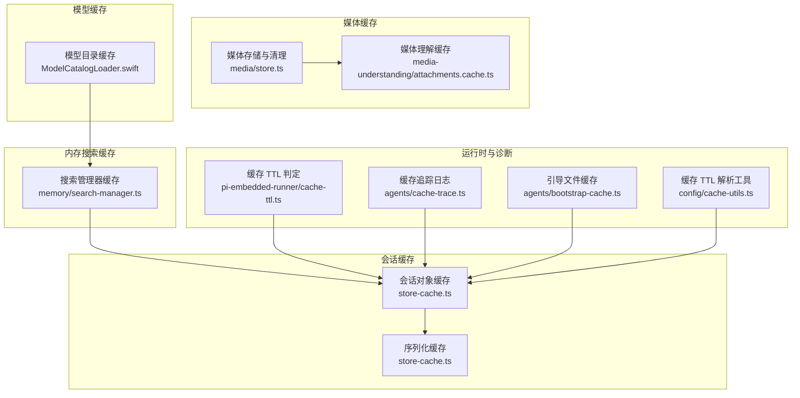

图表来源
- [src/config/sessions/store-cache.ts:1-82](file://src/config/sessions/store-cache.ts#L1-L82)
- [src/media/store.ts:1-378](file://src/media/store.ts#L1-L378)
- [src/media-understanding/attachments.cache.ts:1-324](file://src/media-understanding/attachments.cache.ts#L1-L324)
- [src/memory/search-manager.ts:1-253](file://src/memory/search-manager.ts#L1-L253)
- [apps/macos/Sources/OpenClaw/ModelCatalogLoader.swift:58-159](file://apps/macos/Sources/OpenClaw/ModelCatalogLoader.swift#L58-L159)
- [src/agents/pi-embedded-runner/cache-ttl.ts:1-77](file://src/agents/pi-embedded-runner/cache-ttl.ts#L1-L77)
- [src/agents/cache-trace.ts:1-261](file://src/agents/cache-trace.ts#L1-L261)
- [src/agents/bootstrap-cache.ts:1-37](file://src/agents/bootstrap-cache.ts#L1-L37)
- [src/config/cache-utils.ts:1-38](file://src/config/cache-utils.ts#L1-L38)

章节来源
- [src/config/sessions/store-cache.ts:1-82](file://src/config/sessions/store-cache.ts#L1-L82)
- [src/media/store.ts:1-378](file://src/media/store.ts#L1-L378)
- [src/media-understanding/attachments.cache.ts:1-324](file://src/media-understanding/attachments.cache.ts#L1-L324)
- [src/memory/search-manager.ts:1-253](file://src/memory/search-manager.ts#L1-L253)
- [apps/macos/Sources/OpenClaw/ModelCatalogLoader.swift:58-159](file://apps/macos/Sources/OpenClaw/ModelCatalogLoader.swift#L58-L159)
- [src/agents/pi-embedded-runner/cache-ttl.ts:1-77](file://src/agents/pi-embedded-runner/cache-ttl.ts#L1-L77)
- [src/agents/cache-trace.ts:1-261](file://src/agents/cache-trace.ts#L1-L261)
- [src/agents/bootstrap-cache.ts:1-37](file://src/agents/bootstrap-cache.ts#L1-L37)
- [src/config/cache-utils.ts:1-38](file://src/config/cache-utils.ts#L1-L38)

## 核心组件
- 会话对象与序列化缓存：以 storePath 为键，保存对象与序列化字符串，支持 TTL 与文件元信息校验
- 媒体存储与清理：本地磁盘缓存，支持 TTL 清理、递归清理、空目录修剪、大小限制与 MIME 推断
- 媒体理解缓存：按附件索引缓存缓冲区或临时路径，支持超时、最大字节限制与路径白名单校验
- 内存搜索管理器缓存：基于 agentId 与稳定序列化的配置构建缓存键，失败时降级并可剔除缓存条目
- 模型目录缓存：优先使用缓存文件，缺失时回退到 bundle 或 node_modules，成功后写入缓存
- 缓存 TTL 工具：从环境变量解析 TTL（毫秒），判断是否启用缓存；提供文件快照用于一致性校验
- 引导文件缓存：按 sessionKey 缓存工作区引导文件，支持会话轮换清理
- 缓存追踪：记录缓存阶段事件，便于诊断与性能分析

章节来源
- [src/config/sessions/store-cache.ts:1-82](file://src/config/sessions/store-cache.ts#L1-L82)
- [src/media/store.ts:1-378](file://src/media/store.ts#L1-L378)
- [src/media-understanding/attachments.cache.ts:1-324](file://src/media-understanding/attachments.cache.ts#L1-L324)
- [src/memory/search-manager.ts:1-253](file://src/memory/search-manager.ts#L1-L253)
- [apps/macos/Sources/OpenClaw/ModelCatalogLoader.swift:58-159](file://apps/macos/Sources/OpenClaw/ModelCatalogLoader.swift#L58-L159)
- [src/config/cache-utils.ts:1-38](file://src/config/cache-utils.ts#L1-L38)
- [src/agents/bootstrap-cache.ts:1-37](file://src/agents/bootstrap-cache.ts#L1-L37)
- [src/agents/cache-trace.ts:1-261](file://src/agents/cache-trace.ts#L1-L261)

## 架构总览
OpenClaw 的缓存体系围绕“键-值”与“TTL/一致性”两条主线：
- 键设计：会话缓存以路径为键；媒体缓存以随机 ID 或原始文件名嵌入模式命名；内存搜索管理器以 agentId+配置序列化为键；模型目录缓存以首选路径与缓存状态为依据
- 失效规则：统一采用时间窗口（TTL）与文件元信息（mtime/size）双重校验；媒体清理支持递归与空目录修剪
- 一致性：通过文件 stat 快照与序列化克隆保障读取一致性；媒体理解缓存对路径进行白名单与规范化校验
- 降级与回退：内存搜索管理器在主后端失败时切换到内置索引；模型目录缓存回退到 bundle 或 node_modules

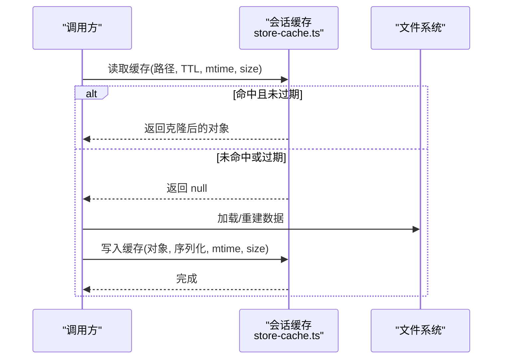

图表来源
- [src/config/sessions/store-cache.ts:41-81](file://src/config/sessions/store-cache.ts#L41-L81)

章节来源
- [src/config/sessions/store-cache.ts:1-82](file://src/config/sessions/store-cache.ts#L1-L82)

## 详细组件分析

### 会话缓存机制
- 数据结构与键
  - 以 storePath 作为键，缓存对象与序列化字符串分别存储
  - 缓存项包含 loadedAt、mtimeMs、sizeBytes、serialized 等字段
- 读取流程
  - 先查对象缓存，若存在则检查 TTL 与 mtime/size 是否匹配，匹配则返回结构化克隆
  - 不匹配则删除缓存并返回 null
- 写入流程
  - 写入对象缓存与序列化缓存，记录当前时间戳与文件元信息
- 失效规则
  - TTL 超时或文件元信息变化触发失效
  - 提供显式清理接口（清空/删除单个/删除对象缓存）
- 一致性
  - 使用结构化克隆避免外部修改影响缓存

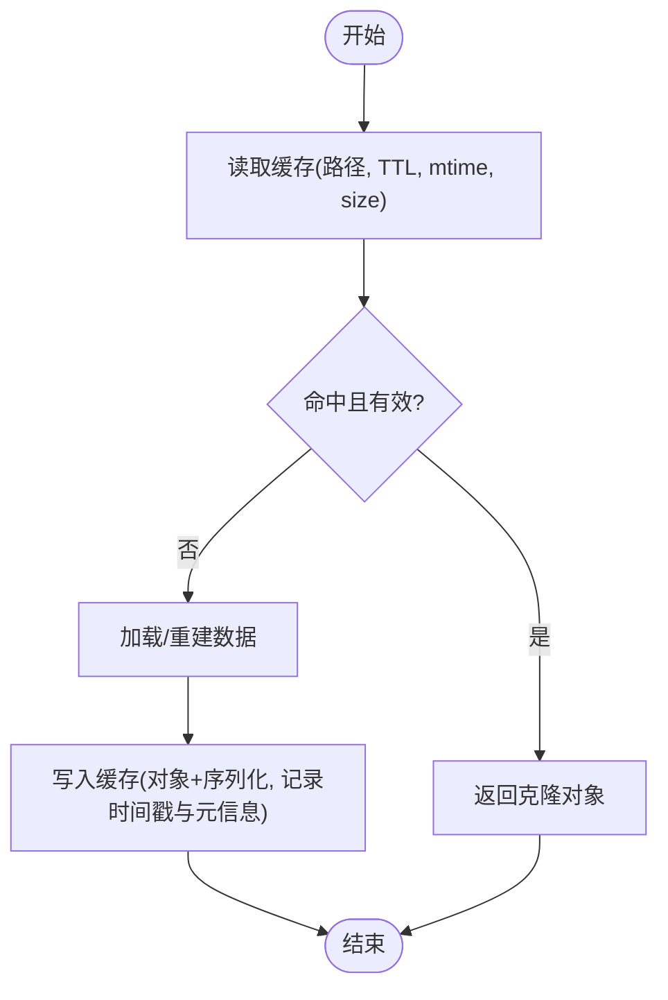

图表来源
- [src/config/sessions/store-cache.ts:41-81](file://src/config/sessions/store-cache.ts#L41-L81)

章节来源
- [src/config/sessions/store-cache.ts:1-82](file://src/config/sessions/store-cache.ts#L1-L82)

### 媒体缓存与清理
- 存储策略
  - 本地磁盘目录：state/media 下按子目录组织
  - 文件命名：UUID 或“原始名---UUID.扩展名”，支持原始文件名提取
  - MIME 推断：优先头部类型，其次文件扩展名，再次内容嗅探
  - 大小限制：默认 5MB，超出抛错
- 清理策略
  - TTL 默认 2 分钟，可递归清理与修剪空目录
  - 支持浅层清理与深层清理两种模式
- 安全与健壮性
  - 目录重试：写入前若目录被清理，自动重建并重试
  - 符号链接拒绝：防止越权访问
  - 旧文件清理：按 mtimeMs 判断过期并删除

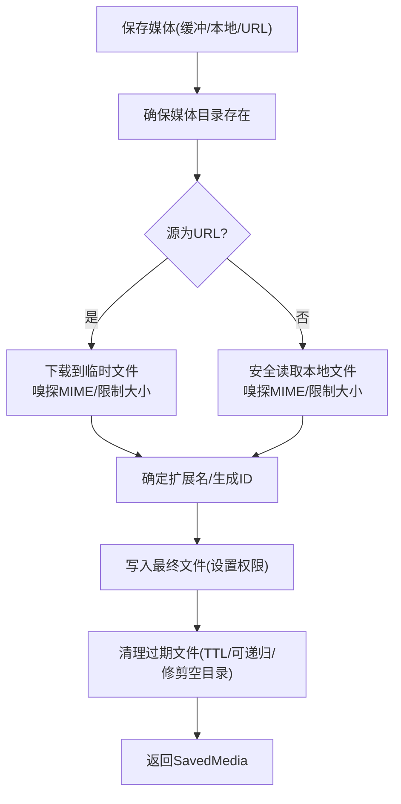

图表来源
- [src/media/store.ts:113-171](file://src/media/store.ts#L113-L171)
- [src/media/store.ts:303-344](file://src/media/store.ts#L303-L344)
- [src/media/store.ts:346-377](file://src/media/store.ts#L346-L377)

章节来源
- [src/media/store.ts:1-378](file://src/media/store.ts#L1-L378)
- [src/media/store.test.ts:1-457](file://src/media/store.test.ts#L1-L457)

### 媒体理解缓存（附件）
- 设计目标
  - 将附件转换为 Buffer 或临时路径，支持超时与最大字节限制
  - 对本地路径进行白名单与规范化校验，确保安全性
- 关键流程
  - getBuffer：优先返回已缓存 Buffer，否则尝试本地 stat，最后远程抓取
  - getPath：优先返回本地路径，否则将 Buffer 写入临时文件并返回路径
  - cleanup：回收所有临时文件
- 安全与策略
  - 本地路径根集合合并默认根与 IM 建议根
  - 规范化路径后进行白名单校验与 realpath 校验
  - 超时与最大字节异常转换为可诊断错误

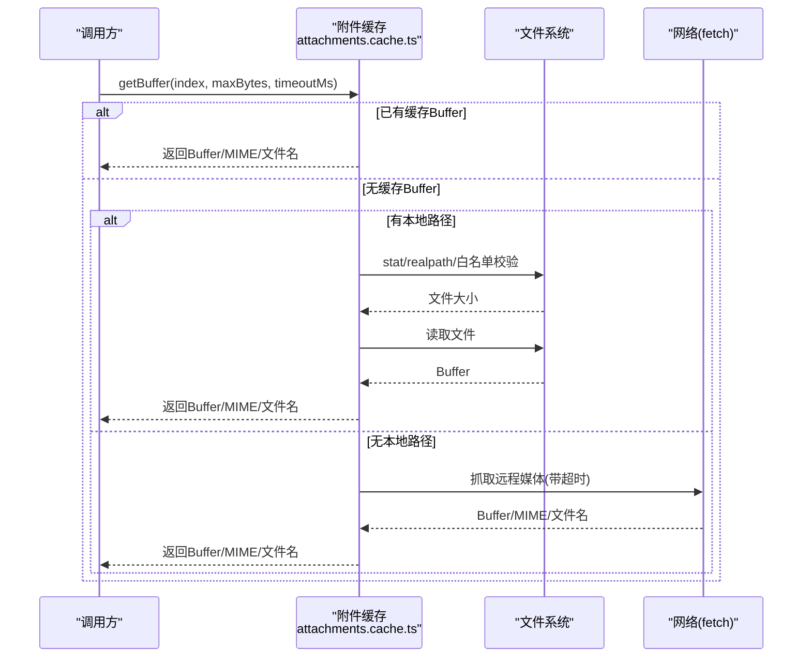

图表来源
- [src/media-understanding/attachments.cache.ts:75-167](file://src/media-understanding/attachments.cache.ts#L75-L167)

章节来源
- [src/media-understanding/attachments.cache.ts:1-324](file://src/media-understanding/attachments.cache.ts#L1-L324)

### 内存搜索管理器缓存
- 缓存键构建
  - 基于 agentId 与稳定序列化的配置字符串
- 生命周期
  - 首次创建后缓存实例，后续请求复用
  - 主后端失败时降级到内置索引，同时剔除缓存条目以便下次重试
- 关闭与清理
  - 统一关闭缓存的管理器实例
  - 提供 evictCacheEntry 防止重复使用已失败包装器

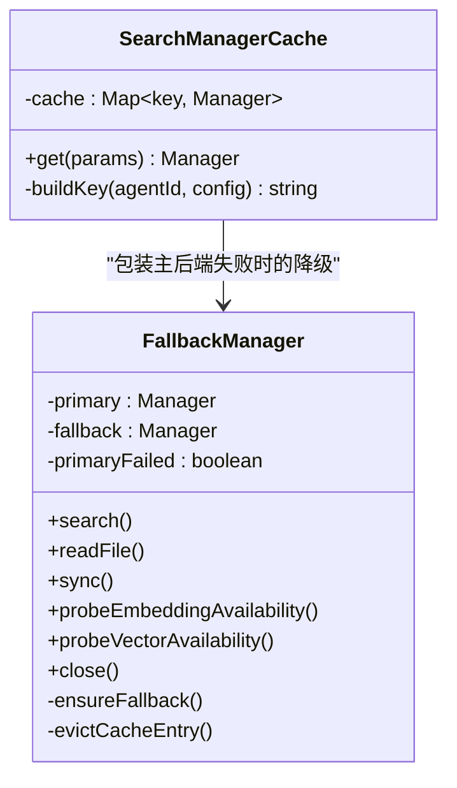

图表来源
- [src/memory/search-manager.ts:25-102](file://src/memory/search-manager.ts#L25-L102)
- [src/memory/search-manager.ts:104-246](file://src/memory/search-manager.ts#L104-L246)
- [src/memory/search-manager.ts:248-252](file://src/memory/search-manager.ts#L248-L252)

章节来源
- [src/memory/search-manager.ts:1-253](file://src/memory/search-manager.ts#L1-L253)

### 模型目录缓存（macOS）
- 路径解析优先级
  - 首选路径可读则直接使用
  - 否则回退到 bundle 或 node_modules
  - 若缓存可用则回退到缓存
- 缓存写入
  - 成功加载后复制到缓存路径，便于后续快速启动
- 容错
  - 回退过程记录警告日志，不影响功能可用性

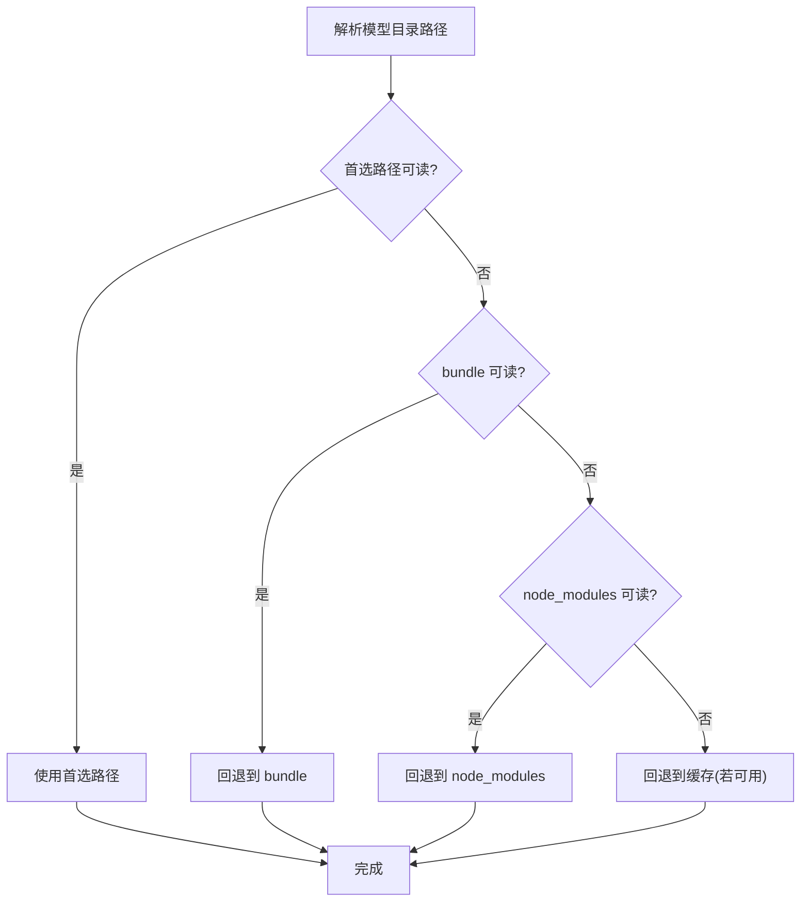

图表来源
- [apps/macos/Sources/OpenClaw/ModelCatalogLoader.swift:79-101](file://apps/macos/Sources/OpenClaw/ModelCatalogLoader.swift#L79-L101)
- [apps/macos/Sources/OpenClaw/ModelCatalogLoader.swift:125-139](file://apps/macos/Sources/OpenClaw/ModelCatalogLoader.swift#L125-L139)

章节来源
- [apps/macos/Sources/OpenClaw/ModelCatalogLoader.swift:58-159](file://apps/macos/Sources/OpenClaw/ModelCatalogLoader.swift#L58-L159)

### 缓存 TTL 与一致性工具
- TTL 解析
  - 从环境变量解析非负整数（毫秒），否则使用默认值
  - 提供 isCacheEnabled 判断是否启用缓存
- 文件快照
  - 获取文件 mtimeMs 与 sizeBytes，用于缓存一致性校验
- 在会话缓存中的应用
  - 读取时比较 mtime/size，不一致即失效
  - 写入时记录最新 mtime/size

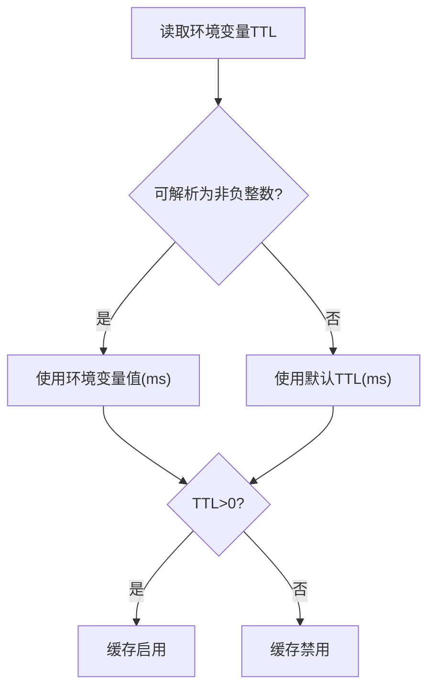

图表来源
- [src/config/cache-utils.ts:4-20](file://src/config/cache-utils.ts#L4-L20)

章节来源
- [src/config/cache-utils.ts:1-38](file://src/config/cache-utils.ts#L1-L38)

### 引导文件缓存与会话轮换
- 引导文件缓存
  - 以 sessionKey 为键缓存工作区引导文件列表
  - 支持按 sessionKey 清理与全量清理
- 会话轮换清理
  - 当新会话与前一个会话 ID 均存在时，清理对应快照

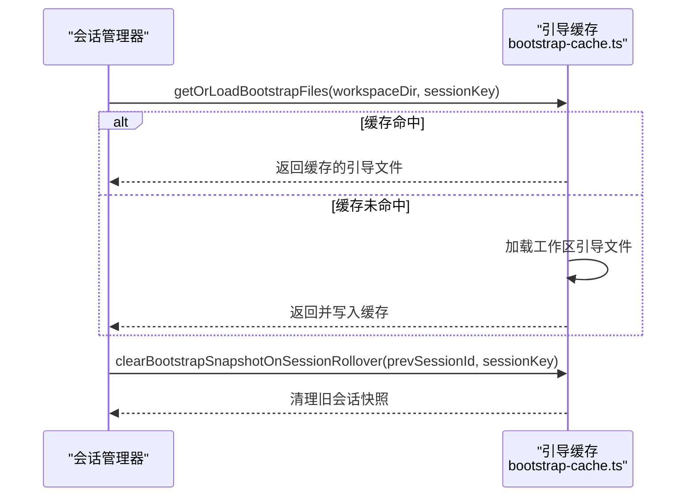

图表来源
- [src/agents/bootstrap-cache.ts:5-32](file://src/agents/bootstrap-cache.ts#L5-L32)

章节来源
- [src/agents/bootstrap-cache.ts:1-37](file://src/agents/bootstrap-cache.ts#L1-L37)

### 缓存 TTL 判定（运行时）
- 适用范围
  - 针对特定提供商与模型前缀，判定是否支持缓存 TTL
- 时间戳记录
  - 从会话管理器读取最近缓存 TTL 时间戳
  - 写入新的时间戳条目，忽略持久化失败

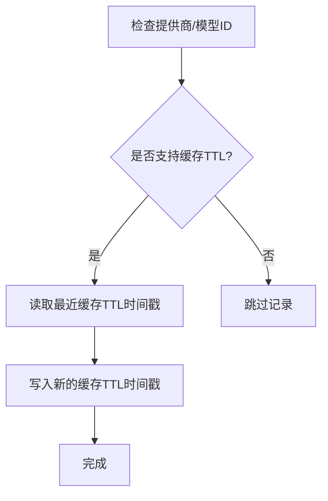

图表来源
- [src/agents/pi-embedded-runner/cache-ttl.ts:23-76](file://src/agents/pi-embedded-runner/cache-ttl.ts#L23-L76)

章节来源
- [src/agents/pi-embedded-runner/cache-ttl.ts:1-77](file://src/agents/pi-embedded-runner/cache-ttl.ts#L1-L77)

### 缓存追踪与可观测性
- 缓存追踪
  - 记录不同阶段事件（如会话加载、提示前后、流上下文等）
  - 支持包含/排除消息、提示、系统等字段
  - 输出到指定日志文件，支持队列写入
- 用途
  - 诊断缓存命中率、异常与性能瓶颈
  - 识别过期与一致性问题

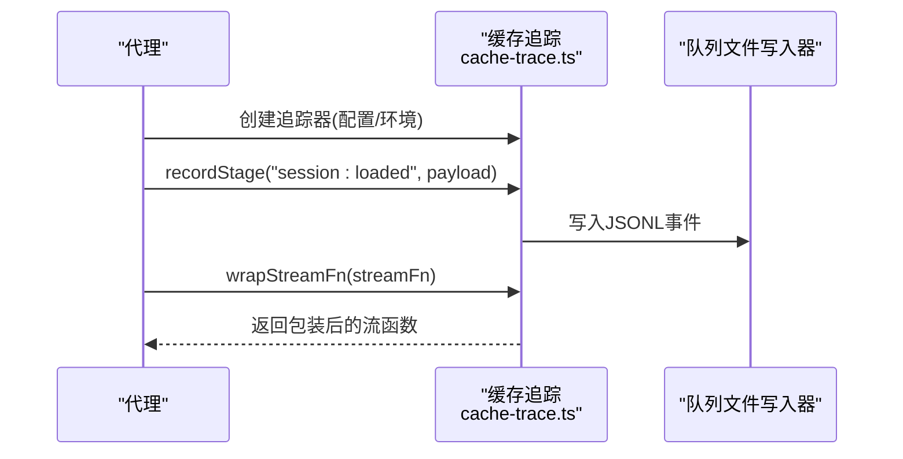

图表来源
- [src/agents/cache-trace.ts:178-260](file://src/agents/cache-trace.ts#L178-L260)

章节来源
- [src/agents/cache-trace.ts:1-261](file://src/agents/cache-trace.ts#L1-L261)

## 依赖关系分析
- 低耦合高内聚
  - 各缓存模块职责清晰：会话、媒体、内存搜索、模型目录、运行时 TTL、引导文件
- 关键依赖链
  - 会话缓存依赖文件系统与配置工具（TTL/快照）
  - 媒体理解缓存依赖媒体存储与网络抓取
  - 内存搜索管理器缓存依赖配置解析与运行时加载
  - 模型目录缓存依赖平台文件系统与回退策略
- 潜在循环依赖
  - 未发现直接循环依赖；各模块通过接口与工厂模式解耦

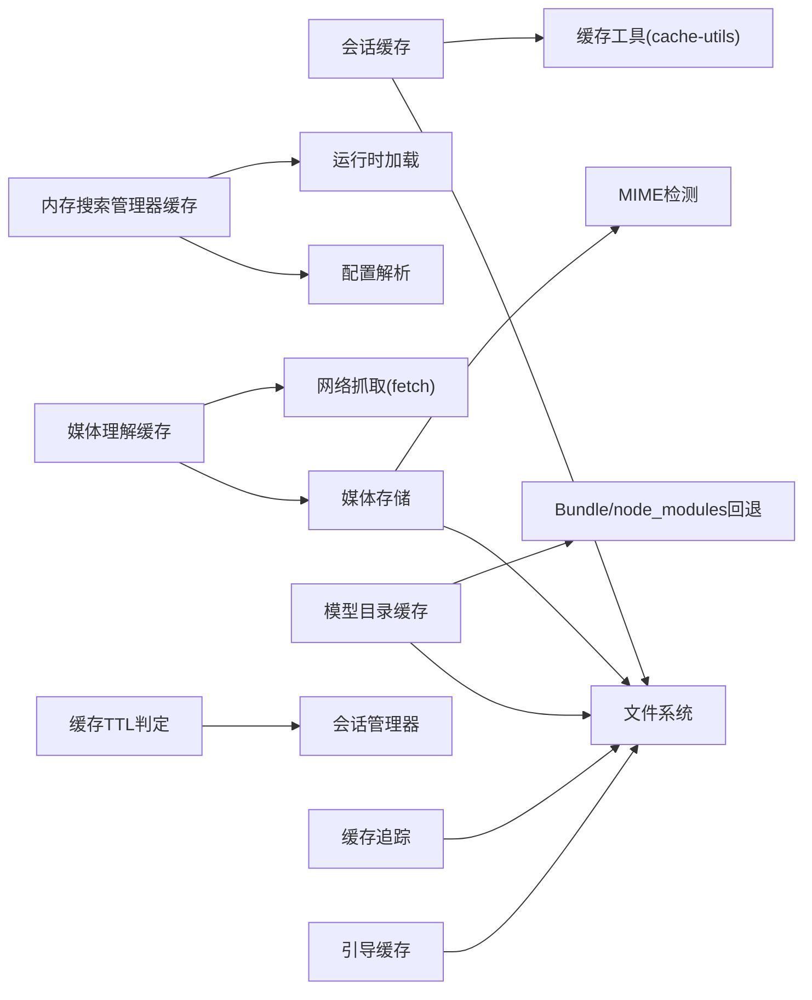

图表来源
- [src/config/sessions/store-cache.ts:1-82](file://src/config/sessions/store-cache.ts#L1-L82)
- [src/media/store.ts:1-378](file://src/media/store.ts#L1-L378)
- [src/media-understanding/attachments.cache.ts:1-324](file://src/media-understanding/attachments.cache.ts#L1-L324)
- [src/memory/search-manager.ts:1-253](file://src/memory/search-manager.ts#L1-L253)
- [apps/macos/Sources/OpenClaw/ModelCatalogLoader.swift:58-159](file://apps/macos/Sources/OpenClaw/ModelCatalogLoader.swift#L58-L159)
- [src/agents/pi-embedded-runner/cache-ttl.ts:1-77](file://src/agents/pi-embedded-runner/cache-ttl.ts#L1-L77)
- [src/agents/cache-trace.ts:1-261](file://src/agents/cache-trace.ts#L1-L261)
- [src/agents/bootstrap-cache.ts:1-37](file://src/agents/bootstrap-cache.ts#L1-L37)
- [src/config/cache-utils.ts:1-38](file://src/config/cache-utils.ts#L1-L38)

章节来源
- [src/config/sessions/store-cache.ts:1-82](file://src/config/sessions/store-cache.ts#L1-L82)
- [src/media/store.ts:1-378](file://src/media/store.ts#L1-L378)
- [src/media-understanding/attachments.cache.ts:1-324](file://src/media-understanding/attachments.cache.ts#L1-L324)
- [src/memory/search-manager.ts:1-253](file://src/memory/search-manager.ts#L1-L253)
- [apps/macos/Sources/OpenClaw/ModelCatalogLoader.swift:58-159](file://apps/macos/Sources/OpenClaw/ModelCatalogLoader.swift#L58-L159)
- [src/agents/pi-embedded-runner/cache-ttl.ts:1-77](file://src/agents/pi-embedded-runner/cache-ttl.ts#L1-L77)
- [src/agents/cache-trace.ts:1-261](file://src/agents/cache-trace.ts#L1-L261)
- [src/agents/bootstrap-cache.ts:1-37](file://src/agents/bootstrap-cache.ts#L1-L37)
- [src/config/cache-utils.ts:1-38](file://src/config/cache-utils.ts#L1-L38)

## 性能考量
- TTL 与清理
  - 会话缓存：合理设置 TTL，避免频繁重建；结合 mtime/size 快照减少误失效
  - 媒体缓存：TTL 2 分钟适合短期交互；递归清理与空目录修剪降低磁盘占用
- 内存与 IO
  - 媒体理解缓存优先使用 Buffer，必要时写入临时文件；注意临时文件清理
  - 内存搜索管理器缓存避免重复初始化，失败后及时剔除缓存条目
- 并发与一致性
  - 结构化克隆返回对象，避免外部修改污染缓存
  - 文件 stat 快照与 realpath 校验确保缓存一致性
- 观测与调优
  - 使用缓存追踪记录关键阶段，定位热点与异常
  - 通过环境变量调整 TTL，结合测试验证命中率与延迟

[本节为通用指导，无需列出具体文件来源]

## 故障排查指南
- 媒体文件无法读取或被清理
  - 检查 TTL 设置与清理选项（递归/修剪空目录）
  - 确认文件 mtime 是否被更新导致缓存失效
- 附件路径被拒绝
  - 检查本地路径根集合与规范化路径是否在白名单内
  - 关注符号链接与越界访问防护
- 会话缓存未命中
  - 核对 TTL 与 mtime/size 是否与缓存一致
  - 检查 storePath 是否正确
- 内存搜索管理器不可用
  - 查看主后端错误日志，确认是否已降级
  - 关注缓存条目剔除逻辑，避免重复使用失败包装器
- 缓存追踪
  - 检查日志文件路径与字段开关，定位问题阶段

章节来源
- [src/media/store.ts:113-171](file://src/media/store.ts#L113-L171)
- [src/media-understanding/attachments.cache.ts:259-303](file://src/media-understanding/attachments.cache.ts#L259-L303)
- [src/config/sessions/store-cache.ts:41-81](file://src/config/sessions/store-cache.ts#L41-L81)
- [src/memory/search-manager.ts:104-246](file://src/memory/search-manager.ts#L104-L246)
- [src/agents/cache-trace.ts:178-260](file://src/agents/cache-trace.ts#L178-L260)

## 结论
OpenClaw 的缓存策略以“明确的键设计、严格的 TTL/一致性校验、安全的路径与文件策略、以及可观测性”为核心原则。通过模块化设计与降级回退机制，系统在复杂场景下仍能保持稳定与高效。建议在生产环境中结合缓存追踪与性能测试，持续优化 TTL 与清理策略。

[本节为总结，无需列出具体文件来源]

## 附录

### 缓存配置参数与最佳实践
- 会话缓存
  - TTL：通过环境变量解析（毫秒），默认值由实现决定
  - 失效条件：TTL 过期或文件 mtime/size 变化
  - 最佳实践：为高频访问的会话设置适中 TTL，避免过短导致频繁重建
- 媒体缓存
  - TTL：默认 2 分钟，支持递归清理与空目录修剪
  - 大小限制：默认 5MB，超出抛错
  - 最佳实践：对临时交互使用较短 TTL，对长期驻留资源考虑更长 TTL
- 媒体理解缓存
  - 超时与最大字节：可配置，超限时抛出可诊断错误
  - 最佳实践：根据网络状况与资源大小调整超时与最大字节
- 内存搜索管理器缓存
  - 缓存键：agentId + 稳定序列化配置
  - 最佳实践：变更配置时注意缓存键变化，避免误用旧缓存
- 模型目录缓存（macOS）
  - 最佳实践：优先使用缓存文件，回退策略应记录日志并保证可用性
- 缓存 TTL 工具
  - 最佳实践：统一通过工具解析 TTL，避免魔法数字；结合 isCacheEnabled 判断启用状态

章节来源
- [src/config/cache-utils.ts:4-20](file://src/config/cache-utils.ts#L4-L20)
- [src/media/store.ts:16-16](file://src/media/store.ts#L16-L16)
- [src/media-understanding/attachments.cache.ts:75-79](file://src/media-understanding/attachments.cache.ts#L75-L79)
- [src/memory/search-manager.ts:248-252](file://src/memory/search-manager.ts#L248-L252)
- [apps/macos/Sources/OpenClaw/ModelCatalogLoader.swift:79-101](file://apps/macos/Sources/OpenClaw/ModelCatalogLoader.swift#L79-L101)