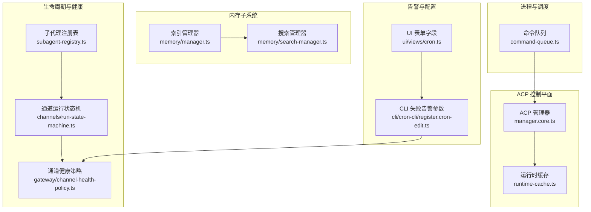
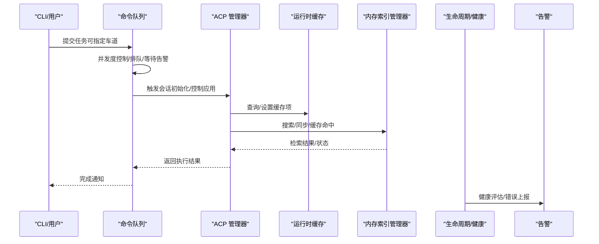
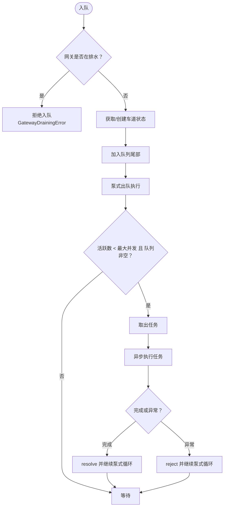
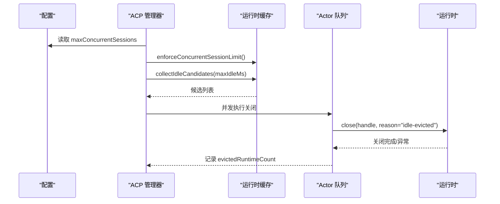
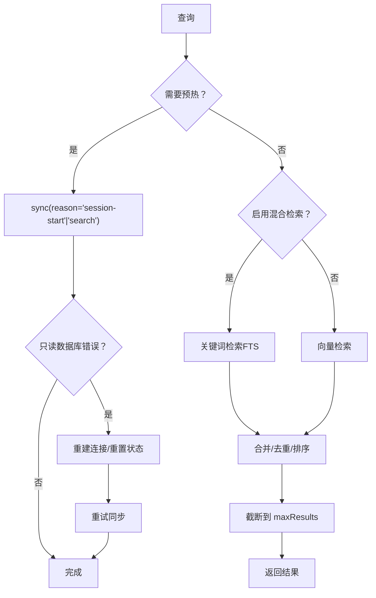
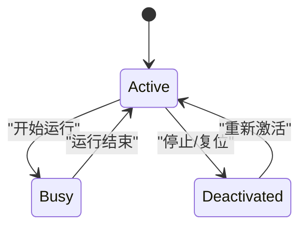
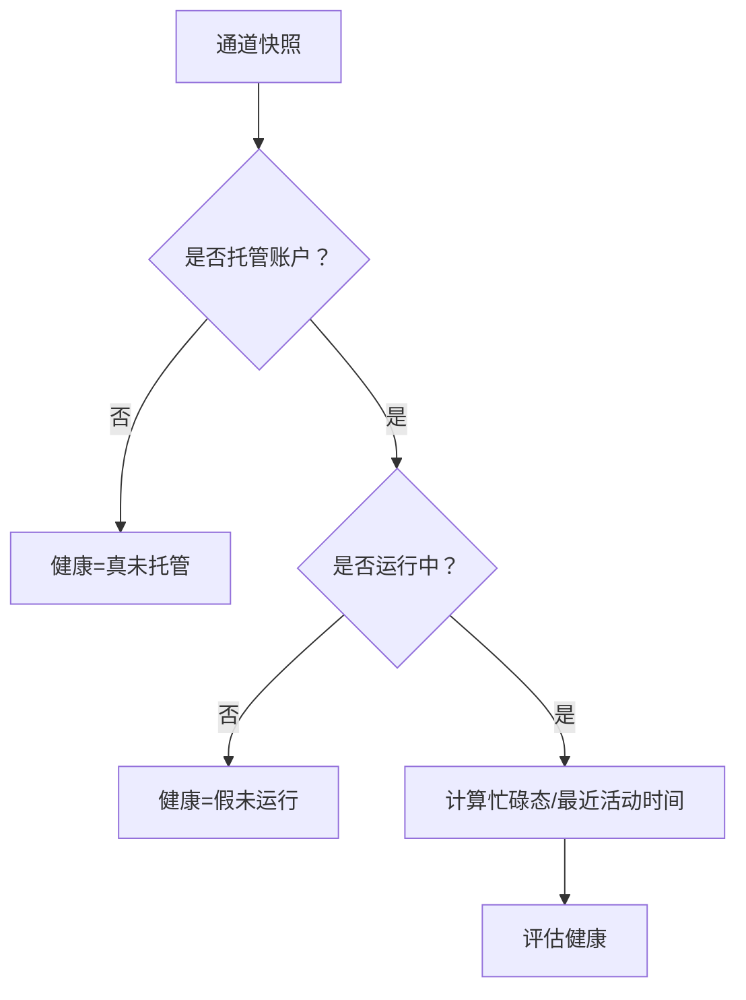
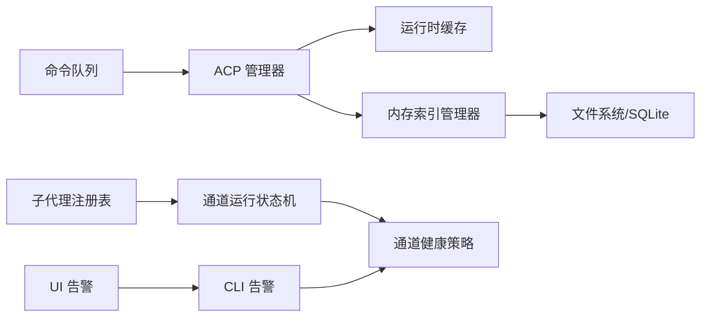

# 资源管理

<cite>
**本文引用的文件**
- [src/process/command-queue.ts](file://src/process/command-queue.ts)
- [src/config/types.acp.ts](file://src/config/types.acp.ts)
- [src/acp/control-plane/manager.core.ts](file://src/acp/control-plane/manager.core.ts)
- [src/acp/control-plane/runtime-cache.ts](file://src/acp/control-plane/runtime-cache.ts)
- [src/memory/manager.ts](file://src/memory/manager.ts)
- [src/memory/search-manager.ts](file://src/memory/search-manager.ts)
- [src/infra/heartbeat-wake.ts](file://src/infra/heartbeat-wake.ts)
- [src/agents/subagent-registry.ts](file://src/agents/subagent-registry.ts)
- [src/agents/subagent-lifecycle-events.ts](file://src/agents/subagent-lifecycle-events.ts)
- [src/channels/run-state-machine.ts](file://src/channels/run-state-machine.ts)
- [src/gateway/channel-health-policy.ts](file://src/gateway/channel-health-policy.ts)
- [src/config/types.memory.ts](file://src/config/types.memory.ts)
- [scripts/test-parallel.mjs](file://scripts/test-parallel.mjs)
- [src/cli/cron-cli/register.cron-edit.ts](file://src/cli/cron-cli/register.cron-edit.ts)
- [ui/src/ui/views/cron.ts](file://ui/src/ui/views/cron.ts)
</cite>

## 目录
1. [简介](#简介)
2. [项目结构](#项目结构)
3. [核心组件](#核心组件)
4. [架构总览](#架构总览)
5. [详细组件分析](#详细组件分析)
6. [依赖关系分析](#依赖关系分析)
7. [性能考量](#性能考量)
8. [故障排查指南](#故障排查指南)
9. [结论](#结论)
10. [附录](#附录)

## 简介
本文件面向 OpenClaw 的资源管理，聚焦以下方面：
- 内存管理：内存预算控制、缓存预热、内存回收与只读数据库恢复
- CPU 资源分配与进程调度：并发控制、优先级管理、队列与通道隔离
- 磁盘 I/O 优化：文件系统缓存、增量同步与批量写入
- 进程生命周期管理与资源清理：运行时句柄回收、会话重置、错误兜底
- 资源监控与告警：健康评估、失败告警配置与 UI 表单
- 配置参数示例与性能调优建议

## 项目结构
OpenClaw 将资源管理相关能力分布在多个子系统中：
- 进程与命令调度：command-queue 提供多车道（lane）串行化与并发度控制
- ACP 控制平面：运行时缓存、空闲驱逐、并发会话限制
- 内存子系统：索引管理器、向量/关键词混合检索、缓存与批量写入
- 生命周期与健康：子代理生命周期事件、通道健康策略、心跳唤醒
- 告警与配置：CLI 告警参数解析、UI 表单字段

**图表来源**
- [src/process/command-queue.ts:1-325](file://src/process/command-queue.ts#L1-L325)
- [src/acp/control-plane/manager.core.ts:1061-1158](file://src/acp/control-plane/manager.core.ts#L1061-L1158)
- [src/acp/control-plane/runtime-cache.ts:57-99](file://src/acp/control-plane/runtime-cache.ts#L57-L99)
- [src/memory/manager.ts:1-804](file://src/memory/manager.ts#L1-L804)
- [src/memory/search-manager.ts:239-252](file://src/memory/search-manager.ts#L239-L252)
- [src/agents/subagent-registry.ts:279-313](file://src/agents/subagent-registry.ts#L279-L313)
- [src/channels/run-state-machine.ts:58-99](file://src/channels/run-state-machine.ts#L58-L99)
- [src/gateway/channel-health-policy.ts:57-81](file://src/gateway/channel-health-policy.ts#L57-L81)
- [src/cli/cron-cli/register.cron-edit.ts:279-335](file://src/cli/cron-cli/register.cron-edit.ts#L279-L335)
- [ui/src/ui/views/cron.ts:1237-1260](file://ui/src/ui/views/cron.ts#L1237-L1260)

**章节来源**
- [src/process/command-queue.ts:1-325](file://src/process/command-queue.ts#L1-L325)
- [src/acp/control-plane/manager.core.ts:1061-1158](file://src/acp/control-plane/manager.core.ts#L1061-L1158)
- [src/acp/control-plane/runtime-cache.ts:57-99](file://src/acp/control-plane/runtime-cache.ts#L57-L99)
- [src/memory/manager.ts:1-804](file://src/memory/manager.ts#L1-L804)
- [src/memory/search-manager.ts:239-252](file://src/memory/search-manager.ts#L239-L252)
- [src/agents/subagent-registry.ts:279-313](file://src/agents/subagent-registry.ts#L279-L313)
- [src/channels/run-state-machine.ts:58-99](file://src/channels/run-state-machine.ts#L58-L99)
- [src/gateway/channel-health-policy.ts:57-81](file://src/gateway/channel-health-policy.ts#L57-L81)
- [src/cli/cron-cli/register.cron-edit.ts:279-335](file://src/cli/cron-cli/register.cron-edit.ts#L279-L335)
- [ui/src/ui/views/cron.ts:1237-1260](file://ui/src/ui/views/cron.ts#L1237-L1260)

## 核心组件
- 命令队列与并发控制：通过“车道”实现串行化执行与并发上限控制，支持等待告警、排队长度统计、清空车道、重启后重置等
- ACP 运行时管理：基于缓存的运行时句柄管理，空闲驱逐、并发会话限制、能力探测与控制应用
- 内存索引与缓存：向量/关键词混合检索、嵌入批处理、只读数据库自动恢复、增量同步与缓存条目上限
- 生命周期与健康：子代理生命周期事件、通道运行状态机、通道健康评估策略
- 告警配置：CLI 参数解析与 UI 字段映射，支持失败告警开关、渠道、接收人、冷却时间与模式

**章节来源**
- [src/process/command-queue.ts:150-271](file://src/process/command-queue.ts#L150-L271)
- [src/acp/control-plane/manager.core.ts:1061-1158](file://src/acp/control-plane/manager.core.ts#L1061-L1158)
- [src/acp/control-plane/runtime-cache.ts:78-98](file://src/acp/control-plane/runtime-cache.ts#L78-L98)
- [src/memory/manager.ts:452-552](file://src/memory/manager.ts#L452-L552)
- [src/agents/subagent-registry.ts:279-313](file://src/agents/subagent-registry.ts#L279-L313)
- [src/channels/run-state-machine.ts:58-99](file://src/channels/run-state-machine.ts#L58-L99)
- [src/gateway/channel-health-policy.ts:57-81](file://src/gateway/channel-health-policy.ts#L57-L81)
- [src/cli/cron-cli/register.cron-edit.ts:279-335](file://src/cli/cron-cli/register.cron-edit.ts#L279-L335)
- [ui/src/ui/views/cron.ts:1237-1260](file://ui/src/ui/views/cron.ts#L1237-L1260)

## 架构总览
下图展示资源管理的关键交互路径：命令队列驱动任务执行；ACP 管理器协调运行时生命周期与并发；内存子系统提供检索与缓存；生命周期与健康模块保障稳定性；告警模块贯穿配置与 UI。

**图表来源**
- [src/process/command-queue.ts:161-197](file://src/process/command-queue.ts#L161-L197)
- [src/acp/control-plane/manager.core.ts:1061-1158](file://src/acp/control-plane/manager.core.ts#L1061-L1158)
- [src/acp/control-plane/runtime-cache.ts:78-98](file://src/acp/control-plane/runtime-cache.ts#L78-L98)
- [src/memory/manager.ts:257-365](file://src/memory/manager.ts#L257-L365)
- [src/agents/subagent-registry.ts:279-313](file://src/agents/subagent-registry.ts#L279-L313)
- [src/gateway/channel-health-policy.ts:57-81](file://src/gateway/channel-health-policy.ts#L57-L81)

## 详细组件分析

### 命令队列与并发控制
- 多车道模型：每个车道维护独立队列、活跃任务集合、最大并发数与生成代数
- 并发控制：通过 setCommandLaneConcurrency 设置每车道并发上限；enqueueCommandInLane 支持等待告警回调
- 清理与重启：clearCommandLane 清空指定车道队列并拒绝后续任务；resetAllLanes 在进程内重启后重置状态
- 统计与等待：getActiveTaskCount、getTotalQueueSize、waitForActiveTasks 提供可观测性与优雅停机

**图表来源**
- [src/process/command-queue.ts:161-197](file://src/process/command-queue.ts#L161-L197)
- [src/process/command-queue.ts:92-144](file://src/process/command-queue.ts#L92-L144)
- [src/process/command-queue.ts:216-228](file://src/process/command-queue.ts#L216-L228)
- [src/process/command-queue.ts:244-259](file://src/process/command-queue.ts#L244-L259)

**章节来源**
- [src/process/command-queue.ts:150-271](file://src/process/command-queue.ts#L150-L271)
- [src/process/command-queue.ts:273-325](file://src/process/command-queue.ts#L273-L325)

### ACP 运行时管理与空闲驱逐
- 并发会话限制：enforceConcurrentSessionLimit 基于配置的最大并发会话数进行检查，避免超配
- 空闲驱逐：collectIdleCandidates 收集超过 TTL 的空闲缓存项，按 ActorKey 并发安全地关闭运行时句柄
- 缓存快照：getLastTouchedAt/snapshot/collectIdleCandidates 提供空闲时长计算与候选收集
- 能力与控制：resolveRuntimeCapabilities 与 applyRuntimeControls 协调运行时能力与控制下发

**图表来源**
- [src/acp/control-plane/manager.core.ts:1061-1158](file://src/acp/control-plane/manager.core.ts#L1061-L1158)
- [src/acp/control-plane/runtime-cache.ts:78-98](file://src/acp/control-plane/runtime-cache.ts#L78-L98)

**章节来源**
- [src/acp/control-plane/manager.core.ts:1061-1158](file://src/acp/control-plane/manager.core.ts#L1061-L1158)
- [src/acp/control-plane/runtime-cache.ts:57-99](file://src/acp/control-plane/runtime-cache.ts#L57-L99)

### 内存子系统：缓存预热、预算与回收
- 缓存预热：warmSession 在会话开始或搜索前触发同步，减少首次延迟
- 混合检索：向量检索与关键词检索（FTS）结合，支持 MMR 与时间衰减
- 批量写入与失败抑制：batch 配置与失败计数，超过阈值后抑制批量操作
- 只读数据库恢复：检测 SQLITE_READONLY 错误后自动重建连接并重试
- 缓存上限：嵌入缓存表条目数量受控，状态接口暴露当前条目数与上限

**图表来源**
- [src/memory/manager.ts:241-255](file://src/memory/manager.ts#L241-L255)
- [src/memory/manager.ts:257-365](file://src/memory/manager.ts#L257-L365)
- [src/memory/manager.ts:452-552](file://src/memory/manager.ts#L452-L552)
- [src/memory/manager.ts:690-738](file://src/memory/manager.ts#L690-L738)

**章节来源**
- [src/memory/manager.ts:241-365](file://src/memory/manager.ts#L241-L365)
- [src/memory/manager.ts:452-552](file://src/memory/manager.ts#L452-L552)
- [src/memory/manager.ts:690-738](file://src/memory/manager.ts#L690-L738)
- [src/memory/search-manager.ts:239-252](file://src/memory/search-manager.ts#L239-L252)

### 进程生命周期管理与资源清理
- 子代理生命周期事件：定义结束原因与结局状态，统一生命周期事件
- 注册表与错误兜底：schedulePendingLifecycleError 在超时窗口内兜底标记错误并触发清理
- 通道运行状态机：跟踪 activeRuns/busy 状态，心跳与复位逻辑
- 会话重置/删除：支持以会话维度的生命周期结束原因

**图表来源**
- [src/channels/run-state-machine.ts:58-99](file://src/channels/run-state-machine.ts#L58-L99)
- [src/agents/subagent-lifecycle-events.ts:1-30](file://src/agents/subagent-lifecycle-events.ts#L1-L30)

**章节来源**
- [src/agents/subagent-registry.ts:279-313](file://src/agents/subagent-registry.ts#L279-L313)
- [src/agents/subagent-lifecycle-events.ts:1-30](file://src/agents/subagent-lifecycle-events.ts#L1-L30)
- [src/channels/run-state-machine.ts:58-99](file://src/channels/run-state-machine.ts#L58-L99)

### 通道健康与优先级管理
- 通道健康评估：根据运行状态、活动运行数、最近运行活动时间等判定健康
- 心跳唤醒优先级：queuePendingWakeReason 基于原因优先级与请求时间更新唤醒目标

**图表来源**
- [src/gateway/channel-health-policy.ts:57-81](file://src/gateway/channel-health-policy.ts#L57-L81)
- [src/infra/heartbeat-wake.ts:84-117](file://src/infra/heartbeat-wake.ts#L84-L117)

**章节来源**
- [src/gateway/channel-health-policy.ts:57-81](file://src/gateway/channel-health-policy.ts#L57-L81)
- [src/infra/heartbeat-wake.ts:84-117](file://src/infra/heartbeat-wake.ts#L84-L117)

### 告警配置与监控
- CLI 失败告警参数：支持开关、渠道、接收人、冷却时间、模式与账号 ID，并进行参数校验
- UI 表单字段：提供失败告警冷却时间、告警渠道等输入项
- 健康策略：通道健康评估作为告警触发的基础

**章节来源**
- [src/cli/cron-cli/register.cron-edit.ts:279-335](file://src/cli/cron-cli/register.cron-edit.ts#L279-L335)
- [ui/src/ui/views/cron.ts:1237-1260](file://ui/src/ui/views/cron.ts#L1237-L1260)
- [src/gateway/channel-health-policy.ts:57-81](file://src/gateway/channel-health-policy.ts#L57-L81)

## 依赖关系分析
- 命令队列依赖诊断日志与车道常量，向上游提供并发控制与可观测性
- ACP 管理器依赖运行时缓存与队列，向下协调运行时生命周期与控制
- 内存索引管理器依赖嵌入提供者、SQLite 数据库与文件系统监听，向上提供检索与状态
- 生命周期与健康模块相互协作，前者保证运行时稳定，后者提供健康评估
- 告警模块贯穿 CLI 与 UI，依赖健康策略进行告警决策

**图表来源**
- [src/process/command-queue.ts:1-325](file://src/process/command-queue.ts#L1-L325)
- [src/acp/control-plane/manager.core.ts:1061-1158](file://src/acp/control-plane/manager.core.ts#L1061-L1158)
- [src/acp/control-plane/runtime-cache.ts:57-99](file://src/acp/control-plane/runtime-cache.ts#L57-L99)
- [src/memory/manager.ts:1-804](file://src/memory/manager.ts#L1-L804)
- [src/agents/subagent-registry.ts:279-313](file://src/agents/subagent-registry.ts#L279-L313)
- [src/channels/run-state-machine.ts:58-99](file://src/channels/run-state-machine.ts#L58-L99)
- [src/gateway/channel-health-policy.ts:57-81](file://src/gateway/channel-health-policy.ts#L57-L81)
- [src/cli/cron-cli/register.cron-edit.ts:279-335](file://src/cli/cron-cli/register.cron-edit.ts#L279-L335)
- [ui/src/ui/views/cron.ts:1237-1260](file://ui/src/ui/views/cron.ts#L1237-L1260)

**章节来源**
- [src/process/command-queue.ts:1-325](file://src/process/command-queue.ts#L1-L325)
- [src/acp/control-plane/manager.core.ts:1061-1158](file://src/acp/control-plane/manager.core.ts#L1061-L1158)
- [src/acp/control-plane/runtime-cache.ts:57-99](file://src/acp/control-plane/runtime-cache.ts#L57-L99)
- [src/memory/manager.ts:1-804](file://src/memory/manager.ts#L1-L804)
- [src/agents/subagent-registry.ts:279-313](file://src/agents/subagent-registry.ts#L279-L313)
- [src/channels/run-state-machine.ts:58-99](file://src/channels/run-state-machine.ts#L58-L99)
- [src/gateway/channel-health-policy.ts:57-81](file://src/gateway/channel-health-policy.ts#L57-L81)
- [src/cli/cron-cli/register.cron-edit.ts:279-335](file://src/cli/cron-cli/register.cron-edit.ts#L279-L335)
- [ui/src/ui/views/cron.ts:1237-1260](file://ui/src/ui/views/cron.ts#L1237-L1260)

## 性能考量
- 并发与队列
  - 使用 setCommandLaneConcurrency 为不同任务类型设置合理并发上限，避免 IO 抢占
  - 对高风险并行场景使用独立车道，降低主流程日志/标准输入交错影响
- 内存与检索
  - 合理设置混合检索权重与候选倍数，平衡准确率与吞吐
  - 利用 warmSession 在会话开始时预热索引，降低首查询延迟
  - 仅在必要时启用向量扩展，避免额外加载开销
- 批处理与只读恢复
  - 监控 batch 失败计数，超过阈值后自动抑制批量写入，防止雪崩
  - 发生只读数据库错误时，快速重建连接并重试，减少人工干预
- 资源分配脚本参考
  - 参考测试脚本中的本地 Worker 分配策略，按内存档位调整单元测试、扩展与网关并发

**章节来源**
- [src/process/command-queue.ts:154-159](file://src/process/command-queue.ts#L154-L159)
- [src/memory/manager.ts:241-255](file://src/memory/manager.ts#L241-L255)
- [src/memory/manager.ts:452-552](file://src/memory/manager.ts#L452-L552)
- [scripts/test-parallel.mjs:274-300](file://scripts/test-parallel.mjs#L274-L300)

## 故障排查指南
- 命令队列
  - 现象：新任务被拒绝
  - 排查：确认是否处于网关排水状态；查看车道活跃任务数与队列长度
  - 处理：调用 resetAllLanes 或等待现有任务完成后重试
- ACP 运行时
  - 现象：会话初始化失败或频繁驱逐
  - 排查：检查 maxConcurrentSessions 配置；确认空闲 TTL 是否过短
  - 处理：提升并发上限或延长 TTL；检查运行时关闭异常日志
- 内存检索
  - 现象：检索结果为空或性能下降
  - 排查：确认 FTS 可用性与向量扩展可用性；检查缓存条目数与上限
  - 处理：触发 warmSession；必要时禁用向量扩展或降低候选数
- 只读数据库
  - 现象：同步报只读错误
  - 排查：查看 readonlyRecovery 统计；确认文件权限与挂载状态
  - 处理：自动重建连接后重试；如持续失败，检查底层存储
- 生命周期与健康
  - 现象：通道长时间忙碌或不健康
  - 排查：检查 activeRuns 与最近活动时间；核对心跳与复位逻辑
  - 处理：触发清理流程；必要时重置会话

**章节来源**
- [src/process/command-queue.ts:169-171](file://src/process/command-queue.ts#L169-L171)
- [src/process/command-queue.ts:244-259](file://src/process/command-queue.ts#L244-L259)
- [src/acp/control-plane/manager.core.ts:1061-1158](file://src/acp/control-plane/manager.core.ts#L1061-L1158)
- [src/memory/manager.ts:690-738](file://src/memory/manager.ts#L690-L738)
- [src/agents/subagent-registry.ts:279-313](file://src/agents/subagent-registry.ts#L279-L313)
- [src/channels/run-state-machine.ts:58-99](file://src/channels/run-state-machine.ts#L58-L99)
- [src/gateway/channel-health-policy.ts:57-81](file://src/gateway/channel-health-policy.ts#L57-L81)

## 结论
OpenClaw 的资源管理通过“命令队列+ACP 控制平面+内存子系统”的协同，实现了对 CPU、内存与磁盘 I/O 的精细化控制。配合生命周期与健康策略、以及告警配置，系统在稳定性与性能之间取得平衡。建议在生产环境中结合硬件条件与业务负载，动态调整并发、缓存与检索策略，并建立完善的监控与告警体系。

## 附录

### 配置参数示例与说明
- ACP 并发与运行时
  - maxConcurrentSessions：最大并发会话数
  - ttlMinutes：运行时空闲 TTL
- 内存检索
  - backend：内存后端（内置/QMD）
  - citations：引用模式（自动/开启/关闭）
  - qmd.searchMode：检索模式（query/search/vsearch）
  - qmd.update：同步间隔、去抖动、启动时同步、命令/更新/嵌入超时
  - qmd.limits：最大结果数、片段字符数、注入字符数、超时
- 命令队列
  - setCommandLaneConcurrency：为特定车道设置并发上限
  - enqueueCommandInLane：入队并设置等待告警阈值
- 告警
  - CLI：failureAlert、failureAlertChannel、failureAlertTo、failureAlertCooldown、failureAlertMode、failureAlertAccountId
  - UI：failureAlertCooldownSeconds、failureAlertChannel

**章节来源**
- [src/config/types.acp.ts:37-49](file://src/config/types.acp.ts#L37-L49)
- [src/config/types.memory.ts:7-68](file://src/config/types.memory.ts#L7-L68)
- [src/process/command-queue.ts:154-159](file://src/process/command-queue.ts#L154-L159)
- [src/cli/cron-cli/register.cron-edit.ts:279-335](file://src/cli/cron-cli/register.cron-edit.ts#L279-L335)
- [ui/src/ui/views/cron.ts:1237-1260](file://ui/src/ui/views/cron.ts#L1237-L1260)