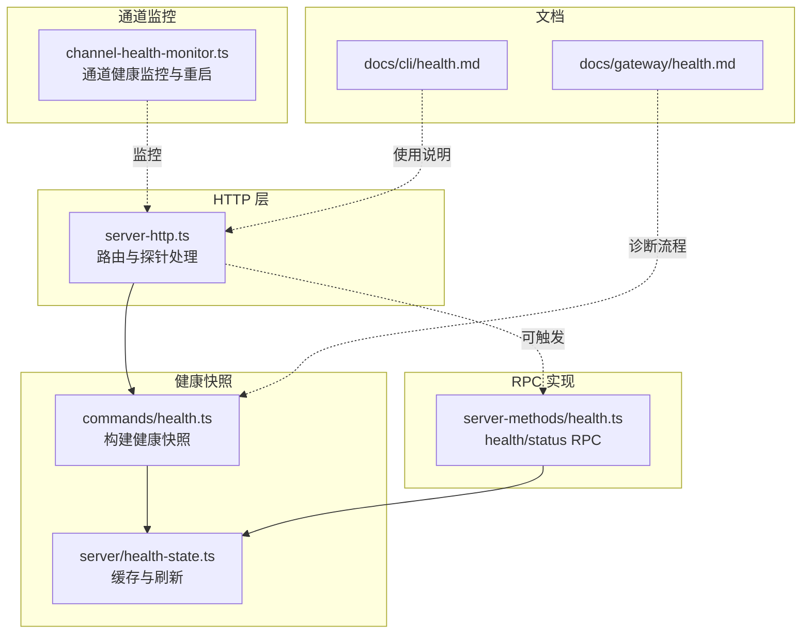
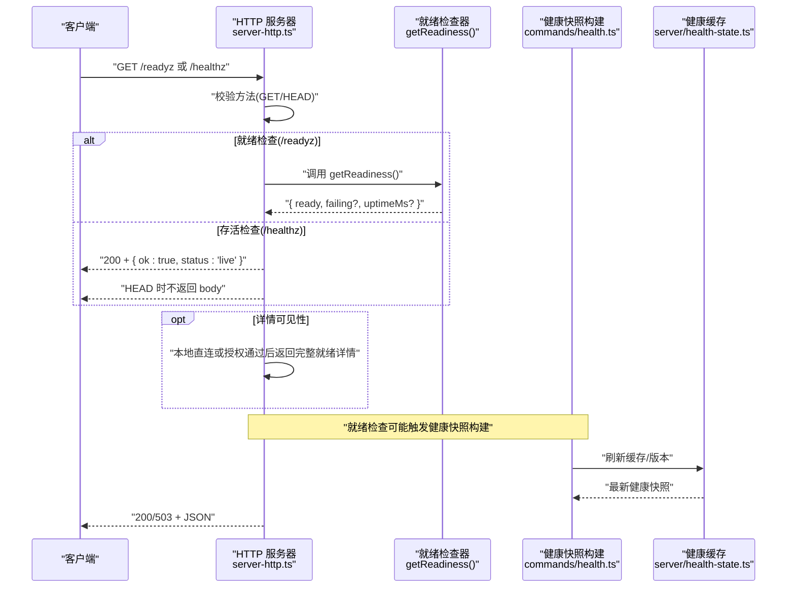
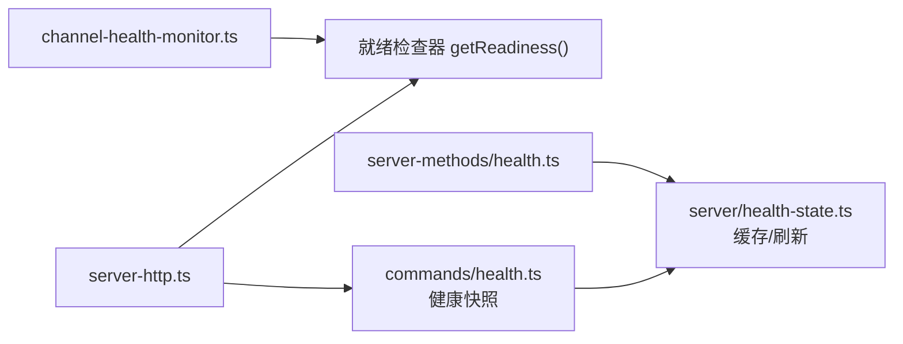

# 健康检查端点

<cite>
**本文引用的文件**
- [server-http.ts](file://src/gateway/server-http.ts)
- [server-http.probe.test.ts](file://src/gateway/server-http.probe.test.ts)
- [health.ts（命令）](file://src/commands/health.ts)
- [health-state.ts](file://src/gateway/server/health-state.ts)
- [health.ts（方法）](file://src/gateway/server-methods/health.ts)
- [channel-health-monitor.ts](file://src/gateway/channel-health-monitor.ts)
- [health.md（CLI 文档）](file://docs/cli/health.md)
- [health.md（网关诊断）](file://docs/gateway/health.md)
</cite>

## 目录
1. [简介](#简介)
2. [项目结构](#项目结构)
3. [核心组件](#核心组件)
4. [架构总览](#架构总览)
5. [详细组件分析](#详细组件分析)
6. [依赖关系分析](#依赖关系分析)
7. [性能考量](#性能考量)
8. [故障排查指南](#故障排查指南)
9. [结论](#结论)
10. [附录](#附录)

## 简介
本文件面向 OpenClaw 网关的健康检查端点，系统性阐述 /healthz 与 /readyz 的实现原理、工作机制与响应语义，并覆盖以下方面：
- 端点的 HTTP 响应状态码含义与返回体结构
- 健康检查的多层维度：网关服务器状态、通道连接状态、会话与心跳、以及可选的“就绪”检查
- 使用示例与在 Kubernetes 中作为存活探针与就绪探针的集成建议
- 超时、重试与错误处理策略
- 常见失败原因与解决方案

## 项目结构
与健康检查端点直接相关的代码主要分布在以下模块：
- HTTP 层路由与探针处理：src/gateway/server-http.ts
- 探针行为与测试：src/gateway/server-http.probe.test.ts
- 健康快照与通道探测：src/commands/health.ts
- 网关侧健康状态缓存与刷新：src/gateway/server/health-state.ts
- 网关 RPC 健康接口实现：src/gateway/server-methods/health.ts
- 通道健康监控与自动重启：src/gateway/channel-health-monitor.ts
- CLI 与网关诊断文档：docs/cli/health.md、docs/gateway/health.md

图表来源
- [server-http.ts:184-236](file://src/gateway/server-http.ts#L184-L236)
- [health.ts（命令）:348-523](file://src/commands/health.ts#L348-L523)
- [health-state.ts:70-85](file://src/gateway/server/health-state.ts#L70-L85)
- [health.ts（方法）:10-37](file://src/gateway/server-methods/health.ts#L10-L37)
- [channel-health-monitor.ts:76-200](file://src/gateway/channel-health-monitor.ts#L76-L200)

章节来源
- [server-http.ts:88-93](file://src/gateway/server-http.ts#L88-L93)
- [server-http.ts:184-236](file://src/gateway/server-http.ts#L184-L236)
- [health.ts（命令）:348-523](file://src/commands/health.ts#L348-L523)
- [health-state.ts:70-85](file://src/gateway/server/health-state.ts#L70-L85)
- [health.ts（方法）:10-37](file://src/gateway/server-methods/health.ts#L10-L37)
- [channel-health-monitor.ts:76-200](file://src/gateway/channel-health-monitor.ts#L76-L200)
- [health.md（CLI 文档）:1-22](file://docs/cli/health.md#L1-L22)
- [health.md（网关诊断）:1-36](file://docs/gateway/health.md#L1-L36)

## 核心组件
- 探针路由与处理
  - /healthz 与 /readyz 在 HTTP 层被识别并处理，分别对应“存活”与“就绪”语义。
  - GET/HEAD 方法受支持；其他方法返回 405。
  - 就绪检查（/readyz）在有就绪检查器时执行，否则仅返回浅层状态。
- 健康快照与通道探测
  - 健康快照由命令层构建，包含通道账户级探测结果、会话与心跳信息等。
  - 快照带超时控制，默认约 10 秒；可通过参数调整。
- 网关侧健康状态缓存与刷新
  - 网关内部维护健康版本号与缓存，支持后台刷新与广播更新。
- RPC 健康接口
  - 提供 health/status RPC，用于 CLI 或远程调用获取健康快照或状态摘要。

章节来源
- [server-http.ts:88-93](file://src/gateway/server-http.ts#L88-L93)
- [server-http.ts:184-236](file://src/gateway/server-http.ts#L184-L236)
- [health.ts（命令）:348-523](file://src/commands/health.ts#L348-L523)
- [health-state.ts:70-85](file://src/gateway/server/health-state.ts#L70-L85)
- [health.ts（方法）:10-37](file://src/gateway/server-methods/health.ts#L10-L37)

## 架构总览
下图展示从 HTTP 请求到健康快照生成与响应的全链路：

图表来源
- [server-http.ts:184-236](file://src/gateway/server-http.ts#L184-L236)
- [health.ts（命令）:348-523](file://src/commands/health.ts#L348-L523)
- [health-state.ts:70-85](file://src/gateway/server/health-state.ts#L70-L85)

## 详细组件分析

### 探针端点与响应语义
- 路径映射
  - /healthz -> live
  - /readyz -> ready
- 方法限制
  - 仅允许 GET/HEAD；其他方法返回 405。
- 响应体
  - /healthz：始终返回 { ok: true, status: "live" }，状态码 200。
  - /readyz：当存在就绪检查器时，调用 getReadiness()，根据 ready 字段返回 200 或 503；未抛错时返回 { ready: boolean }，抛错时返回 { ready: false, failing: ["internal"], uptimeMs: 0 }。
  - HEAD 请求不返回响应体，仅返回状态码。
- 详情可见性
  - 本地直连请求或通过授权的请求可返回更详细的就绪详情（包含 failing 与 uptimeMs），否则仅返回 ready 字段。

章节来源
- [server-http.ts:88-93](file://src/gateway/server-http.ts#L88-L93)
- [server-http.ts:184-236](file://src/gateway/server-http.ts#L184-L236)
- [server-http.probe.test.ts:12-155](file://src/gateway/server-http.probe.test.ts#L12-L155)

### 就绪检查与健康快照
- 就绪检查器
  - 由上层注入 getReadiness()，用于判断是否对外暴露“就绪”状态。
  - 返回值包含 ready、failing（失败项列表）、uptimeMs（运行时长）等字段。
- 健康快照构建
  - 命令层负责构建健康快照，包含：
    - 通道与账户级探测结果（含 bot 用户名、耗时、状态码、错误等）
    - 默认代理心跳间隔
    - 会话存储路径、数量与最近条目
    - 时间戳与总耗时
  - 默认超时约 10 秒，可通过参数覆盖。
- 缓存与刷新
  - 网关侧维护健康快照缓存与版本号，支持后台刷新与广播更新，避免每次请求都重建快照。

章节来源
- [health.ts（命令）:348-523](file://src/commands/health.ts#L348-L523)
- [health-state.ts:70-85](file://src/gateway/server/health-state.ts#L70-L85)

### RPC 健康接口
- health
  - 支持缓存命中快速返回与后台刷新；若超过刷新间隔则重新构建健康快照。
  - 若构建失败，返回 UNAVAILABLE 错误。
- status
  - 返回状态摘要，敏感信息需具备特定权限才显示。

章节来源
- [health.ts（方法）:10-37](file://src/gateway/server-methods/health.ts#L10-L37)

### 通道健康监控与自动重启
- 周期性检查
  - 定时扫描通道账户运行状态，检测“启动宽限期”“连接宽限期”“事件过期阈值”等指标。
- 自动重启策略
  - 对不健康的通道进行重启，带冷却周期与每小时重启次数上限，防止风暴式重启。
- 与探针的关系
  - 通道健康监控是“就绪”的重要组成之一；通道异常会导致 /readyz 返回 503。

章节来源
- [channel-health-monitor.ts:76-200](file://src/gateway/channel-health-monitor.ts#L76-L200)

### 测试与行为验证
- 单元测试覆盖了：
  - 本地直连请求返回详细就绪详情
  - 远程未授权请求仅返回 ready 字段
  - 就绪检查抛错时返回内部错误详情
  - /healthz 不受就绪检查影响，始终返回存活
  - HEAD /readyz 返回 503 且无响应体

章节来源
- [server-http.probe.test.ts:12-155](file://src/gateway/server-http.probe.test.ts#L12-L155)

## 依赖关系分析
- HTTP 层依赖就绪检查器与详情可见性判定逻辑，以决定返回体结构与状态码。
- 健康快照构建依赖通道插件的探测能力与配置解析。
- 网关 RPC 与 HTTP 探针共享同一健康快照来源，确保一致性。
- 通道健康监控独立于 HTTP 探针，但共同决定就绪状态。

图表来源
- [server-http.ts:184-236](file://src/gateway/server-http.ts#L184-L236)
- [health.ts（命令）:348-523](file://src/commands/health.ts#L348-L523)
- [health-state.ts:70-85](file://src/gateway/server/health-state.ts#L70-L85)
- [health.ts（方法）:10-37](file://src/gateway/server-methods/health.ts#L10-L37)
- [channel-health-monitor.ts:76-200](file://src/gateway/channel-health-monitor.ts#L76-L200)

## 性能考量
- 默认超时
  - 健康快照默认超时约 10 秒；对复杂通道或网络环境可适当提高。
- 缓存与刷新
  - 网关侧健康快照带版本号与后台刷新，减少重复计算开销。
- 并发与抖动
  - 通道健康监控带冷却周期与每小时重启上限，避免频繁重启导致抖动。

章节来源
- [health.ts（命令）:74](file://src/commands/health.ts#L74-L74)
- [health-state.ts:70-85](file://src/gateway/server/health-state.ts#L70-L85)
- [channel-health-monitor.ts:14-18](file://src/gateway/channel-health-monitor.ts#L14-L18)

## 故障排查指南
- 常见失败场景
  - 通道未连接或连接半死：表现为就绪检查失败，/readyz 返回 503。
  - 通道认证失效或登录态异常：健康快照中探测结果包含错误信息。
  - 网关不可达：/healthz 仍返回存活，但 RPC/CLI 无法访问。
- 定位步骤
  - 使用 CLI 健康快照：openclaw health --json 或 --verbose 获取详细探测信息。
  - 查看网关诊断文档中的快速检查与深度诊断步骤。
  - 关注日志中与通道相关的事件（如 reconnect、auto-reply、inbound）。
- 解决方案
  - 重新登录通道：按诊断文档指引执行登出与登录流程。
  - 启动/重启网关：确保监听端口可用，必要时强制重启。
  - 检查网络与配额：确认通道提供商可达、配额与速率限制未触发。

章节来源
- [health.md（CLI 文档）:1-22](file://docs/cli/health.md#L1-L22)
- [health.md（网关诊断）:1-36](file://docs/gateway/health.md#L1-L36)

## 结论
- /healthz 与 /readyz 分别承担“存活”与“就绪”职责，前者稳定返回存活，后者反映系统整体就绪状态。
- 就绪状态由就绪检查器与健康快照共同决定，通道健康监控是关键因素。
- 建议在生产环境中将 /readyz 作为就绪探针，/healthz 作为存活探针；结合 CLI 与文档进行持续诊断与排障。

## 附录

### 端点使用示例与集成指南
- 基本用法
  - /healthz：GET/HEAD，返回存活状态。
  - /readyz：GET/HEAD，返回就绪状态；失败时返回 503。
- Kubernetes 集成建议
  - 存活探针（livenessProbe）：使用 /healthz，探测间隔与超时可设为 10-30s。
  - 就绪探针（readinessProbe）：使用 /readyz，探测间隔与超时可设为 5-15s，初始延迟稍长。
  - 注意：/readyz 会触发健康快照构建，建议配合合理的超时与重试策略，避免探针阻塞。
- CLI 与 RPC
  - openclaw health --json/--verbose 获取健康快照。
  - 通过 RPC health/status 获取状态摘要。

章节来源
- [server-http.ts:88-93](file://src/gateway/server-http.ts#L88-L93)
- [server-http.ts:184-236](file://src/gateway/server-http.ts#L184-L236)
- [health.md（CLI 文档）:1-22](file://docs/cli/health.md#L1-L22)