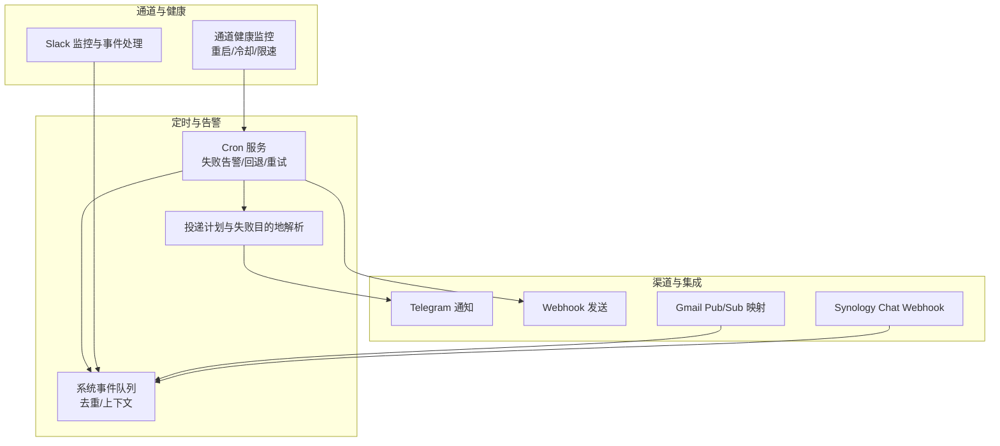
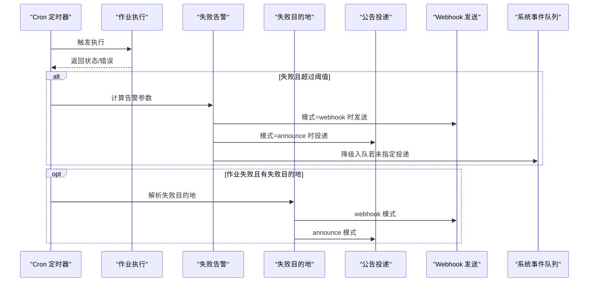
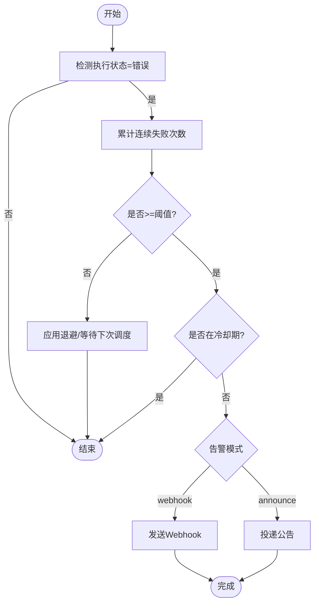
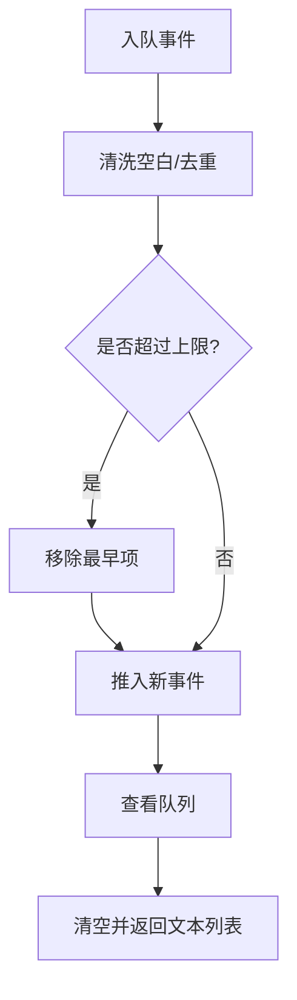
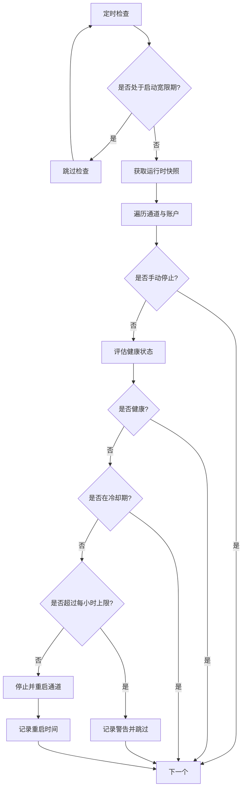
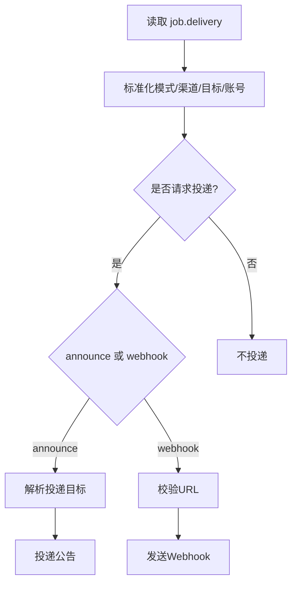
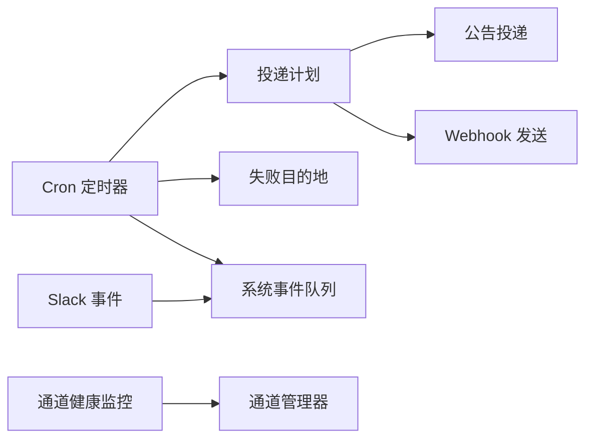

# 告警和通知

<cite>
**本文引用的文件**
- [src/infra/system-events.ts](file://src/infra/system-events.ts)
- [src/cron/service/timer.ts](file://src/cron/service/timer.ts)
- [src/gateway/server-cron.ts](file://src/gateway/server-cron.ts)
- [src/cron/delivery.ts](file://src/cron/delivery.ts)
- [src/gateway/channel-health-monitor.ts](file://src/gateway/channel-health-monitor.ts)
- [src/cli/cron-cli/register.cron-edit.ts](file://src/cli/cron-cli/register.cron-edit.ts)
- [src/gateway/server.cron.test.ts](file://src/gateway/server.cron.test.ts)
- [src/cron/service.jobs.test.ts](file://src/cron/service.jobs.test.ts)
- [src/infra/heartbeat-events-filter.test.ts](file://src/infra/heartbeat-events-filter.test.ts)
- [apps/macos/Sources/OpenClaw/HealthStore.swift](file://apps/macos/Sources/OpenClaw/HealthStore.swift)
- [extensions/synology-chat/src/channel.integration.test.ts](file://extensions/synology-chat/src/channel.integration.test.ts)
- [src/slack/monitor/provider.ts](file://src/slack/monitor/provider.ts)
- [src/slack/monitor/events/reactions.ts](file://src/slack/monitor/events/reactions.ts)
- [src/slack/monitor/events/channels.test.ts](file://src/slack/monitor/events/channels.test.ts)
- [extensions/nostr/src/nostr-bus.integration.test.ts](file://extensions/nostr/src/nostr-bus.integration.test.ts)
- [docs/zh-CN/automation/gmail-pubsub.md](file://docs/zh-CN/automation/gmail-pubsub.md)
</cite>

## 目录
1. [简介](#简介)
2. [项目结构](#项目结构)
3. [核心组件](#核心组件)
4. [架构总览](#架构总览)
5. [详细组件分析](#详细组件分析)
6. [依赖关系分析](#依赖关系分析)
7. [性能考量](#性能考量)
8. [故障排查指南](#故障排查指南)
9. [结论](#结论)
10. [附录](#附录)

## 简介
本文件面向 OpenClaw 的告警与通知系统，系统性梳理告警规则配置与触发机制、通知渠道配置、告警模板与消息格式、去重与抑制机制、与第三方平台的集成方式，以及策略优化与最佳实践。内容基于仓库中的实际实现进行归纳总结，帮助开发者与运维人员快速理解与落地。

## 项目结构
告警与通知相关能力主要分布在以下模块：
- 定时任务与失败告警：cron 服务、失败告警发送、运行日志与事件广播
- 系统事件队列：用于承载“应提示用户”的系统事件，支持去重与上下文键
- 渠道健康监控：通道健康评估与自动重启，避免半死连接导致的静默失败
- CLI 编辑与策略：失败告警开关、阈值、冷却时间、渠道与目标等
- 通知渠道：Telegram、Slack、Webhook、系统事件等
- 第三方集成：Gmail Pub/Sub、Synology Chat 等

图示来源
- [src/cron/service/timer.ts:206-288](file://src/cron/service/timer.ts#L206-L288)
- [src/cron/delivery.ts:50-102](file://src/cron/delivery.ts#L50-L102)
- [src/infra/system-events.ts:51-83](file://src/infra/system-events.ts#L51-L83)
- [src/gateway/channel-health-monitor.ts:76-201](file://src/gateway/channel-health-monitor.ts#L76-L201)
- [src/gateway/server-cron.ts:298-356](file://src/gateway/server-cron.ts#L298-L356)

章节来源
- [src/cron/service/timer.ts:206-288](file://src/cron/service/timer.ts#L206-L288)
- [src/cron/delivery.ts:50-102](file://src/cron/delivery.ts#L50-L102)
- [src/infra/system-events.ts:51-83](file://src/infra/system-events.ts#L51-L83)
- [src/gateway/channel-health-monitor.ts:76-201](file://src/gateway/channel-health-monitor.ts#L76-L201)
- [src/gateway/server-cron.ts:298-356](file://src/gateway/server-cron.ts#L298-L356)

## 核心组件
- 失败告警与回退
  - 基于定时任务执行结果，当连续失败达到阈值后触发告警；支持“公告”或“Webhook”两种模式；支持失败目的地（failureDestination）用于兜底通知。
  - 回退策略采用指数退避，避免重试风暴；一次性任务在永久错误或耗尽重试后禁用。
- 系统事件队列
  - 以会话为粒度的内存队列，自动去重相邻重复事件，支持上下文键区分不同场景。
- 通道健康监控
  - 周期性评估通道健康状态，对“半死连接”（长时间无事件）进行重启；带冷却窗口与每小时重启次数限制。
- 投递计划与失败目的地
  - 解析 job 的 delivery 配置，决定是否投递、投递渠道与目标；失败目的地与主投递解耦，避免同源重复告警。
- CLI 策略编辑
  - 提供失败告警开关、阈值、冷却时间、渠道与目标等参数，支持按作业覆盖全局配置。

章节来源
- [src/cron/service/timer.ts:206-288](file://src/cron/service/timer.ts#L206-L288)
- [src/cron/delivery.ts:50-102](file://src/cron/delivery.ts#L50-L102)
- [src/infra/system-events.ts:51-83](file://src/infra/system-events.ts#L51-L83)
- [src/gateway/channel-health-monitor.ts:76-201](file://src/gateway/channel-health-monitor.ts#L76-L201)
- [src/cli/cron-cli/register.cron-edit.ts:279-302](file://src/cli/cron-cli/register.cron-edit.ts#L279-L302)

## 架构总览
下图展示从定时任务执行到告警与通知的关键路径，包括失败告警、失败目的地、Webhook 发送与系统事件队列。

图示来源
- [src/cron/service/timer.ts:206-288](file://src/cron/service/timer.ts#L206-L288)
- [src/gateway/server-cron.ts:395-469](file://src/gateway/server-cron.ts#L395-L469)
- [src/cron/delivery.ts:129-209](file://src/cron/delivery.ts#L129-L209)

章节来源
- [src/cron/service/timer.ts:206-288](file://src/cron/service/timer.ts#L206-L288)
- [src/gateway/server-cron.ts:395-469](file://src/gateway/server-cron.ts#L395-L469)
- [src/cron/delivery.ts:129-209](file://src/cron/delivery.ts#L129-L209)

## 详细组件分析

### 组件一：失败告警与回退（Cron 定时器）
- 触发条件
  - 连续失败次数达到阈值（默认≥2），且不在冷却期内。
  - 支持按作业覆盖全局失败告警配置（开关、阈值、冷却、渠道、目标、账号）。
- 告警模式
  - announce：通过已配置的渠道与目标投递。
  - webhook：向指定 URL 发送 JSON 数据。
- 回退与重试
  - 指数退避延迟，避免重试风暴；一次性任务在永久错误或耗尽重试后禁用。
- 最佳努力与失败目的地
  - 若作业为最佳努力（bestEffort），则不发送失败告警；失败目的地独立于主投递，避免同源重复告警。

图示来源
- [src/cron/service/timer.ts:206-288](file://src/cron/service/timer.ts#L206-L288)
- [src/cron/service/timer.ts:340-367](file://src/cron/service/timer.ts#L340-L367)
- [src/cron/service/timer.ts:416-444](file://src/cron/service/timer.ts#L416-L444)

章节来源
- [src/cron/service/timer.ts:206-288](file://src/cron/service/timer.ts#L206-L288)
- [src/cron/service/timer.ts:340-367](file://src/cron/service/timer.ts#L340-L367)
- [src/cron/service/timer.ts:416-444](file://src/cron/service/timer.ts#L416-L444)

### 组件二：系统事件队列与去重
- 特性
  - 以会话为单位的内存队列，最大保留条目数有限；自动去重相邻重复事件；支持上下文键区分场景。
  - 事件入队时清洗空白字符，出队时清空并返回文本列表。
- 用途
  - 作为“无人可投递”时的兜底，将告警文本注入到下一次提示中，确保用户可见。

图示来源
- [src/infra/system-events.ts:51-83](file://src/infra/system-events.ts#L51-L83)
- [src/infra/system-events.ts:85-110](file://src/infra/system-events.ts#L85-L110)

章节来源
- [src/infra/system-events.ts:51-83](file://src/infra/system-events.ts#L51-L83)
- [src/infra/system-events.ts:85-110](file://src/infra/system-events.ts#L85-L110)

### 组件三：通道健康监控与自动重启
- 目标
  - 检测通道健康状况，对“半死连接”（长时间无事件）进行重启；限制重启频率与每小时重启次数。
- 关键参数
  - 启动宽限期、连接宽限期、事件过期阈值、冷却周期、每小时最大重启次数。
- 行为
  - 评估健康状态，若不健康且未处于冷却期，则停止并重启对应通道；记录重启时间并清理旧记录。

图示来源
- [src/gateway/channel-health-monitor.ts:76-201](file://src/gateway/channel-health-monitor.ts#L76-L201)

章节来源
- [src/gateway/channel-health-monitor.ts:76-201](file://src/gateway/channel-health-monitor.ts#L76-L201)
- [apps/macos/Sources/OpenClaw/HealthStore.swift:147-163](file://apps/macos/Sources/OpenClaw/HealthStore.swift#L147-L163)

### 组件四：投递计划与失败目的地
- 投递计划
  - 解析 job 的 delivery 字段，决定模式（announce/webhook/none）、渠道、目标与账号；支持从 payload 中继承部分字段。
- 失败目的地
  - 支持在作业层覆盖全局失败目的地配置；当模式为 webhook 时必须提供 URL；与主投递目标解耦，避免重复告警。
- 公告投递
  - 解析目标、身份与会话上下文，超时控制，失败记录日志。

图示来源
- [src/cron/delivery.ts:50-102](file://src/cron/delivery.ts#L50-L102)
- [src/cron/delivery.ts:129-209](file://src/cron/delivery.ts#L129-L209)
- [src/cron/delivery.ts:241-302](file://src/cron/delivery.ts#L241-L302)

章节来源
- [src/cron/delivery.ts:50-102](file://src/cron/delivery.ts#L50-L102)
- [src/cron/delivery.ts:129-209](file://src/cron/delivery.ts#L129-L209)
- [src/cron/delivery.ts:241-302](file://src/cron/delivery.ts#L241-L302)

### 组件五：通知渠道与模板
- Telegram
  - 通过公告模式投递；支持非默认账号配置；CLI 可新增“alerts”等专用账号。
- Slack
  - 支持 socket/http 模式，需配置 bot/app token 与签名密钥（http 模式）；事件处理与系统事件集成。
- Webhook
  - 支持 announce 与 webhook 两种模式；统一构建请求头（含 Authorization 可选）；SSRF 保护与超时控制。
- 系统通知
  - 当未选择投递或无法投递时，将告警文本写入系统事件队列，由心跳流程提示用户。

章节来源
- [src/cli/cron-cli/register.cron-edit.ts:279-302](file://src/cli/cron-cli/register.cron-edit.ts#L279-L302)
- [src/slack/monitor/provider.ts:130-152](file://src/slack/monitor/provider.ts#L130-L152)
- [src/slack/monitor/events/reactions.ts:1-30](file://src/slack/monitor/events/reactions.ts#L1-L30)
- [src/slack/monitor/events/channels.test.ts:30-38](file://src/slack/monitor/events/channels.test.ts#L30-L38)
- [src/gateway/server-cron.ts:94-142](file://src/gateway/server-cron.ts#L94-L142)
- [src/infra/system-events.ts:51-83](file://src/infra/system-events.ts#L51-L83)

### 组件六：第三方集成示例
- Gmail Pub/Sub
  - 通过 hooks 预设与映射，将 Gmail 推送转换为消息并可选择投递到聊天界面；支持默认模型与思考级别配置。
- Synology Chat
  - 注册 webhook 路由并进行鉴权校验，拒绝未授权请求；测试覆盖了路由注册与鉴权失败场景。

章节来源
- [docs/zh-CN/automation/gmail-pubsub.md:29-83](file://docs/zh-CN/automation/gmail-pubsub.md#L29-L83)
- [extensions/synology-chat/src/channel.integration.test.ts:79-108](file://extensions/synology-chat/src/channel.integration.test.ts#L79-L108)

## 依赖关系分析
- Cron 定时器依赖
  - 系统事件队列：作为兜底通知入口。
  - 投递计划：决定是否投递及投递方式。
  - 失败目的地：独立于主投递，避免重复告警。
- 通道健康监控
  - 依赖通道管理器的运行时快照与重启接口；受冷却与限速策略约束。
- Slack 监控
  - 事件授权与上下文解析，最终入队系统事件。

图示来源
- [src/cron/service/timer.ts:206-288](file://src/cron/service/timer.ts#L206-L288)
- [src/cron/delivery.ts:50-102](file://src/cron/delivery.ts#L50-L102)
- [src/gateway/channel-health-monitor.ts:76-201](file://src/gateway/channel-health-monitor.ts#L76-L201)
- [src/slack/monitor/events/reactions.ts:1-30](file://src/slack/monitor/events/reactions.ts#L1-L30)

章节来源
- [src/cron/service/timer.ts:206-288](file://src/cron/service/timer.ts#L206-L288)
- [src/cron/delivery.ts:50-102](file://src/cron/delivery.ts#L50-L102)
- [src/gateway/channel-health-monitor.ts:76-201](file://src/gateway/channel-health-monitor.ts#L76-L201)
- [src/slack/monitor/events/reactions.ts:1-30](file://src/slack/monitor/events/reactions.ts#L1-L30)

## 性能考量
- 退避与限流
  - 指数退避减少重试风暴；一次性任务在永久错误或耗尽重试后禁用，避免无效负载。
- 冷却与限速
  - 通道健康监控的冷却周期与每小时重启上限，防止频繁重启造成抖动。
- 超时与保护
  - Webhook 发送设置超时与 SSRF 保护；系统事件队列限制最大条目数，避免内存膨胀。
- 并发与维护
  - 定时器在执行期间保持 watchdog，避免长任务导致调度停滞；维护性重算避免错过“已过期但未执行”的任务。

章节来源
- [src/cron/service/timer.ts:114-128](file://src/cron/service/timer.ts#L114-L128)
- [src/cron/service/timer.ts:416-444](file://src/cron/service/timer.ts#L416-L444)
- [src/gateway/channel-health-monitor.ts:86-97](file://src/gateway/channel-health-monitor.ts#L86-L97)
- [src/gateway/server-cron.ts:94-142](file://src/gateway/server-cron.ts#L94-L142)
- [src/infra/system-events.ts:7-8](file://src/infra/system-events.ts#L7-L8)

## 故障排查指南
- 失败告警未触发
  - 检查是否达到阈值与冷却期；确认作业配置与全局配置的优先级；验证 announce 模式的渠道与目标是否正确。
- Webhook 发送失败
  - 校验 URL 是否为 http(s)；检查 SSRF 保护日志；确认 Authorization 头是否正确；查看超时与阻断日志。
- 失败目的地未生效
  - 确认作业层 failureDestination 的模式与目标；注意 announce 与 webhook 的 URL 语义差异；避免与主投递目标相同导致被忽略。
- 通道健康问题
  - 查看通道健康监控日志与重启记录；确认冷却期与每小时上限；检查“半死连接”现象（长时间无事件）。
- Slack 事件未入队
  - 核对事件类型与授权上下文；检查事件过滤逻辑与系统事件上下文键变化。

章节来源
- [src/cron/service/timer.ts:206-288](file://src/cron/service/timer.ts#L206-L288)
- [src/gateway/server-cron.ts:302-336](file://src/gateway/server-cron.ts#L302-L336)
- [src/cron/delivery.ts:129-209](file://src/cron/delivery.ts#L129-L209)
- [src/gateway/channel-health-monitor.ts:141-151](file://src/gateway/channel-health-monitor.ts#L141-L151)
- [src/slack/monitor/events/reactions.ts:14-30](file://src/slack/monitor/events/reactions.ts#L14-L30)

## 结论
OpenClaw 的告警与通知体系以“定时任务失败告警 + 系统事件兜底 + 通道健康监控 + 多渠道投递”为核心，具备明确的去重与抑制策略、完善的退避与限流机制，并提供 CLI 与配置层面的灵活策略编辑。通过失败目的地与 Webhook 的组合，可实现与多种第三方平台的无缝对接，满足多样化告警需求。

## 附录

### 告警规则配置要点
- 全局与作业级
  - 全局开启/关闭失败告警；作业可覆盖阈值、冷却时间、渠道、目标与账号。
- 模式与目标
  - announce：依赖已配置的渠道与目标；webhook：必须提供有效 URL。
- 最佳努力
  - 对最佳努力作业不发送失败告警，失败目的地仍可独立配置。

章节来源
- [src/cli/cron-cli/register.cron-edit.ts:279-302](file://src/cli/cron-cli/register.cron-edit.ts#L279-L302)
- [src/cron/service/timer.ts:206-244](file://src/cron/service/timer.ts#L206-L244)
- [src/cron/service/timer.ts:340-367](file://src/cron/service/timer.ts#L340-L367)

### 通知渠道配置方法
- Telegram
  - 使用 announce 模式投递；可通过 CLI 新增非默认账号（如 alerts）。
- Slack
  - 配置 bot/app token 与签名密钥（http 模式）；事件处理后可入队系统事件。
- Webhook
  - 统一构建请求头，支持 Authorization；SSRF 保护与超时控制。
- 系统通知
  - 未投递或投递失败时，将告警文本写入系统事件队列，由心跳流程提示用户。

章节来源
- [src/cli/cron-cli/register.cron-edit.ts:279-302](file://src/cli/cron-cli/register.cron-edit.ts#L279-L302)
- [src/slack/monitor/provider.ts:130-152](file://src/slack/monitor/provider.ts#L130-L152)
- [src/gateway/server-cron.ts:94-142](file://src/gateway/server-cron.ts#L94-L142)
- [src/infra/system-events.ts:51-83](file://src/infra/system-events.ts#L51-L83)

### 告警模板与消息格式
- 失败告警文本
  - 包含作业名称与最近错误摘要；长度截断以控制体积。
- Webhook 载荷
  - 包含 jobId、jobName、message 等关键字段；失败目的地附加运行时信息（状态、错误、时长等）。
- 系统事件
  - 文本化事件，支持上下文键区分场景；自动去重相邻重复事件。

章节来源
- [src/cron/service/timer.ts:258-263](file://src/cron/service/timer.ts#L258-L263)
- [src/gateway/server-cron.ts:417-427](file://src/gateway/server-cron.ts#L417-L427)
- [src/infra/system-events.ts:51-83](file://src/infra/system-events.ts#L51-L83)

### 去重与抑制机制
- 系统事件队列
  - 相邻重复事件自动去重；支持上下文键变化检测。
- 通道健康监控
  - 冷却周期与每小时重启上限，抑制高频重启。
- Slack 事件
  - 事件授权与上下文解析，避免未授权或不匹配事件入队。

章节来源
- [src/infra/system-events.ts:70-72](file://src/infra/system-events.ts#L70-L72)
- [src/gateway/channel-health-monitor.ts:141-151](file://src/gateway/channel-health-monitor.ts#L141-L151)
- [src/slack/monitor/events/reactions.ts:22-30](file://src/slack/monitor/events/reactions.ts#L22-L30)

### 与第三方平台集成示例
- Gmail Pub/Sub
  - 通过 hooks 预设与映射，将推送转换为消息并可选择投递；支持默认模型与思考级别配置。
- Synology Chat
  - 注册 webhook 路由并进行鉴权校验；拒绝未授权请求。

章节来源
- [docs/zh-CN/automation/gmail-pubsub.md:29-83](file://docs/zh-CN/automation/gmail-pubsub.md#L29-L83)
- [extensions/synology-chat/src/channel.integration.test.ts:79-108](file://extensions/synology-chat/src/channel.integration.test.ts#L79-L108)

### 测试与验证参考
- 失败告警与失败目的地
  - 测试覆盖阈值、冷却、Webhook URL 校验、最佳努力与失败目的地行为。
- 系统事件过滤
  - 测试心跳事件提示文案在不同投递策略下的变化。
- Slack 事件
  - 测试事件注册、授权与上下文解析。

章节来源
- [src/gateway/server.cron.test.ts:851-875](file://src/gateway/server.cron.test.ts#L851-L875)
- [src/cron/service.jobs.test.ts:220-260](file://src/cron/service.jobs.test.ts#L220-L260)
- [src/infra/heartbeat-events-filter.test.ts:4-21](file://src/infra/heartbeat-events-filter.test.ts#L4-L21)
- [src/slack/monitor/events/channels.test.ts:30-38](file://src/slack/monitor/events/channels.test.ts#L30-L38)