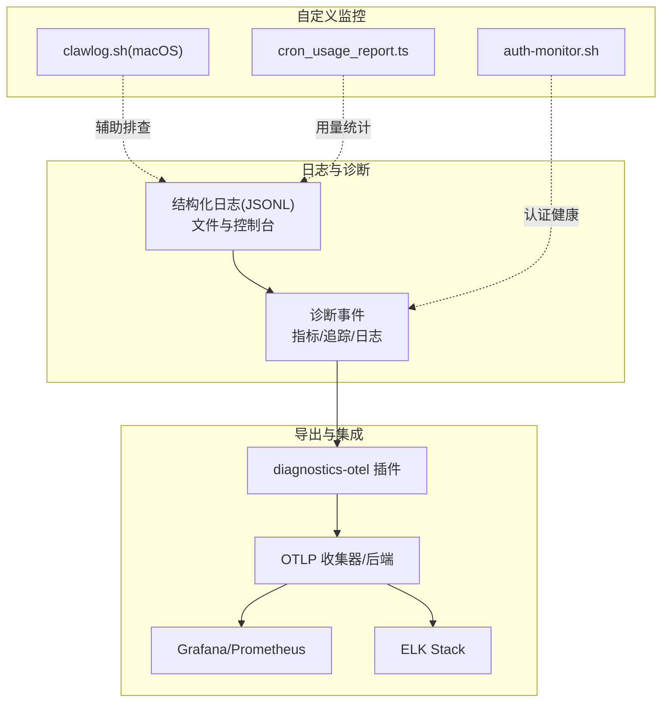
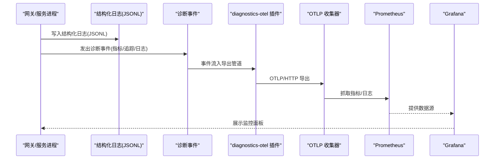
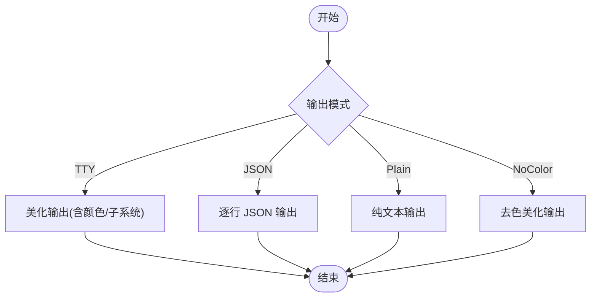
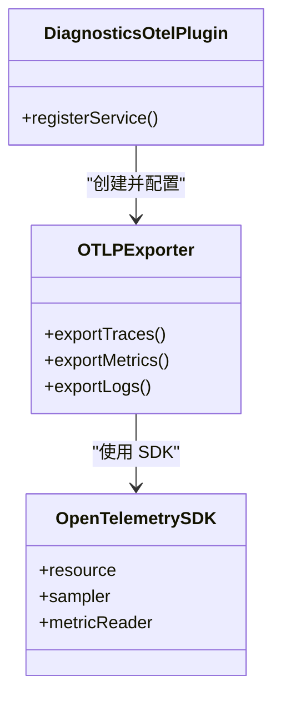
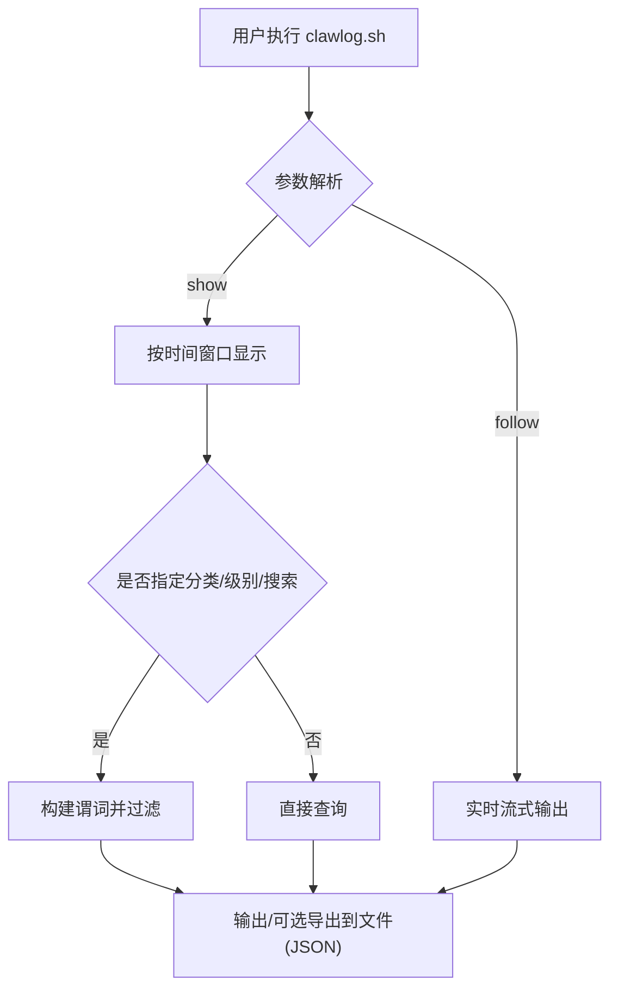
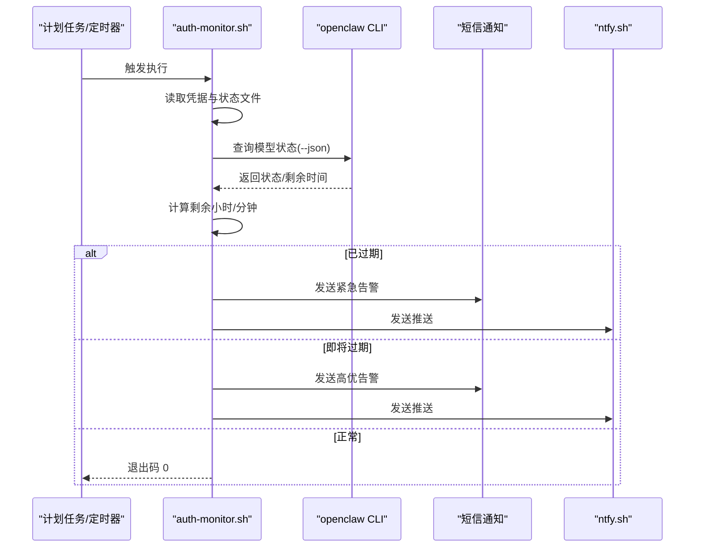
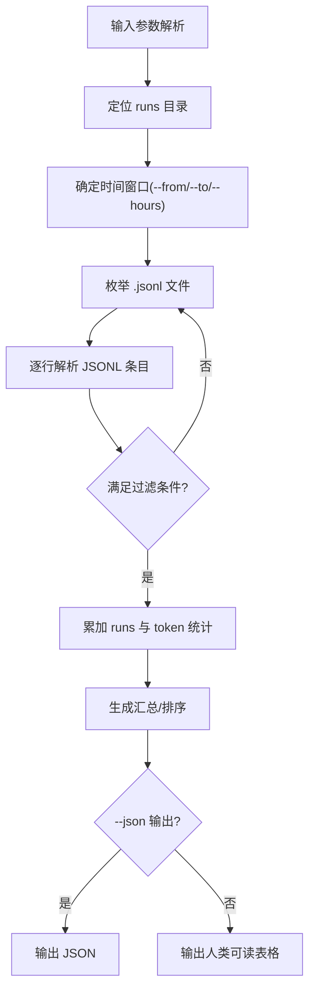
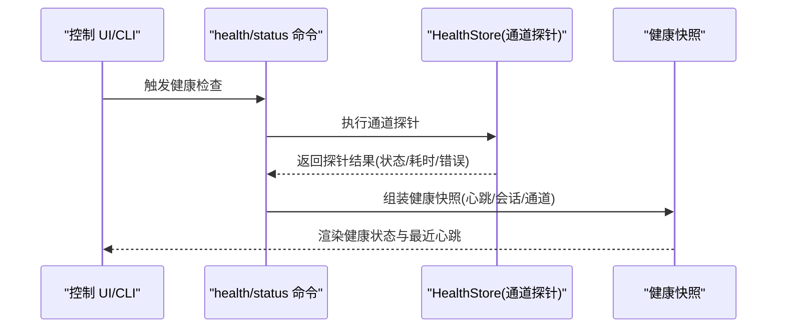
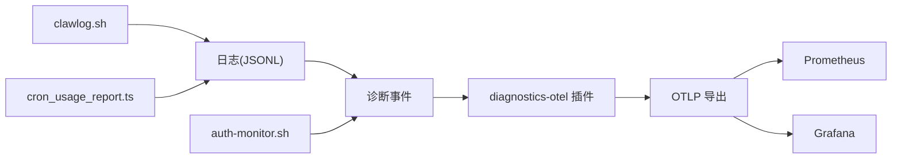

# 指标监控

<cite>
**本文引用的文件**
- [src/logging.ts](file://src/logging.ts)
- [src/logger.ts](file://src/logger.ts)
- [docs/logging.md](file://docs/logging.md)
- [docs/zh-CN/logging.md](file://docs/zh-CN/logging.md)
- [extensions/diagnostics-otel/index.ts](file://extensions/diagnostics-otel/index.ts)
- [extensions/diagnostics-otel/src/service.ts](file://extensions/diagnostics-otel/src/service.ts)
- [scripts/clawlog.sh](file://scripts/clawlog.sh)
- [scripts/auth-monitor.sh](file://scripts/auth-monitor.sh)
- [docs/automation/auth-monitoring.md](file://docs/automation/auth-monitoring.md)
- [scripts/cron_usage_report.ts](file://scripts/cron_usage_report.ts)
- [apps/macos/Sources/OpenClaw/HealthStore.swift](file://apps/macos/Sources/OpenClaw/HealthStore.swift)
- [src/commands/health.ts](file://src/commands/health.ts)
- [src/commands/status.command.ts](file://src/commands/status.command.ts)
</cite>

## 目录
1. [简介](#简介)
2. [项目结构](#项目结构)
3. [核心组件](#核心组件)
4. [架构总览](#架构总览)
5. [详细组件分析](#详细组件分析)
6. [依赖关系分析](#依赖关系分析)
7. [性能考量](#性能考量)
8. [故障排查指南](#故障排查指南)
9. [结论](#结论)
10. [附录](#附录)

## 简介
本文件面向 OpenClaw 的指标监控体系，系统性阐述日志采集与报告机制、性能与资源使用统计、错误统计与业务指标采集方式，并给出日志格式与关键字段规范、存储与查询方法、第三方监控工具（Prometheus/Grafana/ELK）集成思路，以及自定义监控脚本的编写指南与最佳实践。内容兼顾技术深度与可操作性，帮助运维与开发人员快速落地可观测性。

## 项目结构
OpenClaw 的监控能力由“日志系统 + 诊断事件 + 插件导出 + 自定义脚本”四部分组成：
- 日志系统：统一的结构化日志（JSONL 文件）与控制台输出，支持级别、样式、脱敏与尾随查看。
- 诊断事件：结构化遥测事件（指标、追踪、日志），通过 OpenTelemetry 插件导出至外部系统。
- 插件导出：diagnostics-otel 插件负责将诊断事件导出到 OTLP 收集器/后端。
- 自定义脚本：macOS 日志工具、认证过期监控、定时用量报表等辅助监控手段。

图表来源
- [docs/logging.md:142-346](file://docs/logging.md#L142-L346)
- [extensions/diagnostics-otel/src/service.ts:78-148](file://extensions/diagnostics-otel/src/service.ts#L78-L148)
- [scripts/clawlog.sh:1-322](file://scripts/clawlog.sh#L1-L322)
- [scripts/auth-monitor.sh:1-90](file://scripts/auth-monitor.sh#L1-L90)
- [scripts/cron_usage_report.ts:1-274](file://scripts/cron_usage_report.ts#L1-L274)

章节来源
- [docs/logging.md:10-14](file://docs/logging.md#L10-L14)
- [src/logging.ts:1-70](file://src/logging.ts#L1-L70)
- [src/logger.ts:1-86](file://src/logger.ts#L1-L86)

## 核心组件
- 结构化日志系统
  - 文件日志采用 JSON Lines 格式，便于日志聚合与检索；控制台输出支持 pretty/compact/json 等样式。
  - 支持日志级别、脱敏策略、TTY 自适应格式。
- 诊断事件与 OpenTelemetry
  - 提供模型使用、消息流、队列与会话等事件目录，支持指标、追踪与日志导出。
  - 通过 diagnostics-otel 插件以 OTLP/HTTP 导出，兼容任意 OTLP 接收端。
- 自定义监控脚本
  - clawlog.sh：macOS 统一日志查看与导出。
  - auth-monitor.sh：OAuth 凭据健康检查与告警。
  - cron_usage_report.ts：基于 JSONL 的定时任务用量统计报表。

章节来源
- [docs/logging.md:82-141](file://docs/logging.md#L82-L141)
- [docs/logging.md:142-346](file://docs/logging.md#L142-L346)
- [extensions/diagnostics-otel/index.ts:1-16](file://extensions/diagnostics-otel/index.ts#L1-L16)
- [extensions/diagnostics-otel/src/service.ts:78-148](file://extensions/diagnostics-otel/src/service.ts#L78-L148)
- [scripts/clawlog.sh:1-322](file://scripts/clawlog.sh#L1-L322)
- [scripts/auth-monitor.sh:1-90](file://scripts/auth-monitor.sh#L1-L90)
- [scripts/cron_usage_report.ts:1-274](file://scripts/cron_usage_report.ts#L1-L274)

## 架构总览
OpenClaw 的监控架构围绕“日志 + 诊断 + 导出 + 查询/可视化”展开。日志系统负责基础可观测性，诊断事件提供细粒度业务指标与追踪，插件导出将数据投递到外部系统，再由 Grafana/Prometheus/ELK 等进行聚合与展示。

图表来源
- [docs/logging.md:142-346](file://docs/logging.md#L142-L346)
- [extensions/diagnostics-otel/src/service.ts:78-148](file://extensions/diagnostics-otel/src/service.ts#L78-L148)

## 详细组件分析

### 日志系统与格式规范
- 日志位置与读取
  - 默认滚动文件位于临时目录，可通过配置文件覆盖路径。
  - CLI 支持实时 tail、TTY/JSON/plain/no-color 等输出模式。
- 日志格式
  - 文件日志为 JSON Lines，每行是一个结构化对象；CLI/控制 UI 解析后渲染为结构化视图。
  - 控制台输出具备 TTY 自适应、子系统前缀、级别着色与紧凑/JSON 模式。
- 配置项
  - 日志级别（文件/控制台）、控制台样式、敏感信息脱敏（仅控制台生效）。
  - 环境变量与 CLI 参数可覆盖配置，便于临时提升详细度。
- 关键字段建议
  - 时间戳、级别、子系统、消息正文、会话标识、渠道/账号、结果/错误码、耗时等。
  - 业务事件建议携带维度属性（provider/model/channel/sessionKey 等）以便聚合分析。

图表来源
- [docs/logging.md:48-62](file://docs/logging.md#L48-L62)
- [docs/logging.md:97-103](file://docs/logging.md#L97-L103)

章节来源
- [docs/logging.md:20-73](file://docs/logging.md#L20-L73)
- [docs/logging.md:82-141](file://docs/logging.md#L82-L141)
- [docs/logging.md:116-141](file://docs/logging.md#L116-L141)

### 诊断事件与指标导出
- 事件类型与指标
  - 模型使用：token 使用、成本、运行时长、上下文大小。
  - 消息流：webhook 入/出、处理时延、错误计数、消息排队/处理。
  - 队列与会话：队列深度/等待、会话状态/卡住、重试次数。
- 导出能力
  - 通过 diagnostics-otel 插件以 OTLP/HTTP 导出指标、追踪与日志。
  - 支持采样率、刷新间隔、服务名、头部认证等参数。
- 可观测性价值
  - 将业务行为转化为结构化指标，便于自动化告警与趋势分析。

图表来源
- [extensions/diagnostics-otel/index.ts:1-16](file://extensions/diagnostics-otel/index.ts#L1-L16)
- [extensions/diagnostics-otel/src/service.ts:78-148](file://extensions/diagnostics-otel/src/service.ts#L78-L148)

章节来源
- [docs/logging.md:142-346](file://docs/logging.md#L142-L346)
- [extensions/diagnostics-otel/src/service.ts:78-148](file://extensions/diagnostics-otel/src/service.ts#L78-L148)

### macOS 日志工具（clawlog.sh）
- 功能特性
  - 通过 macOS 统一日志系统筛选 OpenClaw 子系统日志，支持分类、级别、时间范围、关键词搜索、导出 JSON 等。
  - 需要配置免密 sudo 才能完整查看日志（绕过隐私遮蔽）。
- 使用场景
  - 快速定位问题、批量导出日志、配合 ELK/日志平台做集中分析。

图表来源
- [scripts/clawlog.sh:155-218](file://scripts/clawlog.sh#L155-L218)
- [scripts/clawlog.sh:240-284](file://scripts/clawlog.sh#L240-L284)

章节来源
- [scripts/clawlog.sh:1-322](file://scripts/clawlog.sh#L1-L322)

### 认证健康监控（auth-monitor.sh）
- 功能特性
  - 定时检查 Claude Code 凭据有效期，临近过期或已过期时发送通知（短信/ntfy）。
  - 带状态文件避免频繁告警，支持环境变量配置告警阈值与通知目标。
- 使用场景
  - 保障上游模型服务可用性，降低因认证失效导致的服务中断风险。

图表来源
- [scripts/auth-monitor.sh:68-89](file://scripts/auth-monitor.sh#L68-L89)
- [docs/automation/auth-monitoring.md:14-26](file://docs/automation/auth-monitoring.md#L14-L26)

章节来源
- [scripts/auth-monitor.sh:1-90](file://scripts/auth-monitor.sh#L1-L90)
- [docs/automation/auth-monitoring.md:1-45](file://docs/automation/auth-monitoring.md#L1-L45)

### 定时任务用量统计（cron_usage_report.ts）
- 功能特性
  - 解析 runs 目录下的 JSONL 日志，统计指定时间窗内的任务运行次数与 token 使用量，支持按 jobId/model 过滤。
  - 支持 JSON 输出，便于接入自动化报表或仪表盘。
- 使用场景
  - 运维侧对定时任务的资源消耗与产出进行量化评估。

图表来源
- [scripts/cron_usage_report.ts:22-64](file://scripts/cron_usage_report.ts#L22-L64)
- [scripts/cron_usage_report.ts:148-215](file://scripts/cron_usage_report.ts#L148-L215)

章节来源
- [scripts/cron_usage_report.ts:1-274](file://scripts/cron_usage_report.ts#L1-L274)

### 健康与心跳监控（macOS/CLI）
- macOS 健康状态
  - 通过 HealthStore.swift 对通道探针进行健康判定，支持超时/状态码/错误描述等信息。
- CLI 健康快照
  - 命令行提供健康快照与心跳信息，支持深探针模式获取最近心跳详情。
- 使用场景
  - 快速判断通道连通性、会话状态与系统负载，辅助故障定位。

图表来源
- [apps/macos/Sources/OpenClaw/HealthStore.swift:147-163](file://apps/macos/Sources/OpenClaw/HealthStore.swift#L147-L163)
- [src/commands/health.ts:348-375](file://src/commands/health.ts#L348-L375)
- [src/commands/status.command.ts:318-358](file://src/commands/status.command.ts#L318-L358)

章节来源
- [apps/macos/Sources/OpenClaw/HealthStore.swift:147-163](file://apps/macos/Sources/OpenClaw/HealthStore.swift#L147-L163)
- [src/commands/health.ts:348-375](file://src/commands/health.ts#L348-L375)
- [src/commands/status.command.ts:318-358](file://src/commands/status.command.ts#L318-L358)

## 依赖关系分析
- 日志系统与诊断事件耦合度低，日志作为“数据源”，诊断事件作为“指标/追踪载体”，二者可独立启用。
- diagnostics-otel 插件依赖 OpenTelemetry SDK 与 OTLP 导出器，需正确配置端点、协议与采样策略。
- 自定义脚本与日志系统形成互补：macOS 日志工具用于系统级排查，认证监控与用量报表用于业务侧健康与成本分析。

图表来源
- [docs/logging.md:142-346](file://docs/logging.md#L142-L346)
- [extensions/diagnostics-otel/src/service.ts:78-148](file://extensions/diagnostics-otel/src/service.ts#L78-L148)
- [scripts/clawlog.sh:1-322](file://scripts/clawlog.sh#L1-L322)
- [scripts/auth-monitor.sh:1-90](file://scripts/auth-monitor.sh#L1-L90)
- [scripts/cron_usage_report.ts:1-274](file://scripts/cron_usage_report.ts#L1-L274)

章节来源
- [src/logging.ts:1-70](file://src/logging.ts#L1-L70)
- [src/logger.ts:1-86](file://src/logger.ts#L1-L86)
- [extensions/diagnostics-otel/index.ts:1-16](file://extensions/diagnostics-otel/index.ts#L1-L16)

## 性能考量
- 日志级别与脱敏
  - 生产环境建议将文件日志级别设为 info/warn，避免 debug/trace 的高开销。
  - 控制台脱敏不影响文件日志，避免泄露敏感信息。
- OTLP 导出
  - 合理设置采样率与刷新间隔，避免高流量场景下的网络与 CPU 压力。
  - 使用 OTLP 收集器进行本地采样/过滤后再转发到远端后端。
- 日志文件管理
  - 使用滚动文件与合理的保留策略，避免磁盘占用过高。
- 脚本执行频率
  - 认证监控与用量报表建议以较长周期执行，避免频繁 IO 与 API 调用。

## 故障排查指南
- Gateway 不可达
  - 使用 CLI doctor 检查网关状态，确认日志文件路径与权限。
- 日志为空或缺失
  - 检查日志级别、文件路径、进程权限与磁盘空间。
- macOS 日志不可见
  - 配置免密 sudo 访问 /usr/bin/log，或参考脚本内置提示进行修复。
- 认证即将过期
  - 使用 auth-monitor.sh 或 openclaw models status --check 获取状态，必要时触发 re-auth 流程。
- 用量统计异常
  - 确认 runs 目录与 JSONL 文件完整性，检查时间窗口与过滤条件。

章节来源
- [docs/logging.md:347-353](file://docs/logging.md#L347-L353)
- [scripts/clawlog.sh:19-33](file://scripts/clawlog.sh#L19-L33)
- [docs/automation/auth-monitoring.md:14-26](file://docs/automation/auth-monitoring.md#L14-L26)

## 结论
OpenClaw 的监控体系以结构化日志为基础，辅以诊断事件与插件导出，形成从“可观测到可度量再到可运营”的闭环。结合 macOS 日志工具、认证健康监控与定时任务用量统计，能够满足多场景的监控需求。建议在生产环境中合理配置日志级别与 OTLP 导出参数，配合 Grafana/Prometheus/ELK 实现统一可视化与告警。

## 附录

### 日志格式与关键字段建议
- 建议字段
  - 时间戳、级别、子系统、消息正文、会话标识、渠道/账号、结果/错误码、耗时、维度属性（provider/model/channel/sessionKey 等）。
- 输出模式
  - TTY：美化输出，含颜色与子系统前缀。
  - JSON：逐行 JSON，便于日志平台解析。
  - Plain/NoColor：纯文本或去色美化，适合长会话与自动化处理。

章节来源
- [docs/logging.md:82-141](file://docs/logging.md#L82-L141)
- [docs/logging.md:48-62](file://docs/logging.md#L48-L62)

### 存储与查询方法
- 日志存储
  - JSON Lines 文件，支持滚动与自定义路径。
- 查询与聚合
  - CLI 实时 tail 与 JSON 输出；macOS clawlog.sh 支持分类/级别/时间/关键词/导出。
  - ELK/日志平台导入 JSONL，建立索引与仪表盘。
- 指标导出
  - 通过 diagnostics-otel 插件以 OTLP/HTTP 导出至 Prometheus/Grafana。

章节来源
- [docs/logging.md:20-73](file://docs/logging.md#L20-L73)
- [scripts/clawlog.sh:1-322](file://scripts/clawlog.sh#L1-L322)
- [docs/logging.md:224-267](file://docs/logging.md#L224-L267)

### 第三方监控工具集成示例
- Prometheus
  - 通过 OTLP 收集器抓取指标，配置服务名与采样率，确保 flushIntervalMs 合理。
- Grafana
  - 添加 Prometheus 数据源，基于 openclaw.* 指标构建面板（webhook/metrics/queue/session/run）。
- ELK Stack
  - 使用 Filebeat/Logstash 收集 JSONL，建立索引模板，构建日志仪表盘与告警规则。

章节来源
- [docs/logging.md:224-267](file://docs/logging.md#L224-L267)
- [extensions/diagnostics-otel/src/service.ts:127-148](file://extensions/diagnostics-otel/src/service.ts#L127-L148)

### 自定义监控脚本编写指南与最佳实践
- 脚本设计原则
  - 明确输入参数与默认值，支持 JSON 输出便于自动化。
  - 合理设置时间窗口与过滤条件，避免全量扫描。
  - 健壮性：处理文件不存在、解析失败、网络异常等情况。
- 最佳实践
  - 使用环境变量配置阈值与通知目标，避免硬编码。
  - 引入状态文件避免重复告警，设定最小告警间隔。
  - 与 CLI/日志系统联动，优先使用 openclaw 内置命令作为数据源。

章节来源
- [scripts/auth-monitor.sh:1-90](file://scripts/auth-monitor.sh#L1-L90)
- [scripts/cron_usage_report.ts:1-274](file://scripts/cron_usage_report.ts#L1-L274)
- [docs/automation/auth-monitoring.md:28-45](file://docs/automation/auth-monitoring.md#L28-L45)