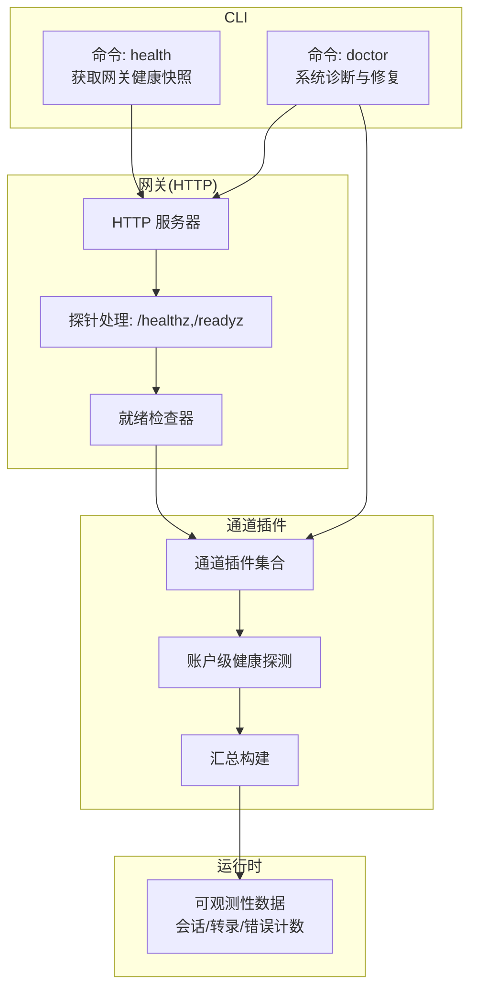
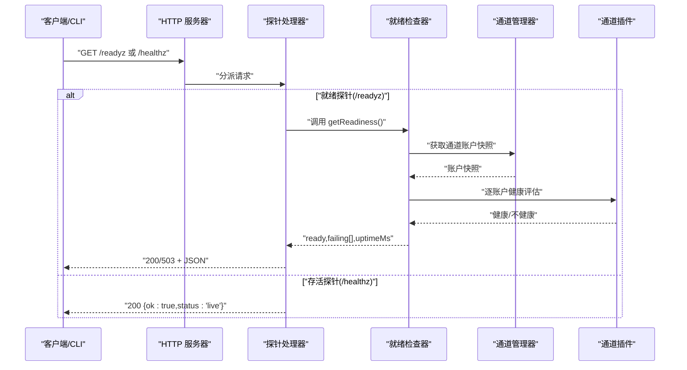
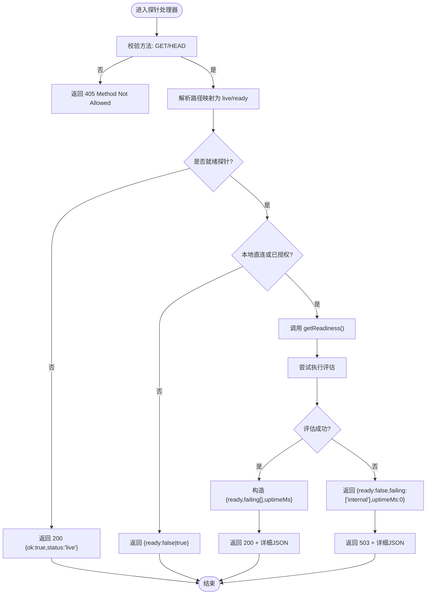
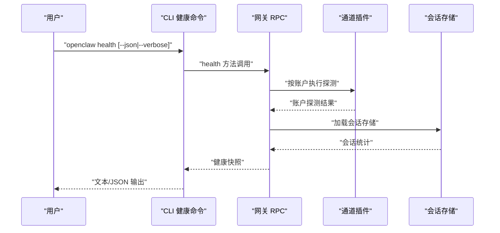
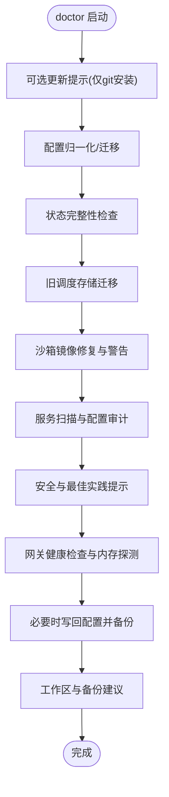
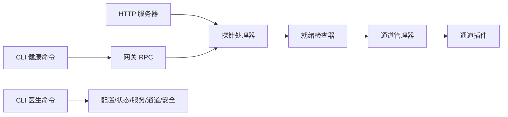

# 监控和健康检查

<cite>
**本文引用的文件**
- [src/gateway/server-http.ts](file://src/gateway/server-http.ts)
- [src/gateway/server/readiness.ts](file://src/gateway/server/readiness.ts)
- [src/gateway/server-http.probe.test.ts](file://src/gateway/server-http.probe.test.ts)
- [src/commands/health.ts](file://src/commands/health.ts)
- [docs/cli/health.md](file://docs/cli/health.md)
- [docs/gateway/health.md](file://docs/gateway/health.md)
- [src/commands/doctor.ts](file://src/commands/doctor.ts)
- [docs/cli/doctor.md](file://docs/cli/doctor.md)
- [docs/gateway/doctor.md](file://docs/gateway/doctor.md)
- [src/auto-reply/reply/commands-acp/diagnostics.ts](file://src/auto-reply/reply/commands-acp/diagnostics.ts)
</cite>

## 目录
1. [简介](#简介)
2. [项目结构](#项目结构)
3. [核心组件](#核心组件)
4. [架构总览](#架构总览)
5. [详细组件分析](#详细组件分析)
6. [依赖关系分析](#依赖关系分析)
7. [性能考量](#性能考量)
8. [故障排查指南](#故障排查指南)
9. [结论](#结论)
10. [附录](#附录)

## 简介
本文件面向 OpenClaw 的监控与健康检查体系，系统性阐述以下内容：
- 健康检查端点（/healthz、/readyz）的实现原理、响应状态码与检查逻辑
- 医生命令（doctor）的功能与使用方法，覆盖系统诊断、配置验证与问题定位
- 监控指标的采集与报告机制（性能指标、资源使用、错误统计）
- 告警配置与通知系统的设置指南
- 第三方监控工具集成方案（Prometheus、Grafana、自定义监控脚本）
- 故障检测与自动恢复的配置示例

## 项目结构
OpenClaw 的健康检查与监控能力由“网关 HTTP 服务器 + CLI 命令 + 通道插件健康评估 + 运行时可观测性”共同构成。核心路径如下：
- 网关 HTTP 服务器：提供 /healthz、/readyz 等探针端点
- 就地健康快照 CLI：通过 RPC 调用网关获取健康快照
- 医生命令：对配置、状态、服务、通道进行诊断与修复
- 通道插件：提供各通道的账户级健康探测与摘要构建
- 可观测性：运行时会话、转录、错误计数等

图表来源
- [src/gateway/server-http.ts:184-236](file://src/gateway/server-http.ts#L184-L236)
- [src/gateway/server/readiness.ts:34-81](file://src/gateway/server/readiness.ts#L34-L81)
- [src/commands/health.ts:348-523](file://src/commands/health.ts#L348-L523)
- [src/commands/doctor.ts:73-370](file://src/commands/doctor.ts#L73-L370)

章节来源
- [src/gateway/server-http.ts:184-236](file://src/gateway/server-http.ts#L184-L236)
- [src/gateway/server/readiness.ts:34-81](file://src/gateway/server/readiness.ts#L34-L81)
- [src/commands/health.ts:348-523](file://src/commands/health.ts#L348-L523)
- [src/commands/doctor.ts:73-370](file://src/commands/doctor.ts#L73-L370)

## 核心组件
- 探针端点处理器：统一处理 /healthz、/readyz 请求，按请求路径区分“存活探针”与“就绪探针”，并根据认证与来源决定是否返回详细信息
- 就绪检查器：聚合通道账户健康评估结果，缓存计算结果，过滤可忽略失败项，输出 ready/failing/uptimeMs
- CLI 健康快照：通过 RPC 调用网关，拉取完整健康快照；支持 --verbose 触发通道账户探测
- CLI 医生：对配置、状态、服务、通道进行系统化诊断与修复，支持非交互模式与修复流程
- 通道健康评估：基于通道账户快照与策略，判定健康状态并决定是否计入就绪判断

章节来源
- [src/gateway/server-http.ts:88-93](file://src/gateway/server-http.ts#L88-L93)
- [src/gateway/server-http.ts:184-236](file://src/gateway/server-http.ts#L184-L236)
- [src/gateway/server/readiness.ts:34-81](file://src/gateway/server/readiness.ts#L34-L81)
- [src/commands/health.ts:348-523](file://src/commands/health.ts#L348-L523)
- [src/commands/doctor.ts:73-370](file://src/commands/doctor.ts#L73-L370)

## 架构总览
下图展示从客户端到网关、再到通道插件与就绪检查器的数据流与控制流。

图表来源
- [src/gateway/server-http.ts:184-236](file://src/gateway/server-http.ts#L184-L236)
- [src/gateway/server/readiness.ts:34-81](file://src/gateway/server/readiness.ts#L34-L81)

章节来源
- [src/gateway/server-http.ts:184-236](file://src/gateway/server-http.ts#L184-L236)
- [src/gateway/server/readiness.ts:34-81](file://src/gateway/server/readiness.ts#L34-L81)

## 详细组件分析

### 健康检查端点（/healthz 与 /readyz）
- 路径映射：/healthz 与 /health 映射为“存活状态”，/ready 与 /readyz 映射为“就绪状态”
- 方法限制：仅允许 GET/HEAD，其他方法返回 405
- 认证与来源控制：
  - 对本地直连或具备授权的请求，返回详细就绪信息（ready、failing、uptimeMs）
  - 对远程未授权请求，仅返回简化字段（ready）
- 就绪检查：
  - 调用就绪检查器，聚合通道账户健康评估
  - 缓存最近 1 秒内的结果，避免频繁重算
  - 忽略某些可忽略失败（如未托管、套接字陈旧、重启待处理等）
- 错误处理：
  - 就绪检查抛出异常时，返回 503，且在详细模式包含 failing 内部错误标记

图表来源
- [src/gateway/server-http.ts:184-236](file://src/gateway/server-http.ts#L184-L236)
- [src/gateway/server/readiness.ts:34-81](file://src/gateway/server/readiness.ts#L34-L81)

章节来源
- [src/gateway/server-http.ts:88-93](file://src/gateway/server-http.ts#L88-L93)
- [src/gateway/server-http.ts:184-236](file://src/gateway/server-http.ts#L184-L236)
- [src/gateway/server/readiness.ts:34-81](file://src/gateway/server/readiness.ts#L34-L81)

### CLI 健康快照（openclaw health）
- 功能概述：通过 RPC 调用网关，获取完整健康快照；支持 --json 输出 JSON；--verbose 触发通道账户探测
- 数据来源：
  - 通道账户探测：对每个账户调用插件的账户探测接口，记录耗时与错误
  - 会话存储：加载会话存储，统计条目数量与最近活动
  - 心跳摘要：按代理维度汇总心跳周期与状态
- 输出格式：
  - 文本模式：按通道与账户生成易读行，包含链接状态、探测结果、会话统计、心跳间隔等
  - JSON 模式：输出完整快照对象（包含时间戳、耗时、通道清单、代理会话等）

图表来源
- [src/commands/health.ts:348-523](file://src/commands/health.ts#L348-L523)
- [docs/cli/health.md:8-22](file://docs/cli/health.md#L8-L22)
- [docs/gateway/health.md:8-36](file://docs/gateway/health.md#L8-L36)

章节来源
- [src/commands/health.ts:348-523](file://src/commands/health.ts#L348-L523)
- [docs/cli/health.md:8-22](file://docs/cli/health.md#L8-L22)
- [docs/gateway/health.md:8-36](file://docs/gateway/health.md#L8-L36)

### 医生命令（openclaw doctor）
- 功能概述：系统化诊断与修复，涵盖配置迁移、状态完整性、通道健康、服务安装、安全与性能提示等
- 关键流程：
  - 配置归一化与迁移：清理遗留键值、迁移旧布局、规范化调度任务
  - 状态完整性检查：目录存在性、权限、云同步路径、磁盘类型警告
  - 通道健康与服务：探测网关健康、通道状态、守护进程与端口冲突
  - 安全与最佳实践：令牌/密码模式冲突、系统服务配置审计、Linux 挂起策略
  - 交互与非交互：支持 --yes/--repair/--non-interactive 等模式
- 输出与写入：根据变更需求写回配置，生成备份，打印建议与提示

图表来源
- [src/commands/doctor.ts:73-370](file://src/commands/doctor.ts#L73-L370)
- [docs/cli/doctor.md:9-46](file://docs/cli/doctor.md#L9-L46)
- [docs/gateway/doctor.md:14-331](file://docs/gateway/doctor.md#L14-L331)

章节来源
- [src/commands/doctor.ts:73-370](file://src/commands/doctor.ts#L73-L370)
- [docs/cli/doctor.md:9-46](file://docs/cli/doctor.md#L9-L46)
- [docs/gateway/doctor.md:14-331](file://docs/gateway/doctor.md#L14-L331)

### 监控指标与可观测性
- 性能指标
  - 探针延迟：/readyz 详细模式包含 uptimeMs；CLI 探测阶段记录每账户耗时
  - 心跳周期：按代理维度输出心跳间隔
  - 会话统计：会话存储路径、条目总数与最近活动
- 资源使用
  - 内存搜索健康：在健康检查后探测网关内存状态，辅助定位资源瓶颈
  - 系统服务与守护：端口占用、服务状态、Linux 挂起策略
- 错误统计
  - 通道失败列表：就绪检查器将不健康通道加入 failing 列表
  - ACP 运行时错误统计：活跃回合、队列深度、平均/最大回合延迟、错误码计数
- 报告机制
  - CLI 健康快照：--json 输出完整结构；文本模式按通道/账户汇总
  - 医生输出：按模块分类的提示、警告与修复建议

章节来源
- [src/gateway/server/readiness.ts:34-81](file://src/gateway/server/readiness.ts#L34-L81)
- [src/commands/health.ts:348-523](file://src/commands/health.ts#L348-L523)
- [src/auto-reply/reply/commands-acp/diagnostics.ts:30-55](file://src/auto-reply/reply/commands-acp/diagnostics.ts#L30-L55)

## 依赖关系分析
- HTTP 服务器依赖就绪检查器；就绪检查器依赖通道管理器与通道健康策略
- CLI 健康命令依赖网关 RPC；网关 RPC 依赖通道插件的账户探测与会话存储
- 医生命令横跨配置、状态、服务、通道、安全等多个子系统

图表来源
- [src/gateway/server-http.ts:184-236](file://src/gateway/server-http.ts#L184-L236)
- [src/gateway/server/readiness.ts:34-81](file://src/gateway/server/readiness.ts#L34-L81)
- [src/commands/health.ts:348-523](file://src/commands/health.ts#L348-L523)
- [src/commands/doctor.ts:73-370](file://src/commands/doctor.ts#L73-L370)

章节来源
- [src/gateway/server-http.ts:184-236](file://src/gateway/server-http.ts#L184-L236)
- [src/gateway/server/readiness.ts:34-81](file://src/gateway/server/readiness.ts#L34-L81)
- [src/commands/health.ts:348-523](file://src/commands/health.ts#L348-L523)
- [src/commands/doctor.ts:73-370](file://src/commands/doctor.ts#L73-L370)

## 性能考量
- 就绪检查缓存：默认 TTL 1 秒，降低频繁评估开销
- 探针方法限制：仅 GET/HEAD，减少不必要的处理
- CLI 探测超时：默认 10 秒，可通过参数调整
- 通道探测范围：按绑定与首选账户聚合，避免对所有账户无差别探测

章节来源
- [src/gateway/server/readiness.ts:19-41](file://src/gateway/server/readiness.ts#L19-L41)
- [src/gateway/server-http.ts:198-205](file://src/gateway/server-http.ts#L198-L205)
- [src/commands/health.ts:74-76](file://src/commands/health.ts#L74-L76)

## 故障排查指南
- 使用 CLI 健康快照
  - 基本检查：openclaw health
  - 详细检查：openclaw health --verbose
  - JSON 输出：openclaw health --json
  - 参考文档：CLI 健康与网关健康指南
- 使用医生命令
  - 基本检查：openclaw doctor
  - 自动修复：openclaw doctor --repair
  - 非交互：openclaw doctor --yes / --non-interactive
  - 深度扫描：openclaw doctor --deep
- 常见问题定位
  - 网关不可达：确认服务运行、端口占用与守护进程状态
  - 通道异常：查看 failing 列表、重新登录、检查允许列表与群组规则
  - 权限与路径：状态目录权限、云同步路径、Linux SD/eMMC 提示
  - 安全配置：令牌/密码模式冲突、开放 DM 策略

章节来源
- [docs/cli/health.md:8-22](file://docs/cli/health.md#L8-L22)
- [docs/gateway/health.md:8-36](file://docs/gateway/health.md#L8-L36)
- [docs/cli/doctor.md:9-46](file://docs/cli/doctor.md#L9-L46)
- [docs/gateway/doctor.md:14-331](file://docs/gateway/doctor.md#L14-L331)

## 结论
OpenClaw 的监控与健康检查体系以“就绪检查器 + 探针端点 + CLI 健康快照 + 医生命令”为核心，既满足容器编排与运维自动化的需求，也提供强大的本地诊断与修复能力。通过合理的超时、缓存与最小暴露面设计，系统在可用性与可观测性之间取得平衡。结合第三方监控工具与告警策略，可进一步完善生产环境的稳定性保障。

## 附录

### 告警配置与通知设置指南
- 基于探针端点的告警
  - /readyz：当返回 503 且持续超过阈值时触发“就绪失败”告警
  - /healthz：当返回非 200 时触发“存活失败”告警
- 基于 CLI 健康快照的告警
  - 失败通道计数超过阈值时触发“通道异常”告警
  - 会话增长停滞或错误码计数上升时触发“业务异常”告警
- 通知渠道
  - 邮件、IM、Webhook、Pager 等，结合现有通道插件与钩子系统

[本节为通用指导，无需特定文件引用]

### 第三方监控工具集成
- Prometheus
  - 导出就绪检查器的 ready/failing/uptimeMs 指标
  - 导出 CLI 健康快照中的会话计数、错误码计数等
- Grafana
  - 展示就绪率、通道失败趋势、会话增长与错误分布
  - 设置仪表板面板：存活探针成功率、就绪探针延迟、通道健康热力图
- 自定义监控脚本
  - 定期调用 openclaw health --json 并解析输出
  - 将关键指标写入日志或时序数据库，配合告警平台

[本节为通用指导，无需特定文件引用]

### 故障检测与自动恢复示例
- 自动重启
  - 当 doctor 发现网关未运行或端口冲突时，提示并可引导修复
- 通道重连
  - 当通道处于“未运行/重启待处理”窗口时，就绪检查器忽略该失败，等待重建
- 配置修复
  - 令牌/密码模式冲突、遗留键值、沙箱镜像缺失等，通过 doctor 自动修复或提示

章节来源
- [src/gateway/server/readiness.ts:21-32](file://src/gateway/server/readiness.ts#L21-L32)
- [src/commands/doctor.ts:73-370](file://src/commands/doctor.ts#L73-L370)