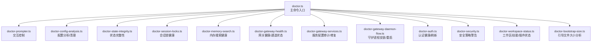
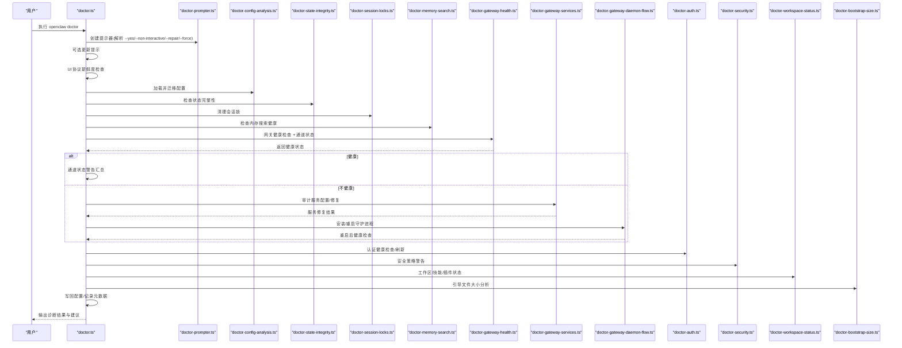
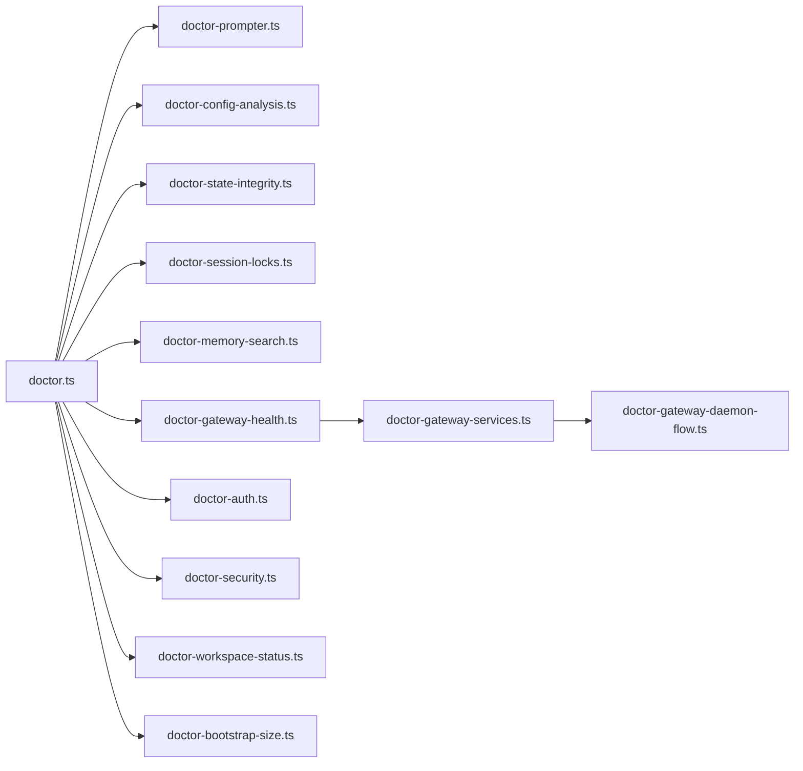

# 诊断工具

<cite>
**本文引用的文件**
- [doctor.ts](file://src/commands/doctor.ts)
- [doctor-auth.ts](file://src/commands/doctor-auth.ts)
- [doctor-config-analysis.ts](file://src/commands/doctor-config-analysis.ts)
- [doctor-bootstrap-size.ts](file://src/commands/doctor-bootstrap-size.ts)
- [doctor-prompter.ts](file://src/commands/doctor-prompter.ts)
- [doctor-state-integrity.ts](file://src/commands/doctor-state-integrity.ts)
- [doctor-gateway-health.ts](file://src/commands/doctor-gateway-health.ts)
- [doctor-gateway-services.ts](file://src/commands/doctor-gateway-services.ts)
- [doctor-gateway-daemon-flow.ts](file://src/commands/doctor-gateway-daemon-flow.ts)
- [doctor-memory-search.ts](file://src/commands/doctor-memory-search.ts)
- [doctor-session-locks.ts](file://src/commands/doctor-session-locks.ts)
- [doctor-workspace-status.ts](file://src/commands/doctor-workspace-status.ts)
- [doctor-security.ts](file://src/commands/doctor-security.ts)
- [diagnostic-flags.ts](file://src/infra/diagnostic-flags.ts)
- [diagnostic.ts](file://src/logging/diagnostic.ts)
- [doctor.md（CLI 文档）](file://docs/cli/doctor.md)
- [doctor.md（网关文档）](file://docs/gateway/doctor.md)
- [flags.md（诊断标志）](file://docs/diagnostics/flags.md)
</cite>

## 目录
1. [简介](#简介)
2. [项目结构](#项目结构)
3. [核心组件](#核心组件)
4. [架构总览](#架构总览)
5. [详细组件分析](#详细组件分析)
6. [依赖关系分析](#依赖关系分析)
7. [性能考量](#性能考量)
8. [故障排除指南](#故障排除指南)
9. [结论](#结论)
10. [附录](#附录)

## 简介
OpenClaw 的诊断工具（doctor 命令）是一个综合性的健康检查与修复工具，用于系统化地诊断网关与通道的运行状态、配置合法性、依赖完整性、安全策略与权限设置，并在交互或非交互模式下提供可选的自动修复建议。它覆盖从配置迁移、状态完整性、模型认证健康、内存搜索可用性、网关服务与端口、到安全策略与工作区状态等多个维度，帮助用户快速定位并解决问题。

## 项目结构
doctor 命令由一个主入口函数驱动，按阶段调用多个子诊断模块，每个模块负责特定领域的检查与修复。整体流程以“提示器（prompter）”为核心协调交互行为，结合配置加载、服务审计、网关健康探测与插件式通道检查，最终输出统一的诊断报告与修复建议。

图示来源
- [doctor.ts:73-370](file://src/commands/doctor.ts#L73-L370)
- [doctor-prompter.ts:26-114](file://src/commands/doctor-prompter.ts#L26-L114)
- [doctor-config-analysis.ts:62-93](file://src/commands/doctor-config-analysis.ts#L62-L93)
- [doctor-state-integrity.ts:470-800](file://src/commands/doctor-state-integrity.ts#L470-L800)
- [doctor-session-locks.ts:38-86](file://src/commands/doctor-session-locks.ts#L38-L86)
- [doctor-memory-search.ts:17-234](file://src/commands/doctor-memory-search.ts#L17-L234)
- [doctor-gateway-health.ts:16-93](file://src/commands/doctor-gateway-health.ts#L16-L93)
- [doctor-gateway-services.ts:188-442](file://src/commands/doctor-gateway-services.ts#L188-L442)
- [doctor-gateway-daemon-flow.ts:89-279](file://src/commands/doctor-gateway-daemon-flow.ts#L89-L279)
- [doctor-auth.ts:21-358](file://src/commands/doctor-auth.ts#L21-L358)
- [doctor-security.ts:51-234](file://src/commands/doctor-security.ts#L51-L234)
- [doctor-workspace-status.ts:8-69](file://src/commands/doctor-workspace-status.ts#L8-L69)
- [doctor-bootstrap-size.ts:33-102](file://src/commands/doctor-bootstrap-size.ts#L33-L102)

章节来源
- [doctor.ts:73-370](file://src/commands/doctor.ts#L73-L370)
- [doctor.md（CLI 文档）:1-46](file://docs/cli/doctor.md#L1-L46)
- [doctor.md（网关文档）:1-331](file://docs/gateway/doctor.md#L1-L331)

## 核心组件
- doctor 命令入口：负责初始化、打印向导头、按顺序执行各阶段诊断与修复，并在必要时写回配置与记录元数据。
- 提示器（DoctorPrompter）：根据 --yes/--non-interactive/--repair/--force 等选项决定是否交互、是否强制修复、默认值策略等。
- 配置分析与清理：识别未知键、清理过时键、迁移旧 schema、校验 include 路径约束等。
- 状态完整性：检查状态目录、会话存储、权限、云同步路径、SD/eMMC 存储风险、孤儿转录文件等。
- 认证健康：检查 OAuth 过期/将过期/缺失，尝试刷新；移除已弃用的 CLI 认证档案。
- 内存搜索健康：检查本地/远程嵌入模型可用性与 API Key 配置，结合网关探针判断就绪状态。
- 网关健康与通道状态：通过健康检查与通道状态探测收集问题；若不健康则进入守护进程修复流程。
- 守护进程与服务：审计服务配置、端口占用、运行时路径、Token 不一致等问题；必要时安装/重启服务。
- 安全策略：检查网关绑定暴露风险、通道 DM 策略、心跳直接投递策略等。
- 工作区与技能：统计工作区中技能与插件的可用性与错误情况。
- 引导文件大小：分析工作区引导注入文件的字符数与总量，给出近限/截断提示与优化建议。

章节来源
- [doctor.ts:73-370](file://src/commands/doctor.ts#L73-L370)
- [doctor-prompter.ts:6-114](file://src/commands/doctor-prompter.ts#L6-L114)
- [doctor-config-analysis.ts:62-157](file://src/commands/doctor-config-analysis.ts#L62-L157)
- [doctor-state-integrity.ts:470-800](file://src/commands/doctor-state-integrity.ts#L470-L800)
- [doctor-auth.ts:21-358](file://src/commands/doctor-auth.ts#L21-L358)
- [doctor-memory-search.ts:17-234](file://src/commands/doctor-memory-search.ts#L17-L234)
- [doctor-gateway-health.ts:16-93](file://src/commands/doctor-gateway-health.ts#L16-L93)
- [doctor-gateway-services.ts:188-442](file://src/commands/doctor-gateway-services.ts#L188-L442)
- [doctor-gateway-daemon-flow.ts:89-279](file://src/commands/doctor-gateway-daemon-flow.ts#L89-L279)
- [doctor-security.ts:51-234](file://src/commands/doctor-security.ts#L51-L234)
- [doctor-workspace-status.ts:8-69](file://src/commands/doctor-workspace-status.ts#L8-L69)
- [doctor-bootstrap-size.ts:33-102](file://src/commands/doctor-bootstrap-size.ts#L33-L102)

## 架构总览
doctor 命令采用“阶段化流水线”架构：先进行预检（更新提示、UI 协议新鲜度、源码安装问题提示），再执行配置规范化与迁移、状态完整性检查、认证健康、内存搜索、网关健康与服务修复、安全策略、工作区与技能状态、最后写回配置并输出总结。

图示来源
- [doctor.ts:73-370](file://src/commands/doctor.ts#L73-L370)
- [doctor-gateway-health.ts:16-93](file://src/commands/doctor-gateway-health.ts#L16-L93)
- [doctor-gateway-services.ts:188-442](file://src/commands/doctor-gateway-services.ts#L188-L442)
- [doctor-gateway-daemon-flow.ts:89-279](file://src/commands/doctor-gateway-daemon-flow.ts#L89-L279)
- [doctor-auth.ts:251-358](file://src/commands/doctor-auth.ts#L251-L358)
- [doctor-security.ts:51-234](file://src/commands/doctor-security.ts#L51-L234)
- [doctor-workspace-status.ts:8-69](file://src/commands/doctor-workspace-status.ts#L8-L69)
- [doctor-bootstrap-size.ts:33-102](file://src/commands/doctor-bootstrap-size.ts#L33-L102)

## 详细组件分析

### doctor 命令入口与交互控制
- 初始化与环境准备：打印向导头、解析包根路径、可选更新提示。
- 配置加载与迁移：加载配置并执行必要的迁移与规范化，记录是否需要写回。
- 关键前置检查：gateway.mode 缺失提示、认证模式歧义警告。
- 认证健康：检查 OAuth 过期/将过期/缺失，必要时生成/刷新令牌。
- 状态完整性：检查状态目录、会话存储、权限、云同步路径、SD/eMMC 风险、孤儿转录文件。
- 会话锁：检测并清理陈旧锁文件（可交互或 --fix 自动清理）。
- 旧态迁移：检测并迁移历史状态布局（会话、代理目录、WhatsApp 认证）。
- 内存搜索：检查嵌入模型可用性与 API Key，结合网关探针判断就绪。
- 网关健康与通道状态：健康检查失败时进入守护进程修复流程。
- 服务审计与修复：审计服务配置、端口占用、运行时路径、Token 不一致，必要时重装/重启。
- 安全策略：检查网关绑定暴露风险、通道 DM 策略、心跳直接投递策略。
- 工作区与技能：统计工作区技能与插件状态。
- 引导文件大小：分析引导注入文件字符数与总量，给出优化建议。
- 写回配置：应用变更并记录元数据，输出备份路径提示。

章节来源
- [doctor.ts:73-370](file://src/commands/doctor.ts#L73-L370)
- [doctor-prompter.ts:26-114](file://src/commands/doctor-prompter.ts#L26-L114)

### 配置分析与清理
- 未知键清理：基于 Zod Schema 识别并删除未知键，逐项记录移除路径。
- OpenCode Provider 覆盖警告：当手动设置了 models.providers.opencode 系列时发出警告，建议移除以恢复按模型路由与成本。
- Include 路径限制：检查 $include 是否位于配置目录内，避免逃逸或越界。

章节来源
- [doctor-config-analysis.ts:62-157](file://src/commands/doctor-config-analysis.ts#L62-L157)

### 状态完整性检查
- 云同步路径检测：macOS 下 iCloud 或 CloudStorage 路径会触发慢 I/O 与锁冲突风险提示。
- Linux SD/eMMC 存储检测：检测状态目录挂载设备类型，提示 SSD/NVMe 更佳。
- 目录存在性与权限：状态目录、会话目录、会话存储目录、OAuth 目录缺失或不可写时提示并可交互修复；权限过大或过小提示收紧。
- 多状态目录：检测同主机下多份 ~/.openclaw，可能造成历史分裂。
- 会话与转录一致性：最近会话缺少转录文件、主会话转录仅一行、孤儿转录文件等，提供清理建议。
- 配置文件权限：~/.openclaw/openclaw.json 的组/世界可读提示收紧至 600。

章节来源
- [doctor-state-integrity.ts:470-800](file://src/commands/doctor-state-integrity.ts#L470-L800)

### 认证健康与修复
- OAuth Profile ID 迁移：针对 Anthropic 的旧 profile id 进行迁移提示与应用。
- 移除弃用 CLI 认证档案：清理不再支持的外部 CLI 认证档案，提示使用新方式配置。
- 认证健康摘要：列出过期/将过期/缺失的 OAuth 令牌，支持交互刷新；对不可用 profile 给出冷却/禁用原因与建议。
- Token 生成：在本地模式且未配置 SecretRef 时，可交互生成新的网关令牌并写回配置。

章节来源
- [doctor-auth.ts:21-358](file://src/commands/doctor-auth.ts#L21-L358)

### 内存搜索健康检查
- 后端类型：QMD 后端内部处理嵌入，跳过后端检查。
- 显式 Provider：当设置为 local 且模型路径有效时，若网关探针显示未就绪则给出警告；当设置为 remote 且未发现 API Key 时给出修复建议。
- Auto 模式：遍历 openai/gemini/voyage/mistral，任一有 API Key 则通过；否则提示配置或禁用。

章节来源
- [doctor-memory-search.ts:17-234](file://src/commands/doctor-memory-search.ts#L17-L234)

### 网关健康与通道状态
- 健康检查：通过健康命令探测网关状态，失败时输出连接细节与错误信息。
- 通道状态：调用 channels.status 探针，收集各通道账户的问题与修复建议。

章节来源
- [doctor-gateway-health.ts:16-93](file://src/commands/doctor-gateway-health.ts#L16-L93)

### 守护进程与服务修复
- 服务审计：检查服务配置与期望值差异，识别 Token 不一致、入口程序不匹配、Node 运行时路径问题等。
- 强制修复：当检测到自定义编辑时，需 --force 才能覆盖写入默认配置。
- 端口占用与运行时：检查端口占用、读取最后错误日志、提供运行时路径建议。
- 安装/重启：在未安装或未运行时，交互选择运行时并安装/重启服务，随后再次健康检查。

章节来源
- [doctor-gateway-services.ts:188-442](file://src/commands/doctor-gateway-services.ts#L188-L442)
- [doctor-gateway-daemon-flow.ts:89-279](file://src/commands/doctor-gateway-daemon-flow.ts#L89-L279)

### 安全策略警告
- 网关绑定暴露：当绑定到非回环地址且未配置共享密钥时，发出严重警告并提供更安全的访问方式与修复建议。
- 通道 DM 策略：检查 open/disabled/allowlist 等策略，对无效配置与多用户主会话隔离提出建议。
- 心跳直接投递：未显式设置 directPolicy 时提示潜在升级行为，建议显式固定。

章节来源
- [doctor-security.ts:51-234](file://src/commands/doctor-security.ts#L51-L234)

### 工作区与技能状态
- 旧工作区目录：检测遗留工作区目录并给出迁移建议。
- 技能与插件：统计可执行、缺失、被允许列表阻断的技能数量；列出已加载/禁用/错误插件及其前若干个错误详情。

章节来源
- [doctor-workspace-status.ts:8-69](file://src/commands/doctor-workspace-status.ts#L8-L69)

### 引导文件大小分析
- 统计注入字符数与总量，标记截断与接近上限文件，给出 per-file 与 total 两维预算的调优建议。

章节来源
- [doctor-bootstrap-size.ts:33-102](file://src/commands/doctor-bootstrap-size.ts#L33-L102)

## 依赖关系分析
doctor 命令通过模块化设计实现高内聚低耦合，主要依赖关系如下：

图示来源
- [doctor.ts:73-370](file://src/commands/doctor.ts#L73-L370)
- [doctor-gateway-health.ts:16-93](file://src/commands/doctor-gateway-health.ts#L16-L93)
- [doctor-gateway-services.ts:188-442](file://src/commands/doctor-gateway-services.ts#L188-L442)
- [doctor-gateway-daemon-flow.ts:89-279](file://src/commands/doctor-gateway-daemon-flow.ts#L89-L279)

章节来源
- [doctor.ts:73-370](file://src/commands/doctor.ts#L73-L370)

## 性能考量
- 交互与非交互：在非交互模式下缩短超时时间，减少等待；仅应用安全修复，避免破坏性操作。
- 并发与顺序：各阶段相对独立，按优先级顺序执行，避免重复 IO；对网关健康检查与通道状态探测设置合理超时。
- 诊断标志：通过诊断标志定向启用子系统日志，避免全局提升日志级别带来的性能开销。

章节来源
- [doctor.ts:316-327](file://src/commands/doctor.ts#L316-L327)
- [diagnostic-flags.ts:44-51](file://src/infra/diagnostic-flags.ts#L44-L51)
- [diagnostic.ts:333-370](file://src/logging/diagnostic.ts#L333-L370)

## 故障排除指南
- 通道连接问题
  - 使用 doctor-gateway-health 的通道状态探测收集具体问题与修复建议。
  - 若网关未运行，进入守护进程修复流程，检查端口占用与最后错误日志，必要时安装/重启服务。
- 认证失败
  - 通过 doctor-auth 检查 OAuth 过期/将过期/缺失，交互式刷新；移除弃用 CLI 认证档案。
  - 当使用 SecretRef 管理令牌时，确保外部凭证可用，doctor 不会覆盖 SecretRef 配置。
- 配置错误
  - 使用 doctor-config-analysis 清理未知键与迁移旧 schema；检查 include 路径是否位于配置目录内。
  - 对于 gateway.mode 未设置或认证模式歧义的情况，按提示设置明确模式。
- 权限与安全
  - 状态目录与配置文件权限过大/过小均会提示收紧；云同步路径与 SD/eMMC 存储会提示性能与可靠性风险。
  - 网关绑定到非回环地址且无认证时发出严重警告，建议改为 loopback 并通过 Tailscale/SSH 隧道访问。
- 会话与转录异常
  - 最近会话缺少转录文件或主会话转录仅一行时，按建议清理或修复；孤儿转录文件可交互归档。
- 内存搜索不可用
  - 显式 local 模式但模型路径无效时，建议安装本地模型或切换远程 provider；auto 模式下任一 provider 有 API Key 则通过。
- 工作区与技能
  - 旧工作区目录建议迁移；缺失/被允许列表阻断的技能数量提示需补充依赖或调整 allowlist。

章节来源
- [doctor-gateway-health.ts:16-93](file://src/commands/doctor-gateway-health.ts#L16-L93)
- [doctor-gateway-services.ts:188-442](file://src/commands/doctor-gateway-services.ts#L188-L442)
- [doctor-gateway-daemon-flow.ts:89-279](file://src/commands/doctor-gateway-daemon-flow.ts#L89-L279)
- [doctor-auth.ts:251-358](file://src/commands/doctor-auth.ts#L251-L358)
- [doctor-config-analysis.ts:62-157](file://src/commands/doctor-config-analysis.ts#L62-L157)
- [doctor-state-integrity.ts:470-800](file://src/commands/doctor-state-integrity.ts#L470-L800)
- [doctor-security.ts:51-234](file://src/commands/doctor-security.ts#L51-L234)
- [doctor-memory-search.ts:17-234](file://src/commands/doctor-memory-search.ts#L17-L234)
- [doctor-workspace-status.ts:8-69](file://src/commands/doctor-workspace-status.ts#L8-L69)

## 结论
doctor 命令通过系统化的阶段化诊断与修复，覆盖了 OpenClaw 运行所需的关键面：配置、状态、认证、网关、服务、安全与工作区。其交互与非交互模式兼顾，既能满足日常自助排查，也能在自动化场景中安全地应用推荐修复。配合诊断标志与日志系统，用户可以精准定位问题并高效恢复系统健康。

## 附录

### doctor 命令行参数与行为
- --yes：接受默认修复提示，跳过交互确认。
- --non-interactive：完全非交互，仅应用安全修复，不进行需要人工确认的操作。
- --repair：应用推荐修复，不进行需要人工确认的操作。
- --force：在服务审计等场景中强制覆盖自定义配置。
- --deep：深度扫描额外网关服务与端口占用详情。
- --generate-gateway-token：在本地模式且未配置 SecretRef 时强制生成网关令牌。

章节来源
- [doctor.md（CLI 文档）:18-46](file://docs/cli/doctor.md#L18-L46)
- [doctor.md（网关文档）:20-50](file://docs/gateway/doctor.md#L20-L50)
- [doctor-prompter.ts:6-14](file://src/commands/doctor-prompter.ts#L6-L14)

### 诊断标志与日志提取
- 诊断标志：通过配置或环境变量开启特定子系统的调试日志，支持通配符与多标志组合。
- 日志位置：默认写入 /tmp/openclaw/openclaw-YYYY-MM-DD.log，可按日期筛选与过滤关键词。
- 使用建议：在复现场景下使用 tail -f 结合正则过滤，定位具体子系统错误。

章节来源
- [flags.md（诊断标志）:1-92](file://docs/diagnostics/flags.md#L1-L92)
- [diagnostic-flags.ts:44-51](file://src/infra/diagnostic-flags.ts#L44-L51)
- [diagnostic.ts:333-370](file://src/logging/diagnostic.ts#L333-L370)