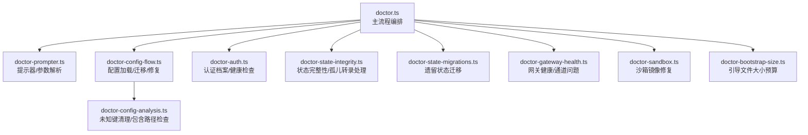
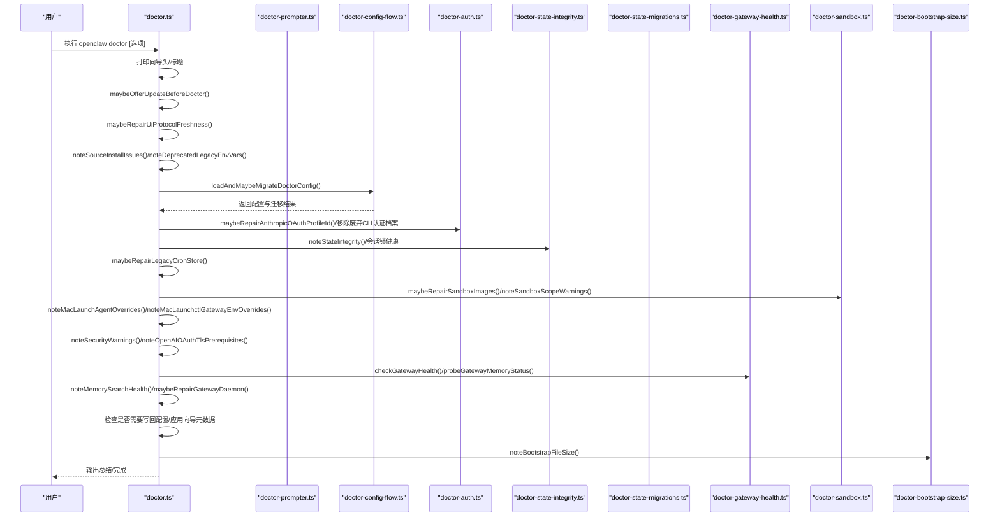
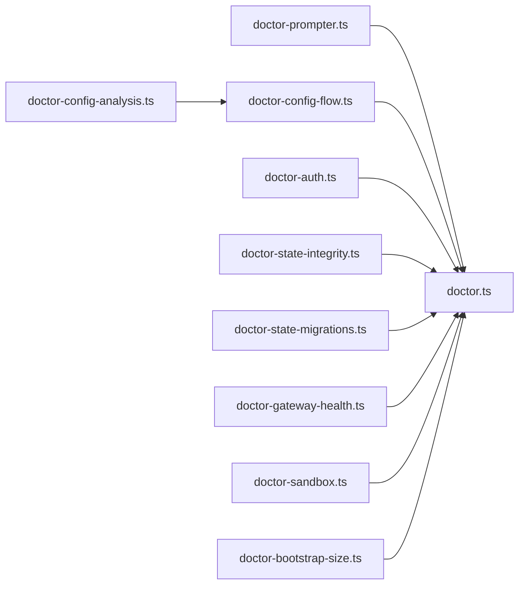

# Doctor 命令

<cite>
**本文引用的文件**
- [doctor.ts](file://src/commands/doctor.ts)
- [doctor-prompter.ts](file://src/commands/doctor-prompter.ts)
- [doctor-auth.ts](file://src/commands/doctor-auth.ts)
- [doctor-config-analysis.ts](file://src/commands/doctor-config-analysis.ts)
- [doctor-config-flow.ts](file://src/commands/doctor-config-flow.ts)
- [doctor-state-integrity.ts](file://src/commands/doctor-state-integrity.ts)
- [doctor-state-migrations.ts](file://src/commands/doctor-state-migrations.ts)
- [doctor-gateway-health.ts](file://src/commands/doctor-gateway-health.ts)
- [doctor-sandbox.ts](file://src/commands/doctor-sandbox.ts)
- [doctor-bootstrap-size.ts](file://src/commands/doctor-bootstrap-size.ts)
- [doctor-auth.deprecated-cli-profiles.test.ts](file://src/commands/doctor-auth.deprecated-cli-profiles.test.ts)
- [doctor-config-flow.missing-default-account-bindings.integration.test.ts](file://src/commands/doctor-config-flow.missing-default-account-bindings.integration.test.ts)
- [doctor.runs-legacy-state-migrations-yes-mode-without.e2e.test.ts](file://src/commands/doctor.runs-legacy-state-migrations-yes-mode-without.e2e.test.ts)
- [doctor.md](file://docs/cli/doctor.md)
</cite>

## 目录
1. [简介](#简介)
2. [项目结构](#项目结构)
3. [核心组件](#核心组件)
4. [架构总览](#架构总览)
5. [详细组件分析](#详细组件分析)
6. [依赖关系分析](#依赖关系分析)
7. [性能考量](#性能考量)
8. [故障排查指南](#故障排查指南)
9. [结论](#结论)
10. [附录](#附录)

## 简介
doctor 命令是 OpenClaw 的系统健康检查与引导修复工具，用于诊断并修复网关、通道、会话状态、沙箱镜像、配置规范化、遗留状态迁移、模型认证健康等问题。它支持交互式与非交互式两种运行模式，并提供自动修复能力（通过 --repair 或 --yes）。doctor 还会进行启动优化提示、安全警告、内存搜索就绪性检查、UI 协议新鲜度检查等。

## 项目结构
doctor 命令位于 CLI 子系统中，围绕“配置加载与迁移—健康检查—修复—写回配置”的主流程组织模块化子功能：
- doctor.ts：主入口，编排所有检查与修复步骤
- doctor-prompter.ts：统一的交互式提示器与参数解析
- doctor-auth.ts：认证档案与 OAuth 健康检查与修复
- doctor-config-analysis.ts：配置键清理与包含路径约束检查
- doctor-config-flow.ts：配置兼容性归一、默认账户绑定警告、Telegram/Discord 兼容修复
- doctor-state-integrity.ts：状态目录完整性、权限、孤儿会话转录文件处理
- doctor-state-migrations.ts：遗留状态迁移检测与执行
- doctor-gateway-health.ts：网关健康探测与通道状态问题收集
- doctor-sandbox.ts：沙箱镜像可用性检查与修复
- doctor-bootstrap-size.ts：工作区引导文件大小预算检查与建议

图表来源
- [doctor.ts:73-370](file://src/commands/doctor.ts#L73-L370)
- [doctor-prompter.ts:26-114](file://src/commands/doctor-prompter.ts#L26-L114)
- [doctor-config-flow.ts:1-800](file://src/commands/doctor-config-flow.ts#L1-L800)
- [doctor-auth.ts:21-358](file://src/commands/doctor-auth.ts#L21-L358)
- [doctor-state-integrity.ts:470-800](file://src/commands/doctor-state-integrity.ts#L470-L800)
- [doctor-state-migrations.ts:1-13](file://src/commands/doctor-state-migrations.ts#L1-L13)
- [doctor-gateway-health.ts:16-93](file://src/commands/doctor-gateway-health.ts#L16-L93)
- [doctor-sandbox.ts:178-298](file://src/commands/doctor-sandbox.ts#L178-L298)
- [doctor-bootstrap-size.ts:33-102](file://src/commands/doctor-bootstrap-size.ts#L33-L102)
- [doctor-config-analysis.ts:62-157](file://src/commands/doctor-config-analysis.ts#L62-L157)

章节来源
- [doctor.ts:73-370](file://src/commands/doctor.ts#L73-L370)
- [doctor.md:1-46](file://docs/cli/doctor.md#L1-L46)

## 核心组件
- doctorCommand：主流程函数，负责按序执行更新提示、UI 协议新鲜度、安装问题提示、配置加载与迁移、网关认证与健康检查、遗留状态迁移、状态完整性、沙箱镜像、安全与 TLS 预检、内存搜索健康、工作区建议、最终配置校验与写回。
- DoctorOptions：命令行参数类型，包含 workspaceSuggestions、yes、nonInteractive、deep、repair、force、generateGatewayToken 等。
- DoctorPrompter：根据参数与环境决定是否交互、是否强制修复、如何选择默认值。

章节来源
- [doctor.ts:73-370](file://src/commands/doctor.ts#L73-L370)
- [doctor-prompter.ts:6-24](file://src/commands/doctor-prompter.ts#L6-L24)

## 架构总览
doctor 的执行流程如下：

图表来源
- [doctor.ts:73-370](file://src/commands/doctor.ts#L73-L370)
- [doctor-prompter.ts:26-114](file://src/commands/doctor-prompter.ts#L26-L114)
- [doctor-config-flow.ts:1-800](file://src/commands/doctor-config-flow.ts#L1-L800)
- [doctor-auth.ts:21-358](file://src/commands/doctor-auth.ts#L21-L358)
- [doctor-state-integrity.ts:470-800](file://src/commands/doctor-state-integrity.ts#L470-L800)
- [doctor-state-migrations.ts:1-13](file://src/commands/doctor-state-migrations.ts#L1-L13)
- [doctor-gateway-health.ts:16-93](file://src/commands/doctor-gateway-health.ts#L16-L93)
- [doctor-sandbox.ts:178-298](file://src/commands/doctor-sandbox.ts#L178-L298)
- [doctor-bootstrap-size.ts:33-102](file://src/commands/doctor-bootstrap-size.ts#L33-L102)

## 详细组件分析

### doctor.ts 主流程
- 更新提示：在执行前询问是否先升级再检查（可跳过）。
- UI 协议新鲜度：确保 UI 协议版本最新。
- 安装与环境提示：源码安装问题、旧环境变量提示、启动优化建议。
- 配置加载与迁移：加载配置并进行兼容性归一、未知键清理、包含路径约束检查、默认账户绑定与显式默认账户警告、Telegram/Discord ID 规范化、OpenCode Provider 覆盖提示等。
- 认证健康：OAuth Profile ID 修复、废弃 CLI 认证档案清理、认证冷却/禁用提示与刷新。
- 网关与通道：网关健康探测、通道状态问题收集、内存搜索健康检查。
- 遗留状态：检测并迁移遗留状态（会话/代理/WhatsApp 认证）。
- 状态完整性：状态目录存在性/可写性/权限、多状态目录冲突、孤儿转录文件归档。
- 沙箱镜像：Docker 可用性检查、缺失镜像构建/拉取、浏览器沙箱镜像修复、共享作用域覆盖提示。
- 安全与 TLS：安全警告、OpenAI OAuth TLS 前置条件检查。
- 工作区与引导：工作区备份提示、引导文件大小预算检查与调优建议。
- 写回配置：若发生变更则写回配置并输出备份位置；否则提示使用 --fix 应用变更。

章节来源
- [doctor.ts:73-370](file://src/commands/doctor.ts#L73-L370)

### doctor-prompter.ts 提示器与参数解析
- 参数映射：yes → 非交互且默认同意；nonInteractive → 强制非交互；repair/force → 控制修复行为；deep → 影响 TLS 预检；generateGatewayToken → 是否自动生成网关令牌。
- 交互策略：TTY 可用且未设置 yes/nonInteractive 才允许交互；否则以默认值或不交互处理；confirmRepair/confirmAggressive/confirmSkipInNonInteractive 用于不同强度的确认。
- shouldRepair/shouldForce：驱动后续修复逻辑是否执行。

章节来源
- [doctor-prompter.ts:6-24](file://src/commands/doctor-prompter.ts#L6-L24)
- [doctor-prompter.ts:26-114](file://src/commands/doctor-prompter.ts#L26-L114)

### doctor-auth.ts 认证档案与健康检查
- OAuth Profile ID 修复：将旧的 Anthropic CLI Profile ID 迁移到新 ID 并提示应用。
- 废弃 CLI 认证档案清理：检测并从存储与配置中移除不再支持的 CLI 认证档案，同时清理排序与 lastGood 映射。
- 认证健康摘要：统计冷却/禁用状态，给出刷新建议；对过期/即将过期/缺失的 OAuth 令牌进行提示与刷新。

章节来源
- [doctor-auth.ts:21-358](file://src/commands/doctor-auth.ts#L21-L358)

### doctor-config-flow.ts 配置分析与迁移
- 未知键清理：基于 Zod Schema 移除未知键并记录移除项。
- 包含路径约束：检查 $include 是否越出配置目录根，给出移动与相对路径修正建议。
- 默认账户绑定警告：当通道配置了多个账户但缺少 accounts.default 或绑定不完整时，提示添加默认账户或补齐绑定。
- Telegram/Discord ID 规范化：将 @username 解析为数字 ID（必要时调用 API），将数值 ID 转换为字符串，去重并记录变更。
- OpenCode Provider 覆盖提示：检测 models.providers 中的覆盖项，提示恢复内置目录路由与成本计算。

章节来源
- [doctor-config-analysis.ts:62-157](file://src/commands/doctor-config-analysis.ts#L62-L157)
- [doctor-config-flow.ts:1-800](file://src/commands/doctor-config-flow.ts#L1-L800)

### doctor-state-integrity.ts 状态完整性检查
- 多平台状态目录检测：macOS iCloud/云存储、Linux SD/eMMC 存储风险提示。
- 目录存在性与权限：状态目录、会话目录、会话存储目录、OAuth 目录的创建与权限修复；配置文件权限收紧。
- 多状态目录冲突：发现其他状态目录时警告并指出当前活跃目录。
- 孤儿转录文件：扫描 sessions 目录中未被引用的主会话转录文件，提供归档为 .deleted.<timestamp> 的安全清理方案。

章节来源
- [doctor-state-integrity.ts:470-800](file://src/commands/doctor-state-integrity.ts#L470-L800)

### doctor-state-migrations.ts 遗留状态迁移
- 检测与执行：检测 legacy sessions/agent/WhatsApp 认证状态并提供迁移；在 yes/no 非交互模式下按策略执行，避免无提示的破坏性操作。

章节来源
- [doctor-state-migrations.ts:1-13](file://src/commands/doctor-state-migrations.ts#L1-L13)
- [doctor.runs-legacy-state-migrations-yes-mode-without.e2e.test.ts:22-42](file://src/commands/doctor.runs-legacy-state-migrations-yes-mode-without.e2e.test.ts#L22-L42)

### doctor-gateway-health.ts 网关健康与通道状态
- 健康探测：调用 health 命令进行超时控制；若网关关闭则提示连接细节。
- 通道状态问题：调用 doctor.memory.status 获取内存搜索就绪状态；收集 channels.status 的问题并提示修复。

章节来源
- [doctor-gateway-health.ts:16-93](file://src/commands/doctor-gateway-health.ts#L16-L93)

### doctor-sandbox.ts 沙箱镜像修复
- Docker 可用性：检测 docker version；缺失时给出启用/禁用沙箱的选项。
- 镜像检查与修复：检查 base/browser 镜像是否存在，缺失时提示构建脚本；支持自动运行构建脚本并更新配置。
- 作用域覆盖提示：当 agents.defaults.sandbox.scope 为 shared 时忽略 agent 级别的覆盖项。

章节来源
- [doctor-sandbox.ts:178-298](file://src/commands/doctor-sandbox.ts#L178-L298)

### doctor-bootstrap-size.ts 引导文件大小预算
- 统计注入字符数与原始字符数，识别超出 per-file-limit 或 total-limit 的文件；给出调整 agents.defaults.bootstrapMaxChars 与 agents.defaults.bootstrapTotalMaxChars 的建议。

章节来源
- [doctor-bootstrap-size.ts:33-102](file://src/commands/doctor-bootstrap-size.ts#L33-L102)

## 依赖关系分析
- doctor.ts 作为编排者，依赖各子模块提供的检查与修复函数，形成“配置—认证—状态—网关—沙箱—引导”的检查链。
- 提示器 doctor-prompter.ts 通过 DoctorOptions 控制交互与修复强度，贯穿整个流程。
- 配置相关模块（config-flow、config-analysis）共同完成未知键清理、包含路径约束、默认账户绑定与 ID 规范化。
- 状态完整性模块与遗留状态迁移模块协同处理会话与历史数据的完整性与迁移。
- 网关健康模块与沙箱模块分别负责远端可达性与本地容器环境准备。

图表来源
- [doctor.ts:73-370](file://src/commands/doctor.ts#L73-L370)
- [doctor-prompter.ts:26-114](file://src/commands/doctor-prompter.ts#L26-L114)
- [doctor-config-flow.ts:1-800](file://src/commands/doctor-config-flow.ts#L1-L800)
- [doctor-config-analysis.ts:62-157](file://src/commands/doctor-config-analysis.ts#L62-L157)
- [doctor-auth.ts:21-358](file://src/commands/doctor-auth.ts#L21-L358)
- [doctor-state-integrity.ts:470-800](file://src/commands/doctor-state-integrity.ts#L470-L800)
- [doctor-state-migrations.ts:1-13](file://src/commands/doctor-state-migrations.ts#L1-L13)
- [doctor-gateway-health.ts:16-93](file://src/commands/doctor-gateway-health.ts#L16-L93)
- [doctor-sandbox.ts:178-298](file://src/commands/doctor-sandbox.ts#L178-L298)
- [doctor-bootstrap-size.ts:33-102](file://src/commands/doctor-bootstrap-size.ts#L33-L102)

## 性能考量
- 超时控制：网关健康探测与内存状态探测设置了合理的超时阈值，避免长时间阻塞。
- I/O 优化：状态完整性检查仅在必要时进行文件系统访问；孤儿转录文件扫描限制在 sessions 目录内。
- 镜像检查：Docker 可用性与镜像存在性检查采用最小代价的命令调用，失败时快速返回。
- 非交互模式：在非交互模式下减少不必要的等待与确认，提升自动化场景下的吞吐。

## 故障排查指南
- 网关未运行：健康探测失败时会提示“Gateway not running”，并输出连接详情，建议检查网关进程与端口。
- 权限问题：状态目录/配置文件权限过高或属主不符时，提供 chown/chmod 修复建议；必要时自动收紧权限。
- 多状态目录：发现其他状态目录时会警告并列出，建议统一到当前活跃目录。
- 孤儿转录文件：建议归档为 .deleted.<timestamp> 以回收空间并保留审计痕迹。
- 沙箱镜像缺失：Docker 不可用或镜像不存在时，提供安装/构建指引与禁用沙箱的降级方案。
- 认证问题：过期/即将过期/缺失的 OAuth 令牌会提示刷新；废弃 CLI 认证档案会被清理。
- 配置错误：Zod 校验失败时会输出具体路径与消息，建议使用 --fix 清理未知键或修正包含路径。

章节来源
- [doctor-gateway-health.ts:16-93](file://src/commands/doctor-gateway-health.ts#L16-L93)
- [doctor-state-integrity.ts:470-800](file://src/commands/doctor-state-integrity.ts#L470-L800)
- [doctor-sandbox.ts:178-298](file://src/commands/doctor-sandbox.ts#L178-L298)
- [doctor-auth.ts:21-358](file://src/commands/doctor-auth.ts#L21-L358)
- [doctor-config-analysis.ts:62-157](file://src/commands/doctor-config-analysis.ts#L62-L157)

## 结论
doctor 命令通过模块化的健康检查与修复流程，覆盖了 OpenClaw 的关键运行面：配置规范化、认证健康、状态完整性、网关连通性、沙箱环境、工作区引导与安全合规。结合交互式与非交互式模式，doctor 既能满足日常自助诊断，也能无缝集成到自动化运维流程中。

## 附录

### 命令行参数与使用场景
- --yes：非交互模式，自动同意修复；适合 CI/自动化脚本。
- --repair：开启修复模式，doctor 将尝试自动修复可修复的问题；可与 --yes 组合使用。
- --force：在某些强修复场景中强制执行，谨慎使用。
- --non-interactive：明确非交互模式，忽略 TTY 检测；适合无终端环境。
- --deep：影响 TLS 预检等深度检查的范围与严格程度。
- --generate-gateway-token：在本地网关模式下生成并配置网关令牌（需非交互或确认）。

章节来源
- [doctor-prompter.ts:6-24](file://src/commands/doctor-prompter.ts#L6-L24)
- [doctor.ts:171-196](file://src/commands/doctor.ts#L171-L196)

### 交互式与非交互式模式示例
- 交互式：直接运行 doctor，遇到可修复项时会提示确认；TTY 可用且未设置 --non-interactive 时才会弹出提示。
- 非交互式：使用 --non-interactive 或 --yes，所有可修复项默认不执行，除非显式传入 --repair；适合无人值守的 Cron、Telegram 等场景。

章节来源
- [doctor.md:28-33](file://docs/cli/doctor.md#L28-L33)
- [doctor.runs-legacy-state-migrations-yes-mode-without.e2e.test.ts:22-42](file://src/commands/doctor.runs-legacy-state-migrations-yes-mode-without.e2e.test.ts#L22-L42)

### 最佳实践建议
- 定期运行 doctor：更新后、认证变更后、出现连接异常时运行 doctor 进行健康检查。
- 使用 --repair：在开发与调试阶段可配合 --repair 快速修复常见问题；生产环境建议先 --dry-run 后再执行。
- 非交互部署：CI/无人值守环境使用 --non-interactive/--yes，结合日志与退出码进行监控。
- 关注安全与 TLS：遵循 doctor 的安全警告与 TLS 预检建议，及时更新证书与依赖。
- 状态管理：定期清理孤儿转录文件，保持 sessions 目录整洁；避免多状态目录并存。

章节来源
- [doctor.md:18-33](file://docs/cli/doctor.md#L18-L33)
- [doctor-state-integrity.ts:772-799](file://src/commands/doctor-state-integrity.ts#L772-L799)