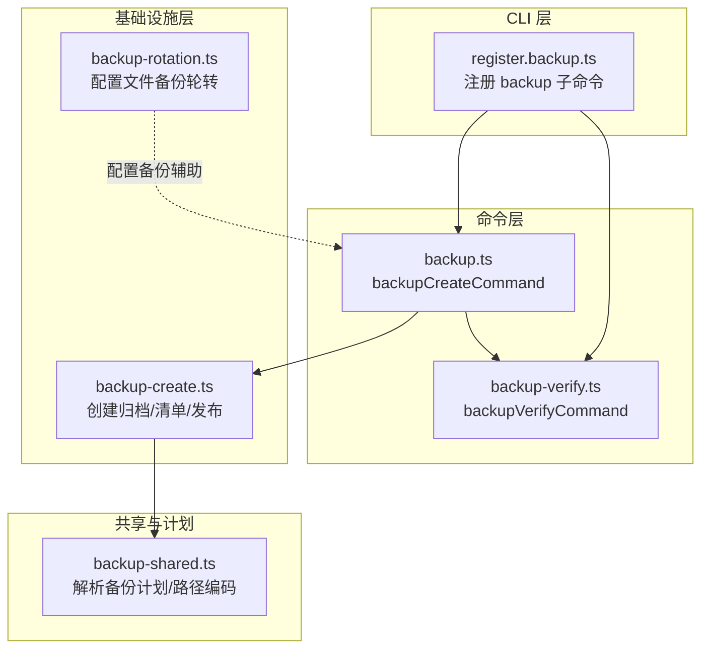
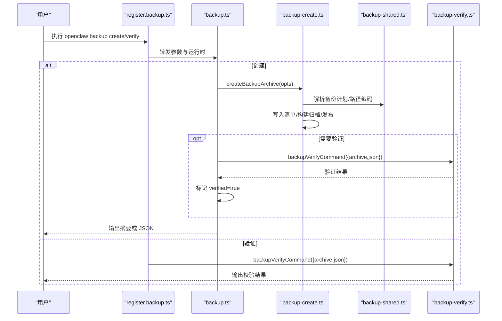
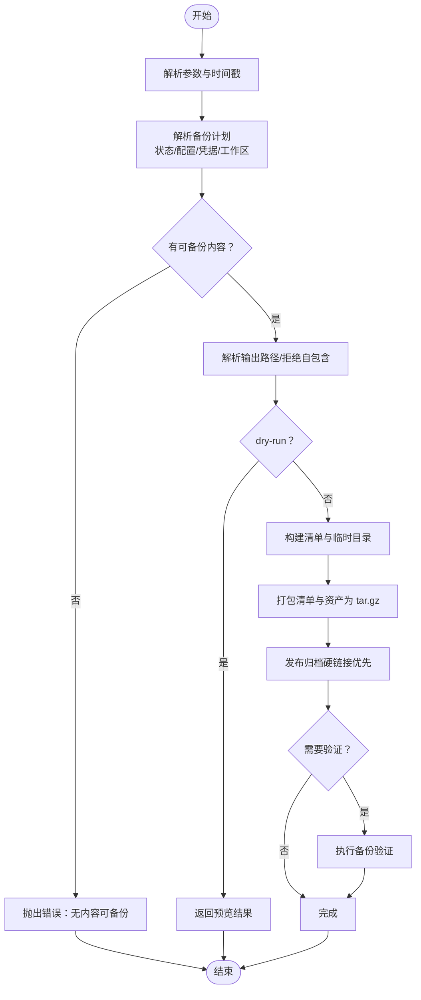
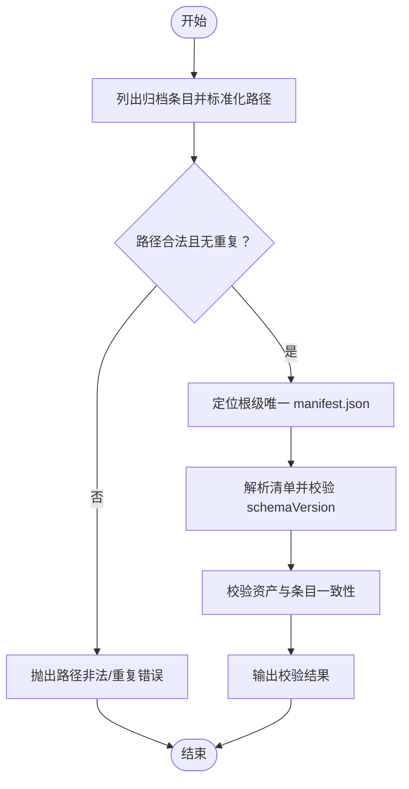

# 备份与恢复工具

<cite>
**本文引用的文件**
- [backup.ts](file://src/commands/backup.ts)
- [backup-verify.ts](file://src/commands/backup-verify.ts)
- [backup-create.ts](file://src/infra/backup-create.ts)
- [backup-shared.ts](file://src/commands/backup-shared.ts)
- [register.backup.ts](file://src/cli/program/register.backup.ts)
- [backup.md](file://docs/cli/backup.md)
- [backup-rotation.ts](file://src/config/backup-rotation.ts)
- [backup.test.ts](file://src/commands/backup.test.ts)
- [backup-verify.test.ts](file://src/commands/backup-verify.test.ts)
- [register.backup.test.ts](file://src/cli/program/register.backup.test.ts)
</cite>

## 目录
1. [简介](#简介)
2. [项目结构](#项目结构)
3. [核心组件](#核心组件)
4. [架构总览](#架构总览)
5. [详细组件分析](#详细组件分析)
6. [依赖关系分析](#依赖关系分析)
7. [性能考量](#性能考量)
8. [故障排除指南](#故障排除指南)
9. [结论](#结论)
10. [附录](#附录)

## 简介
本文件面向 OpenClaw 的备份与恢复工具，系统化阐述备份策略与实现机制，覆盖自动备份、手动备份与增量备份的可选能力；详解备份文件格式、存储位置与版本管理；解释备份验证与完整性检查方法（含数据一致性验证与恢复测试流程）；提供恢复操作步骤（完整恢复、选择性恢复与跨平台迁移）；并给出备份最佳实践与常见问题排查建议。

## 项目结构
OpenClaw 的备份子系统由 CLI 命令注册、备份创建与验证命令、共享计划构建与归档逻辑、以及配置文件备份轮转等模块组成。整体采用“命令层 → 业务层 → 基础设施层”的分层设计，确保可测试性与可维护性。

图表来源
- [register.backup.ts:10-92](file://src/cli/program/register.backup.ts#L10-L92)
- [backup.ts:1-32](file://src/commands/backup.ts#L1-L32)
- [backup-verify.ts:1-325](file://src/commands/backup-verify.ts#L1-L325)
- [backup-create.ts:1-369](file://src/infra/backup-create.ts#L1-L369)
- [backup-shared.ts:1-255](file://src/commands/backup-shared.ts#L1-L255)
- [backup-rotation.ts:1-126](file://src/config/backup-rotation.ts#L1-L126)

章节来源
- [register.backup.ts:10-92](file://src/cli/program/register.backup.ts#L10-L92)
- [backup.ts:1-32](file://src/commands/backup.ts#L1-L32)
- [backup-verify.ts:1-325](file://src/commands/backup-verify.ts#L1-L325)
- [backup-create.ts:1-369](file://src/infra/backup-create.ts#L1-L369)
- [backup-shared.ts:1-255](file://src/commands/backup-shared.ts#L1-L255)
- [backup-rotation.ts:1-126](file://src/config/backup-rotation.ts#L1-L126)

## 核心组件
- 备份创建命令：负责解析参数、生成备份计划、构建归档、写入清单、发布最终归档，并可选地在创建后立即进行验证。
- 备份验证命令：对已存在归档进行结构与清单校验，确保清单唯一、路径合法、资产齐全且未被篡改。
- 归档基础设施：封装 tar.gz 归档创建、清单构建、临时归档发布（硬链接优先，不支持时回退到独占复制）、输出路径解析与冲突保护。
- 共享计划与路径编码：统一解析状态目录、配置文件、凭据目录与工作区目录，去重合并，编码绝对路径以适配多平台归档布局。
- CLI 注册：定义 backup create/verify 子命令及其选项，将用户输入转发给对应命令处理。
- 配置文件备份轮转：在配置文件写入时自动维护轮转备份，限制数量、加固权限、清理孤儿备份。

章节来源
- [backup.ts:11-31](file://src/commands/backup.ts#L11-L31)
- [backup-verify.ts:279-324](file://src/commands/backup-verify.ts#L279-L324)
- [backup-create.ts:272-368](file://src/infra/backup-create.ts#L272-L368)
- [backup-shared.ts:106-254](file://src/commands/backup-shared.ts#L106-L254)
- [register.backup.ts:10-92](file://src/cli/program/register.backup.ts#L10-L92)
- [backup-rotation.ts:16-125](file://src/config/backup-rotation.ts#L16-L125)

## 架构总览
下图展示从 CLI 到基础设施的调用链路与职责边界：

图表来源
- [register.backup.ts:53-91](file://src/cli/program/register.backup.ts#L53-L91)
- [backup.ts:11-31](file://src/commands/backup.ts#L11-L31)
- [backup-create.ts:272-368](file://src/infra/backup-create.ts#L272-L368)
- [backup-shared.ts:106-254](file://src/commands/backup-shared.ts#L106-L254)
- [backup-verify.ts:279-324](file://src/commands/backup-verify.ts#L279-L324)

## 详细组件分析

### 备份创建流程（backup-create）
- 输入参数：输出目录、是否仅配置、是否包含工作区、是否验证、是否仅预演（dry-run）、时间戳等。
- 计划阶段：解析状态目录、配置文件、凭据目录与工作区目录，去重合并，避免重复收录与自包含风险。
- 归档阶段：写入清单（manifest.json），使用 tar.gz 将清单与所有资产打包；通过硬链接优先发布，不支持时回退独占复制。
- 发布阶段：临时归档完成后，原子性发布到目标路径，拒绝覆盖既有文件。
- 结果汇总：返回创建时间、归档根、路径、包含/跳过资产列表、是否验证通过等信息。

图表来源
- [backup-create.ts:272-368](file://src/infra/backup-create.ts#L272-L368)
- [backup-shared.ts:106-254](file://src/commands/backup-shared.ts#L106-L254)

章节来源
- [backup-create.ts:18-124](file://src/infra/backup-create.ts#L18-L124)
- [backup-create.ts:126-168](file://src/infra/backup-create.ts#L126-L168)
- [backup-create.ts:170-188](file://src/infra/backup-create.ts#L170-L188)
- [backup-create.ts:190-231](file://src/infra/backup-create.ts#L190-L231)
- [backup-create.ts:233-258](file://src/infra/backup-create.ts#L233-L258)
- [backup-create.ts:260-271](file://src/infra/backup-create.ts#L260-L271)
- [backup-create.ts:272-368](file://src/infra/backup-create.ts#L272-L368)
- [backup-shared.ts:106-254](file://src/commands/backup-shared.ts#L106-L254)

### 备份验证流程（backup-verify）
- 解析归档条目：遍历 tar.gz 内容，标准化路径，拒绝空路径、绝对路径、反斜杠、路径穿越与重复条目。
- 定位并解析清单：只接受根级唯一的 manifest.json，解析清单字段并校验 schema 版本。
- 清单一致性校验：确认清单声明的每个资产在归档中存在（精确匹配或作为子项存在），且所有条目均位于归档根内。
- 结果输出：以人类可读或 JSON 格式输出校验结果。

图表来源
- [backup-verify.ts:173-183](file://src/commands/backup-verify.ts#L173-L183)
- [backup-verify.ts:185-216](file://src/commands/backup-verify.ts#L185-L216)
- [backup-verify.ts:218-221](file://src/commands/backup-verify.ts#L218-L221)
- [backup-verify.ts:223-253](file://src/commands/backup-verify.ts#L223-L253)
- [backup-verify.ts:279-324](file://src/commands/backup-verify.ts#L279-L324)

章节来源
- [backup-verify.ts:97-171](file://src/commands/backup-verify.ts#L97-L171)
- [backup-verify.ts:279-324](file://src/commands/backup-verify.ts#L279-L324)

### CLI 命令注册与参数转发
- backup create：支持输出目录、仅配置、包含/排除工作区、验证、JSON 输出、预演等选项；将参数透传至备份创建命令。
- backup verify：接收归档路径与 JSON 输出选项；将参数透传至备份验证命令。
- 文档链接与帮助示例：在命令描述后附加文档链接与示例。

章节来源
- [register.backup.ts:10-92](file://src/cli/program/register.backup.ts#L10-L92)
- [register.backup.test.ts:31-104](file://src/cli/program/register.backup.test.ts#L31-L104)

### 备份文件格式与存储位置
- 文件格式：归档为 .tar.gz，根目录为时间戳命名的归档根，包含 manifest.json 与 payload 目录。
- 清单结构：包含 schemaVersion、createdAt、archiveRoot、runtimeVersion、platform、nodeVersion、options、paths、assets、skipped 等字段。
- 路径编码：绝对路径按平台编码（POSIX/Windows/相对）以避免跨平台冲突；工作区外部路径独立编码，内部路径去重合并。
- 存储位置：默认在当前工作目录，若 CWD 位于被备份源树内则回退到用户家目录；拒绝将输出写入任一源路径内部；支持显式输出目录或文件路径。

章节来源
- [backup-create.ts:34-76](file://src/infra/backup-create.ts#L34-L76)
- [backup-create.ts:190-231](file://src/infra/backup-create.ts#L190-L231)
- [backup-create.ts:78-111](file://src/infra/backup-create.ts#L78-L111)
- [backup-create.ts:295-303](file://src/infra/backup-create.ts#L295-L303)
- [backup-shared.ts:60-84](file://src/commands/backup-shared.ts#L60-L84)
- [backup.md:23-31](file://docs/cli/backup.md#L23-L31)

### 版本管理与轮转（配置文件）
- 配置文件备份轮转：在写入配置时自动维护轮转环（主 .bak 与编号 .bak.1..N-1），限制数量，加固权限，清理孤儿备份。
- 顺序：旋转环 → 新建 .bak → 加固权限 → 清理孤儿文件。

章节来源
- [backup-rotation.ts:16-125](file://src/config/backup-rotation.ts#L16-L125)

## 依赖关系分析
- 命令层依赖基础设施层进行归档与发布；同时依赖共享层进行备份计划解析与路径编码。
- 验证命令独立于创建流程，仅依赖 tar 解包与清单解析。
- CLI 注册层仅负责参数转发与运行时包装。

图表来源
- [register.backup.ts:10-92](file://src/cli/program/register.backup.ts#L10-L92)
- [backup.ts:1-32](file://src/commands/backup.ts#L1-L32)
- [backup-verify.ts:1-325](file://src/commands/backup-verify.ts#L1-L325)
- [backup-create.ts:1-369](file://src/infra/backup-create.ts#L1-L369)
- [backup-shared.ts:1-255](file://src/commands/backup-shared.ts#L1-L255)

章节来源
- [register.backup.ts:10-92](file://src/cli/program/register.backup.ts#L10-L92)
- [backup.ts:1-32](file://src/commands/backup.ts#L1-L32)
- [backup-verify.ts:1-325](file://src/commands/backup-verify.ts#L1-L325)
- [backup-create.ts:1-369](file://src/infra/backup-create.ts#L1-L369)
- [backup-shared.ts:1-255](file://src/commands/backup-shared.ts#L1-L255)

## 性能考量
- 大小与速度：归档大小主要由工作区决定；禁用工作区或仅备份配置可显著减小体积与压缩时间。
- I/O 行为：优先硬链接发布，不支持时回退独占复制；归档创建期间会遍历与压缩大量文件，注意磁盘空间与 CPU 占用。
- 验证开销：创建后验证会重新扫描归档，增加耗时；建议在 CI 或离线场景启用，日常使用可关闭。

章节来源
- [backup.md:63-77](file://docs/cli/backup.md#L63-L77)
- [backup-create.ts:134-168](file://src/infra/backup-create.ts#L134-L168)

## 故障排除指南
- 无内容可备份：当仅配置模式但未找到配置文件，或非配置模式但未发现本地状态时，会抛出明确错误。可通过 --no-include-workspace 获取部分备份，或使用 --only-config 仅备份配置。
- 自包含与路径冲突：若输出路径位于任一源路径内部，或 CWD 指向被备份树，将拒绝写入并提示回退到家目录。
- 路径穿越/非法路径：归档中出现绝对路径、反斜杠、路径穿越片段或重复条目，验证阶段会失败。
- 清单缺失或重复：归档缺少根级唯一 manifest.json，或存在多个清单，验证失败。
- 资产缺失：清单声明的资产在归档中不存在（既非精确匹配也非子项存在），验证失败。
- 预演与覆盖：dry-run 不写入归档；若目标已存在且不支持硬链接，发布阶段会拒绝覆盖。

章节来源
- [backup-create.ts:287-293](file://src/infra/backup-create.ts#L287-L293)
- [backup-create.ts:295-303](file://src/infra/backup-create.ts#L295-L303)
- [backup-create.ts:305-307](file://src/infra/backup-create.ts#L305-L307)
- [backup-verify.ts:284-302](file://src/commands/backup-verify.ts#L284-L302)
- [backup-verify.ts:295-298](file://src/commands/backup-verify.ts#L295-L298)
- [backup-verify.ts:240-252](file://src/commands/backup-verify.ts#L240-L252)
- [backup.test.ts:213-228](file://src/commands/backup.test.ts#L213-L228)
- [backup.test.ts:258-279](file://src/commands/backup.test.ts#L258-L279)
- [backup.test.ts:315-336](file://src/commands/backup.test.ts#L315-L336)
- [backup-verify.test.ts:47-68](file://src/commands/backup-verify.test.ts#L47-L68)
- [backup-verify.test.ts:112-168](file://src/commands/backup-verify.test.ts#L112-L168)
- [backup-verify.test.ts:170-226](file://src/commands/backup-verify.test.ts#L170-L226)
- [backup-verify.test.ts:276-331](file://src/commands/backup-verify.test.ts#L276-L331)
- [backup-verify.test.ts:333-391](file://src/commands/backup-verify.test.ts#L333-L391)

## 结论
OpenClaw 的备份与恢复工具以清晰的分层架构实现了本地归档备份与即时验证，具备良好的安全性（路径校验、去重合并、权限加固）与可移植性（跨平台路径编码）。通过 CLI 提供了灵活的备份策略组合（仅配置、包含/排除工作区、预演与验证），并辅以配置文件轮转与孤儿文件清理，满足日常运维与灾难恢复需求。

## 附录

### 备份策略与实现机制
- 自动备份：可结合系统定时任务或 CI 流水线定期触发 backup create；建议在变更后或卸载前运行验证。
- 手动备份：通过 backup create 生成归档；如需立即校验，添加 --verify。
- 增量备份：当前实现为全量归档；如需增量，请结合外部工具（例如基于时间戳的差异同步或版本控制）在归档外管理增量。

章节来源
- [backup.md:13-21](file://docs/cli/backup.md#L13-L21)
- [backup.ts:11-31](file://src/commands/backup.ts#L11-L31)
- [backup-create.ts:272-368](file://src/infra/backup-create.ts#L272-L368)

### 备份文件格式与存储位置
- 归档结构：时间戳根目录 → manifest.json + payload（按平台编码的绝对/相对路径）
- 存储位置：默认当前目录，若 CWD 在被备份树内则回退家目录；显式输出可为目录或文件路径
- 版本管理：配置文件写入时自动轮转与加固

章节来源
- [backup-create.ts:34-76](file://src/infra/backup-create.ts#L34-L76)
- [backup-create.ts:78-111](file://src/infra/backup-create.ts#L78-L111)
- [backup-create.ts:190-231](file://src/infra/backup-create.ts#L190-L231)
- [backup-rotation.ts:16-125](file://src/config/backup-rotation.ts#L16-L125)

### 验证与完整性检查
- 验证内容：唯一根级清单、路径合法性、资产存在性、无重复条目
- 恢复测试：先验证，再解压到隔离目录进行最小化读取测试

章节来源
- [backup-verify.ts:223-253](file://src/commands/backup-verify.ts#L223-L253)
- [backup-verify.test.ts:22-45](file://src/commands/backup-verify.test.ts#L22-L45)

### 恢复操作步骤
- 完整恢复：解压归档根到新环境，核对清单与资产；必要时使用 --only-config 进行最小恢复
- 选择性恢复：通过外部手段仅提取清单中指定资产
- 跨平台迁移：利用路径编码规则，将 payload 中的编码路径映射到目标平台

章节来源
- [backup-shared.ts:68-84](file://src/commands/backup-shared.ts#L68-L84)
- [backup-create.ts:34-76](file://src/infra/backup-create.ts#L34-L76)

### 备份最佳实践
- 频率：每日/每次重大变更后；生产环境建议离峰执行
- 存储安全：对归档与 .bak 文件设置最小权限；异地/多副本保存
- 灾难恢复：定期演练验证与恢复流程；保留最近 N 次轮转备份

章节来源
- [backup-rotation.ts:44-62](file://src/config/backup-rotation.ts#L44-L62)
- [backup.md:63-77](file://docs/cli/backup.md#L63-L77)