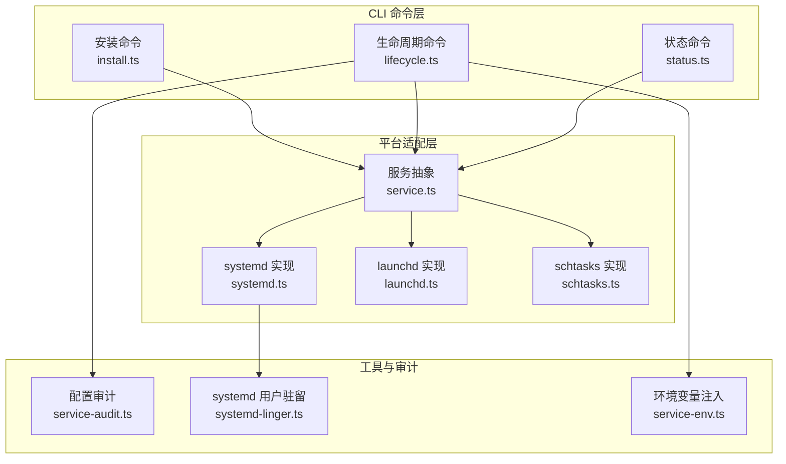
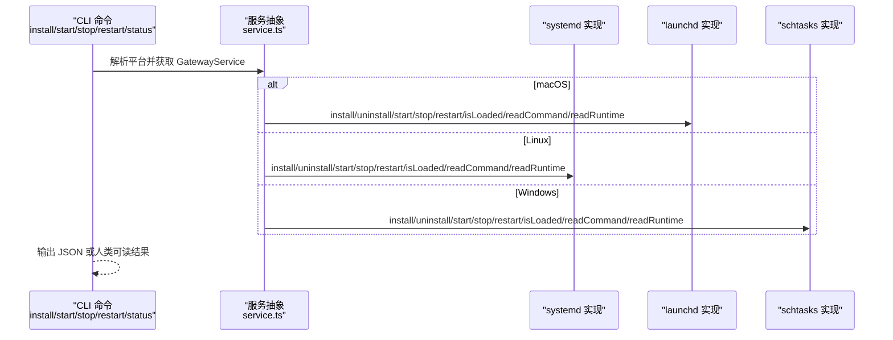
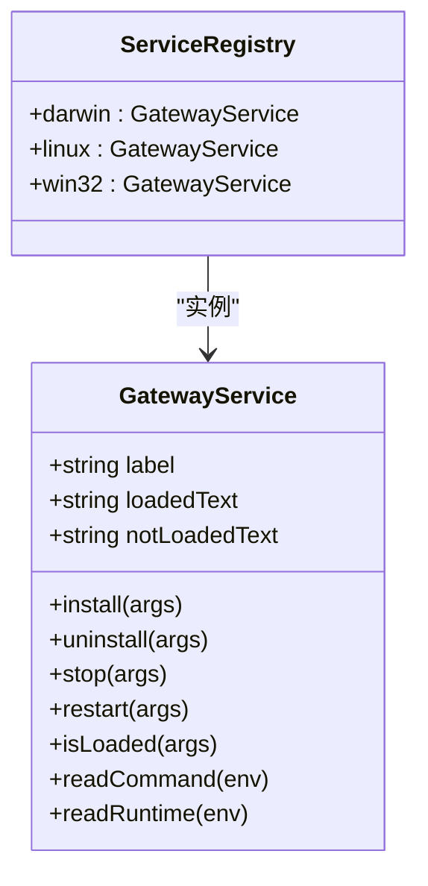
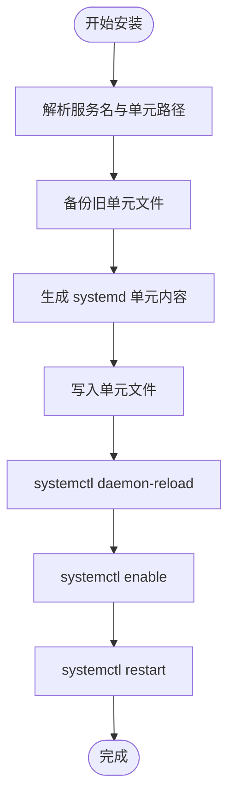
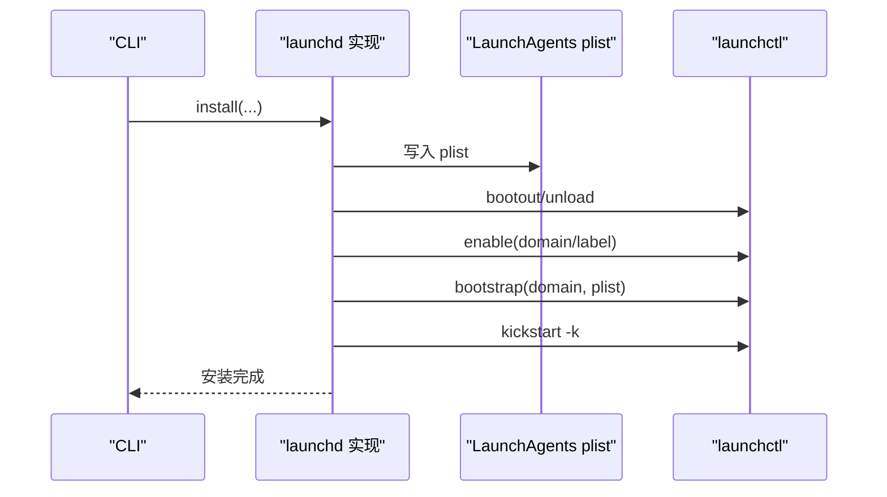
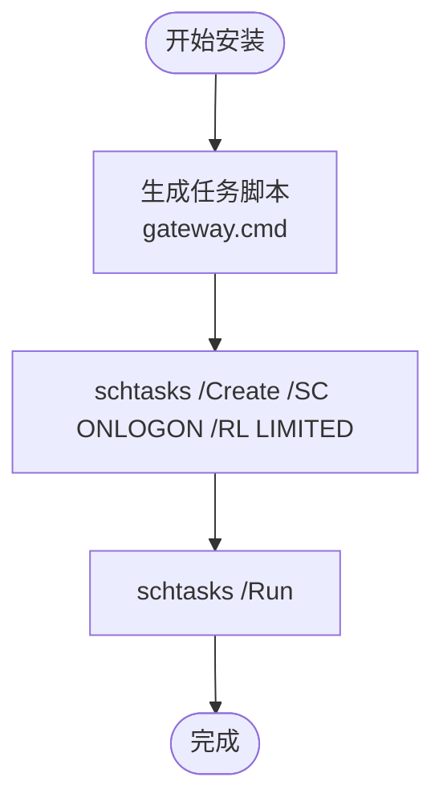
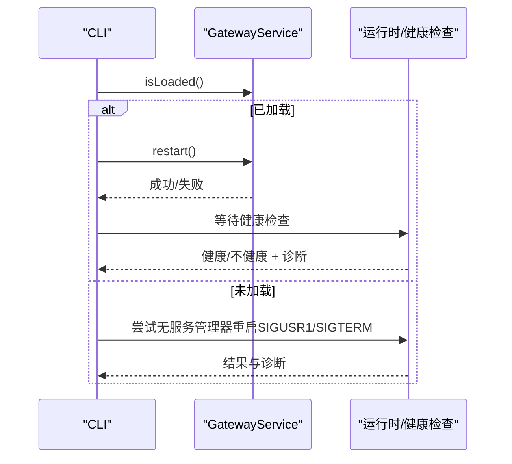
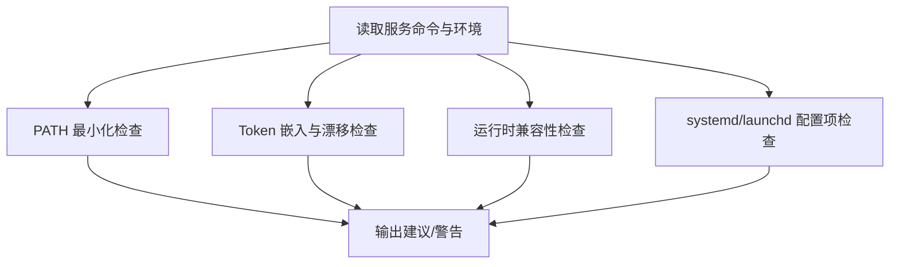
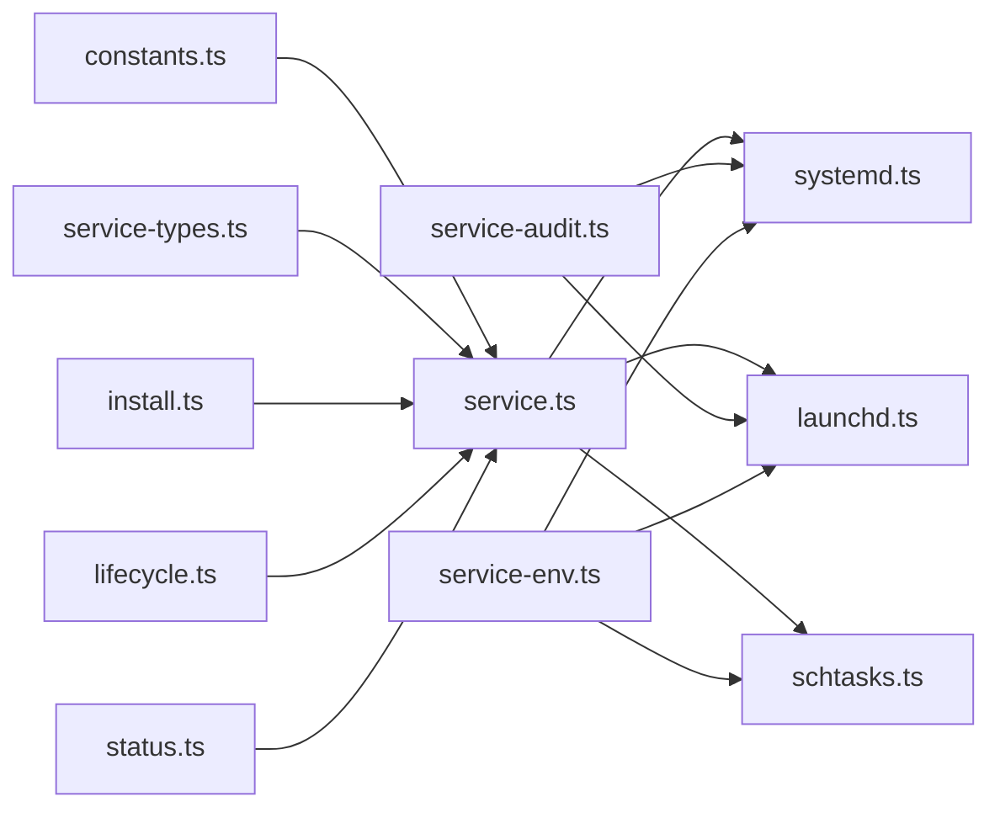

# 守护进程管理

<cite>
**本文引用的文件**
- [src/daemon/service.ts](file://src/daemon/service.ts)
- [src/daemon/systemd.ts](file://src/daemon/systemd.ts)
- [src/daemon/launchd.ts](file://src/daemon/launchd.ts)
- [src/daemon/schtasks.ts](file://src/daemon/schtasks.ts)
- [src/daemon/constants.ts](file://src/daemon/constants.ts)
- [src/daemon/service-types.ts](file://src/daemon/service-types.ts)
- [src/daemon/service-audit.ts](file://src/daemon/service-audit.ts)
- [src/daemon/systemd-linger.ts](file://src/daemon/systemd-linger.ts)
- [src/cli/daemon-cli/install.ts](file://src/cli/daemon-cli/install.ts)
- [src/cli/daemon-cli/lifecycle.ts](file://src/cli/daemon-cli/lifecycle.ts)
- [src/cli/daemon-cli/status.ts](file://src/cli/daemon-cli/status.ts)
- [src/cli/daemon-cli/response.ts](file://src/cli/daemon-cli/response.ts)
- [src/daemon/inspect.ts](file://src/daemon/inspect.ts)
- [src/infra/restart.ts](file://src/infra/restart.ts)
- [src/daemon/service-env.ts](file://src/daemon/service-env.ts)
</cite>

## 目录
1. [简介](#简介)
2. [项目结构](#项目结构)
3. [核心组件](#核心组件)
4. [架构总览](#架构总览)
5. [详细组件分析](#详细组件分析)
6. [依赖关系分析](#依赖关系分析)
7. [性能考量](#性能考量)
8. [故障排除指南](#故障排除指南)
9. [结论](#结论)
10. [附录](#附录)

## 简介
本文件系统化阐述 OpenClaw 的守护进程管理系统，覆盖安装、启动、停止、重启与状态监控等全生命周期能力，并针对 macOS（launchd）、Linux（systemd）与 Windows（schtasks）三大平台提供具体实现与最佳实践。文档同时解释服务注册、权限检查、自动重启机制、错误处理策略以及服务配置文件的管理方法（含自定义配置、权限与安全注意事项），并提供面向实际运维的故障排除指南。

## 项目结构
守护进程管理由“平台适配层 + CLI 命令层 + 运行时探测与健康检查”三部分组成：
- 平台适配层：封装 systemd、launchd、schtasks 的安装、卸载、启停、查询与运行时信息读取。
- CLI 命令层：提供 install/start/stop/restart/status 等命令，统一输出 JSON 或人类可读格式。
- 运行时探测与健康检查：在重启前后进行端口健康检查、进程清理与信号触发，确保服务稳定可用。

图示来源
- [src/cli/daemon-cli/install.ts:1-127](file://src/cli/daemon-cli/install.ts#L1-L127)
- [src/cli/daemon-cli/lifecycle.ts:1-332](file://src/cli/daemon-cli/lifecycle.ts#L1-L332)
- [src/cli/daemon-cli/status.ts:1-21](file://src/cli/daemon-cli/status.ts#L1-L21)
- [src/daemon/service.ts:1-120](file://src/daemon/service.ts#L1-L120)
- [src/daemon/systemd.ts:1-713](file://src/daemon/systemd.ts#L1-L713)
- [src/daemon/launchd.ts:1-521](file://src/daemon/launchd.ts#L1-L521)
- [src/daemon/schtasks.ts:1-369](file://src/daemon/schtasks.ts#L1-L369)
- [src/daemon/service-audit.ts:1-424](file://src/daemon/service-audit.ts#L1-L424)
- [src/daemon/systemd-linger.ts:1-74](file://src/daemon/systemd-linger.ts#L1-L74)
- [src/daemon/service-env.ts:313-339](file://src/daemon/service-env.ts#L313-L339)

章节来源
- [src/daemon/service.ts:1-120](file://src/daemon/service.ts#L1-L120)
- [src/daemon/systemd.ts:1-713](file://src/daemon/systemd.ts#L1-L713)
- [src/daemon/launchd.ts:1-521](file://src/daemon/launchd.ts#L1-L521)
- [src/daemon/schtasks.ts:1-369](file://src/daemon/schtasks.ts#L1-L369)

## 核心组件
- 服务抽象与平台分发：通过 resolveGatewayService() 在 Darwin/Linux/Win32 间选择对应实现，统一路径调用 install/uninstall/start/stop/restart/isLoaded/readCommand/readRuntime。
- 平台实现：
  - systemd：生成用户单元文件、启用/禁用、重启、查询运行时状态；支持遗留单元迁移与清理。
  - launchd：生成 LaunchAgent plist、引导/踢起、查询运行时状态；支持遗留 LaunchAgent 清理与修复。
  - schtasks：生成任务脚本与创建计划任务、结束/运行任务、查询运行时状态。
- CLI 命令：
  - 安装：解析运行时与端口、构建启动参数、调用平台安装并输出结果。
  - 启动/停止/重启：统一处理“未加载”提示、健康检查、端口探测与进程信号。
  - 状态：聚合服务与运行时信息，支持深度探测与 RPC 探测。
- 配置审计与环境注入：检测 PATH、Token、网络在线依赖、KeepAlive/RunAtLoad 等关键项；注入最小 PATH、代理与系统证书等运行时环境。

章节来源
- [src/daemon/service.ts:54-120](file://src/daemon/service.ts#L54-L120)
- [src/daemon/systemd.ts:451-521](file://src/daemon/systemd.ts#L451-L521)
- [src/daemon/launchd.ts:369-445](file://src/daemon/launchd.ts#L369-L445)
- [src/daemon/schtasks.ts:222-282](file://src/daemon/schtasks.ts#L222-L282)
- [src/cli/daemon-cli/install.ts:21-127](file://src/cli/daemon-cli/install.ts#L21-L127)
- [src/cli/daemon-cli/lifecycle.ts:193-332](file://src/cli/daemon-cli/lifecycle.ts#L193-L332)
- [src/cli/daemon-cli/status.ts:7-21](file://src/cli/daemon-cli/status.ts#L7-L21)
- [src/daemon/service-audit.ts:402-424](file://src/daemon/service-audit.ts#L402-L424)
- [src/daemon/service-env.ts:313-339](file://src/daemon/service-env.ts#L313-L339)

## 架构总览
下图展示守护进程管理在不同平台的安装与控制流程，以及 CLI 与平台实现之间的交互关系。

图示来源
- [src/daemon/service.ts:114-120](file://src/daemon/service.ts#L114-L120)
- [src/daemon/systemd.ts:451-521](file://src/daemon/systemd.ts#L451-L521)
- [src/daemon/launchd.ts:369-445](file://src/daemon/launchd.ts#L369-L445)
- [src/daemon/schtasks.ts:222-282](file://src/daemon/schtasks.ts#L222-L282)
- [src/cli/daemon-cli/install.ts:47-127](file://src/cli/daemon-cli/install.ts#L47-L127)
- [src/cli/daemon-cli/lifecycle.ts:193-332](file://src/cli/daemon-cli/lifecycle.ts#L193-L332)

## 详细组件分析

### 组件一：服务抽象与平台分发
- 职责：根据当前平台返回统一的 GatewayService 接口，屏蔽 systemd/launchd/schtasks 差异。
- 关键点：
  - label/loadedText/notLoadedText 用于 CLI 友好文案。
  - install/uninstall/start/stop/restart/isLoaded/readCommand/readRuntime 统一签名。
  - 不支持的平台直接抛错，避免静默失败。

图示来源
- [src/daemon/service.ts:54-120](file://src/daemon/service.ts#L54-L120)

章节来源
- [src/daemon/service.ts:54-120](file://src/daemon/service.ts#L54-L120)

### 组件二：systemd（Linux）
- 安装流程要点：
  - 解析服务名与单元路径，备份旧单元以防覆盖破坏用户自定义。
  - 生成单元内容（描述、ExecStart、WorkingDirectory、Environment/EnvironmentFile），写入后执行 daemon-reload、enable、restart。
  - 对遗留单元进行扫描与清理。
- 运行时与健康检查：
  - 通过 systemctl show 获取 ActiveState/SubState/MainPID/ExecMainStatus/ExecMainCode。
  - 提供 isSystemdServiceEnabled/isSystemdUserServiceAvailable 等探测函数。
- 配置审计：
  - 检查 After/Wants 中是否包含 network-online.target，RestartSec 是否为推荐值 5s。
- 用户驻留（Linger）：
  - 通过 loginctl 查询与启用用户级驻留，避免会话退出导致服务停止。

图示来源
- [src/daemon/systemd.ts:451-521](file://src/daemon/systemd.ts#L451-L521)

章节来源
- [src/daemon/systemd.ts:451-521](file://src/daemon/systemd.ts#L451-L521)
- [src/daemon/systemd.ts:124-252](file://src/daemon/systemd.ts#L124-L252)
- [src/daemon/service-audit.ts:124-161](file://src/daemon/service-audit.ts#L124-L161)
- [src/daemon/systemd-linger.ts:21-74](file://src/daemon/systemd-linger.ts#L21-L74)

### 组件三：launchd（macOS）
- 安装流程要点：
  - 生成 LaunchAgent plist，写入 LaunchAgents 目录，确保目录权限安全。
  - 先 bootout/unload，再 bootstrap/kickstart，必要时修复“已注销”状态。
  - 支持遗留 LaunchAgent 清理与迁移。
- 运行时与健康检查：
  - 通过 launchctl print 获取 state/pid/last exit 等信息。
  - 若 plist 缺失但进程仍运行，标记为“缓存标签”以提示修复。
- 重启策略：
  - 当来自受管进程树内的重启请求，采用“分离重启手柄”避免自身被提前终止。

图示来源
- [src/daemon/launchd.ts:369-445](file://src/daemon/launchd.ts#L369-L445)

章节来源
- [src/daemon/launchd.ts:369-445](file://src/daemon/launchd.ts#L369-L445)
- [src/daemon/launchd.ts:197-222](file://src/daemon/launchd.ts#L197-L222)
- [src/daemon/launchd.ts:447-521](file://src/daemon/launchd.ts#L447-L521)

### 组件四：schtasks（Windows）
- 安装流程要点：
  - 生成任务脚本（gateway.cmd），写入状态目录。
  - 使用 schtasks 创建计划任务（ONLOGON、LIMITED 权限），支持指定用户。
  - 自动运行一次以验证安装。
- 运行时与健康检查：
  - 通过 schtasks /Query 解析状态、最后运行时间与结果码，识别“正在运行”等状态。
- 权限与用户：
  - 支持解析当前用户名、域用户，必要时回退到本地账户。

图示来源
- [src/daemon/schtasks.ts:222-282](file://src/daemon/schtasks.ts#L222-L282)

章节来源
- [src/daemon/schtasks.ts:222-282](file://src/daemon/schtasks.ts#L222-L282)
- [src/daemon/schtasks.ts:337-369](file://src/daemon/schtasks.ts#L337-L369)

### 组件五：CLI 生命周期与健康检查
- 启动/停止/重启：
  - 统一通过 service.isLoaded 判断“已加载/未加载”，未加载时给出启动建议或尝试无服务管理器方式（发送 SIGTERM/SIGUSR1）。
  - 重启后进行端口健康检查与“陈旧进程”清理，必要时二次重启。
- 端口解析与进程探测：
  - 优先从服务命令行解析端口，否则回退到配置文件与环境变量。
  - 在 Linux/macOS/Windows 上分别使用 /proc、ps、wmic 读取进程命令行。
- 健康检查与诊断：
  - 等待监听器就绪、渲染诊断信息、在 JSON 模式下收集警告列表。

图示来源
- [src/cli/daemon-cli/lifecycle.ts:193-332](file://src/cli/daemon-cli/lifecycle.ts#L193-L332)
- [src/infra/restart.ts:359-404](file://src/infra/restart.ts#L359-L404)

章节来源
- [src/cli/daemon-cli/lifecycle.ts:193-332](file://src/cli/daemon-cli/lifecycle.ts#L193-L332)
- [src/infra/restart.ts:359-404](file://src/infra/restart.ts#L359-L404)

### 组件六：配置审计与环境注入
- 配置审计：
  - systemd：After/Wants 包含 network-online.target；RestartSec 推荐 5s。
  - launchd：缺失 RunAtLoad/KeepAlive。
  - PATH 最小化、版本管理器路径检测、运行时（Node/Bun）兼容性。
  - Token 嵌入与漂移检测。
- 环境注入：
  - 注入最小 PATH（Windows 例外）、代理环境、系统 CA 证书路径与开关，确保 TLS 正常工作。

图示来源
- [src/daemon/service-audit.ts:402-424](file://src/daemon/service-audit.ts#L402-L424)
- [src/daemon/service-env.ts:313-339](file://src/daemon/service-env.ts#L313-L339)

章节来源
- [src/daemon/service-audit.ts:402-424](file://src/daemon/service-audit.ts#L402-L424)
- [src/daemon/service-env.ts:313-339](file://src/daemon/service-env.ts#L313-L339)

## 依赖关系分析
- 平台实现依赖：
  - systemd 依赖 systemctl、loginctl、环境文件解析与单元渲染。
  - launchd 依赖 launchctl、plist 文件生成与安全目录权限。
  - schtasks 依赖 schtasks.exe、CMD 脚本解析与用户解析。
- CLI 依赖：
  - install/start/stop/restart/status 均依赖服务抽象与运行时探测。
  - 生命周期命令依赖健康检查与进程信号。
- 常量与类型：
  - constants.ts 提供默认服务名、任务名、标记与描述格式化。
  - service-types.ts 定义统一的安装/控制/环境参数类型。

图示来源
- [src/daemon/constants.ts:1-114](file://src/daemon/constants.ts#L1-L114)
- [src/daemon/service-types.ts:1-40](file://src/daemon/service-types.ts#L1-L40)
- [src/daemon/service.ts:1-120](file://src/daemon/service.ts#L1-L120)
- [src/daemon/systemd.ts:1-713](file://src/daemon/systemd.ts#L1-L713)
- [src/daemon/launchd.ts:1-521](file://src/daemon/launchd.ts#L1-L521)
- [src/daemon/schtasks.ts:1-369](file://src/daemon/schtasks.ts#L1-L369)
- [src/cli/daemon-cli/install.ts:1-127](file://src/cli/daemon-cli/install.ts#L1-L127)
- [src/cli/daemon-cli/lifecycle.ts:1-332](file://src/cli/daemon-cli/lifecycle.ts#L1-L332)
- [src/cli/daemon-cli/status.ts:1-21](file://src/cli/daemon-cli/status.ts#L1-L21)
- [src/daemon/service-audit.ts:1-424](file://src/daemon/service-audit.ts#L1-L424)
- [src/daemon/service-env.ts:313-339](file://src/daemon/service-env.ts#L313-L339)

章节来源
- [src/daemon/constants.ts:1-114](file://src/daemon/constants.ts#L1-L114)
- [src/daemon/service-types.ts:1-40](file://src/daemon/service-types.ts#L1-L40)
- [src/daemon/service.ts:1-120](file://src/daemon/service.ts#L1-L120)

## 性能考量
- 启动延迟优化：
  - systemd 建议 RestartSec=5s，减少频繁重启带来的抖动。
  - launchd/Windows 计划任务尽量使用最小 PATH 与系统证书路径，降低启动开销。
- 健康检查：
  - 重启后等待窗口与重试次数可调，避免过早判定失败。
- 日志与诊断：
  - 通过状态命令输出详细诊断，便于快速定位瓶颈。

## 故障排除指南
- Linux systemd
  - 症状：无法启用/重启单元。
  - 排查：确认 systemctl 可用、用户作用域可达、loginctl 存在且有权限；检查单元文件语法与权限。
  - 处理：启用用户驻留（linger）、修正 After/Wants/network-online.target、调整 RestartSec。
- macOS launchd
  - 症状：bootstrap 失败，提示需要登录会话。
  - 排查：确认当前用户已登录桌面会话；非 GUI 环境需使用专用方案。
  - 处理：登录桌面后重试安装；若服务已注销，先 enable 再 bootstrap/kickstart。
- Windows schtasks
  - 症状：schtasks 不可用或创建失败。
  - 排查：以管理员身份运行；确认任务名唯一、用户账户有效。
  - 处理：使用 /RU 指定用户；必要时回退到无凭据模式。
- 通用
  - 症状：重启后端口未就绪。
  - 排查：查看 CLI 健康检查输出与诊断；清理陈旧进程；检查 Token 漂移与 PATH 设置。
  - 处理：重新安装服务（强制覆盖）、同步 Token、最小化 PATH。

章节来源
- [src/daemon/systemd.ts:254-321](file://src/daemon/systemd.ts#L254-L321)
- [src/daemon/launchd.ts:418-434](file://src/daemon/launchd.ts#L418-L434)
- [src/daemon/schtasks.ts:213-220](file://src/daemon/schtasks.ts#L213-L220)
- [src/cli/daemon-cli/lifecycle.ts:243-331](file://src/cli/daemon-cli/lifecycle.ts#L243-L331)

## 结论
OpenClaw 的守护进程管理通过统一的服务抽象与平台适配层，实现了跨平台一致的安装、启停、重启与状态监控体验。配合健康检查、配置审计与环境注入，系统在稳定性、可观测性与安全性方面具备良好工程实践。建议在生产环境中遵循最小 PATH、网络在线依赖、Token 同步与用户驻留等最佳实践，并结合 CLI 的 JSON 输出与诊断信息进行自动化运维。

## 附录
- 常用命令与行为
  - 安装：解析运行时与端口，构建启动参数，写入平台服务并重启。
  - 启动/停止：按平台调用对应控制接口；未加载时给出启动建议。
  - 重启：先服务管理器重启，失败则尝试无服务管理器方式（发送信号）；健康检查失败时清理陈旧进程并二次重启。
  - 状态：聚合服务与运行时信息，支持深度探测与 RPC 探测。
- 配置文件与安全
  - systemd：单元文件可包含 Environment/EnvironmentFile；建议使用最小 PATH 与系统证书路径。
  - launchd：plist 写入 LaunchAgents 目录，注意目录与文件权限。
  - schtasks：任务脚本写入状态目录，注意用户与权限。
  - Token：避免嵌入服务 Token，保持与配置文件一致；定期审计漂移。

章节来源
- [src/cli/daemon-cli/install.ts:21-127](file://src/cli/daemon-cli/install.ts#L21-L127)
- [src/cli/daemon-cli/lifecycle.ts:193-332](file://src/cli/daemon-cli/lifecycle.ts#L193-L332)
- [src/cli/daemon-cli/status.ts:7-21](file://src/cli/daemon-cli/status.ts#L7-L21)
- [src/daemon/systemd.ts:61-122](file://src/daemon/systemd.ts#L61-L122)
- [src/daemon/launchd.ts:71-104](file://src/daemon/launchd.ts#L71-L104)
- [src/daemon/schtasks.ts:63-109](file://src/daemon/schtasks.ts#L63-L109)
- [src/daemon/service-audit.ts:208-244](file://src/daemon/service-audit.ts#L208-L244)
- [src/daemon/service-env.ts:313-339](file://src/daemon/service-env.ts#L313-L339)