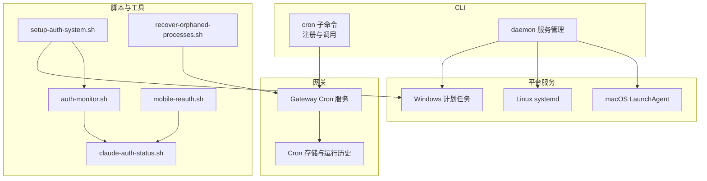
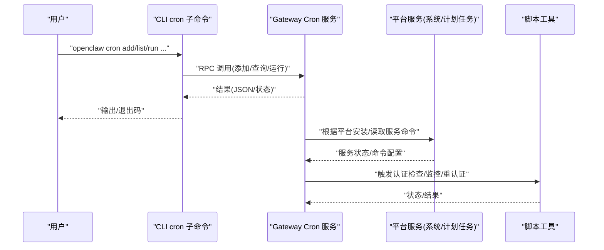
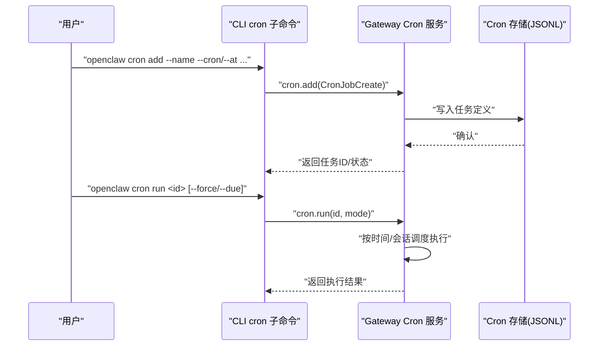
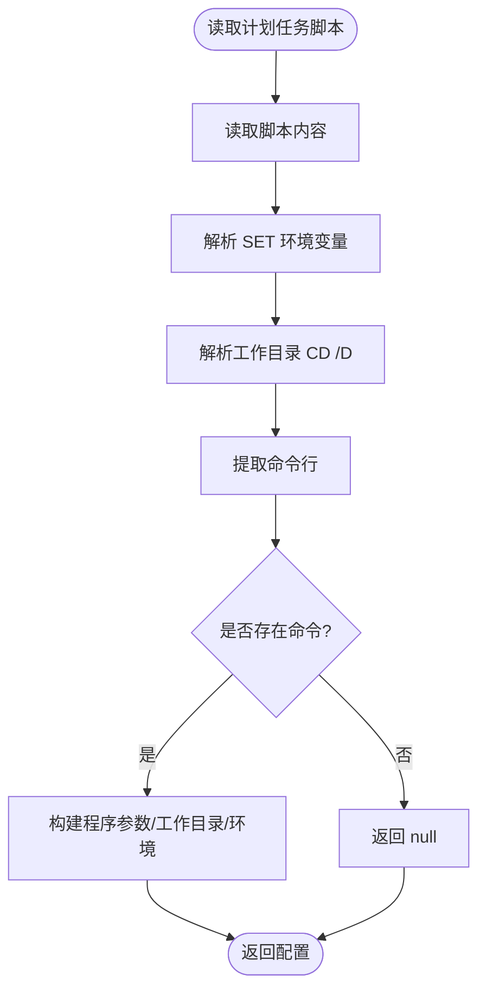
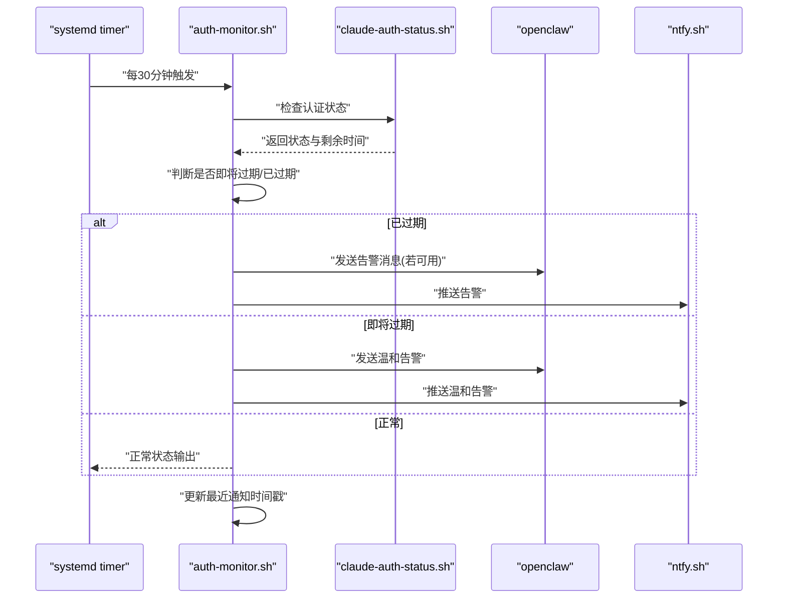
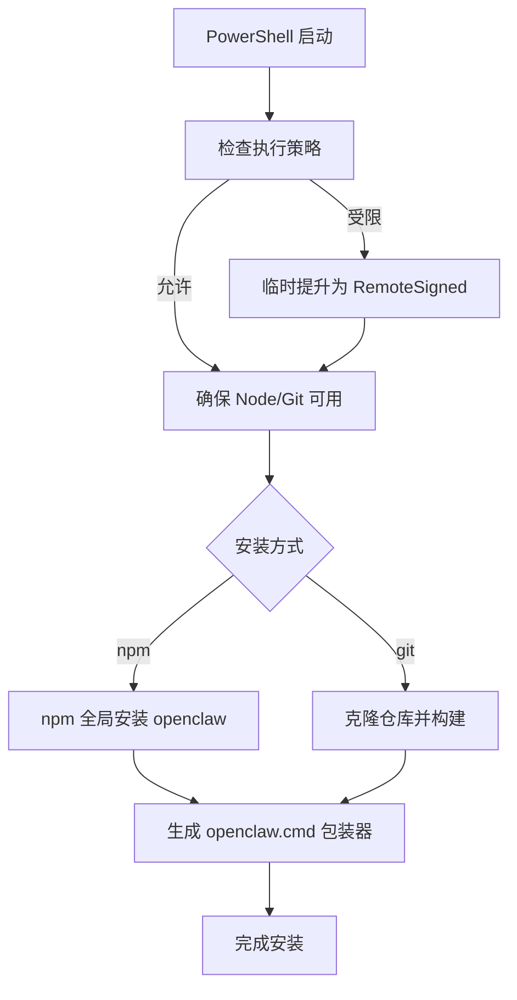
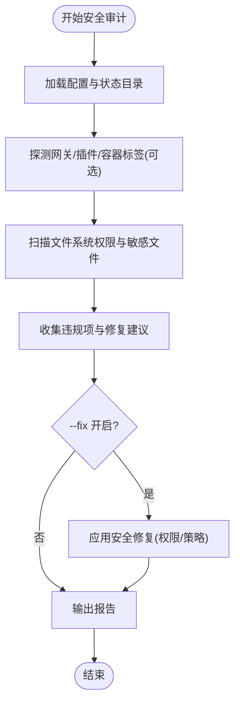
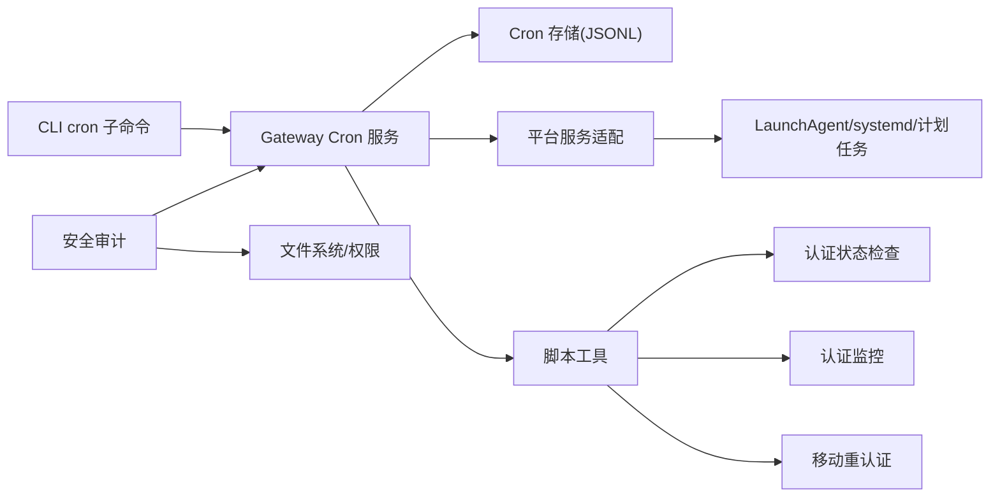

# 批量操作与自动化

<cite>
**本文引用的文件**
- [scripts/auth-monitor.sh](file://scripts/auth-monitor.sh)
- [scripts/systemd/openclaw-auth-monitor.service](file://scripts/systemd/openclaw-auth-monitor.service)
- [scripts/systemd/openclaw-auth-monitor.timer](file://scripts/systemd/openclaw-auth-monitor.timer)
- [scripts/setup-auth-system.sh](file://scripts/setup-auth-system.sh)
- [scripts/claude-auth-status.sh](file://scripts/claude-auth-status.sh)
- [scripts/mobile-reauth.sh](file://scripts/mobile-reauth.sh)
- [scripts/recover-orphaned-processes.sh](file://scripts/recover-orphaned-processes.sh)
- [scripts/install.ps1](file://scripts/install.ps1)
- [src/daemon/schtasks.ts](file://src/daemon/schtasks.ts)
- [src/daemon/schtasks.test.ts](file://src/daemon/schtasks.test.ts)
- [src/daemon/service.ts](file://src/daemon/service.ts)
- [src/daemon/service-types.ts](file://src/daemon/service-types.ts)
- [src/cli/cron-cli/register.ts](file://src/cli/cron-cli/register.ts)
- [src/cli/cron-cli/register.cron-add.ts](file://src/cli/cron-cli/register.cron-add.ts)
- [src/cli/cron-cli/register.cron-simple.ts](file://src/cli/cron-cli/register.cron-simple.ts)
- [src/gateway/server-cron.ts](file://src/gateway/server-cron.ts)
- [src/cron/service.ts](file://src/cron/service.ts)
- [docs/automation/cron-jobs.md](file://docs/automation/cron-jobs.md)
- [docs/automation/cron-vs-heartbeat.md](file://docs/automation/cron-vs-heartbeat.md)
- [docs/help/scripts.md](file://docs/help/scripts.md)
- [docs/cli/cron.md](file://docs/cli/cron.md)
- [docs/cli/daemon.md](file://docs/cli/daemon.md)
- [docs/start/wizard-cli-automation.md](file://docs/start/wizard-cli-automation.md)
- [docs/refactor/strict-config.md](file://docs/refactor/strict-config.md)
- [docs/security/README.md](file://docs/security/README.md)
- [docs/cli/security.md](file://docs/cli/security.md)
- [src/security/audit.ts](file://src/security/audit.ts)
- [src/security/fix.test.ts](file://src/security/fix.test.ts)
- [src/security/audit-extra.async.ts](file://src/security/audit-extra.async.ts)
</cite>

## 目录
1. [简介](#简介)
2. [项目结构](#项目结构)
3. [核心组件](#核心组件)
4. [架构总览](#架构总览)
5. [详细组件分析](#详细组件分析)
6. [依赖关系分析](#依赖关系分析)
7. [性能考量](#性能考量)
8. [故障排查指南](#故障排查指南)
9. [结论](#结论)
10. [附录](#附录)

## 简介
本文件面向运维与开发团队，系统性梳理 OpenClaw 的批量操作与自动化能力，覆盖以下主题：
- 批量命令与批量配置更新、批量服务管理、批量部署
- 自动化脚本（Bash、PowerShell、Python）的编写与执行
- 任务调度与定时执行（Cron 与系统任务计划器集成）
- 运维自动化工作流（部署流水线、监控告警、故障自愈）
- 安全与合规（权限控制、审计日志、回滚策略）

## 项目结构
OpenClaw 将自动化能力分布在多个层面：
- CLI 层：cron 子命令、守护进程与服务管理命令
- 网关层：内置 Cron 调度器与心跳机制
- 平台适配层：macOS LaunchAgent、Linux systemd、Windows 计划任务
- 脚本与工具：认证状态检查、监控告警、移动重认证、孤儿进程回收
- 文档与指引：定时任务参考、决策流程、安全审计与修复

**图表来源**
- [src/cli/cron-cli/register.ts:1-27](file://src/cli/cron-cli/register.ts#L1-L27)
- [src/gateway/server-cron.ts:144-166](file://src/gateway/server-cron.ts#L144-L166)
- [src/daemon/service.ts:67-119](file://src/daemon/service.ts#L67-L119)
- [scripts/auth-monitor.sh:1-90](file://scripts/auth-monitor.sh#L1-L90)
- [scripts/setup-auth-system.sh:1-120](file://scripts/setup-auth-system.sh#L1-L120)
- [scripts/claude-auth-status.sh:1-281](file://scripts/claude-auth-status.sh#L1-L281)
- [scripts/mobile-reauth.sh:1-85](file://scripts/mobile-reauth.sh#L1-L85)
- [scripts/recover-orphaned-processes.sh:1-192](file://scripts/recover-orphaned-processes.sh#L1-L192)

**章节来源**
- [src/cli/cron-cli/register.ts:1-27](file://src/cli/cron-cli/register.ts#L1-L27)
- [src/gateway/server-cron.ts:144-166](file://src/gateway/server-cron.ts#L144-L166)
- [src/daemon/service.ts:67-119](file://src/daemon/service.ts#L67-L119)
- [scripts/auth-monitor.sh:1-90](file://scripts/auth-monitor.sh#L1-L90)
- [scripts/setup-auth-system.sh:1-120](file://scripts/setup-auth-system.sh#L1-L120)
- [scripts/claude-auth-status.sh:1-281](file://scripts/claude-auth-status.sh#L1-L281)
- [scripts/mobile-reauth.sh:1-85](file://scripts/mobile-reauth.sh#L1-L85)
- [scripts/recover-orphaned-processes.sh:1-192](file://scripts/recover-orphaned-processes.sh#L1-L192)

## 核心组件
- CLI cron 子命令：提供添加、列出、运行、启用/禁用、查看运行历史等能力，通过网关 RPC 调用实现。
- Gateway Cron 服务：持久化 Cron 任务，按时间触发并在主会话或隔离会话中执行，支持“立即唤醒”和“下次心跳”。
- 平台服务适配：统一抽象 macOS LaunchAgent、Linux systemd、Windows 计划任务，用于安装、卸载、启动、停止与读取命令配置。
- 认证与监控：认证状态检查、定时告警通知、移动端重认证、孤儿进程回收。
- 安全审计与修复：文件权限、敏感信息脱敏、通道安全、自动修复建议。

**章节来源**
- [src/cli/cron-cli/register.cron-add.ts:1-59](file://src/cli/cron-cli/register.cron-add.ts#L1-L59)
- [src/cli/cron-cli/register.cron-simple.ts:51-109](file://src/cli/cron-cli/register.cron-simple.ts#L51-L109)
- [src/gateway/server-cron.ts:144-166](file://src/gateway/server-cron.ts#L144-L166)
- [src/daemon/service.ts:67-119](file://src/daemon/service.ts#L67-L119)
- [scripts/claude-auth-status.sh:1-281](file://scripts/claude-auth-status.sh#L1-L281)
- [scripts/auth-monitor.sh:1-90](file://scripts/auth-monitor.sh#L1-L90)
- [scripts/mobile-reauth.sh:1-85](file://scripts/mobile-reauth.sh#L1-L85)
- [scripts/recover-orphaned-processes.sh:1-192](file://scripts/recover-orphaned-processes.sh#L1-L192)
- [src/security/audit.ts:87-1129](file://src/security/audit.ts#L87-L1129)

## 架构总览
OpenClaw 的自动化由“CLI → 网关 → 平台服务/脚本”的链路构成。CLI cron 子命令负责用户交互与参数解析；网关 Cron 服务负责任务调度与执行；平台服务适配负责系统级服务生命周期；脚本工具负责认证、监控、重认证与诊断。

**图表来源**
- [src/cli/cron-cli/register.ts:1-27](file://src/cli/cron-cli/register.ts#L1-L27)
- [src/gateway/server-cron.ts:144-166](file://src/gateway/server-cron.ts#L144-L166)
- [src/daemon/service.ts:67-119](file://src/daemon/service.ts#L67-L119)
- [scripts/claude-auth-status.sh:1-281](file://scripts/claude-auth-status.sh#L1-L281)
- [scripts/auth-monitor.sh:1-90](file://scripts/auth-monitor.sh#L1-L90)

## 详细组件分析

### 组件A：CLI cron 子命令与网关 Cron 服务
- CLI 注册：提供 cron status、list、add、run、enable/disable、edit、runs 等子命令，统一通过网关 RPC 调用。
- 网关 Cron：持久化存储于用户目录下的 cron 存储路径，支持“主会话”和“隔离会话”，可选择是否广播摘要。
- 运行模式：支持立即运行(force)与仅到期运行(due)，并记录运行历史。

**图表来源**
- [src/cli/cron-cli/register.cron-add.ts:1-59](file://src/cli/cron-cli/register.cron-add.ts#L1-L59)
- [src/cli/cron-cli/register.cron-simple.ts:51-109](file://src/cli/cron-cli/register.cron-simple.ts#L51-L109)
- [src/gateway/server-cron.ts:144-166](file://src/gateway/server-cron.ts#L144-L166)
- [src/cron/service.ts:1-60](file://src/cron/service.ts#L1-L60)

**章节来源**
- [src/cli/cron-cli/register.ts:1-27](file://src/cli/cron-cli/register.ts#L1-L27)
- [src/cli/cron-cli/register.cron-add.ts:1-59](file://src/cli/cron-cli/register.cron-add.ts#L1-L59)
- [src/cli/cron-cli/register.cron-simple.ts:51-109](file://src/cli/cron-cli/register.cron-simple.ts#L51-L109)
- [src/gateway/server-cron.ts:144-166](file://src/gateway/server-cron.ts#L144-L166)
- [src/cron/service.ts:1-60](file://src/cron/service.ts#L1-L60)
- [docs/automation/cron-jobs.md:1-50](file://docs/automation/cron-jobs.md#L1-L50)
- [docs/automation/cron-vs-heartbeat.md:1-207](file://docs/automation/cron-vs-heartbeat.md#L1-L207)

### 组件B：平台服务适配与系统任务计划器
- 统一接口：抽象出安装、卸载、启动、停止、读取命令配置等操作，分别针对 macOS、Linux、Windows。
- Windows 计划任务：解析 CMD 脚本中的环境变量、工作目录与命令行，提取执行参数与运行时配置。
- 测试覆盖：对带空格参数、无命令、脚本不存在等边界条件进行测试。

**图表来源**
- [src/daemon/schtasks.ts:63-115](file://src/daemon/schtasks.ts#L63-L115)
- [src/daemon/schtasks.test.ts:172-202](file://src/daemon/schtasks.test.ts#L172-L202)
- [src/daemon/service.ts:67-119](file://src/daemon/service.ts#L67-L119)
- [src/daemon/service-types.ts:1-39](file://src/daemon/service-types.ts#L1-L39)

**章节来源**
- [src/daemon/schtasks.ts:63-115](file://src/daemon/schtasks.ts#L63-L115)
- [src/daemon/schtasks.test.ts:172-202](file://src/daemon/schtasks.test.ts#L172-L202)
- [src/daemon/service.ts:67-119](file://src/daemon/service.ts#L67-L119)
- [src/daemon/service-types.ts:1-39](file://src/daemon/service-types.ts#L1-L39)

### 组件C：认证监控与自动化脚本
- 认证监控：周期性检查 Claude Code 与 OpenClaw 认证状态，支持通过 OpenClaw 消息与 ntfy.sh 推送告警，避免频繁重复通知。
- 设置系统：一键设置长效令牌、安装 systemd 计时器、配置通知渠道，生成快速重认证与诊断脚本。
- 移动重认证：移动端友好流程，指导从手机浏览器复制 API Key 并完成长期令牌设置。
- 孤儿进程回收：扫描可能遗留的编码代理进程，输出 JSON 包含 PID、命令、工作目录与启动时间，并进行敏感信息脱敏。

**图表来源**
- [scripts/systemd/openclaw-auth-monitor.timer:1-11](file://scripts/systemd/openclaw-auth-monitor.timer#L1-L11)
- [scripts/systemd/openclaw-auth-monitor.service:1-14](file://scripts/systemd/openclaw-auth-monitor.service#L1-L14)
- [scripts/auth-monitor.sh:1-90](file://scripts/auth-monitor.sh#L1-L90)
- [scripts/claude-auth-status.sh:1-281](file://scripts/claude-auth-status.sh#L1-L281)

**章节来源**
- [scripts/auth-monitor.sh:1-90](file://scripts/auth-monitor.sh#L1-L90)
- [scripts/setup-auth-system.sh:1-120](file://scripts/setup-auth-system.sh#L1-L120)
- [scripts/claude-auth-status.sh:1-281](file://scripts/claude-auth-status.sh#L1-L281)
- [scripts/mobile-reauth.sh:1-85](file://scripts/mobile-reauth.sh#L1-L85)
- [scripts/recover-orphaned-processes.sh:1-192](file://scripts/recover-orphaned-processes.sh#L1-L192)

### 组件D：PowerShell 安装器与跨平台部署
- Windows 安装器：支持 npm 与 git 两种安装方式，自动检测并调整执行策略，安装 Node/Git，处理 PATH，生成 openclaw.cmd 包装器。
- 跨平台部署：结合 systemd（Linux）、LaunchAgent（macOS）、计划任务（Windows）实现统一的服务生命周期管理。

**图表来源**
- [scripts/install.ps1:1-330](file://scripts/install.ps1#L1-L330)
- [src/daemon/service.ts:67-119](file://src/daemon/service.ts#L67-L119)

**章节来源**
- [scripts/install.ps1:1-330](file://scripts/install.ps1#L1-L330)
- [src/daemon/service.ts:67-119](file://src/daemon/service.ts#L67-L119)

### 组件E：安全审计与修复
- 审计范围：文件系统权限、敏感文件可见性、通道安全、网关探测等，支持深度扫描与缓存优化。
- 修复策略：自动收紧权限、切换白名单策略、开启敏感信息脱敏，不涉及密钥轮换与网络暴露变更。
- 测试覆盖：针对 POSIX 与 Windows ACL 的权限判定差异进行测试，确保合规。

**图表来源**
- [src/security/audit.ts:87-1129](file://src/security/audit.ts#L87-L1129)
- [src/security/audit-extra.async.ts:949-981](file://src/security/audit-extra.async.ts#L949-L981)
- [src/security/fix.test.ts:248-258](file://src/security/fix.test.ts#L248-L258)

**章节来源**
- [src/security/audit.ts:87-1129](file://src/security/audit.ts#L87-L1129)
- [src/security/audit-extra.async.ts:949-981](file://src/security/audit-extra.async.ts#L949-L981)
- [src/security/fix.test.ts:248-258](file://src/security/fix.test.ts#L248-L258)
- [docs/cli/security.md:43-72](file://docs/cli/security.md#L43-L72)
- [docs/security/README.md](file://docs/security/README.md)

## 依赖关系分析
- CLI 与网关：CLI cron 子命令通过 RPC 调用网关 Cron 服务，网关负责任务持久化与执行。
- 网关与平台服务：网关根据当前平台调用对应服务适配器，读取/安装服务命令配置。
- 脚本与系统：认证监控脚本通过 systemd 计时器或计划任务定期运行；移动重认证脚本与服务状态联动。
- 安全与配置：安全审计依赖配置快照与平台特性，修复策略遵循最小侵入原则。

**图表来源**
- [src/cli/cron-cli/register.ts:1-27](file://src/cli/cron-cli/register.ts#L1-L27)
- [src/gateway/server-cron.ts:144-166](file://src/gateway/server-cron.ts#L144-L166)
- [src/daemon/service.ts:67-119](file://src/daemon/service.ts#L67-L119)
- [scripts/claude-auth-status.sh:1-281](file://scripts/claude-auth-status.sh#L1-L281)
- [scripts/auth-monitor.sh:1-90](file://scripts/auth-monitor.sh#L1-L90)
- [scripts/mobile-reauth.sh:1-85](file://scripts/mobile-reauth.sh#L1-L85)
- [src/security/audit.ts:87-1129](file://src/security/audit.ts#L87-L1129)

**章节来源**
- [src/cli/cron-cli/register.ts:1-27](file://src/cli/cron-cli/register.ts#L1-L27)
- [src/gateway/server-cron.ts:144-166](file://src/gateway/server-cron.ts#L144-L166)
- [src/daemon/service.ts:67-119](file://src/daemon/service.ts#L67-L119)
- [scripts/claude-auth-status.sh:1-281](file://scripts/claude-auth-status.sh#L1-L281)
- [scripts/auth-monitor.sh:1-90](file://scripts/auth-monitor.sh#L1-L90)
- [scripts/mobile-reauth.sh:1-85](file://scripts/mobile-reauth.sh#L1-L85)
- [src/security/audit.ts:87-1129](file://src/security/audit.ts#L87-L1129)

## 性能考量
- Cron 与心跳组合：高频检查合并到心跳批次，低频精确任务使用 Cron，降低模型调用成本与上下文碎片化。
- 存储与 IO：Cron 运行历史采用 JSONL 存储，避免大文件读写压力；审计缓存减少重复探测开销。
- 平台服务：优先使用原生计划器（systemd/timer、计划任务），减少第三方依赖与进程开销。
- 脚本健壮性：监控脚本限制通知频率、避免重复告警；重认证脚本提供移动端友好流程，减少人工干预。

[本节为通用指导，无需特定文件引用]

## 故障排查指南
- 认证过期/即将过期
  - 使用认证状态脚本检查 Claude Code 与 OpenClaw 认证状态，必要时通过移动重认证脚本完成长期令牌设置。
  - 若服务不可用，先检查通知渠道（OpenClaw 消息、ntfy.sh）是否可达。
- 计划任务未执行
  - 检查 systemd 计时器或 Windows 计划任务是否启用；核对服务单元中的环境变量与执行路径。
  - 对 Windows 计划任务，使用服务适配器解析脚本命令行，确认参数与工作目录。
- 孤儿进程
  - 使用孤儿进程回收脚本扫描并输出 JSON，定位遗留的编码代理进程，必要时手动清理。
- 权限问题
  - 使用安全审计与修复功能收紧敏感文件权限，避免世界可读/组可写；结合平台 ACL 判定确保合规。

**章节来源**
- [scripts/claude-auth-status.sh:1-281](file://scripts/claude-auth-status.sh#L1-L281)
- [scripts/mobile-reauth.sh:1-85](file://scripts/mobile-reauth.sh#L1-L85)
- [scripts/auth-monitor.sh:1-90](file://scripts/auth-monitor.sh#L1-L90)
- [scripts/recover-orphaned-processes.sh:1-192](file://scripts/recover-orphaned-processes.sh#L1-L192)
- [src/daemon/schtasks.ts:63-115](file://src/daemon/schtasks.ts#L63-L115)
- [src/security/audit.ts:87-1129](file://src/security/audit.ts#L87-L1129)

## 结论
OpenClaw 提供了从 CLI 到网关再到平台服务的完整自动化闭环，配合认证监控、移动重认证与安全审计，形成可批量、可观测、可恢复的运维体系。建议在生产环境中：
- 使用 Cron 与心跳组合，平衡精度与成本；
- 通过 systemd/timer 或计划任务实现稳定的服务生命周期；
- 借助安全审计与修复保持最小权限与敏感信息脱敏；
- 以脚本工具作为日常巡检与应急处置的抓手。

[本节为总结，无需特定文件引用]

## 附录
- 参考文档
  - [定时任务与心跳对比:1-207](file://docs/automation/cron-vs-heartbeat.md#L1-L207)
  - [定时任务快速开始:1-50](file://docs/automation/cron-jobs.md#L1-L50)
  - [CLI cron 参考](file://docs/cli/cron.md)
  - [CLI daemon 参考](file://docs/cli/daemon.md)
  - [Wizard CLI 自动化](file://docs/start/wizard-cli-automation.md)
  - [严格配置重构](file://docs/refactor/strict-config.md)
  - [脚本与工具说明](file://docs/help/scripts.md)
  - [安全审计与修复:43-72](file://docs/cli/security.md#L43-L72)

[本节为参考索引，无需特定文件引用]