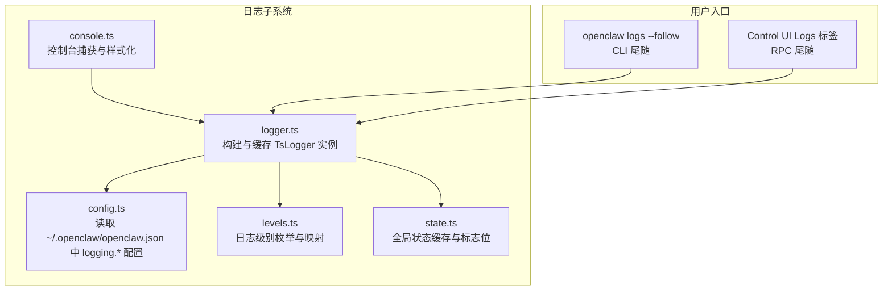
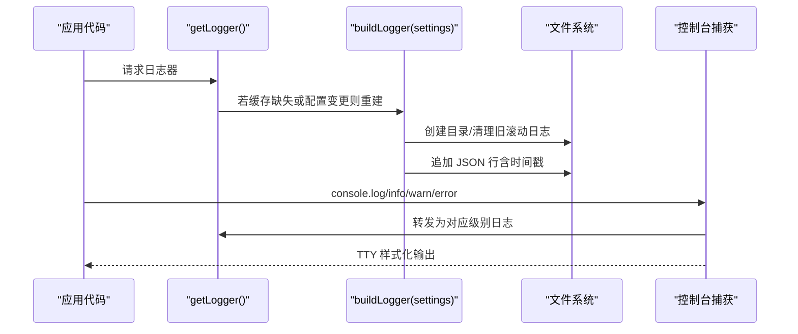
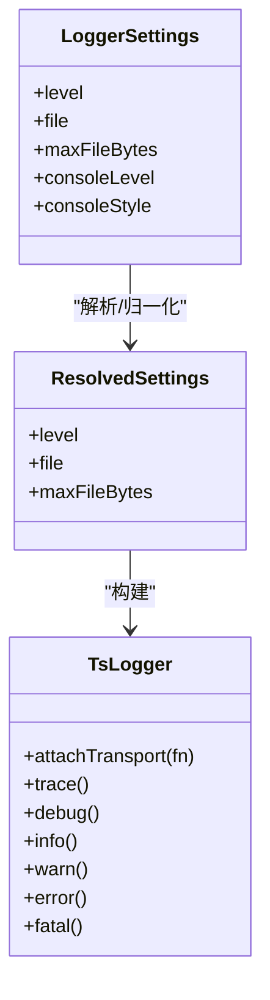
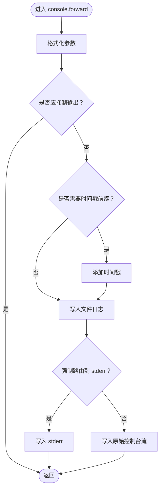
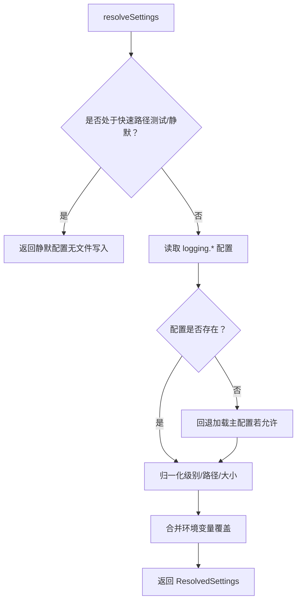
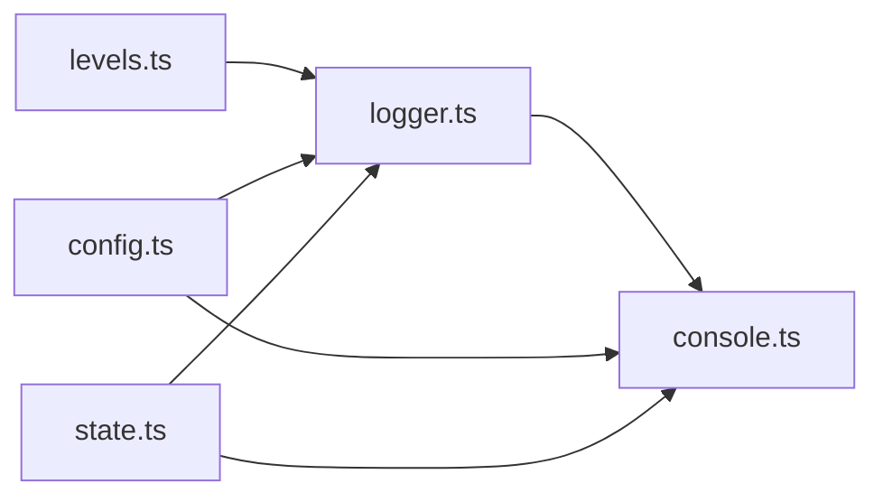

# 日志分析工具

<cite>
**本文引用的文件**
- [src/logging/logger.ts](file://src/logging/logger.ts)
- [src/logging/config.ts](file://src/logging/config.ts)
- [src/logging/levels.ts](file://src/logging/levels.ts)
- [src/logging/console.ts](file://src/logging/console.ts)
- [src/logging/state.ts](file://src/logging/state.ts)
- [src/logger.ts](file://src/logger.ts)
- [docs/logging.md](file://docs/logging.md)
- [docs/gateway/logging.md](file://docs/gateway/logging.md)
- [src/cli/daemon-cli/shared.ts](file://src/cli/daemon-cli/shared.ts)
- [src/commands/doctor-format.ts](file://src/commands/doctor-format.ts)
</cite>

## 目录
1. [简介](#简介)
2. [项目结构](#项目结构)
3. [核心组件](#核心组件)
4. [架构总览](#架构总览)
5. [详细组件分析](#详细组件分析)
6. [依赖关系分析](#依赖关系分析)
7. [性能考量](#性能考量)
8. [故障排除指南](#故障排除指南)
9. [结论](#结论)
10. [附录](#附录)

## 简介
本文件面向 OpenClaw 的日志分析与运维场景，系统性梳理日志子系统的架构、配置项、输出格式与存储位置，并给出日志采集、过滤与分析方法，覆盖命令行工具用法、日志文件结构与关键信息提取技巧。同时，针对不同组件（网关服务器、渠道插件、代理运行时、守护进程）的日志特点进行说明，提供性能监控、错误追踪与调试的最佳实践，并附带常见问题的诊断与排障流程。

## 项目结构
日志系统由“文件日志（JSON Lines）+ 控制台输出（TTY 友好）”构成，核心实现位于 src/logging 子目录，配置读取与环境变量覆盖在 docs 中有明确说明。命令行工具通过 openclaw logs 提供实时尾随查看能力；控制台与 Web 控制界面亦可直接查看滚动日志。

图表来源
- [src/logging/logger.ts:73-106](file://src/logging/logger.ts#L73-L106)
- [src/logging/console.ts:60-91](file://src/logging/console.ts#L60-L91)
- [src/logging/config.ts:8-24](file://src/logging/config.ts#L8-L24)
- [src/logging/levels.ts:1-38](file://src/logging/levels.ts#L1-L38)
- [src/logging/state.ts:1-20](file://src/logging/state.ts#L1-L20)

章节来源
- [docs/logging.md:10-114](file://docs/logging.md#L10-L114)
- [docs/gateway/logging.md:9-114](file://docs/gateway/logging.md#L9-L114)

## 核心组件
- 文件日志（JSON Lines）
  - 默认滚动文件：/tmp/openclaw/openclaw-YYYY-MM-DD.log（按本地时区日期分片）
  - 单文件路径：legacy 兼容路径
  - 写入策略：按行追加 JSON 对象，包含时间戳、级别、子系统等字段
  - 大小限制：默认最大 500 MB，超过后抑制写入并向 stderr 输出警告
  - 清理策略：保留最近 24 小时内的滚动日志，过期自动删除
- 控制台输出（TTY 友好）
  - 支持 pretty/compact/json 三种样式
  - 自动识别 TTY 并选择合适样式
  - 可独立设置 consoleLevel 与 consoleStyle
- 配置与覆盖
  - 配置文件：~/.openclaw/openclaw.json 下 logging.* 字段
  - 环境变量：OPENCLAW_LOG_LEVEL 覆盖配置
  - CLI 全局选项：--log-level 覆盖环境变量
- 子系统日志
  - 控制台按子系统前缀分组显示，便于扫描
  - 支持子系统过滤与时间戳前缀控制

章节来源
- [src/logging/logger.ts:15-21](file://src/logging/logger.ts#L15-L21)
- [src/logging/logger.ts:126-184](file://src/logging/logger.ts#L126-L184)
- [src/logging/logger.ts:186-191](file://src/logging/logger.ts#L186-L191)
- [src/logging/logger.ts:323-347](file://src/logging/logger.ts#L323-L347)
- [src/logging/console.ts:50-58](file://src/logging/console.ts#L50-L58)
- [src/logging/console.ts:203-326](file://src/logging/console.ts#L203-L326)
- [docs/logging.md:103-141](file://docs/logging.md#L103-L141)
- [docs/gateway/logging.md:18-114](file://docs/gateway/logging.md#L18-L114)

## 架构总览
下图展示从应用到日志系统的调用链路与数据流：应用侧通过统一的 getLogger 获取日志器；文件日志由 TsLogger 附加传输层写入；控制台输出经 console.ts 捕获并格式化；配置解析与级别映射贯穿始终。

图表来源
- [src/logging/logger.ts:210-219](file://src/logging/logger.ts#L210-L219)
- [src/logging/logger.ts:126-184](file://src/logging/logger.ts#L126-L184)
- [src/logging/console.ts:203-326](file://src/logging/console.ts#L203-L326)

章节来源
- [src/logging/logger.ts:73-106](file://src/logging/logger.ts#L73-L106)
- [src/logging/console.ts:60-91](file://src/logging/console.ts#L60-L91)

## 详细组件分析

### 文件日志器（TsLogger 包装）
- 功能要点
  - 缓存与重建：根据配置变化动态重建日志器实例
  - 滚动与清理：按日期生成文件名，保留最近 24 小时，自动删除过期文件
  - 大小上限：超过 maxFileBytes 后抑制写入并输出警告
  - 结构化输出：每行 JSON 对象，包含时间戳、级别、消息等
- 关键行为
  - silent 级别：不写文件，仅转发到外部传输
  - 文件路径解析：默认滚动路径，支持自定义绝对路径
  - 外部传输：允许注册额外传输函数，不阻塞主流程

图表来源
- [src/logging/logger.ts:25-42](file://src/logging/logger.ts#L25-L42)
- [src/logging/logger.ts:73-106](file://src/logging/logger.ts#L73-L106)
- [src/logging/logger.ts:126-184](file://src/logging/logger.ts#L126-L184)

章节来源
- [src/logging/logger.ts:15-21](file://src/logging/logger.ts#L15-L21)
- [src/logging/logger.ts:126-184](file://src/logging/logger.ts#L126-L184)
- [src/logging/logger.ts:186-191](file://src/logging/logger.ts#L186-L191)
- [src/logging/logger.ts:323-347](file://src/logging/logger.ts#L323-L347)

### 控制台捕获与样式化
- 功能要点
  - 捕获 console.log/info/warn/error/debug/trace，统一写入文件日志
  - TTY 自适应：非 TTY 使用 compact，TTY 使用 pretty 或 json
  - 时间戳前缀：可选，避免重复时间戳
  - 抑制噪声：在非 verbose 模式下抑制特定前缀与慢监听告警
  - EPIPE 安全：安装错误处理器避免管道关闭导致崩溃
- 配置项
  - logging.consoleLevel：控制台级别
  - logging.consoleStyle：pretty/compact/json
  - OPENCLAW_LOG_LEVEL：环境变量覆盖
  - --log-level：CLI 全局选项覆盖

图表来源
- [src/logging/console.ts:250-326](file://src/logging/console.ts#L250-L326)
- [src/logging/console.ts:148-162](file://src/logging/console.ts#L148-L162)
- [src/logging/console.ts:169-178](file://src/logging/console.ts#L169-L178)

章节来源
- [src/logging/console.ts:50-58](file://src/logging/console.ts#L50-L58)
- [src/logging/console.ts:203-326](file://src/logging/console.ts#L203-L326)
- [src/logging/console.ts:148-162](file://src/logging/console.ts#L148-L162)

### 配置解析与级别映射
- 配置来源优先级
  - 代码内缓存覆盖（测试/快速路径）
  - ~/.openclaw/openclaw.json 中 logging.* 字段
  - 环境变量 OPENCLAW_LOG_LEVEL
  - CLI 全局选项 --log-level
- 级别映射
  - silent/fatal/error/warn/info/debug/trace
  - 与底层 TsLogger 的最小级别数值映射一致

图表来源
- [src/logging/logger.ts:73-106](file://src/logging/logger.ts#L73-L106)
- [src/logging/config.ts:8-24](file://src/logging/config.ts#L8-L24)
- [src/logging/levels.ts:21-23](file://src/logging/levels.ts#L21-L23)

章节来源
- [src/logging/config.ts:8-24](file://src/logging/config.ts#L8-L24)
- [src/logging/levels.ts:1-38](file://src/logging/levels.ts#L1-L38)
- [src/logging/logger.ts:73-106](file://src/logging/logger.ts#L73-L106)

### 子系统日志与 UI/CLI 集成
- 子系统前缀
  - 控制台按子系统分组，如 gateway、channels/whatsapp 等
  - 支持子系统过滤与颜色稳定
- CLI 与 Web
  - openclaw logs --follow 实时尾随
  - Control UI Logs 标签同样基于 RPC 尾随同一文件
- 守护进程提示
  - 在守护进程状态不可用时，CLI 会提示如何查看文件日志路径

章节来源
- [src/logger.ts:20-35](file://src/logger.ts#L20-L35)
- [docs/logging.md:40-81](file://docs/logging.md#L40-L81)
- [docs/gateway/logging.md:64-114](file://docs/gateway/logging.md#L64-L114)
- [src/cli/daemon-cli/shared.ts:124-159](file://src/cli/daemon-cli/shared.ts#L124-L159)
- [src/commands/doctor-format.ts:22-26](file://src/commands/doctor-format.ts#L22-L26)

## 依赖关系分析
- 组件耦合
  - logger.ts 依赖 levels.ts（级别）、config.ts（配置）、state.ts（缓存）
  - console.ts 依赖 logger.ts（获取日志器）、config.ts（配置）、state.ts（缓存）
- 外部依赖
  - 使用 tslog 作为底层日志库
  - 使用 Node fs/path 进行文件操作
- 循环依赖
  - 通过模块化拆分避免循环导入；state.ts 作为共享状态容器

图表来源
- [src/logging/logger.ts:1-14](file://src/logging/logger.ts#L1-L14)
- [src/logging/console.ts:1-12](file://src/logging/console.ts#L1-L12)
- [src/logging/config.ts:1-6](file://src/logging/config.ts#L1-L6)
- [src/logging/levels.ts:1-9](file://src/logging/levels.ts#L1-L9)
- [src/logging/state.ts:1-20](file://src/logging/state.ts#L1-L20)

章节来源
- [src/logging/logger.ts:1-14](file://src/logging/logger.ts#L1-L14)
- [src/logging/console.ts:1-12](file://src/logging/console.ts#L1-L12)
- [src/logging/config.ts:1-6](file://src/logging/config.ts#L1-L6)
- [src/logging/levels.ts:1-9](file://src/logging/levels.ts#L1-L9)
- [src/logging/state.ts:1-20](file://src/logging/state.ts#L1-L20)

## 性能考量
- 文件写入
  - 每条日志为单行 JSON，I/O 成本低
  - 达到大小上限后抑制写入，避免磁盘压力激增
  - 滚动日志自动清理，减少磁盘占用
- 控制台输出
  - TTY 自适应样式，避免冗余渲染
  - 抑制噪声输出，降低终端压力
- 级别控制
  - file 与 console 级别可独立设置，避免不必要的控制台开销
- 导出与采样
  - OTLP 导出建议在采集端进行采样与过滤，避免高吞吐场景下的网络与存储压力

## 故障排除指南
- 常见症状与定位
  - 网关不可达：先执行诊断命令，再检查日志路径与守护进程状态
  - 日志为空：确认网关正在运行且写入路径正确
  - 需要更详细信息：提升 file 日志级别至 debug 或 trace
- 快速排查步骤
  - 查看守护进程状态与日志路径提示
  - 使用 CLI 实时尾随日志，观察 meta/log/notice/raw 类型事件
  - 检查环境变量与配置文件覆盖关系
- 常见问题
  - EPIPE 错误：控制台捕获已处理异步 EPIPE，避免崩溃
  - 大小上限触发：关注文件大小与警告输出，必要时调整上限或启用滚动

章节来源
- [docs/logging.md:347-353](file://docs/logging.md#L347-L353)
- [src/cli/daemon-cli/shared.ts:124-159](file://src/cli/daemon-cli/shared.ts#L124-L159)
- [src/logging/console.ts:164-167](file://src/logging/console.ts#L164-L167)
- [src/logging/logger.ts:156-171](file://src/logging/logger.ts#L156-L171)

## 结论
OpenClaw 的日志系统以“文件 JSON Lines + 控制台 TTY 友好输出”为核心，通过清晰的配置项与环境变量覆盖机制，满足开发调试与生产运维的不同需求。结合 CLI 与 Web 控制界面的实时尾随能力，以及子系统日志与抑制策略，能够高效地完成日志收集、过滤与分析。建议在高吞吐场景中配合 OTLP 采集端采样与过滤，确保可观测性与性能平衡。

## 附录

### 日志级别与输出格式
- 级别顺序（从高到低）：silent → fatal → error → warn → info → debug → trace
- 文件格式：每行一个 JSON 对象，包含时间戳、级别、消息等字段
- 控制台样式：pretty（彩色、人类可读）、compact（紧凑）、json（逐行 JSON）

章节来源
- [src/logging/levels.ts:1-38](file://src/logging/levels.ts#L1-L38)
- [docs/logging.md:84-96](file://docs/logging.md#L84-L96)
- [docs/gateway/logging.md:18-52](file://docs/gateway/logging.md#L18-L52)

### 配置参考（摘自文档）
- logging.level：文件日志级别
- logging.consoleLevel：控制台级别
- logging.consoleStyle：pretty/compact/json
- logging.file：自定义文件路径（默认滚动）
- OPENCLAW_LOG_LEVEL：环境变量覆盖
- --log-level：CLI 全局选项覆盖

章节来源
- [docs/logging.md:103-141](file://docs/logging.md#L103-L141)